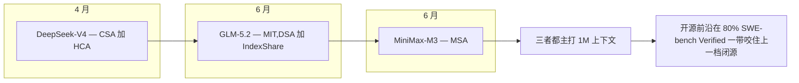
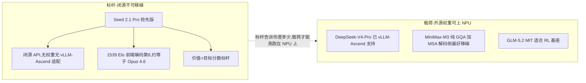
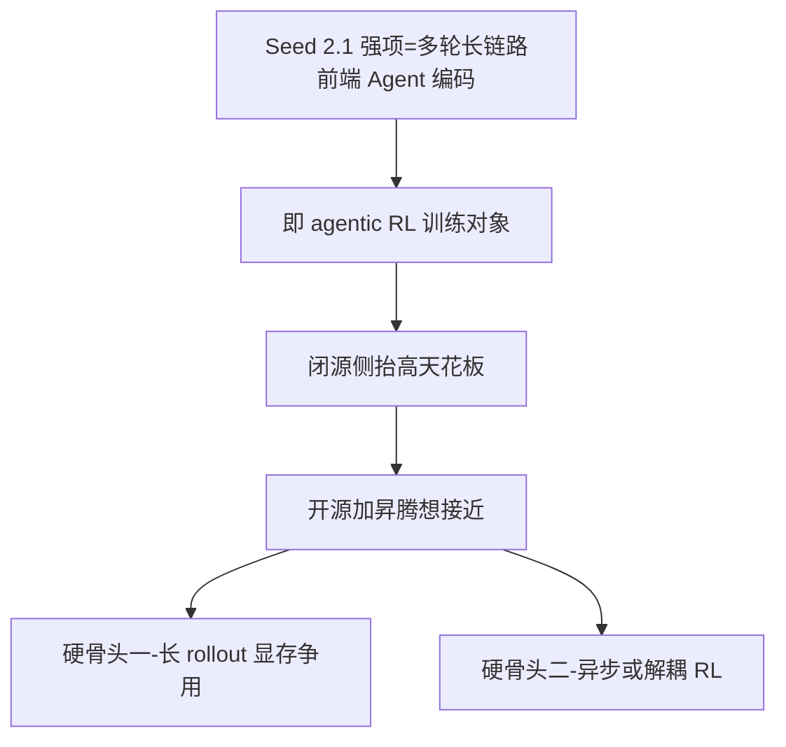

# Dispatch 01 · Seed 2.1 与开源 1M 上下文浪潮

*2026-06-23 · NPU Frontier Dispatch · frontier / Seed 2.1 / RL-on-NPU*

> **TL;DR** — ByteDance 的 **Seed 2.1 Pro 抢先版**(6 月 19 日)在 LMArena 的 Code-Arena 前端榜以 **1539 Elo** 排到全球第 8,水平约等于 Claude Opus 4.6。但它是**闭源 API 模型、没有 Ascend 移植**——它定义的是"要追的标杆",而不是"能跑在 NPU 上的模型"。对 RL-on-NPU 真正有用的,仍是同期那批**开源权重**的 1M 上下文模型(DeepSeek-V4 / MiniMax-M3 / GLM-5.2)。

这是本看板的第一期"前沿观察"(Dispatch)。计划每隔一段时间做一次这样的横向总结:把新出的模型/论文放进统一对比,再回答同一个问题——**它对"在昇腾 NPU 上做高效 RL 训练"这件事意味着什么?**

---

## 1 · 本期发生了什么

- **Seed 2.1 Pro(抢先版)· 6 月 19 日**:ByteDance Seed 团队把 Seed-2.1-Pro-Preview 放上了 LMArena 的 Code Arena 试用。前端编码子榜 **1539 Elo,全球第 8**,与 Anthropic 旗舰 **Claude Opus 4.6** 同档;React、品牌营销、数据分析工具等 7 个子类里有 5 个进全球前十。完整基准(AIME / SWE-bench / GPQA 等)官方说"未来几周"随正式版放出。
- **开源权重浪潮继续**:6 月里 **GLM-5.2(MIT)**、**MiniMax-M3 + MSA** 相继开放权重,都主打 1M 上下文;叠加 4 月的 **DeepSeek-V4**,开源前沿在 80% 的 SWE-bench Verified 一带已经咬住了上一档闭源模型。

**开源前沿如何咬住闭源:1M 上下文 + 80% SWE-bench。** 2026 上半年开源权重侧在两条战线上同时把差距压到"上一档闭源"的射程内。**长上下文——三家都上 1M,但走了三条不同注意力路线**:DeepSeek-V4(4 月)用 CSA + HCA 混合注意力,在长序列上兼顾稀疏检索性与局部稠密性,也是三家里最早完成 vLLM-Ascend 适配的;GLM-5.2(6 月,MIT)用 DSA + IndexShare,以可索引共享降低长上下文下的 KV 与计算开销;MiniMax-M3(6 月)用 MSA,解码侧本质上贴近**纯 GQA**,在 NPU 解码路径上是三家里最省、最好移植的一个——三条路线殊途同归,把 1M 上下文从"闭源专属卖点"变成开源可复现、可自托管的能力。**编码能力——SWE-bench Verified 咬在 80% 一带**:provisional 口径下 DeepSeek-V4-Pro ~80.6、MiniMax-M3 ~80.5、GLM-5.2 的 5 系 ~77.8,已顶在上一代闭源旗舰(Seed 2.0 Pro ~76.5)之上、向当前前沿逼近,差距还在但不再是代差。**为什么这对"昇腾上做 RL"是实打实的利好**:RL 后训练需要一个够强、且你能完全掌控的基座(基座越接近前沿,RL 提升的起点越高、空间越实用;"能掌控"意味着权重开放、可托管、可改 attention、可做奖励塑形),过去"强 + 可控"很难同时满足(强的都闭源),现在开源前沿同时给齐了 1M 长上下文、80% 一带的编码能力、以及 MIT/开放权重的可改性——**第一次,我们既能拿到接近闭源标杆的能力,又能把它整个搬上 910B 去做 RL**。

## 2 · 把 Seed 放进对比

Seed 2.1 的完整跑分还没公布,所以对比里我用**两行**来诚实呈现:Seed **2.0 Pro** 的 2 月确证数字作为能力基线,Seed **2.1 Pro 抢先版**只填它唯一公开的 Code-Arena 一项。

| 模型 | 类型 | SWE-bench Verified | AIME 2025 | GPQA Diamond | 输出价 $/1M | Code-Arena 前端 |
|---|---|---|---|---|---|---|
| **Seed 2.1 Pro**(抢先版) | 闭源 API | 待公布 | 待公布 | 待公布 | — | **1539 Elo(第 8)** |
| Seed 2.0 Pro | 闭源 API | 76.5 | 98.3 | 88.9 | $2.37 | — |
| DeepSeek-V4-Pro | 开源权重 | 80.6 | — | 90.1 | $3.48 | — |
| MiniMax-M3 | 开源权重 | 80.5 | — | 92.7 | ~$1.20 | — |
| GLM-5.2 | 开源 (MIT) | (5 系 ~77.8) | (5 系 98.0) | (5 系 94.0) | — | — |

> 数字均为厂商/媒体/第三方口径,**provisional**;各项覆盖度不同,以官方报告为准。完整可交互版见 **Overview** 顶部的对比组件(已新增 Seed 行与一个 *Code Arena · Frontend* 指标)。

读法:Seed 2.0 Pro 当年是实打实的前沿闭源模型(AIME 98.3、SWE 76.5);Seed 2.1 抢先版在**前端编码**这一窄口径上已经摸到 Opus 4.6 的高度。它很强,但强在一个**闭源、托管、调 API** 的形态里。

## 3 · 这对 RL-on-NPU 意味着什么

一句话:**Seed 2.1 是标杆,不是载荷。**

**标杆 vs 载荷:为什么这个区分重要。** 本看板对每个进入视野的模型只问一个问题:它对"在昇腾上做 RL"是**标杆(benchmark)**还是**载荷(payload)**?这两个角色在工程上完全不同。**标杆**是一个目标分数——你拿它定义"做到多好算追上前沿",但你对它什么也做不了:Seed 2.1 Pro 抢先版是闭源 API、没有公开权重、没有 vLLM-Ascend 适配路径,你不能把它加载到 910B 上、不能改它的 attention、不能在它上面跑 rollout、更不能对它做后训练,它在 RL pipeline 里既不能当 actor(生成轨迹)也不能当被训练的 policy、甚至当不了本地部署的 reward model/judge,它的全部价值就是那个数字(告诉你天花板在哪)。**载荷**则是你真正能搬上 NPU 折腾的东西:有开放权重、能被推理框架加载、attention/KV-cache 实现可读可改、可作 rollout 引擎也可作被更新的 policy——DeepSeek-V4、MiniMax-M3、GLM-5.2 才是这一类。为什么必须划清这条线?因为"模型很强"和"模型对我们 NPU 工作有用"是两个正交维度、很容易被跑分榜单混为一谈:一个闭源 API 即便分数再高、对昇腾 RL 实验的边际贡献也只是"把目标线往上抬一格",而一个分数略低、但有权重、可托管、可改、已经能在 910B 上解码的开源模型,才是能进实验排期的对象。本看板的筛选标准很直接:**先看能不能放上昇腾跑 RL(载荷资格),再看分数(标杆价值)**。

- **不可移植**:闭源、仅 API,没有权重、也没有 vLLM-Ascend 适配。你没法把它当作在 910B 上做 RL rollout / 训练的对象。它的价值是"目标分数"——告诉你开源侧还差多少。
- **昇腾的现实载荷仍在开源侧**:真正能放到 NPU 上做 RL 后训练或评测的,是 **DeepSeek-V4**(已 vLLM-Ascend 支持)、**MiniMax-M3**(纯 GQA + MSA,解码侧最省、最好移植)、**GLM-5.2**(MIT 许可,适合做 RL 基座)。本看板的 *Ascend 就绪度* 徽标也只对这批亮灯。
- **"编码/Agent 强"恰好压在 RL 的痛点上**:Seed 2.1 的强项是多轮、长链路的前端/Agent 编码——这正是 agentic RL 的训练对象。它在闭源侧把天花板抬高,反向说明:**开源 + 昇腾**这条线如果想接近,绕不开 *长 rollout 的显存争用*(见 NPU 架构页的 "RL 显存争用" 视图)和 *异步/解耦 RL* 这两块硬骨头。

更细地讲,Seed 2.1 抢先版的强项不是单轮问答,而是**多轮长链路的前端/Agent 编码**(Code-Arena 前端榜 1539、7 个子类 5 个进前十),这恰恰是 **agentic RL** 的训练对象:模型在一个长 episode 里反复"读代码→改→跑→看反馈→再改",一条轨迹动辄几十轮、上下文持续累积——而这类任务的形态精准踩在昇腾做 RL 的两个最痛的系统瓶颈上。**痛点一:长 rollout 的显存争用**——agentic 轨迹每多一轮 KV cache 就单调膨胀,长链路下吃掉大块 HBM,雪上加霜的是 vLLM-Ascend 目前缺 sleep-mode 这类"训练阶段把推理引擎权重/缓存让出显存"的机制,导致同卡上 rollout(推理)+ 训练(更新)抢同一块 HBM,长 episode 越长争用越严重、batch 被迫缩小、吞吐塌方,前端/Agent 编码这种"长轮数 + 大上下文"任务正好把它放大到极限。**痛点二:异步/解耦 RL 的长尾轨迹**——agentic rollout 的轨迹长度高度不均(有的几轮收敛、有的几十轮还在折腾),同步 RL 下一个 step 必须等最慢轨迹跑完、长尾直接拖垮整批有效算力利用率,要救它就得上异步/解耦 RL(rollout 与训练分离、轨迹异步回收、off-policy 校正),而这套机制在昇腾栈上还远不成熟。连起来看:**闭源标杆越强,越是在证明"长链路 agentic 编码"是下一个值得 RL 攻坚的高地;而要在开源 + 昇腾这条线上接近它,绕不开显存争用和异步 RL 这两块系统硬骨头**——所以 Seed 2.1 对本看板的意义不是"又一个更强的模型",而是它把昇腾 RL 系统下一步该攻的方向标了出来。

**对比速查(provisional,含 NPU 角色):**

| 模型 | 类型 | SWE-bench Verified | GPQA | 输出价 | Ascend 就绪 | 对 NPU 的角色 |
|---|---|---|---|---|---|---|
| Seed 2.1 抢先版(6-19) | 闭源 API | 待公布(Code-Arena 1539 / 第8) | 待公布 | 待公布 | 否(仅 API,无权重) | **标杆**:定义目标分,抬天花板 |
| Seed 2.0 Pro | 闭源 API | 76.5 | 88.9 | $2.37 | 否 | 标杆(上一代基线,AIME 98.3) |
| DeepSeek-V4-Pro | 开源权重 | 80.6 | 90.1 | $3.48 | 是(已 vLLM-Ascend) | **载荷**:现成 rollout / 推理引擎 |
| MiniMax-M3 | 开源权重 | 80.5 | 92.7 | ~$1.20 | 易移植(纯 GQA+MSA) | **载荷**:最易移植,解码侧最优 |
| GLM-5.2 | 开源(MIT) | ~77.8(5系) | ~94.0 | — | 适配中 | **载荷**:最干净的 RL 基座(MIT,AIME ~98.0) |

> 数字均 provisional(厂商/媒体/第三方口径,彼此不完全可比),各模型基准覆盖度不同(Seed 2.1 抢先版完整 AIME/SWE-bench/GPQA 将随正式版未来几周放出,当前仅 Code-Arena Elo)。最关键的一条:**Seed 2.1 是标杆(闭源、不可上卡、只贡献目标分数),DeepSeek-V4 / MiniMax-M3 / GLM-5.2 三家才是载荷**——本看板按这条线筛选"对 NPU 有用"。

## 4 · 下一步看什么

1. **Seed 2.1 正式版的完整跑分**:尤其 SWE-bench Verified / Pro 与 AIME,看它相对 2.0 Pro 提了多少,以及和开源 80% 一带的真实差距。
2. **开源侧能否在 agentic/前端编码追上**:Code-Arena 这种多轮交互榜,是观察 agentic RL 是否真见效的好镜子。
3. **解码侧稀疏注意力的落地**:MSA / DSA / CSA 这类机制在 NPU 上重写后的数值漂移,是 *align-probe* 该盯的——也是开源模型能否在昇腾上稳定做 RL 的前提。

---

*下一期 Dispatch 会在又攒够一批新模型/论文后更新。来源:ByteDance Seed 官方博客与 LMArena 排名(Seed-2.1-Preview)、各模型技术报告/媒体报道(provisional)。*
