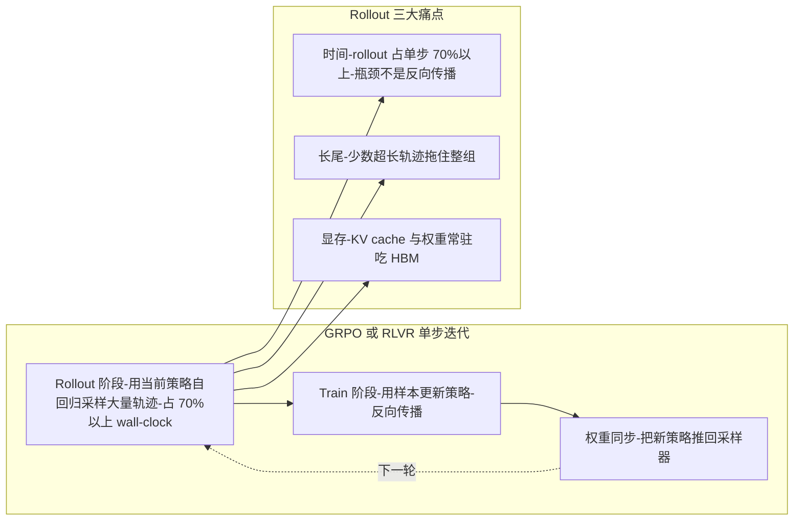
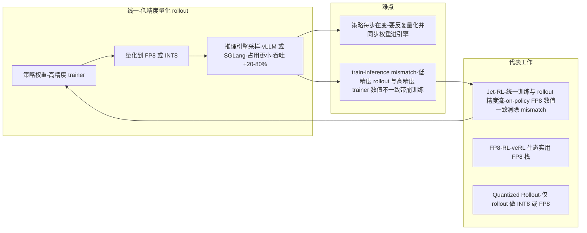
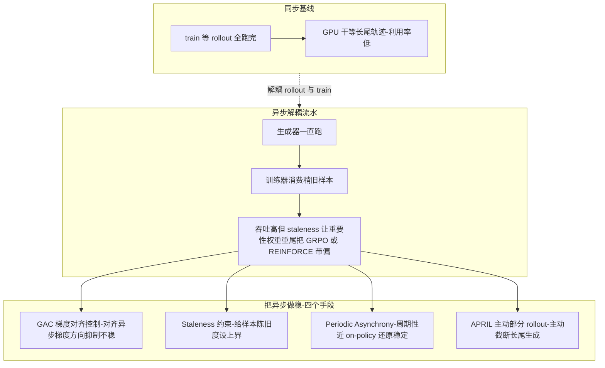
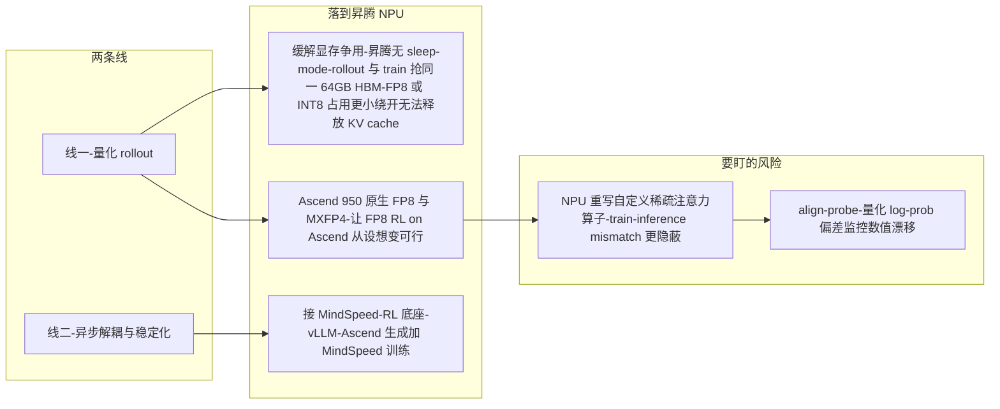

# Dispatch 02 · Rollout 是 RL 的瓶颈:FP8 量化与异步稳定化的双线突破

*2026-06-23 · NPU Frontier Dispatch · RL-systems / FP8 / async-RL / Ascend*

> **TL;DR** — 在 LLM 的 RL 后训练里,**rollout(生成样本)吃掉了超过 70% 的训练时间**。2026 上半年,一大批工作从两条线同时压这个瓶颈:**(1) 把 rollout 量化到 FP8/INT8**(Jet-RL、FP8-RL、Quantized Rollout,7B–32B 上吞吐 +20–80%),**(2) 异步解耦 + 稳定化**(GAC 梯度对齐、staleness 受限协调、周期性异步)。这两条线恰好都压在**昇腾的两个痛点**上:Ascend 950 的**原生 FP8** 和 910B 上**无 sleep-mode 的显存争用**。换句话说——RL 系统的研究风向,正在朝着对 NPU 最友好的方向走。

接上一期(Seed 2.1 与开源 1M 浪潮)。这期不看模型,看**训练系统**:RL 后训练这一年最热的工程主线是什么,以及它为什么对"在昇腾上做 RL"格外重要。

---

## 1 · 为什么所有人都在盯 rollout

一次 GRPO/RLVR 迭代分两段:**rollout**(用当前策略采样大量轨迹)和 **train**(用这些样本更新策略)。问题在于 rollout 是自回归生成,**慢、长尾、且占用大量显存**:

- **时间**:rollout 普遍占 RL 单步 **70% 以上**的 wall-clock——它才是真正的瓶颈,不是反向传播。
- **长尾**:同一 batch 里少数超长轨迹拖住整组(APRIL 等专门治这个)。
- **显存**:推理引擎的 KV cache + 权重要常驻;在 CUDA 上可以靠 vLLM 的 **sleep-mode** 在 train 阶段释放,**昇腾目前没有这个机制**(见 NPU 架构页的"RL 显存争用"视图)。

于是 2026 H1 的 RL 系统工作基本沿两条线展开。

### 为什么 rollout 占 70% 而不是反向传播

直觉上"训练"听起来该是计算最重的——反向传播要算梯度、过整个参数。但 RL 后训练里真正吃掉 70%+ wall-clock 的是 rollout 而非 train,这不是框架实现得烂,而是两阶段计算结构根本不同。**train 是一次性的大矩阵乘、compute-bound**:给定一个 batch 的轨迹,前向 + 反向是深度固定、可完全并行的稠密计算图,所有 token 的 loss 一次性算完、梯度沿计算图回流一次,把 Tensor Core 喂得很满(算术强度高、FLOPs 利用率高、瓶颈在算力本身)——这恰是加速卡最擅长的负载。**rollout 是自回归逐 token 生成、memory-bound**:生成第 t 个 token 必须等第 t-1 个算完(数据依赖,无法在序列维并行),每生成一个 token 只做一次很"瘦"的前向(decode 阶段 batch×1×hidden 的矩阵乘),算术强度极低、大部分时间花在把权重和 KV cache 从 HBM 搬进计算单元上,卡的算力此刻闲置、真正瓶颈是显存带宽;一条长度 L 的轨迹要串行跑 L 次 decode step,几十到上百步起跳。

放一起看,"采样比更新慢"是结构性的:① **串行步数差一个数量级**——train 对一个 batch 是 O(1) 次前向+反向,rollout 对同 batch 要 O(L) 次串行前向,生成越长(long-CoT 动辄上千 token)比例越悬殊;② **硬件利用率方向相反**——train compute-bound 卡跑得满,rollout decode 阶段 memory-bound 卡跑不满,同一块卡做 train 是顺风、做 rollout 是逆风;③ **长尾把整组拖住**——GRPO 一个 batch 内多条轨迹要一起进 train、存在同步点(barrier),batch 的 rollout 耗时不是平均值而是被最慢那条决定,少数超长轨迹拖着整组干等(APRIL 主动截断要治的就是这一环);④ **显存反向加剧 rollout**——推理引擎 KV cache 随生成长度线性增长、权重常驻,CUDA 上靠 vLLM sleep-mode 在 train 阶段释放推理侧显存,昇腾没有等价机制、rollout 与 train 在同一块 64GB HBM 上互抢,进一步压低 rollout 可用的 batch 和并发。结论:rollout 慢不是"没优化好",而是它是一个低算术强度、强串行、长尾敏感的负载,踩在加速卡最不擅长的点上——所以两条主线(FP8/INT8 量化攻 memory-bound 带宽瓶颈、异步解耦让生成器满负荷不被同步点拖住)都是冲着这个结构性瓶颈去的,而非优化已吃满算力的反向传播。

## 2 · 线一:把 rollout 量化下去(FP8 / INT8)

核心直觉:rollout 是推理,**推理可以用低精度**。难点是 RL 里**策略每步都在变**——要反复量化、把权重同步进推理引擎,还得防止低精度 rollout 与高精度 trainer 之间的 **train-inference mismatch** 把训练带崩。

| 工作 | 机制 | 收益 / 定位 |
|---|---|---|
| **Jet-RL** | 统一训练与 rollout 的精度流,做**on-policy FP8** RL | 让 FP8 rollout 与 trainer 数值一致,消除 mismatch |
| **FP8-RL** | veRL 生态里的实用 FP8 栈(FSDP/Megatron + vLLM/SGLang) | 工程+算法手段稳住 FP8 RL 循环 |
| **Quantized Rollout** | 仅对 rollout 做 INT8/FP8 量化 | 7B/14B/32B 上吞吐 **+20–80%** |

**train-inference mismatch:量化 rollout 的隐藏地雷。** rollout 本质是推理、推理用低精度是成熟手段——这正是线一的机会;但 RL 比纯推理更怕低精度,原因不在输出 token 而在 **logprob**。纯推理只关心输出 token(argmax 或采样落到哪个词),FP8 让某个 logit 抖动一点点、只要不翻转 top token 排序输出几乎不变,所以推理界敢大胆量化。RL 不一样,它要把 logprob 喂回梯度,GRPO/RLVR 的核心是重要性比 `ratio = π_new/π_old = exp(logπ_new − logπ_old)`:`π_old` 是 rollout 采样时用 FP8 推理引擎算的 logprob,`π_new` 是 trainer 用更高精度(BF16/FP32)重算同一条轨迹的 logprob,理论上同策略同轨迹两者应相等、ratio≈1。问题是 **ratio 对 logprob 之差指数敏感**:logprob 差 0.1 比值就偏约 10%,差 0.7 比值就翻倍;FP8 在采样侧引入的量化误差直接进入 `logπ_old`,而 trainer 侧 `logπ_new` 没有同一份误差——两侧用了不同数值路径,本该抵消的系统性偏差不再抵消,结果 ratio 整体失真、方差放大,GRPO 策略梯度被这个失真比值加权、方向和尺度都被污染,训练塌掉或不收敛。**这就是 train-inference mismatch:不是精度低本身有害,而是采样侧和训练侧精度/算子路径不一致才有害。** Jet-RL 正是对症——统一训练与 rollout 的精度流、做 on-policy FP8,让两侧走同一套量化逻辑、同一条数值路径,使 `logπ_old` 和 `logπ_new` 数值一致,一旦两侧量化误差是"同一份"它在 ratio 里相互抵消、mismatch 从根上消掉,而非事后用 clip/修正打补丁;FP8-RL 把这套能力落到 veRL 生态工程化;Quantized Rollout 走更克制的路线——只对 rollout 侧上 INT8/FP8、trainer 不变,以容忍可控 mismatch 换 +20-80% 吞吐。**NPU 还要多一层警惕**:昇腾上 FP8/稀疏注意力算子是**重写**的,采样侧和训练侧很可能不是同一份算子实现,mismatch 更隐蔽(表面 logprob 接近,细微数值路径差异在指数放大下仍可能毁掉 ratio),所以 NPU 上做量化 rollout 必须用 align-probe 显式验证两侧 logprob 一致性,而非假定"都叫 FP8 就一致"。

> 这条线的意义:rollout 既然占 70% 时间,把它的精度砍一半、吞吐翻倍,就是对整条 RL 管线最直接的提速。而 **Ascend 950 原生支持 FP8/MXFP4**——这恰好是把这套量化 rollout 搬到 NPU 的硬件前提。

## 3 · 线二:异步解耦,再把它稳住

另一条线干脆**把 rollout 和 train 解耦**成异步流水,让生成器一直跑、训练器消费稍旧的样本——吞吐上去了,但样本"陈旧"(staleness)会让重要性权重出现重尾、把 GRPO/REINFORCE 带偏。所以 2026 H1 的重点从"做异步"转向了"**把异步做稳**":

- **GAC(Gradient Alignment Control)**:对齐异步产生的梯度方向,抑制不稳定。
- **Staleness-Constrained Rollout Coordination**:给样本陈旧度设上界,在高异步度下保持可控。
- **Periodic Asynchrony**:用"周期性"的近 on-policy 方式拿异步的吞吐、还原 on-policy 的稳定。
- **APRIL(Active Partial Rollouts)**:主动截断长尾生成,治 rollout 的长尾拖累。

(这些与看板 RL 标签下已有的 Stable Asynchrony、RollMux、AsyncFlow、ROLL Flash 是同一条系统脉络。)

**异步的根本矛盾:吞吐 vs on-policy。** **同步 on-policy 最干净但利用率低**:标准 GRPO 一轮是全 batch rollout 完 → train → 再 rollout,样本永远来自当前策略、理论最干净,代价是同步点——rollout 阶段卡被长尾拖着干等、train 阶段推理引擎闲置,整体利用率被结构性压低。**异步解耦把吞吐拉上去但引入 off-policy**:生成器持续满负荷产样本,trainer 消费稍旧样本、不等生成器,卡利用率上去了,但 trainer 此刻用的样本来自几步之前的旧策略——这就是 **staleness**;staleness 一大,`π_old`(产样本的旧策略)和 `π_new`(当前训练策略)拉开,重要性比 `π_new/π_old` 分布变**重尾**(少数样本拿到极大权重、梯度估计方差爆炸、GRPO/REINFORCE 被带偏)。于是问题从"怎么做异步"变成"怎么把异步做稳",四个手段各压一环:**GAC** 压**方向**(不纠结样本新旧,在梯度层对齐 stale 样本和 on-policy 梯度方向);**Staleness 上界** 压**陈旧度本身**(给可消费样本设年龄上界,从源头限制重要性比能偏到多重尾);**Periodic Asynchrony** 压**累积漂移**(周期性拉回近 on-policy,不让 staleness 单调累积);**APRIL** 压**staleness 的来源**(长尾超长轨迹既拖慢 rollout 又是 staleness 主要制造者,主动截断同时缓解瓶颈和陈旧度)。核心工程旋钮是 **"够用阈值"**:允许多大 staleness?吞吐随允许的陈旧度上升,但重尾方差也随之上升,存在一个临界点——超过它训练带偏的损失盖过吞吐收益,调流水线的本质就是把这阈值卡在"样本够新到不毁梯度、又够异步到不浪费卡"的窗口里。

**两条线的对比速查(provisional):**

| 量化 rollout 工作 | 机制 | 收益 / 定位 |
|---|---|---|
| Jet-RL | 统一训练与 rollout 精度流,on-policy FP8,两侧同一套量化逻辑使数值一致 | 从根上消除 train-inference mismatch,而非事后修正 |
| FP8-RL | veRL 生态工程化(FSDP/Megatron 训练 + vLLM/SGLang 推理) | 把 FP8 RL 做成主流训练栈里可用的能力 |
| Quantized Rollout | 仅 rollout 侧 INT8/FP8、trainer 不变,容忍可控 mismatch 换吞吐 | 7B/14B/32B 吞吐 +20–80%,改动最小 |

| 异步稳定化手段 | 压的是哪一环 | 作用 |
|---|---|---|
| GAC(梯度对齐) | 梯度**方向**偏差 | 在梯度层对齐 stale 与 on-policy,校正陈旧带来的方向偏差 |
| Staleness 上界 | **陈旧度本身** | 限制可消费样本最大年龄,从源头压住重要性比重尾 |
| Periodic Asynchrony | **累积漂移** | 周期性拉回近 on-policy,阻止 staleness 单调累积 |
| APRIL(主动截断) | **staleness 来源 + 长尾** | 截断超长轨迹,同时缓解 rollout 瓶颈和陈旧度制造 |

> 数字均 provisional(论文自报,跨模型/序列长度/硬件不可直接外推);NPU 上必须用 align-probe 验证两侧 logprob 一致性(昇腾 FP8/稀疏注意力算子是重写实现,采样侧与训练侧可能不是同一份);MindSpeed-RL 是现成实验底座,两条线都可在其上做工程验证。

## 4 · 这对 RL-on-NPU 意味着什么

把两条线叠在昇腾的现实约束上,结论很顺:

- **量化 rollout 直接缓解显存争用**。昇腾没有 sleep-mode、rollout 与 train 抢同一份 64GB HBM;**FP8/INT8 的 rollout 占用更小**,等于绕开了一部分"无法释放 KV cache"的痛。这是把 GPU 上的量化-rollout 配方移植到 NPU 的**最高性价比方向**。
- **Ascend 950 的 FP8 让"FP8 RL on Ascend"从设想变可行**。Jet-RL/FP8-RL 这类配方 + 950 原生 FP8,是一个**高新颖度、低人做过**的选题。
- **但要盯数值漂移**。FP8 rollout、以及自定义稀疏注意力(DSA/MSA/CSA)在 NPU 上重写后,train-inference mismatch 会更隐蔽——这正是看板里 **align-probe** 这个想法该干的活:在 NPU 上量化 train-inference 的 log-prob 偏差。
- **MindSpeed-RL 是现成底座**。华为已开源的 MindSpeed-RL(910B、384-NPU 上跑过 DeepSeek-R1-671B)用 vLLM-Ascend 做生成、MindSpeed 做训练——量化 rollout 与异步稳定化,正好可以接在它上面做实验。

## 5 · 下一步看什么

1. **FP8 rollout 会不会成为 RL 框架的默认项**(veRL/ROLL/MindSpeed-RL 是否内置)。
2. **异步稳定化的"够用阈值"**:staleness 上界 / 周期性异步,究竟容忍多旧的样本还不掉点。
3. **有没有人在昇腾 950 上跑通端到端 FP8 RL** 并公布 train-inference 一致性数据——这会是 RL-on-NPU 最有说服力的一块拼图。

---

*来源:arXiv 上 2026 H1 的 RL 系统工作(Jet-RL 2601.14243、FP8-RL 2601.18150、Quantized Rollout 2602.13953、GAC 2603.01501、Staleness-Constrained Coordination 2601.12784、Periodic Asynchrony 2511.18871、APRIL 2509.18521)与 MindSpeed-RL(2507.19017);数字为论文自报,provisional。*
