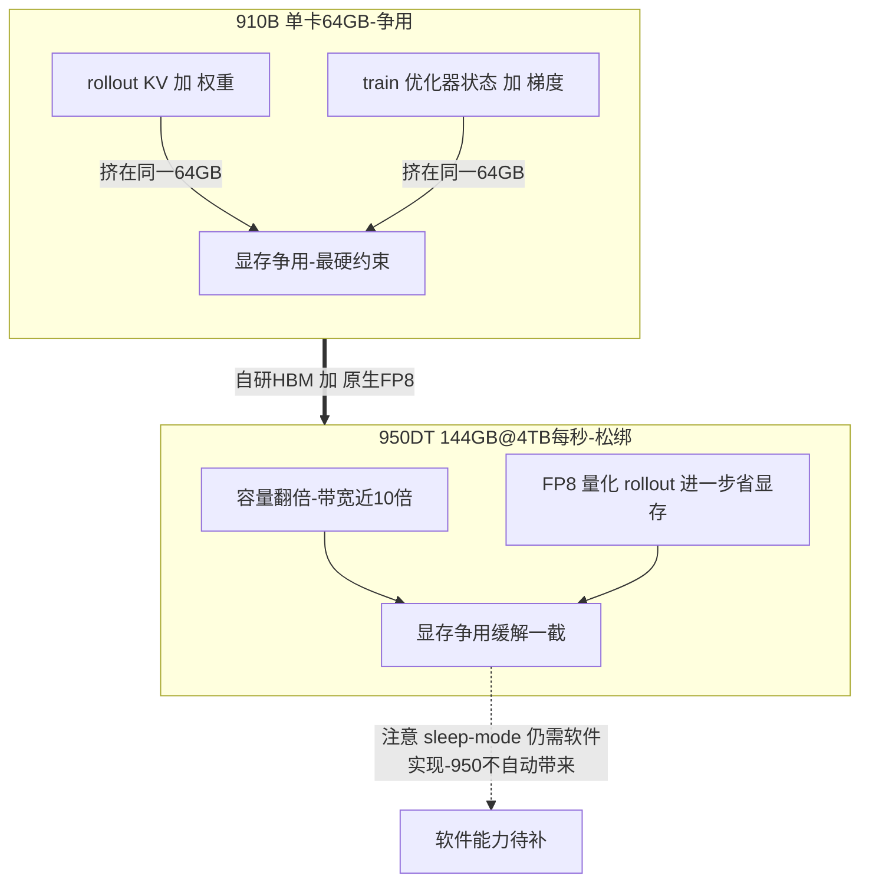
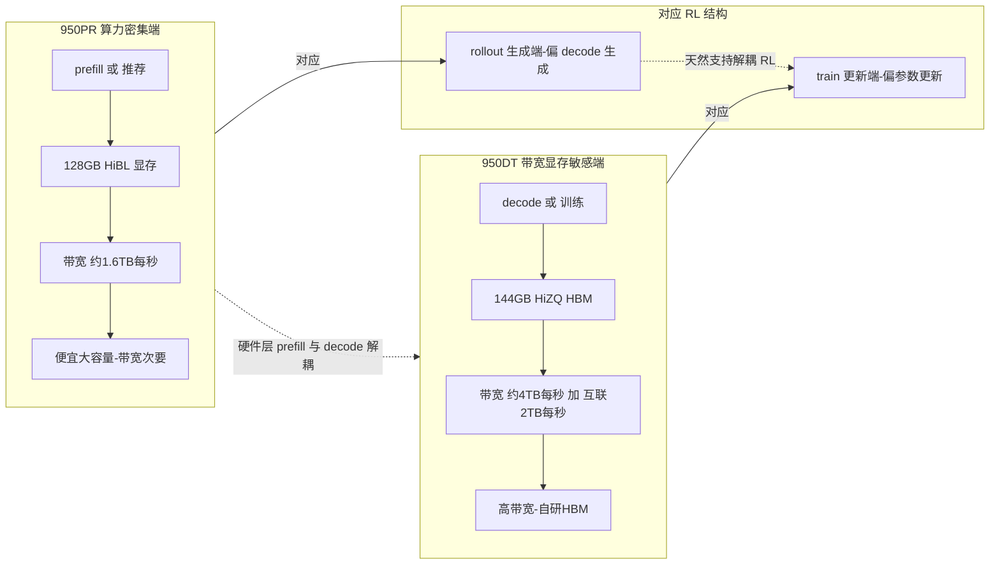
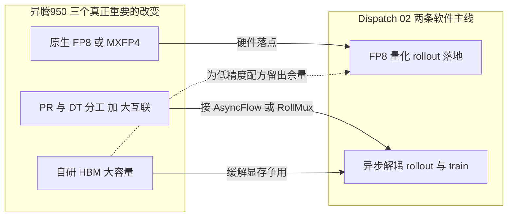
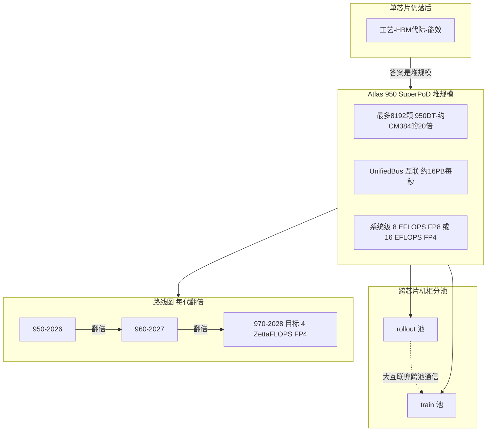

# Dispatch 03 · 昇腾 950 硬件深读:自研 HBM、原生 FP8,与 PR/DT 分工

*2026-06-23 · NPU Frontier Dispatch · hardware / Ascend 950 / FP8 / SuperPoD*

> **TL;DR** — 昇腾 950 是第一代**用华为自研 HBM、原生支持 FP8/MXFP4** 的 Ascend,并拆成两颗:**950PR**(prefill/推荐,~Q1 2026,128GB HiBL @ ~1.6TB/s)和 **950DT**(decode/训练,~Q4 2026,144GB HiZQ HBM @ ~4TB/s + 2TB/s 互联)。对"在昇腾上做 RL"这件事,三个改变最关键:**(1) 原生 FP8** 把上期 Dispatch 02 讲的"FP8 量化 rollout"从设想变可行;**(2) 自研 HBM + 更大容量/带宽**直接松绑 910B 上 rollout/train 抢 64GB 显存的死结;**(3) PR/DT 的硬件分工**天然对应 RL 里 rollout(生成)与 train(更新)的解耦。代价是:软件栈得跟上,且 950DT 要等到年底。

接 Dispatch 02(rollout 瓶颈)。上期说的两条软件主线——FP8 量化 rollout + 异步解耦——这期看它们的**硬件对应物**:昇腾 950 几乎是照着这两条线设计的。

---

## 1 · 规格速览

| | **Ascend 950PR** | **Ascend 950DT** | 910B(参照) |
|---|---|---|---|
| 定位 | prefill / 推荐 / 推理 | decode / 训练 | 训练 + 推理 |
| 上市 | ~2026 Q1 | ~2026 Q4 | 在售 |
| 显存 | 128 GB **HiBL 1.0** | 144 GB **HiZQ 2.0 HBM** | 64 GB HBM |
| 带宽 | ~1.6 TB/s | **~4 TB/s** | ~0.4 TB/s* |
| 互联 | — | ~2 TB/s | HCCS |
| 低精度 | FP8 / MXFP8 / HiF8 / **MXFP4** | 同左 | 无原生 FP8 |
| 算力 | ~1 PFLOPS FP8 / ~2 PFLOPS MXFP4 | 同量级 | — |

> 数字来自华为 Connect 2025 与分析师/媒体口径,**provisional**,以实际出货为准。`*` 910B 带宽口径各源不一。完整卡片见 **Ascend / NPU** 标签页(已补一张 *Atlas 950 SuperPoD* 卡)。

## 2 · 三个真正重要的改变

**① 自研 HBM——绕开卡脖子,顺带把显存做大。**
910B 时代,RL 最硬的约束是单卡 **64GB HBM**:rollout 的 KV cache + 权重和 train 的优化器状态+梯度挤在一起(看 NPU 架构页的"RL 显存争用"视图)。950DT 用华为自己的 **HiZQ 2.0 HBM,144GB @ ~4TB/s**——容量翻倍多、带宽近 10×。这不只是性能,更是**供应链自主**:不再受 HBM 出口管制掣肘。

**自研 HBM 的两层意义。** 第一层是**容量与带宽的台阶式跳变**:910B 是 64GB @ ~0.4TB/s,950DT 是 144GB @ 4TB/s——容量 2.25×、带宽约 10×。RL 训练的痛点在于同一张卡(或同一组卡)上既要塞下 rollout 阶段的**推理权重 + 不断膨胀的 KV cache**,又要塞下 train 阶段的**训练权重 + 梯度 + 优化器状态(Adam 是参数量的若干倍)+ 激活**;64GB 时代这两套状态早早装不下,工程上被迫做激进的**时间分片**(rollout 跑完把显存腾干净再换上训练态,反复横跳,切换开销和复杂度都很高)。144GB 让两套状态更晚才需互斥分片、甚至部分共存,10× 带宽让 decode-heavy 的 rollout 本身更快、KV/权重搬运不再是死结——注意是"缓一截"不是"消除"。**但要划清一条线:容量带宽是硬件给的,显存腾挪能力是软件给的**——像 **sleep-mode**(rollout 与 train 之间把不用的显存挂起/换出、快速切换上下文)这类能力本质是 vLLM / 训练框架层面的工程实现,950 把显存做大只是让这件事更不容易撞墙,**并不会自动带来 sleep-mode**:硬件给了更大的桌子,菜还得软件来摆。第二层是**供应链自主**:HBM 是当前 AI 芯片最卡脖子的环节之一、高端 HBM 受出口管制影响显著,HiBL 1.0 / HiZQ 2.0 自研 HBM 的意义在于绕开对外部高端 HBM 的依赖,对一条要长期演进(950→960→970)的产品线,这是能不能持续放量的前提。

**② 原生 FP8/MXFP4——让 FP8 RL 从 PPT 变成可跑。**
910B 没有原生 FP8,做低精度要绕。950 直接支持 **FP8/MXFP8/HiF8/MXFP4**。把上期 Dispatch 02 的链条接上:Jet-RL / FP8-RL / Quantized Rollout 这些**量化 rollout** 配方,在 950 上有了硬件落点。"FP8 RL on Ascend"是一个**几乎没人做过**的选题——硬件这块拼图 2026 到位。

**为什么 FP8 对 RL 特别重要。** RL 一轮迭代里 rollout 通常是时间大头(要生成海量轨迹),而 rollout 是 decode、memory-bound、瓶颈在访存带宽和显存容量。把 rollout 的权重和 KV cache 量化到 **FP8**,等于把每次要搬运的字节数砍掉一截:显存占用降低(KV cache 能装更长/更大 batch)、有效带宽利用率提升(memory-bound 的 decode 直接受益)——FP8 几乎是冲着 decode 瓶颈的命门去的。910B 的问题在于没有原生 FP8,只能用更高精度模拟或反复量化/反量化、既吃算力又吃带宽,FP8 RL 更像 PPT 方案而非可跑的生产路径;950 提供原生 FP8/MXFP4(~1 PFLOPS FP8 / ~2 PFLOPS MXFP4)让量化 rollout 从"模拟"变成"硬件直跑"。**但 FP8 在 RL 里有真实风险**:RL 对 rollout 与 train 的**数值一致性**极其敏感,典型分离式架构里 rollout 用 FP8 低精度采样、train 这一侧可能跑更高精度,两侧对同一序列算出的 **logprob 会漂移**;RL 的策略梯度依赖 importance ratio(新旧策略概率比),infer 端 logprob 与 train 端不一致就直接放大 **train-inference mismatch**(轻则训练不稳、reward 噪声大,重则策略崩),而 FP8/MXFP4 叠加为新硬件**重写的算子**(数值行为可能与参考实现有细微差异)会进一步放大。对策两点:① **align-probe**——在训练管线里持续探测 rollout 与 train 两侧 logprob 偏差,把数值不一致当一等公民监控,而非等 reward 崩了才发现;② **训推一致的量化逻辑**——让 infer 和 train 走同一套 FP8 量化语义(呼应 Miles 的"统一 FP8"),从源头压住漂移而非事后修补。原生 FP8 是必要条件,训推一致是把它用对的充分条件。

**③ PR/DT 分工——硬件层面的 prefill/decode(也是 rollout/train)解耦。**
华为把芯片拆成 **PR(prefill/推荐,算力密集、带宽次要)** 和 **DT(decode/训练,带宽/显存敏感)**:用便宜的 HiBL 喂 prefill,用高带宽 HBM 喂 decode/训练。这正好对上 RL 的结构——rollout 偏生成(decode)、train 偏更新——以及 AsyncFlow/RollMux 那类**解耦 RL** 的系统设计。硬件开始按"分离式"思路出货。

**为什么 decode 端要堆带宽、prefill 端要堆算力。** 要理解拆芯片的逻辑,得回到 Transformer 推理两阶段在硬件上的根本不对称。**Prefill 是 compute-bound**:处理输入提示时所有 prompt token 一次性进网络,每层做的是大矩阵乘(`[seq_len, hidden] × [hidden, hidden]`,seq_len 动辄上千),算术强度(每读一字节做多少次浮点运算)很高、数据复用充分、瓶颈在 FLOPS,延长 prompt/加大 batch 基本就是在喂满乘法器阵列——你买的是算力,显存带宽"够喂"即可。**Decode 是 memory-bound**:自回归生成每步只产一个 token,核心计算退化成 `[1, hidden] × [hidden, hidden]` 的矩阵-向量乘(GEMV),算术强度极低——为算这一个 token 得把整层权重和不断增长的 KV cache 从 HBM 搬进计算单元一遍、算几下就扔掉,乘法器大部分时间在等数据,决定吞吐的不是峰值 FLOPS 而是**每秒能从显存搬多少字节**以及**显存能不能装下越来越长的 KV cache**——你买的是带宽和容量。**于是拆芯片就是对症下药**:950PR 吃算力不吃带宽,配相对廉价的 HiBL(带宽够用即可,把 die 面积和功耗压在乘法器上,推荐系统的大规模前向同样 compute-heavy 共用合理);950DT 吃带宽吃容量,配 HiZQ 2.0 HBM 4TB/s(相对 PR 的 1.6TB/s 是 2.5×、直接砸在 decode 瓶颈上)+144GB(让长 KV cache 和大模型权重不必那么早溢出),训练同理是带宽/容量敏感(梯度、优化器状态、激活反传)。**这正好对应 RL 的两半**:rollout 本质是 decode-heavy 的批量生成、memory-bound、瓶颈与 decode 同构;train 是 compute + 带宽混合但状态访存量巨大——把 prefill/decode 解耦成 PR/DT 两种 die,在系统层面天然就是把 RL 的 rollout 与 train 解耦,硬件分工和算法分工第一次对上号,这也是"分离式 RL"能从论文走向落地的硬件前提。

这三个改变恰好接上 Dispatch 02 的两条软件主线:

## 3 · 放进 SuperPoD:还是"规模补效率"

单芯片华为仍落后(节点工艺、HBM 代际、能效)。它的答案一直是**堆规模**:**Atlas 950 SuperPoD 最多 8,192 颗 950DT**(约 CM384 的 20×),UnifiedBus 互联 ~16 PB/s,系统级 ~**8 EFLOPS FP8 / 16 EFLOPS FP4**。路线图 **950(2026)→960(2027)→970(2028)**,每代算力大致翻倍,2028 目标 4 ZettaFLOPS FP4。

思路和 CM384 对标 NVL72 一脉相承(见 Ascend 标签的"scale vs efficiency"卡):**用超节点聚合补单芯片效率**。对大规模 RL 意味着:可以把 rollout 池和 train 池分到不同芯片/机柜,用大互联带宽兜住跨池通信。

## 4 · 对 RL-on-NPU 意味着什么

- **显存争用被硬件缓了一截**。144GB + 4TB/s 让 rollout/train 不必那么早就时间分片;叠加 FP8 量化 rollout(占用更小),910B 上"无 sleep-mode"的痛会明显减轻——但注意,**sleep-mode 是软件能力,950 并不自动带来它**。
- **FP8 RL 成为高新颖度选题**。硬件就位后,谁先在 950 上跑通**端到端 FP8 RL** 并公布 train-inference 一致性,谁就占住这个空白。
- **分离式 RL 有了对口硬件**。PR/DT + 大互联 = 把 rollout/train 解耦到不同资源池的天然载体,正好接 Dispatch 02 的异步线。
- **数值漂移要盯紧**。FP8/MXFP4 + NPU 上重写的算子,会放大 train-inference mismatch——这正是看板里 **align-probe** 想法的用武之地。

## 5 · 别高兴太早

- **软件是真瓶颈,不是算力**。CANN / vLLM-Ascend / MindSpeed-RL 要把 FP8 RL、sleep-mode 等价物、新算子全跟上;硬件领先不等于栈成熟(见"scale vs efficiency"卡的结论)。
- **950DT 要等到 ~Q4 2026**。训练/解码这颗最关键的,年底才出;上半年能摸到的主要是 950PR(偏推理/prefill)。
- **规格都还是厂商口径**。EFLOPS、PFLOPS、带宽都待实测复现;本看板一律按 *provisional* 标注。

**硬件就位 ≠ 能跑:软件栈差距速查(provisional)。** 950 在硬件上把该给的能力给了,但每一项都对应一块需要软件栈跟上的空白:

| 能力 | 硬件(950 提供) | 软件(待 CANN / vLLM-Ascend / MindSpeed-RL 跟上) |
|---|---|---|
| 原生 FP8 计算 | FP8/MXFP4 计算单元就位,~1 PFLOPS FP8 / ~2 PFLOPS MXFP4 | 算子库要暴露 FP8 路径、量化/反量化 kernel、混精度调度;CANN 需完整支持 |
| sleep-mode 显存腾挪 | 144GB 大容量 + 4TB/s 带宽,撞墙更晚 | rollout/train 间显存挂起、换出、上下文快速切换,纯软件能力,硬件不自动带来 |
| FP8 RL 训推一致 | 原生 FP8 让量化 rollout 可跑 | 统一 FP8 量化语义、align-probe 监控、importance ratio 对齐,需 MindSpeed-RL 落地 |
| 新算子(稀疏注意力等) | 算力/带宽底座具备 | 稀疏注意力、长序列、PD 分离专用 kernel 要逐个重写并调优,数值还要对齐参考实现 |
| PR-DT 分离式调度 | PR/DT 双 die + UnifiedBus 互联(2TB/s 互联,16PB/s 总线) | rollout(PR/decode)与 train(DT)的跨 die 编排、KV/权重路由、负载均衡,调度层要专门支持 |

单芯片维度 950 仍落后于头部 GPU(~1 PFLOPS FP8 单卡不是用来单点对标的),华为的打法是**用规模补效率**——Atlas 950 SuperPoD 把 8192 颗 950DT 用 UnifiedBus(16PB/s)连成一体(约 CM384 的 20×),整机 8 EFLOPS FP8 / 16 EFLOPS FP4、系统层面对标 NVL72,按 950→960→970 每代翻倍推进、2028 目标 4 ZettaFLOPS FP4,所以读这套规格要按"集群级"而非"单卡级"。再加三条冷水:① **软件才是真瓶颈**(CANN/vLLM-Ascend/MindSpeed-RL 的成熟度决定上表里多少能力真能用上,硬件就位只是抬高上限);② **950DT 要等 Q4 2026**(带宽/容量/训练这条最关键的线现在还不能落地,Q1 先到的是 950PR);③ **所有规格均厂商/媒体 provisional 口径待实测**(纸面数字和真实可达性能之间永远隔着一层)。

## 6 · 下一步看什么

1. **CANN/vLLM-Ascend 何时把 FP8 RL 路径打通**,以及有没有 sleep-mode 的等价方案。
2. **950DT 出货后的真实 HBM 带宽/能效实测**,对照 910B 看 RL 吞吐提升。
3. **第一篇"950 + FP8 RL"的端到端工作**——这会是 RL-on-NPU 最有分量的里程碑。

---

*来源:华为 Connect 2025 主题演讲与 Ascend 路线图、TrendForce / Tom's Hardware / 分析师报道(950PR/950DT 规格、Atlas 950 SuperPoD、950→970 路线图);均为厂商/媒体口径,provisional。相关卡片见本看板 Ascend / NPU 标签页。*
