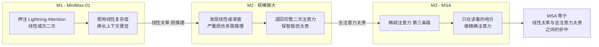
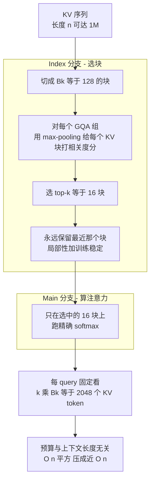
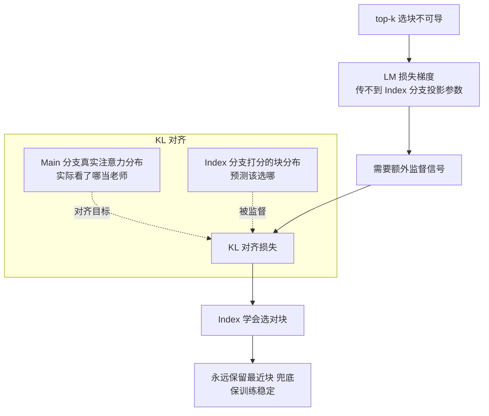
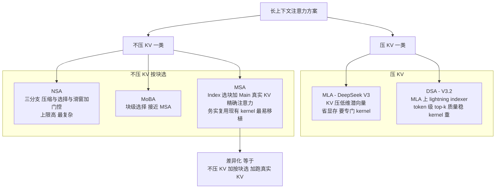

# Dispatch 04 · 详解 MiniMax MSA:在真实 KV 上做"块稀疏"注意力

*2026-06-23 · NPU Frontier Dispatch · attention / sparse / MiniMax M3 / RL-on-NPU*

> **TL;DR** — MSA(MiniMax Sparse Attention,arXiv 2606.13392)是 MiniMax-M3 的核心:在标准 **GQA** 主干上做**块级稀疏**——不压缩 KV,而是用一个轻量 **Index 分支**为每个 query 组挑出 **top-k 个 KV 块**,再用 **Main 分支**只在这些块上跑精确 softmax。默认块大小 `Bk=128`、每组选 `k=16` 块 → **每个 query 固定只看 2048 个 KV token**,与上下文长度**无关**(把 O(n²) 压成近 O(n))。在 109B MoE 上**质量持平 GQA**,1M 上下文**每 token 注意力算力降 28.4×**,配套 kernel 后 H800 上 **prefill 14.2× / decode 7.6×** 提速。对 RL-on-NPU 的关键点:它跑在**未压缩的真实 KV** 上、复用标准注意力 kernel,是**最好往昇腾移植**的一档稀疏注意力,而且 decode 端的大提速正好压在 RL rollout 的痛点上。

接 Dispatch 03(昇腾 950)。这期应要求,把 6 月最受关注的注意力机制 **MSA** 拆开讲清楚:它解决什么、怎么工作、怎么训、和 DSA/MLA/NSA 有什么不同。

---

## 1 · 背景:MiniMax 为什么"绕了一圈又回来"

MiniMax 的注意力路线很有故事:

- **M1 / MiniMax-01**:押注 **Lightning Attention**(线性/次二次注意力),想用线性复杂度换长上下文。
- **M2**:规模做大后发现,**线性 / 滑窗注意力严重损伤"多跳推理"**——跨长文档把分散线索串起来的能力。团队只好**退回完整二次注意力**,硬扛算力成本来保住前沿智能。
- **M3 → MSA**:既不想要线性注意力的推理缺陷,又不想吃满二次注意力的成本,于是走**稀疏注意力**这条中间路——只在"该看的地方"做精确注意力。

一句话:**MSA 是 MiniMax 在"线性太笨、全注意力太贵"之间找的第三条路。**

## 2 · MSA 怎么工作:两个分支

MSA 把注意力拆成两段,跑在普通 **GQA** 主干上(不像 DeepSeek MLA 把 KV 压进低维潜空间——MSA 用的是**真实、未压缩的 KV**):

**① Index 分支(选块)**
- 把 KV 序列切成大小 `Bk=128` 的**块**。
- 对每个注意力**组(GQA group)**,用 **max-pooling 打分**给每个 KV 块算一个相关度,选 **top-k(默认 k=16)** 个块。
- **永远保留最近的那个块**(保证局部性 + 训练稳定)。

**② Main 分支(算注意力)**
- 只在 Index 分支选出的那 k 个块上,跑**精确的 softmax 注意力**。

**为什么这是 O(n) 而不是 O(n²)**:每个 query 的预算被**钉死**在 `k·Bk = 16·128 = 2048` 个 KV token——无论上下文是 8K 还是 1M,单 query 看的 KV 量不变。上下文越长,省得越多(1M 时 ~28×)。

| 参数 | 默认值 | 含义 |
|---|---|---|
| 块大小 `Bk` | 128 token | KV 按块切分的粒度 |
| 每组选块数 `k` | 16 | 每个 query/组保留的块数 |
| 每 query 预算 `k·Bk` | **2048 token** | 固定,与上下文长度无关 |
| 主干 | GQA | 在真实 KV 上选块(非 MLA 压缩) |
| 选择粒度 | 块级(非 token 级) | 复用块稀疏 kernel,更易加速 |

### 为什么块级稀疏是个务实选择

所有稀疏注意力都在回答同一个问题:对当前 query,该去看历史里的哪些 KV?区别在于选择的最小单位是单个 token 还是一整块连续 token。**token 级稀疏(DSA)** 为每个 query 单独判定每个历史 token 的去留,数学上最灵活(精确挑出最相关的若干 token、不带无关邻居),但代价全压在 kernel 上:选中的 token 在 KV cache 里离散分布,要攒成能喂给 matmul 的连续 tile 必须做 gather(按索引收集)、算完再 scatter,索引是 per-query/per-step 动态变化的、访存高度碎片化、几乎没有空间局部性;GPU/NPU 的矩阵单元吃的是规整连续块,token 级 gather 出来的是"东一个西一个"的行,要么 padding 对齐(浪费算力)要么写变长 kernel(实现复杂难调优);动态索引还拖累流水线(难做静态形状假设)。**块级稀疏(MSA、MoBA)** 把粒度抬到 128 个 token 一块:一旦某块被选中,块内 128 个 token 在内存里本就连续、直接是对齐好的 tile,天然适配 matmul、不需 gather 单个 token——这正是现成 block-sparse attention kernel 的工作模式(FlashAttention 类早已支持"按块掩码"),MSA 的 Main 分支本质就是"在一个块的子集上跑标准 attention",直接复用这套高度优化的实现;选块索引也是块粒度的(每组选 16 个块号)、数据结构小而规整、便于静态 tiling。代价是粒度变粗:128 一刀切,被选中的块里难免混入不那么相关的 token,它们也会进入精确 softmax(只是权重被压低)——MSA 接受这点"浪费",换来工程上真能跑快、真能移植的 kernel 路径。

**"不压 KV"是同一务实哲学的另一面。** MLA/DSA 把 KV 投影到低维潜向量再存,decode 省显存,但 Main 计算要在压缩表示上做、kernel 与标准 attention 不再一致、移植要重写;MSA 保留原始未压缩 KV,Main 分支看到的就是货真价实的 GQA 注意力——选中哪些块之后剩下的运算和普通 attention 没有任何区别,唯一需要新写的只有那个轻量 Index 选块 kernel。对 NPU 这种 kernel 生态不如 CUDA 丰富、每个新算子都要人肉重写并对齐精度的平台,这一点几乎决定了能不能落地。

## 3 · 怎么训练:top-k 不可导,用 KL 对齐救

这是 MSA 最巧的一点。**top-k 块选择是不可导的**——语言建模损失的梯度传不到 Index 分支的投影参数上,Index 分支学不会"该选哪些块"。

MSA 的解法:**KL 对齐损失(KL alignment loss)**——让 **Index 分支打分出来的块分布**去对齐 **Main 分支真实的注意力分布**。也就是说,用 Main 分支"实际看了哪里"当老师,反过来监督 Index 分支"应该选哪里"。再加上"永远保留最近块"兜底,训练就稳了。

更细地讲:选块的 **top-16 是个 argmax/topk 操作,输出是"选/不选"的 0/1 离散决定**。LM 交叉熵损失只能从"被选中、真正参与了 Main 分支 softmax"的块上回传梯度——一个块的分数从 0.61 抖到 0.59,只要没跨过 top-16 门槛、选择结果不变、损失不变、梯度为 0;一旦跨过门槛,选择瞬间跳变、梯度无定义。于是给块打分的 Index 投影根本收不到有效 LM 梯度,学不会"该把分打给哪些块"。**KL 对齐绕开这条死路**:Main 分支在选中块上做精确 softmax,会算出一组真实注意力权重(当前 query 实际把多少注意力分给每个 token/块),这组分布直接反映"模型真正想看哪里",按块聚合得到"Main 眼里各块的重要性分布"当软标签;同时让 Index 分支的块打分(过 softmax 后)也成为一个分布,用 KL 散度逼它对齐这个软标签——KL 对两边分布都可导,梯度顺畅流回 Index 投影。直觉就是"Main 实际看了哪些块,就反过来教 Index 优先选哪些块",绕开 top-k 不可导,又不需任何人工标注。**"永远保留最近块"对稳定性是关键兜底**:训练早期 Index 投影还是随机的、选出的块大概率是噪声,若完全靠它决定 Main 能看到什么,Main 在垃圾上下文上算注意力、产出的软标签也是垃圾、KL 又拿垃圾教 Index——形成自我强化的恶性循环可能学崩;强制保留最近若干块,保证无论 Index 多差 Main 永远能看到局部上下文(语言里最强相关性本就高度集中在近处),既给模型一个永远靠谱的信息底座,也给 KL 一个非退化的监督起点。

> 训练规模:在一个 **109B 参数的 MoE** 上做了**原生多模态**训练,token 预算约 **3T**。

### 多跳推理:MiniMax 绕一圈的教训

MSA 不是一上来就想到的,是 MiniMax 三代之间撞了墙才回到的折中。**M1 的 Lightning Attention(线性注意力)** 把"query 对所有历史 key 求注意力"重写成可递推形式,历史被压缩进一个固定大小的状态(类似 RNN 隐状态),每步更新状态而非重扫全部 KV,算力和显存都降到常数级、长序列极省;但固定大小状态是有损压缩,**多跳推理恰是软肋**——多跳要求在长文档里把分散在不同位置的线索精确串起来(A 在第 3 段提到某实体,B 在第 80 段给出它的属性,要把两处接上),当早期那个精确 token 被揉进固定状态、被后续上万 token 不断覆写稀释后,想"回溯"取回它时已取不准;全注意力之所以能多跳,正因它对每个历史 token 都保留可被精确寻址的表示。**M2** 观察到线性和滑窗(窗外一律丢、跨度超窗的线索落视野外)都损伤多跳,于是退回完整二次注意力,多跳保住但 O(n²) 成本又回来了。**M3 的 MSA 想两全**:保留精确回溯能力——在真实未压缩 KV 上对选中块做精确 softmax,被选中的早期块其 token 表示和全注意力下没有区别、query 能精确寻址取回(这正是线性注意力丢掉、多跳必需的);只是不全看——通过块级 top-k 把"看哪些"限制在固定预算(每 query 2048 token)、拿回近线性成本。**但这把折中引入新失败模式:块级选择可能漏**——若多跳关键线索落在某块里而 Index 没把它选进 top-16,该块根本不进 Main 的 softmax、信息直接丢失,这是全注意力不会有的风险;这也正是 KL 对齐要解决的核心(教 Index 别漏掉 Main 真正需要的块),以及"永远保留最近块"只能兜局部、兜不住远距离线索的原因——**选块的召回率直接决定 MSA 多跳能力的上限**。

## 4 · 和别家稀疏 / 压缩注意力比

2025–26 各家在"让长上下文变便宜"上各走各路,关键差异在**压不压 KV、选 token 还是选块**:

| 方案 | 主干 | 机制 | 取舍 |
|---|---|---|---|
| **MLA**(DeepSeek V3) | — | 把 KV 压成低维潜向量 | 省显存;但要专门 kernel |
| **DSA**(DeepSeek V3.2) | MLA | lightning indexer → **token 级** top-k | 质量稳;kernel 重 |
| **NSA**(早期) | GQA | 三分支(压缩/选择/滑窗)+ 门控 | 上限高;最复杂 |
| **MoBA** | — | **块级**选择 | 思路接近 MSA |
| **MSA**(MiniMax M3) | GQA | Index 分支选**块** + Main 分支在**真实 KV** 上精确注意力 | **务实**——复用现有 kernel、对齐损失可训、易加速 |

MSA 的差异化:**不压 KV、按块选、跑在真实 KV 上**。代价是块级比 token 级粗一点,但换来工程上的简单——这恰恰是它能快速落地、也最好移植的原因。

## 5 · 性能数字(论文口径)

- **质量**:109B 模型上 **与 GQA 持平**(没有线性注意力那种推理掉点)。
- **算力**:1M 上下文下,**每 token 注意力算力降 28.4×**。
- **墙钟提速**(配套 co-designed kernel,H800):**prefill 14.2× / decode 7.6×**。
- (厂商早期 teaser 给过 ~20× 算力、>9× prefill、>15× decode 的口径,以论文 28.4/14.2/7.6 为准;均 provisional。)

**MSA 性能速查(均 provisional,论文/厂商口径):**

| 指标 | 数值 | 条件 |
|---|---|---|
| 模型质量 | 持平 GQA | 109B MoE,原生多模态,3T token 训练 |
| 每 token 注意力算力 | 降 28.4× | 1M 上下文长度 |
| Prefill 加速 | 14.2× | H800,长上下文 |
| Decode 加速 | 7.6× | H800,长上下文 |
| 每 query 注意力预算 | 固定 2048 token | Bk=128、k=16,与上下文长度无关 |

**稀疏 / 压缩注意力横向对比:**

| 方案 | 是否压 KV | 选择粒度 | kernel 与移植 |
|---|---|---|---|
| MLA | 压(低维潜向量) | 不做稀疏选择,靠压缩降本 | Main 在压缩表示上算,kernel 偏离标准 attention,移植需重写 |
| DSA | 压(MLA 基础上) | token 级 top-k | token 级 gather/scatter,kernel 重、碎片化 |
| NSA | 含压缩分支 | 三分支:压缩 / 选择 / 滑窗 + 门控 | 多分支 + 门控,结构复杂,kernel 工程量大 |
| MoBA | 不压 | 块级选择 | 块级,相对易加速 |
| MSA | 不压(真实 KV) | 块级 top-k(每 GQA 组选 16 块) | Main 复用标准块稀疏 kernel,仅新写轻量 Index 选块 kernel,务实易移植 |

> 数字与对比均 provisional、未经独立复现。尤其在 NPU 上:Index 选块 kernel 需重写,块选择 + KL 对齐 + NPU 重写三者叠加会引入 **train-inference mismatch**——训练时选中的块集合与 NPU 推理时选中的块集合若不一致,质量可能悄悄掉,落地前务必用 **align-probe** 验证两侧选块一致性。

## 6 · 对 RL-on-NPU 的意义

为什么本看板特别看重 MSA:

- **最好移植到昇腾**。MSA 跑在**普通 GQA + 未压缩 KV** 上,Main 分支就是标准块稀疏注意力,能**复用现有 kernel**;NPU 上真正要新写的只是那个轻量 **Index 选块 kernel**。相比 MLA/DSA 要重写一整套压缩-注意力路径,MSA 的移植面小得多。
- **decode 大提速正中 RL 痛点**。RL 的 rollout 是 decode-heavy 且 memory-bound;MSA 的 **7.6× decode** 与"每 query 只看 2048 token"直接压低 KV 访存,缓解昇腾"无 sleep-mode"的显存争用(见 NPU 架构页的"RL 显存争用"视图)。
- **要盯数值一致性**。块选择 + KL 对齐 + 在 NPU 上重写 Index kernel,会引入新的 train-inference mismatch 风险——这正是看板 **align-probe** 想法该量化的:NPU 上 MSA 的选块是否和 GPU 训练时一致。
- **现状**:vLLM-Ascend 已有 MiniMax 系(M2.x)的 W8A8/QuaRot,但 **M3 尚未按名列入**——MSA 的 Ascend 落地是个明确、可做的工程缺口。

## 7 · 下一步看什么

1. **MSA 的 Ascend kernel**:谁先把 Index 选块 + 块稀疏 Main 分支在 910B/950 上跑通并公布吞吐。
2. **块级 vs token 级的质量差**:MSA(块)与 DSA(token)在长上下文检索 / 多跳推理上的真实差距。
3. **MSA + FP8**:把 Dispatch 02/03 的 FP8 rollout 叠到 MSA 上,decode 端还能再省多少。

---

*来源:MiniMax Sparse Attention(arXiv 2606.13392)及其解析(MarkTechPost、HuggingFace、Medium/artgor 等);MiniMax-01 / M1 Lightning Attention 背景(arXiv 2501.08313 / 2506.13585)。数字为论文/厂商口径,provisional。相关卡片见本看板 LLM Modeling 标签页。*
