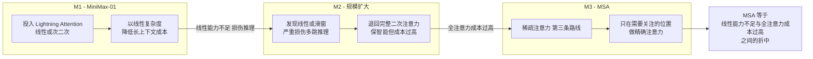
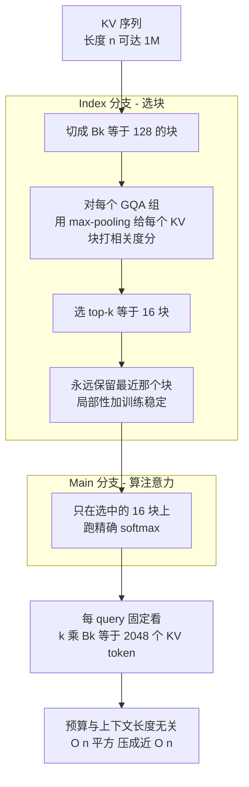
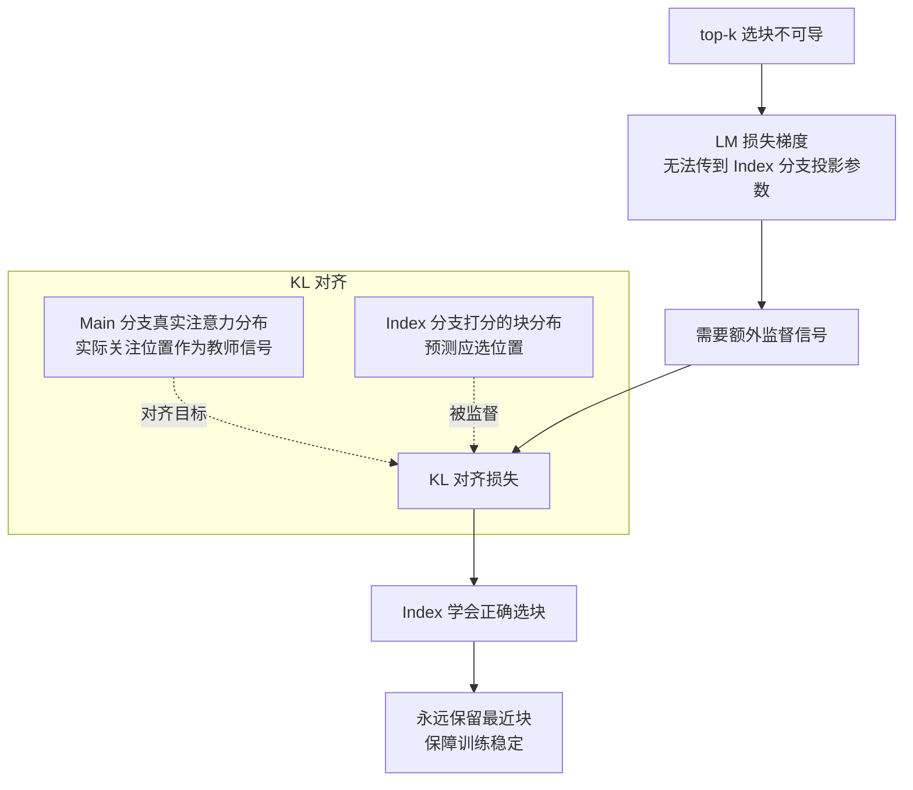
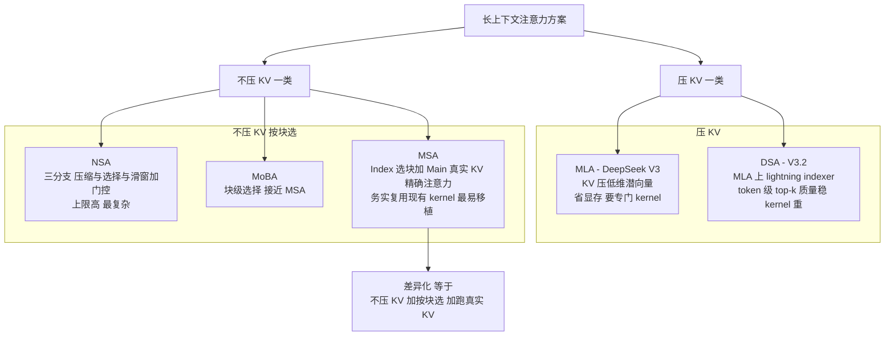

# Dispatch 04 · 详解 MiniMax MSA:在真实 KV 上做"块稀疏"注意力

*2026-06-23 · NPU Frontier Dispatch · attention / sparse / MiniMax M3 / RL-on-NPU*

> **TL;DR** — MSA(MiniMax Sparse Attention,arXiv 2606.13392)是 MiniMax-M3 的核心:在标准 **GQA** 主干上做**块级稀疏**——不压缩 KV,而是用一个轻量 **Index 分支**为每个 query 组挑出 **top-k 个 KV 块**,再用 **Main 分支**只在这些块上跑精确 softmax。默认块大小 `Bk=128`、每组选 `k=16` 块 → **每个 query 固定只看 2048 个 KV token**,与上下文长度**无关**(把 O(n²) 压成近 O(n))。在 109B MoE 上**质量持平 GQA**,1M 上下文**每 token 注意力算力降 28.4×**,配套 kernel 后 H800 上 **prefill 14.2× / decode 7.6×** 提速。对 RL-on-NPU 的关键点:它跑在**未压缩的真实 KV** 上、复用标准注意力 kernel,是**最易移植到昇腾**的一档稀疏注意力,而且 decode 端的大幅提速恰好对应 RL rollout 的瓶颈。

接 Dispatch 03(昇腾 950)。本期应要求,对 6 月最受关注的注意力机制 **MSA** 进行拆解阐明:它解决什么、如何工作、如何训练、与 DSA/MLA/NSA 有何不同。

---

## 1 · 背景:MiniMax 注意力路线的往返演进

MiniMax 的注意力路线经历了多次转折:

- **M1 / MiniMax-01**:选择投入 **Lightning Attention**(线性/次二次注意力),以线性复杂度换取长上下文能力。
- **M2**:规模扩大后发现,**线性 / 滑窗注意力严重损伤"多跳推理"**——跨长文档将分散线索串联起来的能力。团队只能**退回完整二次注意力**,承担算力成本以保住前沿智能。
- **M3 → MSA**:既要避免线性注意力的推理缺陷,又不愿承担二次注意力的全部成本,于是采取**稀疏注意力**这条中间路线——只在需要关注的位置做精确注意力。

概括而言:**MSA 是 MiniMax 在"线性能力不足、全注意力成本过高"之间确立的第三条路线。**

```mermaid
flowchart LR
    subgraph M1 ["M1 - MiniMax-01"]
        A1["投入 Lightning Attention<br/>线性或次二次"]
        A2["以线性复杂度<br/>降低长上下文成本"]
        A1 --> A2
    end
    subgraph M2 ["M2 - 规模扩大"]
        B1["发现线性或滑窗<br/>严重损伤多跳推理"]
        B2["退回完整二次注意力<br/>保智能但成本过高"]
        B1 --> B2
    end
    subgraph M3 ["M3 - MSA"]
        C1["稀疏注意力 第三条路线"]
        C2["只在需要关注的位置<br/>做精确注意力"]
        C1 --> C2
    end
    A2 -->|"线性能力不足 损伤推理"| B1
    B2 -->|"全注意力成本过高"| C1
    C2 --> D["MSA 等于<br/>线性能力不足与全注意力成本过高<br/>之间的折中"]
```

## 2 · MSA 怎么工作:两个分支

MSA 把注意力拆成两段,跑在普通 **GQA** 主干上(不像 DeepSeek MLA 把 KV 压进低维潜空间——MSA 用的是**真实、未压缩的 KV**):

**① Index 分支(选块)**
- 把 KV 序列切成大小 `Bk=128` 的**块**。
- 对每个注意力**组(GQA group)**,用 **max-pooling 打分**给每个 KV 块算一个相关度,选 **top-k(默认 k=16)** 个块。
- **永远保留最近的那个块**(保证局部性 + 训练稳定)。

**② Main 分支(算注意力)**
- 只在 Index 分支选出的那 k 个块上,跑**精确的 softmax 注意力**。

**复杂度为 O(n) 而非 O(n²) 的原因**:每个 query 的预算被**固定**在 `k·Bk = 16·128 = 2048` 个 KV token——无论上下文是 8K 还是 1M,单 query 读取的 KV 量不变。上下文越长,节省越显著(1M 时 ~28×)。

| 参数 | 默认值 | 含义 |
|---|---|---|
| 块大小 `Bk` | 128 token | KV 按块切分的粒度 |
| 每组选块数 `k` | 16 | 每个 query/组保留的块数 |
| 每 query 预算 `k·Bk` | **2048 token** | 固定,与上下文长度无关 |
| 主干 | GQA | 在真实 KV 上选块(非 MLA 压缩) |
| 选择粒度 | 块级(非 token 级) | 复用块稀疏 kernel,更易加速 |

```mermaid
flowchart TB
    KV["KV 序列<br/>长度 n 可达 1M"]
    KV --> SPLIT["切成 Bk 等于 128 的块"]
    subgraph IDX ["Index 分支 - 选块"]
        SPLIT --> SCORE["对每个 GQA 组<br/>用 max-pooling 给每个 KV 块打相关度分"]
        SCORE --> TOPK["选 top-k 等于 16 块"]
        TOPK --> NEAR["永远保留最近那个块<br/>局部性加训练稳定"]
    end
    subgraph MAIN ["Main 分支 - 算注意力"]
        NEAR --> SOFT["只在选中的 16 块上<br/>跑精确 softmax"]
    end
    SOFT --> BUDGET["每 query 固定看<br/>k 乘 Bk 等于 2048 个 KV token"]
    BUDGET --> OUT["预算与上下文长度无关<br/>O n 平方 压成近 O n"]
```

### 块级稀疏是务实选择的原因

所有稀疏注意力都在解决同一个问题:对当前 query,应读取历史中的哪些 KV。区别在于选择的最小单位是单个 token 还是一整块连续 token。**token 级稀疏(DSA)** 为每个 query 单独判定每个历史 token 的去留,数学上最灵活(精确挑出最相关的若干 token、不带无关邻居),但代价全部集中在 kernel 上:选中的 token 在 KV cache 里离散分布,要聚合成可供 matmul 使用的连续 tile 必须做 gather(按索引收集)、计算完成后再 scatter,索引是 per-query/per-step 动态变化的、访存高度碎片化、几乎没有空间局部性;GPU/NPU 的矩阵单元处理的是规整连续块,token 级 gather 得到的是离散分布的行,要么 padding 对齐(浪费算力)要么编写变长 kernel(实现复杂、难以调优);动态索引还拖累流水线(难以做静态形状假设)。**块级稀疏(MSA、MoBA)** 把粒度提升到 128 个 token 一块:一旦某块被选中,块内 128 个 token 在内存里本就连续、直接是对齐完毕的 tile,天然适配 matmul、无需 gather 单个 token——这正是现成 block-sparse attention kernel 的工作模式(FlashAttention 类早已支持"按块掩码"),MSA 的 Main 分支本质就是"在一个块的子集上跑标准 attention",直接复用这套高度优化的实现;选块索引也是块粒度的(每组选 16 个块号)、数据结构小而规整、便于静态 tiling。代价是粒度变粗:以 128 为统一划分单位,被选中的块内难免混入相关度较低的 token,它们也会进入精确 softmax(只是权重被压低)——MSA 接受这部分冗余,换取工程上可实际加速、可实际移植的 kernel 路径。

**"不压 KV"是同一务实哲学的另一面。** MLA/DSA 把 KV 投影到低维潜向量再存,decode 省显存,但 Main 计算要在压缩表示上做、kernel 与标准 attention 不再一致、移植要重写;MSA 保留原始未压缩 KV,Main 分支执行的就是标准的 GQA 注意力——完成选块之后剩下的运算和普通 attention 没有任何区别,唯一需要新写的只有那个轻量 Index 选块 kernel。对 NPU 这类 kernel 生态不如 CUDA 丰富、每个新算子都需人工重写并对齐精度的平台,这一点几乎决定了能否落地。

## 3 · 训练方法:top-k 不可导,以 KL 对齐解决

这是 MSA 设计中最精巧的部分。**top-k 块选择是不可导的**——语言建模损失的梯度无法传到 Index 分支的投影参数上,Index 分支无法学习"应选哪些块"。

MSA 的解法:**KL 对齐损失(KL alignment loss)**——让 **Index 分支打分得到的块分布**对齐 **Main 分支真实的注意力分布**。即以 Main 分支"实际关注的位置"为教师信号,反向监督 Index 分支"应选择的位置"。再配合"永远保留最近块"作为保障,训练即可保持稳定。

```mermaid
flowchart TB
    PROB["top-k 选块不可导"]
    PROB --> NOGRAD["LM 损失梯度<br/>无法传到 Index 分支投影参数"]
    NOGRAD --> NEED["需要额外监督信号"]
    subgraph TEACH ["KL 对齐"]
        MAIN["Main 分支真实注意力分布<br/>实际关注位置作为教师信号"]
        IDX["Index 分支打分的块分布<br/>预测应选位置"]
        MAIN -. "对齐目标" .-> KL["KL 对齐损失"]
        IDX -. "被监督" .-> KL
    end
    NEED --> KL
    KL --> LEARN["Index 学会正确选块"]
    LEARN --> BACKUP["永远保留最近块<br/>保障训练稳定"]
```

更细地讲:选块的 **top-16 是个 argmax/topk 操作,输出是"选/不选"的 0/1 离散决定**。LM 交叉熵损失只能从"被选中、真正参与了 Main 分支 softmax"的块上回传梯度——一个块的分数从 0.61 波动至 0.59,只要未跨过 top-16 门槛、选择结果不变、损失不变、梯度为 0;一旦跨过门槛,选择瞬间跳变、梯度无定义。于是给块打分的 Index 投影无法收到有效 LM 梯度,无法学习"应将高分赋予哪些块"。**KL 对齐绕开了这条不可行路径**:Main 分支在选中块上做精确 softmax,会算出一组真实注意力权重(当前 query 实际把多少注意力分给每个 token/块),这组分布直接反映模型真正需要关注的位置,按块聚合得到"Main 视角下各块的重要性分布"作为软标签;同时让 Index 分支的块打分(经 softmax 后)也构成一个分布,用 KL 散度使其对齐这个软标签——KL 对两侧分布都可导,梯度顺畅流回 Index 投影。核心思想是"Main 实际关注了哪些块,就反向监督 Index 优先选择哪些块",既绕开 top-k 不可导,又无需任何人工标注。**"永远保留最近块"是稳定性的关键保障**:训练早期 Index 投影仍是随机的、选出的块大概率是噪声,若完全依赖它决定 Main 的可见范围,Main 在低质量上下文上计算注意力、产出的软标签同样低质量、KL 再以低质量标签监督 Index——形成自我强化的恶性循环,可能导致训练崩溃;强制保留最近若干块,保证无论 Index 质量如何,Main 始终能看到局部上下文(语言中最强相关性本就高度集中在近处),既给模型一个始终可靠的信息基础,也给 KL 一个非退化的监督起点。

> 训练规模:在一个 **109B 参数的 MoE** 上做了**原生多模态**训练,token 预算约 **3T**。

### 多跳推理:MiniMax 路线演进的经验

MSA 并非一开始就确定的方案,而是 MiniMax 三代模型间经过实践受挫后确立的折中。**M1 的 Lightning Attention(线性注意力)** 把"query 对所有历史 key 求注意力"重写成可递推形式,历史被压缩进一个固定大小的状态(类似 RNN 隐状态),每步更新状态而非重扫全部 KV,算力和显存都降到常数级、长序列极省;但固定大小状态是有损压缩,**多跳推理恰是薄弱环节**——多跳要求在长文档里把分散在不同位置的线索精确串联(A 在第 3 段提到某实体,B 在第 80 段给出它的属性,需将两处关联),当早期那个精确 token 被压入固定状态、被后续上万 token 不断覆写稀释后,回溯取回时已无法精确还原;全注意力之所以能多跳,正因它对每个历史 token 都保留可被精确寻址的表示。**M2** 观察到线性和滑窗(窗外信息一律丢弃、跨度超窗的线索落在可见范围之外)都损伤多跳,于是退回完整二次注意力,多跳能力保住,但 O(n²) 成本随之回归。**M3 的 MSA 试图兼顾两者**:保留精确回溯能力——在真实未压缩 KV 上对选中块做精确 softmax,被选中的早期块其 token 表示和全注意力下没有区别、query 能精确寻址取回(这正是线性注意力丢失、多跳必需的);只是不全量读取——通过块级 top-k 把读取范围限制在固定预算(每 query 2048 token)、换取近线性成本。**但这一折中引入新的失败模式:块级选择可能遗漏**——若多跳关键线索落在某块里而 Index 未将其选入 top-16,该块完全不进入 Main 的 softmax、信息直接丢失,这是全注意力不存在的风险;这也正是 KL 对齐要解决的核心(使 Index 不遗漏 Main 真正需要的块),以及"永远保留最近块"只能保障局部、无法覆盖远距离线索的原因——**选块的召回率直接决定 MSA 多跳能力的上限**。

## 4 · 和别家稀疏 / 压缩注意力比

2025–26 各家在降低长上下文成本上采取了不同路线,关键差异在**是否压缩 KV、选 token 还是选块**:

| 方案 | 主干 | 机制 | 取舍 |
|---|---|---|---|
| **MLA**(DeepSeek V3) | — | 把 KV 压成低维潜向量 | 省显存;但要专门 kernel |
| **DSA**(DeepSeek V3.2) | MLA | lightning indexer → **token 级** top-k | 质量稳;kernel 重 |
| **NSA**(早期) | GQA | 三分支(压缩/选择/滑窗)+ 门控 | 上限高;最复杂 |
| **MoBA** | — | **块级**选择 | 思路接近 MSA |
| **MSA**(MiniMax M3) | GQA | Index 分支选**块** + Main 分支在**真实 KV** 上精确注意力 | **务实**——复用现有 kernel、对齐损失可训、易加速 |

MSA 的差异化:**不压 KV、按块选、运行在真实 KV 上**。代价是块级粒度比 token 级更粗,但换来工程上的简洁——这正是它能快速落地、也最易移植的原因。

```mermaid
flowchart TB
    ROOT["长上下文注意力方案"]
    ROOT --> COMP["压 KV 一类"]
    ROOT --> NOCOMP["不压 KV 一类"]
    subgraph C1 ["压 KV"]
        MLA["MLA - DeepSeek V3<br/>KV 压低维潜向量<br/>省显存 要专门 kernel"]
        DSA["DSA - V3.2<br/>MLA 上 lightning indexer<br/>token 级 top-k 质量稳 kernel 重"]
    end
    subgraph C2 ["不压 KV 按块选"]
        NSA["NSA<br/>三分支 压缩与选择与滑窗加门控<br/>上限高 最复杂"]
        MOBA["MoBA<br/>块级选择 接近 MSA"]
        MSA["MSA<br/>Index 选块加 Main 真实 KV 精确注意力<br/>务实复用现有 kernel 最易移植"]
    end
    COMP --> MLA
    COMP --> DSA
    NOCOMP --> NSA
    NOCOMP --> MOBA
    NOCOMP --> MSA
    MSA --> DIFF["差异化 等于<br/>不压 KV 加按块选 加跑真实 KV"]
```

## 5 · 性能数字(论文口径)

- **质量**:109B 模型上 **与 GQA 持平**(无线性注意力那类推理性能下降)。
- **算力**:1M 上下文下,**每 token 注意力算力降 28.4×**。
- **墙钟提速**(配套 co-designed kernel,H800):**prefill 14.2× / decode 7.6×**。
- (厂商早期 teaser 给过 ~20× 算力、>9× prefill、>15× decode 的口径,以论文 28.4/14.2/7.6 为准;均 provisional。)

**MSA 性能速查(均 provisional,论文/厂商口径):**

| 指标 | 数值 | 条件 |
|---|---|---|
| 模型质量 | 持平 GQA | 109B MoE,原生多模态,3T token 训练 |
| 每 token 注意力算力 | 降 28.4× | 1M 上下文长度 |
| Prefill 加速 | 14.2× | H800,长上下文 |
| Decode 加速 | 7.6× | H800,长上下文 |
| 每 query 注意力预算 | 固定 2048 token | Bk=128、k=16,与上下文长度无关 |

**稀疏 / 压缩注意力横向对比:**

| 方案 | 是否压 KV | 选择粒度 | kernel 与移植 |
|---|---|---|---|
| MLA | 压(低维潜向量) | 不做稀疏选择,靠压缩降本 | Main 在压缩表示上算,kernel 偏离标准 attention,移植需重写 |
| DSA | 压(MLA 基础上) | token 级 top-k | token 级 gather/scatter,kernel 重、碎片化 |
| NSA | 含压缩分支 | 三分支:压缩 / 选择 / 滑窗 + 门控 | 多分支 + 门控,结构复杂,kernel 工程量大 |
| MoBA | 不压 | 块级选择 | 块级,相对易加速 |
| MSA | 不压(真实 KV) | 块级 top-k(每 GQA 组选 16 块) | Main 复用标准块稀疏 kernel,仅新写轻量 Index 选块 kernel,务实易移植 |

> 数字与对比均 provisional、未经独立复现。尤其在 NPU 上:Index 选块 kernel 需重写,块选择 + KL 对齐 + NPU 重写三者叠加会引入 **train-inference mismatch**——训练时选中的块集合与 NPU 推理时选中的块集合若不一致,质量可能隐性下降,落地前须用 **align-probe** 验证两侧选块一致性。

## 6 · 对 RL-on-NPU 的意义

本看板重视 MSA 的原因:

- **最易移植到昇腾**。MSA 跑在**普通 GQA + 未压缩 KV** 上,Main 分支就是标准块稀疏注意力,能**复用现有 kernel**;NPU 上真正要新写的只是那个轻量 **Index 选块 kernel**。相比 MLA/DSA 要重写一整套压缩-注意力路径,MSA 的移植面小得多。
- **decode 大幅提速直接对应 RL 瓶颈**。RL 的 rollout 是 decode-heavy 且 memory-bound;MSA 的 **7.6× decode** 与"每 query 仅读取 2048 token"直接降低 KV 访存,缓解昇腾"无 sleep-mode"的显存争用(见 NPU 架构页的"RL 显存争用"视图)。
- **须关注数值一致性**。块选择 + KL 对齐 + 在 NPU 上重写 Index kernel,会引入新的 train-inference mismatch 风险——这正是看板 **align-probe** 想法该量化的:NPU 上 MSA 的选块是否和 GPU 训练时一致。
- **现状**:vLLM-Ascend 已有 MiniMax 系(M2.x)的 W8A8/QuaRot,但 **M3 尚未按名列入**——MSA 的 Ascend 落地是一个明确、可执行的工程缺口。

## 7 · 后续关注方向

1. **MSA 的 Ascend kernel**:哪一方率先在 910B/950 上完成 Index 选块 + 块稀疏 Main 分支并公布吞吐。
2. **块级 vs token 级的质量差**:MSA(块)与 DSA(token)在长上下文检索 / 多跳推理上的真实差距。
3. **MSA + FP8**:把 Dispatch 02/03 的 FP8 rollout 叠到 MSA 上,decode 端还能再省多少。

---

*来源:MiniMax Sparse Attention(arXiv 2606.13392)及其解析(MarkTechPost、HuggingFace、Medium/artgor 等);MiniMax-01 / M1 Lightning Attention 背景(arXiv 2501.08313 / 2506.13585)。数字为论文/厂商口径,provisional。相关卡片见本看板 LLM Modeling 标签页。*
