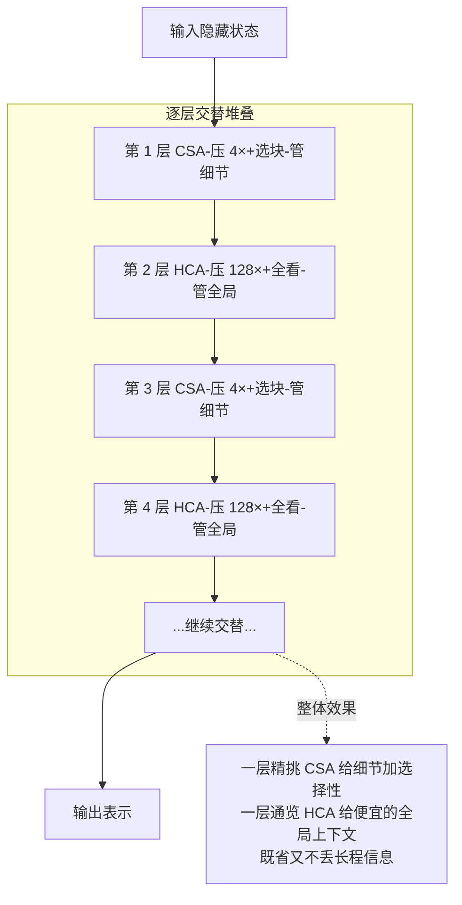
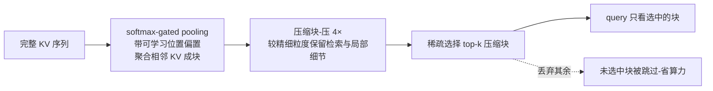
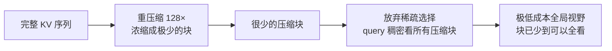
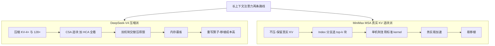
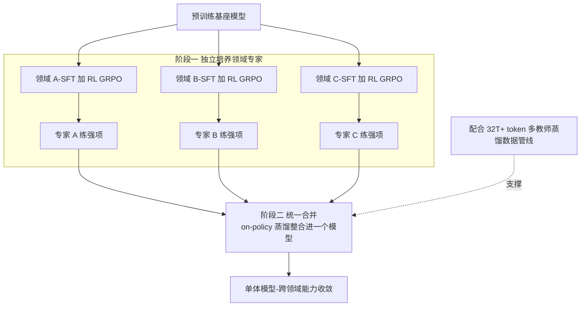

# Dispatch 05 · 详解 DeepSeek-V4:混合注意力(CSA + HCA)与 1M 上下文

*2026-06-23 · NPU Frontier Dispatch · attention / MoE / DeepSeek-V4 / RL-on-NPU*

> **TL;DR** — DeepSeek-V4(2026-04-24,开源 MIT)是一对 MoE:**V4-Pro 1.6T / 49B 激活**、**V4-Flash 284B / 13B 激活**,都原生 **1M 上下文**。核心创新是**混合注意力**——逐层交替 **CSA(压缩稀疏注意力,KV 压 4× + 稀疏选块)** 与 **HCA(重压缩注意力,KV 压 128× + 不选、全看)**;再叠上 **mHC 超连接**、**Muon 优化器**、**MTP 多 token 预测**,以及 **FP4(专家)+ FP8(其余)混合精度**训练。效果:1M 上下文下,V4-Pro 单 token 推理只要 V3.2 的 **27% FLOPs、10% KV cache**;SWE-bench Verified **80.6%**(开源最强档)。对 RL-on-NPU 的意义:它**已经在 vLLM-Ascend 上跑**(910B,自定义算子 + MTP KV-cache 分片做投机解码),是昇腾上**现成的大模型 rollout/评测基线**;FP8/FP4 训练也正好印证了"FP8 RL on Ascend"这条线(见 Dispatch 02/03)。

接 Dispatch 04(MiniMax MSA)。同样应要求,把 4 月开源的 **DeepSeek-V4** 架构拆开讲——它和 MSA 是两条不同的长上下文路线,对比着看最清楚。

---

## 1 · 定位与规格

DeepSeek-V4 不是单个模型,是一对:

| | **V4-Pro** | **V4-Flash** |
|---|---|---|
| 总参数 / 激活 | 1.6T / **49B** | 284B / **13B** |
| 上下文 | 1M | 1M |
| 许可 | 开源 (MIT) | 开源 (MIT) |
| 输出价(参考) | ~$3.48 / 1M | **$0.87 / 1M** |
| 发布 | 2026-04-24 | 2026-04-24 |

延续 DeepSeekMoE + MLA 血统,但这一代真正的看点在**注意力**。

## 2 · 核心:混合注意力(Hybrid Attention)

V4 不再用单一注意力,而是**逐层交替**两种压缩注意力,各管一段职责:

### 为什么压缩 KV 是另一条路(对比选块)

长上下文降本本质上只有两个旋钮:**存什么(KV cache 里放多少东西)**和**看什么(每个 query step 真正参与注意力计算的有多少)**。两条主流路线各拧一个。**选块派(MiniMax MSA)拧的是"看多少"**:真实未压缩的 KV 全量留在显存,每个 token 的 K/V 一个不少地存着,降本发生在注意力"读取端"——用一个轻量 Index 模块为当前 query 打分、选 top-k 块,query 只对这 k 个块算 attention,省的是 FLOPs 和带宽,但**没省 KV cache 本身**(1M token 的 KV 该多大还多大);好处是被选中的块是原汁原味、数值精度不丢,attention 算子仍是标准稠密 kernel,易加速、易移植。**压缩派(V4 CSA/HCA)拧的是"存什么/存多少"**:KV 进 cache 之前先压缩,把相邻 K/V 用 softmax-gated pooling 聚合成"块表示",cache 里存的不再是逐 token K/V 而是压缩块,降本直接发生在"存储端"(CSA 压 4×、HCA 压 128×),代价是压缩有损、丢 token 级细节,且定制算子移植成本高、要防 train-inference 漂移。

**V4 的关键在于把两个旋钮叠在一起拧。** 单纯压缩有矛盾:压得轻(4×)细节还在但块数仍多、query 全看依然贵;压得狠(128×)块少到能全看但细节丢太多。V4 的解法是**分层用不同压缩比配不同读取策略**:CSA 层压 4×(细节保留较好)+ 仍稀疏选 top-k,既压又选、两旋钮拧到中档,负责"看清近处和选中的关键块";HCA 层压 128×(块少到极致)+ 放弃选择、稠密全看,压缩本身已把"看多少"压到能全看,选块反成多余、直接通览,负责廉价全局视野。两类层逐层交替,使整个 cache 主体由高压缩块构成——这是 **1M KV cache 能砍到约 10% 的根本原因:不是靠"少看",而是靠"少存"**;同时单 token FLOPs 降到 V3.2 的 27%,因为大量层走"块少 + 不选"的廉价稠密路径。

**① CSA — Compressed Sparse Attention(压缩稀疏)**
- 沿序列维把 KV **压缩 4×**:用 **softmax-gated pooling(带可学习位置偏置)** 把相邻 KV 聚合成块。
- 然后做**稀疏选择**——query 只看选中的压缩块。
- 角色:在"还算精细"的粒度上保留检索/局部细节。

**② HCA — Heavily Compressed Attention(重压缩)**
- 把 KV **压缩 128×**——极度浓缩成很少的块。
- **完全放弃稀疏选择**:每个 query **稠密地看所有压缩块**。
- 角色:用极低成本提供"全局视野"——反正块已经少到可以全看。

**为什么要两种交替**:CSA 给"细节 + 选择性",HCA 给"便宜的全局上下文"。一层精挑、一层通览,合起来既省又不丢长程信息。

更细地看分工:**CSA = 精挑层**——压 4× 块表示还相对精细,token 级局部结构和可检索信息基本保得住,能承担"近处细节"和"精确检索"这类对精度敏感的活;但 4× 压缩后块数依然庞大(1M token 压 4× 仍有约 25 万块量级),query 没法全看,所以 CSA **必须**配 top-k 稀疏选择,角色是"看清近处 + 选中的关键远处块"。**HCA = 通览层**——压 128× 块数被压到极少(1M token 只剩几千块量级),少到 query 可以**稠密全看**而不必再选,代价是单块浓缩了上百个 token、token 级细节几乎全丢,块表示只剩"这一段大致讲了什么"的粗粒度语义,但这恰是全局视野需要的:你不需要从 90 万 token 外精确取回某个变量名(那是 CSA 的活),只需知道"远处有这么一大块相关上下文存在",HCA 用极低成本给每个 query 一张覆盖全序列的"地图"。**两者缺一不可**:只有 CSA 会因永远在"选块"而漏掉没被选中的弥散全局依赖;只有 HCA,128× 有损压缩会让所有需要精确 token 的任务(代码定位、精确检索、数值)崩掉。**压缩的精度风险与补偿**:128× 丢的是 token 级位置精度、低频稀有信息(易被 pooling 平均掉)、逐 token 比对的细粒度检索;V4 主要靠四条补——① 交替结构保证每隔一层就有 CSA 把细节"接回来",HCA 丢的由 CSA 兜底;② CSA 的 pooling 带**可学习位置偏置**,聚合不是简单平均、保留一定块内结构;③ mHC 流形约束超连接稳住深层信息流,避免高压缩层把信号越压越糊;④ MTP 提供更密训练信号,迫使压缩表示保留足够预测未来 token 的信息。即便如此,压缩路线在**超长精确检索**上仍是天然风险点,需专门评测盯住。

这与 MSA(单一块稀疏、在真实未压缩 KV 上选 top-k)是**两条思路**:

| | **DeepSeek-V4(CSA+HCA)** | **MiniMax MSA** |
|---|---|---|
| KV | **压缩**(4× / 128×) | **不压**,真实 KV |
| 选择 | CSA 选块 / HCA 全看 | Index 分支选 top-k 块 |
| 风格 | 双机制交替、压得狠 | 单机制、复用标准 kernel |
| 取舍 | 长上下文内存最省;移植成本高 | 务实、易加速、易移植 |

## 3 · 其他架构件

- **mHC(Manifold-Constrained Hyper-Connections)**:对传统残差连接的增强版"超连接",约束在流形上以稳住深层信息流。
- **Muon 优化器**:更快收敛 + 更稳的训练(取代/补充 AdamW 一类)。
- **MTP(Multi-Token Prediction)**:保留多 token 预测模块——既提训练信号,又能在推理时做**投机解码**。
- **FP4 + FP8 混合精度**:**MoE 专家用 FP4、其余参数用 FP8** 训练——这是 V4 验证过的低精度训练栈,直接对应下一代昇腾 950 的原生 FP8/MXFP4。

## 4 · 训练 / 后训练:先分养专家,再蒸馏合并

V4 的后训练是**两阶段**:

1. **独立培养领域专家**:对不同领域分别做 **SFT + RL(GRPO)**,各练各的强项。
2. **统一合并**:用 **on-policy 蒸馏**把这些各有所长的专家**整合进一个模型**,跨领域能力收敛到单体。

(配合 32T+ token、多教师蒸馏的数据管线。)这套"分养—合并"思路,本身就是一个值得在昇腾上复现的 RL + 蒸馏流程。

**为什么先分开练再蒸馏成一个。** 最直接的做法是把所有领域数据混在一起做一轮 RL,但实践中会**互相干扰**:不同领域的 reward 尺度、最优策略、输出风格都不一样(代码要严格可执行、数学要步骤严谨、对话要自然),混在一起做 GRPO,梯度相互拉扯,出现此消彼长(代码涨了数学掉、对齐了风格丢了推理),reward 信号也变脏(一个 batch 混着多领域优势估计,噪声大、方向不一致)。**第一阶段分领域分养**:各自独立 SFT + RL(GRPO),每个领域是一条干净的优化通道——reward 只来自本领域、策略只朝本领域最优走,专家在自己领域被充分压榨到上限、不被其他领域梯度干扰。**第二阶段 on-policy 蒸馏合并进单体**:关键是用 on-policy 而非离线蒸馏——离线蒸馏让学生拟合教师**预先生成**的固定输出,而这些输出落在教师分布上,学生推理时走自己的分布,二者不匹配(exposure bias);on-policy 蒸馏让**学生先自己采样生成**(在自己分布上),再由对应领域教师对这些 on-policy 轨迹打分/提供目标分布,学生在**自己实际产生的状态**上对齐教师,显著减少分布漂移、合并后跨领域更稳。整条链路再叠 32T+ token 多教师蒸馏,把多路能力收敛为一,既拿到各专家充分优化的成果,又避免从头混合 RL 的相互干扰。

## 5 · 效率与跑分(论文/厂商口径,provisional)

- **效率**:1M 上下文下,V4-Pro 单 token 推理仅需 V3.2 的 **27% FLOPs** 和 **10% KV cache**——混合注意力把长上下文成本砍到约 1/4~1/10。
- **质量**:V4-Pro(Max)**SWE-bench Verified 80.6%**,开源最强、与 Gemini 3.1 Pro 持平;LiveCodeBench ~93.5%。
- **价格**:V4-Flash 输出 **$0.87/1M** —— 开源里很有竞争力。

**效率与质量速查(V4-Pro,1M 上下文场景,provisional):**

| 指标 | V4-Pro | 说明 |
|---|---|---|
| 单 token FLOPs(1M) | V3.2 的 **27%** | 大量层走 HCA"块少 + 不选"的廉价稠密路径 |
| KV cache(1M) | V3.2 的 **10%** | 压缩派核心收益:CSA 4× / HCA 128×,cache 存压缩块 |
| SWE-bench Verified | **80.6%** | 开源最强,与 Gemini 3.1 Pro 持平 |
| LiveCodeBench | **~93.5%** | 代码能力第一梯队 |
| 输出价格(V4-Flash) | **$0.87 / 1M** | Flash(284B/13B 激活)推理成本 |

**长上下文路线对比(压缩派 vs 选块派):**

| 维度 | V4 CSA + HCA(压缩派) | MiniMax MSA(选块派) |
|---|---|---|
| KV 处理 | 压缩真实 KV(CSA 4× / HCA 128×),cache 存压缩块 | 不压真实 KV,全量原始 K/V 留在 cache |
| 选择机制 | CSA 选 top-k 压缩块;HCA 放弃选择、稠密全看 | Index 模块为 query 选 top-k 真实块 |
| 内存省法 | 省在"存什么/存多少"——cache 体积直接变小(约 10%) | 省在"看多少"——cache 不变,减计算与带宽 |
| kernel 与移植 | 定制算子,双机制交替;压得最狠但移植成本高、易 train-inference 漂移 | 复用标准 attention kernel;务实、易加速、易移植 |
| 长检索风险 | 高压缩(128×)丢 token 级细节,超长精确检索是风险点,靠 CSA 层兜底 | 真实 K/V 不丢精度,风险主要在 top-k 是否选中目标块 |

> 数值与跑分均 **provisional**(论文/厂商口径)。尤其:CSA/HCA 定制算子在 NPU(vLLM-Ascend 910B)上需重写,存在 **train-inference 数值漂移**风险,推理与训练一致性须经 **align-probe** 验证后方可采信线上数值。

## 6 · 对 RL-on-NPU 的意义

为什么 V4 是本看板反复提到的"基线":

- **已经能在昇腾上跑**。vLLM-Ascend 的 2026 支持矩阵里 V4 在 **910B** 上有自定义算子 + **MTP 层 KV-cache 分片做投机解码**——这意味着它是**现成的大模型 rollout / 评测对象**,不用等移植。
- **FP8/FP4 训练 = "FP8 RL on Ascend"的实证**。V4 把低精度训练跑通了,叠上 950 的原生 FP8(Dispatch 03),让"在昇腾上做 FP8 RL"从设想更近一步。
- **KV cache 砍到 10% = 直接缓解显存争用**。这正是 910B 上 rollout/train 抢 64GB HBM 的痛点(NPU 架构页"RL 显存争用"视图)。
- **但混合注意力是移植风险点**。CSA/HCA 这种压缩 + 稀疏的自定义注意力,在 NPU 上重写后容易引入 train-inference 数值漂移——这正是 **align-probe** 想法该量化的。

## 7 · 下一步看什么

1. **CSA/HCA 的 Ascend kernel 成熟度**:压缩注意力在 910B/950 上的真实吞吐与数值一致性。
2. **MTP 投机解码在 NPU 上的加速比**:对 RL rollout 的端到端收益。
3. **V4 vs MSA 的长上下文质量对照**:压缩(V4)与不压缩选块(MSA)在多跳推理 / 长检索上谁更稳。

---

*来源:DeepSeek-V4 技术报告与解析(HuggingFace deepseek-ai/DeepSeek-V4-Pro、DeepSeek API Docs、latent.space、morphllm、techjacksolutions 等);vLLM-Ascend 2026 支持矩阵。规格 / 跑分为论文 / 厂商口径,provisional。相关卡片见本看板 LLM Modeling 标签页。*
