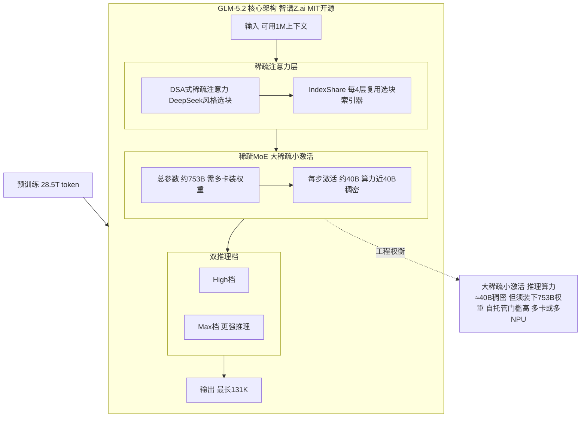
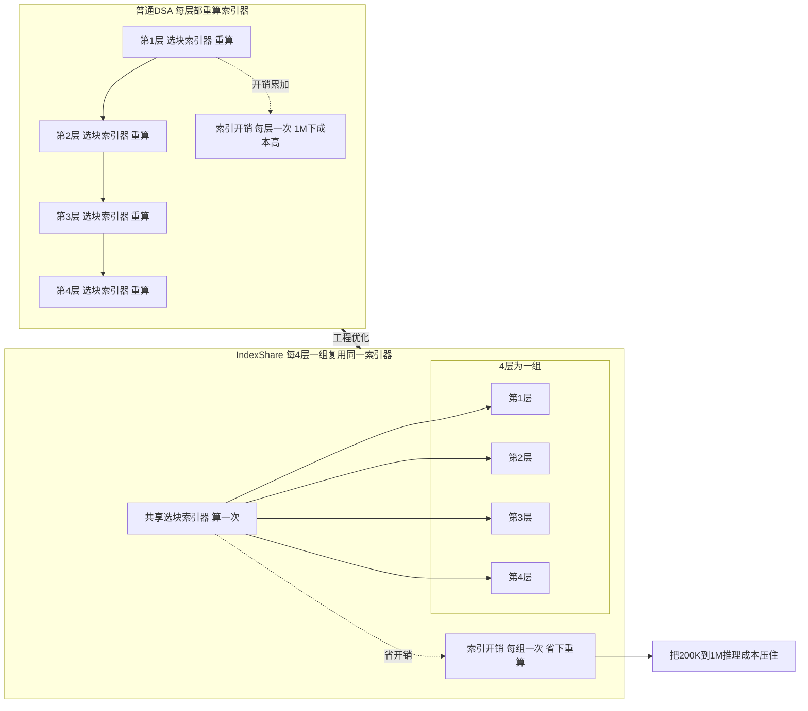
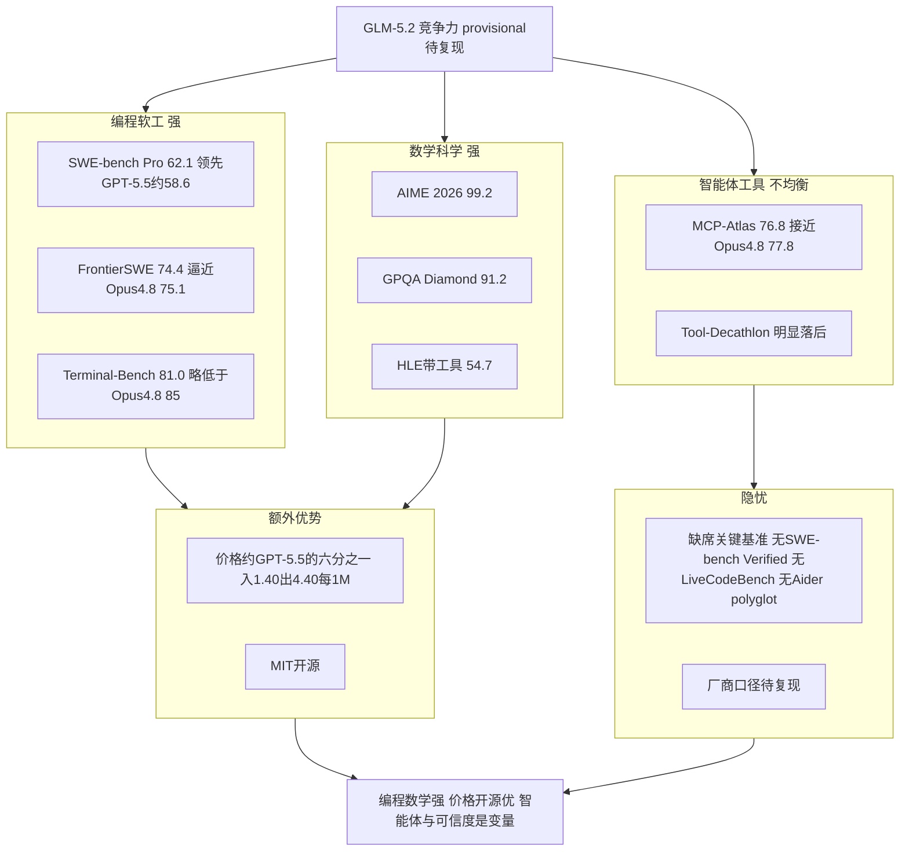
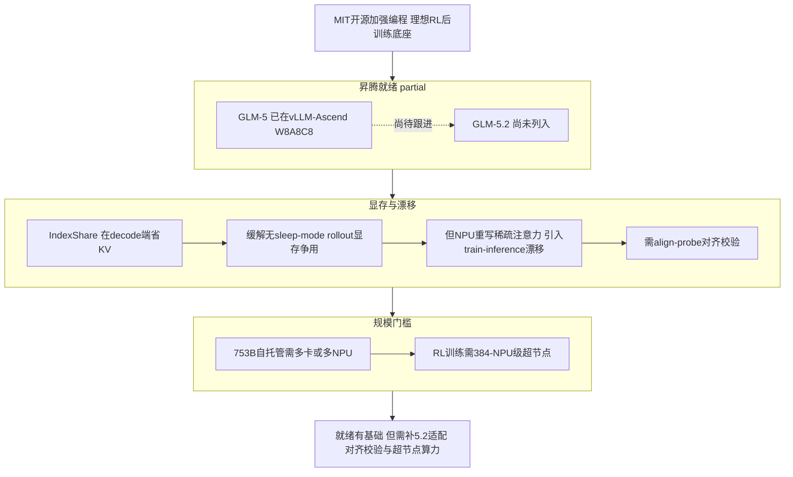

# Dispatch 06 · GLM-5.2 全面评测与技术分析

*2026-06-23 · NPU Frontier Dispatch · model / GLM-5.2 / benchmarks / RL-on-NPU*

> **TL;DR** — GLM-5.2(智谱 Zhipu / Z.ai,2026-06-13,**MIT 开源**)是当前**最强的开源权重编程模型**之一:**~753B MoE / ~40B 激活**,配新的 **IndexShare 稀疏注意力**撑起**可用的 1M 上下文**、131K 输出。编程上 **SWE-bench Pro 62.1**(超 GPT-5.5 的 ~58.6)、**FrontierSWE 74.4**、**Terminal-Bench 2.1 81.0**(逼近 Opus 4.8 的 85);数学 **AIME 2026 99.2**、科学 **GPQA Diamond 91.2**。价格 **$1.40 / $4.40 每 1M(入/出)**,约为 GPT-5.5 的 **1/6**。短板在**智能体工具**(Tool-Decathlon 明显落后)且**没公布** SWE-bench Verified / LiveCodeBench / Aider 这三项社区常用基准——读榜要留个心眼。对 RL-on-NPU:**MIT 许可 + 强编程 = 极佳的开源 RL 后训练基座**;GLM-5 已在 vLLM-Ascend(W8A8C8),5.2 尚未按名列入。

接 Dispatch 05(DeepSeek-V4)。这期应要求,把 **GLM-5.2** 的评测和技术做一次尽量全的梳理。所有数字均为**厂商/媒体口径,provisional**,以官方报告与第三方复现为准。

---

## 1 · 身份与定位

- **厂商**:智谱 AI(国际品牌 **Z.ai**)。
- **发布**:2026-06-13,**MIT 开源权重**(HuggingFace `zai-org/GLM-5.2`)。
- **定位**:coding-first 的旗舰 MoE,主打**智能体工程(agentic engineering)** 与长上下文编码;延续 GLM-5《from Vibe Coding to Agentic Engineering》(arXiv 2602.15763)与 GLM-4.5 ARC(Agentic/Reasoning/Coding,arXiv 2508.06471)的路线。
- 快速迭代:GLM-5 → 5.1 → 5.2,几个月一代,是对出口管制的"开源回应"。

## 2 · 架构详解

| 维度 | GLM-5.2 | 备注 |
|---|---|---|
| 结构 | 稀疏 **MoE** | 承袭 GLM-5 的 744B 级 MoE |
| 总参数 / 激活 | **~753B / ~40B** | 每 token 仅激活 ~40B |
| 注意力 | DSA 式稀疏 + **IndexShare** | 索引器每 4 层一组复用,控 1M 推理成本 |
| 上下文 | **1M**(可用) | 比 GLM-5.1 的 ~200K **翻 5×** |
| 最大输出 | **131,072** token | 长代码 / 长报告 |
| 推理模式 | **High / Max** 双档 | 按难度切深思 |
| 预训练 | **28.5T** token | |
| 许可 | MIT | 可商用、可改、可自托管 |

几个要点:

- **IndexShare 稀疏注意力**是 5.2 的关键工程:为了把 200K→1M 的上下文成本压住,GLM 在 DSA(DeepSeek Sparse Attention)式的稀疏注意力之上加了 **IndexShare**——**把稀疏注意力的"选块索引器"在每 4 层一组里复用**,而不是每层都重算一遍索引,省下索引开销。与 DeepSeek 的 CSA/HCA、MiniMax 的 MSA 同属 2026 的"稀疏注意力潮"(见 Dispatch 04/05)。"可用的 1M"是卖点:号称在几十万 token 后**不塌**,而非纸面长度。
- **40B 激活 / 753B 总**:典型的"大稀疏、小激活"——推理算力≈40B 稠密,但要装下 753B 权重,**自托管门槛高**(多卡/多 NPU)。
- **双推理档(High/Max)**:把"快答"和"深思"分开,贴合编码 vs 智能体长任务。

### IndexShare 到底省在哪

要理解 IndexShare 省的是什么,先讲清 DSA(DeepSeek Sparse Attention)这类"块稀疏注意力"怎么干活。**标准全注意力**里每个 query 都要和序列里所有 KV 做点积,代价随上下文长度平方增长——这正是 200K→1M 最贵的地方。块稀疏的思路是把 KV 序列切成若干"块",每个 query 不再看全部 KV,只看被挑出的少数几块;负责挑块的部件就是**索引器(indexer)/选块器**:它为每个 query 算一个轻量打分,判断"哪些 KV 块和我相关",选出 top-k 块,后续精确注意力只在这 top-k 块上做。于是注意力本体从 O(N²) 压成 O(N·k)。可用 1M "不塌"靠的就是这种"只精算少数相关块"在长序列上仍能锁定关键信息。

**为什么索引器每层重算是开销。** 这个索引器本身不免费——它要为每层、每个 query 跑一遍打分和 top-k 选择;当上下文拉到几十万、上百万 token、块数量膨胀时,"为每一层都重新算一遍该看哪些块"的累积成本变得可观。注意这部分开销和注意力本体是两笔账:你已用稀疏省掉主体 FLOPs,但索引器的"选块"开销会在层数 × 块数上累加,成为新瓶颈。

**IndexShare 怎么省。** 关键观察是:**相邻层的选块模式高度相似**——第 L 层判定相关的那些 KV 块,第 L+1、L+2 层大概率也认为相关。既然如此就没必要每层都重算索引。IndexShare 把索引器**每 4 层编为一组**:组内第一层算出选块结果(块索引),后续 3 层直接复用、跳过重算;注意力本体仍每层各做各的(每层 V 聚合、输出投影不变),被复用的只是"看哪些块"这个索引。粗算索引器选块开销降到约 1/4,这正是它把 200K→1M 成本压住、让长上下文从"能开"变"开得起"的来源。**取舍**:复用越多层,选块越"僵化"——索引每 4 层才更新一次,组内后几层被迫沿用组首层的相关性判断,若某层本应关注的块和组首层不同(不同层负责不同粒度依赖),错配会让精度下降;4 是工程折中,再大省得更多但选块更钝,再小省得有限。

**和 2026 稀疏注意力潮横向对比——各自省哪一块**:**GLM-5.2 IndexShare** 不改稀疏注意力形态,省的是**索引器(选块)的重复计算**;**DeepSeek CSA/HCA** 省的是**注意力本体计算量**(分层粗细结合,减少需精算的 query-KV 对);**MiniMax MSA** 省的是**全注意力层占比**(多数层用便宜的稀疏/线性形态,只在关键层保留全注意力);**MiMo SWA** 省的是**注意力感受野**(每个 query 只看局部窗,远距离依赖靠多层堆叠间接传递)。一句话:IndexShare 省"决定看哪些块"的元开销,CSA/HCA 省"精算多少对"的本体开销,MSA 省"多少层用贵的注意力",SWA 省"每个 query 看多远"。GLM-5.2 的选择最不动注意力形态、最偏工程性削减——这也解释了为什么它能在已有 DSA 方案上叠一层近乎免费的成本优化。(以上机制为厂商口径 provisional,分组大小、索引器结构待复现。)

### 大稀疏小激活:为什么便宜又难自托管

GLM-5.2 是 **753B 总参数 / 40B 激活**的 MoE,这两个数字决定了两件几乎相反的事。**算力只按 40B 激活算——所以便宜**:MoE 每个 token 前向只激活一小部分专家,虽然总权重 753B 但单 token 实际参与计算的只有约 40B(注意力 + 被路由到的少数专家 FFN,其余 700 多 B 这一步根本不参与乘加),所以推理 FLOPs/token ≈ 一个 40B 稠密模型而非 753B;训练同理,算力按激活规模走。算力省 → 单位 token 成本低 → API 便宜($1.40/$4.40 约 GPT-5.5 的 1/6,是结构性来源)。**显存要装下全部 753B——所以难自托管**:算力可只算激活那部分,但显存不行,**MoE 所有专家都得常驻**(无法预知下一个 token 路由到哪些专家,全部权重必须随时可取);753B 即便 8-bit 也要约 750GB 量级、FP16 翻倍,远超任何单卡,自托管推理必须**多卡/多 NPU**把专家切分铺开(专家并行/张量并行),门槛抬到"集群"级——这就是"推理算力≈40B 稠密但装权重门槛高"的全部含义,算力账和显存账完全脱钩。**RL 训练更狠**:推理只需权重 + KV,RL 后训练还要叠**优化器状态、梯度、激活值**外加 rollout 推理副本(优化器状态通常是参数量的数倍显存),对 753B 体量光放下"权重 + 梯度 + 优化器"就需可观卡数,门槛比推理高一个层级——这也是这类模型 RL 训练基本绑定**多卡 / 384-NPU 超节点**(MindSpeed-RL / Atlas 950)的原因,而 IndexShare 在 decode 阶段省下的 KV,恰好缓解"无 sleep-mode rollout"时的显存压力,是它在训练侧的隐性价值。

## 3 · 评测全表(provisional)

**① 编程 / 软件工程**

| 基准 | GLM-5.2 | 对照 |
|---|---|---|
| SWE-bench Pro | **62.1** | GLM-5.1 58.4 · GPT-5.5 ~58.6 |
| FrontierSWE | **74.4** | GPT-5.5 72.6 · Opus 4.8 75.1 |
| Terminal-Bench 2.1 | **81.0**(最佳 harness 82.7) | Opus 4.8 85.0 |

**② 推理 / 数学 / 科学**

| 基准 | GLM-5.2 |
|---|---|
| AIME 2026 | **99.2** |
| GPQA Diamond | **91.2** |
| HLE(Humanity's Last Exam,带工具) | 54.7 |

**③ 智能体 / 工具使用**

| 基准 | GLM-5.2 | 对照 |
|---|---|---|
| MCP-Atlas | **76.8** | Opus 4.8 77.8(几乎打平) |
| Tool-Decathlon | 明显落后 | 落后 Opus 4.8 / GPT-5.5 |

**④ 横向定位**

- Artificial Analysis 上被列为**当前领先的开源权重模型**。
- 对 Opus 4.8:编码差距收到 ~1–4 分(FrontierSWE 74.4 vs 75.1、MCP-Atlas 76.8 vs 77.8、Terminal-Bench 81 vs 85),个别项在最佳 harness 下反超。
- 对 GPT-5.5:SWE-bench Pro(62.1 vs ~58.6)、FrontierSWE(74.4 vs 72.6)**领先**。

## 4 · 价格(API)

| 模型 | 输入 $/1M | 输出 $/1M | 相对 |
|---|---|---|---|
| **GLM-5.2** | **1.40** | **4.40** | 基准 |
| GPT-5.5 | 5 | 30 | ~6× 贵(综合) |
| Claude Opus 4.8 | 5 | 25 | ~5–7× 贵 |

开源 + 便宜 + 1M 上下文,是 GLM-5.2 最锋利的组合拳:**性能贴近闭源旗舰,价格约 1/6**。

## 5 · 强项与短板(读榜须知)

**强项**
- **编程/软工**是主战场:SWE-bench Pro、FrontierSWE、Terminal-Bench 都在第一梯队。
- **数学/科学**:AIME 2026 99.2、GPQA 91.2 非常高。
- **可用的 1M 上下文** + **MIT 开源** + **极低价**。

**短板 / 需要警惕**
- **智能体工具不均衡**:MCP-Atlas 接近 Opus,但 **Tool-Decathlon 明显落后**,HLE(带工具)54.7 一般。多步工具编排还不是它的强项。
- **关键基准缺席**:智谱**没有公布** SWE-bench **Verified**、**LiveCodeBench**、**Aider polyglot**——恰恰是开源社区最常用的三项 agentic-coding 基准。选了对自己有利的榜单,**对比时要补齐这块空白**。
- **API 数据风险**:有报道提示通过其 API 使用存在中国数据合规顾虑;**自托管(MIT 权重)可规避**这条。
- 所有数字仍是**厂商/媒体口径**,待第三方复现。

### 读榜须知:缺席的基准与不均衡的智能体能力

看榜要看两件事:**公布了什么,以及没公布什么。** **缺席的三项恰好是社区最常用、可独立复现的**:厂商口径里没有 **SWE-bench Verified、LiveCodeBench、Aider polyglot**,这三项共同点是社区使用最广、有公开 harness、第三方可独立跑出来对账。一个模型选择性公布对自己有利的榜单是行业常态、本身不构成"造假",但当**恰好是这三项最易被外部复现的基准集体缺席**、公布的却是 SWE-bench Pro、FrontierSWE、MCP-Atlas 这类相对新或复现门槛更高的榜时,中立解读是:保留判断,等独立复现——披露的选择本身就是信息。**智能体能力画像不均衡:单步 ok,多步弱**:**MCP-Atlas 76.8** 几乎打平 Opus 4.8 的 77.8,但 **Tool-Decathlon 明显落后**;MCP-Atlas 偏单次/浅层工具调用正确性,Tool-Decathlon 考多步、多工具的编排与长链路状态保持——一高一低拼出的画像是"**单步工具调用已到第一梯队,但多步工具编排(规划、错误恢复、跨步状态维持)是明显短板**",这和它在 FrontierSWE / Terminal-Bench 2.1 上"逼近但够不到 Opus"方向一致:越是长链路、状态密集的智能体任务,差距越显。**结论**:数学(AIME 99.2)、知识(GPQA 91.2)、单步工具的数字确实强,SWE-bench Pro 甚至声称领先 GPT-5.5,但落地为采购/选型依据前**必须补齐独立复现**——尤其把缺席的 Verified / LiveCodeBench / Aider 跑出来、单独压测多步工具编排。在那之前所有结论都带 provisional 前缀。

### 效果 / 对比速查(provisional)

跨基准对比(均厂商/媒体口径,缺失项以 — 标注):

| 基准 | GLM-5.2 | GPT-5.5 | Opus 4.8 | GLM 相对位置 |
|---|---|---|---|---|
| SWE-bench Pro | **62.1** | ~58.6 | — | 领先 GPT-5.5 |
| FrontierSWE | 74.4 | — | 75.1 | 逼近 Opus,小幅落后 |
| Terminal-Bench 2.1 | 81.0 | — | 85 | 落后 Opus 约 4 分 |
| MCP-Atlas | 76.8 | — | 77.8 | 基本打平 Opus |
| Tool-Decathlon | 明显落后 | — | — | 短板,多步编排弱 |
| AIME 2026 | 99.2 | — | — | 第一梯队 |
| GPQA Diamond | 91.2 | — | — | 第一梯队 |
| 价格(入/出,每 1M) | $1.40 / $4.40 | ~6× GLM | — | 约 GPT-5.5 的 1/6 |

2026 稀疏注意力横向(省的是哪一块):

| 方案 | 机制 | 省的方式 |
|---|---|---|
| GLM-5.2 IndexShare | DSA 式块稀疏 + 索引器每 4 层一组复用 | 省**索引器(选块)的重复计算**——跨层复用块索引,压住 200K→1M 索引开销 |
| DeepSeek CSA / HCA | 块稀疏选择(CSA)+ 分层注意力(HCA) | 省**注意力本体计算量**——分层粗细结合,减少需精算的 query-KV 对 |
| MiniMax MSA | 全注意力层与稀疏/线性层交错 | 省**全注意力层占比**——多数层用便宜形态,仅关键层保留全注意力 |
| MiMo SWA | 滑动窗口 + 少量全局 token | 省**注意力感受野**——只看附近,远距离依赖靠多层堆叠间接传递 |

> 两表均厂商/媒体口径(provisional);SWE-bench Verified / LiveCodeBench / Aider polyglot 厂商未公布,采购/选型前需以公开 harness 独立复现对账,稀疏注意力实现细节同样待官方确认。

## 6 · 对 RL-on-NPU 的意义

为什么本看板把 GLM-5.2 看作**首选开源 RL 基座**:

- **MIT + 强编程 = 理想的 RL 后训练底座**。可商用、可改权重,适合在昇腾上做 GRPO/RLVR 的开源实验对象;编程/智能体方向恰是 agentic RL 的训练场。
- **昇腾就绪度:partial**。GLM-5 已在 **vLLM-Ascend**(性能优化 + **W8A8C8** 量化),**GLM-5.2 尚未按名列入**——是个明确、可做的移植缺口。
- **IndexShare 稀疏注意力 = 又一条要移植/对齐的路径**。decode 端省 KV 直接缓解昇腾"无 sleep-mode"的 rollout 显存争用(见 NPU 架构页"RL 显存争用"视图);但 NPU 上重写稀疏注意力会引入 train-inference 数值漂移——交给 **align-probe** 量化。
- **自托管成本高**:753B 总参数要多卡/多 NPU,RL 训练更需 384-NPU 级超节点(对口 MindSpeed-RL / Atlas 950,见 Dispatch 03)。

## 7 · 下一步看什么

1. **第三方复现 + 补齐缺席基准**:SWE-bench Verified / LiveCodeBench / Aider 的独立结果。
2. **GLM-5.2 进 vLLM-Ascend 的时间点**与量化方案(W8A8C8?)。
3. **IndexShare 的机制细节**:与 DSA / MSA / CSA-HCA 的异同——值得单开一期详解。
4. **拿 GLM-5.2 当基座在昇腾上做 RL** 的首个端到端工作。

---

*来源:GLM-5.2 评测/解析(theairankings、edenai、digitalapplied、apidog、lushbinary、bitsminds、techtimes、latent.space、Hacker News 等)、智谱/Z.ai 与 HuggingFace `zai-org/GLM-5.2`、GLM-5 技术报告(arXiv 2602.15763)、GLM-4.5 ARC(arXiv 2508.06471)、vLLM-Ascend 支持矩阵。数字均为厂商/媒体口径,provisional。相关卡片见本看板 LLM Modeling 标签页与 Overview 对比组件。*
