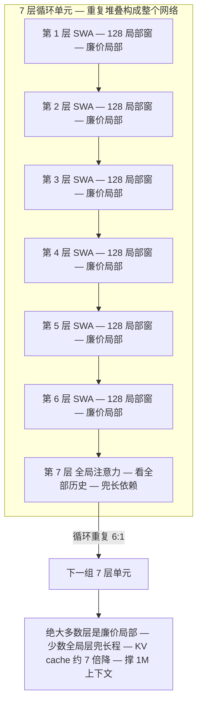
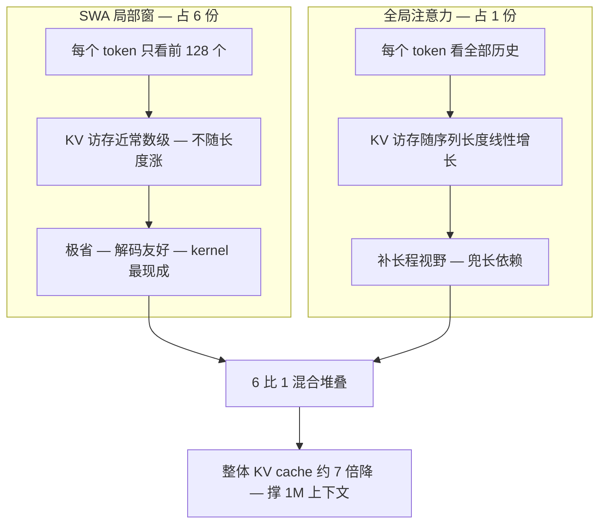
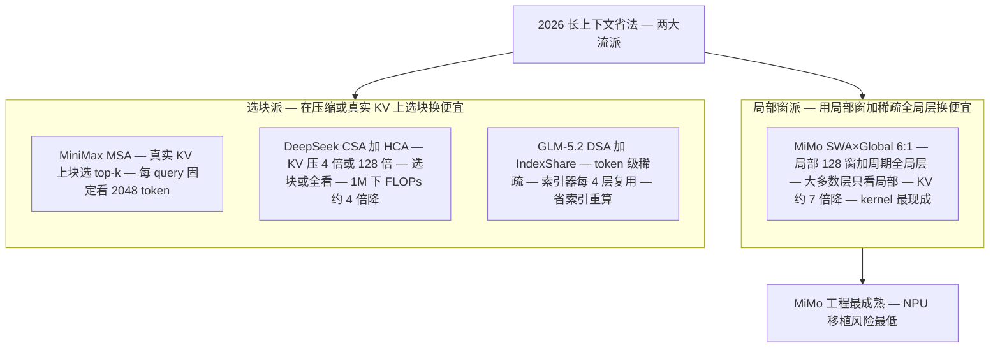
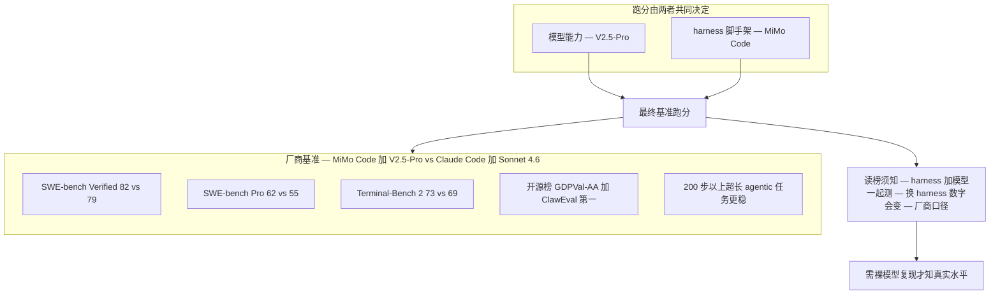

# Dispatch 07 · 详解 MiMo-V2.5-Pro:滑窗×全局 6:1 混合注意力 + MiMo Code

*2026-06-25 · NPU Frontier Dispatch · model / MiMo-V2.5 / hybrid-attention / RL-on-NPU*

> **TL;DR** — MiMo-V2.5-Pro(小米,2026-04-28,**MIT 开源**)是一记"硬件厂商杀进模型赛道"的重拳:**1.02T / 42B 激活 MoE**,但长上下文的省法和别家都不同——不靠块稀疏(MSA/DSA),而是**交替堆叠滑动窗口注意力(SWA,128-token 窗)与全局注意力,比例 6:1**,把 KV cache 砍掉约 **7×**,撑起 1M 上下文。真正的杀手锏是配套的 **MiMo Code** 智能体编码 harness:厂商基准里 MiMo Code + V2.5-Pro 在 **SWE-bench Verified 82 / Pro 62 / Terminal-Bench 2 73** 上分别压过 Claude Code + Sonnet 4.6,且在 **200+ 步超长任务**上更稳。对 RL-on-NPU:SWA 解码极省、7× KV cut 直接缓解 rollout 显存,MIT 许可适合做 RL 基座——**但目前没有 Ascend 移植**,且跑分与 harness 强绑定,要打折看。

接 Dispatch 06(GLM-5.2)。应要求把这次研究动态里最值得单讲的新模型 **MiMo-V2.5-Pro** 拆开。所有数字均**厂商/媒体口径,provisional**。

---

## 1 · 身份与定位

- **厂商**:小米(Xiaomi);MiMo 团队。
- **发布**:2026-04-28 正式开源(4-23 起公测),**MIT 许可**(可商用推理 + 二次训练,无需额外授权)。
- **家族**:
  - **MiMo-V2.5-Pro** —— 旗舰,**1.02T 总 / 42B 激活** MoE,面向编码 agent、复杂软件工程、超长工具链。
  - **MiMo-V2.5**(标准)—— **310B 总 / 15B 激活**,约 **48T token** 预训练。
- **定位**:agentic coding + 长程推理 + 多模态;主打"硬件厂商把端侧/Agent 能力做进开源大模型"。

## 2 · 核心:滑窗 × 全局 6:1 的混合注意力

MiMo 走的不是"块稀疏选择"那条路(MSA 选块、DSA token 级 top-k、GLM-5.2 IndexShare 复用索引器),而是经典但有效的 **局部 / 全局交替**:

- **SWA(Sliding-Window Attention)**:大多数层只看 **128 token 的局部窗口**——极省、解码友好。
- **Global Attention**:每隔几层插一层**全局注意力**,补"长程视野"。
- **比例 6:1**:每 6 层 SWA 配 1 层全局。绝大多数层是廉价的局部注意力,少数全局层兜住长依赖。
- **效果**:长上下文下 **KV cache ~7× 降**,质量不塌,支撑 **1M** 上下文。

### SWA×Global 6:1 的工程直觉

把注意力拆成两类层来理解最直观:**滑窗层(SWA)负责"近"、全局层负责"远"**。绝大多数层是 128-token 滑动窗,每个 query 只看自己左侧 128 个 token,这恰好对应自然语言里信息密度最高的那部分依赖:局部语法、变量名的就近引用、当前函数体内的上下文、代码块的缩进配对。这类细粒度依赖天然短程,用一个 128 窗就能吃满,既便宜又对解码极友好。

问题在于:单层只看 128,长程信息怎么办?答案是**堆叠带来的有效感受野扩张**——卷积网络早就吃透的直觉:第 1 层某位置看到左边 128 个 token,第 2 层在该位置聚合的是"已各自吸收了各自 128 邻域"的表示,有效视野近似变 2×128;堆叠 L 层 SWA,有效感受野约 L×W。但纯靠接力有两个硬伤:① 信息要逐层逐窗搬运,远处关键 token 经过很多跳才能影响当前位置,每跳被稀释(类似"传话游戏"失真);② 接力是线性慢传播,对"一步精确跳到 5 万 token 外某句话"的检索很不利。

**周期性全局层就是来补这两个洞的。** 每 6 层 SWA 后插 1 层全局注意力,这层每个 query 直接看全序列,干两件事:**汇聚(gather)**——把分散在长上下文里的远程信息一次性收拢进当前表示;**广播(scatter)**——这层算出的富含全局信息的表示成为后续 6 层 SWA 的输入,全局信息又被播撒回局部窗供下游加工。每 7 层就有一次直达通道,远程依赖不必只靠几十跳接力硬扛。**6:1 是成本-质量取舍**:全局层是 O(n²)(或线性近似)的全序列注意力、KV 要保全历史,是最贵最吃显存的部分,把占比压到 1/7 意味着只有约 14% 的层背"全历史 KV"包袱,其余 86% 的层 KV 是常数级 128 窗;全局层太少则长程直达通道稀疏、汇聚-广播频率不够,深层多跳可能漏检。注意 7× 和 6:1 直接呼应:约 6/7 的层从"线性增长全历史 KV"降级为"常数 128 窗 KV",整体 KV 占用就压到约 1/7——配比和省下的显存是同一枚硬币的两面。

### 为什么 7× KV cut 对解码与 rollout 是真红利

自回归解码每步只生成 1 个 token,算的是 batch×1 的矩阵-向量乘,**算术强度极低**,在现代加速器上是彻底的 **memory-bound**:吞吐不取决于峰值算力,而取决于每步要从 HBM 搬多少字节。其中 KV cache 访存是大头,且随上下文长度**线性增长**——长上下文 decode 的痛点本质就是"KV 访存墙"。SWA 直接拆掉大部分这堵墙:对约 6/7 的滑窗层,每个 token 解码只需读最近 **128** 个 KV,**与上下文总长无关、常数级**;只有 1/7 全局层还背全历史 KV。于是 KV 显存占用 ≈ 全模型 1/7(对应那约 7× cut),decode 每步 KV 访存量同样砍到约 1/7,memory-bound 阶段访存墙被显著松绑。

**为什么这对 RL rollout 收益最大?** RL 训练的 rollout 阶段是 **decode-heavy**:要让模型大量自回归"跑"出轨迹(尤其 200+ 步长 agent 任务),几乎全是 decode、全程 memory-bound,正好命中 SWA 甜区——rollout 吞吐直接吃到约 7× KV 访存红利,单位时间跑出更多轨迹;在 NPU/共享显存场景里 7× KV 占用下降意味着不用为腾 KV 而频繁触发 sleep-mode / 显存争用,rollout 与其它进程的显存挤兑被松绑。**和块稀疏派的工程差异**:块稀疏(MSA/DSA/CSA)KV 该保的都保,decode 时每个 query 动态选 top-k 块去读,省的是"读多少",但需**自定义稀疏注意力算子**(gather/scatter、块索引、top-k、变长 kernel),移植(尤其到 NPU)风险高;SWA 局部窗是**静态、连续、固定 128** 的滑动区间,本质就是带 mask 的稠密注意力,**kernel 现成最成熟**(FlashAttention 类原生支持滑窗),省得没块稀疏那么"聪明",但工程确定性最高、移植风险最低——代价是 SWA 窗口边界和全局层的 NPU 重写仍需 **align-probe** 对齐校验,且当前无 Ascend 现成移植。

和 2026 几条长上下文路线对照:

| 方案 | 机制 | 省的方式 |
|---|---|---|
| **MiMo-V2.5(SWA×Global 6:1)** | 局部 128-窗 + 周期性全局层 | 大多数层只看局部 → KV ~7×↓ |
| MiniMax **MSA** | 真实 KV 上块选 top-k | 每 query 固定看 2048 token |
| DeepSeek **CSA+HCA** | KV 压 4× / 128× + 选/全看 | 压缩 KV,1M 下 FLOPs↓~4× |
| GLM-5.2 **DSA + IndexShare** | token 级稀疏 + 索引器每 4 层复用 | 省索引重算 |

一句话:**MiMo 用"局部窗 + 稀疏全局层"换便宜,别家用"在压缩/真实 KV 上选块"换便宜。** 局部窗的工程最成熟、kernel 最现成。

### SWA×Global vs 块稀疏:长检索质量的隐忧

公平地说,局部窗派不是没有代价,质疑主要落在**长距离精确检索**上。核心担忧来自一个结构事实:**单个 SWA 层只看 128 token**,任何"一步跳到很远处某个精确 token"的能力,在滑窗层里不存在——它只能靠堆叠接力慢传,或靠那 **1/7 的全局层**直达兜住。于是长程检索任务把压力全压到全局层上:**大海捞针**(针埋在 90 万 token 处,滑窗层够不着,只有全局层那一次直达能抓到;若针所在位置在所有全局层都没被有效汇聚进来就漏)、**多跳推理**(答案要跳 A→B→回来,每跳一次远程检索,全局层每 7 层才出现一次,直达通道"频率"是否够支撑所需跳数是经验问题);一旦漏检,后续 6 层 SWA 只能在局部窗加工、**没有补救通道**,直到下一个全局层——而那时上下文可能已被错误表示带偏。

对照之下,**块稀疏的灵活性正在这里**:它的稀疏是**按 query 动态决定**(每个 query 自己挑要看哪些块),需要看远处某块就把那块选进来,不受"固定 128 窗 / 每 7 层才有一次全局"的结构约束;且在真实或压缩 KV 上做选择,远程信息一直"在场且可被选中",不依赖周期性汇聚-广播搬过来。代价就是自定义稀疏算子、工程和移植复杂度更高。需要强调这些都是**结构层面的"有可能",不是定论**:堆叠后的有效感受野 + 周期全局层在很多长上下文任务上实测足够;全局层那一跳是真·全序列直达、单次检索能力其实很强,隐忧主要在"频率"和"漏了无补救",不在"能力上限";块稀疏的 top-k 也不是没有失配风险(选错块同样漏)。所以结论中立且可证伪:**SWA×Global 在长检索上是否够用,不能靠结构推演下定论,要看裸模型(去掉 harness 加成)在长检索基准——长上下文 needle、多跳 QA、长文档检索——上的实测数字**。结构告诉你风险在哪,基准才告诉你风险有没有兑现。

## 3 · 杀手锏:MiMo Code 智能体 harness

MiMo 的卖点不只是模型,还有配套的 **MiMo Code** —— 一个开源 agentic 编码 harness。厂商基准(MiMo Code + V2.5-Pro vs Claude Code + Sonnet 4.6):

| 基准 | MiMo Code + V2.5-Pro | Claude Code + Sonnet 4.6 |
|---|---|---|
| SWE-bench Verified | **82** | 79 |
| SWE-bench Pro | **62** | 55 |
| Terminal-Bench 2 | **73** | 69 |

- 另:开源榜 **GDPVal-AA / ClawEval 第一**。
- 媒体强调它在**200+ 步的超长 agentic 任务**上比 Claude Code 更稳。
- **读榜须知**:这些是 **harness + 模型一起**测的(MiMo Code 这套脚手架本身在帮分),换个 harness 数字会变;且全是厂商口径。**和裸模型对比时要注意这层耦合**。SWE-bench Verified 82 若成立,会是当前开源最高。

可信的相对优势在于厂商强调的 **200+ 步长任务更稳**——这与 SWA 的 decode/rollout 红利方向一致(decode-heavy 长轨迹更省、更不易崩),属于结构上说得通的优势;但具体领先幅度仍需独立、对齐 harness 的评测确认。

## 4 · 价格

- 输入约 **$1.00 / 1M token**(token-efficient agent 定位)。输出价各源不一,这里从略。
- 叠加 MIT 开源可自托管,成本面对标 GLM-5.2 / DeepSeek-V4 那一档(便宜)。

## 5 · 对 RL-on-NPU 的意义

- **SWA 解码极省,正中 rollout 痛点**。RL 的 rollout 是 decode-heavy + memory-bound;128-token 滑窗让绝大多数层的 KV 访存几乎是常数级,**7× KV cut** 直接松绑昇腾"无 sleep-mode"的显存争用(见 NPU 架构页"RL 显存争用"视图)。这是比块稀疏更易拿到的工程收益。
- **kernel 最现成**。SWA + 周期性全局是成熟模式,NPU 上重写比 MSA/DSA/CSA 这类自定义稀疏注意力风险更低——**移植友好度高**。
- **MIT = 可做 RL 基座**。可商用 + 可二次训练,适合在昇腾上做 agentic RL 实验;MiMo Code 的多步 agent 场景本身就是 agentic RL 的训练场。
- **但有两个坎**:① **目前无 Ascend 移植**(未在 vLLM-Ascend 列出);② 跑分 harness 强绑定,需要裸模型复现来定真实水平。
- **数值一致性**:SWA 的窗口边界 + 全局层在 NPU 上重写,仍要用 **align-probe** 量化 train-inference 漂移。

## 6 · 下一步看什么

1. **裸模型(非 MiMo Code)复现**:SWE-bench Verified/Pro 在标准 harness 下还剩多少。
2. **MiMo-V2.5 上 vLLM-Ascend 的时间点**:SWA 混合注意力在 910B/950 上的吞吐与精度。
3. **SWA×Global vs 块稀疏的长检索质量**:6:1 的局部/全局配比在多跳/长检索上是否够稳。
4. **MiMo Code 当 agentic RL 环境**:把它的 200+ 步任务做成 RL 训练/评测环境。

---

*来源:小米 MiMo 官方(mimo.mi.com / mimo.xiaomi.com)、MiMo-V2.5 开源公告、VentureBeat(MiMo Code vs Claude Code)、BigGo/fonearena/Medium 等解析。规格与跑分均厂商/媒体口径,provisional;基准与 MiMo Code harness 耦合。相关卡片见本看板 LLM Modeling 标签页与 Overview 对比组件。*
