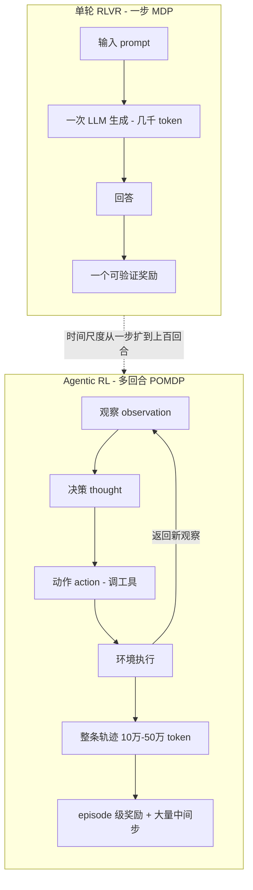
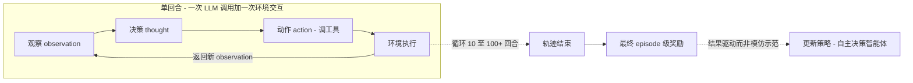
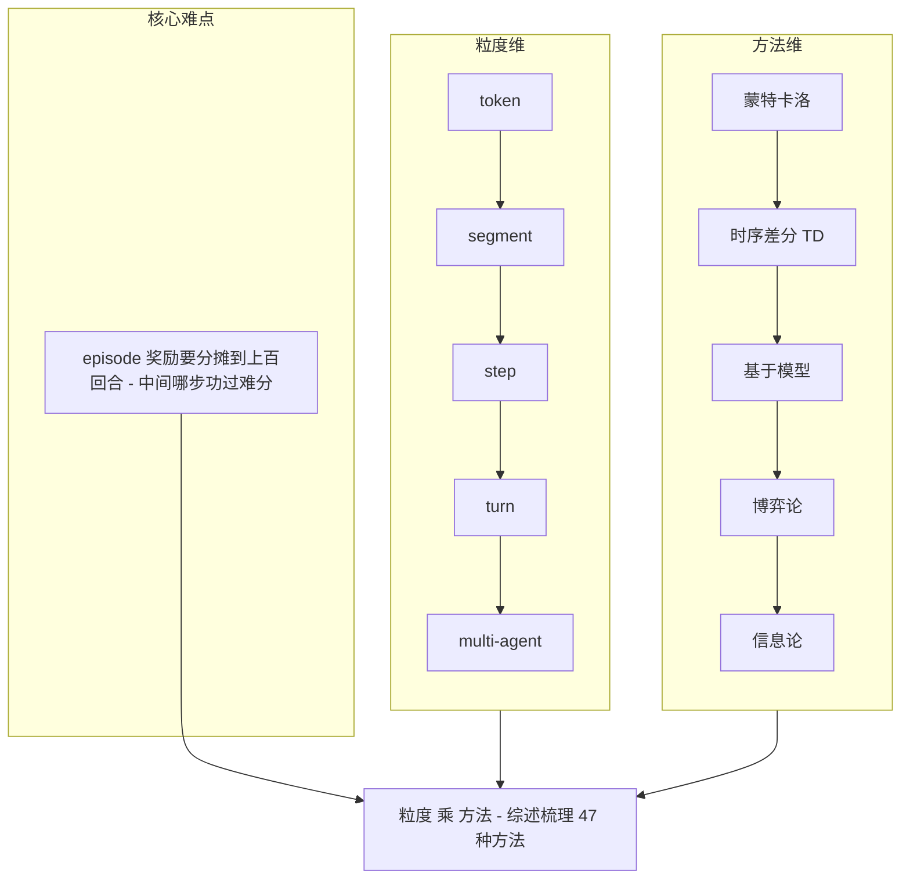
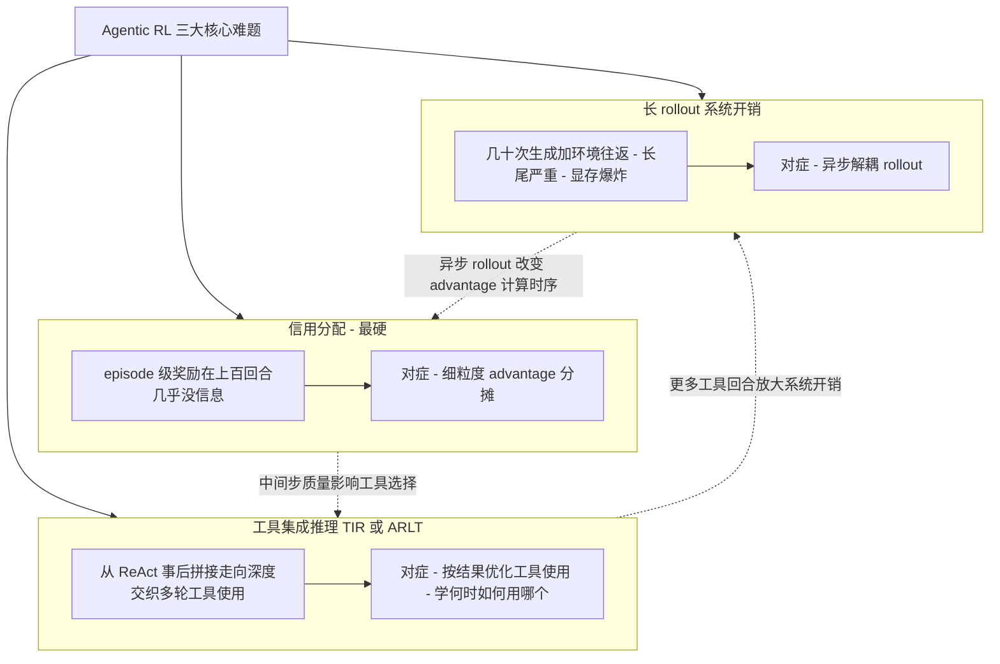
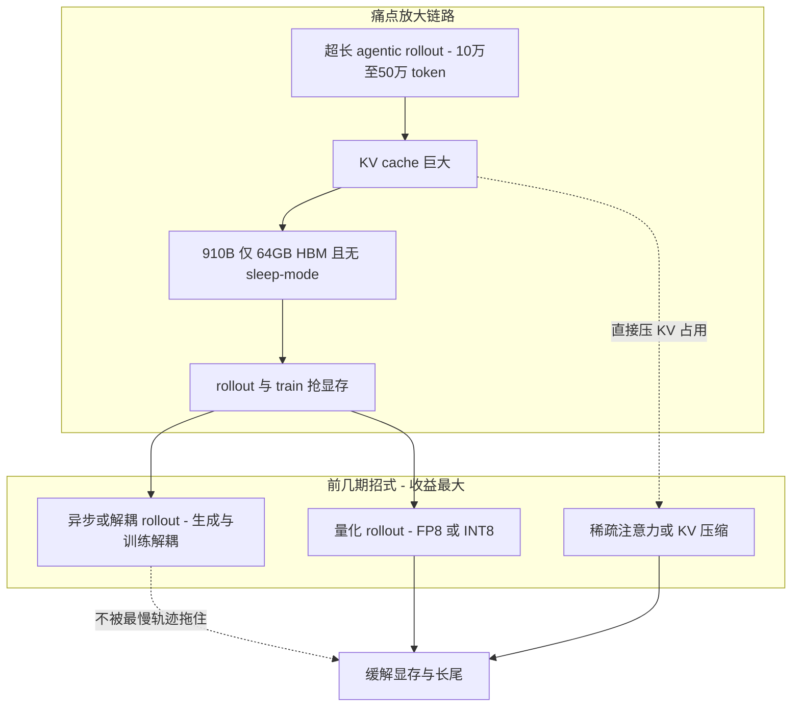

# Dispatch 08 · Agentic RL 入门:从"会推理"到"会行动"

*2026-06-25 · NPU Frontier Dispatch · agentic-RL / tool-use / credit-assignment / RL-on-NPU*

> **TL;DR** — Agentic RL 是 2026 的 RL 主线:把 LLM 从"被动生成序列"训成"自主决策的智能体"。它和单轮 RLVR 的根本区别是**时间尺度**——单轮是一步 MDP,agentic 是**跨 10–100+ 回合的 POMDP**,每回合一次 LLM 调用 + 一次环境交互,整条轨迹动辄 **10万–50万 token**。由此带来三个核心难题:**① 信用分配**(episode 级奖励在上百回合里几乎没信息)、**② 工具集成推理 TIR**(学会"何时/如何/用哪个"工具,而非模仿 ReAct 脚本)、**③ 长 rollout 的系统开销**。一批框架(VerlTool、AgentRL、SkyRL-Agent、ProRL Agent、ARLArena)和综述正在把它工程化。对 RL-on-NPU:**超长 agentic rollout 把昇腾"无 sleep-mode + 64GB HBM"的显存痛点放大到极致**——这恰恰让 async/解耦 rollout、量化 rollout、稀疏注意力(Dispatch 02/04/05)在这里收益最大。

这期不讲单个模型,讲一个**范式**。应要求,把 agentic RL 的地图、难题、框架和它对昇腾的含义梳理一遍。论文均 arXiv 一手来源。

---

## 1 · 什么是 Agentic RL

一句话:**从"奖励一段推理"变成"奖励一串行动"。**

| | 单轮 RLVR(如 R1) | **Agentic RL** |
|---|---|---|
| 形式 | 一步 MDP:prompt → 回答 → 奖励 | 多回合 **POMDP**:观察→动作→环境→… |
| 轨迹 | 1 次生成 | **10–100+ 回合**,每回合 LLM + 环境 |
| token | 几千 | **10万–50万+** |
| 信号 | 一个可验证奖励 | episode 级奖励 + 大量中间步 |
| 能力 | 推理 | 用工具、查资料、写代码、跑命令、纠错重试 |

它把 LLM 从"passive sequence generator"重塑为"autonomous decision-maker":**自己决定何时调工具、调哪个、看了结果怎么继续**——靠结果驱动(outcome-driven)而非模仿示范(imitation)。

放大看 agentic 的单回合内部——一次 LLM 调用 + 一次环境交互,循环 10–100+ 回合后才结算 episode 奖励:

## 2 · 三个核心难题

**① 信用分配(Credit Assignment)—— 最硬的前沿**
轨迹跨上百回合,只有最后一个 episode 级奖励,**中间哪一步功过难分**。2026 的一篇综述梳理了 **47 种信用分配方法**,按两维分类:**粒度**(token / segment / step / turn / multi-agent)× **方法**(蒙特卡洛 / 时序差分 TD / 基于模型 / 博弈论 / 信息论)。这是 agentic RL 能否扩到长程任务的瓶颈。

**② 工具集成推理(TIR)/ ARLT**
从 ReAct 式"先想后做"的事后拼接,走向**深度交织的多轮工具使用**。RL 把范式从"模仿工具调用脚本"换成"按结果优化"——智能体自己学会 **何时、如何、用哪个工具**。这条线叫 **ARLT(Agentic RL with Tool use)**。

**③ 长 rollout 的系统开销**
一条 agentic 轨迹要跑几十次"生成 + 环境往返",**rollout 比单轮重得多、长尾更严重、显存占用爆炸**。所以 agentic RL 框架普遍押注**异步 rollout**(让生成和训练解耦、不被最慢的轨迹拖住)。

### 为什么信用分配是最硬的一环

在单轮 RLVR 里,信用分配几乎不成问题:一步 MDP,一个动作对应一个可验证奖励,梯度直接落在产生答案的 token 上。Agentic RL 把这件事打碎——一条轨迹跨 10-100+ 回合、动辄 10 万到 50 万 token,而奖励往往只在 episode 结束时给一个标量。问题立刻变成:这一个标量,要怎么公平地分摊回上百个回合、成千上万次 token 级决策?

**信号被稀释。** 一个 episode 级奖励平摊到 100 个回合,每回合分到的平均信息量极低;真正决定成败的可能只是其中两三步关键决策(选错工具、漏了检索、在某分支走偏),其余 97 步要么无关、要么陪跑。但稀疏 outcome 奖励无法区分这些:它只知整条轨迹赢了还是输了,不知功在哪步、过在哪步。结果是大量正确中间步因最终失败被一起惩罚(把好动作也压低),大量平庸甚至有害步骤因最终成功被一起强化(把运气当本事)。回合越多,这种"功过连坐"越严重,有效信噪比越低——这也是为什么综述要梳理多达 47 种方法:它本质是一个被反复攻击但没有银弹的开放问题。

**粒度的取舍是核心张力。** 往粗了调(episode / turn 级):**信号强、统计稳**(一个 turn 聚合内部所有 token 的贡献,优势估计噪声小),代价是**定位差**(知道整回合好坏,但回合内哪几个 token 起作用分不出,梯度糊在整段上)。往细了调(token 级):**定位准**(理论上能精确到 token),但单 token 上有效信号极弱、**方差极大、噪声主导**,长程稀疏下往往是在拟合噪声、训练易崩。step / segment 级居中。**蒙特卡洛 vs TD 是长程下的方差-偏差权衡**:MC 用整条轨迹真实回报,无偏但长轨迹上方差爆炸;TD 用自举逐步传播价值,方差小、信用能沿回合链回传,但引入偏差且极长程下偏差累积、价值函数本身难训准。长程恰是两者各自最难受的区间——这正是基于模型、信息论等方法被不断提出的原因。**所以"够用粒度"是工程选择而非理论最优**:问的不是"哪个粒度理论最精细",而是"这个任务的奖励稀疏度、回合长度、单步重要性分布,需要多细才能把信号传到位、又不被噪声淹没"。够用就好,多切一档,开销和方差都上去、收益可能为负。

### TIR:从模仿 ReAct 到按结果优化工具

工具集成推理(TIR)是 agentic 能力的核心:模型要决定何时调工具、调哪个、怎么读返回、读完如何续推理。用模仿示范(SFT)和用 RL 按结果优化(ARLT),学到的是两种本质不同的东西。

**模仿学到的是"长得像会用工具"。** SFT 在 ReAct 轨迹上做下一 token 预测,优化"复现示范的 token 分布"。模型学到的是形式:该出现 `Action:` 的地方出现 `Action:`,工具名和参数写得格式正确、读起来像专家轨迹。但它优化的从来不是"调用是否真有用",而是"是否长得像示范"。典型失败:工具调得格式漂亮但时机不对、查询通顺但检索不到关键信息、拿到返回不会据结果改后续(看到空结果还硬编),以及遇到分布外情形不会自适应——因为它从没见过"调错之后怎么补救"的样本。

**RL 按结果优化学到的是"真用对工具"。** outcome-driven 信号不在乎轨迹像不像示范,只在乎最终有没有把任务做成,把优化目标从"模仿形式"换成"对结果负责"。正因为信号绑在结果上,模型能学出 SFT 学不到的几类能力——**何时调**(信息不足时主动触发,而非机械照搬示范节奏)、**调哪个**(在多工具间按预期收益选择)、**看结果怎么续**(据返回决定采纳、换查询、还是换工具重试)。这些是"对工具调用后果建模"的能力,而后果信息只存在于 outcome 奖励里,示范的 token 分布里没有。**但奖励稀疏让工具学习格外难**:一条成功轨迹里 10 次工具调用真正起作用的或许只有 2 次,outcome 奖励却把 10 次一起强化;失败轨迹里某次关键调用其实对的,也因后续走偏被一起惩罚——这会教出"无脑多调工具""调了也不甄别"等坏习惯。所以 TIR 的 RL 往往要配合更细的信用分配粒度(turn / step 级),或借 agentic verifier、过程奖励,把"这次调用是否有用"的信号从最终结果里剥离出来。

### 长 rollout 与异步:为什么同步会被长尾拖死

Agentic rollout 的轨迹长度分布是**重尾**的:同批任务里大部分轨迹很短(几回合就终止),少数极长(反复调工具、反复试错,拖到 10 万-50 万 token)。这个形状对系统吞吐是致命的。**同步批生成会被最长那条拖死**:经典 on-policy 同步流程是 rollout 整批 → 全部生成完(barrier)→ 算 advantage → 更新 → 下一批。只要一批里有一条要跑 100 回合,整批就得等它,先跑完的几十条短轨迹对应的 NPU 算力就在那**干等**。重尾越明显,尾部等待越夸张。对昇腾这个痛点被放大:**无 sleep-mode**,空闲推理实例不能让出显存/被回收,等待期间资源实打实浪费;叠加 **64GB 显存**,超长 rollout 的 KV cache 本就吃紧,长尾期间还占着不放。**异步解耦把生成和训练拆开救场**:推理 server 持续产轨迹,谁先跑完谁先交付;trainer 从完成队列拉**已完成**的轨迹凑 batch 就更新,不等还在跑的长轨迹。短轨迹跑完立刻被消费、推理实例立刻接新任务,长轨迹后台继续跑不阻塞任何人,NPU 利用率显著回升。**代价是 staleness 与 off-policy**:一条轨迹开始生成时用 $\pi_{old}$,等它(尤其长轨迹)跑完交给 trainer 时策略已更新过几次成 $\pi_{new}$,训练数据相对当前策略是陈旧的、off-policy 的;轨迹越长、异步程度越高,staleness 越严重(长尾轨迹恰是最陈旧、又往往信息最丰富的困难样本)。所以异步不是免费午餐,需配合重要性采样修正、限制最大 staleness、或对过旧轨迹降权。

## 3 · 框架地图(2026)

| 框架 | 定位 | 关键点 |
|---|---|---|
| **VerlTool**(ARLT) | verl 上的工具使用 agentic RL | 全异步 rollout,统一工具接口 |
| **AgentRL** | 多轮 × 多任务 RL 系统 | 规模化 agentic 训练 |
| **Agent-R1** | 工具环境下的多轮推理 RL | 多轮 + 工具调用 |
| **SkyRL-Agent** | 高效多轮 agent 训练 | 针对多轮的训练效率 |
| **ProRL Agent** | Rollout-as-a-Service | 把 agent rollout 生命周期做成 API(见 RL 标签卡) |
| **ARLArena** | 统一、稳定的 agentic RL | 稳定性 + 统一环境 |
| **AgentV-RL** | 用 agentic verifier 扩奖励建模 | 奖励侧 |

综述入口:**《The Landscape of Agentic RL for LLMs》**(arXiv 2509.02547)、**《From Reasoning to Agentic: Credit Assignment》**(2604.09459)、**《Rethinking Agentic RL in LLMs》**(2604.27859,已在 RL 标签)。

## 4 · 被低估的一环:环境与奖励设计

研究火力大多压在**算法**上,而 **数据 / 环境 / 奖励设计**关注度低得多——但它常常是上限所在:

- **可验证奖励(RLVR)**:用单元测试、答案校验等自动信号,而非学一个奖励模型——agentic 场景下尤其稳。
- **rubric-based + 模拟环境 + 合成任务**:像《Mock Worlds, Real Skills》那样,用合成任务 + 模拟环境 + 评分量表训出小型 agent,绕开真实环境的昂贵与不可复现。
- **agentic verifier**:用智能体本身去做更细的奖励判定(AgentV-RL)。

### 一张"够用粒度"选型表(provisional)

下表把信用分配的四档粒度沿信号强度、定位精度、工程开销和适用场景摊开,是面向工程取舍的 provisional 速查,不是某篇论文的实验结论:

| 信用分配粒度 | 信号强度 | 定位精度 | 计算/工程开销 | 适用场景 |
|---|---|---|---|---|
| **episode 级** | 最强(整条轨迹聚合,统计最稳) | 最差(只知整体输赢) | 最低(一个标量,几乎无额外结构) | 短轨迹、回合少、单步同质;或仅作 baseline / 冷启动 |
| **turn 级** | 强(每回合聚合,信号仍清晰) | 中(能定位到"哪个回合") | 中(需按回合切轨迹、回传回合级 advantage) | 长程多回合、工具调用稀疏、回合是天然决策单元——常见性价比甜点 |
| **step 级** | 中(单步信号,开始变弱) | 较高(能定位到具体动作/工具调用) | 较高(需 step 级价值估计或过程奖励) | 单步重要性差异大、需精确归因关键动作 |
| **token 级** | 最弱(单 token 信号被噪声主导) | 最高(理论上精确到 token) | 最高(token 级 advantage,方差大、易不稳) | 短程或奖励较稠密;长程稀疏下慎用 |

**为什么长程任务上 turn 级常是性价比甜点。** 长程 agentic 任务里"回合"通常就是天然决策单元:一次"思考-行动-观察"构成一个 turn,工具调用、推理转折、状态变化大多发生在 turn 边界上。turn 级粒度恰好卡在这个语义边界——比 episode 级细得足以把 outcome 信号定位到具体回合,又比 step / token 级粗得足以保持信号强度、压住方差,工程上只需按回合切轨迹、回传回合级 advantage,不必维护脆弱的 token 级价值函数。在回合多、奖励稀疏、单步重要性不均的典型场景里,turn 级往往用最低额外开销换到够用的定位能力,这是它成为默认起点的原因;某些任务里"单步"差异格外关键时,再局部下沉到 step 级。**在 NPU 上,跨回合 advantage 计算要额外防 train-inference 漂移**:turn 级及以上意味着 advantage 跨回合回传,而跨回合计算正和昇腾的两个隐患叠加——异步/解耦 rollout 的 off-policy/staleness(轨迹在旧策略下跨多回合生成,advantage 却用新状态算),以及为适配 NPU 重写的算子让推理路径和训练路径数值不一致。两者叠加放大 **train-inference 漂移**(同一轨迹"生成时"和"训练时"算出的 logprob/价值对不上,跨回合回传时误差还沿回合链累积),工程对策是显式做 **align-probe**:在生成端和训练端对同一批输入比对 logprob/中间量,量化漂移并设阈值告警,确保跨回合 advantage 建立在数值一致的基础上。

## 5 · 对 RL-on-NPU 的意义

Agentic RL 几乎是为"放大昇腾痛点"量身定制的,但也因此**最能体现前几期那些技术的价值**:

- **超长 rollout = 显存痛点放大到极致**。10万–50万 token 的多轮轨迹,KV cache 巨大;而昇腾 910B 单卡 64GB、**无 vLLM sleep-mode**,rollout 与 train 抢显存(见 NPU 架构页"RL 显存争用"视图)。agentic 场景下这个矛盾最尖锐。
- **所以前几期的招式在这里收益最大**:**异步/解耦 rollout**(Dispatch 02 的 VerlTool/AgentRL 同源思路)、**量化 rollout**(FP8/INT8,Dispatch 02)、**稀疏注意力 / KV 压缩**(MSA/DSA/CSA-HCA/SWA,Dispatch 04/05/07)——每一样都直接砍 agentic rollout 的显存与时延。
- **环境/奖励设计是 NPU 团队的低门槛切入点**:可验证奖励 + 模拟环境**算力轻、价值高**,不必先解决大规模训练就能做出贡献。
- **信用分配在 NPU 上还要多防一层**:跨回合的 advantage 计算 + NPU 上重写的算子,会叠加 train-inference 数值漂移——又是 **align-probe** 的用武之地。

## 6 · 怎么入门 / 下一步看什么

1. **读两篇综述**(2509.02547 + 2604.09459)建立地图,再挑一个框架(VerlTool / AgentRL)跑通一个多轮工具任务。
2. **在昇腾上复现一个多轮 agentic RL**:量化 rollout + 异步,量化它对 64GB HBM 的缓解——这正是看板 Project Ideas 里"异步 off-policy RL"那条的 agentic 版。
3. **盯信用分配的"够用粒度"**:turn 级 vs step 级 vs token 级,在长程任务上谁性价比最高。
4. **环境设计**:把 MiMo Code / Terminal-Bench 这类 200+ 步任务做成可训练的 RL 环境。

---

*来源:arXiv —— Landscape of Agentic RL(2509.02547)、Credit Assignment(2604.09459)、Rethinking Agentic RL(2604.27859)、VerlTool(2509.01055)、AgentRL(2510.04206)、SkyRL-Agent(2511.16108)、ProRL Agent(2603.18815)、ARLArena(2602.21534)、AgentV-RL(2604.16004)、Mock Worlds Real Skills(2601.22511)。相关卡片见本看板 RL for LLMs 标签页。*
