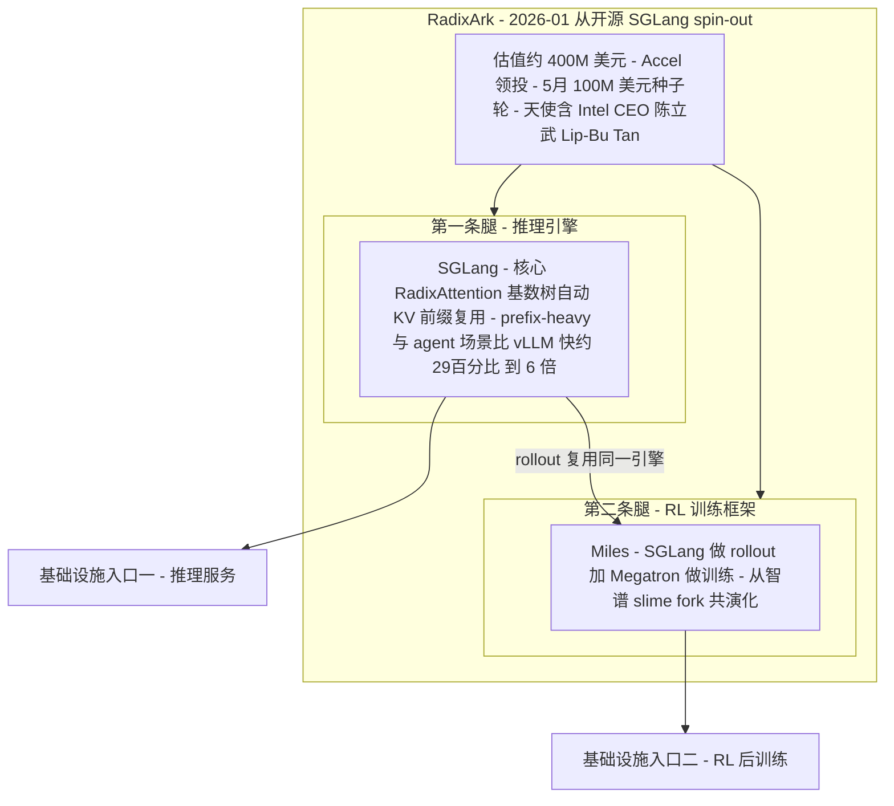
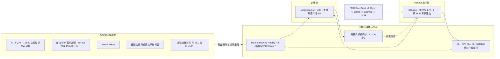
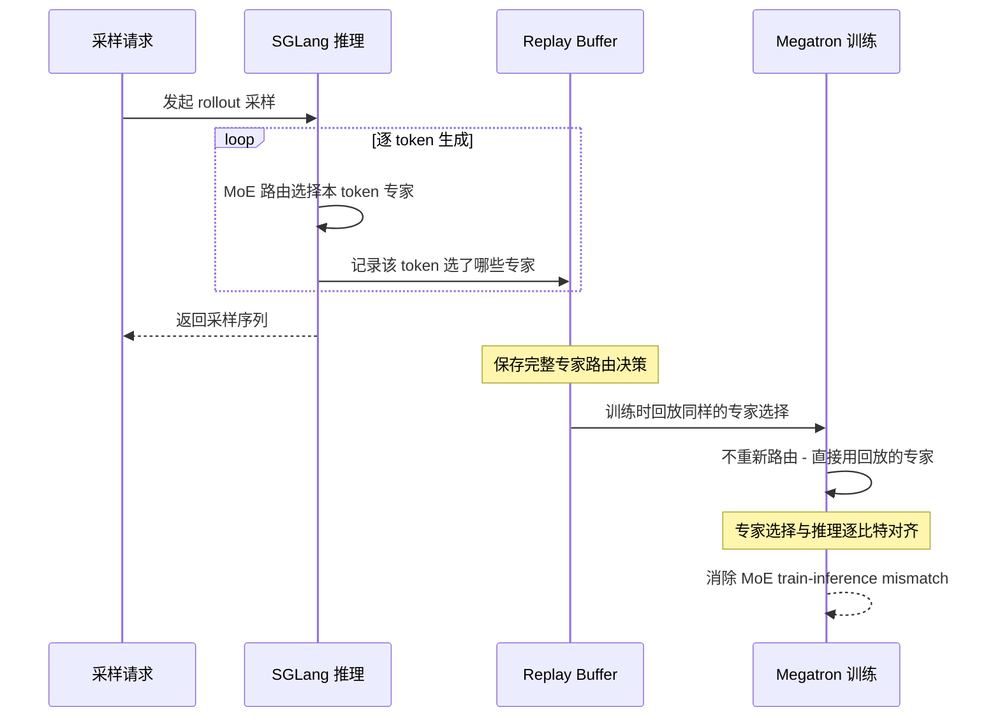
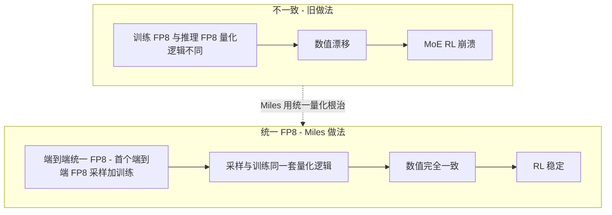
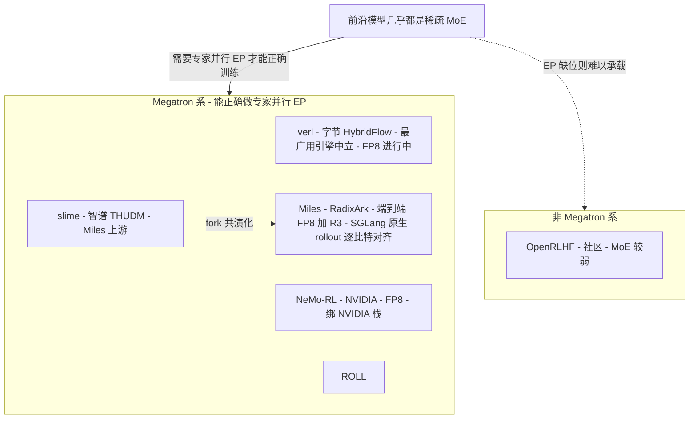

# Dispatch 09 · RadixArk / Miles:SGLang 团队的 RL 框架,与投资视角

*2026-06-25 · NPU Frontier Dispatch · infra / SGLang / Miles / investment*

> **TL;DR** — RadixArk 是 **SGLang 核心团队**的商业化公司:2026 年 1 月从开源项目 SGLang spin-out,**~$400M 估值**(Accel 领投),5 月宣布 **$100M 种子轮**,天使含 **Intel CEO 陈立武(Lip-Bu Tan)**。两条产品线:推理引擎 **SGLang**(核心是 **RadixAttention** —— 基数树自动 KV 前缀复用,prefix-heavy/agent 场景比 vLLM 快约 29%~6×)+ RL 训练框架 **Miles**(从智谱 **slime** fork、共演化)。Miles 的杀手锏是 **统一 FP8 流水线**(首个端到端 FP8 采样+训练)和 **Rollout Routing Replay(R3)**——把 MoE 专家路由在 SGLang 推理时记录、Megatron 训练时回放,做到**逐比特对齐**,根治 MoE RL 的 train-inference mismatch。技术壁垒在**人才 + SGLang 分发量 + R3/FP8 的硬工程 + 开源飞轮**;主要风险是开源基础设施的变现未验证、vLLM(Inferact,$800M)生态更大。对本看板:**R3 正是"train-inference 一致性"在 GPU 上的标准答案**,而它能否移植到昇腾(SGLang-Ascend + MindSpeed),是 RL-on-NPU 的一道关键缺口。

> ⚠️ 以下为公开资料的研究综述,估值/融资为媒体报道口径(provisional),**非投资建议**。

应要求研究一下这家公司。它正好踩在本看板的核心主线(RL 后训练 + 训推一致 + FP8)上,所以单开一期。

---

## 1 · 公司:把 SGLang 变成生意

- **出身**:SGLang 源自 LMSYS / 伯克利系开源,是"日均处理万亿 token"的推理引擎。2026-01 项目 spin-out 成 **RadixArk**,~**$400M 估值**(TechCrunch)。
- **融资**:2026-05 宣布 **$100M 种子轮**,**Accel 领投**,天使含 **Intel CEO Lip-Bu Tan**。
- **使命**:"Democratize Frontier AI Infrastructure" / "Ship AI for All" —— 做**开放的前沿 AI 基础设施**。
- **时机**:HuggingFace 的 TGI 在 2025-12 进入维护模式,SGLang 顺势成为主要开源替代;推理市场被各方称为"battleground"。
- **两条腿**:**推理 = SGLang**,**RL 训练 = Miles**。一家公司同时卡住"推理"和"RL 后训练"两个基础设施入口。

## 2 · 技术优势

### SGLang(推理护城河)
- **RadixAttention**:用**基数树(radix tree)**维护 KV cache 的 LRU,新请求来时做**前缀匹配**,命中就复用已算的 KV,不重算。对 **prefix-heavy / RAG / 多轮 agent** 工作负载收益巨大。
- **性能**:整体吞吐比"充分优化的 vLLM"高约 **29%**(16.2k vs 12.5k tok/s);在唯一 prompt 批任务上差距趋零,在 prefix-heavy RAG 上可放大到 **6×**。
- 定位:vLLM 赢在生态广度/社区/易用;SGLang 赢在**前缀缓存、结构化输出、agent 工作流**。

### Miles(RL 训练框架)—— 本看板更关心的部分
栈 = **SGLang(rollout)+ Megatron-LM(训练)**,从 **slime**(智谱那套、跑过 GLM-4.6 与大 MoE)fork 而来。核心创新:

- **统一 FP8 流水线**:**首个端到端 FP8 采样 + 训练**。让训练和推理用**完全相同的 FP8 量化逻辑**,消除 MoE RL 里量化不一致导致的"RL 崩溃"。
- **Rollout Routing Replay(R3)**:**在 SGLang 推理时记录 MoE 的专家路由决策,在 Megatron 训练时回放** → 专家选择**逐比特对齐** → 根治 MoE 的 train-inference mismatch。这是 Miles 最硬的一招。
- **INT4 QAT**:量化感知训练,让 **1TB+ 模型**单机可部署。
- **在线 draft 模型投机解码**:rollout 提速 **25%+**。
- **零拷贝权重同步**(CUDA IPC)、**partial rollout**(多轮)、**截断+掩码重要性采样**(治 off-policy 偏差)、**多智能体协同训练**、**VLM+LLM 统一**。
- 支持 DeepSeek(R1/V3/V3.2)、Qwen、Llama、Gemma、GLM。

整套 Miles 技术栈(rollout 侧 / 训推桥接核心 / 训练侧 / 外围加速)如下:

### 为什么 MoE 的 train-inference mismatch 比 dense 更致命

RL(GRPO/PPO)的正确性依赖一个隐含假设:训练引擎对某条 rollout 重算出的策略分布,要和当初采样这条 rollout 时用的策略分布"足够接近"。重要性采样比 `r = π_new(a|s) / π_old(a|s)` 是整个梯度的核心权重——`π_old` 由 rollout 引擎(SGLang)在采样时给出,`π_new` 由训练引擎(Megatron)在前向时重算。只要这两个引擎对"同一 token 在同一上下文下"的 logprob 算得不一致,`r` 就会系统性失真,梯度方向被污染,轻则不收敛,重则 reward 崩盘(reward 看着涨但策略实际在退化)。

对 **dense 模型**,两个引擎的实现差异表现为**连续的小数值误差**:kernel 不同、累加顺序不同、FP 精度不同,带来的是 logits 上 O(1e-3) 量级的扰动。softmax 是平滑函数,这种扰动平滑地传到 logprob,`r` 在 1.0 附近小幅抖动,再叠加 GRPO 常规的 clip / 截断,基本能被吸收。dense 的失配是"有界、连续、可控"的。

**MoE 把一个离散、不连续的决策插进了前向路径**:router(gating)对每个 token 算 gating logits,然后 **top-k argmax** 选出激活的专家集合。这一步是阶跃的——① **router 数值的微小扰动会翻转专家选择**:当某 token 第 k 名和第 k+1 名专家分数接近时,引擎间 O(1e-3) 的 router 差异就足以让 argmax 边界翻过去,token 被路由到**不同的专家集合**,这种翻转在每层、每 token 上独立发生;② **专家翻转把"小数值误差"放大成"换了一条计算路径"**——dense 下只是同一权重上的微小误差,MoE 下专家一旦翻转,token 过的是**完全不同的 FFN 权重**,输出不是"差一点"而是"差一截",logprob 漂移从 O(1e-3) 跳到 O(0.1) 甚至更大,且结构性、不可被 clip 当噪声吸收;③ **漂移经重要性采样毁掉梯度**——`r = exp(logp_new − logp_old)`,漂移 0.3 让 `r` 偏离约 1.35×,漂移 1.0 就是 e 倍,这种和"哪些 token 翻转专家"相关的有偏信号让 GRPO 给出**方向错误**的梯度,逐层逐 token 累积成 RL 崩溃。模型越稀疏(激活占比越低、专家越多、router 边界越密),翻转越频繁,越致命——而前沿模型(DeepSeek-V3/V3.2、Qwen3-MoE、GLM)几乎全是稀疏 MoE。

### R3 到底解决了什么、代价是什么

传统对齐手段是"**训练时重算**":拿到 rollout 后训练引擎重跑前向、重算 logprob(乃至重算 gating)逼近 `π_old`。但这在 MoE 上有死穴——**训练引擎重算 gating 时,argmax 边界可能就翻了**,重算出的专家集合和采样时不是同一套。你越认真"重算",越是在用 Megatron 的 router 数值复现一个本属于 SGLang 的离散决策,而离散决策恰是不可复现的那部分。R3 换了思路:**不重算路由,而是记录-回放路由。**

采样阶段 SGLang 把每个 token 每层 MoE 的**专家路由决策(选中专家 id / top-k 集合)**随 rollout 落盘;训练阶段 Megatron 走到 MoE 层时**不再用自己的 gating argmax**,而是直接**回放 SGLang 当初选的那套专家**。这样 train 和 inference 走**逐比特相同的专家路径**,离散决策被钉死、不再翻转;剩下的连续数值误差交给统一 FP8(见下)。R3 的精髓是:**把"不可复现的离散选择"从重算变成回放,只让"可复现的连续数值"留给数值对齐处理**——这是它相对 verl/slime 真正差异化的地方。代价与边界(provisional,机理推断):**要存路由**(每 token × 每层 × top-k 专家 id,长序列+深层 MoE 下开销不可忽略);**要改训练前向**(Megatron MoE 层需支持"外部注入专家选择"旁路,侵入式、要兼容各种 EP);**回放的路由严格说不是训练当下的 on-policy 路由**(`π_new` 用的是 `π_old` 的专家集合——对重要性采样这正是想要的,但要意识到回放的是采样时刻的决策);**与 partial rollout / staleness 正交**:R3 钉住路由一致,但不替代治 off-policy 偏差的截断+掩码重要性采样,两者要叠加。

### 统一 FP8 为什么是一致性的另一半

R3 把**离散路由**钉成逐比特一致,但前向里还有**连续数值通路**——专家 FFN 的矩阵乘、attention、归一化。如果训练和推理在这条通路上用的 FP8 量化逻辑不同,即使专家选对了,logprob 照样会漂。

量化不一致独立于路由就能毁掉一致性:推理侧(SGLang)为吞吐用一套 FP8(scale 选取、per-tensor/per-channel/per-block 粒度、累加与反量化顺序、kernel),训练侧(Megatron)若用另一套 FP8 甚至 BF16,同一组权重和激活在两边算出的 logits 就有系统性偏差,经 softmax 进 logprob、进 `r`——和路由失配是**同一病根的两条并行通道**;而且 FP8 量化误差和 scale、激活分布相关,是**有偏**的,无法靠采样平均掉,长训练里累积成崩溃。所以一致性要**两半都补齐才闭环**:**R3 管路由一致**(离散维度对齐)+ **统一 FP8 管数值一致**(连续维度对齐)。只上 R3:专家选对了但选中专家的 FFN 两边量化不同,logprob 仍漂;只上统一 FP8:数值通路对齐了但 router 还翻专家,token 走错 FFN,前面对齐白费。两者是失配的两个**正交维度**,必须一起上,才能把 `π_new` 真正逼回 `π_old`。Miles 是首个端到端 FP8 采样+训练的框架,这是它相对 verl/slime 的另一处真差异化;NeMo-RL 也有 FP8 但绑 NVIDIA。

## 3 · 同行对比

**推理引擎**

| | **SGLang** | vLLM | TGI |
|---|---|---|---|
| 杀手锏 | RadixAttention 前缀复用 | 生态广、PagedAttention | 已进维护模式(2025-12) |
| 强项场景 | prefix-heavy / RAG / agent | 通用、社区最大 | — |
| 商业体 | **RadixArk ~$400M** | Inferact ~$800M | (HF) |

**RL 后训练框架**

| 框架 | 出身 | MoE/EP | FP8 | 差异点 |
|---|---|---|---|---|
| **Miles** | RadixArk(SGLang) | ✅ Megatron | ✅ 端到端 + **R3** | SGLang 原生 rollout、R3 逐比特对齐 |
| slime | 智谱 THUDM | ✅ | 部分 | Miles 的上游 |
| verl | 字节(HybridFlow) | ✅ | 进行中 | 最广用、引擎中立 |
| NeMo-RL | NVIDIA | ✅ | ✅(NeMo 生态) | 绑 NVIDIA 栈 |
| OpenRLHF | 社区 | 较弱 | — | 易用、起步早 |

> 关键判断:**只有 Megatron 系(verl/slime/Miles/ROLL/NeMo-RL)能正确做专家并行(EP)**——而前沿模型几乎都是稀疏 MoE(DeepSeek-V3/Qwen3-MoE/…),这让 Miles 的 MoE 专长正中靶心。**R3 + 统一 FP8 是 Miles 相对 verl/slime 的真差异化**;NeMo-RL 也有 FP8,但绑死 NVIDIA。

## 4 · 技术壁垒与风险

**壁垒**
1. **人才**:做出 RadixAttention 的 SGLang 核心团队,系统工程深度难复制。
2. **分发量 = 护城河**:SGLang 日均万亿 token、是众多 RL 栈的 rollout 引擎;Miles **SGLang 原生**的紧耦合是别家给不了的。
3. **R3 / 统一 FP8 的硬工程**:让 MoE 训推**逐比特一致**是真难的活,先发优势明显。
4. **开源飞轮**:开放 SGLang+Miles → 采用 → 企业版变现(Databricks / vLLM-Inferact 同款打法)。

**风险**
- **开源基础设施变现未验证**:能不能从"免费引擎"转成"赚钱企业产品"是关键问号。
- **vLLM 生态更大、融资更多**(Inferact $800M):社区与广度上 SGLang 仍追赶。
- **巨头夹击**:NVIDIA(NeMo-RL + 硬件捆绑)、各云厂自带推理服务、价格战导致推理商品化。
- **栈依赖**:深度绑 Megatron / NVIDIA;**对国产 NPU(昇腾)的支持是另一条战线**。
- 团队/项目的开源中国渊源(slime/THUDM 共演化),在部分企业/政府采购上可能成为考量。

## 5 · 投资视角(非建议)

- **看多**:推理是当下最炸的市场;SGLang 是开源前二的引擎;顶级团队 + Accel + Intel CEO 背书;**$400M 估值相对 vLLM-Inferact 的 $800M 显得不贵**;同时握住推理 + RL 训练两个入口;MoE 后训练是前沿方向而 Miles 在此最强。
- **看空**:基础设施开源变现难、毛利与议价权存疑;vLLM 生态/资金更厚;推理趋于商品化;高度依赖 NVIDIA 栈。
- **可比公司**:vLLM→Inferact($800M)、Together / Fireworks / Baseten(推理云)、Databricks(开源→企业的范式)。
- **观察指标**:企业版/托管收入起量、SGLang 相对 vLLM 的采用份额、Miles 被头部实验室用于真实 MoE 后训练的案例、对非 NVIDIA 硬件(昇腾/AMD)的支持进展。

## 6 · 对 RL-on-NPU 的意义

这家公司和本看板的主线高度重合,有两个直接启发:

- **R3 就是"训推一致"在 GPU 上的标准答案**。本看板反复提的 align-probe,想量化的正是 train-inference 的数值/路由漂移;Miles 的 R3 直接用"记录-回放路由"做到逐比特对齐——**这是昇腾上做 MoE RL 时最该借鉴的机制**(在 NPU 上重写 MoE 路由极易漂移)。
- **统一 FP8** 与 Dispatch 02/03 的 FP8 RL、昇腾 950 原生 FP8 完全同向。问题是:**SGLang 的 Ascend 后端 + MindSpeed,能否复刻 Miles 的 R3 / 端到端 FP8?** 这是 RL-on-NPU 一道明确、可做的工程缺口——谁先在昇腾上跑通"路由回放 + FP8 一致"的 MoE RL,谁就补上了最硬的一块。

下表是机理层面的现状/待验证梳理(provisional,非实测、非投资建议):

| 能力 | GPU(Miles 现状) | 昇腾(待验证) |
|---|---|---|
| SGLang rollout | 成熟,CUDA 后端为主路径 | 需走 SGLang 的 Ascend 后端;算子覆盖、性能、采样数值稳定性待验证 |
| Megatron 训练 | 成熟,Megatron-LM 原生 | 需对应 MindSpeed(Ascend 版 Megatron);MoE/EP 实现是否对齐待验证 |
| R3 路由回放 | 已实现,SGLang 记录、Megatron 回放 | 关键缺口:需在 Ascend SGLang 记录路由、MindSpeed 前向注入回放;两端 MoE 路由都得重写,极易引入漂移 |
| 端到端 FP8 | 已实现,训练/推理共用同一 FP8 逻辑 | 关键缺口:NPU FP8 数据通路/量化原语与 GPU 不同,要让两端 FP8 逐数值一致,工作量与可行性待验证 |
| 零拷贝权重同步 | CUDA IPC 实现 | 需 Ascend 等价的设备间共享内存/IPC;能否零拷贝待验证 |
| EP 专家并行 | Megatron 系原生支持 | MindSpeed 需提供等价 EP;通信原语/分片与 Megatron 对齐情况待验证 |

为什么"在 NPU 上重写 MoE 路由极易漂移":R3 的全部价值建立在**两端路由逐比特一致**之上。换到昇腾,SGLang(Ascend 后端)和 MindSpeed 各自的 router 都是**重新实现的**——gating 矩阵乘 kernel、softmax/归一化数值、top-k argmax 的 tie-breaking、FP 累加顺序,任一处与原 GPU 实现有别,就会在 gating 分数接近的 token 上**翻转专家**;而且要让回放真正等价,记录端选出的专家 id 必须能被回放端无歧义地复现同一套激活计算——两端只要 MoE 数值语义不统一,回放注入进去也只是"用对的专家 id 走了数值不同的 FFN",路由对齐了、数值又漂回来。这恰好对应 align-probe 想量化的 train-inference 漂移:**NPU 上重写路由,等于把这条漂移风险重新打开一遍**。结论:单点(只 FP8、或只 EP)都有人做,但"**路由回放 + FP8 一致**"两半同时闭环目前是空白——谁先在昇腾把这两件正交的事同时跑通,谁就补上了 MoE RL 在国产算力上最硬的一块,这也是 align-probe 最该优先验证的方向。

---

*来源:RadixArk 官网/博客、TechCrunch / BusinessWire / theaiinsider(spinout、$400M、$100M 种子、Accel、Lip-Bu Tan)、LMSYS Miles 博客(2025-11-19)、github.com/radixark/miles 与 miles.radixark.com/docs、SGLang vs vLLM 对比(turion/particula/yottalabs 等)、HuggingFace async-RL 库综述。估值/融资为媒体报道口径,provisional;本篇为研究综述,非投资建议。*
