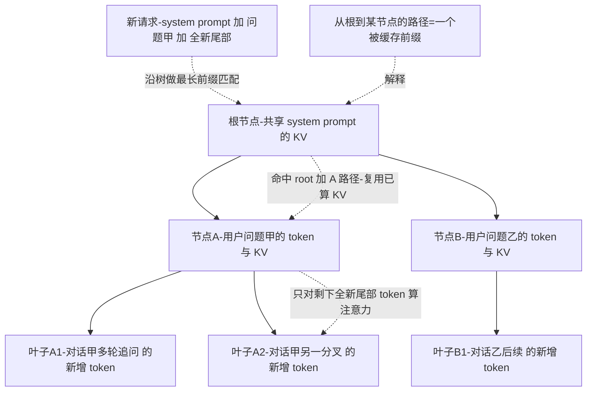
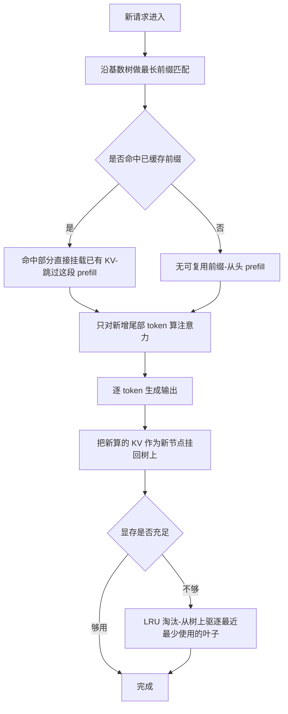
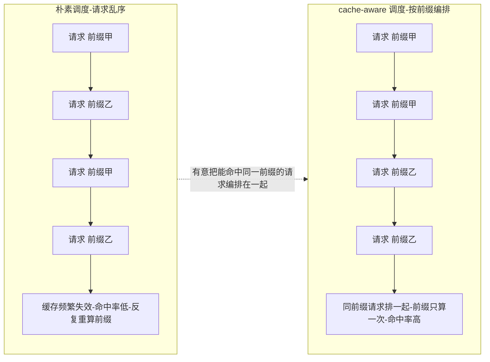
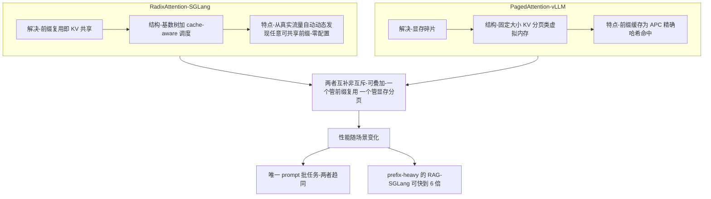
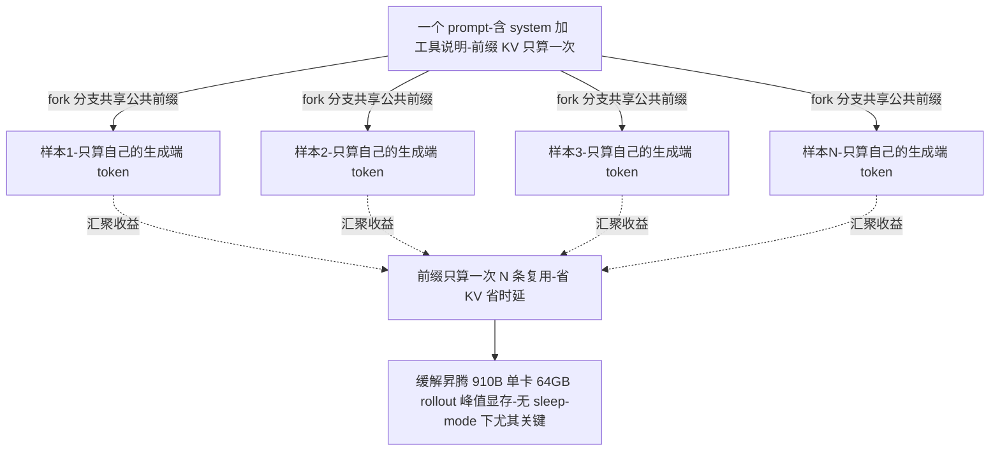

# Dispatch 10 · RadixAttention 详解:SGLang 怎么靠"前缀树"赢 KV 复用

*2026-06-25 · NPU Frontier Dispatch · inference / SGLang / KV-cache / RL-on-NPU*

> **TL;DR** — RadixAttention 是 SGLang 的核心(arXiv 2312.07104):把 KV cache 组织成一棵 **基数树(radix tree)**,对每个新请求做**前缀匹配**,命中就**复用已算的 KV**,不重算。它**自动、动态**地从真实流量里发现可共享的前缀(零配置),用 **LRU** 淘汰、用 **cache-aware scheduling** 调度请求以最大化命中,并能优雅处理**对话分叉(fork)**。对比 vLLM 的 PagedAttention(解决显存碎片 + 精确前缀哈希复用),RadixAttention 在**多轮、agent、RAG、共享 system prompt、树搜索**这些"前缀重度"场景上优势最大——prefix-heavy 下可比 vLLM 快约 **29%~6×**。对 RL:**GRPO 一个 prompt 采 N 条样本,它们共享同一前缀** → RadixAttention 直接复用,这是 rollout 引擎最实在的省法;移植到昇腾的 SGLang-Ascend 后,同样能缓解 910B 的 rollout 显存。

承接 Dispatch 09(RadixArk/Miles)。应要求把 SGLang 的看家本领 **RadixAttention** 拆开讲。

---

## 1 · 问题:前缀被反复重算

LLM 推理里,**很多请求共享前缀**:同一套 system prompt、同一段 few-shot、多轮对话的历史、RAG 里相同的文档、agent 群里相同的工具说明。朴素做法每来一个请求都从头算一遍这些前缀的 KV——**纯浪费**。

省法就是**前缀缓存(prefix caching)**:把算过的 KV 留着,前缀相同就复用。难点在于——**怎么高效地"发现 + 匹配 + 淘汰"任意的共享前缀**。

## 2 · RadixAttention 怎么做

核心是一棵 **基数树(radix tree,压缩前缀字典树)**:

- **节点 = 一段 token 序列 → 它的 KV**。从根到某节点的路径,就是一个被缓存的前缀。
- **新请求来 → 沿树做最长前缀匹配**:匹配到的部分**直接复用 KV**,只对剩下的新 token 算注意力。
- **自动 / 动态发现**:不需要你预先声明"哪些前缀会复用",树会**自然捕捉真实流量里实际存在的共享**,零配置。
- **LRU 淘汰**:显存不够时,按最近最少使用从树上驱逐叶子。
- **Cache-aware scheduling**:调度器**有意把"能命中缓存"的请求排在一起**,把命中率最大化(这是和单纯加个缓存的关键区别)。
- **优雅处理 fork**:对话/推理分叉时,多个分支**共享公共前缀**,各自只算分叉后的部分——对 **best-of-N、树搜索、agent 探索**极友好。

一句话:**它把"前缀复用"从'精确字符串命中'升级成'一棵会自我组织的树 + 会配合的调度器'。**

每个新请求的处理流程(匹配 → 复用 → 只算尾部 → 挂回树 → 必要时 LRU 淘汰):

### 一个具体例子:多轮对话怎么省

设想一个带工具调用的 agent 多轮会话:system prompt 固定,每轮在已有上下文后追加用户输入、工具返回、模型回复。关键事实是——**每一轮请求都把"之前全部对话"当作前缀重新发给引擎**,这正是 prefill 的重灾区。逐轮看 radix tree 怎么长、命中怎么发生(token 数为示意值,非实测):

| 轮次 | 本轮请求的完整前缀 | 新增 token | 命中前缀长度 | 需要 prefill 的 token |
|------|------|------|------|------|
| 第 1 轮 | system(400) + Q1(50) | 450 | 0(冷启动) | 450 |
| 第 2 轮 | …上文 + A1(120) + Q2(40) | 160 | 450 | 160 |
| 第 3 轮 | …上文 + A2(200, 含工具调用) + tool_result(300) + Q3(30) | 530 | 610 | 530 |
| 第 4 轮 | …上文 + A3(150) + Q4(60) | 210 | 1140 | 210 |

每轮请求到达时,SGLang 拿请求的 token 序列沿 radix tree 做**最长前缀匹配**:第 1 轮树是冷的,system+Q1 算完挂到树上;第 2 轮前 450 token 与上一轮逐 token 相同 → 一路匹配到那个节点,**这 450 token 的 KV 直接复用、prefill 完全跳过**,只对新增 160 token 算注意力;第 3、4 轮在命中节点处继续延长树。直觉上的节省:第 4 轮若不复用要 prefill 整整 1350 token,复用后只算 210,**省掉约 84% 的 prefill 算力**。会话越长,尾部新增占比越小,省得越多——这就是"长多轮 / 长 agent 循环"是 RadixAttention 甜区的原因。整个过程**零配置**:没人去声明"system prompt 要缓存",共享前缀是引擎沿树自动发现的。

### radix tree、LRU 与 cache-aware 调度的工程细节

**为什么是树,而不是哈希表。** vLLM 的 APC 用 block 级精确哈希:把前缀切成定长 block,对每个 block 前缀算哈希,命中就复用。这对"线性单链前缀"够用,但对**分叉**笨拙。RadixAttention 选基数树的核心理由有二:① **最长前缀匹配是树的原生操作**——新请求沿树往下走到走不动为止,天然得到"最长可复用前缀",不需预设 block 边界,匹配粒度精确到 token;② **分叉(fork)是一等公民**——一个 prompt 派生 N 条续写(beam search、并行采样、agent 多分支),共享公共前缀、在某点分叉,树里就是一个节点长出多个子节点,公共前缀 KV 物理上只存一份,各分支各挂自己的尾巴。哈希表表达"共享 + 分叉"很别扭,树则直接就是这个形状。

**为什么 LRU 从叶子驱逐。** 树的结构本身编码了"共享度":越靠近根的节点被越多请求路径经过(system prompt 在根附近,几乎每个请求都命中),越靠近叶子越是某条具体会话的私有尾巴。**从叶子驱逐 = 优先丢掉共享度最低、最不可能再被命中的 KV**,把根附近的高价值共享前缀尽量留住;而且只有叶子能被安全删除——删中间节点会切断其子树的路径完整性。**cache-aware 调度:把命中从"偶发"变成"被制造"。** 请求到达顺序随机,共享同一前缀的请求若被无关请求隔开,中间该前缀可能已被 LRU 驱逐,再来又得重算。cache-aware 调度主动**把前缀相近的请求排到一起**(按与当前 radix tree 的匹配长度分组),让它们连续命中、摊薄那份共享 KV 的生命周期——这是 RAG / 批量同 system prompt 场景收益的关键来源。

**代价与边界**(工程上必须诚实):① **命中依赖前缀"真共享"**——是逐 token 比对不是语义相似,system prompt 改一个字、或在前缀靠前位置注入 per-request 的时间戳/用户 ID,后面全部 miss,把易变内容尽量后置是一种工程纪律;② **cache 抖动**——显存吃紧 + 请求前缀高度分散时,新前缀不断挤掉旧前缀,命中率塌缩,反而多付维护树和驱逐的开销;③ **公平性 vs 命中率的取舍**——cache-aware 调度为凑命中会打乱到达顺序,可能让"前缀孤立"的请求排队变长、尾延迟变差,这是个需按 SLA 调的旋钮,不是免费午餐。

## 3 · vs PagedAttention(其实互补)

| | **RadixAttention(SGLang)** | **PagedAttention(vLLM)** |
|---|---|---|
| 解决的核心 | **前缀复用**(KV 共享) | **显存碎片**(分页管理 KV) |
| 结构 | 基数树 + cache-aware 调度 | 固定大小 KV 分页(类虚拟内存) |
| 前缀缓存 | 自动/动态发现任意前缀 | APC:精确前缀哈希命中 |
| 强项场景 | 多轮 / agent / RAG / 共享 prompt / fork | 通用、可预测、可配置负载 |

注意:**两者不是非此即彼**——SGLang 也做分页式显存管理,vLLM 也有自动前缀缓存(APC)。真正的差异在 **radix tree 的结构 + cache-aware 调度**,让它在"复杂、不可预测的前缀复用"上更强。所以基准上:唯一 prompt 批任务两者趋同;**prefix-heavy RAG 上 SGLang 可快到 6×**。

## 4 · 为什么对 RL / agent 特别重要

这是本看板最关心的角度:

- **GRPO/RLVR 的 rollout 天生前缀重度**。一个 prompt 要采 **N 条**样本(group),它们**共享完全相同的 prompt 前缀**。RadixAttention 把这段前缀**只算一次、N 条复用** → rollout 的显存和时延直接降。
- **树搜索 / best-of-N / 多轮 agent**:fork 共享前缀,探索不同分支不重算——正是 agentic RL(Dispatch 08)长 rollout 的省钱点。
- **agent 群共享 system/工具说明**:几十个 agent 同一套 system prompt → 零成本共享。

这也是为什么 **SGLang 成了很多 RL 栈的首选 rollout 引擎**(AReaL、Miles 等),以及 RadixArk 能同时做推理 + RL 两端(Dispatch 09)。

### 效果 / 收益对比(provisional)

下表数字均为 **provisional(第三方 / 媒体口径,非本文实测)**,用于说明量级与趋势,不应当作通用加速比承诺:

| 场景 | 前缀复用收益(provisional) | 说明 |
|------|------|------|
| 唯一 prompt 批处理 | ≈ 无 / 趋同 | 各请求前缀互不相同,没有可复用前缀,SGLang 与 vLLM 表现趋同 |
| 共享 system prompt | 明显 | 大量请求共用同一段长 system prompt,根附近前缀被几乎所有请求命中,prefill 大幅省 |
| 多轮对话 / agent 循环 | 明显且随轮数放大 | 第 N 轮命中前 N-1 轮全部前缀,尾部新增占比越来越小 |
| RAG 长文档前缀 | 最高可达约 6× | 同一长文档/上下文作前缀被多 query 复用,前缀长、共享度高,是甜区 |
| GRPO group rollout(N 条共享前缀) | 接近 prompt 部分省 (N-1)/N | 一个 prompt 采 N 条样本共享 prompt 前缀,prompt 的 KV 只算一次、N 条复用 |

整体在 prefix-heavy 工作负载上,媒体口径约 **29%** 的端到端提升,RAG 这类前缀重场景峰值可达 **6×**。**收益为什么随"前缀共享度 × N × 前缀长度"放大**:省下来的本质是"本该重复计算/存储的前缀 KV"——前缀越长,每次命中跳过的 prefill 越多(prefill 开销随上下文线性增长);共享度 / N 越大,同一份前缀被复用次数越多,那次"算一遍"的成本被摊到越多请求上(GRPO 里 N 条样本共享 prompt,prompt 部分理想省约 (N-1)/N)。二者相乘:长前缀 + 高共享 = 收益爆发(RAG、group rollout);短前缀 / 无共享 = 收益趋零(唯一 prompt 批)。**为什么不能当通用加速比**:这些数字强依赖工作负载结构,不是模型/硬件的固定属性,前缀不共享时收益归零,掺了 per-request 易变内容会击穿命中,显存抖动时还可能倒亏——引用时务必连同场景一起标注、并注明为第三方口径、非实测。

## 5 · 对 RL-on-NPU 的意义

- **rollout 引擎的前缀复用 = 直接缓解昇腾显存争用**。910B 单卡 64GB、无 sleep-mode,rollout 的 KV 是大头;GRPO 组内共享前缀复用,能实打实降低 rollout 峰值显存(见 NPU 架构页"RL 显存争用"视图)。
- **SGLang 有 Ascend 后端**(本看板 Ascend 标签已收录 docs.sglang.ai)——所以 RadixAttention 的收益**原则上可带到 NPU**;但 radix tree 的 KV 管理 + cache-aware 调度在 Ascend 上的成熟度、与 MindSpeed-RL 的整合度,是要验证的点。
- 叠加 **量化 rollout(FP8)+ 稀疏注意力**(Dispatch 02/04),前缀复用是"省 KV"的第三条正交杠杆。

**三条正交的省 KV 杠杆。** 在昇腾 910B 这种单卡 64GB、无 sleep-mode、rollout KV 是显存大头的场景,省 KV 不是单点优化,而是三条互不冲突的杠杆叠乘。"正交"指它们压缩的是 KV 成本的**不同维度**,可以同时开:

| 杠杆 | 压缩的维度 | 省的是哪一部分 |
|------|------|------|
| 前缀复用(RadixAttention) | **份数** | 共享前缀的 KV 只算一次、存一份,多请求复用 → 减少重复的 KV 条目数与 prefill 算力 |
| FP8 量化 rollout | **每个 KV 元素的位宽** | 同样多的 KV,每个数从 bf16 压到 fp8 → 单条 KV 的字节数减半 |
| 稀疏注意力 | **每条序列的有效 KV 长度** | 只对部分(近邻/选中)token 保留/参与注意力 → 减少每序列需持有的 KV token 数 |

为什么可叠加:前缀复用作用在**请求之间**(去重),量化作用在**单个 KV 元素的表示精度**,稀疏作用在**单序列内部的 token 维度**——一份被多请求复用的 KV,同样可以是 FP8 存的、也同样可以是稀疏保留的,三者改写的不是同一个量,数学上不打架。收益相乘而非相加:复用把"5 份变 1 份",量化再把那 1 份"砍半字节",稀疏再把那份序列"留一半 token",峰值显存是三者的连乘下压。**但需要验证的边界**:SGLang 有 Ascend 后端,前缀复用收益**原则上**可带到 NPU,但 radix tree 的 KV 管理 + cache-aware 调度在 Ascend 上的成熟度、以及与 MindSpeed-RL 训练栈的整合度,需实测确认,不能照搬 GPU 数字。

## 6 · 下一步看什么

1. **SGLang-Ascend 上 RadixAttention 的真实命中率/吞吐**,对照 vLLM-Ascend。
2. **RL rollout 里 group 共享前缀的实测收益**(N 越大省得越多)。
3. **RadixAttention × 稀疏注意力**:前缀复用与块稀疏/滑窗能否叠加生效。

---

*来源:SGLang 论文(arXiv 2312.07104)、SGLang 仓库与文档、RadixAttention vs PagedAttention 解析(rajatpandit / inference.net / particula 等)。性能数字为第三方/媒体口径,provisional。相关卡片见本看板 Ascend / NPU 与 RL for LLMs 标签页。*
