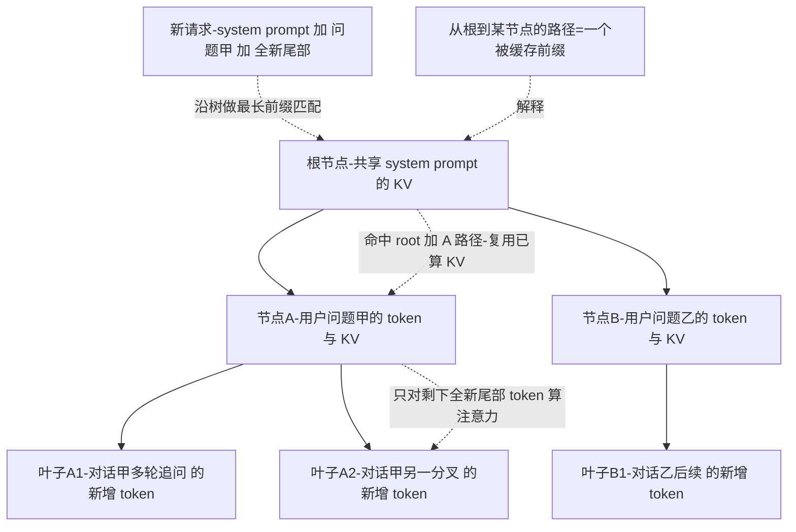
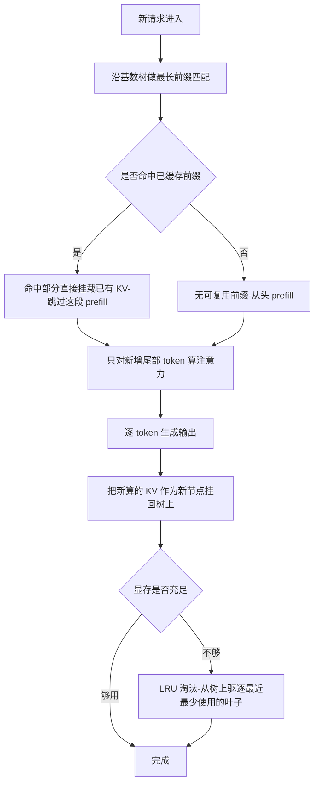
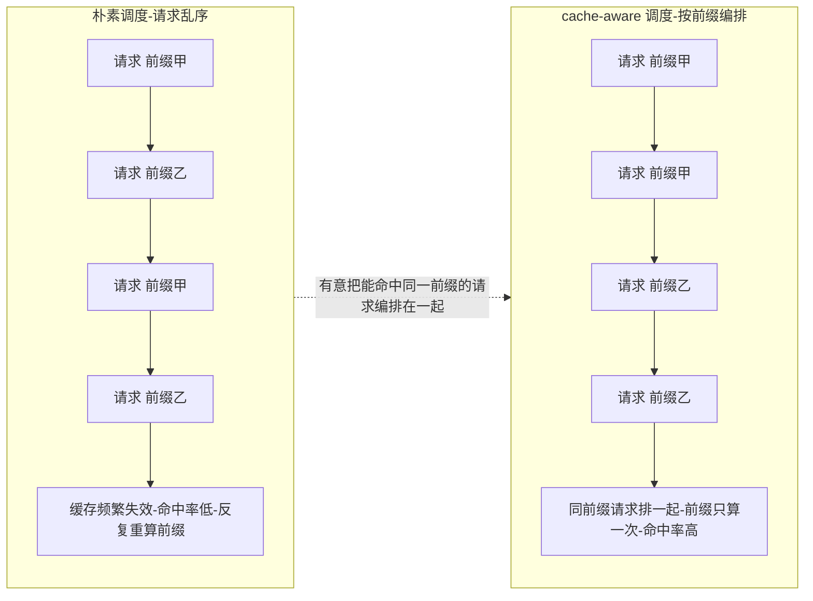
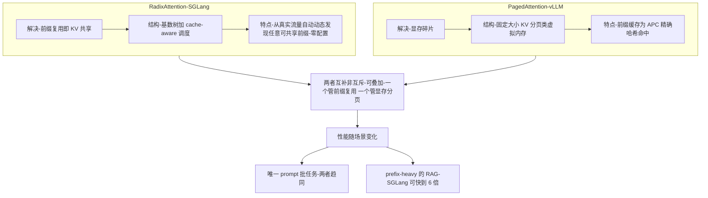
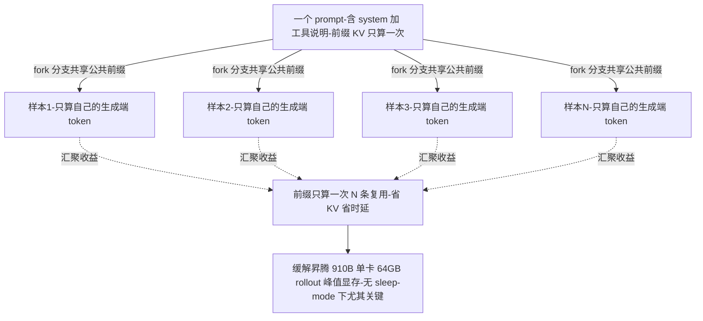

# Dispatch 10 · RadixAttention 详解:SGLang 怎么靠"前缀树"赢 KV 复用

*2026-06-25 · NPU Frontier Dispatch · inference / SGLang / KV-cache / RL-on-NPU*

> **TL;DR** — RadixAttention 是 SGLang 的核心(arXiv 2312.07104):把 KV cache 组织成一棵 **基数树(radix tree)**,对每个新请求做**前缀匹配**,命中就**复用已算的 KV**,不重算。它**自动、动态**地从真实流量里发现可共享的前缀(零配置),用 **LRU** 淘汰、用 **cache-aware scheduling** 调度请求以最大化命中,并能优雅处理**对话分叉(fork)**。对比 vLLM 的 PagedAttention(解决显存碎片 + 精确前缀哈希复用),RadixAttention 在**多轮、agent、RAG、共享 system prompt、树搜索**这些"前缀重度"场景上优势最大——prefix-heavy 下可比 vLLM 快约 **29%~6×**。对 RL:**GRPO 一个 prompt 采 N 条样本,它们共享同一前缀** → RadixAttention 直接复用,这是 rollout 引擎最直接的节省方式;移植到昇腾的 SGLang-Ascend 后,同样能缓解 910B 的 rollout 显存。

承接 Dispatch 09(RadixArk/Miles)。应要求对 SGLang 的核心技术 **RadixAttention** 进行详解。

---

## 1 · 问题:前缀被反复重算

LLM 推理里,**很多请求共享前缀**:同一套 system prompt、同一段 few-shot、多轮对话的历史、RAG 里相同的文档、agent 群里相同的工具说明。朴素做法对每个新请求都从头计算一遍这些前缀的 KV——**属于纯粹的重复开销**。

节省方式就是**前缀缓存(prefix caching)**:保留已计算的 KV,前缀相同就复用。难点在于**如何高效地"发现 + 匹配 + 淘汰"任意的共享前缀**。

## 2 · RadixAttention 的做法

核心是一棵 **基数树(radix tree,压缩前缀字典树)**:

- **节点 = 一段 token 序列 → 它的 KV**。从根到某节点的路径,就是一个被缓存的前缀。
- **新请求来 → 沿树做最长前缀匹配**:匹配到的部分**直接复用 KV**,只对剩下的新 token 算注意力。
- **自动 / 动态发现**:不需要预先声明"哪些前缀会复用",树会**自然捕捉真实流量里实际存在的共享**,零配置。
- **LRU 淘汰**:显存不够时,按最近最少使用从树上驱逐叶子。
- **Cache-aware scheduling**:调度器**有意把"能命中缓存"的请求排在一起**,把命中率最大化(这是与仅添加一层缓存的关键区别)。
- **优雅处理 fork**:对话/推理分叉时,多个分支**共享公共前缀**,各自只算分叉后的部分——非常适合 **best-of-N、树搜索、agent 探索**。

概括而言:**它把"前缀复用"从'精确字符串命中'升级为'一棵自组织的树 + 协同配合的调度器'。**

```mermaid
graph TD
    ROOT["根节点-共享 system prompt 的 KV"]
    A["节点A-用户问题甲的 token 与 KV"]
    B["节点B-用户问题乙的 token 与 KV"]
    A1["叶子A1-对话甲多轮追问 的新增 token"]
    A2["叶子A2-对话甲另一分叉 的新增 token"]
    B1["叶子B1-对话乙后续 的新增 token"]
    NEW["新请求-system prompt 加 问题甲 加 全新尾部"]

    ROOT --> A
    ROOT --> B
    A --> A1
    A --> A2
    B --> B1

    NEW -. "沿树做最长前缀匹配" .-> ROOT
    ROOT -. "命中 root 加 A 路径-复用已算 KV" .-> A
    A -. "只对剩下全新尾部 token 算注意力" .-> A2

    PATH["从根到某节点的路径=一个被缓存前缀"]
    PATH -. "解释" .-> ROOT
```

每个新请求的处理流程(匹配 → 复用 → 只算尾部 → 挂回树 → 必要时 LRU 淘汰):

```mermaid
flowchart TD
    REQ["新请求进入"]
    MATCH["沿基数树做最长前缀匹配"]
    HIT{"是否命中已缓存前缀"}
    MOUNT["命中部分直接挂载已有 KV-跳过这段 prefill"]
    NOPREFIX["无可复用前缀-从头 prefill"]
    TAIL["只对新增尾部 token 算注意力"]
    GEN["逐 token 生成输出"]
    WRITE["把新算的 KV 作为新节点挂回树上"]
    MEMCHK{"显存是否充足"}
    LRU["LRU 淘汰-从树上驱逐最近最少使用的叶子"]
    DONE["完成"]

    REQ --> MATCH --> HIT
    HIT -->|"是"| MOUNT --> TAIL
    HIT -->|"否"| NOPREFIX --> TAIL
    TAIL --> GEN --> WRITE
    WRITE --> MEMCHK
    MEMCHK -->|"够用"| DONE
    MEMCHK -->|"不够"| LRU --> DONE
```

### 具体示例:多轮对话的节省方式

设想一个带工具调用的 agent 多轮会话:system prompt 固定,每轮在已有上下文后追加用户输入、工具返回、模型回复。关键事实是——**每一轮请求都把"之前全部对话"当作前缀重新发给引擎**,这正是 prefill 开销最集中的环节。逐轮观察 radix tree 的增长与命中过程(token 数为示意值,非实测):

| 轮次 | 本轮请求的完整前缀 | 新增 token | 命中前缀长度 | 需要 prefill 的 token |
|------|------|------|------|------|
| 第 1 轮 | system(400) + Q1(50) | 450 | 0(冷启动) | 450 |
| 第 2 轮 | …上文 + A1(120) + Q2(40) | 160 | 450 | 160 |
| 第 3 轮 | …上文 + A2(200, 含工具调用) + tool_result(300) + Q3(30) | 530 | 610 | 530 |
| 第 4 轮 | …上文 + A3(150) + Q4(60) | 210 | 1140 | 210 |

每轮请求到达时,SGLang 以请求的 token 序列沿 radix tree 做**最长前缀匹配**:第 1 轮树尚无缓存,system+Q1 计算完成后挂到树上;第 2 轮前 450 token 与上一轮逐 token 相同 → 一路匹配到该节点,**这 450 token 的 KV 直接复用、prefill 完全跳过**,只对新增 160 token 算注意力;第 3、4 轮在命中节点处继续延长树。节省量估算:第 4 轮若不复用需 prefill 全部 1350 token,复用后只算 210,**节省约 84% 的 prefill 算力**。会话越长,尾部新增占比越小,节省越多——这就是"长多轮 / 长 agent 循环"是 RadixAttention 优势场景的原因。整个过程**零配置**:无需声明"system prompt 要缓存",共享前缀是引擎沿树自动发现的。

### radix tree、LRU 与 cache-aware 调度的工程细节

**选择树而非哈希表的原因。** vLLM 的 APC 用 block 级精确哈希:把前缀切成定长 block,对每个 block 前缀算哈希,命中就复用。这对"线性单链前缀"够用,但难以处理**分叉**。RadixAttention 选基数树的核心理由有二:① **最长前缀匹配是树的原生操作**——新请求沿树向下匹配至无法继续为止,天然得到"最长可复用前缀",无需预设 block 边界,匹配粒度精确到 token;② **分叉(fork)获得一等支持**——一个 prompt 派生 N 条续写(beam search、并行采样、agent 多分支),共享公共前缀、在某点分叉,在树中即为一个节点派生多个子节点,公共前缀 KV 物理上只存一份,各分支各自挂载分叉后的部分。哈希表难以自然表达"共享 + 分叉",树结构则与之天然对应。

```mermaid
flowchart LR
    subgraph NAIVE ["朴素调度-请求乱序"]
        N1["请求 前缀甲"]
        N2["请求 前缀乙"]
        N3["请求 前缀甲"]
        N4["请求 前缀乙"]
        NR["缓存频繁失效-命中率低-反复重算前缀"]
        N1 --> N2 --> N3 --> N4 --> NR
    end

    subgraph AWARE ["cache-aware 调度-按前缀编排"]
        A1["请求 前缀甲"]
        A2["请求 前缀甲"]
        A3["请求 前缀乙"]
        A4["请求 前缀乙"]
        AR["同前缀请求排一起-前缀只算一次-命中率高"]
        A1 --> A2 --> A3 --> A4 --> AR
    end

    NAIVE -. "有意把能命中同一前缀的请求编排在一起" .-> AWARE
```

**LRU 从叶子驱逐的原因。** 树的结构本身编码了"共享度":越靠近根的节点被越多请求路径经过(system prompt 在根附近,几乎每个请求都命中),越靠近叶子越是某条具体会话的私有尾部。**从叶子驱逐 = 优先移除共享度最低、最不可能再被命中的 KV**,把根附近的高价值共享前缀尽量保留;而且只有叶子能被安全删除——删中间节点会切断其子树的路径完整性。**cache-aware 调度:把命中从"偶发"变为"主动构造"。** 请求到达顺序随机,共享同一前缀的请求若被无关请求隔开,期间该前缀可能已被 LRU 驱逐,后续请求需重算。cache-aware 调度主动**把前缀相近的请求编排到一起**(按与当前 radix tree 的匹配长度分组),让它们连续命中、在共享 KV 的生命周期内集中复用——这是 RAG / 批量同 system prompt 场景收益的关键来源。

**代价与边界**(工程上必须明确):① **命中依赖前缀"真共享"**——是逐 token 比对不是语义相似,system prompt 改一个字、或在前缀靠前位置注入 per-request 的时间戳/用户 ID,后面全部 miss,把易变内容尽量后置是一种工程纪律;② **cache 抖动**——显存紧张 + 请求前缀高度分散时,新前缀不断驱逐旧前缀,命中率骤降,反而增加维护树和驱逐的开销;③ **公平性 vs 命中率的取舍**——cache-aware 调度为提高命中会打乱到达顺序,可能使"前缀孤立"的请求排队变长、尾延迟变差,这是需按 SLA 调节的参数,并非没有代价。

## 3 · vs PagedAttention(实为互补)

| | **RadixAttention(SGLang)** | **PagedAttention(vLLM)** |
|---|---|---|
| 解决的核心 | **前缀复用**(KV 共享) | **显存碎片**(分页管理 KV) |
| 结构 | 基数树 + cache-aware 调度 | 固定大小 KV 分页(类虚拟内存) |
| 前缀缓存 | 自动/动态发现任意前缀 | APC:精确前缀哈希命中 |
| 强项场景 | 多轮 / agent / RAG / 共享 prompt / fork | 通用、可预测、可配置负载 |

注意:**两者不是非此即彼**——SGLang 也做分页式显存管理,vLLM 也有自动前缀缓存(APC)。真正的差异在 **radix tree 的结构 + cache-aware 调度**,让它在"复杂、不可预测的前缀复用"上更强。所以基准上:唯一 prompt 批任务两者趋同;**prefix-heavy RAG 上 SGLang 可快到 6×**。

```mermaid
flowchart TD
    subgraph RADIX ["RadixAttention-SGLang"]
        R1["解决-前缀复用即 KV 共享"]
        R2["结构-基数树加 cache-aware 调度"]
        R3["特点-从真实流量自动动态发现任意可共享前缀-零配置"]
        R1 --> R2 --> R3
    end

    subgraph PAGED ["PagedAttention-vLLM"]
        P1["解决-显存碎片"]
        P2["结构-固定大小 KV 分页类虚拟内存"]
        P3["特点-前缀缓存为 APC 精确哈希命中"]
        P1 --> P2 --> P3
    end

    COMBO["两者互补非互斥-可叠加-一个管前缀复用 一个管显存分页"]
    RADIX --> COMBO
    PAGED --> COMBO

    PERF["性能随场景变化"]
    UNIQ["唯一 prompt 批任务-两者趋同"]
    HEAVY["prefix-heavy 的 RAG-SGLang 可快到 6 倍"]
    COMBO --> PERF
    PERF --> UNIQ
    PERF --> HEAVY
```

## 4 · 对 RL / agent 特别重要的原因

这是本看板最关心的角度:

- **GRPO/RLVR 的 rollout 天生前缀重度**。一个 prompt 要采 **N 条**样本(group),它们**共享完全相同的 prompt 前缀**。RadixAttention 把这段前缀**只算一次、N 条复用** → 直接降低 rollout 的显存和时延。
- **树搜索 / best-of-N / 多轮 agent**:fork 共享前缀,探索不同分支不重算——正是 agentic RL(Dispatch 08)长 rollout 的成本节省点。
- **agent 群共享 system/工具说明**:几十个 agent 同一套 system prompt → 零成本共享。

这也是 **SGLang 成为许多 RL 栈首选 rollout 引擎**(AReaL、Miles 等)、以及 RadixArk 能同时做推理 + RL 两端(Dispatch 09)的原因。

```mermaid
graph TD
    PROMPT["一个 prompt-含 system 加 工具说明-前缀 KV 只算一次"]
    S1["样本1-只算自己的生成端 token"]
    S2["样本2-只算自己的生成端 token"]
    S3["样本3-只算自己的生成端 token"]
    SN["样本N-只算自己的生成端 token"]

    PROMPT -- "fork 分支共享公共前缀" --> S1
    PROMPT -- "fork 分支共享公共前缀" --> S2
    PROMPT -- "fork 分支共享公共前缀" --> S3
    PROMPT -- "fork 分支共享公共前缀" --> SN

    BENEFIT["前缀只算一次 N 条复用-省 KV 省时延"]
    NPU["缓解昇腾 910B 单卡 64GB rollout 峰值显存-无 sleep-mode 下尤其关键"]

    S1 -. "汇聚收益" .-> BENEFIT
    S2 -. "汇聚收益" .-> BENEFIT
    S3 -. "汇聚收益" .-> BENEFIT
    SN -. "汇聚收益" .-> BENEFIT
    BENEFIT --> NPU
```

### 效果 / 收益对比(provisional)

下表数字均为 **provisional(第三方 / 媒体口径,非本文实测)**,用于说明量级与趋势,不应当作通用加速比承诺:

| 场景 | 前缀复用收益(provisional) | 说明 |
|------|------|------|
| 唯一 prompt 批处理 | ≈ 无 / 趋同 | 各请求前缀互不相同,没有可复用前缀,SGLang 与 vLLM 表现趋同 |
| 共享 system prompt | 明显 | 大量请求共用同一段长 system prompt,根附近前缀被几乎所有请求命中,prefill 大幅省 |
| 多轮对话 / agent 循环 | 明显且随轮数放大 | 第 N 轮命中前 N-1 轮全部前缀,尾部新增占比越来越小 |
| RAG 长文档前缀 | 最高可达约 6× | 同一长文档/上下文作前缀被多 query 复用,前缀长、共享度高,是优势场景 |
| GRPO group rollout(N 条共享前缀) | 接近 prompt 部分省 (N-1)/N | 一个 prompt 采 N 条样本共享 prompt 前缀,prompt 的 KV 只算一次、N 条复用 |

整体在 prefix-heavy 工作负载上,媒体口径约 **29%** 的端到端提升,RAG 这类前缀重场景峰值可达 **6×**。**收益随"前缀共享度 × N × 前缀长度"放大的原因**:节省的本质是"本该重复计算/存储的前缀 KV"——前缀越长,每次命中跳过的 prefill 越多(prefill 开销随上下文线性增长);共享度 / N 越大,同一份前缀被复用次数越多,那次"算一遍"的成本被分摊到越多请求上(GRPO 里 N 条样本共享 prompt,prompt 部分理想节省约 (N-1)/N)。二者相乘:长前缀 + 高共享 = 收益显著放大(RAG、group rollout);短前缀 / 无共享 = 收益趋零(唯一 prompt 批)。**不能作为通用加速比的原因**:这些数字强依赖工作负载结构,不是模型/硬件的固定属性,前缀不共享时收益归零,混入 per-request 易变内容会导致命中失效,显存抖动时还可能产生负收益——引用时须连同场景一起标注、并注明为第三方口径、非实测。

## 5 · 对 RL-on-NPU 的意义

- **rollout 引擎的前缀复用 = 直接缓解昇腾显存争用**。910B 单卡 64GB、无 sleep-mode,rollout 的 KV 占主体;GRPO 组内共享前缀复用,能切实降低 rollout 峰值显存(见 NPU 架构页"RL 显存争用"视图)。
- **SGLang 有 Ascend 后端**(本看板 Ascend 标签已收录 docs.sglang.ai)——所以 RadixAttention 的收益**原则上可带到 NPU**;但 radix tree 的 KV 管理 + cache-aware 调度在 Ascend 上的成熟度、与 MindSpeed-RL 的整合度,是要验证的点。
- 叠加 **量化 rollout(FP8)+ 稀疏注意力**(Dispatch 02/04),前缀复用是"省 KV"的第三条正交杠杆。

**三条正交的省 KV 杠杆。** 在昇腾 910B 这种单卡 64GB、无 sleep-mode、rollout KV 占显存主体的场景,省 KV 不是单点优化,而是三条互不冲突的杠杆叠乘。"正交"指它们压缩的是 KV 成本的**不同维度**,可以同时启用:

| 杠杆 | 压缩的维度 | 省的是哪一部分 |
|------|------|------|
| 前缀复用(RadixAttention) | **份数** | 共享前缀的 KV 只算一次、存一份,多请求复用 → 减少重复的 KV 条目数与 prefill 算力 |
| FP8 量化 rollout | **每个 KV 元素的位宽** | 同样多的 KV,每个数从 bf16 压到 fp8 → 单条 KV 的字节数减半 |
| 稀疏注意力 | **每条序列的有效 KV 长度** | 只对部分(近邻/选中)token 保留/参与注意力 → 减少每序列需持有的 KV token 数 |

为什么可叠加:前缀复用作用在**请求之间**(去重),量化作用在**单个 KV 元素的表示精度**,稀疏作用在**单序列内部的 token 维度**——一份被多请求复用的 KV,同样可以以 FP8 存储、也同样可以稀疏保留,三者改写的不是同一个量,数学上互不冲突。收益相乘而非相加:复用把"5 份变 1 份",量化再使那 1 份字节数减半,稀疏再使那份序列仅保留一半 token,峰值显存是三者的连乘下降。**但需要验证的边界**:SGLang 有 Ascend 后端,前缀复用收益**原则上**可带到 NPU,但 radix tree 的 KV 管理 + cache-aware 调度在 Ascend 上的成熟度、以及与 MindSpeed-RL 训练栈的整合度,需实测确认,不能照搬 GPU 数字。

## 6 · 后续关注方向

1. **SGLang-Ascend 上 RadixAttention 的真实命中率/吞吐**,对照 vLLM-Ascend。
2. **RL rollout 里 group 共享前缀的实测收益**(N 越大节省越多)。
3. **RadixAttention × 稀疏注意力**:前缀复用与块稀疏/滑窗能否叠加生效。

---

*来源:SGLang 论文(arXiv 2312.07104)、SGLang 仓库与文档、RadixAttention vs PagedAttention 解析(rajatpandit / inference.net / particula 等)。性能数字为第三方/媒体口径,provisional。相关卡片见本看板 Ascend / NPU 与 RL for LLMs 标签页。*
