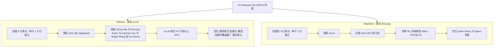
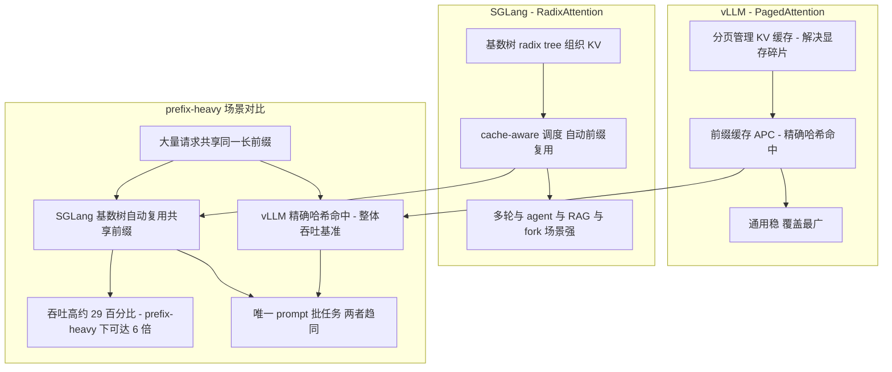
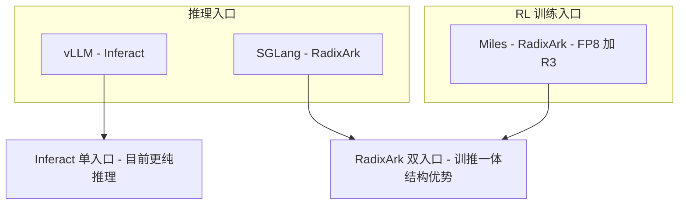
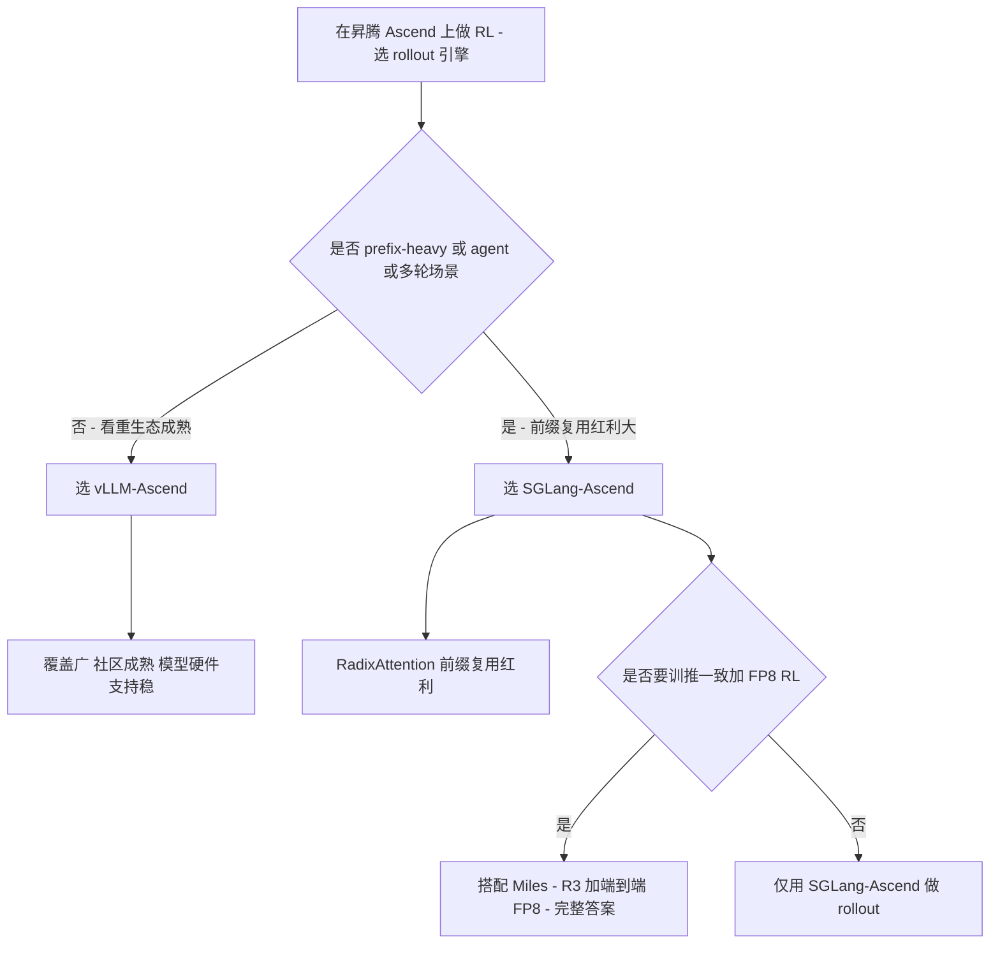

# Dispatch 11 · vLLM/Inferact vs SGLang/RadixArk:两家伯克利系推理公司的对决

*2026-06-25 · NPU Frontier Dispatch · inference / vLLM / SGLang / investment*

> **TL;DR** — 2026 年 1 月,两大开源推理引擎几乎同时商业化:**vLLM → Inferact**(**$800M 估值 / $150M 种子**,a16z + Lightspeed 领投,创始团队 Simon Mo、Woosuk Kwon、Kaichao You、Roger Wang + **Ion Stoica**,vLLM 跑在 **40 万+ GPU** 上);**SGLang → RadixArk**(**~$400M 估值 / $100M 种子**,Accel 领投,Intel CEO 陈立武天使)。两家都出自 **UC Berkeley** 系,瞄准同一个爆发的推理市场。差别:**vLLM 赢在生态广度、社区、硬件中立、资金**;**SGLang 赢在 prefix-heavy/agent 场景性能(RadixAttention)+ 自带 RL 训练框架 Miles**。对 RL-on-NPU:两个引擎都有 Ascend 后端,是 rollout 引擎选型的两个主选项;SGLang 的 RadixAttention + Miles 的 R3/FP8 让它在"RL 训练侧"叙事更完整,vLLM 则以 vLLM-Ascend 的广覆盖见长。

承接 Dispatch 09/10。应要求把 vLLM 这一侧也做进来,和 SGLang 正面对比。

> ⚠️ 估值/融资为媒体报道口径(provisional),非投资建议。

---

## 1 · 两家公司

| | **Inferact**(vLLM) | **RadixArk**(SGLang) |
|---|---|---|
| 引擎 | vLLM(40 万+ GPU) | SGLang(日均万亿 token) |
| 估值 / 轮次 | **$800M / $150M 种子** | **~$400M / $100M 种子** |
| 领投 | a16z + Lightspeed(+Sequoia/Altimeter/Redpoint/ZhenFund) | Accel(+Intel CEO Lip-Bu Tan 天使) |
| 创始 | Simon Mo、Woosuk Kwon、Kaichao You、Roger Wang + Ion Stoica | SGLang 核心团队(LMSYS 系) |
| 时间 | 2026-01 | 2026-01 spin-out / 2026-05 launch |
| 根 | UC Berkeley | UC Berkeley / LMSYS |

两者同源(伯克利)、同台(推理)、同期(2026 初),却走了**广度 vs 专精**两条路。

## 2 · 引擎之争:PagedAttention vs RadixAttention

承接 Dispatch 10:

- **vLLM / PagedAttention**:用**分页**管理 KV、解决显存碎片;前缀缓存是精确哈希命中(APC)。**通用、稳、生态最大**——支持的模型/硬件最广,是事实上的默认。
- **SGLang / RadixAttention**:用**基数树 + cache-aware 调度**做自动前缀复用,**多轮/agent/RAG/fork** 场景强。整体吞吐比充分优化的 vLLM 高 **~29%**,prefix-heavy 下可达 **6×**;唯一 prompt 批任务两者趋同。

一句话:**vLLM 是"什么都能跑得不错"的默认,SGLang 是"在前缀重度/agent 上更快"的专精。**

## 为什么 RadixAttention 在 agent 时代更值钱

要理解 RadixAttention(SGLang)的价值,先要看清推理服务里真正花钱的部分:**prefill(前缀计算)** 和 **KV cache 的占用**。一个请求进来,模型要先把所有输入 token 过一遍注意力,生成对应的 KV(key/value)张量,这一步算力开销随上下文长度线性增长。如果两个请求共享同一段开头(system prompt、few-shot 示例、工具定义、检索文档),理论上这段开头的 KV 只需算一次、存一份,后续请求直接复用即可——这就是**前缀复用(prefix caching)** 的全部经济学。问题在于:谁能自动、低成本、跨请求地发现并复用这些共享前缀。

**为什么 2026 的主流 workload 天然 prefix-heavy。** 这不是巧合,而是 agentic 应用的结构性特征:

- **多轮对话**:第 N 轮请求 = 前 N-1 轮的完整历史 + 新一句。每一轮都把上一轮的全部内容当前缀重新发给模型,前缀重叠度极高且单调增长。
- **agent 工具循环(ReAct/tool loop)**:一个 agent task 里,system prompt + 工具 schema + 历史 thought/action/observation 构成一个不断追加的长前缀,每调用一次工具就触发一次推理,且新请求的前缀几乎完全包含上一次的前缀。一个任务跑十几个工具步,就是十几次高度重叠的请求。
- **RAG**:同一篇(或同一批)检索文档被反复塞进 prompt 头部,文档前缀在不同 query 间共享。
- **group rollout / best-of-n / fork**:同一个 prompt 派生出多条采样分支(RL 训练采样、投机、树搜索),这些分支共享完全相同的前缀,只在生成端分叉——这是前缀复用收益最极端的场景。

这些场景的共同点是:**前缀不是偶然重合,而是由应用逻辑保证的大段重叠**。谁能把这部分的重复计算和重复显存吃掉,谁就能在相同 GPU 上服务更多并发。

**基数树如何"自动"命中。** RadixAttention 把所有活跃请求的前缀组织成一棵**基数树(radix tree)**:每个节点是一段 token 序列,从根到任意节点的路径就是一个被缓存的前缀,对应一块 KV。新请求进来时,沿树做最长公共前缀匹配——匹配到的部分直接挂载已有 KV,**完全跳过 prefill**,只对新增的尾部 token 算注意力。关键的工程点有两个:一是缓存以树结构而非扁平哈希表组织,共享前缀自然形成共享路径,分叉点之下各自延伸,天然适配 fork/多分支;二是 **cache-aware 调度**——调度器在决定先跑哪个请求、把谁留在显存里时,会优先编排能命中已有缓存的请求,并据此做缓存淘汰(LRU on the tree),让"命中"从偶发变成被调度主动制造的常态。这就是为什么官方口径下,**充分优化对比时整体吞吐比 vLLM 高约 29%(provisional),prefix-heavy 场景可达约 6×(provisional)**——6× 来自把本该重复做的 prefill 几乎全部省掉。

**vLLM 的 APC 在哪里也能复用,差距何时收窄。** vLLM 并非没有前缀缓存:它的 **APC(Automatic Prefix Caching)** 用**精确哈希**对 KV block 分块缓存,只要前缀的 block 内容逐块哈希相同就命中。对 system prompt 复用、共享 few-shot、固定文档头这类**对齐良好的前缀**,APC 同样能省掉 prefill,效果可以和 RadixAttention 很接近。两者真正拉开差距的是:RadixAttention 的树结构在**动态分叉、不定长追加、cache-aware 主动调度**上更顺手,prefix-heavy 且高并发交错时命中率维持得更好;而 APC 是块级精确匹配,前缀对齐和 block 边界稍有偏移就可能错过命中。反过来,**当 workload 是"每条 prompt 都唯一、几乎没有共享前缀"的批处理**(典型如一次性、互不相关的离线打分/抽取),前缀复用本身无收益,两套机制都退化为"只能靠 PagedAttention/分页 KV 提升显存利用率",**此时二者性能趋同**——这也是公认两家差距最小的场景。换句话说:RadixAttention 的溢价完全押注在"未来的负载越来越 prefix-heavy"这个判断上,而 2026 的 agentic 浪潮恰好在兑现这个判断。

## 3 · 战略差异

| 维度 | vLLM / Inferact | SGLang / RadixArk |
|---|---|---|
| 核心叙事 | 最广的开源推理标准 | 最快的 agent/前缀场景 + **RL 训练(Miles)** |
| 硬件 | 中立、覆盖最广(含 vLLM-Ascend) | SGLang-Ascend 等,覆盖较窄但在追 |
| 训练侧 | 主打推理 | **同时握 RL 后训练(Miles:FP8 + R3)** |
| 生态/资金 | 更大、更厚 | 较小、更聚焦 |
| 团队牌面 | + Ion Stoica(Databricks 联创) | SGLang 原班 + Intel CEO 背书 |

最大的结构差异:**RadixArk 同时卡住"推理 + RL 训练"两个入口**(SGLang+Miles),而 Inferact 目前更纯粹是推理。这让 RadixArk 的故事在"前沿 MoE 后训练"这条线上更完整(见 Dispatch 09)。

### 为什么 RadixArk 的"双入口"是更完整的故事

RadixArk 的产品不是单一推理引擎,而是**推理(SGLang)+ RL 训练采样(Miles)** 两个入口握在同一套栈里。要理解这为什么是"更完整的故事",得看前沿大模型今天真正难的是什么:**后训练(post-training),尤其是大 MoE 模型上的强化学习**。

**RL 后训练的瓶颈在采样,而采样就是推理。** 一个典型的 RLHF/RLVR 训练步是:用当前 policy 模型对一批 prompt 做 **rollout(大量采样生成)**,拿到 response 后打分、算优势、回传梯度更新权重。其中 rollout 阶段占了训练墙钟时间的大头——它本质上就是**高吞吐推理**,而且是前面讲的最极端的 prefix-heavy + group rollout 场景(同一 prompt 采 n 条)。所以谁的推理引擎快、前缀复用好,谁的 RL 训练采样就便宜。SGLang 把推理这一端做到领先,**Miles 则把这套采样能力直接接进训练循环**——同一家、同一引擎覆盖"采样—训练"和"服务"两条价值链,这就是"双入口"。对正在烧钱做前沿 MoE 后训练的实验室,这是一个比"只卖推理服务"更靠近核心预算的位置。

**训推一致(train/infer consistency)为什么是真痛点。** RL 训练里有一类隐蔽而致命的 bug:**训练时算 logprob 的引擎,和采样/服务时生成 token 的引擎,不是同一套实现**。哪怕是同一个权重,不同 kernel、不同 attention 实现、不同数值精度、不同 batching/padding,都会让同一个 (prompt, token) 的 logprob 出现微小漂移。在 RL 里这种漂移是会被放大的:重要性采样比率 `π_new/π_old` 直接吃 logprob 差,漂移会污染优势估计、让 PPO/GRPO 这类算法的梯度方向失真,表现为训练不稳、reward 崩塌、或者"线下评估好、上线就退化"。**用同一个引擎做采样和服务(SGLang/Miles)**,意味着 rollout 用的分布、训练里 reference 的分布、最终部署服务的分布是**同源**的——把这类 train/infer logprob 漂移从架构上消掉,而不是靠事后对齐补丁。Miles 强调 **FP8 + R3(训推一致)**(provisional)正是冲着这个点:让低精度采样既快又"数值上可信",训出来的策略到了服务端不走样。对投资人这意味着:RadixArk 不只在卖"更快的推理",而是在卖"前沿后训练的一致性基础设施"——这是一个**粘性更高、更难被纯价格战商品化**的位置,前提是 Miles 真的被头部实验室采用(这正是关键观察指标之一)。

## 3.5 · 效果 / 性能对比(provisional)

下表均为 **provisional(媒体/官方口径,非实测,非投资建议)**,用于说明结构性差异而非给出通用排名。

| 场景 | vLLM 表现 | SGLang 表现 | 说明 |
|---|---|---|---|
| 唯一 prompt 批处理(离线、无共享前缀) | 强:PagedAttention/分页 KV 解决显存碎片,吞吐高 | 相当:前缀复用无用武之地,退化为同类显存优化 | **两者趋同**,公认差距最小的场景;此时拼的是 kernel/调度细节而非前缀机制 |
| 多轮对话 | APC 可缓存上一轮历史前缀,命中良好 | RadixAttention 树结构天然命中单调增长的历史前缀 | SGLang 略优,差距随轮数与并发交错增大 |
| agent 工具循环(ReAct) | APC 块级命中,前缀对齐良好时有效 | cache-aware 调度 + 树结构,主动制造命中 | SGLang 优势明显,工具步越多、前缀越长收益越大 |
| RAG 长前缀(共享文档头) | APC 对固定文档头命中好,效果接近 | RadixAttention 在文档前缀复用上同样强 | 接近;对齐良好的固定长前缀是 APC 的强项,差距收窄 |
| group RL rollout(同 prompt 多采样/fork) | 可缓存共享 prompt,但 fork 分叉非其最优结构 | 最极端收益场景,**prefix-heavy 可达约 6×** | SGLang 优势最大;fork/分支正是基数树设计目标 |

**为什么这些数字不能当通用排名。** 上面每一格的"快多少"都是 **workload 的函数,不是引擎的固有属性**。同一对引擎,在"唯一 prompt 批处理"上几乎打平,在"group rollout"上可以差出数倍——决定结果的是**前缀共享度、序列长度、并发与到达模式、batch 构成、精度配置、硬件**。官方口径的"整体高约 29%、prefix-heavy 6×"是在**各自充分优化**的特定基准下得到的;换一组超参、换一类负载,顺序甚至可能反转。再加上 vLLM 覆盖最广、是"事实默认",很多场景下"够快 + 生态/可移植性"比峰值吞吐更重要。因此这张表应读作**"在什么负载下谁的架构更占便宜"的地图,而非"谁更快"的总分榜**;任何采购决策都应以自己真实流量的复现基准为准。

## 4 · 谁赢哪块 / 会共存吗

- **生产部署默认**:vLLM(广度、社区、硬件)。
- **prefix-heavy / agent / 结构化输出 / RL rollout**:SGLang。
- **大多数团队 2026 年其实在两者之间二选一**——很多 RL 栈(AReaL、Miles)默认用 SGLang 做 rollout,而通用服务默认 vLLM。两者**长期共存**的概率高于一家通吃。

## 5 · 投资视角(非建议)

- **估值差**:Inferact $800M vs RadixArk $400M。前者反映更大社区/生态;后者**相对便宜**,且多一条 RL 训练腿。
- **看多 vLLM/Inferact**:事实标准、40 万 GPU 分发、a16z+Lightspeed+Ion Stoica 的牌面与渠道。
- **看多 SGLang/RadixArk**:性能领先的细分 + 推理&训练双入口 + 更低进入估值。
- **共同风险**:开源推理**商品化 + 变现难**;巨头(NVIDIA、云厂)夹击;价格战压毛利。
- **观察指标**:各自托管/企业版收入起量、相对采用份额、对非 NVIDIA 硬件(昇腾/AMD)的覆盖、SGLang 的 RL 训练(Miles)是否被头部实验室真实采用。

**投资对比速查(非建议,provisional):**

| 维度 | Inferact–vLLM | RadixArk–SGLang |
|---|---|---|
| 估值 / 融资 | ~$800M 估值 / $150M 种子 | ~$400M 估值 / $100M 种子 |
| 领投 / 关键背书 | a16z + Lightspeed 领投(+Sequoia/Altimeter/Redpoint/ZhenFund);Ion Stoica(Databricks 联创) | Accel 领投;Intel CEO 陈立武(Lip-Bu Tan)天使;LMSYS 系核心团队 |
| 护城河 | 最大覆盖面 + 社区/生态 + 硬件中立(vLLM-Ascend 昇腾)+ "事实默认" + 资金厚度 | 性能领先的细分(RadixAttention/agent 负载)+ 推理×RL 双入口 + 训推一致(Miles FP8/R3) |
| 变现路径 | 托管/企业版 + 广覆盖带来的默认入口与跨硬件部署 | 高性能托管 + 切入前沿后训练采样(更贴近实验室核心预算) |
| 最大风险 | 开源推理商品化、变现难;广而不深、被云厂/NVIDIA 夹击,差异化溢价弱 | 估值与"性能领先"叙事强绑定;一旦 vLLM 在 agent 负载追平,溢价收窄;Miles 采用未证实 |
| 关键观察指标 | 托管/企业版收入起量;采用份额;非 NVIDIA 硬件覆盖 | 同上 + **Miles 是否被头部实验室真实采用**;prefix-heavy 优势能否维持 |

**中性 bull/bear 分析。** *Inferact–vLLM* — **Bull**:推理界的"事实默认",40 万+ GPU 在跑,覆盖最广、社区最大、硬件最中立,叠加最厚资金和 Ion Stoica 背书,是"卖水给所有人"的分发护城河,变现只要在巨大装机量上抽一层。**Bear**:开源推理正在商品化,广度不等于定价权;NVIDIA(TensorRT-LLM)和云厂自有栈两头夹击,$800M 估值需尽快证明托管/企业版起量。*RadixArk–SGLang* — **Bull**:押中 agentic 浪潮,负载越 prefix-heavy 优势越值钱,再用 Miles 把推理延伸到 RL 后训练采样,占住更粘、更难被价格战商品化、更贴近实验室核心预算的位置,训推一致是真痛点。**Bear**:估值一半建立在"性能领先"叙事上,而这优势高度依赖 workload,vLLM 的 APC 在 RAG/对齐前缀上已能逼近;覆盖面显著小于 vLLM,Miles 被头部实验室真实采用尚未证实。(以上均为 provisional,非投资建议。)

## 6 · 对 RL-on-NPU 的意义

- **rollout 引擎选型**:在昇腾上做 RL,rollout 引擎基本就是 **vLLM-Ascend** vs **SGLang-Ascend** 二选一。vLLM-Ascend 覆盖广、社区成熟;SGLang-Ascend 带 RadixAttention 的前缀复用红利(Dispatch 10)。
- **训练侧**:SGLang 这边有 **Miles 的 R3 + 端到端 FP8**(Dispatch 09)——这是"训推一致 + FP8 RL"在 GPU 上的完整答案;能否随 SGLang-Ascend 一起落到昇腾,是 RL-on-NPU 最值得追的工程线。
- 换句话说:**vLLM 给昇腾最广的 rollout 覆盖,SGLang/RadixArk 给昇腾最完整的 RL 训练蓝图**——两条都值得本看板持续跟踪。

---

*来源:TechCrunch / Bloomberg / SiliconANGLE / pulse2(Inferact $800M、$150M、a16z+Lightspeed、创始团队、Ion Stoica)、RadixArk 报道(Dispatch 09 来源)、SGLang vs vLLM 性能对比(Dispatch 10 来源)。估值/融资为媒体口径,provisional;非投资建议。*
