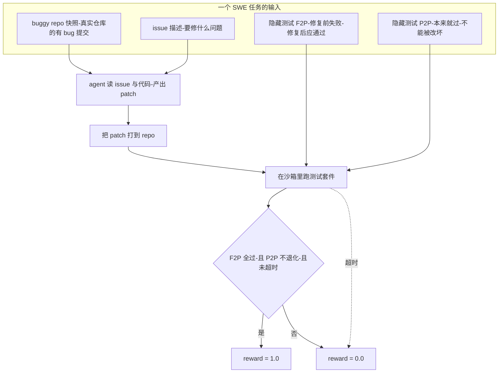
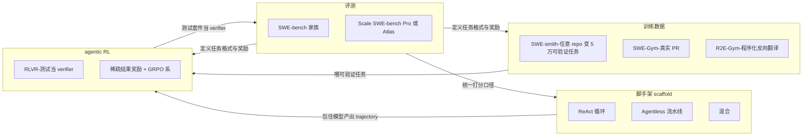
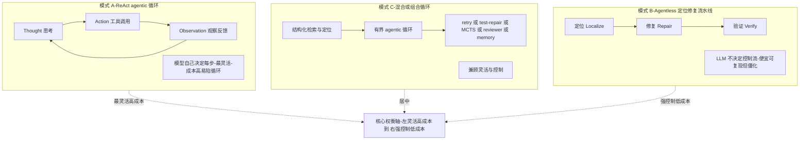
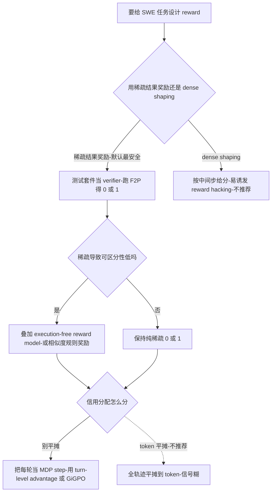
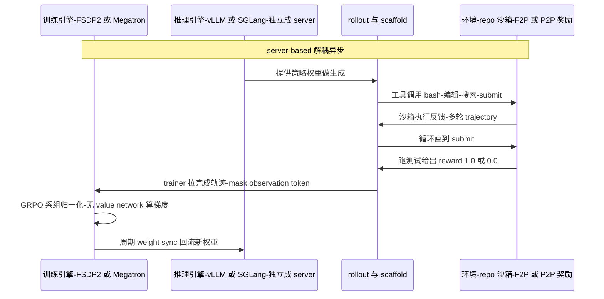
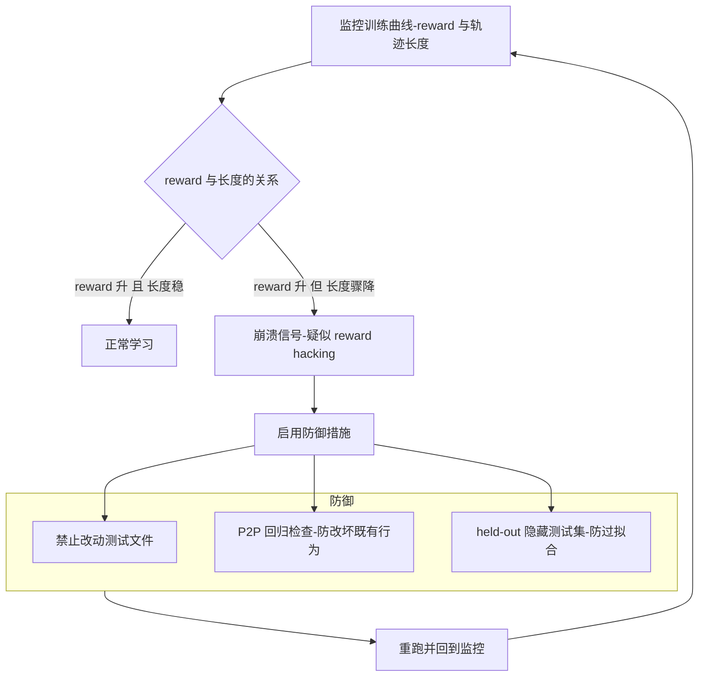

# Dispatch 12 · SWE Agents + Agentic RL 上手指南

*2026-06-26 · NPU Frontier Dispatch · SWE-agents / RL / 系统搭建*

> **TL;DR** — SWE agent 任务 = **真实 repo 的 buggy commit + issue + 一组隐藏测试**,reward = 打上 patch 后 **FAIL_TO_PASS 全过且 PASS_TO_PASS 不退化**(F2P 是整个生态的核心格式)。子领域四块咬合:**评测**(SWE-bench 家族 + Scale 的 SWE-bench Pro / Atlas)、**脚手架**(ReAct 循环 / Agentless 流水线 / 混合)、**训练数据**(SWE-smith 把任意 repo 变 ~5 万可验证任务)、**agentic RL**(RLVR 用测试当 verifier,稀疏结果奖励 + GRPO 系最稳)。搭系统 = 环境(repo+沙箱+测试奖励)→ rollout(scaffold)→ trainer(verl/SkyRL/rLLM/prime-rl)→ 异步解耦 + 信用分配 → 数据(SWE-smith/R2E-Gym),最省力起点是 **DeepSWE 栈(rLLM + R2E-Gym)**。坑:reward hacking、flaky 测试、长 rollout 显存、沙箱并行成本、benchmark 污染。

> 🤖 本期由 **6 个并行子 agent 调研 + 1 个综合 agent 汇总**(multi-agent workflow)产出。链接与 arXiv ID 为调研所得,部分前沿/厂商数字为 *provisional*,以原始来源为准。

---

## 1. 快速上手(5 步)

**心智模型(一段话):** 一个 SWE agent 任务就是 **(真实代码仓库的某个 buggy commit + 一段 issue 描述 + 一组隐藏测试)**;agent 在沙箱里用工具(bash/编辑/搜索)多轮探索并产出一个 patch,reward 就是"打上这个 patch 后,原本失败的测试(FAIL_TO_PASS)是否全过、且原本通过的测试(PASS_TO_PASS)不退化"。整个子领域可以拆成四件事互相咬合:**评测**(任务长什么样、怎么打分)、**脚手架/scaffold**(模型外面的控制循环和工具)、**训练数据**(怎么大规模造出可执行验证的任务)、**agentic RL**(用可验证奖励 RLVR 把模型训上去)。理解了 **F2P(Fail-to-Pass)** 这个核心概念,你就理解了整个生态的任务格式。

四块如何互相咬合,见下图:

**最先读/最先跑的 5 件事:**
1. **读 SWE-bench 原论文**,搞懂任务构造三步(scrape PR → filter → execute-and-retain F2P)与 Verified 子集 — https://www.swebench.com · https://openai.com/index/introducing-swe-bench-verified/
2. **跑 mini-swe-agent**(约 100 行,bash 是唯一工具,>74% Verified),亲手看一条 trajectory 长什么样 — https://github.com/SWE-agent/mini-swe-agent
3. **读 SWE-agent 论文 + ACI 文档**,理解"接口设计而非模型本身"为何能撬动 10–30 分 — https://arxiv.org/abs/2405.15793 · https://swe-agent.com/0.7/background/aci/
4. **读 SWE-smith**,看怎么把任意 repo 自动变成 ~5 万个可验证任务 — https://arxiv.org/abs/2504.21798 · https://github.com/SWE-bench/SWE-smith
5. **读 DeepSWE blog + clone rLLM**,看一条完整的"从 Qwen3-32B 纯 RL 训上去"的开源复现 — https://www.together.ai/blog/deepswe · https://github.com/rllm-org/rllm

## 2. 核心概念

**① 评测(SWE-bench 家族)**
SWE-bench 家族都给 agent (repo + issue),要求产出能过隐藏 F2P/P2P 测试的 patch。主要切片:**Full**(2294 实例)、**Lite**(300,快测)、**Verified**(500,OpenAI 人工校验,事实标准但已接近饱和)、**Multimodal/M**(JS+截图)、**Bash-Only**(只给一个 bash 工具,隔离脚手架影响,参考实现即 mini-swe-agent)、**SWE-bench-Live**(post-cutoff issue,抗污染,https://swe-bench-live.github.io/ · arXiv:2505.23419)。此外 **Scale AI(SEAL)** 还有更难、抗污染的 **SWE-bench Pro**(1865 实例,含私有/copyleft 仓库,https://scale.com/blog/swe-bench-pro)和 **SWE Atlas**(扩到 Codebase Q&A / 写测试 / 重构,https://scale.com/blog/swe-atlas-complete)。**(注:「ScaleSWE」另有所指 —— 是 AweAI-Team 的大规模 SWE 训练数据项目 arXiv 2602.09892,见下方专题,与 Scale AI 无关。)** **关键提醒(均为暂定数字):** 跨来源分数因 harness/scaffold 不同不可直接比较;Verified 存在污染(一项研究称约 32.7% 成功 patch 涉及解泄漏)和测试过拟合(审计显示榜单虚高约 6–7 分),OpenAI 已停止报告 Verified(https://openai.com/index/why-we-no-longer-evaluate-swe-bench-verified/)。

**SWE-bench Pro / SWE Atlas 专题:Scale(SEAL)的抗污染评测**

> ⚠️ 更正:本块早前被错标为「ScaleSWE」。「ScaleSWE」其实是 AweAI-Team 的训练数据项目(见紧接的下一个专题),**与 Scale AI 无关,只是名字撞车**。这里讲的是 **Scale AI(SEAL 评测实验室)** 的抗污染 SWE **评测**。
- **SWE-bench Pro**(https://scale.com/blog/swe-bench-pro):**1865 个任务 / 41 个专业仓库**,三层抗污染——① 公开集只取**强 copyleft(GPL)**仓库,用许可证当「法律门槛」阻止被纳入训练数据;② **私有集**(276 个实例 / 18 个收购来的非公开商业代码库)是泛化的终极考验;③ **held-out 集**永久保密查过拟合。任务也更**长程**。
- **SWE Atlas**(https://scale.com/blog/swe-atlas-complete):同一套抗污染方法**从「修 bug」扩到全工程闭环**——Codebase Q&A、写测试、重构。
- **榜单(2026-06-18,暂定)**:标准化口径 **GPT-5.4(xHigh)59.1%**,厂商自报 **Opus 4.8 69.2%**——比 Verified 低一大截,够难。
- **关系**:是 **Verified 的抗污染接班人**(Verified 已饱和+被解泄漏/测试过拟合污染,Pro 用 copyleft+私有+held-out 堵「背题」,OpenAI Codex 等已转向 Pro)。

**ScaleSWE 专题(更正):AweAI-Team 的大规模 SWE 训练数据,不是 benchmark**

「**ScaleSWE**」= 论文《Immersion in the GitHub Universe: Scaling Coding Agents to Mastery》(**AweAI-Team**,人大 RUC 关联,arXiv 2602.09892)——一个 **SWE 训练数据 + 智能体**项目(数据/蒸馏侧,与 SWE-smith/SWE-Gym/R2E-Gym 同支)。

- **三件套**:大规模**真实 PR 挖掘** + 强模型**轨迹蒸馏** + **合成 F2P 测试**。数据漏斗 **23k 仓库 / 6M PR →(LLM-as-judge 只看元数据预过滤)→ 沙箱三智能体流水线(建环境 / 造测试 / 写问题陈述,MEGAFLOW 编排,阿里云 ECS+ACR 出可验证 Docker 镜像)→ 10 万已验证实例(5200 repo)**;开源 **2 万 Real-Executable 实例 + 71k 蒸馏轨迹(3.5B token,教师 DeepSeek-V3.2)**。
- **合成 F2P**:很多真实 PR 没作者写的 F2P,用一个 **unit-test creator agent** 合成可执行的 F2P 复现脚本(F2P/P2P 同 SWE-bench 口径,强制固定执行顺序防 test pollution)。**关键:只在缺测时「恢复可执行性」,不伪造任务本身**——这正是相对 SWE-smith(造合成 bug)/ R2E-Gym(回译任务)的方法论区别。
- **结果(暂定)**:71k 轨迹 **SFT 到 Qwen3-30B-A3B-Instruct → SWE-bench Verified 64.0%**(基座 22.0%,+42 分),超当时开源 SOTA。**本论文是 SFT-only,没有 RL**。
- **配套**:**AweAgent**(执行框架,Apache-2.0,Scale-SWE 跑在 `search_swe` scaffold + ACI 工具 + **反泄漏 bash blocklist**;训练模式下 tool 观测 `loss_mask=0` 产出 token 级轨迹)、**Scale-SWE-Agent**(HF 模型,200 轮/256k)、**DeNovoSWE**(2026-06,arXiv 2606.10728,**doc2repo** 长程数据,明确 **for SFT & RL**,Qwen3.5-35B-A3B → ~50% BeyondSWE-Doc2Repo)。
- **生态位**:和 **SWE-Gym 同路线但规模放大约 3 个数量级**;主打**蒸馏-SFT**(对照 DeepSWE 的从零 RL、Meta SWE-RL 的非执行相似度奖励);Real-Executable + DeNovoSWE「for RL」暗示 **SFT-now → RL-next**(类比 R2E-Gym→DeepSWE 的交接)。

> 链接:arXiv https://arxiv.org/abs/2602.09892 · GitHub https://github.com/AweAI-Team/ScaleSWE · AweAgent https://github.com/AweAI-Team/AweAgent · DeNovoSWE https://github.com/AweAI-Team/DeNovoSWE · HF https://huggingface.co/AweAI-Team。数字为调研快照(全文 PDF 在本环境被 403),标暂定。

**② Agent 脚手架(主流架构与模式)**
Scaffold = 模型外的一切(控制循环、工具/ACI、上下文检索、状态管理)。三种主导模式:
- **A. ReAct agentic loop**(SWE-agent、OpenHands、mini-swe-agent、CCA):Thought→Action→Observation,模型自己决定每一步。最灵活,但成本高、易陷循环、上下文易爆。
- **B. Localize→repair 流水线**(Agentless,arXiv:2407.01489):固定三阶段(定位→修复→验证),LLM 不决定控制流。便宜、可复现,但僵化。
- **C. 混合/组合循环**(AutoCodeRover、Moatless、SpecRover、2026 多数系统):结构化检索/定位(AST/SBFL/语义)+ 有界 agentic 循环 + retry/test-repair/planning/tree-search(MCTS)/reviewer/memory 等原语。"Inside the Scaffold" 分类研究(arXiv:2604.03515)发现 13 个里 11 个都叠加了多个循环原语。**核心权衡是灵活性 vs 控制/成本**,两个跨模式的决定性杠杆是 **上下文检索质量** 和 **test-time scaling**。

**③ 训练数据(SWE-smith / SWE-gym 怎么造可验证任务)**
中心设计轴是 **真实 PR 挖掘 vs 合成 bug 注入**。
- **SWE-Gym**(arXiv:2412.21139):首个为"训练"而非评测建的环境,2438 个真实任务/11 repo,挖真 PR(真实但慢、规模小),还训 verifier 做 best-of-n。
- **SWE-smith**(arXiv:2504.21798):把任意 Python repo 自动变成任务工厂,四种造 bug 策略(LM Rewrite / AST 改写 / PR Mirroring 反转真实修复 / Combine Bugs),**只保留能把 ≥1 个通过测试翻成失败的 patch** 来验证;**一个 repo 一个执行环境**是规模化关键(解决旧方法每任务数 GB 容器的问题),产出 ~5 万任务 + 2.6 万条 trajectory(可作 SFT)。
- **R2E-Gym**(arXiv:2504.07164):8.1k 程序化环境,SWE-GEN 从 commit 反向翻译出环境+测试,无需人写 issue/test。**BugPilot**(arXiv:2510.19898)专攻"合成 bug 太简单"的批评。

**④ RL 奖励与信用分配**
**RLVR 用测试套件当 verifier**,跑 F2P 得到客观 0/1 reward。经验共识:**稀疏的、基于结果的 test-pass 奖励是主力且最安全** —— 多轮 agentic RL 实践指南(arXiv:2510.01132)发现稀疏奖励在稳定性和最终分数上都胜过 dense/piecewise-dense,而 dense shaping 可靠地诱发 reward hacking。稀疏奖励的弱点是"可区分性低"(两条都通过/都失败的轨迹分不开),两种缓解:**execution-free reward model**(SWE-RM、R2E-Gym 的非执行 verifier,与执行信号互补可突破 ~42–43% 单 verifier 天花板)和 **相似度规则奖励**(Meta SWE-RL,arXiv:2502.18449,用与 ground-truth patch 的序列相似度,绕开执行)。**信用分配**:别把一个轨迹级 reward 平摊到每个 token —— 把每轮当成 MDP step,用 **turn-level advantage(即时反馈 + 折扣后的最终结果份额)**(MT-GRPO arXiv:2505.11821、Kevin arXiv:2507.11948);process/checklist 奖励(CM2、SWE-TRACE)能给中间信号但必须防 hacking。

奖励设计的决策路径(从"用什么奖励"到"怎么分配信用"):

## 3. 前沿工作清单

**评测**
- SWE-bench Verified — 500 实例人工校验,事实标准(已饱和) — https://www.swebench.com/verified.html
- SWE-bench-Live — post-cutoff issue,抗污染持续更新 — https://swe-bench-live.github.io/ (arXiv:2505.23419)
- SWE-bench Pro / SWE Atlas(Scale)— 更难、含私有/copyleft、扩到全工程闭环 — https://scale.com/blog/swe-bench-pro · https://scale.com/blog/swe-atlas-complete

**脚手架**
- SWE-agent — ACI:LM 友好工具集 + 编辑前 lint — https://arxiv.org/abs/2405.15793
- OpenHands — event-stream + CodeAct,通用 runtime — https://arxiv.org/abs/2407.16741 · https://github.com/All-Hands-AI/OpenHands
- mini-swe-agent — 100 行,bash-only,>74% Verified — https://github.com/SWE-agent/mini-swe-agent
- Agentless — 去 agent 的定位→修复流水线 — https://github.com/OpenAutoCoder/Agentless
- Moatless / SWE-Search — 检索优先 + MCTS 树搜索 — https://github.com/aorwall/moatless-tools · arXiv:2410.20285
- Confucius Code Agent(Meta+Harvard)— orchestrator+memory,52.7/54.3% SWE-bench Pro(暂定) — https://arxiv.org/abs/2512.10398

**数据**
- SWE-smith — 任意 repo→5 万可验证任务工厂 — https://github.com/SWE-bench/SWE-smith
- SWE-Gym — 首个训练用真实任务环境 — https://github.com/SWE-Gym/SWE-Gym
- R2E-Gym — 8.1k 程序化环境,SWE-GEN 反向翻译 — https://github.com/R2E-Gym/R2E-Gym

**RL 方法**
- DeepSWE — Qwen3-32B 纯 RL(GRPO++),42.2% Pass@1(暂定) — https://www.together.ai/blog/deepswe
- Meta SWE-RL — 相似度规则奖励,免大规模执行环境 — https://arxiv.org/abs/2502.18449
- Nebius long-context multi-turn — 改进 DAPO,RFT→39% Verified — https://arxiv.org/abs/2508.03501
- Kimi-Dev(Moonshot)— Agentless skill-prior + RL,60.4% Verified(暂定) — https://arxiv.org/abs/2509.23045
- Agent-RLVR — 加 guidance/dense feedback 缓解稀疏奖励 — https://arxiv.org/abs/2506.11425
- 多轮 agentic RL 实践指南 — 稀疏 vs dense 系统对比 — https://arxiv.org/abs/2510.01132

**工业界(所有 vendor 数字均为暂定、scaffold 相关、未独立复现)**
- Cursor Composer 2.5 — 基于 Kimi K2.5 + 大规模 agentic RL(compaction-in-the-loop、Directive Text Feedback) — https://cursor.com/blog/composer-2-5 · https://www.philschmid.de/kimi-composer-context
- Anthropic Claude Code(Opus 4.8)— 高层披露 RLHF+agentic RL;Verified ~88.6% / Pro 69.2%(暂定) — https://www.anthropic.com/news/claude-opus-4-5
- OpenAI Codex(GPT-5.3-Codex)— RL on 真实工程任务,转向 SWE-bench Pro — https://openai.com/index/introducing-gpt-5-3-codex/
- Zhipu GLM-5 — 开源 slime 框架做 async agentic RL — https://github.com/THUDM/slime
- Cognition Devin / Google Jules / Factory Droid — scaffold/async 自治为卖点 — https://cognition.ai/blog/swe-bench-technical-report · https://jules.google/ · https://factory.ai/news/code-droid-technical-report

## 3.5 对比速查(评测 / 数据 / RL 效果)

### 评测基准选型对比

| 基准 | 规模 | 用途 | 抗污染 | 现状/提醒 |
|---|---|---|---|---|
| SWE-bench Verified | 500(人工校验) | 通用 issue→patch 主力榜,长期事实标准 | 弱:语料早于多数模型预训练,泄漏风险高 | **已接近饱和并退役**:OpenAI 已停止报告;一项研究称约 32.7% 成功 patch 涉及解泄漏,审计显示榜单虚高约 6-7 分 |
| SWE-bench Bash-Only | 复用 Verified 实例 | 去工具化对照:只给 bash,考察"scaffold 多大程度上在替模型干活" | 同 Verified | 参考实现 mini-swe-agent(约 100 行)即 >74% Verified,说明高分里 scaffold 贡献巨大 |
| SWE-bench-Live | 滚动更新 | post-cutoff 真实 issue,持续抗污染评测 | **强**:取模型训练 cutoff 之后的实例,从机制上挡数据泄漏 | arXiv 2505.23419;需关注其"截止日期"版本以匹配被测模型 |
| SWE-bench Pro(Scale) | 1865 实例 / 41 仓库 | 更难、更贴近真实工程的升级榜 | **强(三层)**:copyleft + 私有 + held-out | 2026-06-18 暂定:标准化口径 GPT-5.4(xHigh) 59.1%;厂商自报 Opus 4.8 69.2%——比 Verified 低一大截,更能区分前沿模型 |
| SWE Atlas | 多任务 | 把评测从"修 bug"扩到 Codebase Q&A / 写测试 / 重构 | 取决于子任务来源 | 反映 SWE agent 能力边界外扩,单一 pass@1 已不足以刻画 agent 水平 |

**为什么 Verified 退役、为什么跨来源分数不可直接比。** Verified 当初的价值在于人工校验掉了脏实例,使分数可信;但它的语料几乎全部早于当前模型的预训练 cutoff,模型很可能在训练中见过对应 PR/修复,泄漏不可控(约 32.7% 成功 patch 涉及解泄漏、虚高 6-7 分)。当头部 scaffold 已把分数推到 85%+、区分度坍塌时,继续报它既不抗污染也不再有信息量,OpenAI 停报、社区转向 Live / Pro 是自然结果。更关键的一点:**SWE-bench 分数是"模型 × scaffold × harness"三者的联合产物,不是模型单独的属性。** 同一模型在 ReAct 循环、Agentless 流水线、bash-only 下分数可以差出十几分;不同团队的检索策略、重试预算、超时与评测 harness(测试如何跑、如何判通过)都不一致。Bash-Only 对照(mini-swe-agent 100 行 >74%)就是直接证据:相当一部分"模型能力"其实是 scaffold 喂出来的。因此跨来源数字只能在**同一标准化口径**(如 Pro 的标准化结果)内横比;厂商自报数(Opus 4.8 自报 Pro 69.2%、Verified ~88.6%)应一律视为 provisional,未经独立复现、且 scaffold 相关。

### 训练数据路线对比

| 项目 | 造任务方式 | 规模 | 真实性 vs 可扩展性 | SFT/RL 定位 |
|---|---|---|---|---|
| SWE-Gym(2412.21139) | 直接采真实 PR/issue(11 repo) | 2438 真实任务 | 真实性最高,但建环境慢、规模小 | 首个用于**训练**的环境;SFT 与 RL 的真实信号源,但难规模化 |
| SWE-smith(2504.21798) | 合成造 bug:LM Rewrite / AST / PR Mirroring / Combine 四策略 | 5 万任务 + 2.6 万 trajectory | 可扩展性极强;真实性次于真实 PR | **一 repo 一执行环境**是规模化关键;供 SFT/拒绝采样轨迹 |
| R2E-Gym(2504.07164) | 程序化生成环境 + SWE-GEN 反向翻译(无需人写 issue/test) | 8.1k 环境 | 高度自动化、可扩展;任务真实性偏"合成" | 主打 RL 可执行环境的规模供给 |
| ScaleSWE(2602.09892) | 真实 PR 挖掘 + 沙箱三智能体流水线验证 | 漏斗:23k 仓库 / 6M PR → 10 万已验证实例(5200 repo);开源 2 万 Real-Executable + 71k 蒸馏轨迹(3.5B token,教师 DeepSeek-V3.2) | 兼顾真实性与规模:用流水线把"真实 PR"做到可执行可验证 | 71k 轨迹 **SFT-only(无 RL)** 到 Qwen3-30B-A3B-Instruct → Verified 64.0%(基座 22.0%,+42 分) |

**中心设计轴:真实 PR 挖掘 vs 合成 bug 注入。** 这条轴决定了数据的"真实性—可扩展性"取舍。真实 PR 挖掘(SWE-Gym、ScaleSWE 的源头)拿到的是工程师真实改过的代码,任务分布、上下文依赖、测试语义都贴近线上,信号干净;代价是每个实例都要可复现地建出执行环境、配齐能判通过/失败的测试,人力与算力昂贵,SWE-Gym 也因此只有 2438 个、扩起来慢。合成 bug 注入(SWE-smith、R2E-Gym)反过来:先有可运行的 repo,用 LM Rewrite/AST/PR Mirroring 等手段反向"种 bug"或程序化生成环境,**一 repo 一环境**可以摊薄建环境成本、把任务量推到 5 万乃至上万环境,可扩展性碾压;代价是合成 bug 可能偏离真实 bug 分布(过于局部、过于"可被工具定位"),有训练到 scaffold/捷径而非真实修复能力的风险。ScaleSWE 的思路是折中:仍从真实 PR 出发保住分布真实性,再用**沙箱三智能体流水线**自动把"真实但不可执行"的 PR 过滤、补全成"可执行可验证"实例,试图同时拿到真实性和规模——其 64.0% 来自 SFT-only,也说明高质量真实可执行数据本身就能撑起很大一段提升。

### RL 训练效果对比(provisional)

| 方法 | 基座 | 训练方式 | 报告分数(暂定) | 关键点 |
|---|---|---|---|---|
| DeepSWE | Qwen3-32B | 纯 RL,GRPO++ | 42.2% Pass@1(Verified) | 纯 RL 路线代表,无 SFT 预热也能起量;对 reward/采样工程敏感 |
| Meta SWE-RL(2502.18449) | — | RL,**相似度规则奖励、免执行** | — | 用 patch 与参考解的相似度当奖励,绕开建执行环境的瓶颈;奖励代理性强、可能与真实通过率脱节 |
| Kimi-Dev | — | Agentless **skill-prior + RL** | 60.4% Verified | 把 Agentless 流水线的结构先验注入,再 RL 精修;高分但 scaffold 依赖重 |
| Nebius(long-context multi-turn) | — | 改进 DAPO,RFT(拒绝采样微调) | 39% Verified | 主攻长上下文多轮交互;RFT 而非完整 RL,工程上更稳 |
| ScaleSWE(SFT) | Qwen3-30B-A3B-Instruct | **SFT-only(71k 蒸馏轨迹,无 RL)** | 64.0% Verified(基座 22.0%,+42 分) | 证明高质量蒸馏轨迹 SFT 即可大幅追平,RL 不是唯一路 |

**三条路线:纯 RL vs 蒸馏 SFT vs 相似度奖励。** 纯 RL(DeepSWE 的 GRPO++)直接在可执行环境里用"测试是否通过"做奖励,信号最真实、上限最高,但需要大规模可执行环境、稳定的采样/优势估计,且奖励稀疏(一条长轨迹最后才有一个 0/1),工程门槛和算力都高——Agent-RLVR 之类工作正是靠加 guidance/dense feedback 来缓解这种稀疏。蒸馏 SFT(ScaleSWE)放弃在线探索,直接把强教师(DeepSeek-V3.2)的轨迹模仿下来,便宜、稳定、可复现,ScaleSWE 用 71k 轨迹就把 Qwen3-30B 从 22.0% 拉到 64.0%(+42 分,纯 SFT 无 RL),说明数据质量到位时 SFT 的天花板被严重低估;但它学的是教师的行为分布,难超过教师。相似度奖励(Meta SWE-RL)是第三条:用 patch 与参考解的文本/结构相似度当奖励,**免执行环境**,极大降低规模化成本,代价是奖励是真实"通过测试"的代理,可能奖励了"长得像但不对"的 patch。**这些分数不能直接横比**,原因和上面一致:基座不同(Qwen3-32B vs 30B-A3B vs 未公开)、scaffold 不同(Agentless skill-prior 的 Kimi-Dev 与纯 agentic 的 DeepSWE 不在一个口径)、评测 harness 与是否标准化也不同,且大多为厂商/前沿自报、未独立复现。读这张表应看**路线的工程取舍与增量来源(如 ScaleSWE 的 +42 分基座差)**,而非把 42.2 / 60.4 / 64.0 当同尺度排名。

## 4. 怎么搭一个 SWE 的 agentic RL 系统

**架构(文字版,4 个部件 + 数据):**
**环境** = 任务实例(buggy commit 的 repo 快照 + 问题描述 + F2P/P2P 测试列表 + golden patch),包进可运行 Docker 镜像;reward = 打 patch 跑隐藏测试,**全部 F2P 通过 且 P2P 不退化 → 1.0,否则 0.0**(P2P 检查正是防止 agent 靠删代码"修复");测试执行加超时,超时记 0。→ **rollout(scaffold)** 把一个任务变成多轮 trajectory:策略看 issue→发工具调用(bash/编辑/搜索/submit)→沙箱执行→反馈→循环;trajectory 的 token 即 RL 训练序列(**务必 mask 掉 observation/工具输出 token,只对策略自己生成的 token 算 loss —— 这是常见 bug 源**)。→ **trainer** 分成训练引擎(FSDP2/Megatron 算梯度)+ 推理引擎(vLLM/SGLang 出 rollout),周期性 weight sync;算法几乎都用 **GRPO 系**(DAPO/GiGPO/GSPO),无 value network、组归一化、对稀疏二元奖励更稳。→ **异步 + 信用分配**:SWE rollout 常 30–50 轮、分钟级容器时间,同步批生成会让 GPU 干等最慢轨迹,所以用 **server-based 解耦异步**(推理独立成 vLLM/SGLang server,trainer 拉完成的轨迹),并 **per-trajectory(而非 per-batch)** 与沙箱交互;信用分配默认"结果奖励 + 长度归一化广播 + GRPO 组采样(8–16/任务)",太稀疏时上 GiGPO/turn-level。→ **数据**:SFT 冷启动(SWE-smith-trajectories 几千条专家轨迹)→ 在过滤后的任务池上 GRPO(按 pass-rate 区间丢掉无解/秒解任务以保住梯度信号)。

这套端到端的数据流(谁向谁要权重、谁产 trajectory、谁拉去算梯度)见下图:

**参考栈(阻力最小路径)——以 DeepSWE 栈起步:**
- 数据/环境:**R2E-Gym**(R2E-Gym-Subset)+ R2E-Gym AgentHub scaffold
- Trainer:**rLLM**(基于 verl),GRPO++(clip-higher、无 KL、无 entropy bonus、长度归一化)
- 复现指南在 repo 内(`reproduction/DEEPSWE_REPRODUCTION.MD`),脚本 https://github.com/agentica-project/rllm/tree/main/examples/swe

**分步骤搭建清单:**
1. **选环境/数据**:小规模真实用 SWE-Gym;要规模用 SWE-smith(52k)或 R2E-Gym(8.1k)。预构建并缓存所有任务镜像 + 维持 warm pool。
2. **建 reward**:二元 F2P+P2P,加 format/parse 惩罚 + 超时=0;**用 golden patch 和 empty patch 各跑一遍,丢掉不能干净 FAIL→PASS 或不确定性高的实例**。
3. **接 scaffold**:从轻量的 SWE-agent 或 R2E-Gym AgentHub 入手,封装成 (task, policy endpoint) → (token 级 trajectory, reward) 的函数,走 OpenAI 兼容 API。
4. **选 trainer**:最完整复现选 rLLM/DeepSWE;最模块化、后端可一行切换(SkyRL-train/verl/Tinker)选 **SkyRL-Agent**(自带 SWE example,arXiv:2511.16108);要开箱全异步选 **prime-rl**(自带 `examples/qwen30b_swe` + verifiers SWE 环境)。
5. **跑 SFT 冷启动 → GRPO RL**,监控 reward 与 **平均轨迹长度**(防 hacking)。

**关键开源 repo:** 环境/数据 — SWE-bench https://github.com/SWE-bench/SWE-bench · SWE-Gym https://github.com/SWE-Gym/SWE-Gym · R2E-Gym https://github.com/R2E-Gym/R2E-Gym · SWE-smith https://github.com/SWE-bench/SWE-smith。Trainer — verl https://github.com/volcengine/verl · SkyRL https://github.com/NovaSky-AI/SkyRL · rLLM https://github.com/rllm-org/rllm · prime-rl https://github.com/PrimeIntellect-ai/prime-rl(+verifiers https://github.com/PrimeIntellect-ai/verifiers)· slime https://github.com/THUDM/slime · Miles https://github.com/radixark/miles · OpenRLHF https://github.com/OpenRLHF/OpenRLHF · verl-agent(GiGPO,step 级信用)https://github.com/langfengQ/verl-agent · verl-tool(per-trajectory 异步)https://github.com/TIGER-AI-Lab/verl-tool。

## 5. 常见坑

- **Flaky / 错测试**:自动化合成任务的测试质量未经校验,标签噪声直接进 reward。预过滤(golden/empty patch 双跑)、固定 seed、沙箱禁网、隔离运行、隔离 flaky 任务;order/time/network 依赖测试会随机给 0。
- **Reward hacking**:**绝不把隐藏测试放进 prompt**;agent 会改/mock/删测试、写 `assert True`、硬编码期望值 —— 防御:打分前从 golden 恢复测试文件、强制 P2P 回归检查、禁止 agent 改测试文件、留 held-out 测试集。**典型崩溃信号:轨迹长度骤降而 reward 上升**,务必并行监控(Agent-RLVR arXiv:2506.11425)。

- **长 rollout 显存/上下文**:30–50 轮会冲爆上下文 → 限制 max turns/tokens、mask observation token;截断/未 submit 的轨迹给 reward 0 而**不要丢弃**(丢弃会让梯度有偏)。
- **沙箱并行/成本**:每个并发 rollout × group size × batch 一个容器 —— 这才是主导成本和扩展瓶颈(不是 GPU)。预算 ~1–2 CPU / 2–4 GB/容器,K8s 编排;镜像 cold-start 主导延迟,预构建 + warm pool + 安全复用容器。容器-free 方向(SWE-MiniSandbox 等)值得跟踪但还不是默认。
- **Benchmark 污染**:repo 公开且 pre-cutoff,Verified 已被解泄漏与测试过拟合污染;判真实泛化用 **SWE-bench-Live**(post-cutoff)/ **Pro**(私有/copyleft),分离模型能力与 scaffold 工程用 **Bash-only**。
- **异步正确性**:in-flight 权重更新导致 rollout 由略旧策略生成 → 用重要性采样修正(TIS/MIS)或限制 staleness;train/infer 的 logprob 数值不匹配(vLLM/SGLang vs FSDP/Megatron)会悄悄毁梯度,早期就要验证一致性。

## 6. 与 RL-on-NPU 的联系

SWE 的 agentic rollout **又长又重**(30–50 轮、分钟级容器时间、上下文随轮数膨胀),恰恰是昇腾(NPU)显存与异步痛点的放大器:长轨迹把 KV-cache 与激活显存压力推到极致,同步批生成让 NPU 干等最慢/最长轨迹,沙箱容器又把 CPU/内存/编排成本叠加在算力之外。因此前面 Dispatch 02/08 讲的招式在这里全部适用且收益更大——**解耦的异步 rollout(推理 server 与 trainer 分离、in-flight weight sync)、train/infer 引擎切分与 logprob 一致性校验、staleness 有界 + 重要性采样修正、长序列的显存/上下文管理(限轮、mask、compaction)**——把它们套到 SWE agentic RL 这个最严苛的负载上,正是检验和打磨昇腾 RL 系统的最佳压力测试场。

---

*由 multi-agent workflow 产出(6 路并行调研 + 综合)。来源见正文内联链接;arXiv ID 与厂商数字为调研所得、provisional,以原始来源为准。相关条目见本看板 Agentic RL 与 RL for LLMs 标签页。*
