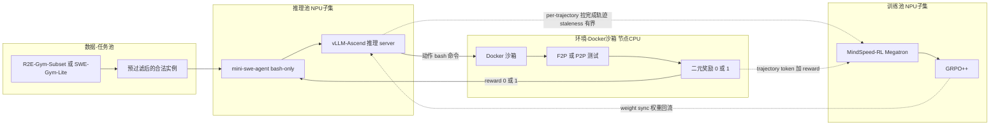
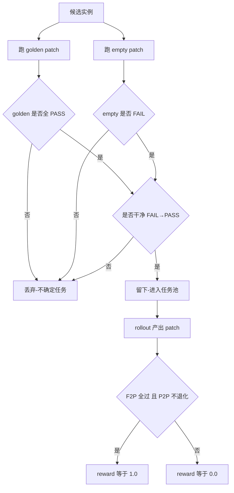
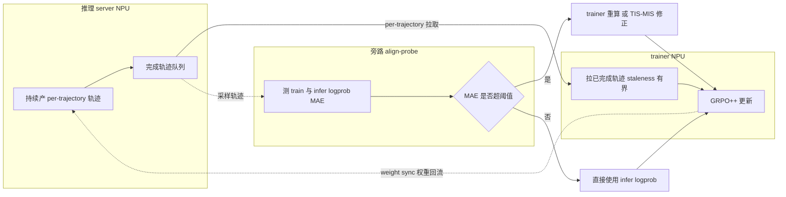
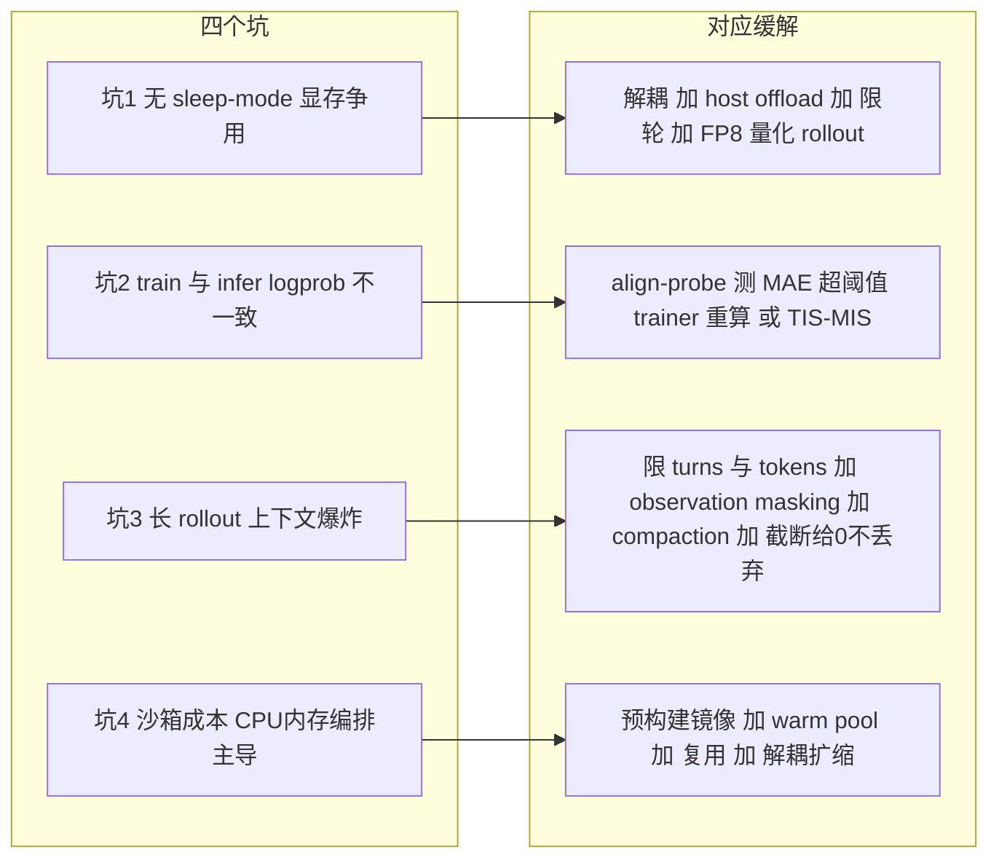
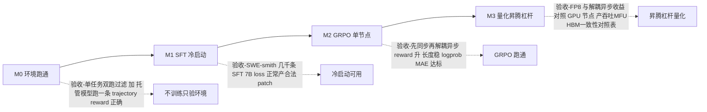

# Dispatch 13 · 在昇腾上搭一个 SWE Agentic RL 最小原型:方案设计

*2026-06-26 · NPU Frontier Dispatch · 方案设计 / SWE-RL / Ascend / 系统*

> **TL;DR** — 把 Dispatch 12 的 SWE agentic RL 配方落到昇腾上,做一个**单节点(Atlas 800T A2,8× 910B)、7B 量级、能跑通的最小原型**。栈:**环境** = R2E-Gym-Subset 任务 + 节点 CPU 上的 Docker 沙箱 + F2P/P2P 二元奖励;**rollout** = 轻量 scaffold(mini-swe-agent)+ vLLM-Ascend 推理 server(observation-token masking);**trainer** = MindSpeed-RL(Megatron 系)+ GRPO++;**异步** = 推理 server 与 trainer 解耦 + per-trajectory + staleness 有界。目标不是刷 SOTA,而是**量化并打磨昇腾特有的四个坑**:无 sleep-mode 的显存争用、train/infer 的 logprob 一致性(align-probe)、长 rollout 的显存、沙箱容器并行成本。里程碑:M0 单任务跑通奖励 → M1 SFT 冷启动 → M2 GRPO 7B 单节点 → M3 量化 FP8 rollout / 解耦异步 / 对 GPU 的差距。**provisional:本篇为方案设计(proposal),非已验证结果。**

承接 Dispatch 12(SWE agents 上手)。这期把"怎么搭"具体到昇腾,给一份能照着做的设计。

---

## 0. 目标与非目标

- **目标**:在**单节点 8× 910B** 上,用 GRPO 把一个 **7B 编码模型**在 SWE 任务上从基线训出可测量的提升;**把昇腾特有的瓶颈量化出来并给出缓解**;产出一张 GPU vs NPU 的吞吐/显存/一致性对照表。
- **非目标**:刷 SWE-bench 榜单、上 32B/MoE、多节点超大规模——这些是原型跑通后的扩展。
- **为什么从这做**:SWE rollout 又长又重(30–50 轮、分钟级容器),是昇腾显存+异步痛点的**放大器**,最能暴露问题、也最能体现前面各期招式的价值。

## 1. 为什么 SWE agentic RL 是压测昇腾最严苛的负载

如果只是想给 910B 找一个"能出数"的 RL 任务,数学题(GSM8K 风格)或短对话偏好其实更省事:单轮、定长、奖励即时。我们偏偏选 SWE agentic,因为它把昇腾在 RL 训练里最薄弱的几个环节同时点亮,是一种刻意的压测。

机理上有三层放大:

- **长尾 rollout 把"尾部"变成主导项**。一个 SWE 任务要 agent 反复 `bash` 读文件、改代码、跑测试,30-50 轮是常态,且轮次分布是重尾的:大部分任务 15 轮内收敛,少数卡在 40+ 轮。同步 GRPO 一个 step 要等整组(8-16 条轨迹)全部跑完才能进 trainer,于是 **step 时间被组内最慢的那条轨迹决定**。这不是均值问题,是 P99 问题——尾部一拉长,NPU 在 rollout 阶段大量空转等 CPU 沙箱回包。
- **显存放大器:rollout 引擎与权重/KV 长期共存**。在没有 sleep-mode 的前提下,vLLM-Ascend 的模型权重 + 长轨迹累积的 KV cache,与 Megatron 侧的参数、优化器状态、梯度、激活,在同一张 64GB 卡上掰手腕。轨迹越长,KV 占用越大,且因为是 agentic 多轮,prompt 在每轮都重新拼接历史(observation + thought + action),context 单调增长,KV 不是常数而是随轮次爬升的。长 rollout 直接翻译成 HBM 峰值的不可控。
- **train/infer 数值一致性在异构算子下被持续考验**。轨迹越长,逐 token 的 logprob 误差越会沿序列累积;agentic 的多轮拼接又让同一段 token 在不同轮次被反复 re-encode。NPU 与 GPU 的算子实现差异在短序列上可能无害,在 30+ 轮的长序列上会被放大成可观的分布漂移。

一句话:**SWE agentic 把"长度"这个维度同时灌进了吞吐、显存、数值三条主线**,这正是检验一套昇腾 RL 配方是否真能落地的最佳负载。本节及以下均为方案设计层面的预期分析,非实测结论(provisional)。

## 2. 总体架构(5 部件,标注昇腾选型)

关键原则:**推理(rollout)与训练分到不同 NPU 子集**,沙箱容器跑在**节点的 CPU**上(测试执行不需要 NPU)。trainer 周期性把新权重 sync 回推理 server;解耦异步下,trainer 拉**已完成**的轨迹,staleness 有界。

## 3. 环境与奖励:二元奖励 + 预过滤

**任务源**:首选 **R2E-Gym-Subset**(程序化生成、无需人写 issue/test、镜像规整),或 **SWE-Gym-Lite**(真实但小)。规模化阶段再上 **SWE-smith**(一 repo 一执行环境,适合批量)。**沙箱**:每个任务一个预构建 Docker 镜像,跑在节点 CPU 上;**禁网、固定 seed、超时**;维持 **warm pool** + 复用容器降 cold-start。

**奖励是二元的**——F2P(fail-to-pass)与 P2P(pass-to-pass)同时满足给 **1.0**,否则给 **0.0**;format/parse 惩罚;超时=0。为什么不用更"丰富"的奖励(部分测试通过比例、编辑距离、LLM 打分)?

- **稠密奖励在 SWE 上几乎都是可被 hack 的代理指标**。"通过测试数占比"会奖励那些注释掉断言、改测试而非改实现的轨迹;LLM-judge 引入第二个待对齐的分布,且在昇腾上又多一个推理服务要养。二元 F2P/P2P 是**任务定义本身**,不是代理,hack 它就等于真把 bug 修了。
- **代价是奖励极度稀疏**,所以必须靠**组采样(8–16)+ GRPO 的组内相对优势**来制造梯度信号:一组里哪怕只有 1–2 条过了,组内归一化也能把"相对更好"的方向抽出来。这也是选 GRPO 而非 PPO 的配套理由——稀疏二元奖励下,组内 baseline 比学一个 value head 更稳。

**预过滤(关键)**:每个候选任务,先用 golden patch 跑一遍(应当 PASS)、再用 empty patch 跑一遍(应当 FAIL),只有干净地呈现 FAIL→PASS、且两次结果确定可复现的任务才入池。

脏标签**具体怎么毁训练**:

- **假阴性(golden 也 FAIL)→ 奖励上限被砸穿**。如果一个任务连正确答案都拿不到 1 分(flaky 测试、缺依赖、时间戳/网络相关测试、非确定性顺序),那么 agent 无论多正确,这一组的 reward 期望都偏低甚至恒 0。GRPO 组内归一化会在**全 0 组**上输出零优势或纯噪声优势——等于喂模型无信息甚至误导信息的 batch。
- **假阳性(empty 也 PASS)→ 模型学会"什么都不做"**。如果空 patch 就能过,agent 发现交白卷也拿分,组内优势会奖励最短、最懒的轨迹。这与下文的 reward-hacking 监控直接呼应:**长度骤降 + reward 上升**正是这种污染的信号。
- **不确定任务(两次跑结果不稳定)→ 优势估计方差爆炸**。同一条轨迹这次 1 下次 0,组内 baseline 抖动,advantage 的符号都可能翻转,梯度方向被随机化。稀疏奖励本就信号微弱,再叠加标签噪声,等于在低信噪比上再降信噪比。

所以预过滤不是"数据清洗的可选项",而是**让稀疏二元奖励这套方案能成立的前提**。

## 4. Rollout(scaffold + 推理引擎)+ observation masking

- **scaffold**:从 **mini-swe-agent**(bash-only、~100 行)起步,封装成 `(task, policy endpoint) → (token 级 trajectory, reward)`,走 OpenAI 兼容 API;成熟后可换 SWE-agent / R2E AgentHub。
- **推理引擎**:默认 **vLLM-Ascend**(910B 覆盖最广、最成熟);**备选 SGLang-Ascend**——它的 RadixAttention 能复用"一个任务采 N 条样本共享的 prompt 前缀"(见 Dispatch 10),对 group rollout 省 KV,但 Ascend 后端成熟度需先验证。

**observation-token masking(必做)**:agent 的轨迹里,工具输出(bash 的 stdout/stderr、文件内容、测试日志)这些 token 是**环境给的、不是模型生成的**,它们必须进入 context 参与 attention(模型得看见日志才能决策),但**绝不能进入 loss**——否则模型会去"拟合"它根本不负责生成的环境文本。实现上就是一个 per-token 的 0/1 loss mask,把 observation 段置 0。

为什么这在昇腾上**更易出错**:在很多 GPU 训练栈里,loss mask 是成熟路径。落到 MindSpeed-RL / Megatron-on-Ascend,**mask 的传播要穿过自定义的融合算子**(融合的 cross-entropy、序列并行下的切分、packing 的 cu_seqlens 边界),这些算子在昇腾上常被**重写/替换**以适配 NPU,而 mask 与 packing 边界、与序列并行切分点的**对齐**正是重写时最容易出 off-by-one 的地方。agentic 长序列里 mask 是**高频翻转的细碎段**(thought 算 loss、observation 不算、action 算 loss),边界 bug **不会报错、只会静默漂移**:

- **mask 漏掉(observation 进了 loss)**:模型被训练去预测 bash 输出、文件内容——这是它无法也不该控制的分布。表现为 loss 看起来在降但能力不涨,模型逐渐学会复读日志格式,reward 停滞。
- **mask 过多(把该算的 action token 也 mask 了)**:有效梯度信号被稀释,长轨迹里真正的决策 token 贡献被抹掉,训练像"没怎么学"。

两类都**静默**。所以验收上必须有一个独立检查:构造已知 mask 的小样本,断言参与 loss 的 token 数 == 期望值,且 mask 边界恰好落在 role 切换处。把它做成 M0/M1 的 CI 级断言,而不是靠肉眼看 loss 曲线。

## 5. Trainer

- **框架**:**MindSpeed-RL**(华为原生、Megatron 系、跑过 384-NPU 上的 GRPO,本看板 Ascend 标签有卡)为主;**verl-Ascend** 为备选。
- **算法**:**GRPO++**(clip-higher、无 KL、无 entropy bonus、长度归一化、组采样 8–16/任务)——对稀疏二元奖励最稳,无 value network。
- **引擎切分**:训练引擎(MindSpeed/Megatron 算梯度)与推理引擎(vLLM-Ascend 出 rollout)分离,周期性 **weight sync**(优先零拷贝/host 中转)。
- **冷启动**:先用 **SWE-smith-trajectories** 几千条专家轨迹做 SFT,再进 GRPO。

## 6. 异步 + 信用分配:解耦异步 vs 同步 GRPO

**同步 GRPO**:每个 step 内,采一组轨迹 → 全部跑完 → 算优势 → 更新。**优点是绝对 on-policy**,采样策略就是当前策略,无需 off-policy 校正,数值最干净。**致命缺点**——如第 1 节所述,SWE 轨迹重尾,step 时间被组内最慢轨迹决定,NPU 在 rollout 阶段大量空转。同步是**正确但慢**的基线。

**解耦异步**:推理服务与 trainer 解耦,**per-trajectory 拉取已完成轨迹**(谁先跑完先入队),trainer 持续消费、持续更新。NPU 不再等尾部,吞吐显著改善。代价是采样轨迹来自**稍旧的策略**(off-policy),引入两个必须管的东西:

- **staleness 有界**:必须限制"用来更新的轨迹最多落后当前权重几个版本/几个 step"。无界 staleness 会让训练用上几代以前的策略数据,优势估计与当前策略脱节,训练发散。有界是用"一点点 off-policy 偏差换大量吞吐"的旋钮。
- **TIS/MIS**:轨迹既然 off-policy,就要用重要性采样校正;而 IS 比值方差大、长尾,直接用会炸梯度,所以做 **truncated / masked IS**——对比值截断、对异常 token 屏蔽,把方差压住。它和坑 2 的 align-probe 是一套:align-probe 告诉你 train/infer 差多大,TIS/MIS 是据此做的实际防护。

**信用分配**:默认"结果奖励 + 长度归一化广播 + GRPO 组采样";太稀疏时上 **turn-level / GiGPO**(把每轮当 MDP step)。

**方案路线**:M2 先上**同步**跑通正确性(确认配方本身能学),再切**解耦异步**拿吞吐——这样一旦异步出问题,有同步基线做对照,能区分"是异步引入的 bug"还是"配方本身不对"。这是把昇腾吞吐杠杆(M3)建立在可信基线上的必要顺序。

## 7. 昇腾特有的四个坑 + 缓解(本原型的核心产出)

### 坑 1:无 sleep-mode 的显存争用

**机理**:成熟 GPU RL 栈有 sleep-mode,能在 train 阶段把推理引擎的权重/KV 临时换出、把显存让给 trainer,step 间再换回。昇腾侧目前**不能假设有这个能力**:rollout 引擎在 train 阶段无法干净释放 KV/权重,于是 64GB 单卡要同时背 rollout 与 train 两套常驻占用。**对策与取舍**:**解耦**(rollout 与 trainer 不在同一时间片争同一份预算)是第一杠杆;**host offload** 把暂不用的权重/优化器状态换到 host 内存(代价是搬运延迟);**限轮**(turns/tokens 上限)直接压住 KV 增长上界;**FP8 量化 rollout** 让推理权重与 KV 用 FP8,显存近似减半(代价是引入 train/infer 数值差,与坑 2 耦合)。**定性预期(provisional)**:FP8 rollout 预期把 rollout 侧 HBM 峰值压到 BF16 的 ~50–60%,是能否在单卡塞下"长轨迹 KV + 训练激活"的关键开关。

### 坑 2:train/infer logprob 不一致

**机理**:同一段 token,rollout 用 vLLM-Ascend(推理优化算子、可能 FP8)、trainer 用 Megatron(训练算子、BF16),**两套算子在 NPU 上的数值实现不同**,逐 token logprob 会有偏差。重要性比 `exp(logπ_train − logπ_infer)` 对这个差异指数级敏感,长序列上误差累积,会让 off-policy 校正项失真甚至发散。**对策**:**align-probe**(下节专述)逐 token 量 MAE;超阈值时让 trainer 重算 logprob(以训练侧为准),并用 **TIS/MIS** 对比值做截断。**定性预期(provisional)**:期望逐 token logprob MAE 落在"小但非零"的量级;FP8 rollout 会把 MAE 抬高一档,因此 FP8 与 TIS/MIS 截断阈值需要联调——这是 M3 量化杠杆能否兑现的核心风险点。

### 坑 3:长 rollout 冲爆上下文

**机理**:30–50 轮、每轮拼接历史,context 单调上涨,必然有任务撞到上下文上限。**怎么处理撞墙的轨迹,是个有偏/无偏的选择题**。**对策**:硬限 turns/tokens;observation masking 已省下大量"不必算 loss"的 token;**compaction**(对历史 observation 做摘要/截断,保留决策必要信息);**关键取舍——截断的轨迹给 reward 0 但不丢弃**。直觉上"没跑完就扔掉"很诱人,但**丢弃会让梯度有偏**:被丢的恰好是"长、难、易超限"的任务,系统性地从训练分布里删掉硬样本,模型会偏向短任务,且与 reward-hacking 的"变短"趋势合流。给 0 分保留,模型仍受到"别把轨迹拖到超限"的负向信号,分布不被扭曲。**定性预期(provisional)**:加 compaction + observation masking 后,期望大部分任务的有效 context 增长曲线被压平,撞墙率显著下降;但 compaction 摘要质量本身是变量,过度压缩会丢决策信息、伤 reward。

### 坑 4:沙箱容器并行/成本

**机理**:很多人默认 RL 瓶颈在算力(NPU),但 SWE agentic 的**沙箱成本主导在 CPU/内存/容器编排**——起容器、装依赖、跑测试套件,这些都在节点 CPU 上,且每条轨迹每轮都要交互。NPU 反而经常在等沙箱。**对策**:**预构建镜像**(依赖装好,免每次冷装);**warm pool**(预热一批容器,摊掉启动延迟);**安全复用**(同一容器跨任务复用,但保证文件系统/状态干净隔离,防串味污染标签);**解耦扩缩**(沙箱池与 NPU 训练独立扩缩,沙箱不够就加 CPU 而非动 NPU)。**定性预期(provisional)**:warm pool + 预构建镜像预期把单轮沙箱交互的尾延迟大幅压低,从而抬高 NPU 的有效利用率;沙箱吞吐应作为与 NPU MFU 并列的一级系统指标监控——它很可能才是真实瓶颈。

## 8. align-probe:最该先做的健全性检查

**为什么排第一**:坑 2(logprob 不一致)是**静默的、会污染所有后续训练**的系统性风险,而且它不像 OOM 那样会崩——训练照跑,只是 advantage 校正在悄悄失真。在异构(NPU)栈上,你**不能假设** train/infer logprob 像同构 GPU 栈那样天然接近。所以在烧任何 GPU-hour 做 GRPO 之前,先用一个最小探针确认"两条路径算出来的概率到底差多少",是性价比最高的一次检查。

**怎么做**:取一批固定 prompt + 固定 response(可直接用 SFT 后的样本),分别走 rollout 引擎(vLLM-Ascend)与 trainer(Megatron)前向,**对齐逐 token 的 logprob**,统计:逐 token MAE 与 P99;误差是否随序列位置累积(长序列尤其要看尾部);开/关 FP8 两种配置各测一遍(FP8 预期更差)。

**一个具体的阈值思路(provisional)**:把容忍度挂到"对 IS 比值的影响"上,而不是凭空定一个 logprob 数字。设重要性比 `r = exp(Δlogp)`,若希望单 token 比值偏差控制在约 ±5% 以内,则 `|Δlogp| ≲ ln(1.05) ≈ 0.05`。据此:

- **逐 token MAE ~0.05 nats** 为"绿区";
- 落在 **0.05–0.1** 为"黄区":开启 TIS/MIS 截断,并让 trainer 重算 logprob 兜底;
- **> 0.1 nats** 为"红区":说明算子/量化层面有真问题,**先修一致性再训**,否则 GRPO 的 off-policy 校正不可信。

这套阈值是设计取值、需在 M2 用真实分布回标,但**先有一个可证伪的数字**,比训完发现 reward 不动再回头查要省太多 GPU-hour。

## 9. 里程碑路径

- **M0 · 环境跑通(最小闭环)**:1 个任务,golden/empty 双跑过滤,用**托管模型**跑出一条 trajectory + 正确 reward。**不训练**。验收:reward 计算正确、沙箱稳定。
- **M1 · SFT 冷启动**:SWE-smith-trajectories 几千条,910B 上 SFT 一个 7B(Qwen2.5-Coder-7B 一类、vLLM-Ascend 已支持)。验收:loss 正常、能产出合法 patch。
- **M2 · GRPO 单节点**:R2E-Gym-Subset 上跑 GRPO++,先**同步**打通,再切**解耦异步**。验收:reward 上升、**轨迹长度稳定(防 hacking)**、logprob MAE 在阈值内。
- **M3 · 量化昇腾杠杆**:分别测 **FP8/量化 rollout**、**解耦异步** 的显存/吞吐收益,并对一台 GPU 节点做同配置对照。产出 **吞吐 / MFU / 峰值 HBM / train-infer 一致性** 对照表——正是 Project Ideas 里"**GRPO-on-Ascend Benchmark**"那条的落地。

## 10. 效果 / 结果对比(proposal 预期目标,非实测)

下面三张对照表给出**方案设计阶段的预期方向与目标量级**,用于设定验收口径,**全部为 provisional**,真实数字以 M2/M3 实测回填。GPU 列为对照基线(同配方在 GPU 上的参照),NPU 列为本方案目标。

**表 1:GPU vs NPU(同配方,7B,单节点)**

| 指标 | GPU(对照基线) | NPU/910B(目标) | 说明 |
|---|---|---|---|
| Throughput(轨迹/小时) | 基线 100% | 目标 ≳ 60–80% | 解耦异步落地后期望接近;沙箱尾延迟是主要折损源 |
| MFU / 算力利用率 | 基线 | 同档或略低 | 长 rollout 下 NPU 易被沙箱等待拖低,需 warm pool 拉回 |
| 峰值 HBM | 参照 | 目标 ≤ 单卡 64GB,留余量 | 需 FP8 rollout + 限轮才稳进预算 |
| 逐 token logprob MAE | ~0(同构) | 目标 < 0.05 nats(绿区) | 异构核心风险,align-probe 把关 |
| 能力(SWE-bench-Live / R2E held-out) | 参照 | 目标:方向一致、可比 | 先求"能学到东西",非 SOTA |

**表 2:FP8 rollout vs BF16 rollout(NPU 侧)**

| 指标 | BF16 rollout | FP8 rollout(目标) | 取舍 |
|---|---|---|---|
| Rollout 侧峰值 HBM | 基线 100% | 目标 ~50–60% | 这是能否塞下长轨迹 KV 的关键开关 |
| Rollout 吞吐 | 基线 | 目标 持平或略升 | 显存省出来可提并发/更长 context |
| 逐 token logprob MAE | 较低 | 升高一档(预期仍 < 0.1) | 需与 TIS/MIS 截断阈值联调 |
| 训练稳定性 | 较稳 | 目标 不退化 | 红区(MAE>0.1)则放弃 FP8 或先修算子 |

**表 3:解耦异步 vs 同步 GRPO(NPU 侧)**

| 指标 | 同步 GRPO(基线) | 解耦异步(目标) | 取舍 |
|---|---|---|---|
| 端到端吞吐 | 基线 100%(受组内最慢轨迹限速) | 目标 显著高于基线 | 核心收益,源于不等尾部 |
| NPU rollout 阶段空转 | 高 | 目标 明显降低 | per-trajectory 拉取 + 持续消费 |
| On/off-policy | 纯 on-policy,最干净 | 有界 staleness 的 off-policy | 用小偏差换大吞吐 |
| 梯度方差/稳定性 | 较稳 | 目标 不显著恶化 | 靠 staleness 上界 + TIS/MIS 兜底 |
| 调试难度 | 低(基线) | 较高 | 故先同步建基线,再切异步对照 |

**读表提醒**:以上百分比与阈值均为**目标值/方向标注**,服务于"M2/M3 验收时拿什么口径去量"。真正有价值的产出不是这些预设数字,而是 M3 用实测把它们替换掉,并附上 GPU 对照表——届时本节的预期与实测之差,本身就是这套昇腾配方最有信息量的结论。

## 11. 评测与验收

- **能力**:SWE-bench-**Live**(post-cutoff,抗污染)小切片 + R2E held-out;别用被污染的 Verified 当唯一指标。
- **系统**:GPU vs NPU 的 throughput / MFU / 峰值 HBM;**logprob 一致性(MAE)**;rollout 占总时长比例;沙箱容器吞吐。
- **健康**:reward 与平均轨迹长度并行监控(长度骤降+reward 升 = hacking)。

## 12. 风险与回退

- **logprob 漂移太大** → 先 trainer 侧重算 logprob(慢但正确),再优化。
- **沙箱成为瓶颈** → 降并发 group size、加 CPU 节点、缩任务镜像。
- **解耦异步不稳** → 回退同步 GRPO 先拿到正确性,再逐步放开 staleness。
- **7B 信号太弱** → 用更易的任务子集(pass-rate 0.2–0.8 区间)保住梯度,而非直接上大模型。

## 13. 与本看板的联系

这套原型把多条线收口:**Project Ideas** 的「GRPO-on-Ascend Benchmark」「异步 off-policy RL」「FP8 RL on Ascend」在这里同时落地;**align-probe** 是坑 #2 的解法;**RL 显存争用**视图解释坑 #1;Dispatch 02(rollout 瓶颈/FP8)、08(agentic RL)、12(SWE 配方)是它的上游。**一句话:SWE agentic RL 是压测昇腾 RL 系统最严苛、也最有信息量的负载。**

---

*本篇为方案设计(proposal),非已验证结果;具体超参/吞吐需实跑确定。参考:本看板 Dispatch 02 / 08 / 10 / 12,MindSpeed-RL、vLLM-Ascend、SGLang、R2E-Gym / SWE-Gym / SWE-smith、DeepSWE(rLLM)。*
