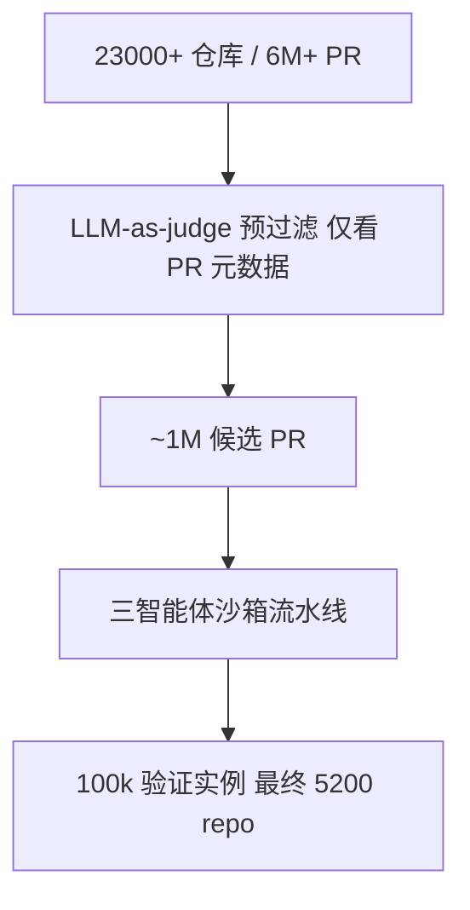
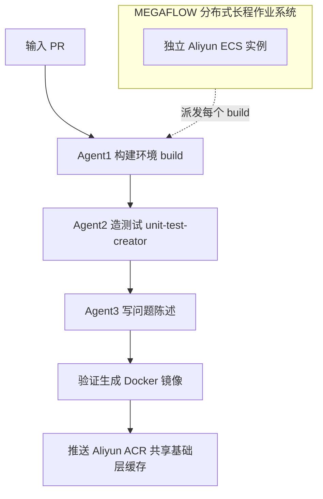
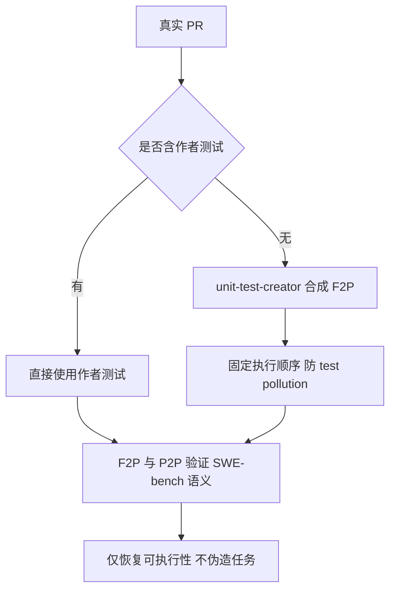
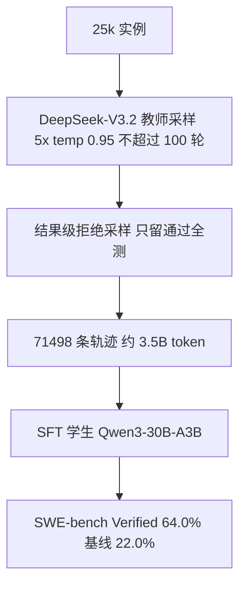
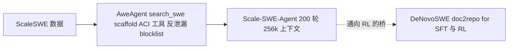

# Dispatch 14 · 详解 ScaleSWE:把 GitHub 宇宙挖成 SWE 训练数据

*Dispatch 14 · 2026-06-29 · 主题:真实 GitHub PR 的大规模挖掘、合成 F2P、蒸馏→SFT,以及它对 RL-on-NPU(昇腾)的意义。本文部分内部数字标注为 provisional——论文全文 PDF 与 HuggingFace 页面在撰写时被 403 拦截,仅公开对比数字经 web 核对。*

> **TL;DR** ScaleSWE(AweAI-Team)把整个 GitHub 当作可挖掘、可执行、可蒸馏的训练语料:从 **23k+ 仓库 / 6M+ PR** 漏斗式收敛到 **10 万验证实例**,在真实 PR 缺测试时**只合成 F2P 恢复可执行性、不伪造任务**,再用 DeepSeek-V3.2 蒸馏 + **纯 SFT(无 RL)** 把 Qwen3-30B-A3B 从 22.0% 拉到 **64.0%**(SWE-bench Verified)。它的下游 DeNovoSWE 是「通向 RL 的桥」。对昇腾 RL 而言,这 71k 条可执行轨迹是现成的冷启动语料。

> ⚠️ **订正说明**:ScaleSWE 是 **AweAI-Team 的训练数据项目**,与 **Scale AI 的 SWE-bench Pro 无关**,只是同名;早前看板曾把二者混淆,现已订正。本文讨论的 ScaleSWE 既不是一家公司,也不是一个评测基准,而是「数据 + 智能体」项目,核心贡献在「数据/蒸馏」这一侧。

---

## 一、是什么

ScaleSWE 容易被两个同名物误读:它**不是** Scale AI(名字撞车),也**不是**一个评测基准(benchmark)。它是一个 **SWE 训练数据 + 智能体** 项目,出自 AweAI-Team,论文为 *Immersion in the GitHub Universe: Scaling Coding Agents to Mastery*(arXiv 2602.09892)。

它要回答的核心问题是:SWE 智能体训练里最稀缺的资源,从来不是算力,而是「**既真实、又可大规模获取**」的任务。人工标注(如 SWE-bench)真实但量极小;纯合成(注入 bug、反向翻译)量大但分布失真。ScaleSWE 的赌注是——**高保真真实数据 > 海量合成数据**——并用一整条工程化流水线把这个赌注落地。

它的方法论可拆成三个递进部件,每一件解决数据流水线里的一个具体瓶颈:(1) 真实 PR 的大规模挖掘解决「真实性 vs 规模」的矛盾;(2) 合成 F2P 解决「真实 PR 缺测试」导致的可验证性缺口;(3) 蒸馏→SFT 解决「把数据变成能力」的最后一公里。下文逐一展开。

---

## 二、数据管线:从 23k 仓库到 10 万实例

ScaleSWE 直接从 **23,000+ 仓库 / 6M+ PR** 起步,做漏斗式筛选,最终收敛到 **10 万验证实例(provisional)**、来自最终 **5,200 个仓库(provisional)**。

> 图A:数据漏斗——从 23k 仓库逐级过滤到 10 万验证实例。

这条漏斗的设计有两处关键取舍:

- **预筛只看元数据、不跑代码。** 预过滤阶段的 LLM-as-a-judge 只读 PR 元数据(git diff + PR 描述 + merge-commit 信息),目的是把百万级筛选的成本压到「读 diff + 描述」这种轻量判断上——执行验证太贵,不可能对 6M PR 全做。这一步把 6M+ PR 收敛到 **~1M 候选**。
- **把昂贵的「可执行化」推迟到只剩 ~1M 候选时才做。** 真正烧钱的环境构建只在候选池上跑,由下面的三智能体流水线承担。

三智能体沙箱流水线是把「百万次真实环境构建」工程化的核心。每个阶段一个专职 agent,因为这三件事的失败模式互不相同(环境装不上 ≠ 测试写不出 ≠ issue 描述不清),分开才好定位与重试。

> 图B:三智能体沙箱流水线,由 MEGAFLOW 派发到独立阿里云 ECS。

三个 agent 依次是:(1) **环境构建**、(2) **单测创建(unit-test-creator)**、(3) **问题陈述合成**。整条流水线由 **MEGAFLOW**(分布式长程 agentic 作业系统)编排:每个构建派发到独立的 **Aliyun ECS** 实例,在沙箱 VM 里跑完整 build,产出验证过的 **Docker 镜像**后推到 **Aliyun ACR**,借 Docker 层缓存共享基础层来压缩存储。没有这套分布式编排,「百万次真实环境构建」在工程上不可行。

---

## 三、合成 F2P:只恢复可执行性,不伪造任务

大量真实 PR 修了 bug 却**没有附带可执行的复现测试**。没有 F2P(Fail-to-Pass)测试,就无法用 SWE-bench 语义自动判定补丁是否正确,这些 PR 会沦为「不可验证」的废料。ScaleSWE 用单测创建 agent,在 PR 缺测试时**合成可执行的 F2P 复现测试**——但只是「恢复可执行性」,issue 本身仍是真实 PR,任务并未被捏造。

> 图D:合成 F2P——仅在作者测试缺失时恢复可执行性,不伪造任务。

验证沿用 SWE-bench 语义:

- **F2P**:打金标补丁前**失败**、打补丁后**通过**;
- **P2P(Pass-to-Pass)**:前后都**通过**(回归保护);
- **执行顺序固定**,防止测试污染(test pollution)。

这正是 ScaleSWE 与两类纯合成路线的本质区别——它只在测试**缺失**时**恢复**任务的可执行性,而不像 **SWE-smith**(向代码注入合成 bug,任务是人造的)或 **R2E-Gym**(从代码反向翻译出任务,任务是反推的)那样**编造任务**。这是 ScaleSWE「高保真真实数据 > 海量合成数据」论点的技术地基。

---

## 四、蒸馏 → SFT:把数据变成能力

有了 10 万级可执行实例后,ScaleSWE 用**纯蒸馏 + SFT**(本论文不含 RL,RL 在后续 DeNovoSWE)把数据转成一个真正能解题的学生模型。

> 图C:蒸馏到 SFT——DeepSeek-V3.2 教师采样经拒绝采样后训练学生达 64%。

机制上,教师 **DeepSeek-V3.2** 在 25k 实例上每题采样 5 次(temperature 0.95,每条轨迹 ≤100 轮),再做**结果级拒绝采样**——只保留**最终提交通过全部测试**的轨迹。这是一个免费的质量阀门:只有真正解出题的轨迹才进训练集,无需过程标注。可执行环境在此既是数据生产的筛子,又是质量裁判。

**蒸馏采集参数表(部分 provisional):**

| 维度 | 取值 |
|---|---|
| 教师模型 | DeepSeek-V3.2 |
| 采集实例数 | 25,000 |
| 每题采样数 | 5 |
| 采样温度 | 0.95 |
| 每条轨迹最大轮数 | ≤ 100 turns |
| 过滤方式 | 结果级拒绝采样(仅保留最终提交通过全部测试者) |
| 产出轨迹 | **71,498** 条 *(prov.)* |
| 产出 token 量 | **~3.5B** tokens *(prov.)* |
| 学生模型 | Qwen3-30B-A3B-Instruct |
| 训练方式 | **SFT only(无 RL)** |
| SWE-bench Verified(蒸馏后) | **64.0%** *(prov.)* |
| SWE-bench Verified(基座) | **22.0%**(经核对,基座 Qwen3-30B-A3B 约 22.0%) |
| 提升 | **+42 个百分点** |
| 对照 | 超过当时开源 SOTA **KAT-Dev-32B(62.4%,经核对)** |
| 消融 | 同样的蒸馏+SFT 流程换到 SWE-Gym / SWE-smith 数据上更差 → 支持「真实高保真 > 海量合成」 |

发布物:**20k「Real-Executable」实例(Scale-SWE)** + **71,498 条蒸馏轨迹(Scale-SWE-Distilled)**。消融实验是这一节的论证支柱:把同样的蒸馏+SFT 流程换到 SWE-Gym / SWE-smith 数据上结果更差,直接支持「真实高保真 > 海量合成」的核心主张。

---

## 五、横向对比

下表把 ScaleSWE 放进 SWE 训练数据/RL 生态里横向对照。标 *(prov.)* 的是 ScaleSWE 内部数字(源于受限的论文/HF 访问,待全文确认);对比项的对外数字均已用公开来源核对。

| 项目 | 组织 | 任务来源 | 合成/恢复方式 | 训练法 | 可执行环境 | Verified 头条 |
|---|---|---|---|---|---|---|
| **ScaleSWE / Scale-SWE** | AweAI-Team | 真实 GitHub PR(23k repos/6M PR 漏斗) | **只恢复可执行性**:缺测试时合成 F2P,不造任务 | 蒸馏 + **SFT only** | ✅ Docker(MEGAFLOW/Aliyun ECS+ACR) | **64.0%**(基座 22.0%)*(prov.)* |
| **SWE-smith** | Princeton/SWE-bench 团队 | 合成 bug 注入 | **注入合成缺陷** | 数据集(供 SFT/RL) | ✅ 容器化 | 取决于使用方 |
| **SWE-Gym** | 学界 | 真实 GitHub issue,人配环境 | 真实环境,无大规模合成 | 训练环境(SFT/RL) | ✅ | 取决于使用方 |
| **R2E-Gym** | 学界 | 代码反向翻译出任务 | **back-translation 合成任务** | RL 环境 | ✅ | DeepSWE 的 RL 数据源 |
| **DeepSWE** | Together AI + Agentica | R2E-Gym 4,500 真实任务 | 用 R2E-Gym | **纯 RL(GRPO++)** on Qwen3-32B | ✅ | **42.2% Pass@1 / 59% w/ TTS**(经核对) |
| **Meta SWE-RL** | Meta | 开源软件演化(PR/issue 全生命周期) | 规则奖励(与金标相似度),非执行 | **纯 RL(GRPO)** on Llama3-70B | ❌ 规则奖励为主 | **41.0%**(Llama3-SWE-RL-70B,经核对) |
| **SWE-bench (Verified)** | Princeton/Stanford | 真实 GitHub issue,人工核验 | 无(是评测) | —(基准) | ✅ | 是「头条」本身的标尺 |

要点提炼:

- **ScaleSWE 是唯一「真实任务 + 只恢复可执行性 + 纯蒸馏 SFT」的组合。** 它在「真实性」轴上比 SWE-smith / R2E-Gym 更靠右(任务来自真实 PR),在「训练成本」轴上比 DeepSWE / Meta SWE-RL 更轻(离线 SFT 而非在线 RL)。
- **64.0% 的头条数高于同期纯 RL 路线。** DeepSWE 42.2% Pass@1(加 TTS 到 59%)、Meta SWE-RL-70B 41.0%——ScaleSWE 用更小的 30B-A3B 学生 + 纯 SFT 就越过它们,印证「数据保真度」对头条数的杠杆作用。当然这是不同评测设定下的并列,需谨慎类比。
- **RL 与 SFT 不是对立而是接力。** ScaleSWE 做 SFT 冷启动,DeNovoSWE 接 RL,见下节。

---

## 六、生态:ScaleSWE 在 AweAI-Team 工具链里的位置

ScaleSWE 不是孤立论文,而是 AweAI-Team 一整条工具链的「数据 + SFT」段。

> 图E:生态——ScaleSWE 数据经 AweAgent 训出 Agent,DeNovoSWE 作为通向 RL 的桥。

- **AweAgent**(`github.com/AweAI-Team/AweAgent`,Apache-2.0):底座 scaffold。Scale-SWE 跑在它的 `search_swe` scaffold 上,带 ACI 工具与一份**防泄漏 bash 黑名单**(anti-leak blocklist,防止 agent 直接 grep/cat 出金标补丁作弊);训练模式下对工具观测 token 做 `loss_mask=0` 屏蔽,产出 **token 级**轨迹。
- **Scale-SWE-Agent**(HuggingFace 模型):推理配置 **200 turns / 256k context**。
- **DeNovoSWE**(2026-06,`github.com/AweAI-Team/DeNovoSWE`,arXiv 2606.10728):**doc2repo**——从自然语言规格**生成整个仓库**;长程(500 turns)、4,818 实例,教师 DeepSeek-v4-Pro-High、基座 Qwen3.5-35B-A3B,在 BeyondSWE-Doc2Repo 上约 50%。

**DeNovoSWE 为何是「RL 桥」:**

1. **ScaleSWE 明确是 SFT-only**,把基座从 22% 拉到 64%——这是「冷启动」段。RL 需要一个已经能解出相当比例任务的策略起点,否则奖励信号过稀疏;ScaleSWE 正好把这个起点做出来。
2. **DeNovoSWE 把任务尺度从「改一个 PR」升级到「从文档造一整个 repo」**,500 turns 的长程结构天然适合 RL 的「稀疏、最终可验证」奖励形态;它在文档里也**明确写为「for SFT & RL」**。
3. 链条因此是:**ScaleSWE(真实数据 + SFT 冷启动) → DeNovoSWE(长程任务 + RL)**。ScaleSWE 提供策略与语料,DeNovoSWE 提供 RL 所需的「难、长、可验证」训练场。

---

## 七、对 RL-on-NPU(昇腾)的意义

把这条链放到国产 NPU(昇腾)语境,有三个直接价值:

1. **71k 条可执行轨迹 = 昇腾 SWE RL 的冷启动语料。**
   RL 在 NPU 上最怕「从随机策略起步、奖励全 0」。ScaleSWE 的 71,498 条**全部通过测试**的轨迹是现成的高质量 SFT 冷启动集——先在昇腾上把策略 SFT 到「能解题」,再进 RL,避免把算力烧在无效探索上。

2. **DeNovoSWE 的长程任务 = 昇腾推理/训练栈的压测。**
   500 turns、整仓生成对 KV-cache、长上下文(256k)、多轮 rollout 调度都是极限工况——正好用来压测昇腾的长序列推理与 agentic rollout 吞吐,暴露显存/调度瓶颈。

3. **蒸馏-SFT 算力轻,适合 NPU「先起步」。**
   相比纯 RL(需要大规模 rollout + 在线采样 + 奖励计算的复杂分布式编排),蒸馏+SFT 是离线、确定性、流水线友好的工作负载,对 NPU 训练栈的成熟度要求低得多。**先用 ScaleSWE 路线在昇腾上把 SWE Agent SFT 跑通跑稳,再过渡到 DeNovoSWE 式的 RL**,是一条算力与工程风险都可控的演进路径。

---

*免责声明:ScaleSWE/Scale-SWE 内部数字(100k/20k/71,498/3.5B/64%/5,200 repos 等)为 provisional,来源受 403 限制;对比项对外数字已用公开来源核对。*

**Sources(对比数字核对):**
- [KAT-Dev-32B = 62.4% Verified](https://kwaipilot.github.io/KAT-Coder/)
- [Qwen3-30B-A3B 基座 ~22.0%、Immersion in the GitHub Universe (arXiv 2602.09892)](https://arxiv.org/pdf/2602.09892)
- [Meta SWE-RL / Llama3-SWE-RL-70B = 41.0%](https://arxiv.org/abs/2502.18449)
- [DeepSWE = 42.2% Pass@1 / 59% w/ TTS (Qwen3-32B, RL, R2E-Gym)](https://www.together.ai/blog/deepswe)

> ⚠️ **Skywork-SWE 提醒**:涉及 Skywork-SWE 的数据规模与 Verified 头条数(如「数据缩放律」相关声明)目前尚未独立核对,请勿据本文将 Skywork-SWE 的数字与 ScaleSWE 直接并列比较;待其论文/数据卡可独立访问后再行确认。
