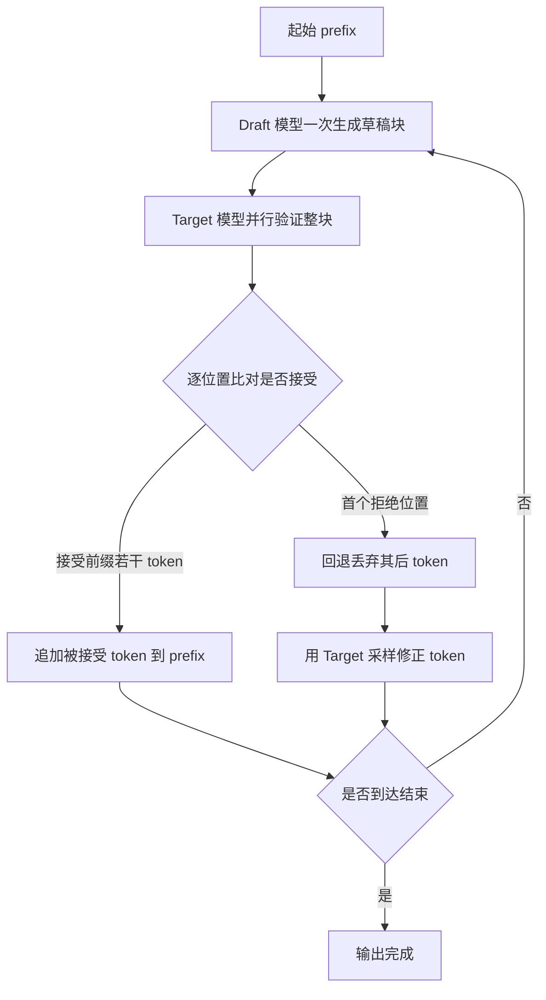
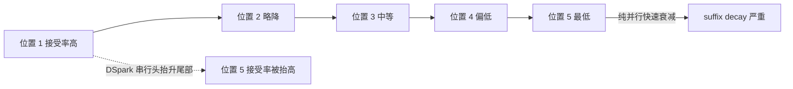
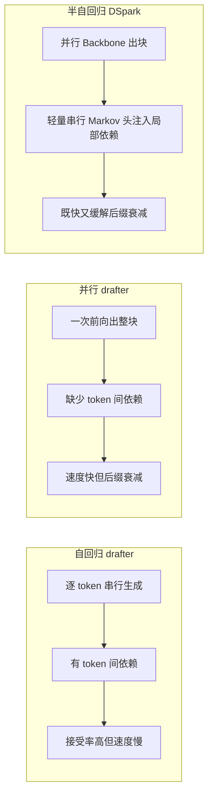
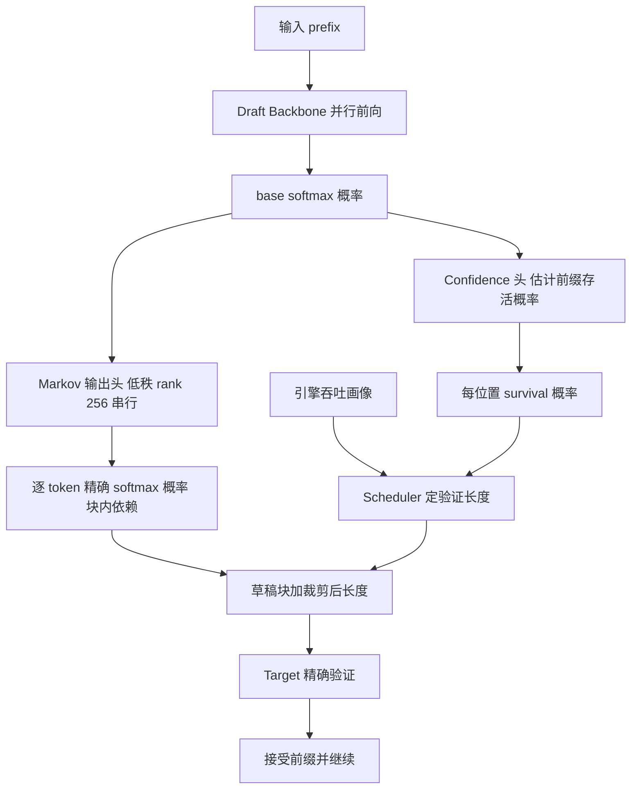
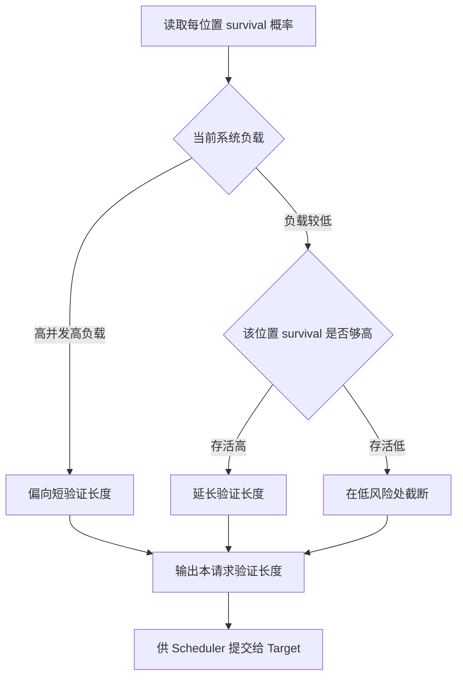

# Dispatch 15 · 详解 DSpark

*半自回归起草 + 置信度调度：把投机解码从「更快的草稿器」推进到「算法 × 系统」协同的负载感知推理框架。本文基于 DSpark 论文（北大 + DeepSeek-AI；一手为开源 DeepSpec 仓库内的 DSpark_paper.pdf —— 注意 arXiv 2606.19348 是 DeepSeek-V4 技术报告，并非 DSpark)与 DeepSpec 栈整理，线上数字均为 provisional（厂商/媒体口径，未经独立复现）。*

> **TL;DR**：DSpark 让 draft backbone 保持「一次前向并行出整块」的速度，再挂一个低秩（rank ≈ 256）串行 Markov 头补回块内 token 依赖，缓解并行起草器的「后缀衰减（suffix decay）」；同时用置信度头估计每个位置的「前缀存活概率」，结合引擎吞吐画像**逐请求动态裁剪验证长度**。关键是这个 Markov 头吐出的仍是**精确 softmax**，因此验证**无损**。结果：接受长度宏平均超 EAGLE3 约 +27%~+31%、超 DFlash 约 +16%~+18%；DeepSeek-V4 线上 per-user 提速 +60%~85%（Flash）/+57%~78%（Pro）；严格 SLA 下聚合吞吐增益最高 +661%（Flash 120 TPS）/+406%（Pro 50 TPS），「推移帕累托前沿」。

---

## 1. 背景与问题：投机解码 + 两个瓶颈

### 投机解码为什么是「无损」加速

想象你在听写一篇文章。一个**实习生**（draft 模型，小而快）先猜接下来几个词写在草稿上，然后**主编**（target 模型，大而准）一眼扫过去核对。主编的核对是「一次前向」并行完成的：它对草稿里每个位置同时算出「如果是我自己写，这里该是什么分布」。

关键在于核对规则——**接受/拒绝采样（rejection sampling）**：逐位置比较实习生给的概率和主编的真实概率。只要某位置主编「足够认可」，就接受；一旦在某个位置不认可，就在这里**回退（rollback）**，丢掉后面所有草稿，改由主编亲自落笔一个词。数学上可证明，这样产出的每个 token 的分布与「主编完全自己写」**逐位等价**。所以加速是无损的：省下的是主编的前向次数（一次核对放行多个 token），而不是质量。实习生猜得准只是省时间，猜错也绝不污染结果。

> 图 A：投机解码的基本循环——草稿块生成、目标模型并行验证、接受最长合法前缀或拒绝回退，然后继续。

### 瓶颈一：后缀衰减（suffix decay）

自回归实习生写草稿时，是「写一个看一个」：第 3 个词能看到自己刚写的第 1、2 个词。而**并行 drafter** 为了快，一次前向「同时」吐出一整块 5 个词——好比让 5 个人**背对背、互不通气**地各猜一个位置。

第 1 个位置只依赖已知前缀，猜得准；但第 4、第 5 个位置本该依赖「前面几个词到底填了啥」，可并行生成时它们**看不到彼此**，只能盲猜。于是块内越往后，缺失的 token 间依赖越多，接受率断崖式下跌——这就是后缀衰减。

> 图 E：后缀位置与接受率的衰减示意——并行 drafter 越往块尾接受率掉得越快，DSpark 的串行 Markov 头让尾部接受率更平缓。

### 瓶颈二：高并发下的验证浪费

你提交一个长草稿块，前面几个被接受，尾巴几乎必被拒，**白白占用了主编的核对算力**。在高并发服务里，这些注定被拒的尾 token 挤占了宝贵的 batch 容量，吞吐不升反降。传统投机解码对所有请求一刀切验证整块，无法感知「此刻系统是空闲还是满载」——这正是 DSpark 要解决的第二个瓶颈。

---

## 2. 概念详解

### 半自回归：并行 backbone + 轻量 Markov head

DSpark 的思路是「**大头保持并行，小尾补回依赖**」。重的 draft **backbone** 仍然一次前向并行算完（保住速度）；但在输出端**额外挂一个轻量的串行/马尔可夫头**（低秩，rank 约 256）。这个小头很便宜，作用是把「上一个 token 是什么」这一**局部转移信息**注入到下一个位置——相当于让那 5 个背对背的人之间，临时拉了一根细电话线，传一句「我刚填了 X」。局部依赖补回来了，后缀衰减就被缓解。

### 为什么这能保住「精确验证」

这个 Markov 头吐出的仍是**标准 softmax 的逐 token 概率**——每个位置有一个干净、归一化的条件分布，正好是接受/拒绝采样需要的输入。对比之下：

- **CRF-NAT** 用全局配分函数（partition function）建模整块联合概率，你拿不到干净的「单 token 条件概率」，无法套进逐位置无损验证；
- **CTC-drafter** 只能贪心解码，给不出可采样的概率分布。

DSpark 用一个「轻、串行、但仍是 softmax」的头，既补了依赖，又恰好落在无损验证可用的形式里。

> 图 B：三种 drafter 的对比——自回归串行慢但接受率稳；并行一次出块快但后缀接受率衰减；半自回归并行出块再加轻量串行头兼顾速度与依赖。

### 置信度调度：per-request 定验证长度

补回依赖后，尾 token 的接受率提升了但仍非铁板钉钉。DSpark 再加一个**置信度头**，估计每个位置的「**前缀存活概率**（prefix survival probability）」——即「草稿到这个位置为止整段还没被拒」的概率。这相当于实习生在每个词旁标注：「我对到这儿的整段把握有多大」。

光有置信度不够，还要结合**引擎吞吐画像**（engine-specific throughput profile）：同样验证 5 个 token，系统空闲时和高并发满载时的边际成本天差地别。DSpark 把「再多验一个 token 的存活收益」和「当前负载下多验一个的吞吐代价」放在一起权衡，**为每个请求动态裁剪验证长度**——负载轻就多放几个赌一把，负载重就保守只验高把握的前缀。出货配置 **DSpark-5** 用 5-token 块。这是**负载感知（load-aware）**的：不再对所有请求一刀切验证整块。

---

## 3. DSpark 架构

> 图 C：DSpark 架构——并行 Draft Backbone 给出 base 概率，Markov 头注入块内依赖且保持精确 softmax，Confidence 头估计存活概率，Scheduler 结合吞吐画像决定验证长度，最后送 Target 精确验证。

逐组件拆解：

- **Draft Backbone（并行）**：一次前向出整块草稿，给出 base softmax 概率。这是速度来源，也是天然 suffix decay 的来源。
- **Markov 输出头（低秩 rank ≈ 256，串行）**：在 base 概率之上注入「上一个 token → 下一个 token」的局部转移依赖，输出仍是**逐 token 精确 softmax**。低秩设计让它在大词表下依然廉价；它是缓解后缀衰减、又保住无损验证的核心。
- **Confidence 头**：从 base 概率估计每个位置的「前缀存活概率」，即整段草稿到该位置仍未被拒的概率。
- **Scheduler**：把每位置 survival 概率 × 引擎吞吐画像，逐请求决定**验证长度**（裁剪后的有效 block 长度），再把草稿块提交给 Target 做精确验证。

| 项目 | 值 | 意义 |
|---|---|---|
| Draft backbone | 全并行（一次前向出整块） | 快，但天然 suffix decay |
| 串行输出头 | 轻量 **Markov 头**，低秩 **rank ≈ 256** | 注入 intra-block 转移依赖，缓解 suffix decay；低秩使大词表下仍廉价 |
| 概率 | 逐 token **精确 softmax** | 支持精确（无损）验证（区别于 CRF-NAT 全局配分、CTC 只能 greedy） |
| Confidence head | 估 per-position 前缀存活概率 | 负载感知动态验证长度 |
| 出厂配置 | **DSpark-5**（5-token draft block） | 线上部署所用 block 长度 |

---

## 4. 置信度调度

补回依赖后，验证长度不再是固定超参，而是「按存活概率 × 当前负载」实时决定的旋钮。

> 图 D：置信度调度的决策流——存活概率高时延长验证长度；存活概率低或系统高负载时缩短验证长度以省下批容量。

这是「算法 × 系统」协同的本质：

- **算法侧**（半自回归头）决定草稿的「质量曲线」——块内每个位置的接受率长什么样；
- **系统侧**（吞吐画像）决定当前这一刻「核对一个 token 到底多贵」。

置信度调度是把这两条曲线**实时对齐**的旋钮：同一个 DSpark 模型，在空闲机器上和满载机器上会自发选择不同的验证长度，从而在**整个负载范围**上推动帕累托前沿。脱离系统负载谈草稿长度，或脱离草稿质量谈调度，都只能拿到局部最优；两者咬合，才有跨并发区间的稳定吞吐增益。

---

## 5. 效果与详细对比

> 以下数据为 paper / vendor 公布的 **provisional（暂定）** 数字，来源为 DSpark 论文(DeepSpec 仓库内 DSpark_paper.pdf)及多家技术媒体转述。凡未在公开来源中找到的细分数字，均标注「未公布」，不编造。

### 5.1 接受长度 Accepted Length（offline，macro-avg）

Target 模型为 Qwen3 系列三档。下表为相对两类基线 drafter 的平均接受长度提升。

| Target 模型 | vs **Eagle3**（自回归 drafter） | vs **DFlash**（并行 block drafter） |
|---|---|---|
| Qwen3-4B | **+30.9%** | **+16.3%** |
| Qwen3-8B | **+26.7%** | **+18.4%** |
| Qwen3-14B | **+30.0%** | **+18.3%** |
| **Macro-avg 区间** | **+26.7% ~ +30.9%** | **+16.3% ~ +18.4%** |

- 公开来源仅给上述百分比与区间，**未公布每个 benchmark（GSM8K / MATH500 等 9 项）的逐项接受长度绝对值**，也未公布接受长度的绝对 token 值（仅相对百分比）。
- 另含 **google/gemma-4-12B-it** 作为第四个 target 系列，但其相对 Eagle3/DFlash 的接受长度细分**未公布**。

### 5.2 线上单用户提速 vs MTP-1（DeepSeek-V4 LIVE，matched aggregate throughput）

基线为生产 **MTP-1**（Multi-Token-Prediction，1 token）。下表是「在保持聚合吞吐相同的前提下，单用户生成速度的提升」。

| 模型 | 单用户提速 vs MTP-1（matched throughput） |
|---|---|
| **DeepSeek-V4-Flash** | **+60% ~ +85%** |
| **DeepSeek-V4-Pro** | **+57% ~ +78%** |

### 5.3 严格 SLA 下的聚合吞吐增益

在「固定单用户速度下限（SLA）」时，比较的是**聚合吞吐**。SLA 越严，MTP-1 越接近其运行边界（只能撑很小的并发 batch），DSpark 的相对优势越夸张：

| 模型 | SLA（tok/s/user） | DSpark 聚合吞吐 vs MTP-1 |
|---|---|---|
| V4-Flash | 80 TPS（中等 SLA） | **+51%** |
| V4-Flash | **120 TPS（严格 SLA）** | **+661%（nominal）** |
| V4-Pro | 35 TPS（中等 SLA） | **+52%** |
| V4-Pro | **50 TPS（严格 SLA）** | **+406%（nominal）** |

「120 TPS Flash / 50 TPS Pro」即严格 SLA 行，对应 +661% / +406% 的 nominal 聚合吞吐——这正是「推移帕累托前沿」的量化体现。

### 5.4 吞吐：+51% ~ +400% by concurrency 的含义

| 并发 / SLA 区段 | 吞吐增益量级 | 解读 |
|---|---|---|
| 中等 SLA / 中等并发 | **~+51%~+52%** | MTP-1 仍有余量，DSpark 靠更长接受长度稳定多出约一半吞吐 |
| 严格 SLA / 高并发边界 | **趋向 +400%（乃至 +406%/+661% nominal）** | MTP-1 逼近运行边界、只能维持极小 batch；DSpark 按负载裁剪验证长度，避免在高拒绝风险 token 上浪费 batch 容量，相对增益放大数倍 |

「+51%~+400%」不是单一数字，而是**随并发/SLA 变化的一条曲线**：并发越高、SLA 越紧，增益越大。**未公布**：逐并发档位（batch=8/16/32…）的完整 TPS–延迟曲线与各点精确加速比，公开材料只给了上述 4 个 SLA 锚点。

### 5.5 开源 DeepSpec（全栈 speculative decoding）

| 项目 | 内容 |
|---|---|
| **仓库** | `deepseek-ai/DeepSpec`（GitHub），**MIT 许可** |
| **定位** | 全栈：数据准备工具 + draft 模型实现 + 训练代码 + 评测脚本 |
| **打包的 3 个 drafter** | **DSpark**、**DFlash**（并行 block）、**Eagle3**（自回归） |
| **Target 模型（4 个）** | Qwen3-4B、Qwen3-8B、Qwen3-14B、google/gemma-4-12B-it |
| **释出 checkpoint** | **12 个**（3 drafter × 4 target），托管于 Hugging Face |
| **9 个 benchmark** | GSM8K、MATH500、AIME25、HumanEval、MBPP、LiveCodeBench、MT-Bench、Alpaca、Arena-Hard-v2 |
| **硬件假设** | 默认脚本假定单节点 8 GPU |
| **数据准备开销** | 仅 Qwen3-4B target cache 约 **38 TB** |

benchmark 覆盖：数学推理（GSM8K / MATH500 / AIME25）、代码生成（HumanEval / MBPP / LiveCodeBench）、对话综合（MT-Bench / Alpaca / Arena-Hard-v2）。

---

## 6. 在投机解码谱系里的位置

投机解码的核心矛盾是**起草便宜 vs 验证接受率高**这对张力，演进可分三代：自回归起草器（EAGLE/MTP，依赖完整但起草慢）、并行/扩散块起草器（DFlash/PARD/DART，快但 suffix decay）、半自回归 + 负载感知调度（DSpark 所在层）。DSpark 不是「又一个更快的起草器」，而是把**起草质量**与**验证经济学**合并解决，面向**高并发线上服务**的吞吐/SLA 取舍。

> 数字标注：✅ 已核实（公开论文/官方）· ⚠️ provisional（厂商/媒体，未独立复现）。

| 方法 | 起草器类型 | token 间依赖 | 验证方式 | load-aware 调度 | 头条加速 / 接受长度 | 备注 |
|---|---|---|---|---|---|---|
| **EAGLE / EAGLE3** | 自回归 | ✅ 完整（串行） | 精确树验证（无损） | ❌ | ✅ 3.0–6.5×；接受长度 ~4.5–5（Llama-3.1-8B） | NeurIPS'25；须为每个目标模型单训草稿头 |
| **MTP / MTP-1** | 自回归（1 层 MTP 头） | ✅（串行） | 精确并行验证（无损） | ❌ | ⚠️ ~1.8× TPS；第二 token 接受率 ~80–90% | DeepSeek-V3 原生；DSpark 的**生产对照基线** |
| **DFlash** | 并行-扩散块 | ❌（块内独立） | 精确（无损，单轨迹） | ❌ | ⚠️ >6×；比 EAGLE3 高至 2.5× | 每层注入目标 KV/context；单轮只验一条轨迹 |
| **PARD** | 并行（Parallel Mask Predict） | ❌ | 精确/贪心（无损适配） | ❌ | ⚠️ 峰值 5.38×；+1.78× vs vanilla SD；Qwen2.5-7B ~381 tok/s（A100） | target-independent，适配成本低 |
| **DART** | 并行-扩散 + 树剪枝 | ⚠️ 弱（N-gram 强制连续） | 树（无损） | ❌ | ⚠️ 2.03–3.44× wall-clock；平均超 EAGLE3 ~30% | 扩散启发；树剪枝补块内连贯 |
| **DDTree** | 并行-扩散块 → 草稿树 | ❌（靠树挽回） | 树（祖先掩码，单前向，无损） | ❌ | ⚠️ 在 DFlash 上再提升，Qwen3-Coder-30B 至 8.22× | 单轨迹扩成多续写树；best-first heap 选树 |
| **JetSpec** | 并行-树（causal parallel tree） | ✅（分支级 causal） | 树（与目标 AR 对齐） | ❌ | ⚠️ MATH-500 至 9.64×、对话 4.58×；接受长度至 ~10×；1000+ tok/s（B200） | 一次前向出整棵树 + 块级 causal attention |
| **DSpark（DSpark-5）** | **半自回归**（并行 backbone + 低秩串行 Markov 头，rank ~256） | ✅（轻量串行头注入块内局部转移） | **精确 softmax 验证** | ✅（置信度头 × 引擎吞吐画像，逐请求裁剪） | ⚠️ 接受长度超 EAGLE3 +30.9/26.7/30.0%、超 DFlash +16.3/18.4/18.3%；V4 线上 per-user +60–85%(Flash)/+57–78%(Pro) | DeepSeek-V4 线上 vs MTP-1；严格 SLA 下推移 Pareto 前沿；开源 DeepSpec |

**DSpark 真正新颖之处：**

- **vs EAGLE3 / MTP（自回归阵营）**：它们靠串行换接受率，起草延迟随块长线性增长；DSpark 把重型 backbone 保持**完全并行**，只用一个低秩串行 Markov 头补回块内依赖——拿到接近自回归的接受率，却保留并行的起草速度。这层「半自回归」解耦 EAGLE/MTP 没有。
- **vs DFlash / PARD（并行/扩散块阵营）**：它们最大痛点是 suffix decay。DSpark 用串行头**正面修复衰减**（接受长度比 DFlash 再 +16–18%），而不是靠树搜索绕过。
- **vs DART / CRF-NAT / CTC 类**：这些为块内连贯往往牺牲验证精确性（CRF-NAT 需全局配分、CTC 只能贪心）。DSpark 每 token 概率仍是**精确 softmax**，支持精确无损验证——这是它能上 DeepSeek 生产线、保证输出分布不变的前提。
- **vs DDTree / JetSpec（草稿树阵营）**：树方法是**固定块长下加宽**（空间维度精打细算）；DSpark 走正交路线——**动态调块长**（时间/负载维度精打细算），二者可叠加。
- **load-aware 调度是全表唯一**：其余方法验证长度都是**静态超参**。DSpark 是唯一把**系统并发负载**喂进验证决策的，这正是它在严格 SLA 下推移 Pareto 前沿、且单请求 benchmark 看不出来的优势来源。
- **评测对照务实**：别家比 vanilla AR 报 6–9×；DSpark 直接对生产已很强的 MTP-1 报 +57–85% per-user，且强调**匹配聚合吞吐**——部署语义而非 demo 语义。

---

## 7. 对 RL-on-NPU 的意义

- **Rollout 是 decode-heavy 的**：RLHF / RLVR 训练里绝大部分算力花在 **rollout（从策略模型采样长序列）**，而采样就是逐 token 的 decode——memory-bandwidth bound、算力利用率极低，恰是投机解码的主场。给 rollout 提速 ≈ 直接给整个 RL 训练循环提速。接受长度（每次 target 前向「免费」吐出的 token 数）每提升一截，rollout 的 wall-clock 近似线性缩短；DSpark 缓解 suffix decay 意味着 block 尾部 token 也更可能被接受，长 block 不再「头重尾轻」。

- **高并发服务 = RL rollout server**：rollout 引擎同样是「一个策略权重 + 大量并发采样请求」。DSpark 这种**负载感知、按并发裁剪验证长度**的调度，直接对应 rollout server 在 batch 容量约束下最大化有效 token 产出——RL rollout 往往落在增益曲线的陡峭段，理论上能吃到接近上沿的收益。

- **NPU 上必须保 per-token 概率一致（align-probe）**：RL 的梯度依赖**采样分布与计分分布严格一致**（importance ratio、KL 约束、on-policy 假设都建立在此之上）。若起草器/验证改变了输出分布，采样到的 token 概率就和训练时算的不匹配，RL 会拿到**有偏的 advantage**，训练发散或被悄悄拉偏。DSpark 坚持**精确 softmax + 精确无损验证**在 NPU 场景尤为关键：NPU 的算子/量化路径本就易引入数值漂移，需要 **align-probe**（逐 token 对齐探针）校验起草、验证、训练三条路径的概率一致性。只有 DSpark/EAGLE/DFlash 这类**可证明无损**的方案能安全用于 RL rollout；贪心-only（CTC）或近似配分（CRF-NAT）会破坏 on-policy 一致性，不适合直接喂给 RL。

- **一句话**：投机解码把 RL 最贵的 decode-heavy rollout 提速，而能不能用取决于它**是否无损保持 per-token 概率**——DSpark 同时满足「快」（半自回归 + 负载感知调度）和「概率一致」（精确 softmax 验证）两个条件，因此既适合高并发线上服务，也适合 NPU 上的 RL rollout。

---

### Sources
- [MarkTechPost — DeepSeek Releases DSpark (60–85% over MTP-1)](https://www.marktechpost.com/2026/06/27/deepseek-releases-dspark-a-speculative-decoding-framework-that-accelerates-deepseek-v4-per-user-generation-60-85-over-mtp-1/) · [GitHub — deepseek-ai/DeepSpec](https://github.com/deepseek-ai/DeepSpec) · [Acing AI 解读](https://acingai.com/articles/deepseek-dspark-speculative-decoding) · [TechTimes](https://www.techtimes.com/articles/319236/20260628/deepseek-releases-dspark-speculative-decoding-makes-v4-85-percent-faster.htm) · [AI Weekly](https://aiweekly.co/alerts/deepseek-open-sources-deepspec-speculative-decoding-stack) · [explainx.ai guide](https://www.explainx.ai/blog/deepseek-dspark-v4-speculative-decoding-deepspec-guide-2026) · [Daniel Han (X)](https://x.com/danielhanchen/status/2070751700626076109) · [36Kr](https://eu.36kr.com/en/p/3871135542416645)
- 对手数字：[EAGLE3 arXiv 2503.01840](https://arxiv.org/html/2503.01840v1) / [SafeAILab/EAGLE](https://github.com/SafeAILab/EAGLE) · [DeepSeek-V3 报告](https://arxiv.org/pdf/2412.19437)（MTP）· [DFlash arXiv 2602.06036](https://arxiv.org/abs/2602.06036) / [LMSYS blog](https://www.lmsys.org/blog/2026-06-15-next-generation-speculative-decoding-dflash-v2/) · [PARD arXiv 2504.18583](https://arxiv.org/abs/2504.18583) · [DART arXiv 2601.19278](https://arxiv.org/abs/2601.19278) · [DDTree arXiv 2604.12989](https://arxiv.org/abs/2604.12989) · [JetSpec arXiv 2606.18394](https://arxiv.org/abs/2606.18394)
- *DSpark / DeepSpec 全部线上数字为厂商/媒体口径，provisional，未经独立复现；正式引用前应核对各论文表格与第三方复现。*
