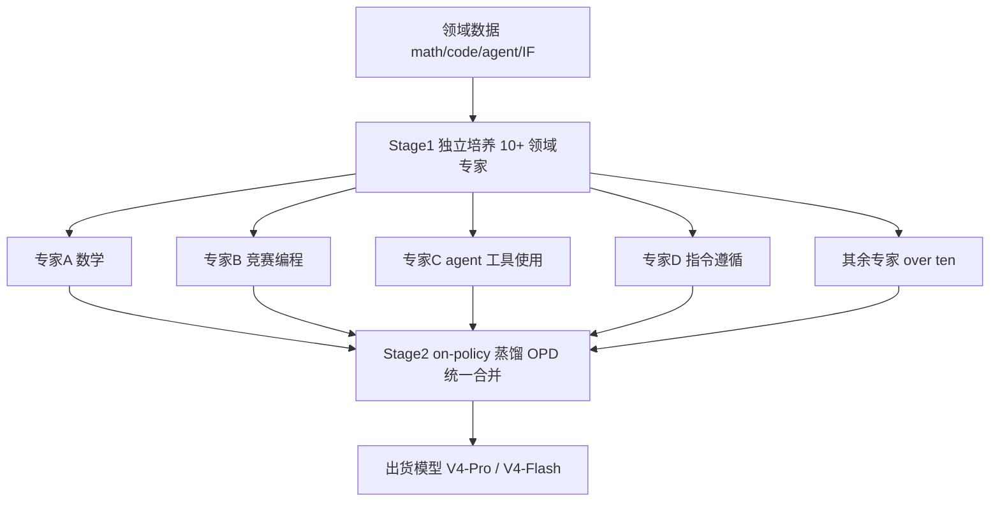
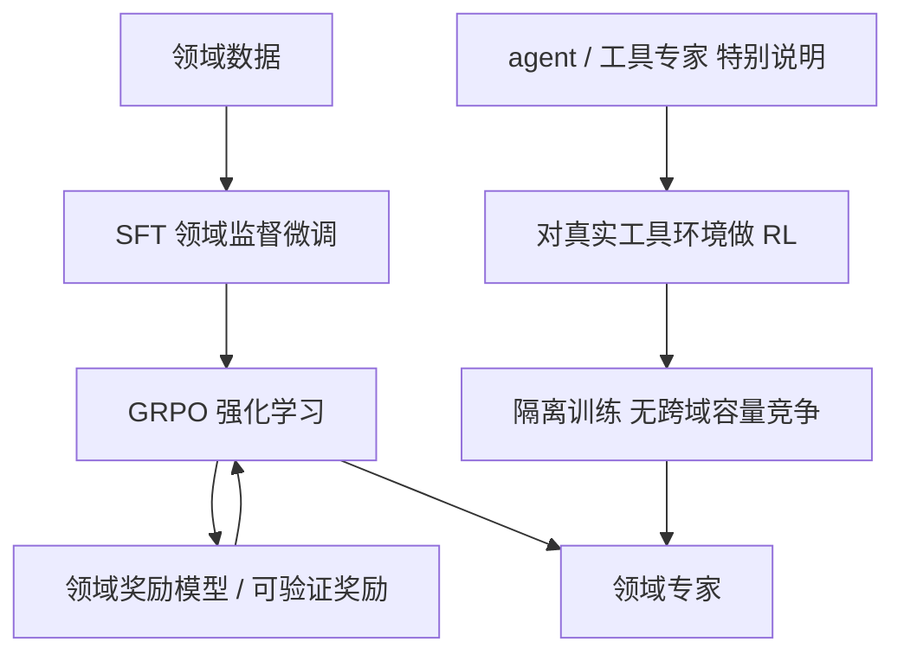
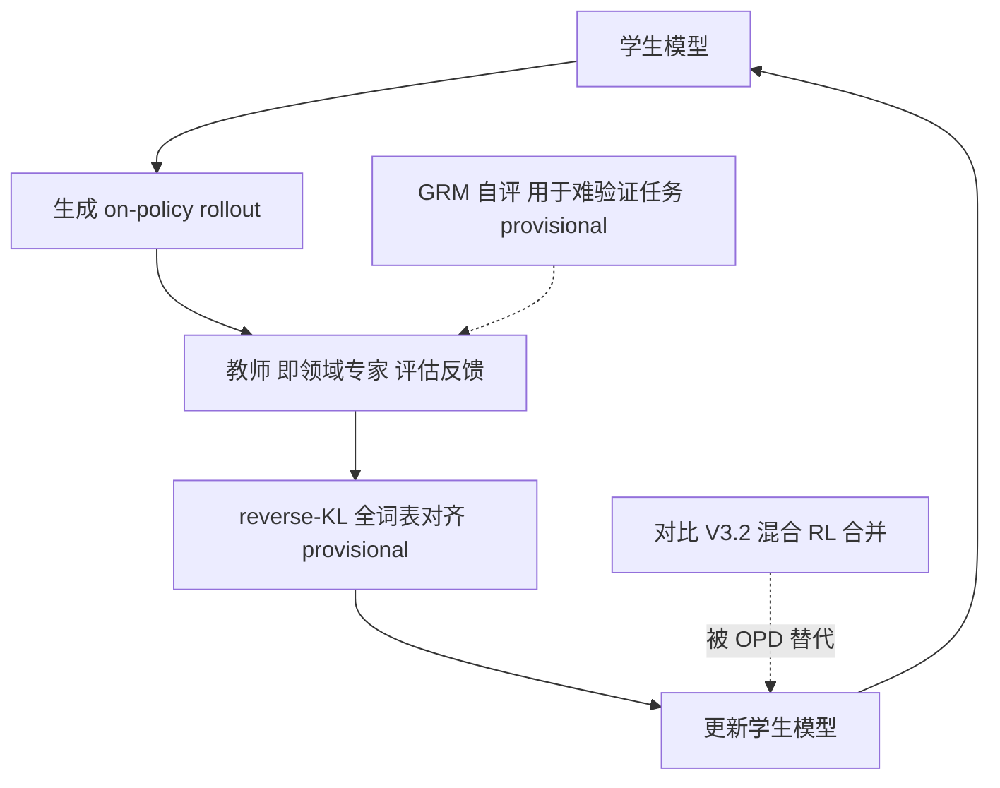
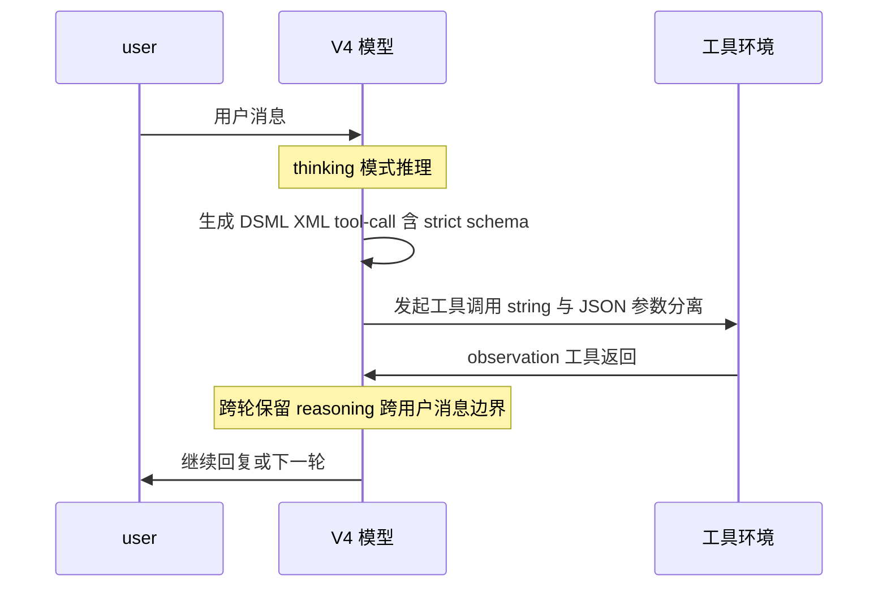
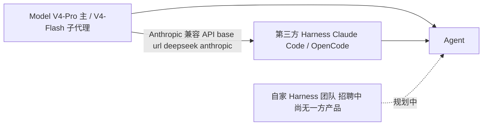

# Dispatch 16 · DeepSeek-V4 的 Agent 是怎么开发的:先分养专家,再蒸馏合一

*Dispatch 16 · 深入拆解 DeepSeek-V4 的 agent / 工具能力是怎么被"炼"出来的 —— 两阶段后训练、On-Policy Distillation、`|DSML|` 工具格式,以及它在 RL-on-NPU 上的意义。撰于 2026-06-29。*

> **TL;DR**:DeepSeek-V4 的 agent 能力核心不是某个单点 trick,而是一套**两阶段后训练**:Stage 1 把 10+ 个领域专家(数学、竞赛编程、**agent / 工具使用**、指令遵循……)**隔离地**各自 SFT → GRPO RL,其中工具专家在**真实工具环境**里做 RL;Stage 2 用 **On-Policy Distillation(OPD)** 把这些专家**无冲突地**合并进一个出货模型,取代 V3.2 的混合 RL 合并。工具侧靠 `|DSML|` + XML 格式、跨轮 reasoning 保留、strict-mode 降低调用失败率。**但所有 agent 跑分都是厂商自报、未独立复现的 provisional 数据**,且 BFCL / tau-bench 类经典工具基准**没有 V4 官方数字**,第一方 harness 也**尚未问世**。

> ⚠️ **sourcing / 信息分级说明**:本文严格区分三类信息。
> **【已按报道证实 / confirmed-as-reported】** = 来自官方技术报告(arXiv 2606.19348)、HF 模型卡 / 官方博客等一手来源所述(注:"按报道"指忠实复述一手来源,不等于已被独立复现)。
> **【暂定 / provisional】** = 二手、厂商自报或尚无独立复现的内容,文中显式标注。
> **【RUMOR】** = 仅为传言、无一手佐证。
> **本文所有 agent 跑分均为 provisional**。

---

## 1. 两阶段后训练:先分养专家,再蒸馏合一

**【Stage 1 / Stage 2 的存在与结构:已按报道证实;下面对"为什么"的机理解释属常识性原理 + 报道动机,具体内部权衡为 provisional】**

DeepSeek-V4 系列(**【已按报道证实】**):V4-Pro(1.6T MoE / ~49B active,1M 上下文,MIT 开放权重)与 V4-Flash(284B / ~13B active,1M 上下文,MIT)约于 2026-04-24 发布,技术报告为 arXiv **2606.19348**。它的 agent 能力来自一套两阶段后训练流程。

> 图 A:两阶段后训练总览 —— 先独立培养十余领域专家,再 on-policy 蒸馏合并成出货模型。



**为什么不直接联合多任务 RL?** 把数学、编程、agent、指令遵循塞进**同一次** RL 联合优化,会遇到三个结构性问题:**(1) 梯度互相打架**——数学要求严谨收敛、少废话,agent 要求多步探索、容忍中间失败、长程规划,同一组参数被相反方向的奖励拉扯,结果"门门通、门门松";**(2) 容量竞争**——被实际激活的子网络容量有限,回报高、好优化的领域会挤占容量,把难啃的 agent / 长程工具使用边缘化;**(3) 奖励尺度不匹配**——可验证任务(数学、单测)能给干净 0/1 奖励,难验证任务(工具用得"当不当"、长程任务"对不对")奖励噪声大,混训时噪声会污染干净信号或被其淹没。

> 图 B:Stage1 单专家训练 —— 领域数据 → SFT → GRPO RL → 专家;agent 专家对真实工具环境做 RL。



Stage 1 的解法是**把每个领域拆开单独养**:每个专家**独享全部容量**做自己的领域,不与他人抢参数。**【已按报道证实】** agent / 工具专家在**真实工具环境**里**隔离 RL**(no cross-domain capacity competition)——这对 agent 尤其关键,工具调用必须在真实环境里试错才学得到"何时该调、调完怎么读结果、失败怎么重试"。可验证任务用 **verifiable rewards / 领域奖励模型** + GRPO,信号干净;难验证任务**【provisional 二手】**据报道引入 **Generative Reward Model(GRM)**,让 actor 充当自己的裁判打分,缓解"没有现成验证器"的困境。

**Stage 2 怎么合并而不冲突?** 这正是 OPD 要解决的。**传统离线蒸馏**里老师在**老师自己的分布**上生成输出、学生去拟合,问题是学生推理时跑的是**自己的分布**,一旦偏移(exposure bias),学生在自己会犯错的状态上**从没被纠正过**,长程 agent 轨迹越跑越偏;而 10+ 专家风格各异,直接拟合容易合成"四不像"。

> 图 C:On-policy 蒸馏 OPD —— 学生自产 rollout,教师专家给反馈更新学生,替代 V3.2 混合 RL。



**【已按报道证实(机制)】** OPD 让**学生生成自己的 on-policy rollout**,再从**教师(专家)对这些学生自己输出的反馈**中学习——相当于"RL 的 on-policy 探索"+"蒸馏的密集 token 级监督"的结合体:学生像 RL 一样自己探索轨迹,但每步拿到的不是稀疏奖励,而是老师给的**密集分布级**纠正,既稳又信息量大,特别适合长程 agent 轨迹。**【provisional 二手】** 据报道 OPD 用**全词表上的 reverse-KL** 稳定合并:reverse-KL 是 mode-seeking(寻众数)的,促使学生在每种情境下**锁定一个专家的正确做法**而非把多专家平均成模糊混合,直接缓解"四不像";全词表对齐(而非只在采样到的 token)给出更密集、低方差的梯度。**【已按报道证实】** 它取代的是 V3.2 的**混合 RL 合并(mixed-RL consolidation)**。

---

## 2. 工具使用机制:`|DSML|` + XML、跨轮 reasoning、strict-mode

以下工具机制均为 **【已按报道证实】**(来自模型卡 / 报道所述)。

> 图 D:工具调用一轮 —— user → V4 思考与 XML 工具调用 → 工具执行 → observation → 跨轮保留 reasoning。



**跨轮 reasoning 保留(cross-turn reasoning retention)**:V4 在对话含工具调用时,把 reasoning(思考链)**跨用户消息边界保留**。典型 agent 循环是 `提问 → 思考 → 调工具 → 读结果 → 再思考 → 再调工具`,很多实现每轮都丢弃上一轮思考、每次从头重想"为什么在做这件事"。跨轮保留意味着模型在第 N 次工具调用时**仍记得最初的计划、已排除的假设、上一步为何失败**,这对长程多步任务是连贯规划与避免重复犯错的关键,也减少反复重建上下文的 token 浪费。

**`|DSML|` + XML 工具格式**:V4 引入一个 `|DSML|` 特殊 token，配合基于 XML 的工具调用格式,核心好处是**把"字符串参数"和"JSON 参数"分开表示**。传统 JSON-in-string 做法把整个调用塞进一个 JSON,参数值里若再含代码、引号、换行、JSON 片段就要**层层转义**(`\"`、`\\n`……),模型在长字符串里数转义层数极易出错,导致解析失败 / 工具调用废掉——这是 agent 实战最常见的低级失败之一。XML 格式下,**字符串参数**(如一大段代码 diff)可原样放进标签**不必转义**,只有真正需要结构化的部分才用 JSON,转义类失败显著减少。

| | JSON-in-string | V4 的 `\|DSML\|` + XML |
|---|---|---|
| 字符串参数(含代码/引号/换行) | 需多层转义,易错 | 标签内原样承载,基本免转义 |
| 结构化 JSON 参数 | 与字符串混在一个 JSON,边界模糊 | 字符串 vs JSON 显式分离 |
| 典型失败模式 | 转义层数错 → 解析失败 | 转义类失败大幅减少 |

**strict-mode function calling**:V4 支持严格模式函数调用,输出**严格遵循给定 JSON schema**(字段名、类型、必填项、枚举值),约束生成空间,使工具调用一定 schema-valid,下游可直接可靠解析执行,省去一层容错/纠错。此外 V4 同时提供 **Anthropic 兼容**与 **OpenAI 兼容**两套接口,以及 **thinking / non-thinking** 两种模式。

---

## 3. Agent 跑分对比

> ⚠️ **【全部 provisional】**:下表所有数字均为**厂商自报、无独立复现**,型号为 **V4-Pro-Max**;比较对象的数字同样为 provisional。空格 `—` 表示该对照模型在此基准上**没有可引用的 provisional 数字**,并非 0 分。

| 基准 | DeepSeek **V4-Pro-Max** | Opus-4.6-Max | GPT-5.4-xHigh | Gemini-3.1-Pro |
|---|---|---|---|---|
| SWE-bench Verified | **80.6** | 80.8 | — | 80.6 |
| Terminal-Bench 2.0 | **67.9** | — | 75.1 | — |
| MCPAtlas (Public) | **73.6** | 73.8 | — | — |
| Toolathlon | **51.8** | — | 54.6 | — |
| SWE-bench Pro | **55.4** | — | — | — |

**哪些基准没有 V4 数据(重要,避免被误导)**:

- ❗ **BFCL**:**没有 V4 数据**。
- ❗ **经典 tau-bench / tau2-bench**:**没有 V4 数据**。当前网上流传的 tau2 数字**其实是 V3.2 的**,不要当成 V4。
- ❗ **SWE-bench Multimodal**:V4 **未报告**。

一句话:V4-Pro-Max 在 SWE-bench Verified / MCPAtlas 上与 Opus-4.6-Max、Gemini-3.1-Pro **基本同档**,在 Terminal-Bench 2.0 / Toolathlon 上**落后于 GPT-5.4-xHigh**;但**这些全是自报数**,且 BFCL / tau-bench 类经典工具基准**没有 V4 官方数字**可比。

---

## 4. 还没自家 harness:现状与怎么用

**【已按报道证实】** DeepSeek **目前没有第一方的 agent harness 产品**。它把 agent 拆成 **Model + Harness = Agent**,并正在**招聘一个 "Harness team"**。也就是说,**V4 现在的定位是"作为模型 drop-in 进第三方 harness"**,而非自带 agent 应用。

> 图 E:现状 —— V4 模型 + 第三方 Harness 经 Anthropic 兼容 API 组成 Agent;自家 harness 在招聘中。



**怎么用**:**【已按报道证实】** 通过 **Anthropic 兼容端点**把 V4 当作 Claude 的替身接入现有 harness:

```bash
# 指向 DeepSeek 的 Anthropic 兼容端点
export ANTHROPIC_BASE_URL=https://api.deepseek.com/anthropic

# 主模型用 V4-Pro,子 agent(subagents)用 V4-Flash
#   deepseek-v4-pro    -> 主 / main
#   deepseek-v4-flash  -> 子 agent / subagents
```

官方提供 **Claude Code 与 OpenCode 的接入指南**。典型搭配是 `deepseek-v4-pro` 跑主循环(规划、关键决策)、`deepseek-v4-flash` 跑子 agent(并行子任务 / 检索 / 工具调用),兼顾能力与成本/延迟。提示:正因为没有自家 harness,**你的 agent 表现很大程度取决于所用 harness 的质量**(上下文管理、工具集、重试逻辑),上面的跑分也是在第三方 harness 下取得的 provisional 结果。

---

## 5. 从 MTP 到 DSpark:服务侧(连到 Dispatch 15)

**【已按报道证实】** 服务侧,V4 保留 **Multi-Token-Prediction(1 个 MTP head)** 做投机解码,作为 **MTP-1 baseline**。这条线的后继方案是 **DSpark**——也就是 **Dispatch 15** 展开讨论的那套更激进的投机/并行解码框架。换句话说,V4 出货时用的仍是相对保守的单 MTP head 投机解码,而 DSpark 是 DeepSeek 在 serving 侧的下一步演进方向;agent 场景对**低延迟、高吞吐**的需求(尤其是密集的工具调用往返与 rollout)正是 DSpark 这类方案要吃下的负载。读者若想了解 DSpark 的具体机制与收益,见 Dispatch 15。

---

## 6. 对 RL-on-NPU 的意义

agent 能力的炼成高度依赖 RL,而 RL 的 rollout 吞吐又高度依赖底层硬件与 kernel。这里要把"已证实"和"传言"分得很清。

**【已按报道证实】** V4 的 **Expert-Parallel(EP)方案在 NVIDIA GPU 与华为 Ascend NPU 上均验证过**——这是 EP 的**双平台验证**,意味着 V4 的 MoE 推理/服务并不绑死单一硬件栈。其 **fused MoE kernel** 在延迟敏感的 "**RL rollouts / 高速 agent serving**"(即 rollout / 推理侧)上声称 **1.96x** 加速。结合 Stage 1 中"agent 专家在真实工具环境里做 RL"的设定,这个 1.96x 直接关系到 agent RL 的迭代速度:rollout 越快,真实工具环境里的试错回合就越多、越便宜。

**【RUMOR,非一手证实】** "**V4 的 RL 训练跑在 Ascend 950PR 上**" 仅为传言。MindSpeed-RL / slime-ascend 这类昇腾 RL 训练栈确实存在,但**未确认**就是 V4 实际所用——EP 的双平台验证只覆盖到 rollout / serving 侧,**不能据此推断训练侧也在昇腾**。

### 结论与最大不确定性

DeepSeek-V4 的 agent 能力,关键在**两阶段后训练的工程哲学**:**先在隔离环境里把每个能力(尤其是真实工具环境里的 agent 能力)RL 到极致,再用 On-Policy Distillation 把十多位专家无冲突地合并进一个模型**;配合 `|DSML|` XML 工具格式、跨轮 reasoning 保留、strict-mode 这些**降低工具调用失败率**的机制,它在标准 agent 基准上做到了与第一梯队**同档(自报)**。

**最大的不确定性有三点**:**(1)** 所有 agent 跑分都是 **provisional**,且 BFCL / tau-bench 类经典工具基准**没有 V4 官方数据**——同档结论建立在自报数之上;**(2)** OPD 的 reverse-KL / 全词表细节与 GRM 自评机制属 **provisional 二手**,尚无独立复现;**(3)** RL 训练是否跑在昇腾 950PR 上是 **RUMOR**——已证实的只有 rollout/serving 侧 EP 的 GPU+NPU 双验证与 1.96x,训练侧硬件未确认。现在用 V4 跑 agent,本质仍是"把它当 Claude 接进别人的 harness"。

---

**Sources:** [DeepSeek-V4 技术报告 (arXiv 2606.19348)](https://arxiv.org/html/2606.19348v1) · [deepseek-ai/DeepSeek-V4-Pro · Hugging Face](https://huggingface.co/deepseek-ai/DeepSeek-V4-Pro) · [How DeepSeek V4's Two-Stage Post-Training Solves Multi-Domain Interference | BSWEN](https://docs.bswen.com/blog/2026-04-25-deepseek-v4-two-stage-post-training/) · [DeepSeek V4 Integrates Expert Models with On-Policy Distillation | Phemex News](https://phemex.com/news/article/deepseek-v4-adopts-onpolicy-distillation-integrates-expert-models-75479)
