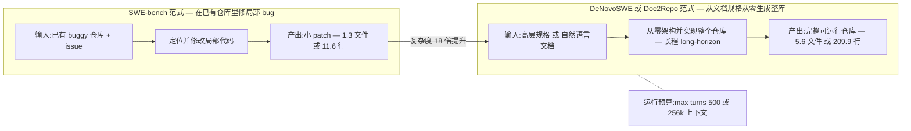
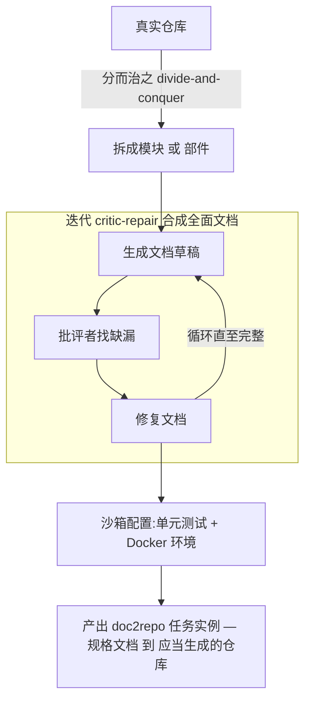
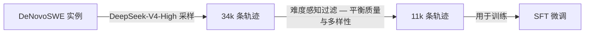
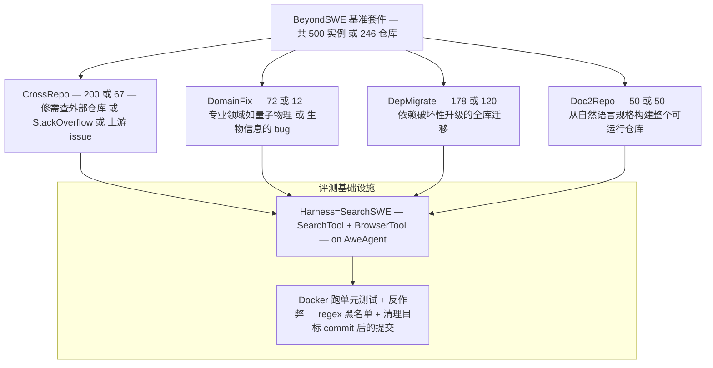
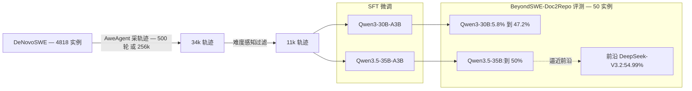

# Dispatch 17 · 详解 DeNovoSWE:从零生成整个代码仓库的长程环境

*2026-06-29 · NPU Frontier Dispatch · SWE / DeNovoSWE / long-horizon / RL-on-NPU*

> **TL;DR** — DeNovoSWE(AweAI-Team,arXiv 2606.10728,2026-06-09,CC BY 4.0)是 ScaleSWE(Dispatch 14)的范式升级:把代码 agent 的战场从"在已有仓库里修局部 bug"(SWE-bench 范式,每实例 1.3 文件/11.6 行)搬到 **doc2repo —— 从一份文档规格从零架构并实现整个仓库**(长程 long-horizon,每实例 5.6 文件/209.9 行,18× 复杂)。核心是一条**自动化沙箱数据流水线**:用**分而治之 + 迭代 critic-repair** 逆向合成"既完整又能唯一确定一个仓库"的文档规格,配单元测试 + Docker 当 ground truth,产出 **4818 个实例**(比现有仓库生成基准大一个数量级);再用 DeepSeek-V4-High 采 **34k 条轨迹、难度感知过滤到 11k** 做 SFT。效果(provisional):在 BeyondSWE-Doc2Repo 上把 Qwen3-30B-A3B 从 **5.8% 提到 47.2%**、Qwen3.5-35B-A3B 到 **50%**,逼近前沿闭源 DeepSeek-V3.2 的 54.99%。它明确 **for SFT & RL**,自带 RLVR 环境——对昇腾,doc2repo 的 500 轮/256k 长 rollout 正是把显存争用、长尾、训推一致放大到极致的负载。

承接 Dispatch 14(ScaleSWE,同团队的"修 bug"方向数据)。应要求把它的后续 **DeNovoSWE** 拆开深讲。所有跑分均**论文/厂商口径,provisional**,缺统一第三方复测。

---

## 1 · 从修 bug 到造仓库:范式为什么要转

过去三年,代码 agent 的能力评测几乎被 SWE-bench 范式定义:给定一个有 bug 的真实仓库、一条 issue 描述,模型要产出一个局部 patch,跑 fail-to-pass(F2P)测试通过即算解决。这个范式干净、可验证、贴近真实工程,但它有一个被长期低估的天花板——它本质上只考"在一个已经搭好的结构里改几行代码"。SWE-bench Verified 的实例平均只触及 **1.3 个文件、改动 11.6 行**。模型不需要做架构决策,不需要决定模块怎么拆、接口怎么定、依赖怎么组织,它要做的是"在既定骨架上做局部填空"。

这个高地已经基本被攻下:GPT-5.2、Gemini3Pro、DeepSeek-V3.2 在 SWE-bench Verified 上都已 >80%(provisional),逼近饱和,继续卷零点几个百分点边际信息量已经很低。**真正没被解决的是 long-horizon 那一类:从一份高层文档规格,从零架构并实现整个仓库(doc2repo)。** 这件事的难度不是线性叠加,而是结构性更高一档:**架构决策**(没有现成骨架,模块怎么切、目录怎么组织、抽象边界放哪里全要 agent 自己定,且一步错步步错)、**跨文件一致性**(几百行代码散落多文件,函数签名、数据结构、import 关系必须全局自洽,局部正确不等于整体能跑)、**超长交互**(从空目录到可通过测试的完整仓库,需几百轮工具调用、上下文逼近几十万 token,模型必须在超长 horizon 上保持目标不漂移、不中途放弃、不 reward hacking)。

DeNovoSWE 给出的对照数字直接点破了这个 gap:GPT-5.2 / Gemini3Pro / DeepSeek-V3.2 这些在 SWE-bench Verified 上 >80% 的前沿模型,在 BeyondSWE 整体上**全部 <45%**;即便是相对"最像传统建仓库"的 Doc2Repo 设定,前沿的 DeepSeek-V3.2 也只有 **54.99%**(均 provisional)。一个模型能改 bug 改到 80+,却造不出能通过测试的完整仓库——这说明"修 bug"和"造仓库"考的是两种不同的能力,后者才是下一个高地。DeNovoSWE 正是冲这个高地去的,是同团队 **ScaleSWE**(arXiv 2602.09892,Dispatch 14)的范式升级:ScaleSWE 走"修 bug"方向的大规模数据(6M PR 漏斗出 10 万实例 + 71k 蒸馏轨迹 SFT Qwen3-30B → 64% SWE-bench Verified),DeNovoSWE 把战场整体搬到"从文档规格从零造整个仓库"的长程方向,且从设计上就明确 **for SFT & RL**——不只是一个 benchmark,而是一套训练数据 + 环境。

## 2 · doc2repo 数据流水线:分而治之 + critic-repair 怎么造规格

doc2repo 这条任务线最反直觉的难点不在"训练",而在"造数据",而且是**反向造数据**。任务形式是"文档规格 → 仓库",要让它可训练、可评测,你需要的不只是一份文档,而是一份**既完整、又能唯一确定一个目标仓库**的文档规格:不能有缺漏(否则 agent 不知道要实现什么)、不能有歧义(否则正确实现不唯一、没法判分)、还得可实现(别写出做不到的需求)。问题是真实世界的仓库**几乎从不附带这种规格**——README 和注释是给人看的、残缺的、靠上下文脑补的,远达不到"喂给模型就能从零重建整个仓库"的精度。所以流水线要做的是:拿一个已有的、能跑的真实仓库当 ground truth,**逆向合成**出那份本不存在的、严丝合缝的文档。

DeNovoSWE 用一条**自动化沙箱流水线**干这件事,核心两招。**分而治之(divide-and-conquer)**:一个完整仓库整体合成文档复杂度爆炸、模型一次顾不过来、产出质量差,流水线把大仓库**拆成可管理的模块/部件**分别合成局部规格再组合,等于把一次"超高复杂度的整体规格生成"降维成若干次中等复杂度的局部生成,每一步都落在模型能稳定产出高质量结果的区间内。**迭代 critic-repair**:单次草稿必然有洞,流水线引入批评者(critic)闭环——**生成草稿 → critic 找缺漏/歧义/不可实现处 → 针对性修复 → 再批评**,循环直到文档完整到"足够可执行"(足够支撑一次从零重建),把"文档质量"从一次性赌运气变成可收敛的迭代优化。

最终每个实例打包成一套**可验证三件套:文档 + 单元测试 + Docker**——文档是输入,单元测试是判定"重建出来的仓库对不对"的 ground truth,Docker 保证执行环境可复现。正因为有这套测试 + 环境兜底,critic-repair 才不是"自说自话":文档是否真的能唯一确定那个仓库,最终可以用"按它实现、跑单测是否通过"客观验证。规模上 DeNovoSWE 造出 **4818 个实例**,比现有仓库生成基准大一个数量级以上(对照:NL2RepoBench 仅 104、BeyondSWE-Doc2Repo 仅 50)——对一个从零造整库的长程任务,这个量级才够支撑 SFT 乃至后续 RL。

## 3 · 难度感知轨迹过滤:34k → 11k 为什么这么筛

有了实例和环境,下一步是采集"怎么从空目录把仓库建出来"的解题轨迹喂给 SFT。DeNovoSWE 用 DeepSeek-V4-High 采了 **34k 条轨迹、过滤后只留 11k**——约 1/3 的留存率。为什么筛得这么狠?

关键认知是:**长程任务的轨迹,越多不等于越好,甚至可能越多越差。** doc2repo 的轨迹动辄几百轮、几十万 token,噪声来源远比短任务多:**中途放弃/走偏**(agent 在几百轮里很容易偏离目标、绕远路、堆无效操作,即使最后蒙对、过程也在教坏习惯)、**reward hacking**(长 horizon 给了钻空子的空间,这类轨迹"看起来解了"但学到的是作弊)、**质量参差**(temperature=1 下不同 rollout 的整洁度差别巨大)。全收进 SFT 会直接污染监督信号,把模型往放弃、绕路、作弊上带。所以过滤是**难度感知(difficulty-aware)**的,同时压两个维度:**质量**(留下真正解对、轨迹干净、没有明显放弃/hacking/冗余绕路的样本)与**多样性**(不能因为追求"干净"就只留简单实例——否则模型只学会做容易的、硬实例学不到,难度感知正是为在过滤时刻意保留足够比例的高难度样本)。34k → 11k 砍掉约 2/3,本身就说明长程轨迹里能用的是少数、大头是噪声;敢这么筛,反映的是"宁缺毋滥"——SFT 阶段干净、覆盖广的小数据,胜过又脏又偏的大数据。

和 ScaleSWE 的轨迹蒸馏思路对照:ScaleSWE 在修 bug 方向蒸了 71k 条轨迹(任务短、轨迹相对规整,蒸馏量可以更大);DeNovoSWE 面对几百轮的长程轨迹、单条噪声风险高一个数量级,所以策略从"多蒸"转向"狠筛 + 难度平衡"——这不是简单缩量,而是长程场景下数据策展(curation)逻辑的必然变化。采集用的 agent 是 **AweAgent**,配置 **max turns 500、max seq 256k、temperature 1**——这几个数字直接说明了这类任务的尺度,也是后面所有工程挑战的根源。

## 4 · BeyondSWE:DeNovoSWE 评测所在的基准套件

DeNovoSWE 的成绩报在 **BeyondSWE-Doc2Repo** 上,它是同团队 BeyondSWE 基准套件里的一个设定。BeyondSWE 共 **500 实例/246 仓库**,刻意把评测从"单仓库局部修复"扩到"全局解析 + 知识范围"两个维度,整体比 SWE-bench Verified 复杂约 **18×**(每实例 5.6 文件/209.9 行 vs 1.3 文件/11.6 行)。

四个设定各考一种"超出 SWE-bench"的能力:**CrossRepo**(200/67,修需查外部仓库/StackOverflow/上游库的 issue,考跨仓库取知识)、**DomainFix**(72/12,量子物理/生物信息这类专业领域的 bug,考领域知识)、**DepMigrate**(178/120,因依赖破坏性升级的全库迁移,考全局一致性)、**Doc2Repo**(50/50,从自然语言规格构建整个可运行仓库,考从零架构)。评测一律在 **Docker 里跑单元测试**,并带**反作弊**:用 regex 黑名单挡住 agent 访问目标仓库、并把目标 commit 之后的提交从环境里清掉,防止"背题"。Harness 是 **SearchSWE**(SearchTool 网页搜索 + BrowserTool 取网页内容),跑在 AweAgent 上。BeyondSWE 的意义在于:它用一套统一、抗作弊的口径证明了"前沿模型在 SWE-bench Verified >80%、在 BeyondSWE 整体 <45%"这条 gap 是真实存在的——而 DeNovoSWE 就是冲着补 Doc2Repo 这一格去的。

## 5 · 效果与定位(provisional)

以下数字均为 provisional(论文/厂商口径,缺统一第三方复测),Doc2Repo 设定仅 50 个实例、样本偏小,需独立复现后再下定论。

| 模型 | 设定 | BeyondSWE-Doc2Repo 通过率 |
|---|---|---|
| Qwen3-30B-A3B(基座,未训) | — | 5.8% |
| Qwen3-30B-A3B + DeNovoSWE SFT | SFT | **47.2%** |
| Qwen3.5-35B-A3B + DeNovoSWE 训练 | 训练 | **50%** |
| DeepSeek-V3.2(前沿闭源对照) | — | 54.99% |

三点解读:① **长程能力可以被数据蒸馏注入,而非只靠堆规模。** 一个 30–35B 量级的开源 MoE 小模型,经 DeNovoSWE 数据训练后在 Doc2Repo 上做到 47.2%–50%,已逼近前沿闭源大模型 DeepSeek-V3.2 的 54.99%——强烈暗示 doc2repo 这种长程能力的瓶颈不主要在参数量,而在**有没有见过对的数据**。② **+41.4 分的增量说明基座几乎不会 doc2repo,是数据教会的。** 基座 5.8% 几乎等于"基本不具备从零造整库的能力",SFT 后跳到 47.2%、涨了 41.4 个百分点,这个量级不是"激发已有能力"能解释的,而是这套数据**从无到有地教会**了模型长程架构 + 实现的整套打法;反过来说,前沿模型在 Doc2Repo 上只有 ~55%,不是因为天花板低,而是因为大家都缺这类训练数据,DeNovoSWE 把这块"数据缺口"补上了。③ **数字仍 provisional,且这只是起点。** Doc2Repo 仅 50 实例、统计噪声不可忽视,结论必须等独立复现;更重要的是 DeNovoSWE 从设计上就是 **for SFT & RL**——上面这些是 **SFT** 的结果,SFT 只是把基座拉到"会做",真正要逼近和超越前沿,下一步是在它提供的可验证环境上做 **RL**。SFT 是冷启动,RL 才是把长程能力推满的主战场。

## 6 · 对 RL-on-NPU 的意义

如果说一般的 agentic RL 已经把"长 rollout"作为核心难点,那 doc2repo 就是这个难点的**极端形态**。AweAgent 的 max turns 500 / max seq 256k 不是上限摆设,而是这类任务的常态尺度——单条 rollout 就是几百轮工具调用、上下文顶到 256k。把这种轨迹放到昇腾 NPU 上做 RL,等于把训练系统的几个老痛点(呼应 Dispatch 08/13)同时放大到极致:

- **显存争用**:256k 上下文的 KV cache 本身就吃显存,叠加 RL 训练态(梯度、optimizer state、actor/critic 共存)和长序列 attention,显存压力远超普通 SFT/短程 RL。
- **长尾**:一个 batch 里有的 rollout 几十轮就结束、有的拖满 500 轮,rollout 长度严重长尾,直接导致采样阶段算力空转、整批被最慢那条拖住,昇腾集群利用率会被打穿。
- **训推一致(align-probe 数值一致)**:超长序列上,训练侧和推理侧只要有一点数值漂移,累积几百轮后就会放大成行为偏差,长程场景对训推数值一致的要求比短程苛刻得多。

好消息是,DeNovoSWE **天然就是一套现成的 RLVR 环境**:每个实例自带 Docker 沙箱 + 可验证单元测试,reward 是"重建出的仓库跑单测是否通过"这种客观、可复现的信号,不需要额外训 reward model;再加上它明确 **for RL** 的定位,可以直接当作昇腾上 agentic RL 的**训练环境**——长程任务最缺的"可验证、可批量、可复现的环境",这里是齐的。但要真正跑起来,几块硬骨头绕不过去:**500 轮长轨迹的 KV/显存管理**(怎么在有限显存里塞下超长上下文的 rollout 与训练态)、**长尾截断策略**(截断/分段/提前终止怎么设才不丢有效信号又不被长尾拖死)、以及 **align-probe 层面的训推数值一致**(在昇腾算子和并行策略下保证几百轮后训练与推理仍不偏)。这些不是 DeNovoSWE 论文负责解决的问题,而是把它落到昇腾 RL 系统上时必须自己啃下来的工程。换个角度说,**DeNovoSWE 给出了"长程 agentic RL 该有的环境长什么样",而能不能在 NPU 上高效跑这套环境,才是真正的系统竞争力所在。**

## 7 · 下一步看什么

1. **DeNovoSWE 的 RL 结果**:目前公开的是 SFT;在它的 Docker+单测环境上做 GRPO/RLVR 能把 Doc2Repo 从 ~50% 推到多少,以及能否超过前沿闭源。
2. **独立复现 + 扩样本**:Doc2Repo 仅 50 实例,需第三方在统一 harness 下复测,并关注 BeyondSWE 其余三设定(CrossRepo/DomainFix/DepMigrate)是否同样受益。
3. **昇腾落地**:把 DeNovoSWE 当训练环境,在 910B/950 上跑通 500 轮/256k 的长程 agentic RL——KV/显存、长尾截断、训推一致是三块必须先解决的系统工程(接 Dispatch 02/03/13)。
4. **doc2repo vs 修 bug 的能力迁移**:在 DeNovoSWE 上训出的长程能力,是否反哺 SWE-bench/ScaleSWE 那类短程修 bug 任务。

---

*来源:DeNovoSWE(arXiv 2606.10728,AweAI-Team)与 GitHub `AweAI-Team/DeNovoSWE`、HuggingFace,BeyondSWE 基准(`AweAI-Team/BeyondSWE`)、AweAgent;承接本看板 Dispatch 14(ScaleSWE)。规格与跑分均论文/厂商口径,provisional,缺统一第三方复测;Doc2Repo 仅 50 实例,样本小,以官方一手发布与独立复现为准。*
