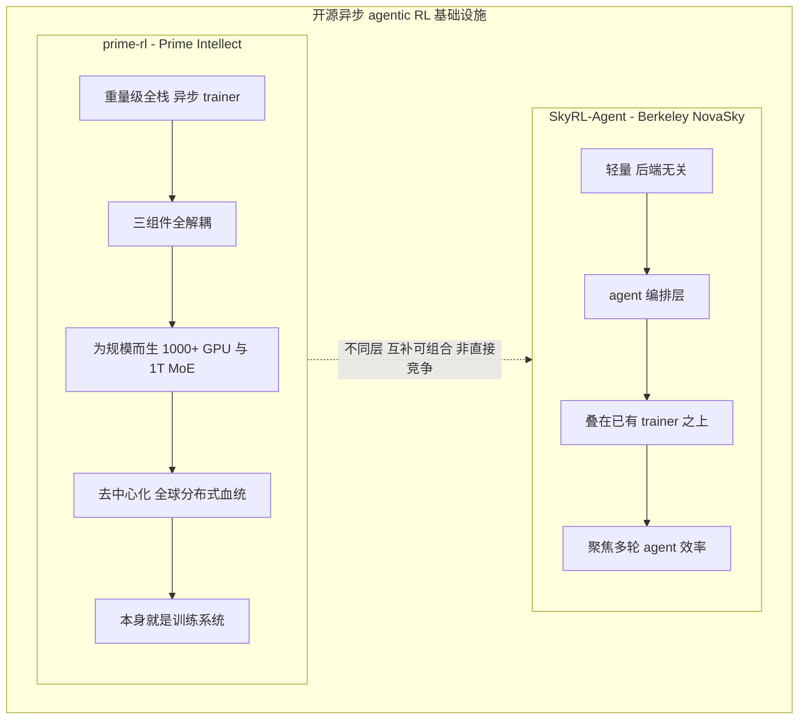
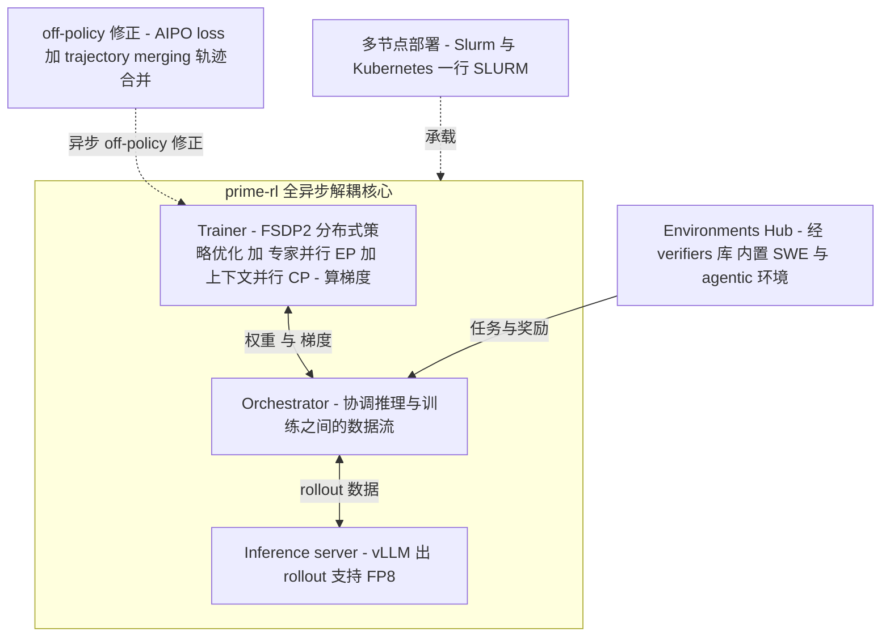
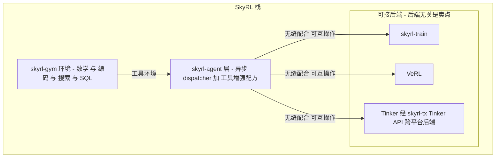
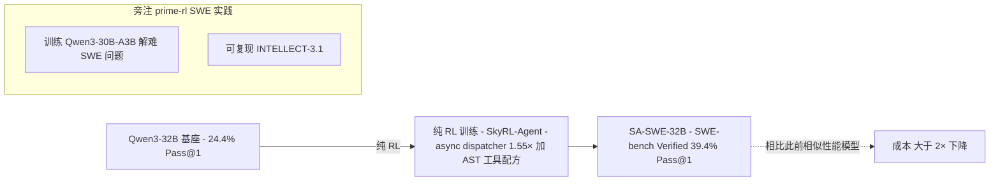
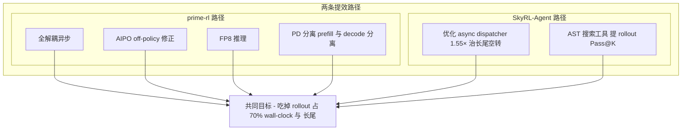

# Dispatch 18 · prime-rl vs SkyRL-Agent:两个开源异步 agentic RL 框架怎么选

*2026-06-29 · NPU Frontier Dispatch · RL-frameworks / async-RL / prime-rl / SkyRL / RL-on-NPU*

> **TL;DR** — 两个都开源(Apache-2.0)、都冲 Dispatch 02 那个"rollout 占 70% wall-clock + 长尾"瓶颈,但站在**不同层**。**prime-rl**(Prime Intellect)是**重量级、全栈、全解耦的异步训练系统本身**:Trainer(FSDP2+EP+CP)/ Inference(vLLM+FP8)/ Orchestrator 三组件各自独立伸缩,用 **AIPO loss + trajectory merging** 做 off-policy 修正,押注 **1000+ GPU / 1T+ MoE / 去中心化**(INTELLECT 血统,复现 INTELLECT-3.1)。**SkyRL-Agent**(Berkeley NovaSky,arXiv 2511.16108)是**轻量、后端无关的 agent 编排层**:不重造 trainer,叠在 **SkyRL-train / VeRL / Tinker** 之上,靠两招提效——**异步 dispatcher 比朴素异步批处理 1.55×**(细粒度 per-trajectory 调度治长尾)+ **AST 搜索工具配方**(提 rollout Pass@K → 喂强 GRPO 组内对比信号),把 **SA-SWE-32B** 从 Qwen3-32B 的 24.4% 纯 RL 训到 SWE-bench Verified **39.4% Pass@1**、成本 **>2× 下降**。一句话:**prime-rl 改发动机(为规模),SkyRL-Agent 改变速箱(为效率),互补可组合、不是二选一。** 数字均 provisional(论文/仓库口径)。

应要求把这两个常被并列提及、其实层次不同的开源 RL 框架拆开对比。承接本看板 Dispatch 02(rollout 瓶颈)、08(agentic RL 长 rollout)、12(SWE agentic RL 上手)。

---

## 1 · 又见异步:两家在解同一道题,但站在不同层

接 Dispatch 02(rollout 占整轮 wall-clock 约 70%、且被长尾轨迹拖累)与 Dispatch 08(agentic RL 的多轮长程 rollout 让长尾更夸张):所谓"高效 agentic RL"绕来绕去,核心矛盾仍是同一个——**生成阶段(rollout)太慢、太不均匀,把训练算力晾在一边**。一旦 agent 要多轮调工具、跑测试、读代码库,单条轨迹长度从几百 token 膨胀到几万 token,batch 内最长那条决定整批何时结束,同步范式下这就是结构性算力浪费。

prime-rl 与 SkyRL-Agent 都直冲这个瓶颈,但站位不同,不该放进同一格里比:

- **prime-rl(Prime Intellect)** 是一套**重量级、全栈、全解耦的异步训练系统本身**——它不是叠在别人 trainer 上的插件,它就是 trainer:自带分布式策略优化、自带推理服务、自带数据流编排,赌注押在规模(1000+ GPU、1T+ MoE)和去中心化(INTELLECT 血统)上。
- **SkyRL-Agent(Berkeley NovaSky)** 是一层**轻量、后端无关的 agent 编排层**——刻意不重造 trainer,叠在已有的 SkyRL-train / VeRL / Tinker 之上,只专注把多轮 agent 的 rollout 效率与训练配方做好。

一句话:prime-rl 解决"如何把异步 RL 扩到地球级算力",SkyRL-Agent 解决"如何在你已有的栈上,让多轮 agent 训得更快更省"。两者都瞄准 rollout 瓶颈,但**一个改发动机,一个改变速箱**。

## 2 · prime-rl:为规模而生的全解耦异步训练系统

prime-rl 口号 *Async RL Training at Scale*,Apache-2.0,定位"易用、可 hack,同时能扩到 1000+ GPU、支持 1T+ MoE"。骨架是**三个完全解耦、各自独立伸缩的组件**:

- **Trainer**:基于 FSDP2 的分布式策略优化,叠加专家并行(EP,服务 MoE)与上下文并行(CP,服务长上下文/长 agent 轨迹)——真正吃梯度、更新权重的部分。
- **Inference server**:用 vLLM 产出 rollout、跑 FP8 推理——吃 rollout 算力的部分,可独立横向扩。
- **Orchestrator**:协调推理与训练之间的数据流——决定哪些 rollout 喂给 trainer、何时同步权重、如何衔接两侧节奏。

**为什么"全异步解耦"必须配 off-policy 修正。** 解耦的代价是:trainer 在更新权重的同时,inference server 还在用**稍旧的策略**继续产 rollout,等这批样本回到 trainer 它已经不是当前策略生成的了——这正是 Dispatch 02 的 staleness 问题。off-policy 数据直接当 on-policy 用,梯度有偏、训练会塌。prime-rl 的解法是 **AIPO loss + trajectory merging**:AIPO(异步重要性策略优化一类的 loss)在目标里做重要性修正,把"行为策略 vs 当前策略"的偏差补回来(机理同 Dispatch 02 的 TIS/MIS 这条 importance-sampling 修正脉络);trajectory merging 把跨步骤、跨时刻产出的轨迹片段拼接对齐,让异步流水线产出的零散数据能被一致消费。没有这套修正,"全异步"就只是"全跑偏"。

**怎么把 rollout 成本压下去。** rollout 既是瓶颈也是大头开销,prime-rl 在推理侧堆了几样:**FP8 推理**(吞吐翻倍、显存减半)、**PD 分离**(prefill 与 decode 拆开调度各自打满,避免长 prompt 的 prefill 阻塞 decode)、以及 **flash-attention / quack-kernels** 等自定义核——合起来直接降单位 token 的 rollout 成本,正面回应"rollout 占 70%"的账。**环境即插即用**:原生集成 **Environments Hub(经 verifiers 库)**,内置 SWE 与 agentic 环境,要训新任务从 Hub 拉一个即可,其 SWE 示例就是训 **Qwen3-30B-A3B**(MoE);多节点支持 Slurm/K8s、号称一行 SLURM 部署,E2E 打通 SFT/RL/评测,支持多模态 VLM(Qwen3-VL)。**它的赌注**:1000+ GPU、1T+ MoE、去中心化全球分布式训练——血统直接来自 INTELLECT 系列(INTELLECT-2 是 32B 的全球分布式 RL),目标复现 INTELLECT-3.1。别家在单集群里优化,它在赌"算力可以是全球散落、异步拼起来的"。(规格均 provisional。)

## 3 · SkyRL-Agent:后端无关的 agent 层 + 两招提效

SkyRL-Agent(arXiv 2511.16108,2025-11-20,Apache-2.0)是 SkyRL 栈里的 **agent 层**,定位"高效的多轮/长程 agent 训练 + 评测"。SkyRL 栈分工清晰:`skyrl-train`(训练后端)、`skyrl-gym`(数学/编码/搜索/SQL 等环境)、`skyrl-agent`(本文主角,agent 层)、`skyrl-tx`(把 Tinker API 接进来的适配层)。

**为什么"后端无关"是关键设计。** SkyRL-Agent 刻意**不重造 trainer**,而是与训练后端解耦,可互操作 **SkyRL-train / VeRL / Tinker**(Tinker 经 skyrl-tx 接入)。对团队很实在:你可能已在 VeRL 上有整套 pipeline,或只想用 Tinker 的托管 API 起步——SkyRL-Agent 让你保留既有训练栈,只把 agent 编排与 rollout 调度这层换成它,不必为了"试一下高效 agent 训练"去绑死某个重量级栈。这与 prime-rl"我即是栈"的哲学完全相反,各有取舍。

它的提效靠**两招**。**① 优化异步流水线 dispatcher,比朴素异步批处理 1.55× 加速**:朴素异步批处理仍以"批"为单位调度——一批 rollout 里只要有一条长尾轨迹(多轮调工具、反复跑测试),整批就被它拖住、其余算力空转等它(正是 Dispatch 08 的长尾痛点);SkyRL-Agent 的 dispatcher 做**更细粒度的 per-trajectory 调度**,谁先跑完谁先交、空出来的算力立刻接下一条新轨迹,而不死等最慢那条,把"等最慢"换成"快的先走",在长程多轮场景下挤出 1.55× 端到端加速。**② 工具增强训练配方:AST-based 搜索工具**——这招的因果链值得讲清(不是"加个工具更好用"那么简单):给 agent 一个 **AST(抽象语法树)层面的代码搜索工具**,让它能按符号/结构导航代码库而非瞎 grep → 更好的代码导航让 agent **更可能真把题解对**,直接体现为 **rollout 的 Pass@K 提升** → Pass@K 提升意味着**同一组 rollout 里有效正样本变多** → 而 GRPO 这类**组内相对优势(group-relative advantage)**算法,信号强弱恰恰取决于组内有没有"对 vs 错"的对比(全错则优势退化、梯度近乎为零),正样本变多 → 组内对比信号更强 → **训练更快更稳**。所以"提工具"和"提训练效率"之间有硬因果:工具抬高正样本密度,正样本密度喂饱 GRPO 的对比信号。

结果是 **SA-SWE-32B**:从 Qwen3-32B 基座(SWE-bench Verified **24.4% Pass@1**)经**纯 RL** 训到 **39.4% Pass@1**,且达到此前相似性能模型的成本下降 **>2×**(均 provisional)。

## 4 · 对比与定位:互补,不是二选一

两条提效路径其实都在打同一个敌人——rollout 占 70% + 长尾:

| 维度 | prime-rl | SkyRL-Agent |
|---|---|---|
| 定位层次 | 重量级全栈异步**训练系统**(自身即 trainer) | 轻量**后端无关 agent 层**(叠在已有 trainer 上) |
| 核心卖点 | Async RL at Scale,1000+ GPU / 1T+ MoE / 去中心化 | 多轮长程 agent 效率,1.55× dispatcher + 工具配方 |
| 解耦方式 | 三组件全解耦(Trainer / Inference / Orchestrator)各自伸缩 | 与训练后端解耦,agent 编排层可插拔 |
| off-policy 修正 | AIPO loss + trajectory merging | 依赖所选后端(本身聚焦调度而非 loss 修正) |
| FP8 | vLLM FP8 推理(原生) | 取决于后端 |
| 后端 | 自带(FSDP2 + vLLM,自成一栈) | 后端无关:SkyRL-train / VeRL / Tinker(经 skyrl-tx) |
| 规模目标 | 全球分布式、千卡、万亿参 MoE | 高效起步,单/多节点,聚焦效率而非极限规模 |
| 代表产出 | 复现 INTELLECT-3.1;SWE 示例训 Qwen3-30B-A3B | SA-SWE-32B(24.4→39.4% SWE-bench Verified) |
| 许可 | Apache-2.0 | Apache-2.0 |

**它们其实可以组合,而不是对立。** SkyRL-Agent 的 agent 层理念(per-trajectory 细粒度调度 + 工具增强配方)与 prime-rl 的规模化异步 trainer 并不冲突——一个管"agent 怎么编排得高效",一个管"训练怎么扩得够大",理想形态是把前者的 agent 编排思路接到后者这种规模 trainer 上。**怎么选看诉求**:要规模/去中心化/1T MoE → 选 prime-rl;要轻量起步、不想绑死后端、主攻多轮 agent 效率 → 选 SkyRL-Agent。

**一个数字对照(均 provisional)。** 两家都用 Qwen3-32B 量级做 SWE-bench Verified:SkyRL-Agent 的 SA-SWE-32B 纯 RL 把 24.4% 抬到 **39.4% Pass@1**;对照 Dispatch 12 提到的 **DeepSWE 的 42.2%**。可见**开源纯 RL 的 SWE agent 正集中在 40% 一带卷**——既说明该范式已被多家独立验证,也说明天花板还没被任何一家明显甩开。

## 5 · 对 RL-on-NPU 的意义

把这两家放回昇腾(MindSpeed-RL + vLLM-Ascend)的语境,各自都有可直接照搬的镜鉴(接 Dispatch 02/03/13)。

**prime-rl 是 GPU 侧的"标准模板",几乎逐条对得上 NPU 待办:**

- **三组件全解耦(Trainer / Inference / Orchestrator)** —— 正是 MindSpeed-RL 该照搬的架构:把训练与推理拆成可独立伸缩的服务,而非塞在一个进程里同步跑。
- **AIPO off-policy 修正 ≈ staleness 修正** —— 只要走异步,昇腾侧同样吃 staleness,同样需要 importance-sampling 类的 loss 修正(对应 Dispatch 02 的 TIS/MIS),这是异步的"过路费",绕不开。
- **FP8 vLLM 推理 ≈ 昇腾 950 的原生 FP8** —— 硬件已经给了 FP8(Dispatch 03),推理栈(vLLM-Ascend)就该把 FP8 rollout 这条路打通,把 rollout 成本压到与 GPU 侧可比。

**SkyRL-Agent 的两招对 NPU 更"即取即用":**

- **后端无关的 dispatcher** 原则上能挂一个 Ascend 后端——它本就不绑训练栈,接 NPU 后端是架构允许的方向。
- **AST 工具配方是硬件无关的**,纯属 rollout 阶段的环境/工具逻辑,可直接移植,不涉及算子。
- **1.55× 的 per-trajectory dispatcher 恰好打在昇腾最痛的点上**:GPU 侧有 sleep-mode 能在长尾等待时让闲置卡休眠/复用,昇腾当前缺这一手段、长尾空转代价更重——细粒度调度"让快的先走"正是缓解这一痛点的低成本招法。

**但有两道硬关卡。** FP8 与异步在 NPU 上要落地,**算子需要重写**,且必须用 **align-probe 验证训推一致**——否则 FP8 推理出的 logits 与训练侧不一致,叠加异步 staleness,off-policy 修正会建立在错误的概率比上、训练直接跑偏。换言之:**架构思路可以照搬,数值正确性必须在 NPU 上重新挣回来。**

## 6 · 下一步看什么

1. **AIPO vs 各家 off-policy 修正**:prime-rl 的 AIPO 与 Dispatch 02 的 GAC/staleness 上界/Periodic Asynchrony、以及 Miles 的训推一致(Dispatch 09)在异步稳定性上谁更稳。
2. **SkyRL-Agent dispatcher 接 Ascend 后端**:后端无关到底能不能一行换到 NPU,以及 1.55× 在 vLLM-Ascend 上还剩多少。
3. **去中心化 RL 的真实可达性**:prime-rl/INTELLECT 的全球分布式异步训练,通信与 staleness 在跨地域延迟下是否还稳。
4. **开源纯 RL SWE agent 的天花板**:SA-SWE-32B 39.4% / DeepSWE 42.2% 这条 40% 带,叠加 ScaleSWE/DeNovoSWE 的数据(Dispatch 14/17)能不能突破。

---

*来源:prime-rl(GitHub `PrimeIntellect-ai/prime-rl`,Apache-2.0)、SkyRL-Agent(arXiv 2511.16108,GitHub `NovaSky-AI/SkyRL`,Apache-2.0);承接本看板 Dispatch 02/03/08/09/12/13。规格与跑分均论文/仓库口径,provisional,缺统一第三方复测,以官方一手发布与独立复现为准。*
