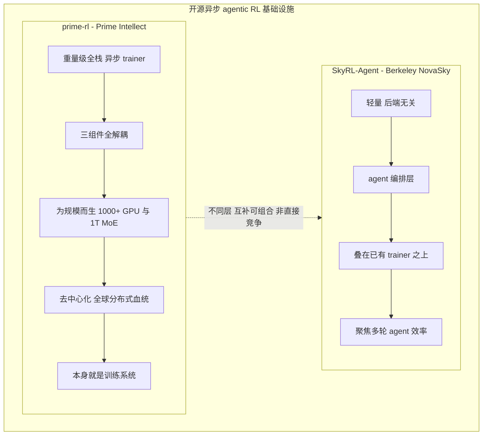
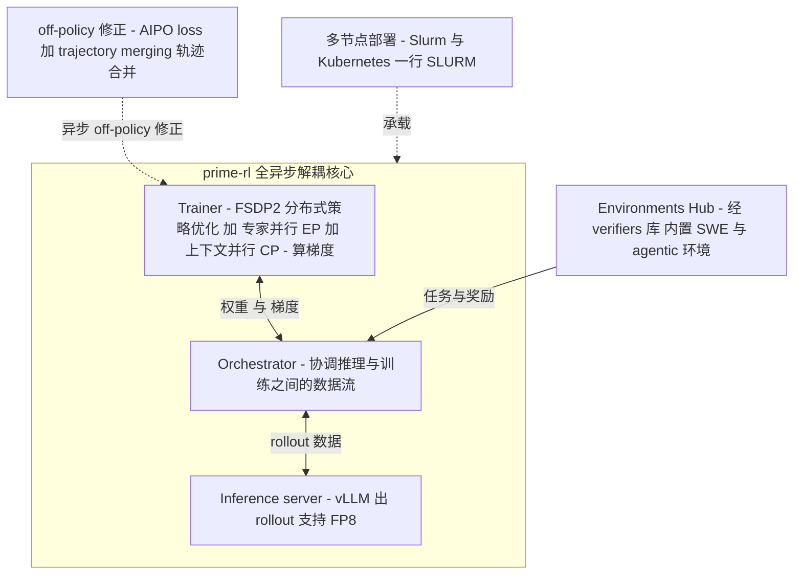
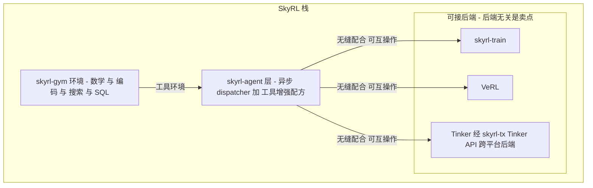
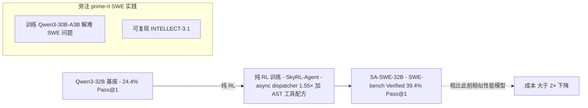
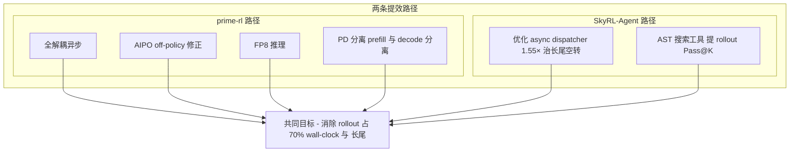

# Dispatch 18 · prime-rl vs SkyRL-Agent:两个开源异步 agentic RL 框架怎么选

*2026-06-29 · NPU Frontier Dispatch · RL-frameworks / async-RL / prime-rl / SkyRL / RL-on-NPU*

> **TL;DR** — 两个都开源(Apache-2.0)、都指向 Dispatch 02 的"rollout 占 70% wall-clock + 长尾"瓶颈,但站在**不同层**。**prime-rl**(Prime Intellect)是**重量级、全栈、全解耦的异步训练系统本身**:Trainer(FSDP2+EP+CP)/ Inference(vLLM+FP8)/ Orchestrator 三组件各自独立伸缩,用 **AIPO loss + trajectory merging** 做 off-policy 修正,投入 **1000+ GPU / 1T+ MoE / 去中心化**(INTELLECT 血统,复现 INTELLECT-3.1)。**SkyRL-Agent**(Berkeley NovaSky,arXiv 2511.16108)是**轻量、后端无关的 agent 编排层**:不重造 trainer,叠在 **SkyRL-train / VeRL / Tinker** 之上,依靠两项机制提效——**异步 dispatcher 比朴素异步批处理 1.55×**(细粒度 per-trajectory 调度治长尾)+ **AST 搜索工具配方**(提 rollout Pass@K → 增强 GRPO 组内对比信号),把 **SA-SWE-32B** 从 Qwen3-32B 的 24.4% 纯 RL 训到 SWE-bench Verified **39.4% Pass@1**、成本 **>2× 下降**。**prime-rl 重构训练系统本体(面向规模),SkyRL-Agent 优化编排调度层(面向效率),互补可组合、不是二选一。** 数字均 provisional(论文/仓库口径)。

应要求把这两个常被并列提及、其实层次不同的开源 RL 框架拆开对比。承接本看板 Dispatch 02(rollout 瓶颈)、08(agentic RL 长 rollout)、12(SWE agentic RL 上手)。

---

## 1 · 异步再现:两家解决同一问题,但所处层次不同

接 Dispatch 02(rollout 占整轮 wall-clock 约 70%、且被长尾轨迹拖累)与 Dispatch 08(agentic RL 的多轮长程 rollout 让长尾更夸张):所谓"高效 agentic RL",核心矛盾始终是同一个——**生成阶段(rollout)太慢、太不均匀,使训练算力闲置**。一旦 agent 要多轮调工具、跑测试、读代码库,单条轨迹长度从几百 token 膨胀到几万 token,batch 内最长那条决定整批何时结束,同步范式下这就是结构性算力浪费。

prime-rl 与 SkyRL-Agent 都直指这个瓶颈,但站位不同,不应在同一层面直接比较:

```mermaid
graph TB
    subgraph CMP ["开源异步 agentic RL 基础设施"]
        direction LR
        subgraph PR ["prime-rl - Prime Intellect"]
            PR1["重量级全栈 异步 trainer"]
            PR2["三组件全解耦"]
            PR3["为规模而生 1000+ GPU 与 1T MoE"]
            PR4["去中心化 全球分布式血统"]
            PR5["本身就是训练系统"]
            PR1 --> PR2 --> PR3 --> PR4 --> PR5
        end
        subgraph SA ["SkyRL-Agent - Berkeley NovaSky"]
            SA1["轻量 后端无关"]
            SA2["agent 编排层"]
            SA3["叠在已有 trainer 之上"]
            SA4["聚焦多轮 agent 效率"]
            SA1 --> SA2 --> SA3 --> SA4
        end
    end
    PR -. "不同层 互补可组合 非直接竞争" .-> SA
```

- **prime-rl(Prime Intellect)** 是一套**重量级、全栈、全解耦的异步训练系统本身**——它不是叠在其他 trainer 上的插件,它本身就是 trainer:自带分布式策略优化、自带推理服务、自带数据流编排,重点投入在规模(1000+ GPU、1T+ MoE)和去中心化(INTELLECT 血统)上。
- **SkyRL-Agent(Berkeley NovaSky)** 是一层**轻量、后端无关的 agent 编排层**——刻意不重造 trainer,叠在已有的 SkyRL-train / VeRL / Tinker 之上,只专注把多轮 agent 的 rollout 效率与训练配方做好。

概括而言:prime-rl 解决"如何把异步 RL 扩到全球级算力",SkyRL-Agent 解决"如何在已有的栈上,让多轮 agent 训得更快更省"。两者都瞄准 rollout 瓶颈,但**一个重构训练系统本体,一个优化编排调度层**。

## 2 · prime-rl:为规模而生的全解耦异步训练系统

prime-rl 口号 *Async RL Training at Scale*,Apache-2.0,定位"易用、可 hack,同时能扩到 1000+ GPU、支持 1T+ MoE"。骨架是**三个完全解耦、各自独立伸缩的组件**:

```mermaid
graph TB
    subgraph CORE ["prime-rl 全异步解耦核心"]
        direction LR
        TR["Trainer - FSDP2 分布式策略优化 加 专家并行 EP 加 上下文并行 CP - 算梯度"]
        OR["Orchestrator - 协调推理与训练之间的数据流"]
        INF["Inference server - vLLM 出 rollout 支持 FP8"]
        TR <-->|"权重 与 梯度"| OR
        OR <-->|"rollout 数据"| INF
    end
    ENV["Environments Hub - 经 verifiers 库 内置 SWE 与 agentic 环境"]
    OFF["off-policy 修正 - AIPO loss 加 trajectory merging 轨迹合并"]
    DEPLOY["多节点部署 - Slurm 与 Kubernetes 一行 SLURM"]
    ENV -->|"任务与奖励"| OR
    OFF -.->|"异步 off-policy 修正"| TR
    DEPLOY -.->|"承载"| CORE
```

- **Trainer**:基于 FSDP2 的分布式策略优化,叠加专家并行(EP,服务 MoE)与上下文并行(CP,服务长上下文/长 agent 轨迹)——真正吃梯度、更新权重的部分。
- **Inference server**:用 vLLM 产出 rollout、跑 FP8 推理——吃 rollout 算力的部分,可独立横向扩。
- **Orchestrator**:协调推理与训练之间的数据流——决定哪些 rollout 喂给 trainer、何时同步权重、如何衔接两侧节奏。

**为什么"全异步解耦"必须配 off-policy 修正。** 解耦的代价是:trainer 在更新权重的同时,inference server 还在用**稍旧的策略**继续产 rollout,等这批样本回到 trainer 它已经不是当前策略生成的了——这正是 Dispatch 02 的 staleness 问题。off-policy 数据直接当 on-policy 用,梯度有偏、训练会失稳。prime-rl 的解法是 **AIPO loss + trajectory merging**:AIPO(异步重要性策略优化一类的 loss)在目标里做重要性修正,把"行为策略 vs 当前策略"的偏差补回来(机理同 Dispatch 02 的 TIS/MIS 这条 importance-sampling 修正脉络);trajectory merging 把跨步骤、跨时刻产出的轨迹片段拼接对齐,让异步流水线产出的零散数据能被一致消费。没有这套修正,全异步将退化为系统性偏差。

**降低 rollout 成本的手段。** rollout 既是瓶颈也是主要开销,prime-rl 在推理侧叠加了多项优化:**FP8 推理**(吞吐翻倍、显存减半)、**PD 分离**(prefill 与 decode 拆开调度各自打满,避免长 prompt 的 prefill 阻塞 decode)、以及 **flash-attention / quack-kernels** 等自定义核——合计直接降低单位 token 的 rollout 成本,正面回应"rollout 占 70%"的成本问题。**环境即插即用**:原生集成 **Environments Hub(经 verifiers 库)**,内置 SWE 与 agentic 环境,训练新任务时从 Hub 获取环境即可,其 SWE 示例就是训 **Qwen3-30B-A3B**(MoE);多节点支持 Slurm/K8s、宣称一行 SLURM 部署,E2E 覆盖 SFT/RL/评测,支持多模态 VLM(Qwen3-VL)。**其投入方向**:1000+ GPU、1T+ MoE、去中心化全球分布式训练——血统直接来自 INTELLECT 系列(INTELLECT-2 是 32B 的全球分布式 RL),目标复现 INTELLECT-3.1。其他框架在单集群内优化,它投入的方向是"算力可以全球分布、异步聚合"。(规格均 provisional。)

## 3 · SkyRL-Agent:后端无关的 agent 层 + 两招提效

SkyRL-Agent(arXiv 2511.16108,2025-11-20,Apache-2.0)是 SkyRL 栈里的 **agent 层**,定位"高效的多轮/长程 agent 训练 + 评测"。SkyRL 栈分工清晰:`skyrl-train`(训练后端)、`skyrl-gym`(数学/编码/搜索/SQL 等环境)、`skyrl-agent`(本文对象,agent 层)、`skyrl-tx`(把 Tinker API 接进来的适配层)。

```mermaid
graph TB
    subgraph STACK ["SkyRL 栈"]
        AGENT["skyrl-agent 层 - 异步 dispatcher 加 工具增强配方"]
        subgraph BACKENDS ["可接后端 - 后端无关是卖点"]
            direction LR
            B1["skyrl-train"]
            B2["VeRL"]
            B3["Tinker 经 skyrl-tx Tinker API 跨平台后端"]
        end
        GYM["skyrl-gym 环境 - 数学 与 编码 与 搜索 与 SQL"]
    end
    AGENT -->|"无缝配合 可互操作"| B1
    AGENT -->|"无缝配合 可互操作"| B2
    AGENT -->|"无缝配合 可互操作"| B3
    GYM -->|"工具环境"| AGENT
```

**为什么"后端无关"是关键设计。** SkyRL-Agent 刻意**不重造 trainer**,而是与训练后端解耦,可互操作 **SkyRL-train / VeRL / Tinker**(Tinker 经 skyrl-tx 接入)。对工程团队的实际意义是:团队可能已在 VeRL 上有整套 pipeline,或只想用 Tinker 的托管 API 起步——SkyRL-Agent 允许保留既有训练栈,只把 agent 编排与 rollout 调度这层换成它,不必为验证高效 agent 训练而绑定某个重量级栈。这与 prime-rl 自成一栈的设计哲学完全相反,各有取舍。

其提效依靠**两项机制**。**① 优化异步流水线 dispatcher,比朴素异步批处理 1.55× 加速**:朴素异步批处理仍以"批"为单位调度——一批 rollout 里只要有一条长尾轨迹(多轮调工具、反复跑测试),整批就被它拖住、其余算力空转等它(正是 Dispatch 08 的长尾痛点);SkyRL-Agent 的 dispatcher 做**更细粒度的 per-trajectory 调度**,先完成者先提交、空出的算力立刻接续下一条新轨迹,而不等待最慢的轨迹,把"等待最慢"换成"先完成者先行",在长程多轮场景下获得 1.55× 端到端加速。**② 工具增强训练配方:AST-based 搜索工具**——这一机制的因果链需要明确(并非仅是工具可用性提升):给 agent 一个 **AST(抽象语法树)层面的代码搜索工具**,让它能按符号/结构导航代码库而非做无结构的文本 grep → 更好的代码导航让 agent **更可能真正解出任务**,直接体现为 **rollout 的 Pass@K 提升** → Pass@K 提升意味着**同一组 rollout 里有效正样本变多** → 而 GRPO 这类**组内相对优势(group-relative advantage)**算法,信号强弱恰恰取决于组内有没有"对 vs 错"的对比(全错则优势退化、梯度近乎为零),正样本变多 → 组内对比信号更强 → **训练更快更稳**。所以工具增强与训练效率之间存在硬因果:工具抬高正样本密度,正样本密度支撑 GRPO 的对比信号。

```mermaid
graph LR
    BASE["Qwen3-32B 基座 - 24.4% Pass@1"]
    RL["纯 RL 训练 - SkyRL-Agent - async dispatcher 1.55× 加 AST 工具配方"]
    RESULT["SA-SWE-32B - SWE-bench Verified 39.4% Pass@1"]
    COST["成本 大于 2× 下降"]
    BASE -->|"纯 RL"| RL
    RL --> RESULT
    RESULT -.->|"相比此前相似性能模型"| COST
    subgraph NOTE ["旁注 prime-rl SWE 实践"]
        N1["训练 Qwen3-30B-A3B 解难 SWE 问题"]
        N2["可复现 INTELLECT-3.1"]
    end
```

结果是 **SA-SWE-32B**:从 Qwen3-32B 基座(SWE-bench Verified **24.4% Pass@1**)经**纯 RL** 训到 **39.4% Pass@1**,且达到此前相似性能模型的成本下降 **>2×**(均 provisional)。

## 4 · 对比与定位:互补,不是二选一

两条提效路径都指向同一瓶颈——rollout 占 70% + 长尾:

```mermaid
graph TB
    subgraph PATHS ["两条提效路径"]
        direction LR
        subgraph LEFT ["prime-rl 路径"]
            L1["全解耦异步"]
            L2["AIPO off-policy 修正"]
            L3["FP8 推理"]
            L4["PD 分离 prefill 与 decode 分离"]
        end
        subgraph RIGHT ["SkyRL-Agent 路径"]
            R1["优化 async dispatcher 1.55× 治长尾空转"]
            R2["AST 搜索工具 提 rollout Pass@K"]
        end
    end
    GOAL["共同目标 - 消除 rollout 占 70% wall-clock 与 长尾"]
    L1 --> GOAL
    L2 --> GOAL
    L3 --> GOAL
    L4 --> GOAL
    R1 --> GOAL
    R2 --> GOAL
```

| 维度 | prime-rl | SkyRL-Agent |
|---|---|---|
| 定位层次 | 重量级全栈异步**训练系统**(自身即 trainer) | 轻量**后端无关 agent 层**(叠在已有 trainer 上) |
| 核心卖点 | Async RL at Scale,1000+ GPU / 1T+ MoE / 去中心化 | 多轮长程 agent 效率,1.55× dispatcher + 工具配方 |
| 解耦方式 | 三组件全解耦(Trainer / Inference / Orchestrator)各自伸缩 | 与训练后端解耦,agent 编排层可插拔 |
| off-policy 修正 | AIPO loss + trajectory merging | 依赖所选后端(本身聚焦调度而非 loss 修正) |
| FP8 | vLLM FP8 推理(原生) | 取决于后端 |
| 后端 | 自带(FSDP2 + vLLM,自成一栈) | 后端无关:SkyRL-train / VeRL / Tinker(经 skyrl-tx) |
| 规模目标 | 全球分布式、千卡、万亿参 MoE | 高效起步,单/多节点,聚焦效率而非极限规模 |
| 代表产出 | 复现 INTELLECT-3.1;SWE 示例训 Qwen3-30B-A3B | SA-SWE-32B(24.4→39.4% SWE-bench Verified) |
| 许可 | Apache-2.0 | Apache-2.0 |

**两者可以组合,而非对立。** SkyRL-Agent 的 agent 层理念(per-trajectory 细粒度调度 + 工具增强配方)与 prime-rl 的规模化异步 trainer 并不冲突——一个管"agent 怎么编排得高效",一个管"训练怎么扩得够大",理想形态是把前者的 agent 编排思路接到后者这种规模 trainer 上。**选型取决于诉求**:要规模/去中心化/1T MoE → 选 prime-rl;要轻量起步、不绑定后端、主攻多轮 agent 效率 → 选 SkyRL-Agent。

**一个数字对照(均 provisional)。** 两家都用 Qwen3-32B 量级做 SWE-bench Verified:SkyRL-Agent 的 SA-SWE-32B 纯 RL 把 24.4% 抬到 **39.4% Pass@1**;对照 Dispatch 12 提到的 **DeepSWE 的 42.2%**。可见**开源纯 RL 的 SWE agent 正集中在 40% 区间竞争**——既说明该范式已被多家独立验证,也说明尚无一家显著突破上限。

## 5 · 对 RL-on-NPU 的意义

把这两家放回昇腾(MindSpeed-RL + vLLM-Ascend)的语境,各自都有可直接照搬的镜鉴(接 Dispatch 02/03/13)。

**prime-rl 是 GPU 侧的标准参照,几乎逐条对应 NPU 待办事项:**

- **三组件全解耦(Trainer / Inference / Orchestrator)** —— 正是 MindSpeed-RL 该照搬的架构:把训练与推理拆成可独立伸缩的服务,而非塞在一个进程里同步跑。
- **AIPO off-policy 修正 ≈ staleness 修正** —— 只要走异步,昇腾侧同样吃 staleness,同样需要 importance-sampling 类的 loss 修正(对应 Dispatch 02 的 TIS/MIS),这是异步化的必要代价,无法回避。
- **FP8 vLLM 推理 ≈ 昇腾 950 的原生 FP8** —— 硬件已提供 FP8(Dispatch 03),推理栈(vLLM-Ascend)应当完成 FP8 rollout 路径的适配,把 rollout 成本压到与 GPU 侧可比。

**SkyRL-Agent 的两项机制对 NPU 更接近直接可用:**

- **后端无关的 dispatcher** 原则上可接入 Ascend 后端——它本就不绑定训练栈,接 NPU 后端是架构允许的方向。
- **AST 工具配方是硬件无关的**,纯属 rollout 阶段的环境/工具逻辑,可直接移植,不涉及算子。
- **1.55× 的 per-trajectory dispatcher 恰好命中昇腾当前最突出的短板**:GPU 侧有 sleep-mode 能在长尾等待时让闲置卡休眠/复用,昇腾当前缺这一手段、长尾空转代价更重——"先完成者先行"的细粒度调度正是缓解这一短板的低成本手段。

**但存在两项硬性前提。** FP8 与异步在 NPU 上要落地,**算子需要重写**,且必须用 **align-probe 验证训推一致**——否则 FP8 推理出的 logits 与训练侧不一致,叠加异步 staleness,off-policy 修正会建立在错误的概率比上、训练直接偏离。换言之:**架构思路可以照搬,数值正确性必须在 NPU 上重新验证并保证。**

## 6 · 下一步看什么

1. **AIPO vs 各家 off-policy 修正**:prime-rl 的 AIPO 与 Dispatch 02 的 GAC/staleness 上界/Periodic Asynchrony、以及 Miles 的训推一致(Dispatch 09)在异步稳定性上谁更稳。
2. **SkyRL-Agent dispatcher 接 Ascend 后端**:后端无关能否以最小改动切换到 NPU,以及 1.55× 加速在 vLLM-Ascend 上的保留程度。
3. **去中心化 RL 的真实可达性**:prime-rl/INTELLECT 的全球分布式异步训练,通信与 staleness 在跨地域延迟下是否还稳。
4. **开源纯 RL SWE agent 的天花板**:SA-SWE-32B 39.4% / DeepSWE 42.2% 这条 40% 带,叠加 ScaleSWE/DeNovoSWE 的数据(Dispatch 14/17)能不能突破。

---

*来源:prime-rl(GitHub `PrimeIntellect-ai/prime-rl`,Apache-2.0)、SkyRL-Agent(arXiv 2511.16108,GitHub `NovaSky-AI/SkyRL`,Apache-2.0);承接本看板 Dispatch 02/03/08/09/12/13。规格与评测分数均论文/仓库口径,provisional,缺统一第三方复测,以官方一手发布与独立复现为准。*
