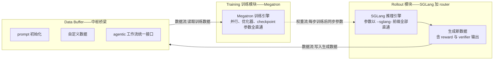
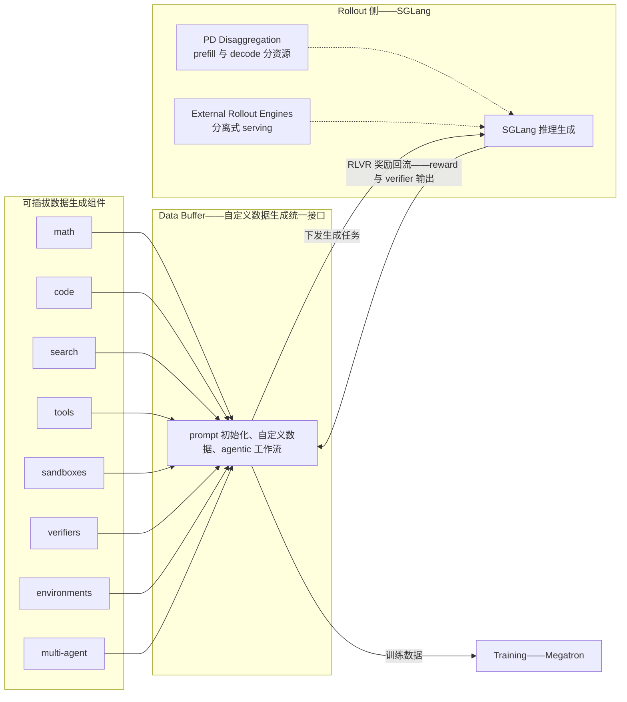
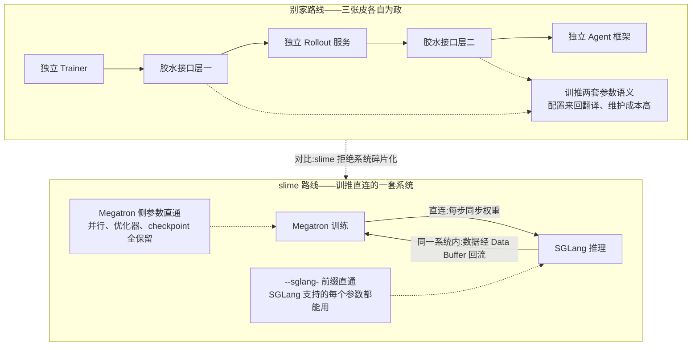
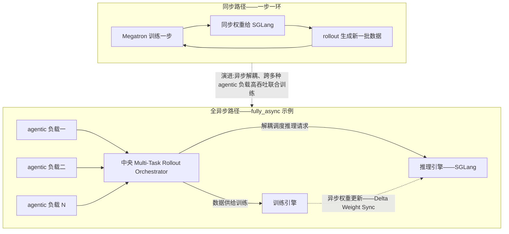
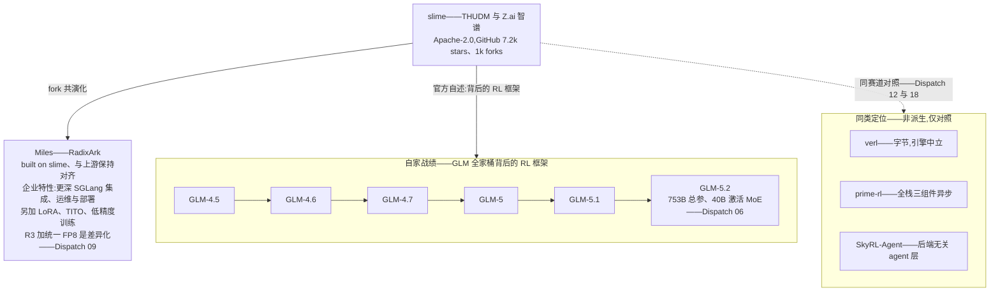

# Dispatch 19 · 详解 slime:GLM 全家桶背后的 SGLang 原生 RL 框架

*2026-06-29 · NPU Frontier Dispatch · RL-frameworks / slime / SGLang / GLM / RL-on-NPU*

> **TL;DR** — slime 是 THUDM / Z.ai(智谱)开源的 SGLang 原生 RL post-training 框架(Apache-2.0,7.2k stars),架构核心是三模块 + Data Buffer 中枢:官方设计是把 Megatron 训练与 SGLang 推理连成一套系统、拒绝碎片化成三张皮,数据面经 Buffer 中转解耦,权重同步走独立通道。设计原则是零封装税——SGLang 每个参数经 `--sglang-` 前缀直通,Megatron 并行/优化器/checkpoint 参数原样保留,hackability 优先。真正的分量在战绩:官方自述它是 GLM-4.5→5.2 六代旗舰背后的生产 RL 引擎。同步基线之外有 fully_async 全异步路径(Multi-Task Rollout Orchestrator、PD 分离、Delta Weight Sync)。Miles(RadixArk)是其企业级下游发行版。对昇腾:Buffer 中枢硬件无关,移植缺口可精确圈定在训练引擎、推理引擎、权重同步三点——但每一点都有实在的坑。规格均 provisional。

应要求调研 slime 这个被 GLM 全家桶反复点名的 RL 框架;承接本看板 Dispatch 02(rollout 瓶颈与 staleness)、06(GLM-5.2)、09(RadixArk Miles)、12(SWE agentic RL 框架表)、18(prime-rl vs SkyRL-Agent)。

---

## 1 · slime 是什么:GLM 全家桶背后的 RL 引擎

slime 是 THUDM / Z.ai(智谱)开源的 LLM post-training 框架,定位一句话:**for RL scaling**。仓库口径(provisional)是 Apache-2.0、7.2k stars / 1k forks,官方给出的两大核心能力是"高性能训练"与"灵活数据生成"——前者对应 Megatron 训练侧,后者对应 SGLang rollout 侧。

但真正让 slime 与众不同的不是任何 benchmark,而是一行官方自述:**slime 是 GLM-4.5 / 4.6 / 4.7 / GLM-5 / 5.1 / 5.2 六代旗舰背后的 RL 框架**(provisional,官方口径)。这件事的信息量远超吞吐数字。RL 后训练框架的死亡地带从来不在 demo,而在生产:一个 753B/40B 激活的 MoE(GLM-5.2,见 Dispatch 06)要跑长周期的 RL,期间权重同步、rollout 长尾、reward 服务、checkpoint 恢复任何一环崩了都是真金白银。能连续扛住六代旗舰模型的迭代,意味着这套系统在"最难伺候的用户就是自己"的压力下被反复锤炼过——这是玩具框架和生产框架的分界线。相比之下,很多开源 RL 框架的"战绩"是论文复现,slime 的战绩是它的东家把公司押在上面。

开源自家生产 RL 栈,则是清晰的生态打法:模型权重开源之后,让社区用同一套工具在 GLM 系模型上做 RL,等于把"GLM + slime + SGLang"绑成一条默认路径。支持模型列表(provisional)也印证了这个策略——GLM 系之外覆盖 Qwen(2.5/3/3MoE/3Next/3.5/3.6)、DeepSeek(V3/V3.1/R1)、Llama 3,即主流开源 MoE/Dense 全家桶。配套的公开叙事有两篇:lmsys.org 的愿景博客《slime: An SGLang-Native Post-Training Framework for RL Scaling》(2025-07-09)与 v0.1.0 release《Redefining High-Performance RL Training Frameworks》(均 provisional)。

## 2 · 三模块架构:以 Data Buffer 为中枢的解耦

slime 的架构声明里最有态度的一句是:不把系统碎片化成"trainer、rollout 服务、agent 框架"三张皮,而是把 Megatron 训练与 SGLang 推理直接连起来。落到结构上是三个模块:

1. **Training(Megatron)**:从 Data Buffer 读数据训练,每步训练后把参数同步给 rollout 模块;
2. **Rollout(SGLang + router)**:生成新数据(含 reward / verifier 输出)写入 Data Buffer;
3. **Data Buffer**:两者之间的桥梁,统一管理 prompt 初始化、自定义数据与 agentic 工作流的接入接口。

把 Data Buffer 做成数据面的中枢,而不是让 trainer 与 rollout 在数据面点对点耦合,是这套设计里最值得细看的决策(官方说的"直接连起来"指训推收在一套系统内,数据流仍经 Buffer 中转)。对比一下"trainer 与 rollout 数据面直接耦合"的脆弱形态:trainer 需要知道 rollout 的批组织方式、采样时序、失败重试语义;rollout 需要知道 trainer 什么时候要数据、要多少、什么格式。两侧的每一次演进都是对方的破坏性变更,想从同步切异步、想换推理引擎、想在中间插一个 agent 循环,都要同时改两侧——这正是很多 RL 框架长成"三张皮"的原因:改不动核心,只好在外面再包一层。

Buffer 中心化之后,契约收敛为两条:**训练侧只对 Buffer 编程**(读 batch),**rollout 侧只对 Buffer 编程**(写轨迹 + 附带 reward/verifier 信号),外加一条独立的权重同步通道。于是三个好处自然成立:

- **数据生成变成可插拔的**(详见下节);
- **同步/异步是 Buffer 两侧的调度策略,不是架构重写**——同步就是"写完一批读一批",异步就是"两侧各自全速跑",切换的是策略,不是接口(详见第 4 节);
- **故障域隔离**——rollout 的沙箱崩了、verifier 超时了,烂在 Buffer 之前;训练侧看到的永远是干净的数据流。

这套"以缓冲区为中心"的解耦,本质上是把 RL 系统里最不稳定的部分(环境交互、数据生成)和最昂贵的部分(大规模训练)之间加了一层阻抗匹配。

## 3 · Data Buffer 中枢:灵活数据生成的统一接口

"灵活数据生成"作为官方两大核心能力之一,落地就在 Data Buffer 的自定义数据生成接口上:math / code / search / tools / sandboxes / verifiers / environments / multi-agent,全部通过同一个口子插进来。你的 agentic 工作流不管多复杂——多轮工具调用、沙箱执行、多智能体协作——最终产出的就是写进 Buffer 的轨迹(含 RLVR 的 reward / verifier 输出),训练侧一行不用改。

这个接口设计的含义是:RL 算法研究者与 agent 工作流开发者被 Buffer 隔在两侧,各自迭代互不拖累。想给训练加一个新的 verifier 环境?写一个数据生成组件插上即可;想换 GRPO 的分组策略?训练侧的事,rollout 组件毫无感知。Rollout 侧的两个系统特性(PD Disaggregation、External Rollout Engines)也在这一层生效,细节留到第 4 节的异步语境里讲。

## 4 · SGLang-native 与参数直通:hackability 作为设计原则

slime 自称 SGLang-native,这个"native"有非常具体的含义(provisional,仓库口径):**你装的那个 SGLang 支持的每一个参数,都可以通过 `--sglang-` 前缀直通传入**;Megatron 侧同样直通——并行策略、优化器、checkpoint 相关的全部参数原样保留。

这是一个反主流的设计选择。多数框架的做法是"封装层":从底层系统里挑一个子集包成自己的配置项,美其名曰简化,实际是阉割——底层系统的大部分能力被封装层挡在外面,用户想调一个封装层没暴露的参数,只能改框架源码或提 issue 等下个版本。slime 的选择是零封装税:两个成熟系统(Megatron 的训练能力、SGLang 的 serving 能力)的**全部**表面积直接暴露给用户,框架自己只做粘合与调度。

对研究者这是真价值。做 RL 的人日常要动的恰恰是封装层最容易砍掉的东西:采样侧要改 temperature 调度、改 constrained decoding、开关 radix cache;训练侧要针对一个新 MoE 调 EP/PP/TP 组合、换优化器配置。参数直通意味着这些全都是命令行层面的事,SGLang 或 Megatron 上游发了新特性,slime 用户第一时间就能用,不用等框架"支持"。

代价也要诚实说:**门槛不低**。参数直通等于把两个系统的复杂度都直通给了用户——你得同时懂 Megatron 的并行语义和 SGLang 的 serving 参数,配置面巨大,没有封装层帮你挡错误组合。slime 实际上是在筛选用户:它假设你是能读懂 Megatron 报错的工程师,而不是想要一键跑通的入门者。对目标场景(千亿级 MoE 的生产 RL)来说这个假设成立,但选型时要认清这一点。

## 5 · 从同步到全异步:Agent-Oriented Design

slime 提供两条路径(provisional,仓库口径:同步主路径 + `examples/fully_async`),这个"两条都给"本身就是正确的工程判断。

**同步路径**是简单正确的基线:每步训练后把参数同步给 rollout,rollout 用最新权重生成下一批数据。on-policy 性质干净,调试和归因容易,算法研究首选。问题是吞吐——Dispatch 02 给过量化背景:rollout 通常占整个 RL 迭代 70% 以上的时间,且长尾严重(一批里最慢的几条 agentic 轨迹决定了整批的等待时间,同属 Dispatch 02 的长尾观察)。同步意味着昂贵的训练集群在 rollout 长尾期间空转。

**全异步路径**对应那篇 Agent-Oriented Design 博客(《An Asynchronous and Decoupled Framework for Agentic RL》):经中央 **Multi-Task Rollout Orchestrator** 解耦推理与训练引擎,跨多种 agentic 负载做高吞吐联合训练。训练不再等 rollout,rollout 不再等训练,Orchestrator 负责在多个 agentic 任务之间调度生成容量。代价是 staleness——异步生成的数据来自旧权重,off-policy 程度需要算法侧(Dispatch 02 提到的 TIS/MIS 一类重要性修正)来买单。slime 把这个取舍留给用户:基线要正确性走同步,规模化要吞吐走 fully_async,而这正是 Data Buffer 中枢设计的红利——两条路共享同一套模块和接口。

围绕异步路径还有三个系统特性(均 provisional),各自对应一个具体痛点:

- **PD Disaggregation**:prefill 和 decode 分资源部署。agentic 负载的特征是反复的长上下文 re-prefill(每轮工具调用返回都要重新预填),和 decode 的算力特征完全不同,分开部署才能各自打满。
- **Delta Weight Sync**:大 MoE 每步全量权重同步太贵——对 GLM-5.2 这个量级(753B 参数)的模型,每步把全量权重推给所有 rollout 实例是不可接受的带宽开销,增量同步把成本降到"只传变化的部分"。
- **External Rollout Engines**:分离式 serving,rollout 引擎可以完全外置。生成容量独立于训练集群伸缩,甚至可以复用既有的推理集群。

## 6 · 生态位:slime vs verl vs prime-rl vs SkyRL-Agent vs Miles

| 维度 | slime | verl | prime-rl | SkyRL-Agent | Miles |
|---|---|---|---|---|---|
| 出身 | THUDM / Z.ai(智谱) | 字节跳动(通行认知,provisional) | Prime Intellect(通行认知,provisional) | Sky Computing 系(provisional) | RadixArk,built on slime |
| 定位 | GLM 全家桶的生产 RL 框架,开源给生态 | 社区通用 RL 后训练框架(通行认知,provisional) | 全栈异步优先的 RL 框架 | 后端无关的 agent 训练层(Dispatch 18) | slime 的企业级下游发行版 |
| 训练后端 | Megatron(直通,EP 正确,Dispatch 12) | FSDP / Megatron 双后端(通行认知,provisional) | 自带 trainer(三组件之一,Dispatch 18) | 不绑定,接底层框架 | Megatron(随 slime 上游) |
| 推理后端 | SGLang(原生,参数直通) | vLLM / SGLang(通行认知,provisional) | 自带 inference 组件(Dispatch 18) | 不绑定 | SGLang(更深集成) |
| 异步 | 同步 + fully_async 双路径(Orchestrator) | 以同步为主、异步演进中(provisional) | 全栈三组件异步为默认(Dispatch 18) | 取决于底层后端 | 随 slime,另有 R3(Dispatch 09) |
| 差异化 | SGLang-native 直通、Data Buffer 中枢、GLM 六代生产验证 | 编程模型与广泛社区生态(通行认知,provisional) | 异步为第一性设计 | agent 工作流层与训练后端解耦 | R3 + 统一 FP8、LoRA、TITO、低精度、运维/部署支持 |
| 许可 | Apache-2.0 | Apache-2.0(provisional) | 开源(许可待核) | 开源(许可待核) | 开源(随上游口径,待核) |

定位分析:这五者其实不在同一层竞争。verl 赢在生态广度,是"默认选项";prime-rl(Dispatch 18)把全异步做成第一性原理,三组件(训练/编排/推理)全栈自持;SkyRL-Agent 干脆不做全栈,只做后端无关的 agent 层,理论上可以架在任何 trainer 上。slime 的独特组合是三件事的交集:**SGLang 原生**(把"推理引擎全能力直通"作为设计原则,在同类框架中少见)、**GLM 六代生产验证**(有连续旗舰模型战绩背书,在开源 RL 框架中罕见)、**Miles 的上游**——Dispatch 09 讲过,Miles 从 slime fork 共演化、与上游保持对齐,以 R3 和统一 FP8 作为差异化,再叠企业特性(更深 SGLang 集成、运维工具、部署支持、新模型/新硬件优化、LoRA、TITO、低精度训练)。这个上下游关系意味着选型题是分层的:要社区上游和最新特性选 slime,要企业化交付和低精度路线选 Miles,两者不是竞品而是发行版关系。另外 Dispatch 12 框架表里的一个细节值得重提:slime 归在 Megatron 系、"能正确做 EP"——对 MoE 时代的 RL 这不是加分项,是入场券。

## 7 · 对 RL-on-NPU 的意义

先说一个信源纪律层面的推论。slime 训练侧绑定 Megatron——纯正的 NVIDIA 栈——这本身就是本看板架构综述第 4 条纪律("GLM 完全在昇腾训练、零 NVIDIA"是误传)的佐证:GLM-5 一手技术报告的训练基建引用 Megatron-LM,训练硬件从未明示;而 GLM 全家桶的 RL 引擎公开地跑在 Megatron 上。用二手转述去推"全昇腾训练",在一手证据面前站不住。

那 slime 这套架构对昇腾(NPU)上的 RL 有什么意义?诚实拆解:

**移植路径存在但每一段都有缺口。** 训练侧的对应关系是 Megatron→MindSpeed(昇腾的 Megatron 适配层),概念映射清楚,但 slime 依赖的 Megatron 特性(尤其 EP 相关)在 MindSpeed 侧的覆盖度需要逐项核对;推理侧 SGLang 有 Ascend 后端,但成熟度待验证(本看板既有判断)——昇腾栈上更成熟的是 vLLM-Ascend / MindSpeed-RL 这条线。最难啃的可能是权重同步通道:Delta Weight Sync 这类特性大概率建立在 NVIDIA 侧通信语义(NCCL 一类)之上(推断,待核),搬到 HCCL/CANN 上更可能是重实现而非改配置。

**好消息是 Data Buffer 中枢本身硬件无关。** 这正是解耦架构的价值兑现时刻:Buffer 的读写契约、自定义数据生成接口、同步/异步调度策略,全都不碰硬件。理论上换掉两侧引擎(Megatron→MindSpeed、SGLang→昇腾后端),中枢和 agentic 工作流层原样保留。硬件相关性被这个架构压缩到了三个明确的点:训练引擎、推理引擎、权重同步通道——移植工作量可以精确圈定,这比"整个框架和 CUDA 缠在一起"的形态好移植得多。

**对 MindSpeed-RL 的借鉴意义**在于设计而非代码:三模块 + Buffer 中枢的解耦、参数直通的 hackability 原则、同步/异步双路径共存,这三条都是硬件中立的架构决策,昇腾栈的 RL 框架完全可以吸收。反过来,如果 MindSpeed-RL 想承接 agentic RL 负载,slime 的 Multi-Task Rollout Orchestrator 是现成的参考答案。

**与 Miles 移植缺口的关系**(接 Dispatch 09 的表):Miles 的差异化恰恰落在硬件敏感区——统一 FP8、低精度训练、新硬件优化。把 Miles 路线搬到 NPU,等于在 slime 移植缺口之上再叠一层低精度算子适配(昇腾的 FP8 支持路径与 NVIDIA 不同构,推断,待核)。也就是说,slime→NPU 是架构移植问题,Miles→NPU 是架构移植 + 数值路线移植的双重问题——评估 RL-on-NPU 可行性时,这两笔账要分开算。

## 下一步看什么

- **fully_async 的大规模实测**:Orchestrator 路径在多任务 agentic 负载下的实际吞吐与 staleness 代价,目前只有设计叙事、没有公开数字——等社区或官方放出可复算的 benchmark。
- **slime 上昇腾的可行性验证**:MindSpeed 对 slime 所需 Megatron 特性(尤其 EP)的覆盖核对、SGLang Ascend 后端的成熟度、HCCL 上权重同步通道的重实现成本——三个缺口哪个先被填上。
- **Miles 与 slime 的功能回流**:R3、统一 FP8、TITO 这些下游差异化特性会不会部分回流上游,直接影响"选 slime 还是选 Miles"这道题的边界。
- **GLM-5.2 之后的迭代**:下一代 GLM 旗舰如果继续由 slime 承载,关注仓库随之落地的新系统特性——从公开叙事看,过往模式是自家旗舰的需求先变成 slime 的功能(推断)。

---

**来源与 provisional 声明**:本文事实基于 GitHub THUDM/slime 仓库 README(Apache-2.0)、lmsys.org 博客《slime: An SGLang-Native Post-Training Framework for RL Scaling》(2025-07-09)与 v0.1.0 release《Redefining High-Performance RL Training Frameworks》、Agent-Oriented Design 博客《An Asynchronous and Decoupled Framework for Agentic RL》,以及本看板 Dispatch 02/06/09/12/18 的既有事实。所有规格(星数、支持模型列表、特性清单、GLM 六代战绩)均为仓库/博客口径,标记 provisional,以官方最新文档为准;吞吐/加速比类指标官方未公开数字,本文一律不引用。verl、prime-rl、SkyRL-Agent 相关行的"通行认知/许可待核"条目尚未逐项复核,选型前请核对原仓库。
