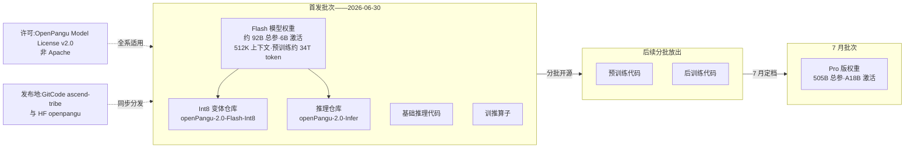
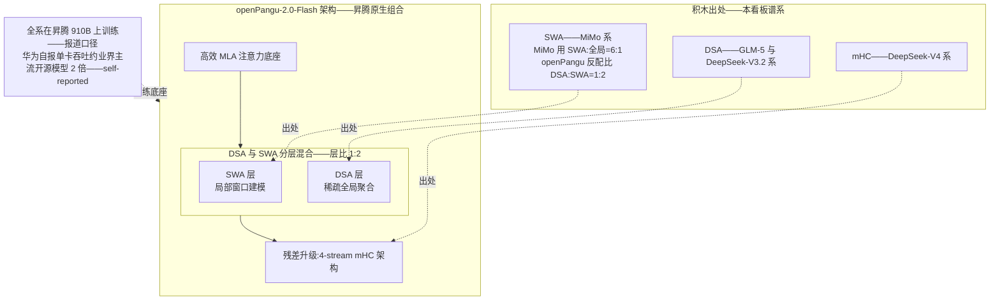
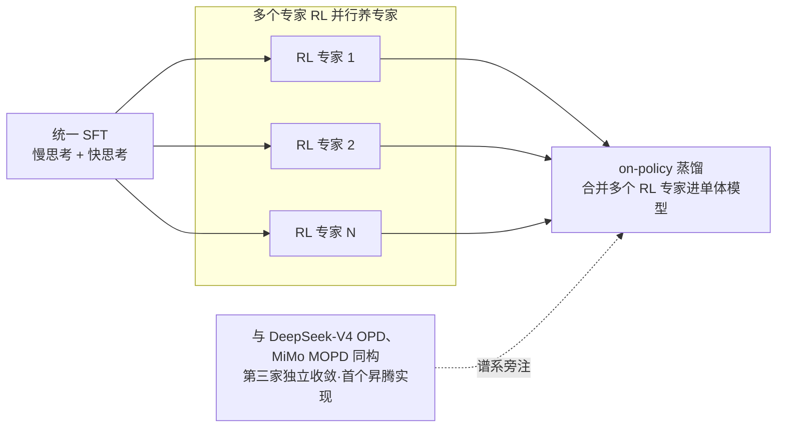
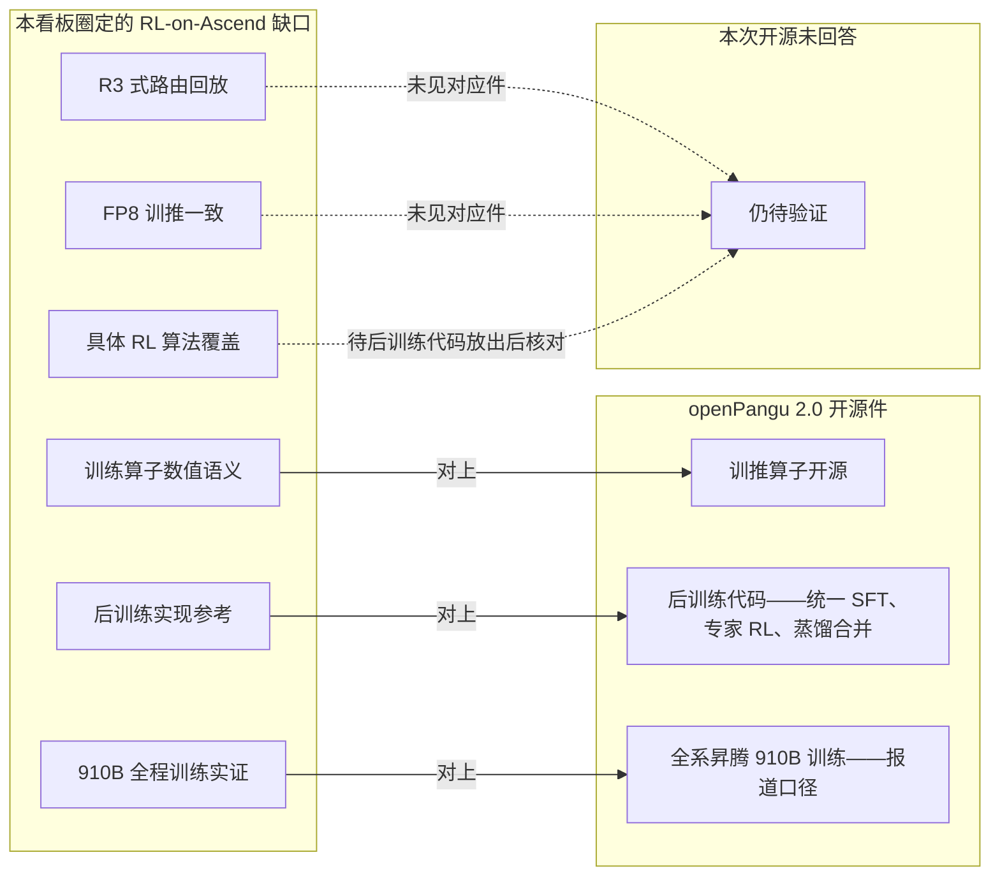

# Dispatch 20 · 详解 openPangu 2.0 开源:昇腾上 RL/对齐的第一手参考栈

*2026-07-07 · NPU Frontier Dispatch · openPangu / post-training / Ascend / RL-on-NPU*

> **TL;DR** — 2026-06-30 起,华为在 GitCode(ascend-tribe)与 HF 分批开源 **openPangu 2.0 七大组件**:不只是权重,还有**推理代码、训推算子、预训练代码、后训练代码**。首发 openPangu-2.0-Flash——昇腾 910B 原生训练的稀疏 MoE(约 92B 总参/6B 激活,以仓库为准;512K 上下文,约 34T token 预训练),Pro 版 505B/A18B 定于 7 月。架构是"已知积木的昇腾原生组合"(MLA + DSA:SWA=1:2 分层混合 + 4-stream mHC);后训练配方"统一 SFT → 多专家 RL → on-policy 蒸馏合并"与 DeepSeek-V4 OPD、MiMo MOPD **同构——第三家独立收敛、首个昇腾实现**。对本看板:训推算子 + 后训练代码成体系开源,正是 RL-on-Ascend 缺口的第一手参考栈;但 FP8 训推一致、R3 式路由回放、具体 RL 算法覆盖仍待代码放齐后验证。许可为 OpenPangu Model License v2.0(**非 Apache**),数字均 provisional/self-reported。

应上周动态扫描(openPangu-2.0-Flash 卡片)的深挖要求。承接本看板 Dispatch 05(V4 OPD 分养-合并)、09(Miles R3/统一 FP8)、13(SWE-RL 四坑)、19(slime 与三点缺口)、架构综述 §3/§5/§7。

---

## 1 · 为什么这次开源不一样

昇腾生态过去几年不缺"开源模型权重"——缺的是**"这个模型是怎么在 NPU 上训出来的"的一手代码**。社区拿到权重后能做的事情很有限:推理适配、量化、微调都要自己在 CANN/MindSpore/torch-npu 的栈上摸索,而真正的高价值知识——并行策略怎么切、算子怎么写、RL 流水线在 NPU 上怎么跑通——一直锁在厂商内部。

openPangu 2.0 这次的开源方式直接命中了这个缺口。2026 年 6 月 30 日起,华为在 GitCode(ascend-tribe 组织)和 Hugging Face(openpangu)分批放出**七大组件**:模型权重、推理代码、训推算子、预训练代码、后训练代码等成体系发布,而非只丢一个 safetensors 目录。首发的 openPangu-2.0-Flash 是昇腾 NPU 原生训练的稀疏 MoE,约 92B 总参 / 6B 激活(仓库口径,详见第 6 节),512K 上下文,预训练约 34T token(provisional / self-reported)。同步还有 Int8 变体仓库和独立的 Infer 推理仓库;505B 总参 / A18B 激活的 Pro 版权重定于 7 月开源。

对本看板的读者来说,最重要的两个组件是**训推算子**和**后训练代码**:前者意味着 NPU 上关键算子的数值语义第一次可以被直接阅读而非黑盒猜测,后者意味着"RL/对齐在昇腾上端到端怎么做"第一次有了厂商级参考实现。这是 Dispatch 19 里我们说的"昇腾 RL 三点缺口"第一次出现系统性的补位信号(第 4 节展开)。

一个不能跳过的注意事项:**许可是 OpenPangu Model License v2.0,不是 Apache 2.0**。这是华为自定义许可,具体条款(尤其是商用限制、衍生模型义务、再分发条件)需要逐条细读,商用可行性待确认。把它当 Apache 用是有法务风险的——评估引入时请让法务先过一遍许可全文。

## 2 · 架构:已知积木的昇腾原生组合

按 README 口径,openPangu-2.0-Flash 的架构是三块积木的组合,每一块在本看板的架构综述里都有明确谱系:

- **MLA 注意力**:DeepSeek 系开创的低秩 KV 压缩注意力,已是 MoE 大模型的准标配,这里不展开。
- **DSA + SWA 分层混合,层比 1:2**:SWA(滑动窗口注意力)负责局部窗口内的稠密建模,DSA(动态稀疏注意力)负责稀疏的全局聚合。谱系上,DSA 出自 GLM-5 / DeepSeek-V3.2 一系,SWA 混合出自 MiMo(综述 §3/§5)。512K 上下文能撑住,靠的就是这套"局部稠密 + 全局稀疏"的分工。
- **4-stream mHC 残差**:多流超连接(mHC)残差结构,谱系出自 DeepSeek-V4(综述 §3),用多条残差流替代单一残差主干,改善深层网络的信息流。

有意思的不是积木本身——每一块都是已验证的公开设计——而是**配比哲学的反转**。MiMo 的混合注意力是 SWA:全局 = 6:1,即绝大多数层做便宜的局部注意力,偶尔插一层全局层"看一眼全局";openPangu 是 DSA:SWA = 1:2,稀疏全局层占到三分之一,**全局聚合层的密度显著更高**。一种合理的解读是:openPangu 押注 512K 超长上下文场景下全局信息聚合是瓶颈,愿意为此付更多稀疏注意力的开销;MiMo 则更极端地压推理成本。哪种配比在长上下文任务上更优,目前没有对照实验,是值得社区拿开源代码去做消融的第一个问题。

Flash 档的定位也清晰:92B 总参 / 6B 激活,激活量级与主流 dense 7B 相当,权重放得下、单卡(昇腾单卡口径)推得动,配合 Int8 变体仓库,明显是奔着"昇腾生态的默认可跑模型"去的。华为自报昇腾单卡吞吐约为主流开源模型的 2 倍——**self-reported,无第三方复测**,读法见第 6 节。

## 3 · 后训练配方:OPD/MOPD 范式的第三家收敛

README 给出的后训练配方是三段式:

1. **统一 SFT**:慢思考(长推理链)与快思考(直接作答)混合训练,一个模型同时具备两种响应模式;
2. **多个专家 RL**:按领域(可推测为数学、代码、通用对话等,具体划分待仓库确认)分别做 RL,养出多个领域专家;
3. **On-policy 蒸馏合并**:用 on-policy 蒸馏把多个专家的能力合并回单一模型。

熟悉本看板的读者会立刻认出这个形状。Dispatch 05 里我们拆过 DeepSeek-V4 的 OPD:分领域 SFT+RL 养专家 → on-policy 蒸馏合并;MiMo 的 MOPD 是同一配方的独立实现。当时架构综述 §7 的判断是"两家独立收敛暗示这是正在成型的标准后训练范式"——现在 openPangu 成为**第三家**,而且是在完全不同的硬件栈上独立复现。三家独立收敛,这个范式基本可以从"暗示"升级为"成型":**单一 RL 流水线难以同时优化多领域能力,分养-合并正在取代大一统 RL 成为默认配方**。

openPangu 这一例还额外贡献了一个此前没人回答过的问题的答案:**该范式能在昇腾上端到端跑通**。多专家 RL 意味着多条 RL 流水线,on-policy 蒸馏意味着教师模型在线推理 + 学生模型训练的混合负载——这些在 NVIDIA 栈上已经被 slime 等框架磨平的工程问题,在 NPU 上此前没有公开的完整实现证据。openPangu 的存在本身就是可行性证明,后训练代码放出后则是可阅读的实现。

需要划清的边界:README 只给了配方骨架,**具体 RL 算法覆盖(GRPO?DPO?其他?)未明说**,专家 RL 的领域划分、蒸馏时的合并策略也都待仓库代码放出后确认。本节的对照基于配方结构,不基于算法细节。

## 4 · 对 RL-on-NPU:一手参考栈能回答哪些老问题

把这次开源对到本看板攒下的两张问题清单上。**Dispatch 13 的 RL 基建四坑**:无 sleep-mode 下的显存争用、train-infer logprob 一致性、长 rollout 调度、沙箱成本。**Dispatch 19 的昇腾三点缺口**:训练引擎(Megatron→MindSpeed 的迁移鸿沟)、推理引擎(SGLang-Ascend 成熟度)、权重同步。

openPangu 开源能直接回答的:

- **训推算子开源 → NPU 算子数值语义可观察**。train-infer logprob 一致性(四坑之二)的根源之一是训练和推理算子的数值行为差异。此前在昇腾上做 align-probe(逐算子对齐探测)缺参照系——你不知道"正确的 NPU 算子实现"长什么样。现在训练侧和推理侧算子都有了厂商级参考实现,数值对齐从黑盒调试变成可以逐算子读源码比对的白盒工作。
- **后训练代码 → 昇腾 RL 工程选型可观察**。rollout 引擎选了什么、权重同步怎么做、训推是否共卡、显存怎么调度——这些正是三点缺口的核心问题,答案将直接写在代码里。即便 openPangu 的选型不是最优解,它也是第一个可引用的"昇腾官方怎么做"基线。

诚实列出**仍未回答的**:

- **FP8 训推一致**:Dispatch 09 讲过 Miles 的方案——R3 路由回放 + 统一 FP8 是 MoE RL 训推一致的两半。openPangu 是否在昇腾上有对应的低精度一致性方案,未知。
- **R3 式路由回放**:MoE RL 中训练侧重放推理侧路由决策的机制,openPangu 的多专家 RL 是否需要且实现了类似机制,待代码确认。
- **具体 RL 算法覆盖**:如上节所述,GRPO/DPO/其他,未明说,不猜。

结论先行地说:这次开源把昇腾 RL 的问题从"能不能"推进到了"细节怎么抠",但四坑三缺口里最硬的数值一致性问题,还要等代码放齐后逐项验证。

## 5 · 与 slime/MindSpeed-RL 的关系

现在昇腾/国产算力语境下的 RL 后训练有三条线,它们是互补而非竞争关系:

| | slime | MindSpeed-RL | openPangu 后训练代码 |
|---|---|---|---|
| 定位 | 通用 RL 后训练框架 | 昇腾官方 RL 框架 | 具体模型的一手参考实现 |
| 硬件栈 | Megatron / NVIDIA(Dispatch 19) | 昇腾 910B 原生 | 昇腾原生(openPangu 全系在 910B 上训练,报道口径) |
| 生产验证 | GLM 系列生产验证 | 384-NPU 集群跑过 DeepSeek-R1-671B | openPangu 2.0 全系自身 |
| 价值 | NVIDIA 栈的最佳实践参照 | 昇腾上"框架层"怎么搭 | 昇腾上"一个真实模型的完整配方"长什么样 |
| 局限 | 绑定 Megatron/NVIDIA,不能直接搬到 NPU | 框架能力 ≠ 具体模型配方 | 单一模型的实现,通用性待观察 |

读法:slime 告诉你 NVIDIA 栈上成熟的 RL 基建应该长什么样(理想参照系);MindSpeed-RL 告诉你昇腾官方认为框架层应该怎么搭(平台答案);openPangu 后训练代码则是第一次能看到**一个真实产品模型在昇腾上从 SFT 到多专家 RL 到蒸馏合并的完整实现**(端到端样本)。想在昇腾上做 RL 的团队,合理路径大概是:用 MindSpeed-RL 做框架底座,拿 openPangu 代码当配方与选型参考,拿 slime 当跨栈对照——三者拼起来才接近 NVIDIA 生态里一个 slime 提供的完整度。

一个待观察的问题:openPangu 后训练代码与 MindSpeed-RL 是什么关系——基于它构建、平行实现、还是内部另一套?这直接决定"昇腾官方 RL 栈"到底有一条主线还是两条,代码放出后值得第一时间确认。

## 6 · 读榜与信源纪律

本期三处必须显式标注的信源问题:

1. **参数口径不一**。媒体报道中出现过 9.2B 总参 / 0.6B 激活的说法,与 GitCode 仓库的约 92B / 6B 相差恰好一个数量级,大概率是单位或小数点的转写错误。**本文一律以 GitCode 仓库 README 为准(约 92B 总参 / 6B 激活),并提示读者引用时注明口径来源**。如果你在别处看到 9.2B/0.6B,先查仓库再引用。
2. **"昇腾单卡吞吐约为主流开源模型 2 倍"是华为自报数字**。截至发稿无第三方复测,对比基线(哪些"主流开源模型"、什么 batch/序列长度、什么精度)未公开细节。标记为 self-reported / provisional,不应作为选型依据,等社区复测。
3. **RL 算法覆盖未确认**。后训练代码具体包含哪些 RL 算法(GRPO?DPO?其他?)README 未明说,本文所有配方描述止步于"统一 SFT → 多专家 RL → on-policy 蒸馏"的结构层面,算法细节**待仓库代码放出后确认**,任何更具体的说法目前都是猜测。

另外重复一遍第 1 节的提醒:OpenPangu Model License v2.0 不是 Apache 2.0,商用前请细读条款。34T token 预训练量、512K 上下文等数字同样来自厂商 README,按 provisional 处理。Pro 版(505B/A18B)7 月放出后,本看板会跟进七组件的实际到位情况——"分批开源"意味着承诺清单和已交付清单之间可能有时间差,读者自行验证时请以仓库实际内容为准。

## 7 · 下一步看什么

1. **后训练代码实际放出后的逐项核对**:RL 算法覆盖(GRPO/DPO?)、rollout 引擎选型、权重同步机制、是否有 FP8/路由回放式的训推一致方案。
2. **与 MindSpeed-RL 的关系确认**:基于它、平行实现、还是另一套——决定昇腾官方 RL 栈的主线数量。
3. **Pro 版(505B/A18B)7 月到位情况**与七组件承诺的兑现进度。
4. **社区复测**:2× 单卡吞吐的第三方验证;DSA:SWA=1:2 vs MiMo 6:1 配比的长上下文消融。

---

*来源:GitCode ascend-tribe(openPangu-2.0-Flash / Flash-Int8 / Infer 仓库)、HF openpangu、腾讯新闻等媒体报道;本看板 Dispatch 05/09/13/19 与架构综述 §3/§5/§7。规格与吞吐均厂商/媒体口径(provisional / self-reported),参数以 GitCode 仓库为准;许可为 OpenPangu Model License v2.0,商用前请细读条款。*
