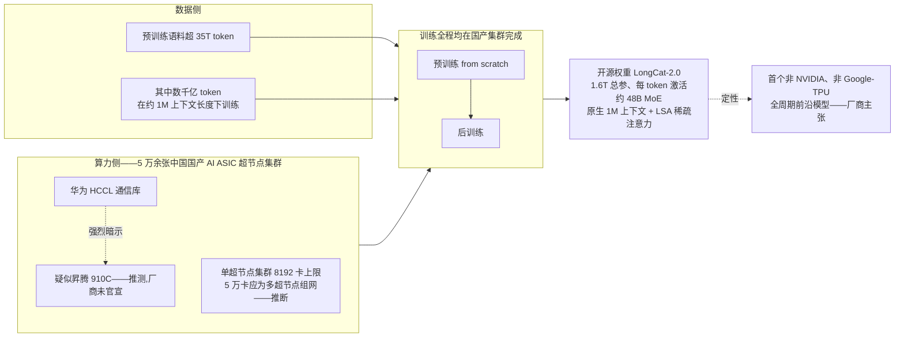
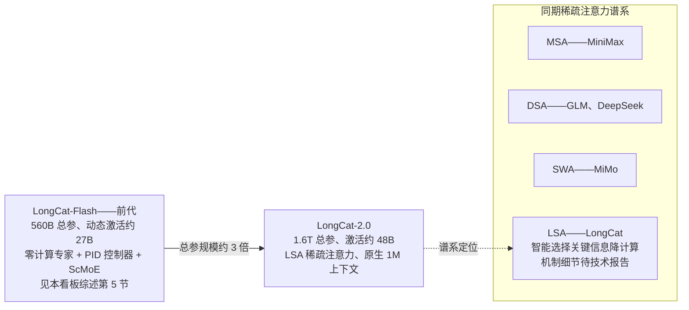
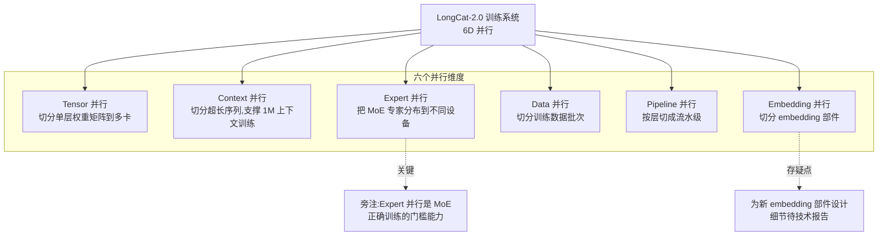
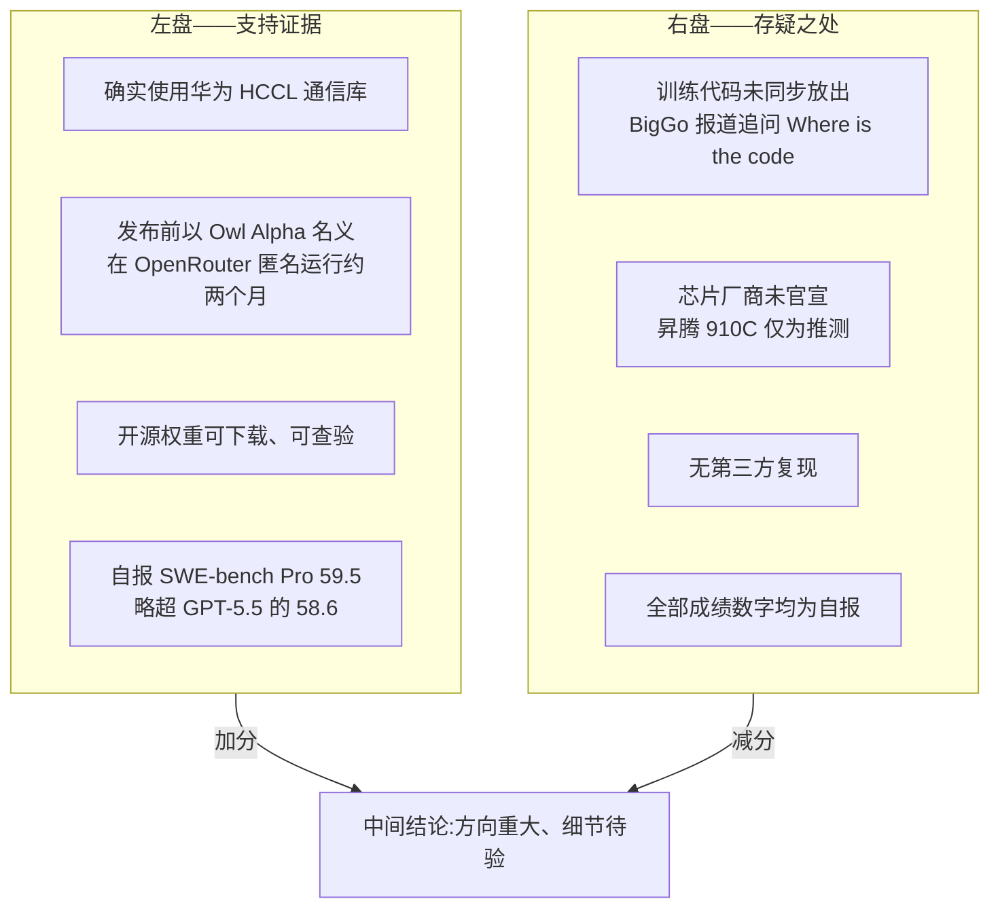

# Dispatch 21 · 详解 LongCat-2.0:国产芯片全周期训练闭环的最强实证

*2026-07-07 · NPU Frontier Dispatch · LongCat-2.0 / domestic-chips / MoE / RL-on-NPU*

> **TL;DR** — 美团开源 **LongCat-2.0**:1.6T 总参/激活约 48B 的 MoE(与 DeepSeek V4-Pro 同档同稀疏度)、原生 1M 上下文、新的 LongCat Sparse Attention(LSA,机制细节待技术报告)。核心主张:**预训练(35T+ token,含数千亿 1M 长度)与后训练全程在 5 万余张中国国产 AI ASIC 超节点上完成**——首个非 NVIDIA、非 TPU 全周期前沿模型(厂商主张;用华为 HCCL,疑似昇腾 910C 但未官宣)。系统亮点是 **6D 并行**(tensor/context/expert/data/pipeline/embedding)。证据分级:权重与推理=可验(Owl Alpha 匿名跑了两个月);训练闭环=方向可信、细节待验(训练代码未放、无第三方复现);芯片型号=推测。若主张成立,本看板综述"国产训练少有公开实证"的判断需要改写——与 openPangu(Dispatch 20)恰好互补:一个给规模实证、一个给代码参考。数字均 self-reported/provisional。

应上周动态扫描(LongCat-2.0 卡片)的深挖要求。承接本看板 Dispatch 03(SuperPoD)、05(V4-Pro)、09(EP 门槛)、12(SWE Pro 口径)、13(四坑)、20(openPangu)、架构综述 §5/§10。

---

## 1 · 一句话为什么重要

本看板需要先修正自己的一条既有判断。架构综述 §10 的信源纪律第 4 条写过一句 framing:**"国产芯片做推理是真的,做训练更难且少有公开实证。"** 这句话在过去一年基本成立——国产加速器上跑推理服务的案例不少,但"从零开始把一个前沿规模模型完整训出来"的公开实证几乎为零。LongCat-2.0 如果主张成立,就是这条判断迄今最强的反例:

- **前沿规模**:1.6T 总参数、约 48B 激活的 MoE,与 DeepSeek V4-Pro(1.6T/49B,Dispatch 05)同档;
- **全周期**:美团主张 from scratch 预训练 + 后训练(含 RL)全程完成,不是"预训练在 NVIDIA 上、微调搬到国产卡上"的半闭环;
- **规模化基础设施**:5 万余张中国国产 AI ASIC,组成多个超节点集群。

厂商称这是**首个非 NVIDIA、非 Google-TPU 的全周期前沿模型**(注意:这是厂商主张,第 4 节给出分级可信度)。即便打折扣,这也把"国产芯片能不能训前沿模型"的讨论从思想实验拉进了有开源权重可查验的现实。诚实地说:如果证据链继续坐实,综述 §10 那条判断需要改写。

## 2 · 模型本体:1.6T/A48B + LSA + 1M

**参数与稀疏度定位。** LongCat-2.0 为 1.6T 总参数、激活约 48B 的 MoE,激活比约 3%(以下模型参数均为厂商自报/provisional)。放进同档坐标系:

| 模型 | 总参 | 激活 | 激活比 |
|---|---|---|---|
| LongCat-2.0 | 1.6T | ~48B | ~3% |
| DeepSeek V4-Pro(Dispatch 05) | 1.6T | 49B | ~3% |
| GLM-5.2(Dispatch 06) | 753B | 40B | ~5.3% |

可以看到 LongCat-2.0 与 V4-Pro 在总参和稀疏度上几乎完全同档——这大概率不是巧合,而是当前一线团队对"推理成本 vs 容量"权衡收敛到的同一个甜点区。相比前代 LongCat-Flash(560B 总参/动态激活约 27B,零计算专家 + PID 控制器 + ScMoE,综述 §5),这一代总参扩了近 3 倍,且从"动态激活数"的花活回到了更接近主流的固定稀疏 MoE 形态(是否保留零计算专家等机制,待技术报告确认)。

**LSA:目前只有定性口径。** LongCat Sparse Attention 在媒体口径中仅被描述为"智能选择关键信息"——这是一句几乎没有信息量的话。它可能是 top-k 稀疏注意力、可能是分块检索式、也可能是可学习的 token 选择,但在技术报告放出前,**任何压缩比、top-k 值、块大小的数字都是编造**,本文不给。唯一确定的是:它是原生 1M 上下文能落地的机制前提之一。

**1M 是原生的,不是外推的。** 预训练总量超 35T token,其中**数千亿 token 是在约 1M 上下文长度下训练的**(自报)。这个细节值得展开:市面上很多"长上下文"模型是短序列训练 + RoPE 缩放外推,长文能力靠位置编码技巧撑;而在 1M 长度上真金白银烧数千亿 token,意味着注意力模式、长程依赖是训出来的而非插值出来的。代价也直观——1M 长度下即便有稀疏注意力,单条序列的激活显存和通信量都是天文数字,这直接引出下一节的 context 并行需求。

## 3 · 系统:5 万卡超节点 + HCCL + 6D 并行

**HCCL 是事实上的昇腾指纹。** 美团没有官宣芯片型号,但明确使用华为 HCCL 通信库。HCCL 之于昇腾,如同 NCCL 之于 NVIDIA——它不跑在别家硬件上。因此"底层是昇腾、疑似 910C"是合理推测(**推测,非官宣**)。这里与上周动态形成呼应:vLLM-Ascend v0.22.1rc1 刚打通 HCCL 权重传输后端,把 RL 训推之间的权重同步从 NCCL 依赖中解放出来。LongCat-2.0 主张后训练(含 RL)也在同一套国产栈上完成——如果为真,说明美团内部早就解决了 vLLM-Ascend 上周才在开源侧补上的这块拼图。

**6D 并行逐维拆解。** 官方口径为 tensor / context / expert / data / pipeline / embedding 六维并行:

- **Tensor(TP)**:单层内切分,超节点内高带宽域是它的存活前提;
- **Context(CP)**:1M 序列的刚需——单卡放不下一条序列的激活,必须沿序列维切分,配合 LSA 的稀疏模式做通信;
- **Expert(EP)**:MoE 的命门。Dispatch 09 说过"只有 Megatron 系能正确做 EP"——正确的 EP 意味着 all-to-all 路由、专家负载均衡、与 TP/PP 的正交组合都要在通信库层面做对。**如果国产栈(HCCL 之上)真把 1.6T MoE 的 EP 做正确了,这本身就是比模型分数更重要的系统成果**;
- **Data(DP)**:5 万卡规模的最外层扩展维;
- **Pipeline(PP)**:1.6T 参数跨节点分层的必然选择;
- **Embedding**:第六维是新东西,官方称为新的 embedding 部件设计的专用并行维度,机制细节待技术报告——不做猜测。

**5 万卡 = 多超节点组网(推断)。** 参照 Dispatch 03:Atlas 950 SuperPoD 单集群规模为 8192 卡。5 万余卡意味着至少 6-7 个超节点级集群互联(**推断,组网拓扑未公开**)。这把难度从"超节点内高带宽域调度"升级到"跨超节点的层级化通信"——DP/PP 跨域、TP/EP 尽量域内,是教科书式的切法,但在昇腾组网上做到 5 万卡尺度,此前没有任何公开先例。

## 4 · 证据与质疑:该信多少

**支持面:** ① **Owl Alpha 匿名运行两个月**——发布前该模型以 "Owl Alpha" 名义在 OpenRouter 匿名服务约两个月,承接真实生产流量,排除了"发布会 demo 模型"的可能,推理侧的稳定性和质量经过了盲测环境检验;② **权重开源**——1.6T 权重可下载,架构、参数量、激活比任何人可验;③ **技术细节的具体性**——HCCL、6D 并行、embedding 并行这类细节具体到"编不出来"的程度,造假通常给模糊大词,不会给可被内行证伪的具体指纹。

**质疑面:** ① BigGo 的 **"Where's the code?"**——训练代码与完整技术细节未同步放出,全周期训练闭环这一核心主张目前完全依赖厂商自述;② **芯片未官宣**,5 万卡的具体构成、故障率、MFU 等关键工程数字一概没有;③ **无第三方复现**,所有 benchmark 均为自报。

**SWE-bench Pro 59.5 的口径警示。** 自报 59.5、略超 GPT-5.5 的 58.6——但按 Dispatch 12 的教训处理:标准化 harness 下 GPT-5.4 得 59.1,而厂商自报的 Opus 成绩曾达 69.2,**自报分数与标准化分数不可直接比较**,scaffold、重试次数、超时设置都能造出几个点的差距。59.5 这个数字在第三方以统一 harness 复现之前,只能视为"大致在第一梯队"的弱信号。

**分级结论:**

| 主张 | 可信度 |
|---|---|
| 权重真实存在、推理能力属实 | **可验**(权重开源 + OpenRouter 两个月生产流量) |
| 全周期国产芯片训练闭环 | **方向可信、细节待验**(技术指纹具体,但无代码、无第三方) |
| 芯片为昇腾 910C | **推测**(HCCL 指纹强,型号未官宣) |
| SWE-bench Pro 59.5 超 GPT-5.5 | **存疑**(自报 vs 标准化口径不可比) |

## 5 · 对 RL-on-NPU 主线的意义

Dispatch 13 总结过 RL-on-NPU 的四个坑:无 sleep-mode(训推显存无法优雅让渡)、训推 logprob 不一致、长 rollout 的调度与容错、代码执行沙箱。这四个坑此前是"国产栈做 RL 后训练"的公认拦路虎。

LongCat-2.0 的主张若成立,意味着**这四个坑在 5 万卡尺度上已经被完整解决过一遍**——1.6T MoE 的 RL 后训练绕不开其中任何一个。但解法没有开源,我们只知道"有人趟过去了",不知道怎么趟的。

这就与同期的 Dispatch 20(openPangu)形成精确互补:

- **openPangu**:昇腾后训练代码**开源可读**,但模型小,不回答"这套代码撑不撑得起前沿规模";
- **LongCat-2.0**:给出**前沿规模的实证**(若成立),但代码黑箱,不回答"具体怎么做"。

一个给规模实证、一个给代码参考,合起来才接近完整答案。更重要的是问题性质的转变:在此之前,"国产芯片能不能做前沿模型全周期训练"是一个**能不能**的问题;LongCat-2.0 之后(在其主张成立的前提下),它变成了一个**怎么做**的问题——存在性证明已给出,剩下的是工程知识的扩散速度。这对整个国产训练生态是质变级的心理与路线信号。

## 6 · 下一步看什么

1. **技术报告与训练代码是否放出**——这是把"方向可信"升级为"可验"的唯一路径,尤其关注 MFU、故障恢复、跨超节点通信的真实数字;
2. **LSA 机制细节**——稀疏模式是静态还是可学习、与 CP 如何配合、1M 长度下的实际计算量;
3. **SWE-bench Pro 第三方标准化复现**——按 Dispatch 12 口径,只认统一 harness 下的数字;
4. **芯片型号官方确认**——910C 与否、超节点具体形态、5 万卡的组网拓扑;
5. **与 openPangu 栈的交叉验证**——若社区能用 openPangu 的开源后训练代码在昇腾上复现 LongCat-2.0 权重的 RL 微调,四坑解法就完成了从"内部实证"到"公共知识"的闭环;
6. **embedding 并行的定义**——第六维并行到底并行了什么,是这次系统设计里最陌生的一块,待报告揭晓。

一句话收束:权重是真的,推理是真的,训练闭环大概率方向为真但细节欠账——欠的这笔账,决定了 LongCat-2.0 是国产训练生态的里程碑,还是仅仅一座无法复制的孤峰。

---

*来源:SCMP、MarkTechPost、BigGo 等媒体报道与 LongCat 官方发布页;本看板 Dispatch 03/05/06/09/12/13/20 与架构综述 §5/§10。全文厂商数字均 provisional/self-reported:训练闭环主张无第三方复现,芯片型号为推测,SWE-bench Pro 为自报口径,以技术报告与训练代码放出后为准。*
