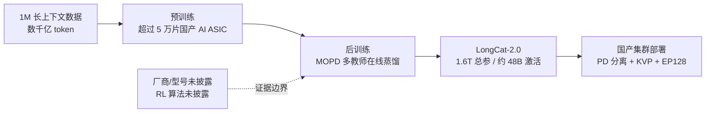
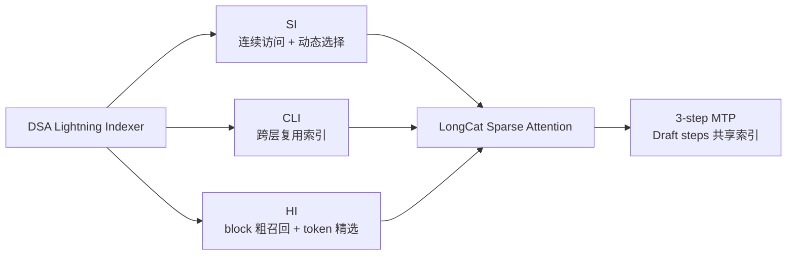

# Dispatch 21 · 详解 LongCat-2.0:国产芯片前沿训练闭环的官方实证

*2026-07-07 · 2026-07-13 官方来源校正 · NPU Frontier Dispatch · LongCat-2.0 / domestic-chips / MoE / post-training*

> **TL;DR** — 美团官方发布的 **LongCat-2.0** 是 1.6T 总参、每 token 激活约 48B 的 MoE,原生 1M 上下文。它不只给出“5 万卡国产芯片训练”的结论,还公开了 LSA 的 SI/CLI/HI 三种索引优化、135B 5-gram Embedding、6D 并行、Muon、512 路以上 context parallel、确定性算子和 MOPD 多教师在线蒸馏。官方明确:完整训练与大规模部署都构建在国产 AI ASIC 超节点上,预训练使用超过 5 万片芯片。但官方**没有披露芯片厂商/型号,也没有披露 PPO/GRPO、reward、rollout 或 policy update**。因此它是“前沿规模国产芯片预训练 + 后训练 + 部署”的强厂商实证,不是已经公开验证的 RL-on-Ascend 证据。所有性能与系统增益仍属 self-reported/provisional。

这次校正以 [LongCat-2.0 官方发布页](https://longcat.ai/blog/longcat-2.0/) 为主来源。此前媒体口径中的 HCCL、昇腾 910C、35T+ 总训练 token 和“后训练即 RL”均不再作为官方确认事实。

---

## 1 · 一句话为什么重要

本看板曾用“国产芯片做推理是真的,做训练更难且少有公开实证”概括行业状态。LongCat-2.0 让这句话需要加上一个重要例外:

- **前沿规模**:1.6T 总参数、约 48B 激活的 MoE;
- **完整链路**:官方称 full training run 与 large-scale deployment 均构建在国产 AI ASIC 超节点上;
- **集群规模**:预训练使用超过 5 万片国产算力芯片,后训练的 MOPD 能力融合运行在数万卡集群;
- **系统细节**:公开到并行维度、确定性算子、显存管理、长上下文训练、推理解耦和故障恢复,不是只给一张发布会数字图。

这仍不是一份可复现训练报告:训练代码、完整数据配方、MFU、故障率与第三方复现均未公开。更准确的结论是:官方给出了高具体度的存在性证据,但尚未给出公共复现路径。

## 2 · 模型本体:LSA + 5-gram + 3-step MTP

**参数与稀疏度。** LongCat-2.0 为 1.6T 总参数、每 token 激活约 48B,激活比约 3%。相比前代 LongCat-Flash 的 560B/动态约 27B,总参数扩大近 3 倍;ScMoE 和零计算专家仍出现在官方系统说明中,但发布页没有给出完整专家数与路由配置。

**LSA 已不再是“机制待确认”。** 官方把 LongCat Sparse Attention 描述为从 DeepSeek Sparse Attention 演进而来,核心问题是 DSA Lightning Indexer 的不连续索引访问与二次方评分开销。LSA 给出三项可独立开关的优化:

1. **Streaming-aware Indexing (SI)**:把硬件对齐的连续访问与动态随机选择结合,将部分碎片化 HBM 访问变成可合并的顺序读取;
2. **Cross-Layer Indexing (CLI)**:利用相邻层重要 token 分布的一致性,通过训练期跨层蒸馏让一次索引结果被多个连续注意力层复用;
3. **Hierarchical Indexing (HI)**:先做 block 级近似召回,再在候选中做细粒度 token 选择;在 LongCat-2.0 中作为 training-free 插件,仅对部分超长上下文任务启用。

LSA 还被扩展到 **3-step MTP**:Target 模型每两个连续层共享一次索引,三个 Draft step 则共用 Step 1 的索引结果。这一点很关键,因为它把稀疏索引成本与投机解码放进同一套系统设计里。

**N-gram Embedding。** 模型继承 LongCat-Flash-Lite 的 N-gram Embedding,n-gram size 设为 5,包含 135B 参数,约占 1.6T 总参的 8.4%。官方解释是:标准 MoE 稀疏度已接近 97%,继续增加同量专家参数的边际收益较低;把参数放到与 MoE 正交的 N-gram 稀疏维度,还能降低大 batch decode 的显存 I/O。

**1M 是训练出来的。** 官方称预训练覆盖数千亿 token 的 1M-context 数据,并使用 512 路以上 all-gather context parallel。这里能确认的是长上下文训练量级;此前媒体提到的 35T+ 总预训练 token 不在本次官方发布页中,保留为 secondary/provisional,不再混入官方口径。

## 3 · 训练系统:5 万卡、6D 并行与确定性

官方称预训练在超过 5 万片国产算力芯片上完成,系统优化相对朴素实现把训练吞吐提升 **超过 35%**。关键路径包括:

- **6D 并行**:TP / CP / EP / DP / PP 之外增加 EMBP,专门并行 135B N-gram Embedding;
- **物理超节点**:每个超节点最多 48 台机器,节点内全互联高带宽、节点间使用 RoCE;官方自报超节点相对同规模实现额外提升约 30% 预训练吞吐;
- **显存管理**:ZeRO-1、选择性重计算、分配器层 OOM 自动卸载,并把 padding token 路由到零计算专家;
- **Muon**:围绕 TP、DP 状态去冗余和对称矩阵乘核做国产芯片专项优化;
- **长上下文**:512 路以上 context parallel,LSA top-k 索引与 KV all-gather 重叠,ScMoE 通信与并行分支计算重叠;
- **确定性与可靠性**:自研 Embedding/FA/LSA/MoE 确定性算子,规约使用二叉树分段累加,部分计算密集算子加入比特翻转检测,链路故障识别、切流和恢复无需人工介入。

这些细节大幅提高了系统主张的可评估性,但不能反推出具体芯片。官方只写 **AI ASIC / 国产算力芯片**,没有出现 Ascend、910B/910C 或 HCCL。芯片品牌与型号必须继续标记为 unknown。

## 4 · 推理系统:从长上下文到 PD 分离

推理侧同样围绕低显存容量、有限 HBM 带宽和互联带宽设计:

- Attention 使用 absorb 模式,让 indexer 与 MLA prolog 并行,并以 KVP 把 KV cache 切到多卡;
- ScMoE 利用加速器的显式控核能力分配 dense 与 MoE 流,让两个分支完整并行;
- 通过 super kernel 降低启动开销,利用较大 L2 cache 预取权重;
- 采用 prefill-decode 分离:prefill 使用多节点 CPP + SP,decode 使用 KVP + EP128;
- 芯片内置 200 Gbps 网卡承担 layer-wise 的 PD 节点 KV-cache 传输,主机 RDMA 构建 KV-cache store;
- EPLB 的统计与分布计算异步化,并兼容 constrained decoding、multi-step scheduling 与 MTP。

对 RL rollout 而言,KVP、PD 分离、MTP 和异步 EPLB 都是直接相关的推理基础设施信号;但它们仍是部署架构,不是训练算法或实验曲线。

## 5 · 后训练:确认了什么,没有确认什么

官方披露的是 **MOPD 多教师在线蒸馏**。教师被分成三组:

- Agent 能力专家:代码、办公、检索、复杂工具调用、多轮 API 参数解析与防循环;
- 推理能力专家:数学、STEM、多跳知识推理和按难度自适应计算;
- 交互体验专家:指令遵循、事实性幻觉抑制与安全边界。

三组能力最终在数万卡国产集群上融合。这足以支持“国产芯片后训练已在前沿规模跑通”的厂商主张,但**不足以支持“RL-on-NPU 已公开验证”**。发布页没有给出:

- PPO、GRPO 或其他 policy optimization 算法;
- reward model、verifier 或 advantage 计算;
- rollout engine、采样规模、轨迹调度或 policy/logprob 一致性;
- reward、KL、entropy、loss 等训练曲线。

所以 LongCat-2.0 与本站的真实 910B 曲线应当分开理解:前者是大规模国产 AI ASIC 训练/部署的官方系统案例;后者是明确标注 Ascend 910B 的公开硬件遥测证据。两者互补,不能相互替代。

## 6 · 证据分级

| 主张 | 当前结论 |
|---|---|
| 1.6T/A48B、LSA、135B 5-gram、3-step MTP | **官方自报,细节明确** |
| 超过 5 万片国产 AI ASIC 完成预训练 | **官方自报,无第三方复现** |
| 完整训练与部署构建在国产 AI ASIC 超节点 | **官方自报,系统细节较充分** |
| MOPD 多教师在线蒸馏运行在数万卡国产集群 | **官方自报,算法配方未开源** |
| 芯片是昇腾 910C / 使用 HCCL | **未由官方页面确认** |
| 已完成 PPO/GRPO 等 RL-on-Ascend | **证据不足** |
| 官方 benchmark 优于闭源模型 | **内部 harness 自测,待统一第三方复现** |

## 7 · 下一步看什么

1. 训练代码、模型配置与完整技术报告是否发布;
2. 芯片厂商、型号、精度格式、MFU、故障率与能效是否披露;
3. SI/CLI/HI 的 top-k、块大小、索引开销与 1M-context 消融;
4. MOPD 是否包含强化学习阶段,若包含则看 rollout、reward、KL 和训练稳定性;
5. 第三方统一 harness 下的代码、Agent 与长上下文复现;
6. 公开 Ascend/其他国产加速器推理或微调适配是否落地。

一句话收束:LongCat-2.0 已经把“国产芯片能否支撑前沿规模完整训练”从抽象讨论推进到一份细节丰富的官方系统案例;但在训练代码、芯片身份和 RL 配方公开前,它仍是高价值的厂商实证,还不是可复现的 RL-on-NPU 基准。

---

*主来源:[Introducing LongCat-2.0](https://longcat.ai/blog/longcat-2.0/),2026-06-30。架构前序参考:[LongCat-Flash](https://arxiv.org/abs/2509.01322)、[LongCat-Flash-Lite](https://arxiv.org/abs/2601.21204)。全文厂商数字均 self-reported/provisional;芯片厂商/型号、RL 算法与第三方复现状态均按“未披露/待验证”处理。*
