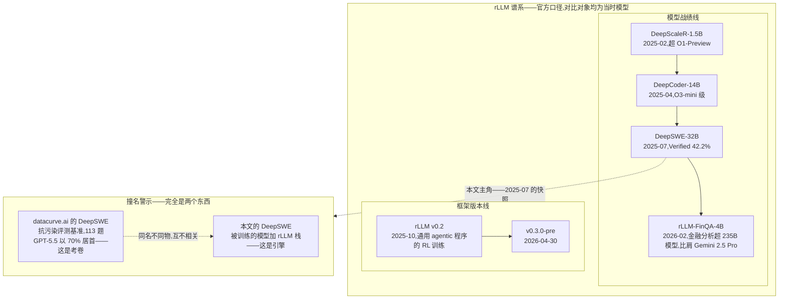
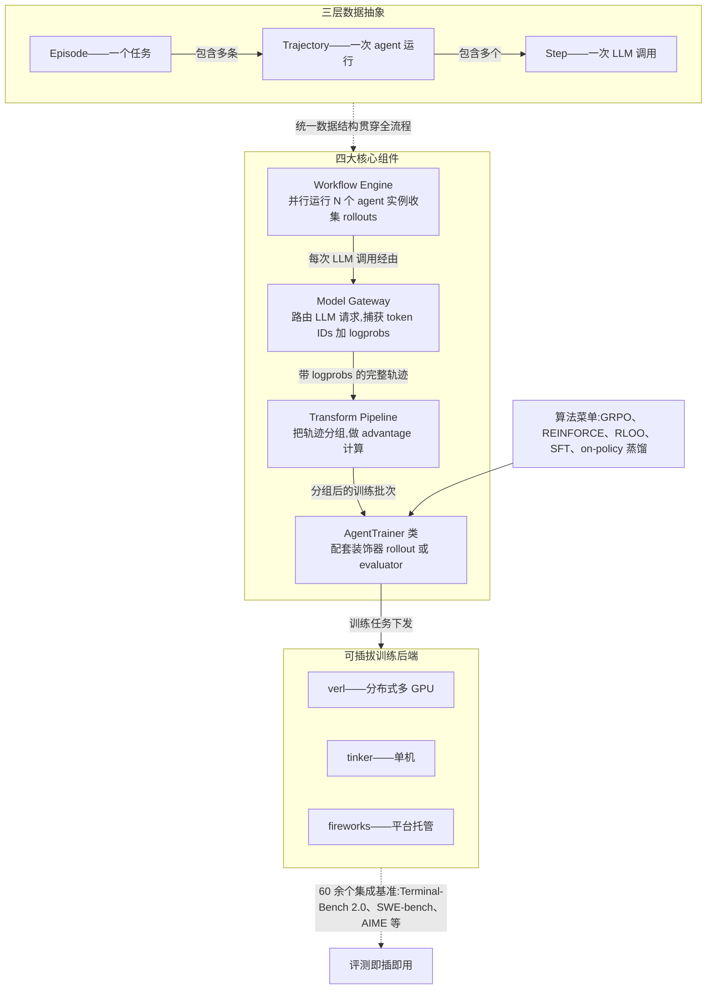
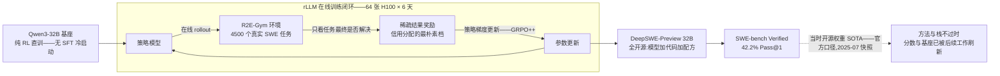
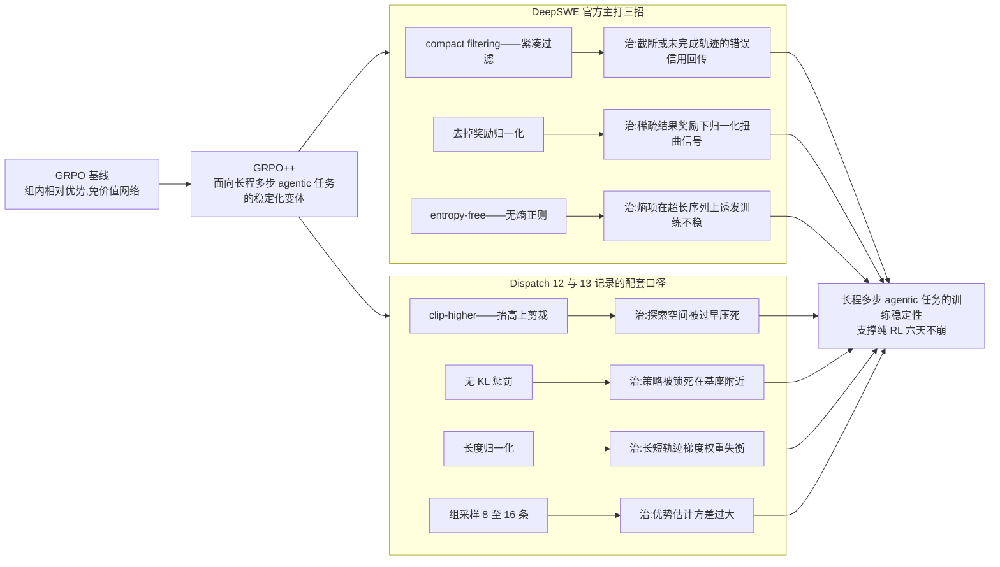
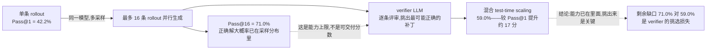

# Dispatch 22 · 详解 DeepSWE 与 rLLM:纯 RL 编码智能体的开源全家桶

*2026-07-07 · NPU Frontier Dispatch · DeepSWE / rLLM / pure-RL / SWE-agents / RL-on-NPU*

> **TL;DR** — **DeepSWE**(Agentica × Together AI,2025-07)在 Qwen3-32B 上**纯 RL、零 SFT**,靠 **GRPO++** 稳定化撑住 6 天训练。三个分数分开读:**Pass@1 42.2%、Pass@16 71.0%、混合 TTS 59.0%**——正确解已在采样分布里,verifier 挑选换来约 17 分。背后的 rLLM 框架以 **Episode ⊃ Trajectory ⊃ Step** 三层抽象 + 可插拔后端(verl/tinker/fireworks)构成通用 agentic RL 底座。撞名警示:datacurve 的 "DeepSWE" 是评测基准(考卷),本文讲的是模型 + 训练栈(引擎)。对昇腾:GRPO++ 配方已被 Dispatch 13 采纳,后端可插拔是通往 NPU 的现成接口。分数均 provisional。

本篇承接 Dispatch 08(信用分配谱系)、12(SWE agent 训练路线与"阻力最小起点"推荐)、13(昇腾 SWE-RL 方案)、14(ScaleSWE 蒸馏路线)、18(SkyRL-Agent 纯 RL 对照),把此前多处提及但未系统展开的 DeepSWE / rLLM 栈一次讲透。

---

## 1 · 先把名字掰清:此 DeepSWE 非彼 DeepSWE

先做一个必要的消歧,因为撞名会造成实质性误读:datacurve.ai 也发布过一个叫 "DeepSWE" 的东西,那是一个**抗污染评测基准**——113 道题的考卷,榜首是 GPT-5.5(70%)。而本文要讲的 DeepSWE 是 Agentica × Together AI 在 2025 年 7 月发布的**模型 + RL 训练栈**(HF: `agentica-org/DeepSWE-Preview`)。一个是考卷,一个是被训练的模型和训练它的引擎,完全是两个物种。如果你在检索资料时看到"DeepSWE 上 GPT-5.5 排第一"之类的说法,那说的是 datacurve 那张考卷,与本文无关。以下所有内容均指 Agentica 的 DeepSWE 模型及其背后的 rLLM 框架。

### 图 E · 谱系与撞名警示——同名不同物

## 2 · rLLM:从 DeepSWE 的训练系统到通用 agentic RL 框架

rLLM 出自 Agentica 团队(Berkeley Sky Computing Lab),Apache-2.0 开源,与 Together AI 研究合作,支持方包括 Laude Institute、AWS、Hyperbolic、Fireworks、Modal。它的口号很直白:**"Agentic RL on any harness, with any backend, on any benchmark"**——任意 agent 脚手架、任意训练后端、任意基准。

版本演化线值得注意:v0.2(2025-10)的主题是 "RL Training for General Agentic Programs",即从"训一个编码 agent 的专用系统"泛化为"训任意 agentic 程序的通用框架";v0.3.0-pre 已于 2026-04-30 发布(具体 API 变化本文未深查,不展开)。从这条主题演化线可以合理推断:rLLM 先是服务于 DeepSWE 这类具体模型训练的系统,之后才泛化成通用框架——若确实如此,这个演化顺序也解释了它的抽象为什么天然贴合多步 agent。

**三层抽象:Episode ⊃ Trajectory ⊃ Step。** 一个 Episode 是一个任务;一条 Trajectory 是一次完整的 agent 运行;一个 Step 是一次 LLM 调用。这个层级为什么重要?因为多步 agent 的 RL 与单轮 RLHF 的本质区别就在于:奖励挂在 Episode/Trajectory 级,而梯度要落到 Step 级的每个 token 上。把这三层显式建模出来,信用分配、轨迹分组、advantage 广播才有清晰的挂载点,而不是像单轮框架那样把多轮对话硬压扁成一个 prompt-response 对。

**Model Gateway:训推一致的第一现场。** Gateway 负责路由所有 LLM 请求,并在推理时捕获 **token IDs 和 logprobs**。这一点的深意常被低估:agentic RL 最阴险的 bug 来源是训练引擎与推理引擎对同一段文本的 tokenization / logprob 不一致(采样时是一个分布,回传梯度时按另一个分布算 importance ratio)。在网关层把推理侧的 token IDs 和 logprobs 原样捕获下来,就是训推一致性检查(即本看板一直强调的 align-probe 思路)的天然探针位——不用事后重算,第一现场证据直接留存。

**其余组件各司其职:** Workflow Engine 并行跑 N 个 agent 实例收集 rollouts(组采样的物理执行层);Transform Pipeline 把轨迹分组、做 advantage 计算(GRPO 的组内归一化就发生在这里);AgentTrainer 类封装训练循环,配合 `@rllm.rollout` / `@rllm.evaluator` 装饰器,把用户自己的 agent 逻辑和评测逻辑挂进框架。

**后端可插拔:** verl(分布式多 GPU)、tinker(单机)、fireworks(平台托管)三档,从笔记本原型到集群生产覆盖。这与 Dispatch 18 讲过的 SkyRL-Agent 的"后端无关"哲学同源——两者同属 Berkeley 系,共享一个判断:agent 逻辑、rollout 编排与训练后端应该解耦,后端只是可替换的执行引擎。算法覆盖 GRPO、REINFORCE、RLOO、SFT、on-policy distillation;基准集成 60+,含 Terminal-Bench 2.0、SWE-bench、SkillsBench、AIME、MATH-500、GPQA 等。这个覆盖面意味着它不只是"复现 DeepSWE 的脚本",而是可以直接换任务、换算法开新实验的底座。

### 图 A · rLLM 框架解剖——三层抽象、四大组件、可插拔后端

## 3 · DeepSWE:纯 RL、无 SFT 的反共识配方

主流的 SWE agent 训练路线几乎都有 SFT 环节:要么先蒸馏冷启动再 RL(Dispatch 12 梳理过的分步清单),要么干脆 SFT-only 到底(Dispatch 14 的 ScaleSWE:71k 轨迹蒸馏 SFT,不碰 RL)。DeepSWE 反其道而行:在 **Qwen3-32B 上直接纯 RL,零 SFT**——用 rLLM 在 R2E-Gym 的 4500 个真实软件工程任务上训练,64 张 H100 × 6 天,稀疏结果奖励(补丁过测试才给分)。

为什么这条反共识路线可行?三个条件缺一不可:

1. **基座已够强。** Qwen3-32B 本身具备基本的工具使用与代码理解能力,RL 只需要把已有能力"对齐到任务分布",不需要从头教会它用编辑器。基座不够强时纯 RL 会陷入零奖励荒漠,这也是多数团队要 SFT 冷启动的原因。
2. **环境奖励信号干净。** R2E-Gym 的 4500 个真实任务可执行、测试可判——稀疏奖励最怕的是奖励本身有噪声(测试 flaky、环境坏掉),那会直接毒化梯度。
3. **算法稳定化。** 长程多步任务下原版 GRPO 会崩,GRPO++(下节详拆)是撑住 6 天训练不崩的关键。

**成本量级的意义:** 64 H100 × 6 天,折合约 9200 GPU 时(64 × 24 × 6 ≈ 9216),这是学术实验室和中型团队踮脚够得着的量级——不是预训练那种千卡月级投入。全开源(模型 + 代码 + 配方,repo 内有 `reproduction/DEEPSWE_REPRODUCTION.MD`)加上这个成本档位,正是 Dispatch 12 把 DeepSWE 栈评为"阻力最小起点"的原因。

**回应一个常见疑问:"稀疏结果奖励算不算真 RL?"** 算,而且是标准形态。DeepSWE 是真交互式 agentic RL:agent 在环境里在线 rollout(读代码、改文件、跑测试,多步交互),用策略梯度更新。稀疏结果奖励只是信用分配谱系(Dispatch 08)里最朴素的一档——不做过程奖励、不做步级打分,让组内对比(GRPO 的相对 advantage)隐式完成信用分配。朴素不等于不是 RL;恰恰相反,这是最不容易被 reward hacking 的一档。

### 图 B · DeepSWE 训练闭环——纯 RL、无 SFT、稀疏结果奖励

## 4 · GRPO++ 逐项拆解

GRPO++ 是 DeepSWE 提出的稳定化 GRPO 变体,每一项都对应长程 agentic 场景下的一种具体病症:

- **Compact filtering(紧凑过滤)**:过滤掉被截断、超出最大长度而未完成的轨迹,不让它们参与梯度。病症:一条被上下文长度硬切断的轨迹,其"失败"不是策略的错,拿它算负 advantage 会教模型学到错误的规避行为(比如提前敷衍收尾)。这与 Dispatch 13 讨论过的"截断轨迹给 0 分但不丢弃"是同一问题域的两种取舍——过滤是更激进的一端,代价是有效样本量减少,收益是梯度更干净。
- **去掉奖励归一化(reward normalization removal)**:稀疏 0/1 奖励下,组内标准差归一化会在"全对"或"全错"的组附近产生病态缩放,放大噪声;直接用原始奖励做组内对比更稳。
- **Entropy-free(无熵正则)**:长序列上熵正则会系统性推高不确定性,在几千步 token 的 agentic 轨迹上累积成胡言乱语式的崩坏;去掉它,探索靠组采样的多样性(每任务 8–16 条 rollout)来保证。
- **Clip-higher**(Dispatch 12/13 记录的口径):放宽 PPO 裁剪上界,给低概率但正确的 token 更大的上调空间,对抗熵坍缩。
- **无 KL 惩罚**:纯 RL 场景没有"要贴住的 SFT 参考策略",KL 项只会拖住学习;去掉它同时省掉 reference model 的显存。
- 另含**长度归一化**与**组采样 8–16** 的配置口径(同 Dispatch 12/13 记录)。

共同主线:长程多步任务把 RLHF 时代的默认正则项全部变成了负资产——它们都是为单轮短序列设计的。GRPO++ 的哲学是做减法,只留能在长 horizon 下自洽的部分。这也是 Dispatch 13 的昇腾方案直接照单采用 GRPO++ 的原因:它是目前长程 agentic RL 稳定性上验证最充分的公开配方,换硬件平台不改变这些算法层面的病理。

### 图 C · GRPO++ 稳定化改造——每一招治什么

## 5 · 混合 test-time scaling:17 分从哪来

DeepSWE 的三个分数要分开读(均 provisional):**Pass@1 = 42.2%,Pass@16 = 71.0%,混合 TTS = 59.0%**(SWE-bench Verified)。

Pass@16 高达 71% 说明:对大多数任务,**正确解已经在采样分布里**——采 16 次总有一次对。瓶颈不是"模型不会",而是"挑不出来"。混合 test-time scaling 就是攻这个选择问题:最多采 16 条 rollout,再用一个 verifier LLM 从中挑选最可能正确的补丁,最终落在 59.0%,比 Pass@1 提升约 17 分。verifier 没能吃满 Pass@16 的全部空间(59 < 71),说明"判断哪个补丁对"本身也是个未解难题,但 17 分的增量已经证明:在 agentic 编码任务上,采样 + 验证的 test-time 计算换分数,性价比极高。

**口径警示:** 42.2 和 59.0 不可混报。前者是单次推理的模型能力,后者是叠加了 16 倍推理开销 + verifier 的系统能力。看到任何"DeepSWE 59%"的说法,要意识到那是 TTS 口径;与其他模型的 Pass@1 直接并排比较是不公平的——反之亦然。

### 图 D · 混合 test-time scaling——能力已在里面,挑出来是关键

## 6 · 效果与生态位(provisional)

| 方法 | 基座 | 路线 | SWE-bench Verified | 口径 |
|---|---|---|---|---|
| DeepSWE-32B | Qwen3-32B | 纯 RL,无 SFT | 42.2% | Pass@1(provisional) |
| DeepSWE-32B | Qwen3-32B | 同上 + 采样 16 | 71.0% | Pass@16(provisional) |
| DeepSWE-32B | Qwen3-32B | 同上 + verifier TTS | 59.0% | 混合 TTS(provisional) |
| SA-SWE-32B(SkyRL-Agent,Dispatch 18) | Qwen3-32B | 纯 RL(24.4→39.4) | 39.4% | Pass@1(provisional) |
| ScaleSWE(Dispatch 14) | Qwen3-30B | 蒸馏-SFT-only(71k 轨迹),无 RL | 64% | 官方口径(provisional) |
| Kimi-Dev(Dispatch 12) | — | Agentless 先验 + RL | 60.4% | 官方口径(provisional) |

几条解读:

- **开源纯 RL 带在 ~40%。** DeepSWE 42.2% 与 SA-SWE-32B 39.4% 同基座(Qwen3-32B)、同纯 RL 路线,落在同一水位,这是当前"不喂蒸馏数据、只靠环境奖励"能到的公开水平。而蒸馏/先验路线(ScaleSWE 64%、Kimi-Dev 60.4%)在 60%+。
- **但这两个带不可直接比。** 基座不同、scaffold 不同、评测口径不同;更本质的是,蒸馏路线的分数里含有教师模型的能力转移,纯 RL 的分数是环境交互从基座里"挤"出来的。它们回答的是不同的科学问题。
- **引擎与燃料,组合而非替代。** 本看板此前问答里的定位仍然成立:DeepSWE 提供的是引擎(可复现的 agentic RL 栈),ScaleSWE 提供的是燃料(大规模 SFT 轨迹数据)。最自然的组合是 SFT 冷启动 + rLLM/GRPO++ 继续 RL——两条路线在实践中是上下游,不是对手。
- **快照已旧,栈不过时。** DeepSWE 是 2025-07 的快照,基座与分数早已被后续工作刷新(Agentica 自己的模型线也走到了 2026-02 的 rLLM-FinQA-4B——金融分析上超 235B 模型、比肩 Gemini 2.5 Pro,其前序还有 DeepScaleR-1.5B 超 O1-Preview、DeepCoder-14B 达 O3-mini 级,对比对象均为当时模型)。但作为**方法论 + 全开源完整度**(模型、代码、数据配方、复现文档俱全),DeepSWE 栈仍是自己动手做 agentic RL 的入门首选,Dispatch 12 的推荐不需要修改。

## 7 · 对 RL-on-NPU 的意义

最后落回本看板的主线关切:这套东西对昇腾/NPU 上做 RL 意味着什么。

**算法层已被采纳。** Dispatch 13 的昇腾方案在算法上直接采用了 DeepSWE 配方:GRPO++ 稳定化、R2E-Gym 任务环境、每任务 8–16 条组采样。这层与硬件无关,迁移成本为零——DeepSWE 的最大输出物本来就是"一份经过 6 天大规模训练验证的长程 agentic RL 超参与算法配方"。

**后端可插拔是通往 NPU 的架构接口。** rLLM 既然能在 verl / tinker / fireworks 之间切换,理论上就能加一个 MindSpeed / Ascend 后端——抽象边界已经画好,缺口纯粹是"谁来写适配层"的工程问题,而非框架重构问题。这比 slime 那种 SGLang 原生深度绑定的生产栈(Dispatch 19)在移植面上更友好,代价是少了那种垂直整合的极致吞吐。

**Model Gateway 恰是 align-probe 的探针位。** NPU 上训推一致性风险比 GPU 更高(算子实现、精度路径都可能不同),而 rLLM 在网关层捕获推理侧 token IDs + logprobs 的设计,正好提供了做训推对齐检查的第一现场数据——把本看板的 align-probe 思路挂在 Gateway 上,几乎是现成的。

**算力换算是真问题。** 64 H100 × 6 天的参考配置换算到昇腾,需要考虑单卡有效算力折扣、互联带宽对 rollout 并行的影响、以及推理引擎(vLLM-Ascend 等)的成熟度——定性判断是"量级可及但周期拉长",具体倍率取决于集群与软件栈状态,此处不编造数字。真正的先决条件仍是前两条:算法配方已验证、架构接口已存在,剩下的是工程投入。

## 下一步看什么

- **rLLM v0.3 的 API 变化**:v0.3.0-pre 已于 2026-04-30 发布,本文未深查其具体改动;若涉及 Gateway 或后端接口的重构,直接影响"加 Ascend 后端"的工程评估,值得跟进一篇。
- **verifier 的 12 分缺口**:Pass@16 = 71% 对混合 TTS = 59% 之间的挑选损失,是 test-time scaling 研究里最实在的靶子——谁把补丁验证做好,谁就白捡两位数的分数。
- **纯 RL 带能否突破 40%+**:DeepSWE(42.2%)与 SA-SWE-32B(39.4%)划出的开源纯 RL 水位线,下一个刷新它的工作会揭示瓶颈到底在算法、环境规模还是基座。
- **rLLM 上的 Ascend 后端有没有人做**:抽象接口已就位,关注社区或厂商是否出现 MindSpeed / vLLM-Ascend 适配的实际 PR——这是把本篇结论从"理论可行"推进到"实测数据"的关键一步。

---

**来源:** rLLM GitHub README(一手)、Together AI / Hugging Face(`agentica-org/DeepSWE-Preview`)官方发布与媒体报道检索、本看板既有事实(Dispatch 08 / 12 / 13 / 14 / 18 / 19)。**Provisional 声明:** 文中所有分数均为官方或媒体口径,未经本看板独立复测;DeepSWE 为 2025-07 快照,基座与分数已被后续工作刷新,本文的评价基于其方法论与开源完整度而非榜单时效;rLLM v0.3 的具体 API 变化未深查,不作展开;DeepScaleR / DeepCoder / FinQA 的对比对象均为发布当时的模型。
