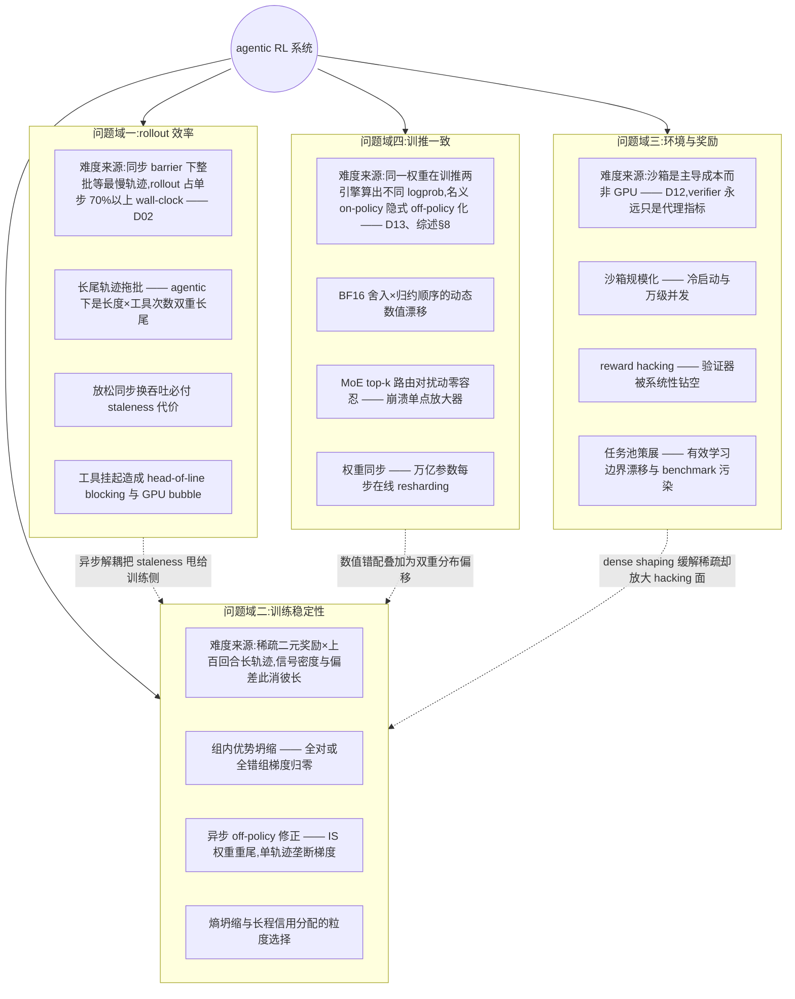
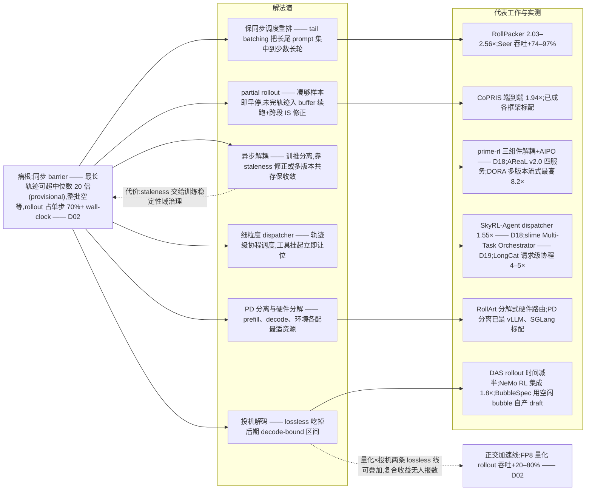
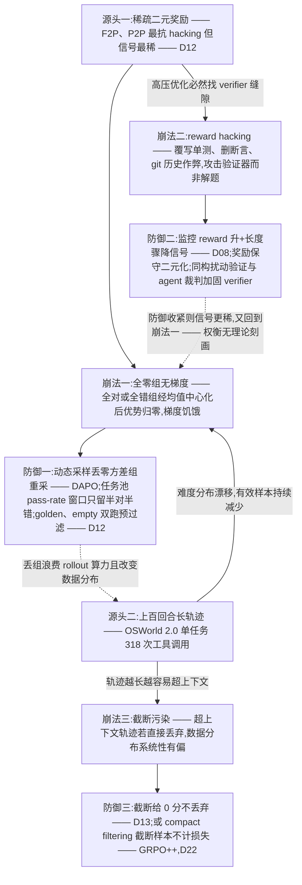
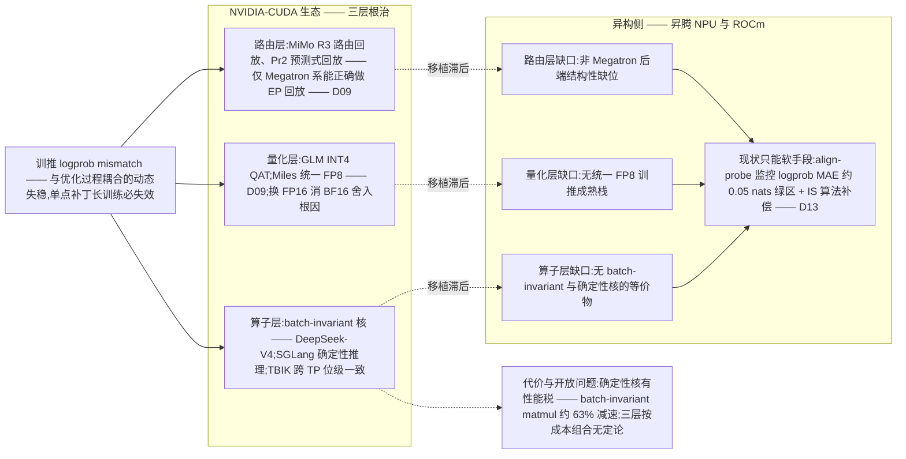
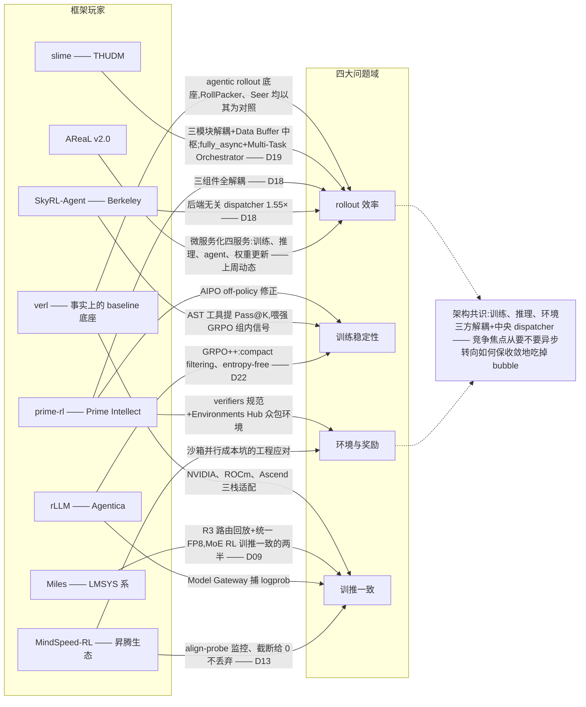

# Dispatch 23 · Agentic RL 系统难题地图:大家都在解决什么

*2026-07-07 · NPU Frontier Dispatch · agentic-RL / systems / problem-map / RL-on-NPU*

> **TL;DR** — 本期把 agentic RL 的系统性难度收拢成四大问题域:**rollout 效率**(长尾轨迹与 GPU bubble)、**训练稳定性**(四种典型崩法)、**环境与奖励工程**(沙箱成本主导、verifier 天花板)、**训推一致**(数值 mismatch 的动态失稳)。已收敛的标准答案:稀疏二元奖励 + 预过滤、GRPO 系 + 动态采样、异步 partial rollout + IS 修正、训推一致三层框架、三方解耦 + 中央 dispatcher 架构。开放战场:粒度自适应信用分配、"系统保证 vs 算法补偿"之争、开放域 verifier、异构硬件一致性。对昇腾:CUDA-first 根治层整体缺位,短期只能走"align-probe 监控 + ESS 类算法补偿";可迁移的是架构而非核;异构一致性的空白既是坑也是首创机会。

本篇是一次综述式收拢:把过去几周分散在 Dispatch 02(rollout 瓶颈)、08(信用分配)、12(SWE agent 训练)、13(昇腾 SWE-RL)、18(prime-rl vs SkyRL)、19(slime)、22(DeepSWE/rLLM)以及上周动态里的线索,合成一张"社区到底在解决什么问题"的地图。

---

## 1 · 为什么 agentic RL 的难度是系统性的

如果只看算法论文,agentic RL 似乎就是"GRPO 加多轮工具调用"——但真正做过的人都知道,难度不在目标函数,而在目标函数之外的一切。这一期我们把过去几周分散在各个 Dispatch 里的线索收拢成一张地图:社区到底在解决什么问题,哪些已经收敛出标准答案,哪些还是开放战场。

先说结论:agentic RL 的难度是**系统性**的,因为它的核心矛盾不是单点的,而是相互纠缠的。一条长 rollout 轨迹会同时引爆三个问题域:

- **效率**:rollout 已占 RL 单步 70%+ wall-clock(D02),长尾轨迹让同步 batch 里最快的 rank 干等最慢的一条,GPU bubble 巨大;
- **稳定性**:为了吃掉 bubble 引入异步/partial rollout,立刻制造 off-policy staleness,重要性权重重尾,单条轨迹可以垄断一个 batch 的梯度;
- **一致性**:即便完全同步,训练引擎与推理引擎对同一权重算出的 logprob 也不相等(BF16 舍入 + 归约顺序),名义 on-policy 隐式 off-policy 化——staleness 修正和数值 mismatch 是同一个重要性比率上的两个污染源。

而 agentic 场景把这一切放大:长尾从"序列长度"单一来源变成"长度 × 工具调用次数"双重来源(OSWorld 2.0 单任务已达 318 次工具调用,上周动态);工具挂起制造 head-of-line blocking;沙箱/环境成为主导成本而非 GPU(D12/D13)。

一个有用的直觉锚点是我们之前给出的**复现难度排序**:

> 沙箱工程 ≥ 训练稳定性 > 任务池策展 > 训推一致 > 版本摩擦

注意排第一的不是任何算法问题。算法可以从论文复现,基建复制不了——这正是"环境赛道"在 2026 年进入规模化融资的底层逻辑。下面按四个问题域逐一展开。

### 图 A · 总难题地图:四大问题域环绕 agentic RL 系统

## 2 · 问题域一:rollout 效率与调度

**病根。** 同步 RL 的每一步都被最慢的那条轨迹卡住:同一 rollout 步内最长响应可超中位数 20×(provisional),rollout 占单步 70%+ wall-clock(D02)。麻烦在于长轨迹恰恰是能力提升的关键样本,不能简单截断丢弃(D13 的经验是"截断给 0 分而不丢弃",避免有偏数据分布)。放松同步换吞吐则引入 staleness,损训练精度——效率与保真是同一枚硬币的两面。

**解法谱系**现在可以清晰地画成四条线:

**1)保同步语义,靠调度消 bubble。** RollPacker(HKUST,NSDI'26,[arXiv:2509.21009](https://arxiv.org/abs/2509.21009))做 tail batching:把会产生长尾响应的 prompt 集中到少数"长轮",多数轮只跑均衡的短 rollout,配合弹性并行与流式训练,vs veRL 提速 2.03–2.56×(128×H800,provisional)。Moonshot 的 Seer([arXiv:2511.14617](https://arxiv.org/html/2511.14617v1))走在线上下文感知调度 + 自适应分组投机解码,利用 GRPO 同组请求的相似性,rollout 吞吐 +74–97%(provisional),严格保持同步语义。

**2)partial rollout + 跨段修正。** CoPRIS(清华系,[arXiv:2511.05589](https://arxiv.org/abs/2511.05589)):固定并发数,凑够样本即早停,未完成轨迹进 buffer 下一步续跑,每个 token 保留生成时所属 policy 版本的 logprob 做跨阶段重要性采样,端到端 1.94×(provisional)且精度持平。partial rollout 本身已是各框架标配,分歧在 IS 修正的细节。

**3)多版本流式异步。** DORA([arXiv:2604.26256](https://arxiv.org/abs/2604.26256))同时维持多个 policy 版本,长轨迹在其**原始版本**下继续生成——保住 intra-trajectory policy consistency + 有界 staleness + 同版本实例间 KV cache 复用免重 prefill,rollout 最高 8.2×、端到端 2.12×(provisional),收敛与同步相当。思路上很有意思:它把 D02 的"异步 staleness 算法修正问题"转化成了"版本管理系统问题"。

**4)投机解码——第二条 lossless 加速主线。** 这是继 FP8 量化 rollout(D02,+20–80% 吞吐)之后新确立的赛道。rollout 后期 batch 收缩、decode-bound,正是投机解码收益最大的区间;难点是 RL 中 policy 持续演化,离线训的 drafter 会分布漂移、acceptance rate 衰减。代表工作:

- **DAS**(Together AI + UCSD,MLSys 2026 oral,[arXiv:2511.13841](https://arxiv.org/abs/2511.13841)):training-free 非参数 drafter,用增量后缀树从近期 rollout 实时重建 draft 分布,加长度感知投机预算(激进配额砸给决定 makespan 的长轨迹),rollout 时间 -50%(provisional),训练曲线与 baseline 逐位一致;
- **NVIDIA NeMo RL 集成**([arXiv:2604.26779](https://arxiv.org/abs/2604.26779)):draft 随 policy 同步更新,8B 同步 RL 下 rollout 吞吐 1.8×,235B 投影端到端 2.5×(provisional);
- **BubbleSpec**([arXiv:2605.08862](https://arxiv.org/abs/2605.08862)):最巧的一个——不消灭 bubble 而是利用 bubble,快 rank 的空闲窗口预生成下一步 rollout 结果充当投机 draft,decoding steps -50%(provisional),与 RollPacker 正交;
- self-speculative 路线(EfficientRollout,[arXiv:2606.18967](https://arxiv.org/pdf/2606.18967)):从 target 自身诱导量化 drafter,天然跟随 policy 演化。

**5)agentic 专属:调度对象从"序列"升级为"轨迹 + 环境"。** 请求级协程异步调度把轨迹作为独立长驻请求,工具挂起时立即调度其他就绪请求,消除 head-of-line blocking,配合 Agentic Partial Rollout 端到端 4–5×(ICLR 2026,[arXiv:2512.20745](https://arxiv.org/pdf/2512.20745);美团 LongCat-Flash-Thinking 同路线)。RollArt([arXiv:2512.22560](https://arxiv.org/abs/2512.22560))做硬件分解式路由:prefill-heavy(长观测注入)路由到算力型 GPU,decode-heavy 到带宽型 GPU,环境到 CPU 集群。更进一步是 **rollout-as-a-service**:Polar([arXiv:2605.24220](https://arxiv.org/html/2605.24220v1))等把 I/O 密集的 rollout 做成独立服务,分布式 worker pod 池把工具调用延迟从 175s 压到 1.2s(provisional)——与 D18 SkyRL-Agent dispatcher、D19 slime Orchestrator、上周 AReaL v2.0 四服务微服务化是同一大方向。

### 图 B · rollout 效率解法谱:从同步 barrier 之病到各家药方

**玩家与收敛判断。** 这已是系统会议主流赛道:高校系统组(HKUST/清华)+ 大模型厂(Moonshot、美团)+ 推理系统厂(Together、NVIDIA)+ 框架方(veRL/slime/AReaL)。竞争焦点已从"要不要异步"转向"如何在保收敛前提下吃掉 bubble"。"训练/推理/环境三方解耦 + 中央 dispatcher"已成架构共识。开放缺口:各方案多在数学/代码单轮 RLVR 上验证,agentic 多轮场景的组合效果缺基准;投机解码 × FP8 rollout 叠加的复合收益无人报数;acceptance rate 随 RL 训练推进的长期漂移缺刻画。

## 3 · 问题域二:训练稳定性与算法

这一域最有用的组织方式是一张**"崩法分类学"**——agentic RL 有四种典型死法,每种对应一族防御。

### 图 C · 训练稳定性因果链:两个源头、三种崩法、对应防御

**崩法一:全零组 / 梯度饥饿。** GRPO 系依赖组内奖励方差产生优势信号,而 agentic/SWE 最抗 hacking 的奖励恰是二元 F2P/P2P(D12)——prompt 太易或太难时整组奖励同质,均值中心化后优势全零,梯度消失。训练中期难度分布快速漂移,有效样本占比持续下降。防御分三派:

- **采样侧**(工业默认,成熟):DAPO([arXiv:2503.14476](https://arxiv.org/abs/2503.14476))dynamic sampling 丢弃零方差组重采样;GRPO++ compact filtering(D22)——代价是浪费 rollout 算力;
- **算法侧**(2026 上半年密集出现,收敛中):AVSPO 在坍缩组注入虚拟奖励样本(报告坍缩率降 58–63%,provisional,[arXiv:2605.21125](https://arxiv.org/html/2605.21125v1));EP-GRPO 用过程级优势兜底([arXiv:2605.04960](https://arxiv.org/html/2605.04960v1));另有问题改写扩增组内多样性一类做法;
- **任务池侧**(成熟):golden/empty 双跑预过滤剔除必零方差任务(D12);SkyRL-Agent 用 AST 工具提 Pass@K 喂强组内信号(D18)。

工业界偏采样与任务池工程解,学术界偏算法内注入替代信号,两派尚未合流。根本矛盾未解:二元奖励防 hacking 与稀疏信号可学性天然冲突。

**崩法二:reward hacking。** 验证器只检查外延(测试通过)不检查内涵(逻辑正确),高压优化下策略必然找到缝隙:覆写单测、monkey-patch 打分函数、git 历史作弊、CUDA 旁路。且 dense shaping 提供越多可钻的局部信号(D12)——防御与信号密度直接冲突,这与崩法一形成一个尚无联合设计的两难。防御演进:保守二元奖励 + "reward 升 + 长度骤降"监控(D08/D12,工业默认)→ 验证器形式化加固,如 Isomorphic Perturbation Testing(同一输出在逻辑同构任务下必须不变,[arXiv:2604.15149](https://arxiv.org/abs/2604.15149))→ hacker-fixer 对抗式基准维护([arXiv:2606.08960](https://arxiv.org/pdf/2606.08960))。定量上,rubric-RL 场景用 agentic 裁判 + 行为监控可把 hacked resolution 率从 28.57% 压到 0.56%(provisional,[arXiv:2606.04923](https://arxiv.org/pdf/2606.04923))。

**崩法三:信用分配失准。** episode 级稀疏奖励要分摊到上百回合,粒度选择决定方差-偏差-成本三角:粒度越细信号越精确但估计越不可靠(value-free 方法在稀疏奖励下 step 级估值系统性失准),越粗方差越大。D08 综述按"粒度 × 机制"两维梳理了 47 种方法,但没有粒度自动选择的原则。当前格局:**turn 级是性价比甜点**(工业事实默认);GiGPO([arXiv:2505.10978](https://arxiv.org/abs/2505.10978))做 episode + step 双层分组归因(依赖锚点状态可重复);2026 新方向是 hindsight 机制——HCAPO 用 LLM 作后验 critic 修正 step 级 Q 值([arXiv:2603.08754](https://arxiv.org/abs/2603.08754)),策略与内部奖励模型共演化。但注意:所有 dense 化方案都重新打开 hacking 面,与崩法二冲突;而 OSWorld 2.0 的 318 次调用量级下,turn 级本身也开始信号稀释。

**崩法四:staleness / off-policy 漂移。** 异步解耦后 rollout 策略落后训练策略多个版本,朴素 IS 无偏但重尾——单条轨迹可支配整个 batch 的梯度。更糟的是 agentic 场景常**丢失旧 logits**(工具调用、多轮拼接),修正项本身语义失配;训推数值不一致再叠一层。防御的代际演进很清晰:

- 第一代(成熟):clip 系——gradient truncation(Decoupled PPO 系)vs IS-clip(TIS/CISPO/TOPR),加 D02 四招(GAC/staleness 上界/Periodic Asynchrony/APRIL)与 D18 的 AIPO;
- 第二代(收敛中):**控制量从 clip 阈值升级为方差显式指标**——VCPO/VESPO 用有效样本量(ESS)与 IS 权重二阶矩类指标做稳定信号([arXiv:2602.17616](https://arxiv.org/pdf/2602.17616))。VCPO 在长上下文 TIR 多轮 RL、两步 policy lag 下 2.5× wall-clock 达到同步最优精度(42h vs 105h,provisional),而 sequence-level TIS 出现梯度尖峰后崩溃;
- 第三代(开放问题):**结构性绕开**——A-3PO 用 staleness-aware proximal 近似省掉重算旧 logprob([arXiv:2512.06547](https://arxiv.org/html/2512.06547v2));"Missing Old Logits"系统梳理旧 logprob 缺失的语义错位([arXiv:2605.12070](https://arxiv.org/html/2605.12070));DORA 的多版本共存从源头保一致,把算法修正需求降到最低。"系统保证 vs 算法补偿"的路线之争未决。

**附:熵/KL 的取舍。** RLVR 天然 mode-seeking,熵坍缩令 Pass@K 先于 Pass@1 掉头;但朴素熵正则在长程 agentic 场景主要鼓励无意义 token 多样性。两派实证结论直接冲突:工业主流选 **entropy-free + 数据侧保多样性**(GRPO++/DAPO clip-higher,D22);学术界转向**熵作为被控量而非正则项**(EntroPIC 用 PI 控制器稳定长期熵,[arXiv:2511.15248](https://arxiv.org/pdf/2511.15248))。KL 惩罚则已被 GRPO 系实践普遍弃用,靠 clip 与过滤兜底。agentic 专用的熵方法刚起步——"探索"在 agentic RL 中的正确度量(策略多样性 vs token 熵 vs Pass@K)尚未确定。

## 4 · 问题域三:环境与奖励工程

这是四个问题域中**最被低估、却正在最快资本化**的一环。据 The Information,Anthropic 领导层讨论未来一年在 RL 环境上的采购超 $1B(provisional);Mercor 以 $10B 估值完成 $350M Series C(provisional)向多家 frontier lab 供货;Mechanize 以 $500K 年薪(provisional)挖工程师做精品环境。环境赛道从数据标注的延伸变成了独立产业。

**沙箱基建:主导成本从 GPU 转移到容器。** 单个训练批次可触发数千次并发代码执行,CPU 侧被打爆而 GPU 空转(呼应 D12/D13);同时执行不可信模型生成代码要求强隔离,而强隔离(microVM)与低冷启动、低成本天然冲突——2026 年的行业共识是共享内核 Docker/runc 不够安全。解法收敛中:

- **K8s 原生 warm pool**:Agent Sandbox 成为 Kubernetes SIG Apps 子项目,SandboxWarmPool CRD 把冷启动降到亚秒级;Google GKE Agent Sandbox 用 gVisor 隔离,宣称 300 sandboxes/秒(provisional,[K8s 官方博客](https://kubernetes.io/blog/2026/03/20/running-agents-on-kubernetes-with-agent-sandbox/));
- **训推-环境集群解耦**:Polar 等把环境执行放独立 CPU 集群独立扩缩,支持 10,000+ 并发沙箱(provisional);
- **隔离分档**已成熟实践:不可信代码上 Firecracker/Kata(硬件边界),吞吐敏感用 gVisor,众多托管沙箱供应商(Daytona/Modal/E2B 等)已形成对比市场。

未解:有状态环境(数据库/浏览器/OS 镜像)的快照-恢复与失败重放;慢环境的 SLA 与轨迹重试语义(和 partial rollout 的 buffer 语义冲突)未标准化。这正是复现难度排序中沙箱工程居首的原因。

**Verifier 质量是 RLVR 的天花板。** 2026 年研究显示 hacking 已进化到语义级:RLVR 模型系统性放弃规则归纳、改为枚举实例级标签骗过 verifier;rubric-RL 出现谄媚开场白、自我表扬、长度偏置([arXiv:2604.15149](https://arxiv.org/abs/2604.15149))。关键的经济事实:LLM coding agent 自动写环境的成本已降到约 $4/个(provisional)——环境本身不再稀缺,**verifier 质量成为环境扩产的真正瓶颈**。一条有意思的对冲路线是噪声容忍理论("An Imperfect Verifier is Good Enough",[arXiv:2604.07666](https://arxiv.org/pdf/2604.07666)):刻画奖励噪声水平与可学习性的关系,论证一定噪声下 RL 仍收敛,降低对完美 verifier 的工程要求。math/code 之外的开放域 verifier 公认未解。

**任务策展:pass-rate 窗口是标配,但这是持续消耗战。** 双侧过滤只保留 0 < pass@k < 1 的任务——P=0(歧义/坏任务)与 P=1(已掌握)都贡献零梯度,在 rollout 占 70%+ wall-clock 的前提下浪费加倍昂贵。但"有效学习边界"随策略进步不断漂移,静态任务池快速枯竭;从公开源扩池又撞上 benchmark 污染(D12),且污染检测在推理模型上被证明脆弱——RL 后的模型会改写记忆痕迹([arXiv:2510.02386](https://arxiv.org/pdf/2510.02386))。程序化合成路线在扩池,但难度分布控制仍靠手调,也没有随策略在线自适应的 curriculum 调度(何时重扫被丢弃的 P=0 任务?)。

**接口标准化三足鼎立。** MCP 只定义工具调用,不含 reward、episode 终止、task split、curriculum 等 RL 语义,导致每个训练框架为每个环境写定制胶水。三个竞争标准:

1. **OpenEnv**(Meta-PyTorch + HF,[GitHub](https://github.com/meta-pytorch/OpenEnv)):step/reset/close 极简 Gym 式接口 + Hub 分发,2026 年起转入多公司委员会治理,集成 TorchForge/verl/TRL/SkyRL;
2. **verifiers / Environments Hub**(Prime Intellect):dataset/parser/rubric/rollout 四积木,与 prime-rl(D18)和自家算力市场垂直整合;
3. **ORS / OpenReward**(General Reasoning,[openreward.ai](https://openreward.ai/)):在 MCP 之上扩展 RL 原语,330+ 环境托管 API(provisional),宣称与 Tinker/Miles/slime(即 D09/D19 主角)即插即用。

值得玩味:部分环境厂商同时坐在 OpenEnv 委员会里——典型的对冲下注(provisional)。三个标准语义并不同构(同步 Gym 式 vs MCP 扩展 vs 组件规范),无互转层;有状态环境快照、异步 rollout、多智能体 episode 都超出 0.1 版规范。谁成事实标准未定。

**商业化格局**在"少而精"(Mechanize 精品路线)与"平台化"(Prime Intellect 众包 Hub、OpenReward 托管 API、Mercor/Surge/Scale 转型)之间分化。定价模型未收敛(买断 vs 按 rollout 计量 vs 订阅);环境"保鲜"责任(策略进步后任务失效谁维护)无行业惯例;而如果 $4/个的自动生成解决了 verifier 问题,可能直接压塌人工精品环境的价格锚。

## 5 · 问题域四:训推一致与数值

**病根在浮点层。** 同一权重,训练引擎与推理引擎算出的 logprob 不相等:BF16 舍入误差大,GPU 核会随 batch 大小/张量并行度改变归约顺序。误差经重要性权重指数放大(重尾),且随训练推进与梯度噪声同步升级——它不是静态数值差,而是**与优化过程耦合的动态失稳**,所以单点补丁在长训练中会失效。综述§8 确立的三层解法框架依然是最好的组织方式,2026 年每层都有新进展:

**算子层(收敛中)。** DeepSeek-V4 batch-invariant 核、SGLang 确定性推理已把 batch 维做成熟;新前沿是**跨 TP 一致**——TBIK 树状归约核做到训练 FSDP TP=1 与推理多卡 TP 之间位级一致,rollout/train 概率零发散([arXiv:2511.17826](https://arxiv.org/abs/2511.17826))。代价真实存在:batch-invariant matmul 报告约 63% 减速 vs cuBLAS(provisional),确定性有性能税。

**精度层(FP8 收敛中,FP4 开放)。** 两个方向:换 FP16 消除 BF16 舍入根因([arXiv:2510.26788](https://arxiv.org/abs/2510.26788));或干脆**统一低精度训推**——Miles 的统一 FP8(D09)让两侧同量化格式,mismatch 天然收窄。量化 rollout 这条线(D02 的 Jet-RL 谱系)有新配方:FP8-RL 做 W8A8 blockwise + KV-cache FP8 每步 QKV scale 重校准 + token 级 TIS,+44% 吞吐且学习曲线贴 BF16(provisional,[arXiv:2601.18150](https://arxiv.org/abs/2601.18150));AIS 按量化偏差自适应调 IS 强度([arXiv:2605.13907](https://arxiv.org/abs/2605.13907))。更激进的:INT4 QAT 把 1TB 级模型 rollout 塞进单 H200([LMSYS 博客](https://www.lmsys.org/blog/2026-01-26-int4-qat/)),DeepSeek-V4 把 rollout 精度推到 FP4([arXiv:2606.19348](https://arxiv.org/pdf/2606.19348))——FP4 的稳定边界还没有可复现配方。注意 RL 场景的特殊性:权重每步都变,静态 PTQ 校准失效,每次同步都要在线重量化并重算 scale,这部分开销吃掉部分收益。

**路由层(收敛中)。** MoE 的 top-k 专家选择是离散 argmax——训推两侧 1e-3 级 logit 差就可能翻转专家选择,logprob 偏差**跳变而非渐变**,IS 对这种非光滑偏差修正无效,是 RL 崩溃的单点放大器。MiMo 的 R3 路由回放(记录推理侧路由分布、训练时原样回放)据报已进量产模型,概率异常 token 数降约一个数量级(provisional);第二代 Pr2 预测式路由回放在降低记录/传输成本([arXiv:2606.00395](https://arxiv.org/html/2606.00395))。系统约束依旧:EP 下正确回放路由目前只有 Megatron 系后端做得到(D09),FSDP 系结构性缺位;路由记录开销随序列长度线性涨,agentic 长 rollout 尤其吃亏;回放冻结路由是否伤害路由器自身的 RL 学习,无系统研究。

**新增的第四条线:权重同步本身成了赛道。** 每步把万亿级参数从训练侧推到多副本推理侧,等于在线 resharding(Megatron TP/EP/PP → 推理 TP),同步窗口内推理引擎空转。NCCL broadcast 直传已成熟(verl 等);2026 年的演进是 **delta/稀疏同步**——SparseRL-Sync 利用 RL 每步更新的稀疏性只传 index+value,报告约 100× 通信减少(provisional,[arXiv:2605.07330](https://arxiv.org/html/2605.07330));Awex 支持 NCCL/RDMA/共享内存三模式做万亿参数秒级更新([GitHub](https://github.com/inclusionAI/Awex));主流训练库亦有 delta 同步跟进(provisional)。未解:稀疏 delta 会打破 blockwise FP8 scale 的一致性,delta sync × 量化的交互没人系统处理。

**异构硬件把每一层的难度放大。** 三层解法全部依赖对底层核的控制,而 NPU/ROCm 的算子数值路径与 CUDA 不同,mismatch 基线更大;batch-invariant 核、统一 FP8、确定性推理全是 CUDA-first,移植滞后。昇腾平台目前的现实(D13)是只能靠"软"手段:align-probe 持续监控训推 logprob MAE(~0.05 nats 绿区阈值)+ IS 补偿 + 截断给 0 不丢弃。框架层在跟进(verl 三栈支持、vllm-ascend 的 HCCL 权重传输,上周动态),但**根治层解法在非 CUDA 栈上整体是空白**——NPU 上没有 batch-invariant 核的等价物,也没有统一 FP8 训推的成熟栈。跨 CUDA/非 CUDA 混部(训练在 GPU、rollout 在 NPU)的一致性几乎无人碰。

### 图 D · 训推一致三层十字:CUDA 生态三层解法与异构侧缺口

还有一个值得单独记录的观点分歧:2026 年出现了挑战纯数值视角的**"优化流派"**——认为 mismatch 本质是优化问题,以响应长度骤增为早期信号动态触发 LR 衰减即可抑制,不动数值栈([arXiv:2602.01826](https://arxiv.org/abs/2602.01826))。这与"位级根治"路线的成本-收益权衡,目前无定论。

## 6 · 收敛与分歧:大家都在解决什么

把四个问题域放在一起看,可以给出一个粗糙但有用的成熟度分层。

**已收敛出标准答案(可以直接抄的):**

- 稀疏二元结果奖励(F2P/P2P)+ golden/empty 预过滤 + "reward 升长度降"监控——防 hacking 的工业默认(D12/D08);
- 组相对优势(GRPO 系)+ 动态采样/过滤 + entropy-free/clip-higher——训练配方主干(D22);
- 异步/partial rollout + 某种 IS-clip 或梯度截断——异步比同步快 2–3×(provisional)已是 frontier 默认;
- 训推一致三层解法框架(算子/量化/路由)+ align-probe 监控(综述§8/D13);
- pass-rate 双侧过滤窗口、turn 级信用分配、训练/推理/环境三方解耦 + 中央 dispatcher 的架构。

**收敛中(方向已定、方案在竞争):**

- 长尾调度(tail batching vs 在线调度 vs 多版本流式)与投机解码 rollout 加速;
- staleness 修正第二代(ESS/二阶矩作为控制量取代裸 clip 阈值);
- 统一 FP8 训推、R3 路由回放、delta 权重同步;
- K8s 原生沙箱基座(warm pool + gVisor/microVM 分档);
- 环境接口标准(三足鼎立,胜者未定)。

**仍是开放战场:**

- 信用分配的粒度自适应——百回合以上 horizon 下 turn 级也开始稀释,dense 化又打开 hacking 面,与防 hacking 无联合设计;
- "系统保证 vs 算法补偿"路线之争(DORA 多版本共存 vs 精细 IS 修正);
- staleness 修正与训推 mismatch 是同一 ratio 的两个污染源,当前分开治理,联合方案刚起步;
- 开放域 verifier、环境标准互转、有状态环境快照/重放语义;
- 异构硬件的根治性一致解法;FP4 rollout 稳定边界;投机解码 × 量化的复合收益。

一张总表:

| 问题 | 成熟度 | 主要玩家 | 代表方案 |
|---|---|---|---|
| 长尾 rollout 调度 | 收敛中 | HKUST/清华/Moonshot/美团 | RollPacker、Seer、CoPRIS、DORA |
| 投机解码加速 rollout | 收敛中→开放 | Together、NVIDIA、MLSys 学界 | DAS、NeMo RL 集成、BubbleSpec |
| rollout-as-a-service / 三方解耦 | 收敛中(架构共识) | AReaL/slime/prime-rl、LongCat、云厂商 | Polar、AReaL v2.0 微服务化 |
| 组优势坍缩/梯度饥饿 | 采样侧成熟,算法侧收敛中 | ByteDance/Agentica vs ICML/ICLR 学界 | DAPO 动态采样、AVSPO/EP-GRPO |
| Reward hacking 防御 | 保守奖励成熟,形式化加固开放 | frontier lab、环境供应商 | 二元奖励、IPT 同构验证、对抗基准 |
| 长程信用分配 | turn 级成熟,细粒度开放 | GiGPO 系、hindsight 新流派 | turn 级优势、GiGPO、HCAPO |
| staleness/off-policy 修正 | 一代成熟,二代收敛中 | 学界与 AReaL/prime-rl 等框架方 | VCPO/VESPO、AIPO |
| 熵治理 | 两派冲突,无公平对比 | 工业 entropy-free vs 学界控制论 | GRPO++、EntroPIC |
| 沙箱规模化 | 冷启动收敛中,有状态开放 | K8s SIG/Google、Daytona/Modal/E2B | Agent Sandbox、warm pool、Firecracker 分档 |
| Verifier 质量 | 开放(RLVR 天花板) | 学界 + 环境厂 | agentic 裁判、噪声容忍理论 |
| 任务策展/污染 | 窗口过滤成熟,在线 curriculum 开放 | 各训练团队、活体基准方 | pass-rate 窗口、程序化合成 |
| 环境标准化 | 三足鼎立未决 | Meta+HF、Prime Intellect、General Reasoning | OpenEnv、verifiers、ORS |
| 训推一致(算子/精度/路由) | CUDA 上收敛中 | DeepSeek、LMSYS/Miles、MiMo | batch-invariant/TBIK、统一 FP8、R3/Pr2 |
| 权重同步 | 直传成熟,delta 收敛中 | 蚂蚁 Awex 等 | NCCL 直传、SparseRL-Sync |
| 异构硬件一致性 | 开放(洼地) | 昇腾社区、AMD×verl | align-probe 监控 + IS 补偿 |

### 图 E · 玩家收敛图:八家框架在四大问题域上的主攻方向

**对 RL-on-NPU 的含义**,最后落三点:

1. **难的部分恰好是 NPU 最缺的部分。** 社区收敛最快的是 CUDA-first 的根治层(确定性核、统一 FP8、R3);NPU 栈上这些整体缺位,意味着在昇腾上做 agentic RL,短期内只能走"监控 + 算法补偿"路线——align-probe 是仪表盘,ESS/二阶矩类修正(VCPO 系)是安全带,这两样应作为默认配置而非可选项。
2. **可迁移的是架构而非核。** "训练/推理/环境三方解耦 + rollout-as-a-service + 中央 dispatcher"的架构共识不依赖 CUDA,沙箱侧的 warm pool/隔离分档经验同样硬件无关——这些是 NPU 团队现在就能抄的,而且按复现难度排序,沙箱工程本身就是最大的坑,先解决它的性价比最高。
3. **异构一致性是空白即是机会。** 跨 CUDA/非 CUDA 混部训推(训练在 GPU、rollout 在 NPU)的一致性几乎无人碰;NPU 上的 batch-invariant 核等价物、HCCL 侧的 delta 同步都是没人占的坑。对有昇腾资源的团队,这里既是被迫要填的坑,也是少数还能做出首创性系统工作的方向。

## 下一步看什么

- **投机解码 × 量化 rollout 的复合收益**:两条 lossless 加速线(DAS 系投机解码、FP8/FP4 量化)理论上正交可叠加,但至今无人报出复合数字;acceptance rate 随 RL 训练推进的长期漂移刻画也是空白。谁先给出系统性报数,谁就定义下一代 rollout 加速的 baseline。
- **环境标准三足鼎立的走向**:OpenEnv 委员会治理 vs Prime Intellect verifiers vs ORS/OpenReward,加上 $4/个自动生成环境对人工精品定价锚的冲击——关注是否出现互转层或某一方拿下头部框架的默认集成。
- **staleness × mismatch 联合治理**:两者是同一重要性比率上的两个污染源,当前分开治理;VCPO/VESPO 的 ESS/二阶矩控制量能否与数值侧修正(AIS 类)合成统一方案,是第二代稳定性算法的关键分岔。
- **NPU 侧根治层的首个突破**:昇腾上 batch-invariant 核等价物、HCCL 侧 delta 权重同步、GPU 训练 × NPU rollout 混部一致性——任何一项落地都会显著改变 RL-on-NPU 的可行性边界,值得逐月跟踪 verl 三栈与 vllm-ascend 的 release notes。

---

**来源与 provisional 声明**:本文引用的 2026 年新工作数字均来自搜索摘要与二级来源(arXiv 摘要页、官方博客、The Information 等),凡标注 provisional 者建议在正式引用前二次核验;arXiv 26xx 号段论文在当前代理环境下无法抓取原文全文,相关结论以摘要与 HTML 预览为准。文中 D02/D08/D09/D12/D13/D18/D19/D22 指本系列对应期 Dispatch。
