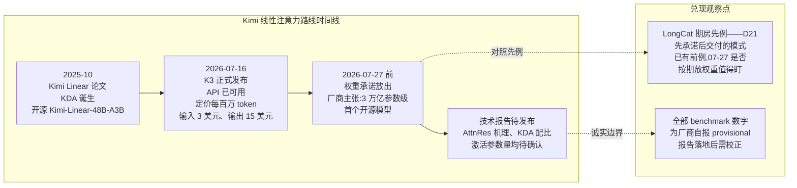
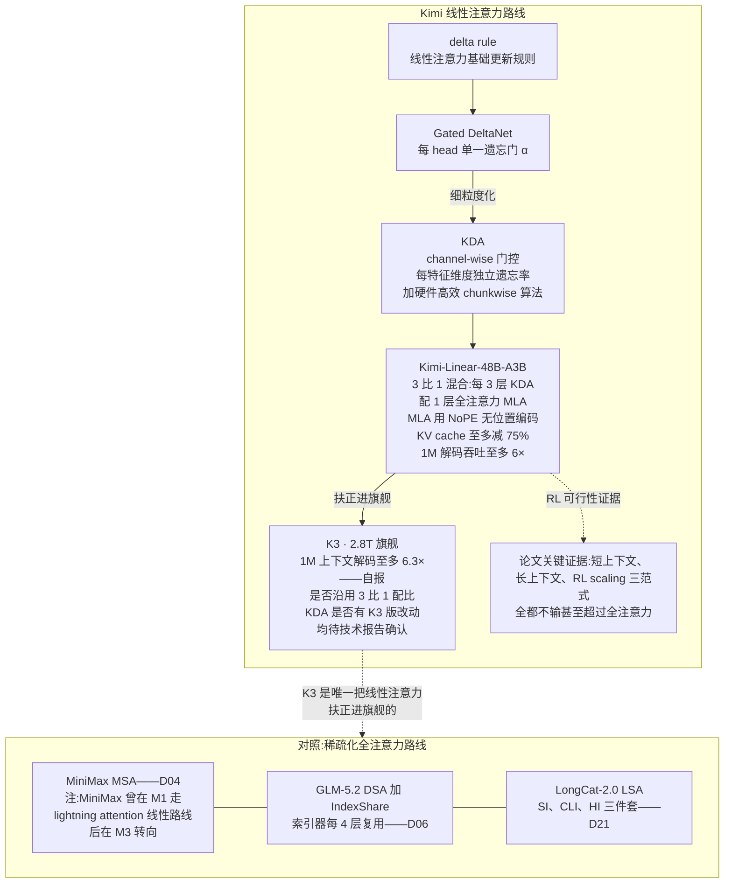
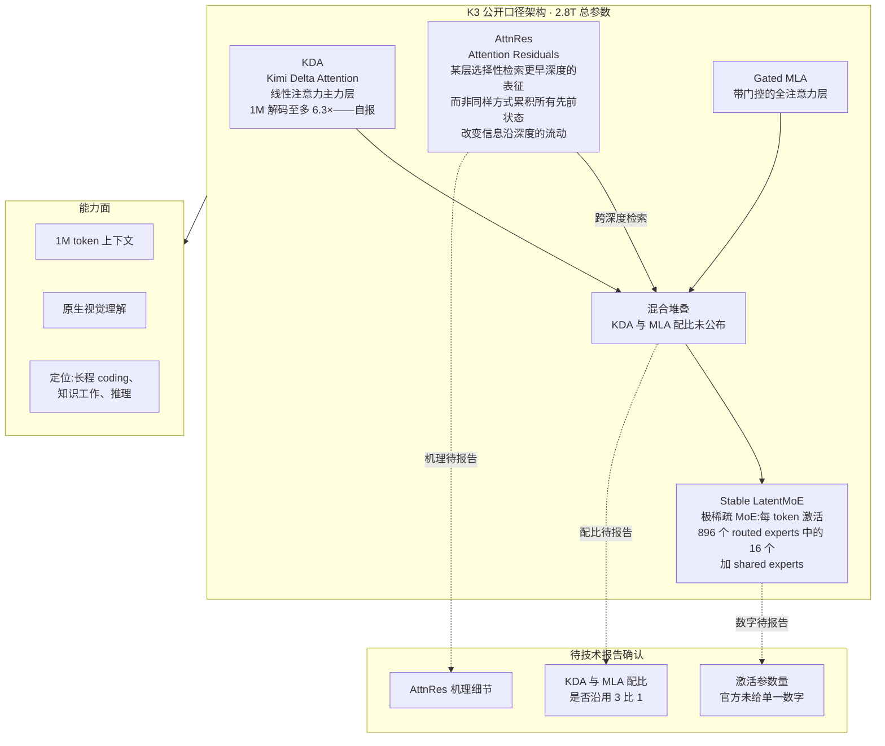
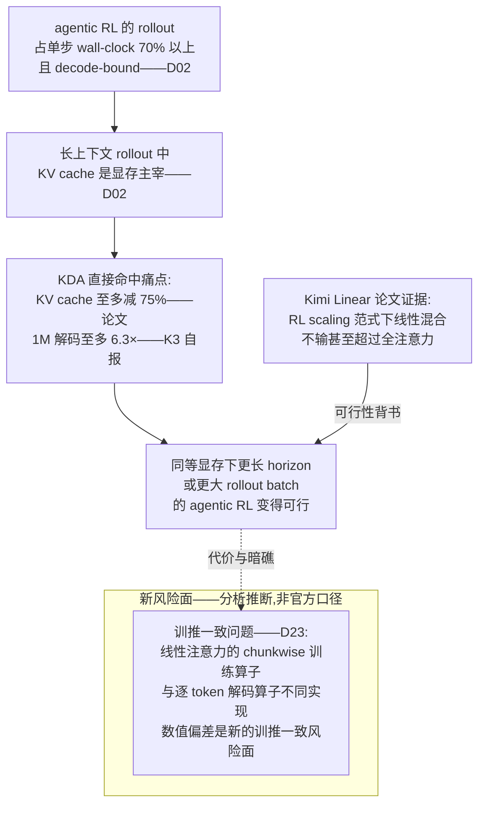

# Dispatch 24 · Kimi K3 首发解读:线性注意力第一次登上开源旗舰

*2026-07-17 · NPU Frontier Dispatch · Kimi-K3 / KDA / linear-attention / RL-on-NPU*

> **TL;DR** — 2026-07-16,月之暗面发布 **Kimi K3**:2.8T 总参数极稀疏 MoE(每 token 激活 16/896 个 routed experts + shared experts),架构四件套 KDA + AttnRes + Gated MLA + Stable LatentMoE,原生视觉理解、1M token 上下文,定价 $3/$15 每百万 token 直接对标 Claude Sonnet 档,承诺 2026-07-27 前开源权重。**完整技术报告尚未发布**,本篇定位是首发解读:所有 benchmark 与提速数字均为厂商自报、按 provisional 处理,机理层面的判断以官方博客口径 + KDA 谱系论文(Kimi Linear,arXiv 2510.26692)外推为准,报告落地后本看板逐项跟进校正。一句话看点:这是线性注意力第一次被扶正进开源旗舰级模型。

承接本看板脉络:D02 说清了 rollout 是 agentic RL 的 wall-clock 主宰、D04/D06/D21 追踪了 MiniMax MSA、GLM-5.2 DSA+IndexShare、LongCat-2.0 LSA 三条"稀疏化全注意力"路线、D23 铺开了训推一致的问题地图——K3 在这四条线索的交汇点上,给出了第四条截然不同的答案。

---

## 1 · 发布了什么:事实清单

2026 年 7 月 16 日,月之暗面(Moonshot AI)发布 Kimi K3(官方 tech blog:kimi.com/blog/kimi-k3)。先把公开口径的事实摆齐——注意,**完整技术报告尚未发布**,官方链接指向一份"未来的技术报告",所以本篇定位是首发解读,所有机理层面的判断以公开博客口径 + KDA 谱系论文外推为准,报告落地后本看板会跟进校正(D21 我们对 LongCat-2.0 也是这么处理的)。

- **规模**:2.8T 总参数,极稀疏 MoE——每 token 激活 16/896 个 routed experts,外加 shared experts(所谓 "Stable LatentMoE" 层)。**具体激活参数量官方未给出单一数字**,请勿引用任何第三方推算值当官方数据。
- **架构四件套**:Kimi Delta Attention(KDA)+ Attention Residuals(AttnRes)+ Gated MLA + Stable LatentMoE。
- **模态与上下文**:原生视觉理解;1M token 上下文。
- **速度主张**:KDA 在 1M 上下文下解码提速至多 6.3×(自报,provisional)。
- **Benchmark(全部厂商自报,provisional)**:DeepSWE 67.5、FrontierSWE 81.2、Kimi Code Bench 2.0(内部)72.9、Terminal-Bench 2.1 88.3、Program Bench 77.8、SWE Marathon 42.0。
- **定价**:$3 / $15 每百万 token(输入/输出),直接对标 Claude Sonnet 价位档;API 已可用。
- **开源承诺**:权重承诺 2026-07-27 前放出,厂商主张这将是"3 万亿参数级的首个开源模型"——注意这是**尚未兑现的承诺**,截至发稿权重未上架。
- **定位**:长程 coding、知识工作、推理。

一句话概括本次发布的看点:这是**线性注意力第一次被扶正进开源旗舰级模型**。前几期看板里 MiniMax、GLM、LongCat 走的都是"稀疏化全注意力",Kimi 是唯一把状态更新方程本身换掉的那家。下面逐层拆。

## 2 · KDA 谱系:从 Kimi Linear 到扶正旗舰

K3 的核心押注 KDA 不是凭空出现的,它有一条清晰的谱系,落点是 2025 年 10 月的 Kimi Linear 论文(arXiv 2510.26692),配套开源了 Kimi-Linear-48B-A3B-Instruct(HF 可下)。理解 K3,先要理解这条递进链:

**delta rule → Gated DeltaNet → KDA**

1. **Delta rule**:经典线性注意力把上下文压进一个固定大小的矩阵状态 S,每步做 `S ← S + v·kᵀ` 式的累加——问题是只加不删,状态会被旧信息污染。Delta rule 的改进是"先擦后写":用当前 key 检索出状态里的旧关联,减掉,再写入新关联,相当于对固定容量的记忆做**定向覆写**而非无脑叠加。
2. **Gated DeltaNet**:在 delta rule 之上加遗忘门——每个 head 一个标量 α,控制整个状态矩阵的衰减速率。这解决了"该忘的忘不掉",但粒度太粗:一个 head 内所有特征维度共享同一个遗忘率。
3. **KDA**:把门控做到 **channel-wise**——每个特征维度有独立的遗忘率。直觉上,状态矩阵的不同维度承载不同类型的信息:有的维度在追踪局部句法(应该快忘),有的在保持一个长程绑定,比如变量名与其定义的关联(应该慢忘)。每 head 单一 α 迫使这些信息以同一速率衰减,channel-wise 门控则允许模型对"记忆的每个坑位"分别决定保留多久——这是从"整块记忆统一保鲜期"到"逐格精细记忆管理"的跨越。代价是计算结构更复杂,所以 KDA 的另一半贡献是**硬件高效的 chunkwise 算法**:把 token 序列切块,块内用矩阵乘并行、块间递推传递状态,让训练吞吐不被 recurrent 结构拖死。

**3:1 混合与 NoPE 分工**。Kimi Linear 不是纯线性:每 3 层 KDA 配 1 层全注意力 MLA,消融显示 3:1 是吞吐 × 验证损失的最优点。更精巧的是分工设计:MLA 层用 **NoPE(无位置编码)**,位置信息和 recency bias **全部交给 KDA 层承担**——因为 KDA 的逐维遗忘门天然就是一种数据依赖的位置衰减机制,全注意力层则被解放出来做纯内容寻址的精确检索。这个分工让两种层各干各擅长的事,而不是互相冗余。工程收益:KV cache 至多减 75%(只有 1/4 的层需要 KV cache),1M 上下文解码吞吐至多 6×。

**三范式主张——尤其是 RL scaling**。Kimi Linear 论文最重的一条主张:在短上下文、长上下文、**RL scaling** 三种范式下,混合线性架构全都不输甚至超过全注意力基线。前两条业界已有零散证据,第三条是关键增量——这是"线性注意力能进 RL 训练"迄今最直接的证据。为什么这条对本看板意义重大:D02 讲过,RL 后训练的单步 wall-clock 里 rollout 占 70%+ 且 decode-bound;如果线性注意力在 RL 范式下质量掉链子,那它省下的推理成本就只对 serving 有意义、对训练闭环没意义。Kimi Linear 说的是:不掉,甚至更好。K3 定位"长程 coding + 推理"(意味着重度 RL 后训练),等于把这条论文主张押到了旗舰上。

**跨度与风险**。从 48B-A3B 的验证模型到 2.8T 的旗舰,规模跨了约 60 倍。3:1 配比在 2.8T 尺度是否仍是最优、K3 的 KDA 是否有版本改动、MLA 是否还是 NoPE——官方一律未说,**全部待技术报告确认**。架构结论随规模迁移不是免费的,这是本次发布最大的不确定性来源。

## 3 · 四条注意力路线的分岔口

到 K3 为止,本看板追踪的旗舰级"注意力降本"路线凑齐了四条,可以画一张清晰的分岔图:

| 路线 | 代表 | 哲学 | KV cache |
|---|---|---|---|
| MSA | MiniMax-M3(D04) | 稀疏化全注意力 | 仍在,被裁剪 |
| DSA + IndexShare | GLM-5.2,索引器每 4 层复用(D06) | 稀疏化全注意力 | 仍在,被索引 |
| LSA(SI/CLI/HI) | LongCat-2.0(D21) | 稀疏化全注意力 | 仍在,分层稀疏 |
| **KDA 混合** | **Kimi K3** | **线性注意力** | **KDA 层无 KV cache(若沿用 Kimi Linear 的 3:1 配比即 3/4 的层;K3 配比待报告确认)** |

前三家的共同哲学是:**保留 softmax attention 的计算形式,只是挑着 token 算**——注意力矩阵还是那个矩阵,只是变稀疏了;KV cache 还是那个 cache,只是访问模式变了。这条路的好处是保守:任何一个 token 理论上仍可被精确检索,failure mode 与全注意力连续。

Kimi 走的是另一条哲学:**改掉状态更新方程本身**。KDA 层没有 KV cache,只有一个固定大小的矩阵状态——上下文再长,状态也不长大。这意味着信息必须被**有损压缩**进固定容量,靠遗忘门决定留什么;换来的是解码每 token 成本与上下文长度无关(KDA 层部分)。两条哲学的本质差异就在这里:稀疏化是"存全量、省着读",线性是"边读边压、只存摘要"——前者的显存随上下文线性涨(打折的线性),后者是常数。

为什么其他家不敢、Kimi 敢?两个原因。其一,线性注意力有前科:MiniMax 在 M1 用 lightning attention 走过线性路线,后来在 M3 转回稀疏化(脉络见 D04)——业界普遍担心线性架构在精确检索、长程 recall 上的天花板,以及 RL 训练下的稳定性。其二,Kimi 有**九个月的验证期**:从 2025-10 的 Kimi Linear 论文 + 开源 48B 模型,到 2026-07 的 K3,中间有九个月的时间在真实训练管线里踩坑。别家是"没验证过所以不敢",Kimi 是"验证过一轮所以敢"——当然,48B 的验证能否覆盖 2.8T 的风险面,仍是上一节说的那个未知数。

## 4 · AttnRes 与 Stable LatentMoE:另外两个待解之谜

四件套里 KDA 和 Gated MLA 有谱系可考,另外两个组件目前只有名字和一句话口径。

**AttnRes(Attention Residuals)**。官方口径:让某层**选择性检索更早深度的表征**,而非以同样方式累积所有先前状态——改变信息沿模型深度的流动。机理细节待报告,但可以做点有依据的推测(**以下为推断,非官方**):标准 residual stream 是"逐层累加"——第 N 层看到的是前面所有层输出的和,深层想用某个浅层的特定表征,只能指望它没被后续层的加法冲淡。AttnRes 的字面含义是把这个"被动累加"改成"主动检索":某些层可以带权地、选择性地读取某个更早深度的输出,类似在深度方向上做了一次注意力/门控选择。如果属实,这对超深模型(2.8T 规模的层数不会少)的梯度传播和特征复用都有意义——浅层的精确 token 表征可以被深层直接调取,而不必在 residual stream 里"幸存"几十层。是否与 KDA 层的有损压缩形成互补(线性层丢掉的细节,从浅层残差里捞回来?)——纯属猜想,待报告。

**Stable LatentMoE 与 16/896 极稀疏**。每 token 激活 16/896 个 routed experts,激活比约 1.8%,加上 shared experts 兜底。这个稀疏度带来的优化难度是实打实的:路由器要在 896 个选项里做 top-16 选择,专家负载均衡、路由训练早期的塌缩风险、以及**训推一致性**问题都会被放大——D23 讨论过,MoE 路由在训练和推理引擎间的数值差异会导致选中的专家集合不一致,专家数越多、选择越稀疏,同样大小的 logit 扰动越容易翻转 top-k 边界上的专家。名字里的 "Stable" 和 "Latent" 暗示做了某种稳定化路由(latent 空间路由?对照 MLA 的 latent 压缩思路?)——**同样是推断**,机理待报告。

## 5 · 跑分与定价怎么读

先泼冷水再谈战略。

**跑分:三重折扣**。第一,六项 benchmark 全部厂商自报,provisional,无第三方复现。第二,这批名目——FrontierSWE、DeepSWE、SWE Marathon、Program Bench——是新一代基准体系,与旧 SWE-bench Verified **不可跨表比较**;尤其注意 Kimi Code Bench 2.0 是内部基准,参考价值再打一折。第三,跨厂商也不可比:D21 里 LongCat-2.0 自报 SWE Pro 59.5,和 K3 的 FrontierSWE 81.2 / DeepSWE 67.5 属于不同分数体系,任何"K3 比 LongCat 高 X 分"的说法都是错误比较——D21 我们吃过一次"新基准名目无锚点"的教训,这里再强调一遍。能读出的可靠信号只有一个:六项全是 coding/agentic 长程任务,配合 SWE Marathon(名字暗示超长程任务)42.0 这种"故意放一个不高的分",说明官方叙事重心是**长程 agent 工作负载**,与 1M 上下文 + KDA 解码提速的架构选择自洽。

**定价:$3/$15 的战略含义**。对标 Claude Sonnet 价位档,而不是打折甩卖——这传递两个信息。其一,自信:定价即定位,Moonshot 认为 K3 的能力配得上 Sonnet 档。其二,更有意思的是成本结构:如果 KDA 的 75% KV 减省和 6.3× 长上下文解码提速(自报)在生产 serving 中兑现,那么**同样的标价下,长上下文请求的毛利结构会显著优于全注意力同行**——线性注意力的架构红利可以选择不降价、吃成利润率,或者留作未来价格战的弹药。这是架构选择直接传导到商业面的少见案例。

**"3 万亿级首个开源":07-27 是试金石**。这是厂商主张,且截至发稿权重未放出。D21 记录过 LongCat 的"期房"先例——先宣布后交付(LongCat 最终兑现了 MIT 权重,算是良性先例)。K3 承诺 07-27 前放权重,距发布 11 天。放不放、放的是不是完整权重(而非蒸馏版/阉割版)、许可证是什么——这三问在 07-27 之前都悬着。本看板届时跟进。

## 6 · 对 RL-on-NPU 的含义

回到本看板的主线关切。

**KDA 精准打在 rollout 痛点上**。D02 的结论:RL 单步 wall-clock 里 rollout 占 70%+,且 rollout 是 decode-bound;长上下文 rollout 的显存主宰是 KV cache——batch size 被 KV cache 卡死,decode 吞吐又决定整个 RL 迭代速度。现在对表:KDA 的 KV cache 至多减 75%(→ 同显存下 rollout batch 翻倍以上的空间),1M 解码至多 6.3×(自报,→ 直接压缩 rollout wall-clock)。这两个数字如果打七折兑现,对长程 agentic RL 的训练经济学也是结构性改善。再叠加 Kimi Linear 论文的 RL scaling 主张(线性混合架构 RL 质量不输),等于"省得多 + 练得动"两头都有论文背书——当然,2.8T 尺度的 RL 表现仍要等报告。

**NPU 亲和性(以下为分析推断,标注)**。理论上,KDA 的 chunkwise 算法把计算主体组织成块内稠密矩阵乘,这正是 NPU(如昇腾的 cube 单元)最擅长的形态——比稀疏注意力的不规则 gather/scatter 访存模式对 NPU 友好得多,后者恰是 D06 讨论 DSA 时的落地痛点。但硬币另一面:KDA 是新算子,chunkwise 训练 kernel 与逐 token recurrent 解码 kernel 在 CANN 生态里大概率**都没有现成实现**,CUDA 侧至少还有 Kimi Linear 开源实现可抄。对 RL-on-NPU 玩家,这是"架构形态友好、算子生态空白"的组合——机会与工程量并存。

**新的训推一致风险面(推断,承 D23)**。D23 的框架:训推一致的风险出在"训练算子与推理算子是两套实现"。线性注意力把这个风险面推到新的位置——训练/prefill 走 chunkwise 并行算子,解码走逐 token recurrent 算子,**两者在数学上等价、在浮点上不等价**;误差沿固定大小状态逐 token 累积,序列越长(1M!)漂移越远。RL 场景下这就是 rollout 分布与训练分布的系统性偏差来源,叠加 16/896 极稀疏路由的翻转敏感性(见上节),K3 的训推一致工程难度可能是本看板追踪过的模型里最高的一档。此为推断,官方未提及。

**报告落地后的核对清单**(本看板跟进项):

1. **混合配比**:K3 是否沿用 3:1 KDA:MLA?MLA 层是否仍是 NoPE?2.8T 尺度有无重新消融?
2. **激活参数量**:官方给出确数,更新 compare.json(现有列:DeepSeek-V4 / MiniMax-M3 / GLM-5.2 / LongCat-2.0 / DeepSeek-V3.2(ref),K3 列待补)。
3. **AttnRes 机理**:跨深度检索的具体形式(门控?注意力?静态连接?),与 KDA 有损压缩是否存在互补设计。
4. **RL 后训练细节**:线性混合架构下的 RL 配方、rollout 引擎与训推一致处理(chunkwise/recurrent 两套算子如何对齐)、长程任务的 credit assignment。
5. **训练基建**:2.8T 极稀疏 MoE + 线性注意力的并行策略、KDA chunkwise kernel 的实现与开源计划、以及有无非 NVIDIA 硬件的适配信号。
6. **07-27 权重兑现**:完整性、许可证、以及是否附带小尺寸验证版。

一句收束:K3 是四条注意力路线分岔后,唯一走"改方程"而非"挑 token"的旗舰——它的成败不只是 Moonshot 一家的事,而是"线性注意力能否承载旗舰级 agentic RL"这个问题的第一次全尺度实验。报告与权重落地前,一切数字按 provisional 处理;落地后,本看板逐项核对。

## 下一步看什么

1. **2026-07-27 权重兑现**:是否按期放出、是否完整权重(而非蒸馏/阉割版)、许可证条款——"3 万亿级首个开源"的厂商主张能否落地,这是 11 天内最硬的观察点。
2. **技术报告发布**:上面第 6 节的六项核对清单逐项对表——尤其是 KDA:MLA 配比、激活参数量确数、AttnRes 机理与 RL 后训练配方;报告落地后本看板出校正篇并补 compare.json 的 K3 列。
3. **第三方复现与独立评测**:六项自报 benchmark 有无第三方跑通,FrontierSWE/DeepSWE 等新基准体系有无跨厂商锚点出现。
4. **生态适配信号**:vLLM/SGLang 对 KDA 混合架构的支持进度,以及 CANN/NPU 侧有无 chunkwise + recurrent 双算子的实现动向——这直接决定 K3 对 RL-on-NPU 玩家是机会还是空谈。

---

**来源清单**:

- 官方发布博客:kimi.com/blog/kimi-k3(2026-07-16;完整技术报告尚未发布,官方链接指向未来技术报告)
- Kimi Linear 论文:arXiv 2510.26692(2025-10),配套开源 Kimi-Linear-48B-A3B-Instruct(Hugging Face)
- 第三方首发报道与解读:simonwillison.net、marktechpost(2026-07-16/17,WebSearch 多源交叉,2026-07-17)
- 本看板既有内容:D02(rollout 瓶颈)、D04(MiniMax MSA 与 M1 线性前科)、D06(GLM-5.2 DSA+IndexShare)、D21(LongCat-2.0 LSA 与"期房"先例)、D23(训推一致问题地图)

**Provisional 声明**:本文所有 K3 的 benchmark 分数、6.3× 解码提速、KV cache 减省比例均为厂商自报或论文自报数字,未经第三方复现;AttnRes 机理、Stable LatentMoE 路由机制、KDA 混合配比、激活参数量等均待官方技术报告确认;文中标注"推断"的段落为本看板分析性外推,非官方口径。"3 万亿参数级首个开源模型"为厂商尚未兑现的主张。技术报告与权重落地后,本看板将跟进校正。
