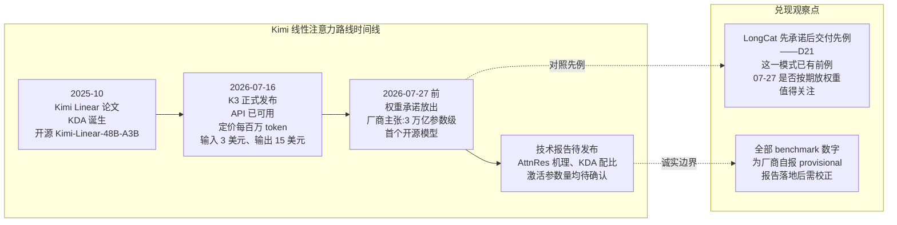
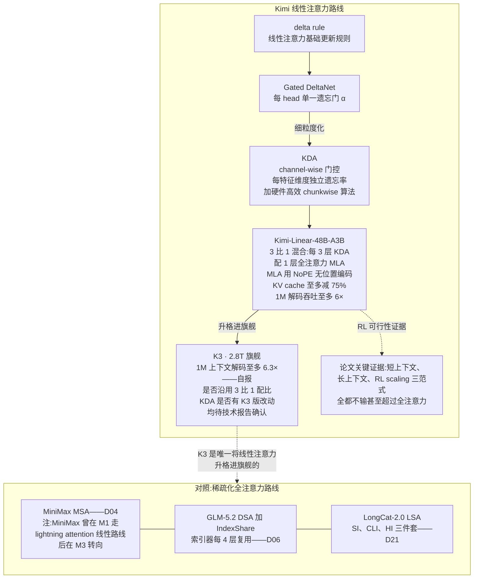
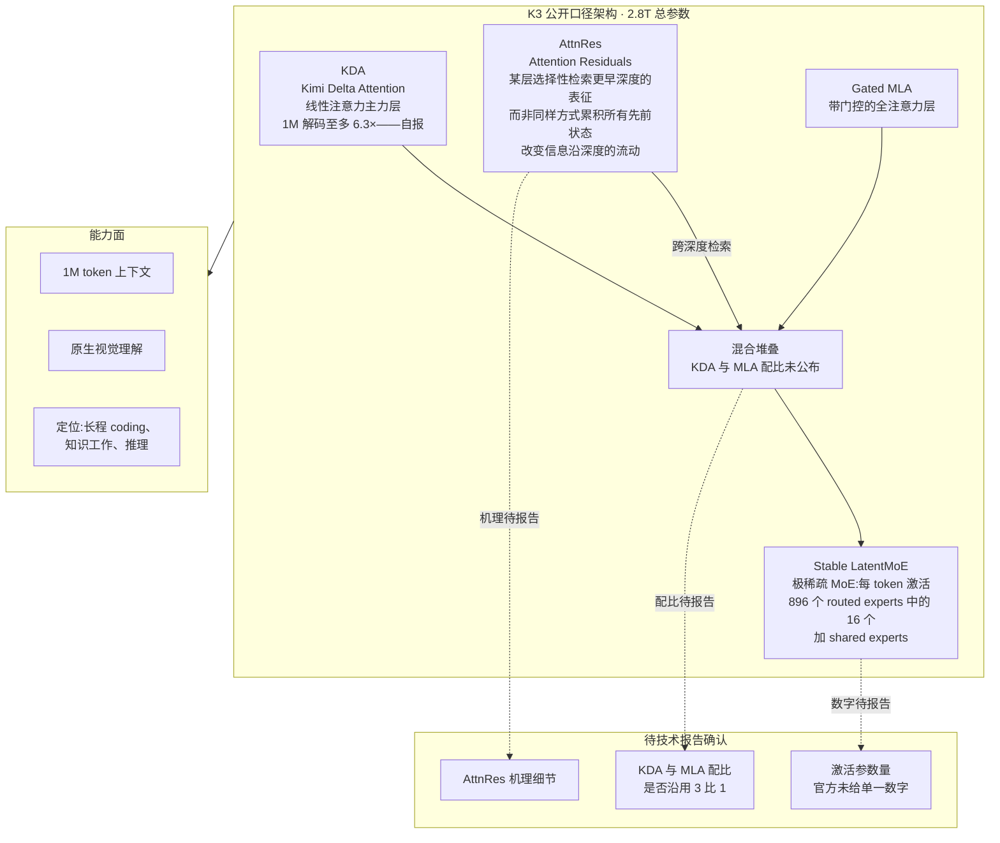
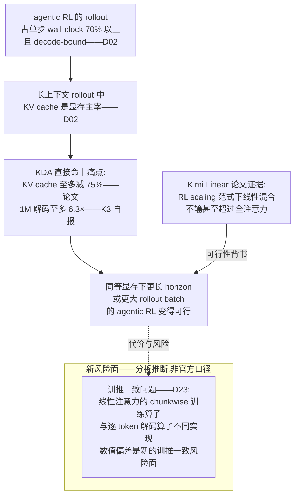

# Dispatch 24 · Kimi K3 首发解读:线性注意力第一次登上开源旗舰

*2026-07-17 · NPU Frontier Dispatch · Kimi-K3 / KDA / linear-attention / RL-on-NPU*

> **TL;DR** — 2026-07-16,月之暗面发布 **Kimi K3**:2.8T 总参数极稀疏 MoE(每 token 激活 16/896 个 routed experts + shared experts),架构四件套 KDA + AttnRes + Gated MLA + Stable LatentMoE,原生视觉理解、1M token 上下文,定价 $3/$15 每百万 token 直接对标 Claude Sonnet 档,承诺 2026-07-27 前开源权重。**完整技术报告尚未发布**,本篇定位是首发解读:所有 benchmark 与提速数字均为厂商自报、按 provisional 处理,机理层面的判断以官方博客口径 + KDA 谱系论文(Kimi Linear,arXiv 2510.26692)外推为准,报告落地后本看板逐项跟进校正。核心看点:这是线性注意力第一次进入开源旗舰级模型的主力架构。

承接本看板脉络:D02 阐明了 rollout 是 agentic RL 的 wall-clock 主宰、D04/D06/D21 追踪了 MiniMax MSA、GLM-5.2 DSA+IndexShare、LongCat-2.0 LSA 三条"稀疏化全注意力"路线、D23 铺开了训推一致的问题地图——K3 在这四条线索的交汇点上,给出了第四条截然不同的答案。

---

## 1 · 发布了什么:事实清单

2026 年 7 月 16 日,月之暗面(Moonshot AI)发布 Kimi K3(官方 tech blog:kimi.com/blog/kimi-k3)。先列齐公开口径的事实——注意,**完整技术报告尚未发布**,官方链接指向一份"未来的技术报告",所以本篇定位是首发解读,所有机理层面的判断以公开博客口径 + KDA 谱系论文外推为准,报告落地后本看板会跟进校正(处理方式与 D21 的 LongCat-2.0 一致)。

- **规模**:2.8T 总参数,极稀疏 MoE——每 token 激活 16/896 个 routed experts,外加 shared experts(所谓 "Stable LatentMoE" 层)。**具体激活参数量官方未给出单一数字**,请勿将任何第三方推算值作为官方数据引用。
- **架构四件套**:Kimi Delta Attention(KDA)+ Attention Residuals(AttnRes)+ Gated MLA + Stable LatentMoE。
- **模态与上下文**:原生视觉理解;1M token 上下文。
- **速度主张**:KDA 在 1M 上下文下解码提速至多 6.3×(自报,provisional)。
- **Benchmark(全部厂商自报,provisional)**:DeepSWE 67.5、FrontierSWE 81.2、Kimi Code Bench 2.0(内部)72.9、Terminal-Bench 2.1 88.3、Program Bench 77.8、SWE Marathon 42.0。
- **定价**:$3 / $15 每百万 token(输入/输出),直接对标 Claude Sonnet 价位档;API 已可用。
- **开源承诺**:权重承诺 2026-07-27 前放出,厂商主张这将是"3 万亿参数级的首个开源模型"——注意这是**尚未兑现的承诺**,截至发稿权重未发布。
- **定位**:长程 coding、知识工作、推理。

本次发布的核心看点:这是**线性注意力第一次进入开源旗舰级模型的主力架构**。前几期看板里 MiniMax、GLM、LongCat 走的都是"稀疏化全注意力",Kimi 是唯一替换状态更新方程本身的厂商。下面逐层拆解。

```mermaid
flowchart LR
    subgraph TL ["Kimi 线性注意力路线时间线"]
        T1["2025-10<br/>Kimi Linear 论文<br/>KDA 诞生<br/>开源 Kimi-Linear-48B-A3B"] --> T2["2026-07-16<br/>K3 正式发布<br/>API 已可用<br/>定价每百万 token<br/>输入 3 美元、输出 15 美元"]
        T2 --> T3["2026-07-27 前<br/>权重承诺放出<br/>厂商主张:3 万亿参数级<br/>首个开源模型"]
        T3 --> T4["技术报告待发布<br/>AttnRes 机理、KDA 配比<br/>激活参数量均待确认"]
    end
    subgraph NOTE ["兑现观察点"]
        N1["LongCat 先承诺后交付先例——D21<br/>这一模式已有前例<br/>07-27 是否按期放权重<br/>值得关注"]
        N2["全部 benchmark 数字<br/>为厂商自报 provisional<br/>报告落地后需校正"]
    end
    T3 -. "对照先例" .-> N1
    T4 -. "诚实边界" .-> N2
```

## 2 · KDA 谱系:从 Kimi Linear 到旗舰落地

K3 的核心架构选择 KDA 并非凭空出现,它有一条清晰的谱系,落点是 2025 年 10 月的 Kimi Linear 论文(arXiv 2510.26692),配套开源了 Kimi-Linear-48B-A3B-Instruct(HF 可下载)。理解 K3,先要理解这条递进链:

**delta rule → Gated DeltaNet → KDA**

1. **Delta rule**:经典线性注意力把上下文压进一个固定大小的矩阵状态 S,每步做 `S ← S + v·kᵀ` 式的累加——问题在于只增不删,状态会被旧信息污染。Delta rule 的改进是"先擦后写":用当前 key 检索出状态里的旧关联,减去,再写入新关联,相当于对固定容量的记忆做**定向覆写**而非无差别累加。
2. **Gated DeltaNet**:在 delta rule 之上加遗忘门——每个 head 一个标量 α,控制整个状态矩阵的衰减速率。这解决了旧信息无法衰减的问题,但粒度太粗:一个 head 内所有特征维度共享同一个遗忘率。
3. **KDA**:把门控做到 **channel-wise**——每个特征维度有独立的遗忘率。直觉上,状态矩阵的不同维度承载不同类型的信息:有的维度在追踪局部句法(应快速遗忘),有的在保持一个长程绑定,比如变量名与其定义的关联(应缓慢遗忘)。每 head 单一 α 迫使这些信息以同一速率衰减,channel-wise 门控则允许模型对记忆的每个存储位分别决定保留多久——这是从"整块记忆统一衰减速率"到"逐维精细记忆管理"的跨越。代价是计算结构更复杂,所以 KDA 的另一半贡献是**硬件高效的 chunkwise 算法**:把 token 序列切块,块内用矩阵乘并行、块间递推传递状态,使训练吞吐不受 recurrent 结构拖累。

**3:1 混合与 NoPE 分工**。Kimi Linear 不是纯线性:每 3 层 KDA 配 1 层全注意力 MLA,消融显示 3:1 是吞吐 × 验证损失的最优点。更精巧的是分工设计:MLA 层用 **NoPE(无位置编码)**,位置信息和 recency bias **全部交给 KDA 层承担**——因为 KDA 的逐维遗忘门天然就是一种数据依赖的位置衰减机制,全注意力层则被解放出来做纯内容寻址的精确检索。这个分工使两种层各自承担所长,而非互相冗余。工程收益:KV cache 至多减 75%(只有 1/4 的层需要 KV cache),1M 上下文解码吞吐至多 6×。

**三范式主张——尤其是 RL scaling**。Kimi Linear 论文最重的一条主张:在短上下文、长上下文、**RL scaling** 三种范式下,混合线性架构全都不输甚至超过全注意力基线。前两条业界已有零散证据,第三条是关键增量——这是"线性注意力能进 RL 训练"迄今最直接的证据。这条主张对本看板意义重大:D02 已说明,RL 后训练的单步 wall-clock 里 rollout 占 70%+ 且 decode-bound;如果线性注意力在 RL 范式下质量失效,那它省下的推理成本就只对 serving 有意义、对训练闭环没意义。Kimi Linear 的结论是:质量不降,甚至更好。K3 定位"长程 coding + 推理"(意味着重度 RL 后训练),等于在旗舰尺度上验证这条论文主张。

**跨度与风险**。从 48B-A3B 的验证模型到 2.8T 的旗舰,规模跨了约 60 倍。3:1 配比在 2.8T 尺度是否仍是最优、K3 的 KDA 是否有版本改动、MLA 是否还是 NoPE——官方均未说明,**全部待技术报告确认**。架构结论随规模迁移并非无代价,这是本次发布最大的不确定性来源。

```mermaid
flowchart TB
    subgraph LIN ["Kimi 线性注意力路线"]
        L1["delta rule<br/>线性注意力基础更新规则"] --> L2["Gated DeltaNet<br/>每 head 单一遗忘门 α"]
        L2 -->|"细粒度化"| L3["KDA<br/>channel-wise 门控<br/>每特征维度独立遗忘率<br/>加硬件高效 chunkwise 算法"]
        L3 --> L4["Kimi-Linear-48B-A3B<br/>3 比 1 混合:每 3 层 KDA<br/>配 1 层全注意力 MLA<br/>MLA 用 NoPE 无位置编码<br/>KV cache 至多减 75%<br/>1M 解码吞吐至多 6×"]
        L4 -->|"升格进旗舰"| L5["K3 · 2.8T 旗舰<br/>1M 上下文解码至多 6.3×——自报<br/>是否沿用 3 比 1 配比<br/>KDA 是否有 K3 版改动<br/>均待技术报告确认"]
        L6["论文关键证据:短上下文、<br/>长上下文、RL scaling 三范式<br/>全都不输甚至超过全注意力"]
        L4 -. "RL 可行性证据" .-> L6
    end
    subgraph SPARSE ["对照:稀疏化全注意力路线"]
        S1["MiniMax MSA——D04<br/>注:MiniMax 曾在 M1 走<br/>lightning attention 线性路线<br/>后在 M3 转向"]
        S2["GLM-5.2 DSA 加 IndexShare<br/>索引器每 4 层复用——D06"]
        S3["LongCat-2.0 LSA<br/>SI、CLI、HI 三件套——D21"]
    end
    S1 --- S2 --- S3
    L5 -. "K3 是唯一将线性注意力<br/>升格进旗舰的" .-> SPARSE
```

## 3 · 四条注意力路线的分岔口

到 K3 为止,本看板追踪的旗舰级"注意力降本"路线已集齐四条,可以画一张清晰的分岔图:

| 路线 | 代表 | 哲学 | KV cache |
|---|---|---|---|
| MSA | MiniMax-M3(D04) | 稀疏化全注意力 | 仍在,被裁剪 |
| DSA + IndexShare | GLM-5.2,索引器每 4 层复用(D06) | 稀疏化全注意力 | 仍在,被索引 |
| LSA(SI/CLI/HI) | LongCat-2.0(D21) | 稀疏化全注意力 | 仍在,分层稀疏 |
| **KDA 混合** | **Kimi K3** | **线性注意力** | **KDA 层无 KV cache(若沿用 Kimi Linear 的 3:1 配比即 3/4 的层;K3 配比待报告确认)** |

前三家的共同哲学是:**保留 softmax attention 的计算形式,只是选择部分 token 参与计算**——注意力矩阵还是那个矩阵,只是变稀疏了;KV cache 还是那个 cache,只是访问模式变了。这条路的好处是保守:任何一个 token 理论上仍可被精确检索,failure mode 与全注意力连续。

Kimi 走的是另一条哲学:**改掉状态更新方程本身**。KDA 层没有 KV cache,只有一个固定大小的矩阵状态——无论上下文多长,状态都不增长。这意味着信息必须被**有损压缩**进固定容量,靠遗忘门决定留什么;换来的是解码每 token 成本与上下文长度无关(KDA 层部分)。两条哲学的本质差异就在这里:稀疏化是"存储全量、选择性读取",线性是"边读边压缩、只保留摘要"——前者的显存随上下文线性增长(系数降低的线性),后者是常数。

其他厂商未采用而 Kimi 采用,原因有二。其一,线性注意力有过回退先例:MiniMax 在 M1 用 lightning attention 走过线性路线,后来在 M3 转回稀疏化(脉络见 D04)——业界普遍担心线性架构在精确检索、长程 recall 上的天花板,以及 RL 训练下的稳定性。其二,Kimi 有**九个月的验证期**:从 2025-10 的 Kimi Linear 论文 + 开源 48B 模型,到 2026-07 的 K3,中间有九个月的时间在真实训练管线里验证与试错。区别在于:其他厂商缺少验证积累,Kimi 已完成一轮验证——当然,48B 的验证能否覆盖 2.8T 的风险面,仍是上一节所述的未知数。

## 4 · AttnRes 与 Stable LatentMoE:另外两个待确认组件

四件套里 KDA 和 Gated MLA 有谱系可考,另外两个组件目前只有名字和一句话口径。

**AttnRes(Attention Residuals)**。官方口径:让某层**选择性检索更早深度的表征**,而非以同样方式累积所有先前状态——改变信息沿模型深度的流动。机理细节待报告,但可作有依据的推测(**以下为推断,非官方**):标准 residual stream 是"逐层累加"——第 N 层看到的是前面所有层输出的和,深层若需使用某个浅层的特定表征,只能依赖其未被后续层的累加稀释。AttnRes 的字面含义是把这个"被动累加"改成"主动检索":某些层可以带权地、选择性地读取某个更早深度的输出,类似在深度方向上做了一次注意力/门控选择。如果属实,这对超深模型(2.8T 规模的层数不会少)的梯度传播和特征复用都有意义——浅层的精确 token 表征可以被深层直接调取,而不必在 residual stream 里"幸存"几十层。是否与 KDA 层的有损压缩形成互补(线性层压缩丢失的细节,或可由浅层残差补回)——此为猜想,待报告。

**Stable LatentMoE 与 16/896 极稀疏**。每 token 激活 16/896 个 routed experts,激活比约 1.8%,加上 shared experts 兜底。这个稀疏度带来的优化难度是实际存在的:路由器要在 896 个选项里做 top-16 选择,专家负载均衡、路由训练早期的塌缩风险、以及**训推一致性**问题都会被放大——D23 讨论过,MoE 路由在训练和推理引擎间的数值差异会导致选中的专家集合不一致,专家数越多、选择越稀疏,同样大小的 logit 扰动越容易翻转 top-k 边界上的专家。名字里的 "Stable" 和 "Latent" 暗示做了某种稳定化路由(可能指 latent 空间路由,或与 MLA 的 latent 压缩思路对照)——**同样是推断**,机理待报告。

```mermaid
flowchart TB
    subgraph K3 ["K3 公开口径架构 · 2.8T 总参数"]
        A1["KDA<br/>Kimi Delta Attention<br/>线性注意力主力层<br/>1M 解码至多 6.3×——自报"]
        A2["AttnRes<br/>Attention Residuals<br/>某层选择性检索更早深度的表征<br/>而非同样方式累积所有先前状态<br/>改变信息沿深度的流动"]
        A3["Gated MLA<br/>带门控的全注意力层"]
        A4["Stable LatentMoE<br/>极稀疏 MoE:每 token 激活<br/>896 个 routed experts 中的 16 个<br/>加 shared experts"]
        A1 --> MIX["混合堆叠<br/>KDA 与 MLA 配比未公布"]
        A3 --> MIX
        A2 -->|"跨深度检索"| MIX
        MIX --> A4
    end
    subgraph CAP ["能力面"]
        C1["1M token 上下文"]
        C2["原生视觉理解"]
        C3["定位:长程 coding、<br/>知识工作、推理"]
    end
    K3 --> CAP
    subgraph TBD ["待技术报告确认"]
        P1["AttnRes 机理细节"]
        P2["KDA 与 MLA 配比<br/>是否沿用 3 比 1"]
        P3["激活参数量<br/>官方未给单一数字"]
    end
    A2 -. "机理待报告" .-> P1
    MIX -. "配比待报告" .-> P2
    A4 -. "数字待报告" .-> P3
```

## 5 · 评测分数与定价怎么读

先提示风险再谈战略。

**评测分数:三重折扣**。第一,六项 benchmark 全部厂商自报,provisional,无第三方复现。第二,这批名目——FrontierSWE、DeepSWE、SWE Marathon、Program Bench——是新一代基准体系,与旧 SWE-bench Verified **不可跨表比较**;尤其注意 Kimi Code Bench 2.0 是内部基准,参考价值进一步降低。第三,跨厂商也不可比:D21 里 LongCat-2.0 自报 SWE Pro 59.5,和 K3 的 FrontierSWE 81.2 / DeepSWE 67.5 属于不同分数体系,任何"K3 比 LongCat 高 X 分"的说法都是错误比较——D21 已有"新基准名目无锚点"的教训,此处再次强调。能读出的可靠信号只有一个:六项全是 coding/agentic 长程任务,配合 SWE Marathon(名字暗示超长程任务)42.0 这种主动公布偏低分数的做法,说明官方叙事重心是**长程 agent 工作负载**,与 1M 上下文 + KDA 解码提速的架构选择自洽。

**定价:$3/$15 的战略含义**。对标 Claude Sonnet 价位档,而非折价销售——这传递两个信息。其一,自信:定价即定位,Moonshot 认为 K3 的能力配得上 Sonnet 档。其二,更值得注意的是成本结构:如果 KDA 的 75% KV 减省和 6.3× 长上下文解码提速(自报)在生产 serving 中兑现,那么**同样的标价下,长上下文请求的毛利结构会显著优于全注意力同行**——线性注意力的架构红利可以选择不降价、转化为利润率,或留作未来价格竞争的空间。这是架构选择直接传导到商业面的少见案例。

**"3 万亿级首个开源":07-27 是关键验证点**。这是厂商主张,且截至发稿权重未放出。D21 记录过 LongCat 的先承诺后交付的先例——先宣布后交付(LongCat 最终兑现了 MIT 权重,属于良性先例)。K3 承诺 07-27 前放权重,距发布 11 天。是否放出、是否为完整权重(而非蒸馏版或删减版)、许可证是什么——这三个问题在 07-27 之前均无答案。本看板届时跟进。

## 6 · 对 RL-on-NPU 的含义

回到本看板的主线关切。

**KDA 精准打在 rollout 痛点上**。D02 的结论:RL 单步 wall-clock 里 rollout 占 70%+,且 rollout 是 decode-bound;长上下文 rollout 的显存主宰是 KV cache——batch size 被 KV cache 卡死,decode 吞吐又决定整个 RL 迭代速度。逐项对照:KDA 的 KV cache 至多减 75%(→ 同显存下 rollout batch 翻倍以上的空间),1M 解码至多 6.3×(自报,→ 直接压缩 rollout wall-clock)。这两个数字即便按七成兑现,对长程 agentic RL 的训练经济学也是结构性改善。再叠加 Kimi Linear 论文的 RL scaling 主张(线性混合架构 RL 质量不输),等于推理降本与 RL 可训练两方面都有论文背书——当然,2.8T 尺度的 RL 表现仍要等报告。

**NPU 亲和性(以下为分析推断,标注)**。理论上,KDA 的 chunkwise 算法把计算主体组织成块内稠密矩阵乘,这正是 NPU(如昇腾的 cube 单元)最擅长的形态——比稀疏注意力的不规则 gather/scatter 访存模式对 NPU 友好得多,后者恰是 D06 讨论 DSA 时的落地痛点。但硬币另一面:KDA 是新算子,chunkwise 训练 kernel 与逐 token recurrent 解码 kernel 在 CANN 生态里大概率**都没有现成实现**,CUDA 侧至少还有 Kimi Linear 开源实现可参考。对 RL-on-NPU 参与者,这是"架构形态友好、算子生态空白"的组合——机会与工程量并存。

**新的训推一致风险面(推断,承 D23)**。D23 的框架:训推一致的风险出在"训练算子与推理算子是两套实现"。线性注意力把这个风险面推到新的位置——训练/prefill 走 chunkwise 并行算子,解码走逐 token recurrent 算子,**两者在数学上等价、在浮点上不等价**;误差沿固定大小状态逐 token 累积,序列越长(上限 1M)漂移越远。RL 场景下这就是 rollout 分布与训练分布的系统性偏差来源,叠加 16/896 极稀疏路由的翻转敏感性(见上节),K3 的训推一致工程难度可能是本看板追踪过的模型里最高的一档。此为推断,官方未提及。

```mermaid
flowchart TB
    R1["agentic RL 的 rollout<br/>占单步 wall-clock 70% 以上<br/>且 decode-bound——D02"] --> R2["长上下文 rollout 中<br/>KV cache 是显存主宰——D02"]
    R2 --> R3["KDA 直接命中痛点:<br/>KV cache 至多减 75%——论文<br/>1M 解码至多 6.3×——K3 自报"]
    R3 --> R4["同等显存下更长 horizon<br/>或更大 rollout batch<br/>的 agentic RL 变得可行"]
    R5["Kimi Linear 论文证据:<br/>RL scaling 范式下线性混合<br/>不输甚至超过全注意力"] -->|"可行性背书"| R4
    subgraph RISK ["新风险面——分析推断,非官方口径"]
        X1["训推一致问题——D23:<br/>线性注意力的 chunkwise 训练算子<br/>与逐 token 解码算子不同实现<br/>数值偏差是新的训推一致风险面"]
    end
    R4 -. "代价与风险" .-> X1
```

**报告落地后的核对清单**(本看板跟进项):

1. **混合配比**:K3 是否沿用 3:1 KDA:MLA?MLA 层是否仍是 NoPE?2.8T 尺度有无重新消融?
2. **激活参数量**:官方给出确数,更新 compare.json(现有列:DeepSeek-V4 / MiniMax-M3 / GLM-5.2 / LongCat-2.0 / DeepSeek-V3.2(ref),K3 列待补)。
3. **AttnRes 机理**:跨深度检索的具体形式(门控?注意力?静态连接?),与 KDA 有损压缩是否存在互补设计。
4. **RL 后训练细节**:线性混合架构下的 RL 配方、rollout 引擎与训推一致处理(chunkwise/recurrent 两套算子如何对齐)、长程任务的 credit assignment。
5. **训练基建**:2.8T 极稀疏 MoE + 线性注意力的并行策略、KDA chunkwise kernel 的实现与开源计划、以及有无非 NVIDIA 硬件的适配信号。
6. **07-27 权重兑现**:完整性、许可证、以及是否附带小尺寸验证版。

小结:K3 是四条注意力路线分岔后,唯一走"改方程"而非"挑 token"的旗舰——其成败不仅关乎 Moonshot 一家,而是"线性注意力能否承载旗舰级 agentic RL"这个问题的第一次全尺度实验。报告与权重落地前,一切数字按 provisional 处理;落地后,本看板逐项核对。

## 7 · 跟进更新:技术报告落地,逐项核对(2026-08-10)

技术报告已发布([arXiv:2607.24653](https://arxiv.org/abs/2607.24653),《Kimi K3: Open Frontier Intelligence》,47 页),权重开源也已兑现(报告明言 "We release the full Kimi K3 model weights")。本节按第 6 节留下的核对清单逐项核对,并把报告里对本看板各条主线的"意外收获"记录在案。以下全部为报告口径(一手来源,不再标 provisional,但注意评测分数仍是厂商自评 harness)。

### 7.1 核对清单核对

| 首发解读留下的问题 | 报告答案 | 首发判断对错 |
|---|---|---|
| K3 是否沿用 Kimi Linear 的 3:1 配比? | **保留**:每 block 3 层 KDA + 1 层 Gated MLA,全模型 93 层 = 69 KDA + 24 MLA | ✓ 猜想成立 |
| 激活参数量? | **104.2B**(总参 2.78T,对比 K2 的 1.04T/32.6B) | 首发时拒绝引用第三方推算是对的 |
| AttnRes 机理? | 学习到的**伪查询(pseudo-queries)**对 embedding 与所有前序 block 输出计算注意力权重,跨深度选择性检索;推理时配两阶段 Block AttnRes kernel | 首发的"跨深度选择性检索"定性猜想方向正确 |
| 位置编码? | **NoPE**——位置信息全部由 KDA 的递归门控与衰减隐式承载,**1M 上下文零位置编码修改直接外推**(渐进课程:预训练 8K→64K,cooldown 256K→1M) | 与 Kimi Linear 的 NoPE 分工一脉相承 |
| 其余组件 | SiTU-GLU 激活函数、Quantile Balancing 负载均衡、Per-Head Muon 优化器、MoonViT-V2 原生视觉(401M);cosine decay 击败 WSD(各自调最优超参后比较) | 报告披露的信息比博客口径多一整层 |
| 对 K2 的提升 | 架构+数据+配方合计 **scaling 效率约 2.5×**(scaling law 曲线口径) | 新信息 |

### 7.2 对看板各主线的"意外收获"

这份报告几乎给本看板每条主线都补了一块生产级证据,密度罕见:

**① MXFP4 QAT 贯穿后训练——D27"量化层训推一致"的最强新样本。** 报告明确:从 SFT 阶段起做 QAT,**MoE 专家权重 MXFP4、激活 MXFP8**,非专家组件保高精度,贯穿整个后训练;**RL 期间 rollout 与训练共用同一量化方案,"消灭训推失配"**(原文 "eliminating the train-inference mismatch")。三个看板级含义:(a) D27 写的"训练末段 QAT 成万亿 MoE 新默认"再添分量最重的旗舰案例——而且从 INT4(K2 Thinking)升级到了 **MXFP4**;(b) D27 的"4-bit 起分歧"格局中,Kimi 选择了**开放 MX 标准**而非 NVFP4——继 gpt-oss、DeepSeek UE8M0 之后,MX 阵营再添一家旗舰厂商;(c) 数值对齐派(D27 第 4 节)拿到了 4-bit 级的生产实证。

**② 预算控制的 Reasoning Effort RL——D25"效率感知 RL"的生产配方。** 报告的做法与 D25 讨论的设计空间惊人对齐:每个问题 x 关联初始 token 预算 b0(x)(由冷启动模型估计),轨迹总 token 超过 τ·b0(x) 直接把任务奖励改写为 **-1**;τ 按域分阶段退火(先 max-budget 再收紧出 high/low 档);agentic 任务的 T(y) 计入推理轨迹+工具调用参数的累计输出。配套的 Agentic GRM(锦标赛式二元比较)也引入了**冗长度预算**:输出超 σ·ℓ0 自动判负——正是 D25 所指的"防 verbose reward hacking"。K3 用三域 × 三档 effort 训出 **9 个专家**再 MOPD 合并,效率控制是一等公民而非事后补丁。

**③ Agentic RL 系统全景——D02/D23 的又一份对照答案。** 同步框架 + **partial rollout 扩展**(λ 比例完成即推进优化,暂停轨迹入队下轮续跑;per-token 正则让算法容忍跨迭代的极端 off-policy);co-located 设计把单个 1M 上下文 RL 实验控制在**数百 GPU**;外部 KV 池(闲置前缀 write-back 到 CPU DRAM,KDA 状态与 MLA 块同生命周期迁移;训练态权重/优化器下放 NVMe 以释放 DRAM);rollout 自动限流调度器按 KV 压力动态控并发;引用模型不驻显存、借用策略模型的 FP32 梯度 buffer 分块流式前向。

**④ AgentENV 沙箱开源——D23"沙箱成本主导"的最有力量化证据。** microVM(Firecracker)沙箱系统,**已开源**([github.com/kvcache-ai/AgentENV](https://github.com/kvcache-ai/AgentENV)):增量 checkpoint 133ms / resume 49ms;**Pause/Resume**——模型推理等待可占沙箱生命周期 **98%**,暂停期零内存零 CPU;**Fork** 用于无副作用判分;OverlayBD+P2P 秒级万箱启动,内存超卖 **6.5×**。全程数字:**训练+评测共创建 51,219,741 个沙箱、1,505,678 个镜像**。这组数字既证实了 D23"沙箱是主导成本"的判断,也直接回应 D26 layer 六——"工具等待期资源怎么办"在 K3 这里的答案是暂停 microVM 而不是换出 KV。

**⑤ KDA-aware 前缀缓存与机队调度——D26"agent-aware serving"的生产落地。** 混合架构双缓存(MLA 逐 token 分页 vs KDA 定长递归状态)统一进同一分页池;**512-token 细粒度 hash 块**与稀疏 KDA checkpoint(对齐会话轮边界)解耦,任意 512 边界可复用前缀;机队级 **cache-aware affinity scheduling**(典型 coding 请求:400K 前缀 + 仅 4K 增量,命中与 miss 差几个数量级)+ **budget-based admission control** 防长上下文突发拖垮 SLO。D26 所指的"空白领域"子项,在 K3 的生产系统里已是投产组件。

**⑥ KDA×投机解码的回滚问题——D24 第 6 节预警的风险面,报告已给出解法。** MTP 层微调成 EAGLE-3 式 draft(直接优化接受率的 LK 损失,不用 KL 代理);KDA 递归状态原地更新导致草稿被拒后无法回滚——解法是**只缓存草稿 token 的投影输入、片上重建被接受前缀的状态**(与同期 ReplaySSM 思路重合),验证时延随验证 token 数亚线性增长。首发解读把"线性注意力×投机解码"列为新训推一致风险面,报告证明这个风险真实存在且已有工程解。

**⑦ 统一白盒 RL 环境——防 harness 过拟合。** 把 agent harness 拆成可配置模块(工具接口/系统提示/上下文管理/skills/记忆/子 agent),可实例化 Kimi Code、Claude Code、Codex、OpenClaw、Hermes 等主流 harness 并动态混合训练——回应了 D12/D22 语境里"scaffold 绑定"的老问题,也是"训练时就见过你的 harness"这一产品主张的技术底座。

### 7.3 评测分数的最终口径

报告自评(effort=max):K3 **整体落后 Claude Fable 5 与 GPT-5.6 Sol,稳定领先其余开源与闭源模型**;DeepSWE 67.5(v1.1;mini-SWE-agent harness 下 67.3)、Terminal-Bench 2.1 88.3、GPQA Diamond 93.5、HLE-Full 43.5/56.0(无/有工具)。首发解读"新基准体系不可跨表比"的警示保持不变——但报告把 harness、温度、top-p 全部披露,可复现性比博客口径强了一档。

### 7.4 总结

首发解读的核心判断全部成立:3:1 配比保留、"线性注意力升格旗舰"成立、风险面(投机×递归状态)真实存在。报告超出预期的部分在系统侧——**它同时是 D25(预算控制 RL)、D26(agent-aware serving)、D27(MXFP4 QAT 训推一致)三篇的生产级印证**,一份报告同时支撑四期内容。悬置项收窄为:第三方复测评测分数、以及 2.8T/MXFP4 权重在非 NVIDIA 硬件(昇腾)上的适配路径——KDA kernel 与 CANN 的距离,现在是"开源权重已就位"之后唯一的主要障碍。

## 下一步看什么

1. **2026-07-27 权重兑现**:是否按期放出、是否完整权重(而非蒸馏版或删减版)、许可证条款——"3 万亿级首个开源"的厂商主张能否落地,这是 11 天内最关键的观察点。
2. **技术报告发布**:上面第 6 节的六项核对清单逐项对表——尤其是 KDA:MLA 配比、激活参数量确数、AttnRes 机理与 RL 后训练配方;报告落地后本看板出校正篇并补 compare.json 的 K3 列。
3. **第三方复现与独立评测**:六项自报 benchmark 有无第三方完成复现,FrontierSWE/DeepSWE 等新基准体系有无跨厂商锚点出现。
4. **生态适配信号**:vLLM/SGLang 对 KDA 混合架构的支持进度,以及 CANN/NPU 侧有无 chunkwise + recurrent 双算子的实现动向——这直接决定 K3 对 RL-on-NPU 参与者是机会还是无法落地的设想。

---

**来源清单**:

- 官方发布博客:kimi.com/blog/kimi-k3(2026-07-16;完整技术报告尚未发布,官方链接指向未来技术报告)
- Kimi Linear 论文:arXiv 2510.26692(2025-10),配套开源 Kimi-Linear-48B-A3B-Instruct(Hugging Face)
- 第三方首发报道与解读:simonwillison.net、marktechpost(2026-07-16/17,WebSearch 多源交叉,2026-07-17)
- 本看板既有内容:D02(rollout 瓶颈)、D04(MiniMax MSA 与 M1 线性前科)、D06(GLM-5.2 DSA+IndexShare)、D21(LongCat-2.0 LSA 与先承诺后交付的先例)、D23(训推一致问题地图)

**Provisional 声明**:本文所有 K3 的 benchmark 分数、6.3× 解码提速、KV cache 减省比例均为厂商自报或论文自报数字,未经第三方复现;AttnRes 机理、Stable LatentMoE 路由机制、KDA 混合配比、激活参数量等均待官方技术报告确认;文中标注"推断"的段落为本看板分析性外推,非官方口径。"3 万亿参数级首个开源模型"为厂商尚未兑现的主张。技术报告与权重落地后,本看板将跟进校正。
