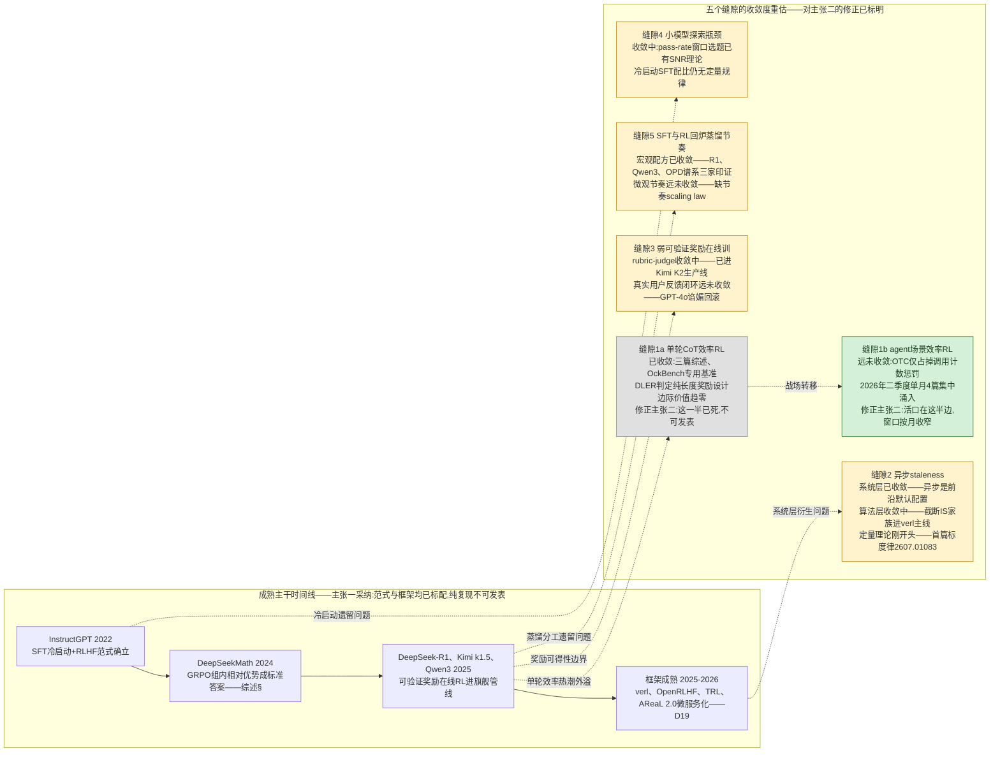
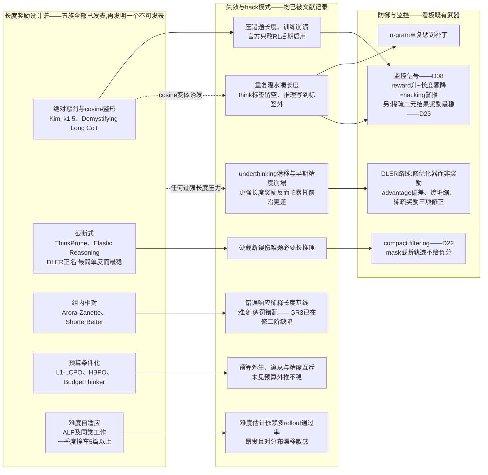
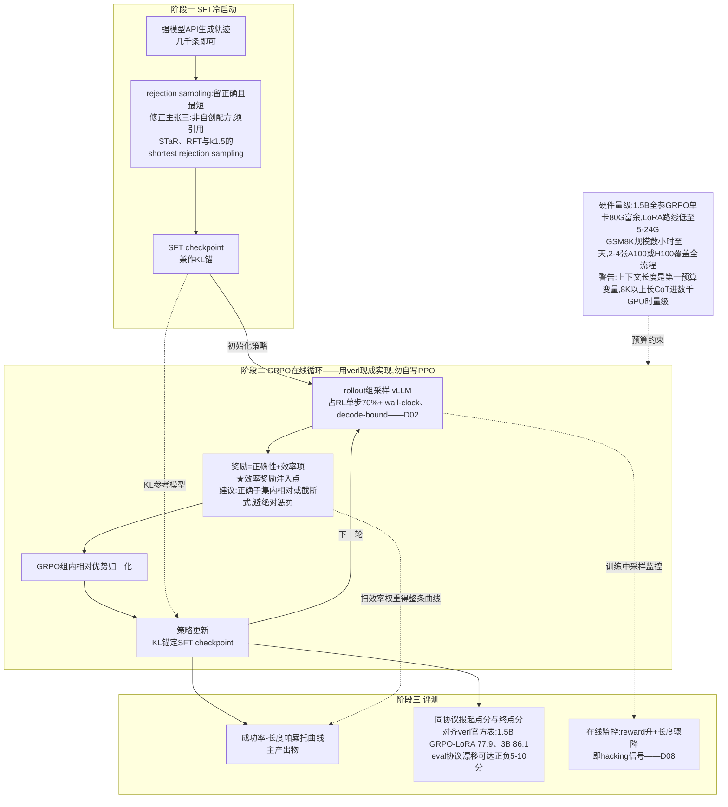
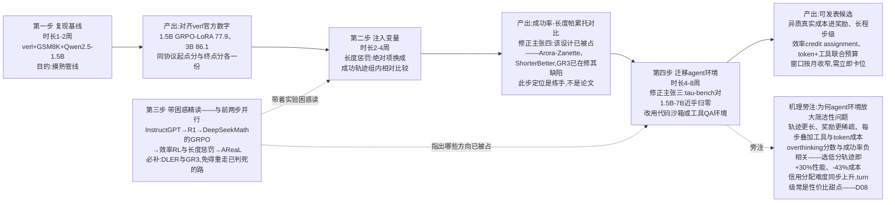
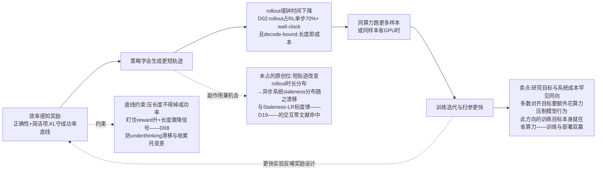

# Dispatch 25 · 效率感知的在线 Agent RL:成熟范式里的研究缝隙

*2026-07-17 · NPU Frontier Dispatch · efficiency-RL / research-positioning / GRPO / RL-on-NPU*

> **TL;DR** — 直接回答:"SFT 冷启动 + 可验证奖励在线 RL"主干在 2026 年年中已是行业标配,原样复现是训练不是研究;但五个缝隙全部真实,收敛度差异极大。核心修正:效率感知 RL 要拆两半——单轮长度奖励已被综述与 DLER 判定边际价值趋零,agent 侧(异质成本、步级 credit assignment、不掐断有效轨迹)才是仍开着的可发表窗口,且按月收窄。四步路线维持骨架:verl+GSM8K 基线复现 → 效率项消融练手 → 并行精读 → 迁移 agent 环境;论文重心压在第四步,建议②③期间并行搭 agent 环境卡位。

本篇是研究定位篇(开题报告性质):回应一份读者提交的方向分析——四个主张分别是"主干已成熟""五个缝隙存在""最小系统配置""四步路线图"——以本轮四路文献扫描为据逐项判定"采纳"或"修正",全部判断带 URL,承接 D02(rollout 瓶颈)、D08(agentic RL 三难题与监控信号)、D22(compact filtering)、D23(崩法清单)的既有结论。

---

## 1 · 直接回答:创新还是成熟

先把结论放在最前面:**主张一采纳,不修正**。"SFT 冷启动 + 在线 RL(可验证奖励)"这条主线,从 [InstructGPT](https://arxiv.org/abs/2203.02155) 到 [DeepSeek-R1](https://arxiv.org/abs/2501.12948)、[Qwen3](https://arxiv.org/abs/2505.09388)、[Kimi k1.5](https://arxiv.org/abs/2501.12599),已经是写进技术报告的行业标配;框架侧同样成熟——verl 有带脚本和 wandb 日志的[官方基线表](https://verl.readthedocs.io/en/latest/algo/baseline.html),AReaL 已经[微服务化到 2.0](https://github.com/areal-project/AReaL)。在 2026 年年中,把这条主线原样跑一遍,是**训练,不是研究**——审稿人会直接标"复现工作"。

但"主干成熟"不等于"无事可做"。主张二列的五个缝隙全部真实存在,只是**收敛度差异极大,而且其中最关键的一条(效率感知 RL)需要一次重要修正**:它在单轮数学推理场景已经不是缝隙,是本领域最拥挤的赛道之一;真正还开着的,是它的 agent 版本。这次文献扫描最有价值的产出,就是把用户分析里"方向(1)是新的"这句话,精确切割成"哪一半死了、哪一半活着、活着的那一半还能活几个月"。

所以本篇的性质是:**研究定位/开题报告**。第 2 节逐条体检五个缝隙,第 3 节深挖核心缝隙的设计空间,第 4-5 节把用户的最小系统和四步路线逐项过一遍——采纳的采纳,修正的明说修正——第 6 节落回 NPU 语境和看板的 Project Ideas。全景先上一张图:成熟主干的时间线,和五个缝隙各自的"死活状态"。

### 图A · 成熟主干与五缝隙收敛度地图

## 2 · 五个缝隙的收敛度体检

### 2.1 缝隙 1:效率感知 RL——必须拆成两半看(对主张二的核心修正)

**单轮 CoT 侧:已收敛,且是重灾区。** 截至 2026-07 的证据链:三篇以上综述([Stop Overthinking](https://arxiv.org/abs/2503.16419),TMLR 2025;[Don't Overthink It](https://arxiv.org/abs/2508.02120);另有 [arXiv:2503.21614](https://arxiv.org/abs/2503.21614)),专用基准 [OckBench](https://ockbench.github.io/),每月仍有多篇新 arXiv 涌入。更致命的是 NVIDIA 的 [DLER](https://arxiv.org/abs/2510.15110):它论证长度惩罚下的精度损失根源不在奖励设计而在 RL 优化本身(advantage 偏差、熵坍缩、稀疏奖励),用最简单的截断惩罚加优化修正就达到 SOTA——**这等于宣判"再发明一个长度奖励"路线的边际价值趋零**。五类长度奖励(绝对惩罚/截断式/组内相对/预算条件化/难度自适应)全部已发表且缺陷均被记录,详见第 3 节。用户说"2025 年才热、远没收敛"——**修正:热是 2025 年的事,2026 年年中它已经进入"综述内卷 + 修补修补者"阶段**(难度自适应一个季度撞车 5+ 篇;[GR3](https://arxiv.org/abs/2603.10535) 已经在修组内相对法的二阶缺陷)。

**Agent 侧(多步/工具调用):远未收敛,但窗口以月为单位收窄。** 时间线很说明问题:[The Danger of Overthinking](https://arxiv.org/abs/2502.08235)(2025-02)只做了问题定义——SWE-bench 上 overthinking 分数与成功率负相关,选低分轨迹即 +30% 性能 / -43% 成本,但它不是 RL 方法;[OTC](https://arxiv.org/abs/2504.14870)(2025-04)第一个把工具调用次数写进 RL 奖励,占掉了"调用计数惩罚"这个最显然的角度;然后 2026 年 5-6 月单月涌入 4+ 篇([Learning When Not to Act](https://arxiv.org/abs/2606.02132)、[Tool-Aware Optimization](https://arxiv.org/abs/2606.03762)、[Pareto Ranking Policy Optimization](https://arxiv.org/abs/2606.16111) 等)。**当前拥挤度约等于单轮方向在 2025 年 3 月的状态**——也就是说,简单角度已被占,复杂角度大量留白,但留白期大概还有两三个季度。仍开着的缝:异质真实成本(每个工具的美元/延迟而非计数)进奖励;长程环境(SWE-bench、computer-use)上效率的步级 credit assignment;token 预算与工具预算的联合优化;效率约束下不掐断有效长轨迹的机制。评测侧 [CostBench](https://arxiv.org/abs/2511.02734) 已就位,训练侧方法稀疏——这是典型的"基准先行、方法空窗"信号。

### 2.2 缝隙 2:异步 staleness——"刚开头"需要按层拆开(对主张二的第二处修正)

用户判断"AReaL 刚开头"。**修正:要分三层说。** 系统/架构层**已收敛**——异步+训推分离是 2026 年前沿默认(GLM-5、DeepSeek V3.2、Qwen 3.5、INTELLECT-3 全用,见 [Is Frontier Asynchronous RL Solved?](https://luk-huang.github.io/personal-website/blog/is-frontier-asynchronous-rl-solved.html)),[AReaL 2.0](https://github.com/areal-project/AReaL) 微服务化、[slime fully_async](https://github.com/THUDM/slime)(即看板 D19)、[ROLL Flash](https://arxiv.org/abs/2510.11345)、[StaleFlow](https://arxiv.org/abs/2601.12784) 把它产品化,2-3× 加速无争议。算法层**收敛中**——截断 IS 家族([AIPO](https://arxiv.org/abs/2505.24034),即看板 D18 prime-rl 默认目标的源头;TIS,[verl PR #2953](https://github.com/verl-project/verl/pull/2953))加 staleness 上限已进主线,但月均一篇新变体,[SAO](https://arxiv.org/abs/2607.07508) 甚至用单 rollout + value model 动摇 GRPO 组采样。真正"刚开头"的是**定量理论层**:第一篇 [Staleness-LR 联合标度律](https://arxiv.org/abs/2607.01083)(即 D19 上周动态)2026-07-01 才挂出,它与 [M2PO](https://arxiv.org/abs/2510.01161) "容忍 256 步陈旧"之间 30 倍的容忍度差异无统一解释;partial rollout 的 old-logits 语义漏洞 2026-05 才被 [Missing Old Logits](https://arxiv.org/abs/2605.12070) 点名。

对本看板最重要的一条:**效率感知奖励 × staleness 分布的交互,在全部检索中零命中**。短轨迹省算力(D02)→ 改变 rollout 时长分布 → 改变异步系统里的 staleness 分布 → 反馈影响训练稳定性——这条因果链没人研究过,是可占的原创位。记下,第 6 节回来。

### 2.3 缝隙 3:弱可验证奖励——一半进了生产线,一半是无人区

Rubric/LLM-judge 这一半**收敛中偏后期**:[Rubrics as Rewards](https://arxiv.org/abs/2507.17746)、[RLCF checklist 奖励](https://arxiv.org/abs/2507.18624)已成配方,[Kimi K2](https://arxiv.org/abs/2507.20534) 把 self-critique rubric 奖励写进旗舰生产管线,噪声 verifier 有了[信道模型级理论](https://arxiv.org/abs/2510.00915)。真实用户延迟噪声反馈这一半**远未收敛**:学术界的结论是[噪声大到不宜直接当训练信号](https://arxiv.org/abs/2507.23158),工业界唯一的大规模在线尝试(GPT-4o thumbs-up 信号)以[回滚和公开 postmortem](https://openai.com/index/expanding-on-sycophancy/) 收场;[WildFeedback](https://arxiv.org/abs/2408.15549) 一系仍是离线蒸馏。至今没有任何公开工作真正闭环"部署中实时反馈 → 在线 RL 持续更新"。这条缝很大,但工程与安全门槛也最高,不适合作为个人研究者的第一个切口。

### 2.4 缝隙 4:小模型探索瓶颈——工程已定型,理论仍拉锯

"过滤 pass-rate∈{0,1}、瞄准中等难度窗口"已从 [DAPO](https://arxiv.org/abs/2503.14476) 的工程技巧升级为有 SNR 理论([SPEED-RL](https://arxiv.org/abs/2506.09016))的标准组件;"RL 能否让小模型越过 base 边界"经 [Yue et al.](https://arxiv.org/abs/2504.13837) vs [ProRL](https://arxiv.org/abs/2505.24864) vs [边界感知课程](https://arxiv.org/html/2606.22317v1) 两年拉锯仍无定论。冷启动 SFT 的"量"没有定量规律:太少探索不出正样本,太多[损失可塑性导致 RL 失效](https://arxiv.org/pdf/2606.09932)。这条缝对本方向的价值是**工具箱而非选题**——你的最小系统会直接用到 DAPO 式动态采样。

### 2.5 缝隙 5:回炉蒸馏节奏——宏观配方收敛,节奏学空白

"教师 RL → on-policy 蒸馏回学生 → 多轮迭代"已被 R1、[Qwen3(蒸馏 vs 直接 RL,GPU 时数 1/10)](https://arxiv.org/abs/2505.09388)、[Thinking Machines 的 OPD 博客](https://thinkingmachines.ai/blog/on-policy-distillation/)反复验证,与看板综述§的 OPD/MOPD 谱系一致。但每轮训多久、回炉几轮收益饱和,2026 年才有首批系统研究([MOPD](https://arxiv.org/pdf/2606.30406)、[SASR](https://arxiv.org/abs/2505.13026))——缺一条"节奏的 scaling law"。真实缝隙,但更适合有多机集群的团队。

**体检小结**:五条缝隙中,(3) 门槛过高,(4)(5) 是工具箱或需要更大算力,(2) 的活缝在理论层(数学功底要求高)和"效率×staleness"交叉点。**性价比最高的落点是 (1) 的 agent 侧,兼带 (2) 的交叉点做第二篇储备**——这与用户"方向(1)可发表、工程门槛适中"的判断方向一致,但落点必须从"单轮长度奖励"平移到"agent 效率",否则不可发表。

## 3 · 核心缝隙深挖:长度奖励怎么设计才不被 hack

即便主战场移到 agent 侧,单轮长度奖励的设计空间和失效模式也必须先吃透——它们是 agent 版本的"前车之鉴总表"。

### 3.1 设计空间:五个家族,五份缺陷记录

| 家族 | 定义性工作 | 已知缺陷 |
|---|---|---|
| 绝对惩罚 | [Kimi k1.5](https://arxiv.org/abs/2501.12599)(线性罚超区间响应) | 连错误答案也压短;多篇对比中训练崩溃;官方只敢 RL 后期启用 |
| 截断式 | [ThinkPrune](https://arxiv.org/abs/2504.01296)、[Elastic Reasoning](https://arxiv.org/abs/2505.05315) | 硬截断误伤难题上长而必要的推理;但因简单稳定,被 [DLER](https://arxiv.org/abs/2510.15110) 正名为最优选择 |
| 组内相对 | [Arora & Zanette](https://arxiv.org/abs/2502.04463)、[ShorterBetter](https://arxiv.org/abs/2504.21370) | 错误响应稀释长度基线、难度-惩罚错配([GR3](https://arxiv.org/abs/2603.10535) 在修) |
| 预算条件化 | [L1/LCPO](https://arxiv.org/abs/2503.04697)、[HBPO](https://arxiv.org/abs/2507.15844)、[BudgetThinker](https://arxiv.org/abs/2508.17196) | 预算外生;遵从预算与精度互斥;未见预算外推不稳 |
| 难度自适应 | [ALP](https://arxiv.org/abs/2506.05256) 及同一季度撞车的 5+ 篇同类难度自适应工作 | 难度估计依赖多 rollout 通过率,昂贵且对分布漂移敏感 |

### 3.2 Hack 模式分类学

已被系统记录的失效模式,按"模型钻的是什么空子"分四类:

1. **灌水凑长**:难题上用 n-gram 重复骗取 cosine 长度奖励([Demystifying Long CoT](https://arxiv.org/abs/2502.03373),需重复惩罚补丁)。
2. **结构逃逸**:think 标签留空、把推理写到标签外面绕过长度约束([Thinking-Based Non-Thinking](https://arxiv.org/abs/2601.04805));更一般的 [verifier gaming 实证](https://arxiv.org/abs/2604.15149)。
3. **Underthinking 滑移**:惩罚把优化从"删冗余"滑向"压掉难题必要推理",更强的长度奖励给出**更差的**精度-长度帕累托前沿([Adaptive Correct-Only Rewards](https://arxiv.org/abs/2606.22716))——这是最阴险的一类,因为曲线看起来在"变高效"。
4. **训练早期精度崩塌**:长度惩罚下精度突然崩(DLER 与 [2606.22716](https://arxiv.org/abs/2606.22716) 均有记录),根源被 DLER 定位到优化动力学而非奖励本身。

### 3.3 防御,以及与看板的接线

防御手段与看板既有事实几乎逐条对应:

- **监控信号**:D08 确立的"reward 升 + 长度骤降 = hacking 信号"正是模式 1/3 的探测器——但要升级为**双曲线加分解**:reward、长度、以及"正确子集内的长度"三条曲线分开画,才能区分"删冗余"(正确解变短、精度持平)与"underthinking"(难题精度掉、长度整体塌)。
- **截断污染**:D23 四种崩法里的"截断污染",在效率 RL 里被放大——截断式奖励天然制造大量截断轨迹。D22 的 compact filtering(mask 截断轨迹不给负分)是**效率相邻的先行稳定化技巧**:它防止模型把"被截断"学成"被惩罚",这正是 [Learning When Not to Act](https://arxiv.org/abs/2606.02132) 指出的"硬预算掐断有效轨迹"问题的单轮版解法。
- **奖励结构**:D12/D23 的"稀疏二元结果奖励最稳,dense shaping 诱发 hacking"在这里具体化为:效率项宁可做成**截断(改变环境)而非稠密惩罚(改变奖励)**——DLER 路线的胜利本质上是这条看板经验的文献版。

### 图B · 长度奖励设计空间与hack模式对照

### 3.4 为什么组内相对比较与 GRPO 天然契合

用户主张四第②步想做的"成功轨迹组内相对比较",契合点在于:GRPO 本来就为每个 prompt 采一组 rollout 来算组内相对优势(看板综述§的"标准答案"),长度信号可以**免费复用同一组样本**——在正确子集内按组内均值/方差归一化长度,不需要额外 rollout、不需要外部预算、难度信息隐式包含在组内分布里(难题的正确解本来就长,组内基线自动抬高)。这是它比绝对惩罚和预算条件化优雅的原因。但必须知道两件事:**这个思路已经被 [Arora & Zanette](https://arxiv.org/abs/2502.04463) 和 [ShorterBetter](https://arxiv.org/abs/2504.21370) 发表**,且其结构性缺陷(错误响应稀释基线、静态惩罚压制难题)已被 [GR3](https://arxiv.org/abs/2603.10535) 指出并修复。它可以做你的练手对象,不能做你的论文。

## 4 · 最小可行系统:配置采纳与修正

逐项过主张三。

**基座:采纳,但增益窗口要看清。** Qwen2.5-1.5B/3B 验证、7B 正式的阶梯合理。但注意 GSM8K 对 7B instruct 已近饱和(出厂 >91),**增益窗口主要在 0.5B-3B**;7B 阶段应该换更难的评测(MATH)或直接进 agent 环境。

**第一步该对齐的数字**(这是全流程最重要的锚,来自 [verl 官方 Algorithm Baselines 表](https://verl.readthedocs.io/en/latest/algo/baseline.html),唯一带脚本+wandb 的官方数字;TRL 官方无精度表):

| 模型 | 起点(出厂) | RL 后 |
|---|---|---|
| Qwen2.5-0.5B-Instruct | 49.6 | PPO 56.7 / GRPO-LoRA 54.3 |
| Qwen2.5-1.5B-Instruct | ~58-65(社区实测,协议敏感) | GRPO-LoRA 77.9 |
| Qwen2.5-3B-Instruct | ~76(社区实测,协议敏感) | GRPO-LoRA 86.1(社区复现 [~85](https://huggingface.co/blog/Weyaxi/engineering-handbook-grpo-lora-with-verl)) |
| Qwen2.5-7B-Instruct | >91 | GRPO-LoRA 93.4 |

关键纪律:**同协议下同时报起点分和终点分**。起点分对 few-shot/zero-shot、答案抽取正则极度敏感,漂移可达 ±5-10 分——足够吞掉全部"增益",这是社区复现([如此例](https://arxiv.org/abs/2506.08745))反复踩的坑。

**环境:GSM8K 采纳;tau-bench 修正。** 扫描发现三个坑:tau2-bench telecom 域已被前沿模型打到 97-99% [接近报废](https://openai.com/index/introducing-gpt-5-for-developers/);任务与判分随版本持续修订(见[官方 releases](https://github.com/sierra-research/tau2-bench/releases)),新旧版本分数不可直接比较;最致命的是**它对 1.5B-7B 小模型近乎归零**——前沿模型在 airline 域才 [~56%](https://hal.cs.princeton.edu/taubench_airline),小模型基本为 0,一个全零分环境给不出任何 RL 梯度(D23 的"全零组"崩法会直接吃掉训练)。**修正建议:agent 环境选代码沙箱或搜索工具 QA 起步,正式阶段用 R2E-Gym/SWE 路线(D12 已有配方),tau-bench 只做前沿模型的对照评测,不做小模型的训练环境。**

**SFT 配方:方法采纳,原创性声明修正。** "rejection sampling 留正确且最短"不是自创配方:"留正确"出自 [STaR](https://arxiv.org/abs/2203.14465)(2022)/[RFT](https://arxiv.org/abs/2308.01825)(2023),在 [DeepSeek-R1](https://arxiv.org/abs/2501.12948) 定型;"留最短"是 [Kimi k1.5](https://arxiv.org/abs/2501.12599) long2short 一节的 shortest rejection sampling 原样。写报告时引用而非声称原创。另注意 2026 年已有[反方向工作](https://arxiv.org/abs/2602.04391)指出只留正确轨迹丢弃失败信息——这在 agent 场景可能更严重,失败轨迹里有"哪些工具调用是死路"的信息。

**GRPO + verl:采纳,且明确 verl 优先于 TRL**——理由就是上面那张基线表:精度对齐只能靠 verl。rollout 引擎用 vLLM colocate(verl 默认);"勿自写 PPO"完全正确。

**奖励 = 正确性 + 效率项:方向采纳,形式修正。** 主奖励保持稀疏二元(D12/D23:最稳);效率项**首选截断式而非稠密惩罚**(DLER 已论证,且截断天然配 D22 compact filtering),组内相对版本作为对照组复现而非主方法。

**KL 锚 SFT checkpoint:采纳**,可加一个备选项:长程训练时参考 [ProRL](https://arxiv.org/abs/2505.24864) 的 reference policy reset。

**硬件:采纳,但把上下文长度列为第一预算变量。** 1.5B 短上下文 GRPO 单卡 80G 绰绰有余(verl 官方示例 0.5B 只需 [≥24GB](https://verl.readthedocs.io/en/latest/start/quickstart.html);LoRA 路线 Unsloth 压到 [5-7GB](https://unsloth.ai/blog/grpo)),GSM8K 规模数小时到一天量级(社区数据:3B GRPO-LoRA 4×A100 [~9.5h](https://huggingface.co/blog/Weyaxi/engineering-handbook-grpo-lora-with-verl))。但一旦转 8K+ 长 CoT,就是 [DeepScaleR](https://huggingface.co/agentica-org/DeepScaleR-1.5B-Preview) 那种 3,800 A100 小时的量级——差两个数量级。2-4 卡的预算规划必须按上下文长度分档。

**看板视角的补充监控项**(用户配置里没写,必须加):reward 与长度双曲线 + 正确子集长度分解(D08 hacking 信号);组内全零比例(D23 全零组崩法);截断轨迹占比(D23 截断污染);熵曲线(DLER 点名的熵坍缩)。四条曲线在第一步基线阶段就接好,第二步注入效率项后它们就是你的失效模式探测网。

### 图C · 最小可行系统架构与效率奖励注入点

## 5 · 四步路线图(带看板参照物)

**① 基线复现(1-2 周):采纳。**
目的:摸熟 verl 管线,不是出结果。产出物:同协议起点/终点分对齐 verl 表(1.5B GRPO-LoRA 到 77.9±2),wandb 曲线存档,四条监控曲线接好。看板参照:D12 的配方纪律(数据/引擎/算法三件套逐项固定)。常见死法:eval 协议漂移吃掉增益(±5-10 分);过训回退(社区复现中屡有 1.5B 中后期分数明显回落的记录,幅度对协议敏感、未见系统刻画);答案抽取正则与 chat template 不匹配导致起点分虚低、"增益"虚高。

**② 注入效率变量(2-4 周):步骤采纳,定位修正。**
用户原计划"长度惩罚从绝对项换成组内相对比较"——**修正:这个对比实验本身已经是文献**(绝对项 = Kimi k1.5,组内相对 = Arora & Zanette/ShorterBetter,截断 = ThinkPrune/DLER)。所以这一步的正确定位是**带着文献做系统消融的练手**,不是找创新:三个家族(绝对/组内相对/截断+compact filtering)在同一 1.5B 设置下扫精度-长度帕累托前沿,亲手复现至少一种 hack(易题灌水或 underthinking 滑移)。产出物:帕累托图 + 失效模式日志——这份日志是第④步的核心资产。看板参照:D08 监控信号、D22 compact filtering、D23 崩法清单。常见死法:训练早期精度突崩([2606.22716](https://arxiv.org/abs/2606.22716) 记录的模式)却误判为超参问题反复重跑,烧掉两周。

**③ 边做边读:采纳,书单增补。**
用户的顺序(InstructGPT→R1→DeepSeekMath→efficient reasoning→AReaL)保留,增补四篇本轮扫描确认的必读:[DLER](https://arxiv.org/abs/2510.15110)(为什么奖励设计不是主矛盾)、[GR3](https://arxiv.org/abs/2603.10535)(组内相对法的结构缺陷)、[OTC](https://arxiv.org/abs/2504.14870)(agent 侧已被占的角度)、[Learning When Not to Act](https://arxiv.org/abs/2606.02132)(agent 侧硬预算的坑)。综述用 [Stop Overthinking](https://arxiv.org/abs/2503.16419) 一篇够了。

**④ 迁移 agent 环境:采纳,且这才是论文所在。**
"简洁性被放大"的机理值得讲透,它是三重放大的叠加:**轨迹长**——多轮交互上下文逐轮累积,decode 成本随轮数超线性增长,同样的冗余在 agent 里贵一个量级(D02:rollout 占单步 70%+ wall-clock,decode-bound);**奖励稀疏**——单轮场景每条轨迹都有终点奖励,agent 场景只有 episode 末端一个二元信号,中间几十步工具调用没有任何逐步反馈,长度信号与结果信号的 credit assignment 纠缠加剧(D08 三难题之首);**步数即真实成本**——每次工具调用有真金白银的延迟/美元成本,效率不再是审美而是 SLO。这三重放大正好对应第 2 节列的开缝:异质成本进奖励、步级 credit assignment(D08 的"turn 级信用分配是性价比甜点"是现成的切入姿势)、不掐断有效长轨迹(D22 compact filtering 的 agent 版推广)。产出物目标:**一个小模型可跑的 agent 环境上,成功率-成本帕累托前沿的系统刻画 + 一种不掐断有效轨迹的效率信号**——评测可对着 [CostBench](https://arxiv.org/abs/2511.02734) 的成本最优规划设定。看板参照:D12 SWE-RL 配方、D13 四坑、D22。常见死法:环境选了小模型全零分的基准(见第 4 节 tau-bench 修正);以及**窗口期误判**——2026-06 单月 4+ 篇的涌入速度意味着"工具计数惩罚 + 组内相对轨迹长度"这类一阶想法会在数月内被占完,第④步不能等①②③全部做完美再启动,建议②③期间就并行搭 agent 环境。

### 图D · 四步路线图与agent放大机理

## 6 · 对 RL-on-NPU 的含义与落点

**可行性对照 D13:成立。** 昇腾单节点 8×910B 方案(R2E-Gym + vLLM-Ascend + MindSpeed-RL GRPO++)已在看板验证过 SWE 场景的可跑性;本方向的最小系统(1.5B-3B、短上下文、GSM8K→代码沙箱)算力需求低于 D13 的原方案,唯一要新增的是效率项与监控四曲线——都在训练侧,不动推理引擎,D13 记录的四坑(及其防御)原样适用。

**效率感知在 NPU 语境下有双重价值,这是本方向对本看板的特殊意义。** D02 确立的事实是 rollout 占 RL 单步 70%+ wall-clock 且 decode-bound;效率感知奖励压短轨迹,直接压缩的就是这 70% 里的 decode 时间——**训练目标与系统成本同向**,这在算力富裕的 GPU 集群上是锦上添花,在昇腾单节点的算力受限语境下是雪中送炭:同样的卡时,效率感知训练跑出的 step 数更多,等于变相扩了算力预算。这个"目标-成本同向"性质是五个缝隙里独一份的。

### 图E · 研究目标与系统成本同向循环

**再往前一步,是那个零命中的交叉点。** 效率感知奖励在训练过程中持续改变 rollout 时长分布,而异步系统的 staleness 分布恰恰由 rollout 时长分布决定(长尾轨迹回来时策略已更新多步)——效率训练会**在线地重塑自己所处系统的 staleness 动力学**,可能缓解长尾(轨迹整体变短)也可能制造新的非平稳性(时长分布训练中漂移,恰是 D23 "staleness 漂移"崩法的诱因)。这条链在本轮全部检索中零文献命中,且它天然要在异步系统(AReaL/slime,D18/D19 语境)上做,是本方向做完第④步之后的第二篇储备,也是建议写入 ideas.json 的新卡:"效率感知奖励 × staleness 分布的联合动力学"。

**落点。** 本方向已入 Project Ideas;经本轮扫描,方向卡应做三处更新:(a) 范围从"效率感知 RL"收窄为"agent 场景的效率感知 RL(异质成本/步级信号/不掐断机制)",单轮部分降级为练手消融;(b) 标注窗口期——agent 侧拥挤度 ≈ 单轮侧 2025-03,按单轮侧的收敛速度推算,一阶想法的可发表窗口在 2026 年底前后关闭,需立即卡位;(c) 挂接第二篇储备卡(效率×staleness)。用户四个主张的最终判定:主张一采纳;主张二采纳框架、修正 (1)(2) 两条的收敛度;主张三采纳骨架、修正 tau-bench 定位与配方原创性声明;主张四采纳步骤、修正第②步定位(练手非创新)并把论文重心明确压到第④步。

## 下一步看什么

1. **Agent 侧效率 RL 的涌入速度**:2026-06 单月 4+ 篇的节奏若持续,"异质成本进奖励""步级效率 credit assignment"这类留白会在两三个季度内被占——每月扫一次 arXiv,一旦一阶想法被占立即调整第④步的具体切口。
2. **Staleness 定量理论的后续**:[Staleness-LR 标度律](https://arxiv.org/abs/2607.01083)(2026-07-01)与 [M2PO](https://arxiv.org/abs/2510.01161) 之间 30 倍容忍度差异有没有人给出统一解释;若"效率×staleness"交叉点出现首篇文献,第二篇储备卡需立即重估。
3. **CostBench 及后续成本感知基准的采纳情况**:训练侧方法开始对着 [CostBench](https://arxiv.org/abs/2511.02734) 报数之日,就是"基准先行、方法空窗"窗口关闭的前兆。
4. **verl/AReaL 对效率奖励与监控曲线的原生支持**:若框架把长度奖励模板、正确子集长度分解、截断轨迹占比做成内置面板,第②步的工程成本会进一步下降,也意味着这条赛道彻底大众化。

---

**来源清单**:

- 主干与配方:[InstructGPT](https://arxiv.org/abs/2203.02155) 谱系;[DeepSeek-R1](https://arxiv.org/abs/2501.12948)、[Qwen3](https://arxiv.org/abs/2505.09388)、[Kimi k1.5](https://arxiv.org/abs/2501.12599)、[Kimi K2](https://arxiv.org/abs/2507.20534);[verl 官方 Algorithm Baselines](https://verl.readthedocs.io/en/latest/algo/baseline.html) 与 [Quickstart](https://verl.readthedocs.io/en/latest/start/quickstart.html)
- 单轮效率 RL:[Stop Overthinking](https://arxiv.org/abs/2503.16419)、[Don't Overthink It](https://arxiv.org/abs/2508.02120)、[arXiv:2503.21614](https://arxiv.org/abs/2503.21614)、[OckBench](https://ockbench.github.io/)、[DLER](https://arxiv.org/abs/2510.15110)、[ThinkPrune](https://arxiv.org/abs/2504.01296)、[Elastic Reasoning](https://arxiv.org/abs/2505.05315)、[Arora & Zanette](https://arxiv.org/abs/2502.04463)、[ShorterBetter](https://arxiv.org/abs/2504.21370)、[GR3](https://arxiv.org/abs/2603.10535)、[L1/LCPO](https://arxiv.org/abs/2503.04697)、[HBPO](https://arxiv.org/abs/2507.15844)、[BudgetThinker](https://arxiv.org/abs/2508.17196)、[ALP](https://arxiv.org/abs/2506.05256)、[Demystifying Long CoT](https://arxiv.org/abs/2502.03373)、[Thinking-Based Non-Thinking](https://arxiv.org/abs/2601.04805)、[verifier gaming](https://arxiv.org/abs/2604.15149)、[Adaptive Correct-Only Rewards](https://arxiv.org/abs/2606.22716)
- Agent 侧效率 RL:[The Danger of Overthinking](https://arxiv.org/abs/2502.08235)、[OTC](https://arxiv.org/abs/2504.14870)、[Learning When Not to Act](https://arxiv.org/abs/2606.02132)、[Tool-Aware Optimization](https://arxiv.org/abs/2606.03762)、[Pareto Ranking Policy Optimization](https://arxiv.org/abs/2606.16111)、[CostBench](https://arxiv.org/abs/2511.02734)
- 异步与 staleness:[AReaL 2.0](https://github.com/areal-project/AReaL)、[slime](https://github.com/THUDM/slime)、[ROLL Flash](https://arxiv.org/abs/2510.11345)、[StaleFlow](https://arxiv.org/abs/2601.12784)、[AIPO](https://arxiv.org/abs/2505.24034)、[verl PR #2953](https://github.com/verl-project/verl/pull/2953)、[SAO](https://arxiv.org/abs/2607.07508)、[Staleness-LR 标度律](https://arxiv.org/abs/2607.01083)、[M2PO](https://arxiv.org/abs/2510.01161)、[Missing Old Logits](https://arxiv.org/abs/2605.12070)、[Is Frontier Asynchronous RL Solved?](https://luk-huang.github.io/personal-website/blog/is-frontier-asynchronous-rl-solved.html)
- 弱可验证奖励:[Rubrics as Rewards](https://arxiv.org/abs/2507.17746)、[RLCF](https://arxiv.org/abs/2507.18624)、[噪声 verifier 理论](https://arxiv.org/abs/2510.00915)、[用户反馈噪声](https://arxiv.org/abs/2507.23158)、[OpenAI 谄媚 postmortem](https://openai.com/index/expanding-on-sycophancy/)、[WildFeedback](https://arxiv.org/abs/2408.15549)
- 小模型与蒸馏:[DAPO](https://arxiv.org/abs/2503.14476)、[SPEED-RL](https://arxiv.org/abs/2506.09016)、[Yue et al.](https://arxiv.org/abs/2504.13837)、[ProRL](https://arxiv.org/abs/2505.24864)、[边界感知课程](https://arxiv.org/html/2606.22317v1)、[SFT 可塑性损失](https://arxiv.org/pdf/2606.09932)、[MOPD](https://arxiv.org/pdf/2606.30406)、[SASR](https://arxiv.org/abs/2505.13026)、[Thinking Machines OPD](https://thinkingmachines.ai/blog/on-policy-distillation/)、[STaR](https://arxiv.org/abs/2203.14465)、[RFT](https://arxiv.org/abs/2308.01825)、[失败轨迹信息](https://arxiv.org/abs/2602.04391)
- 复现与硬件:[GRPO-LoRA 社区手册](https://huggingface.co/blog/Weyaxi/engineering-handbook-grpo-lora-with-verl)、[eval 协议敏感性](https://arxiv.org/abs/2506.08745)、[Unsloth GRPO](https://unsloth.ai/blog/grpo)、[DeepScaleR](https://huggingface.co/agentica-org/DeepScaleR-1.5B-Preview)、[GPT-5 for Developers(tau2 telecom)](https://openai.com/index/introducing-gpt-5-for-developers/)、[HAL taubench airline](https://hal.cs.princeton.edu/taubench_airline)、[tau2-bench releases](https://github.com/sierra-research/tau2-bench/releases)
- 本看板既有内容:D02(rollout 瓶颈)、D08(agentic RL 三难题与 hacking 监控信号)、D12(SWE-RL 配方)、D13(昇腾 SWE-RL 四坑)、D18(prime-rl/AIPO)、D19(slime 与 staleness 标度律)、D22(compact filtering)、D23(崩法清单)

**Provisional 声明**:本篇为研究定位分析,非实验报告。文中全部收敛度判断("已收敛/收敛中/远未收敛")、拥挤度类比("agent 侧 ≈ 单轮侧 2025-03")与窗口期估计("2026 年底前后关闭")均为本轮文献扫描基础上的分析性判断,随每月新文献涌入可能失效,建议按"下一步看什么"第 1 条的节奏滚动重估。verl 基线表数字以官方文档为准,社区复现数字(起点分区间、过训回退幅度、训练时长、显存)对协议与硬件配置敏感,引用时须自行同协议复核。所有 2026 年 arXiv 编号文献以其挂出版本为准,后续修订可能改变结论细节。
