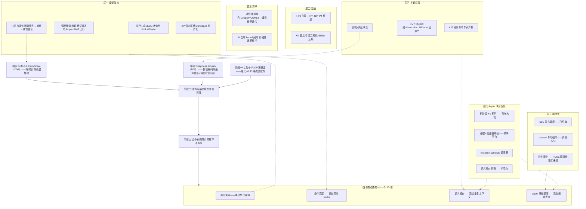
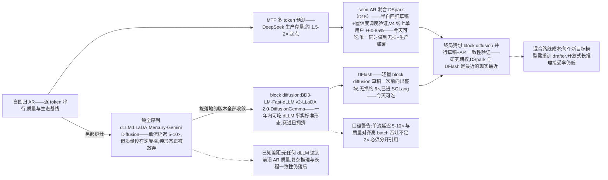
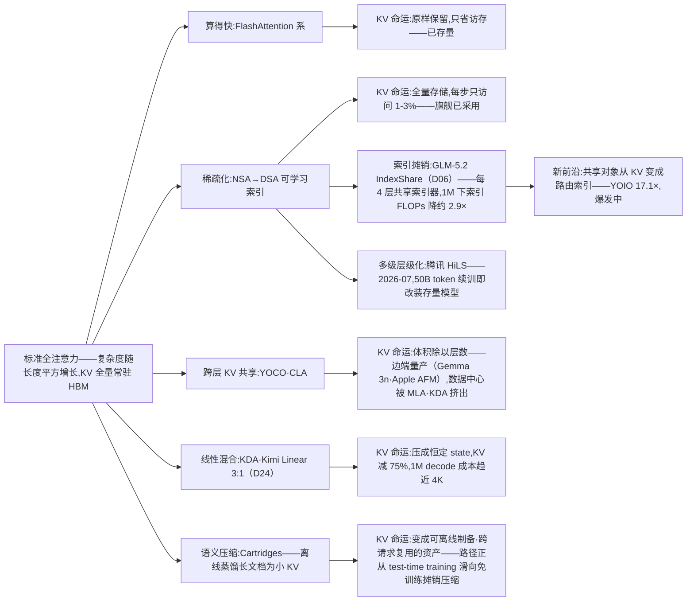
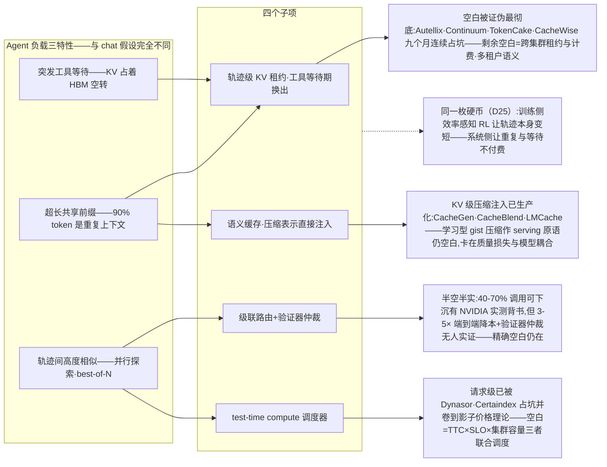
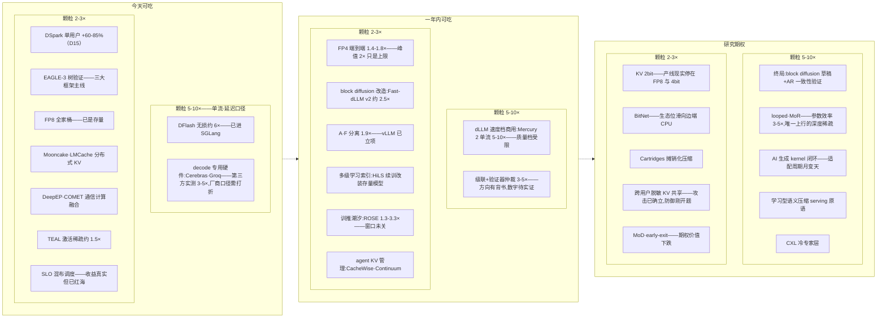

# Dispatch 26 · 推理效率的大颗粒地图:下一个 10 倍来自"让计算不发生"

*2026-07-17 · NPU Frontier Dispatch · inference-efficiency / systems-map / agent-serving / RL-on-NPU*

> TL;DR:推理效率三阶段:让 FLOP 更便宜(已存量)→计算×系统状态联合调度(IndexShare、DSpark,正在发生)→让不必要的计算根本不发生——并行生成、条件深度、语义缓存、agent 感知调度四个"跳过"。核实裁定:六层地图方向基本全对,但时间戳落后 6-12 个月,多数"空白"已被占坑;唯一干净的实证空白是级联+验证器仲裁。四个跳过叠加约 7.5×(推断),是 agent 负载专属而非普适 10×。NPU 落点:潮汐调度与 KV 分层存储可先行,AI 生成 kernel 是 CANN 杠杆,FP4 代差最不利。

本篇性质:探索/地图验证型——针对对话中给出的一份"推理效率六层大颗粒地图"逐格核实(检索时点 2026-07),承接 D06(GLM-5.2 IndexShare)、D15(DSpark)、D24(Kimi 线性混合注意力)、D25(效率感知 RL)。

---

## 1 · 引子对齐:两个锚点代表的升维

上一期我们把 GLM-5.2 的 IndexShare(D06)和 DeepSeek 的 DSpark(D15)各自拆开看过。这一期把它们并排放,会看出一个更大的东西:推理效率优化正在换阶段。

IndexShare 做的事,单看很朴素——DSA 的 lightning indexer 每 4 层复用一个,1M 上下文下索引器 FLOPs 降约 2.9×。但它的抽象意义在于:**辅助计算(为主计算服务的计算)可以跨层摊销**。索引器本来就是"为了少算注意力而额外付出的算力",IndexShare 把这笔税本身也砍了。这不是"把 GEMM 写得更快",而是"让一部分计算不必发生"。

DSpark 的意义类似但在另一个轴上。半自回归草稿 + 置信度调度验证,V4 线上对比生产基线 MTP-1 单用户提速 60-85%([arXiv:2607.05147](https://arxiv.org/abs/2607.05147))。关键词是"置信度调度":投机解码从"训一个更准的 drafter"的算法问题,升级为"draft 多长、何时验证、验证预算怎么分"的**算法×调度联合问题**。收益不再来自某个孤立组件更快,而来自算法决策与系统状态(负载、接受率历史、batch 构成)的耦合。

由此可以画一个三阶段框架,作为本篇的坐标系:

1. **阶段一(2023-2025):让每个 FLOP 更便宜。** 量化(FP16→FP8)、MoE 宽度稀疏、稀疏注意力、MLA 压 KV——单位算力成本下降,但"要算什么"没变。这一阶段的大颗粒红利已基本进入存量。
2. **阶段二(2025-2026,正在发生):让计算与系统状态联合调度。** IndexShare、DSpark、PD 分离、EPLB、SLO-aware 混布都属于这一类:同样的计算,在对的时间、对的位置、对的预算下发生。
3. **阶段三(下一个 10 倍的来源,本篇主题):让不必要的计算根本不发生。** 并行生成跳过串行等待、条件深度跳过简单 token 的满层计算、语义缓存跳过重复上下文的重 prefill、agent 感知调度跳过无效的资源占用。

对话用户给出的六层大颗粒地图,本质上是在给阶段三画疆域。本篇用四路文献扫描(检索时点 2026-07)逐层核实:哪些格子确实是空白,哪些已经被占坑,哪些倍数判断要打折。先说总裁定:**方向嗅觉基本全对,但时间戳普遍落后 6-12 个月**——多数被标为"空白"的格子,在 2025 下半年到 2026 上半年之间被密集填掉了。这本身是个有信息量的结论:它说明这张地图画的确实是主战场,只是竞争者比作者以为的多。

### 图 A · 六层大颗粒地图总览:从"FLOP 更便宜"到"计算不发生"

---

## 2 · 层一·架构:打破两个串行

### 2.1 打破自回归串行:dLLM 的现状与"终局猜想"的裁定

用户的判断链是:dLLM(LLaDA/Mercury/Gemini Diffusion)→ semi-AR 是过渡态 → 终局是 block diffusion + AR 验证的混合,若接受率解决 = 5-10× 解码。扫描结果对这条链的裁定是:**前提修正、中段反转、终局采纳且已提前兑现**。

前提修正:dLLM 已远不是实验室玩具。2025-12 到 2026-06 三件事落地——蚂蚁 LLaDA 2.0 开出首个 100B 级 dLLM 权重(flash 100B-A1.4B MoE,[arXiv:2512.15745](https://arxiv.org/abs/2512.15745) / [GitHub](https://github.com/inclusionAI/LLaDA2.X));Inception Labs 的 Mercury 2 成为首个推理型商用 dLLM(~1000 tok/s @ Blackwell,[官方博客](https://www.inceptionlabs.ai/blog/introducing-mercury-2),2025-11 获 $50M 种子轮);Google 放弃让 Gemini Diffusion GA(waitlist 挂了 14 个月,[产品页](https://deepmind.google/models/gemini-diffusion/)),改以开源形式放出 [DiffusionGemma](https://deepmind.google/models/gemma/diffusiongemma/)(26B-A4B,256-token 块并行,~4x 提速)。

中段反转:semi-AR 不是过渡态,而是**终点形态本身**。所有能落地的 dLLM——LLaDA 2.0、DiffusionGemma、Seed Diffusion([arXiv:2508.02193](https://arxiv.org/abs/2508.02193),2146 tok/s @ H20,比同规模 AR 快 5.4×)——内核全部收敛到 block diffusion(块间自回归、块内并行去噪),纯全序列掩码扩散事实上已被放弃。这条谱系从 BD3-LM([ICLR 2025 Oral](https://arxiv.org/abs/2503.09573))奠基,到 NVIDIA Fast-dLLM v2 证明只要 ~1B token 微调就能把现成 AR 模型改造成 block-dLLM([arXiv:2509.26328](https://arxiv.org/abs/2509.26328)),用户若以为这格"人少",需修正为"已拥挤":BD3-LM、Fast-dLLM v2、SDAR([arXiv:2510.06303](https://arxiv.org/abs/2510.06303))、Seed Diffusion、LLaDA 2.0、DiffusionGemma 至少六支。

终局采纳:"block diffusion 并行草稿 + AR 验证退化为一致性检查"——这个猜想不但成立,而且**已经是 2026 上半年该层的实际生产赢家**。DFlash(Z Lab)用轻量 block-diffusion drafter 一次前向出整块草稿,Qwen3-8B 上 >6× 无损加速、比 EAGLE-3 高至 2.5×,已进 SGLang 生态([arXiv:2602.06036](https://arxiv.org/abs/2602.06036) / [LMSYS 博客](https://www.lmsys.org/blog/2026-06-15-next-generation-speculative-decoding-dflash-v2/));DSpark 本身就是这个形态的生产化版本,同时踩在 semi-AR 与投机解码两个格子上——两条线合流的标志。这条混合路线的聪明之处在于:它把 dLLM 的并行草稿能力嫁接到 AR 的质量保证上,**绕开了 dLLM 的质量差距问题**(纯扩散在推理基准落后前沿 AR 约 10-20 分、混合路线缩到 5-7 分——此数来自二手汇总,仅供量级参考;硬数据是代码域 dLLM pass@1 已反超同档 AR,HumanEval 89.6 vs 84.8,[arXiv:2509.11252](https://arxiv.org/abs/2509.11252))。

**"5-10× 解码"裁定:部分采纳,必须拆成两个口径引用。** 单流延迟口径下真实存在:Mercury 宣称 5-10×、Seed Diffusion 实测 5.4×、DFlash 无损 6×。但质量对齐 + 高 batch 吞吐口径下收缩到 1.5-2.5×(Fast-dLLM v2 实测)——因为高 batch 下 GPU 本已算力饱和,并行去噪省的是串行轮次而不是总 FLOPs。写作和引用时严禁把"延迟 5-10×"说成"吞吐 5-10×"(provisional:两个数都会随 drafter 蒸馏工艺继续移动)。

### 图 B · 生成范式谱系:从自回归到"扩散想、AR 说"

### 2.2 打破逐层串行:深度稀疏的"诊断对、机制错"

用户判断:MoD/early exit/looped transformer 构成与 MoE 宽度稀疏正交的"深度稀疏",agent 轨迹大量格式化 token 不需要满深度,故尤其有价值。裁定:**诊断采纳,机制修正**。

"格式化/样板 token 便宜"这个前提有支撑——结构化输出因投机接受率高,投机解码提速常见 ~3× 量级(provisional,社区经验数字,无单一出处)。但这块红利正在被**投机解码和 semi-AR 以无损、免重训的方式吃掉**,而不是被 MoD/early-exit 吃掉。MoD([arXiv:2404.02258](https://arxiv.org/abs/2404.02258))提出两年、LayerSkip([arXiv:2404.16710](https://arxiv.org/abs/2404.16710))进了 HuggingFace trl,但没有任何公开证据表明进入生产旗舰;2026-03 还出现了方向性负面结果:新一代预训练配方降低了层冗余,MoE/SSM 架构的 early-exit 空间比 dense 更小,早退收益随模型代际递减([arXiv:2603.23701](https://arxiv.org/abs/2603.23701))。更工程化的解释是:MoD 路由后 batch 不齐,与 KV cache/批处理调度的冲突始终没有生产级解法——这可能才是它进不了旗舰的真原因。

深度稀疏思想的"正确寄生宿主"是 looped/recursive 路线:从预训练起内建循环深度,而非推理期补丁。字节 Ouro LoopLM 用 7.7T token 真金预训练,1.4B/2.6B 打平 4-12B SOTA([arXiv:2510.25741](https://arxiv.org/abs/2510.25741) / [权重](https://huggingface.co/ByteDance/Ouro-1.4B));Mixture-of-Recursions 把"深度稀疏 + 参数共享"合进一个框架([arXiv:2507.10524](https://arxiv.org/abs/2507.10524));加上 Huginn([arXiv:2502.05171](https://arxiv.org/abs/2502.05171))和 LoopFormer([arXiv:2602.11451](https://arxiv.org/abs/2602.11451)),这是该子层唯一上行的研究期权。但注意它的收益口径是**参数效率 3-5×,不是解码省算力**——循环 4 次 FLOPs 一点不省,对"让计算不发生"的叙事帮助有限。作为推理期加速手段,深度稀疏这格基本可以从大颗粒地图上降级。

---

## 3 · 层一续·注意力终局与 KV 语义压缩

这一节四条路,用一个统一视角串:**KV cache 的四种命运**——被检索(只访问一小撮)、被共享(跨层摊销)、被消灭(线性恒定 state)、被资产化(离线制备、跨请求复用)。

### 3.1 命运一:被检索——层级化检索式注意力

用户判断"HNSW 思想内化,O(L·k)→O(log L)"。裁定:**方向采纳,两处修正**。第一,量产旗舰吃的是**单级**可学习索引(DSA lightning indexer、GLM-5.2 IndexShare,D06),多级端到端学习式(DeepSeek NSA,[arXiv:2502.11089](https://arxiv.org/abs/2502.11089))刚在 2026-07 由腾讯混元 HiLS-Attention 推进到"50B token continued-training 即可改装存量模型"的阶段([arXiv:2607.02980](https://arxiv.org/abs/2607.02980),7B 权重开源)——这是本层最新鲜的高价值增量。第二,被"内化"的不是 HNSW 图结构本身,而是可学习的分层压缩键/地标;字面的 ANN 索引方案(RetrievalAttention [arXiv:2409.10516](https://arxiv.org/abs/2409.10516)、MagicPIG [arXiv:2410.16179](https://arxiv.org/abs/2410.16179))至今仍是推理期外挂,没有学习进权重。此格若原标"空白",应改标"爆发中"——HiLS、HGA([arXiv:2606.30709](https://arxiv.org/abs/2606.30709))全是 2026 新作。

### 3.2 命运二:被共享——从共享 KV 到共享索引

YOCO([arXiv:2405.05254](https://arxiv.org/abs/2405.05254))/CLA([arXiv:2405.12981](https://arxiv.org/abs/2405.12981))论文真实,而且已经量产——但在**边端**:Gemma 3n 和 Apple Foundation Model 都把跨层 KV 共享写进量产架构,128K 上下文 KV 从 37.58GB 压到 2.01GB([Raschka 架构梳理](https://sebastianraschka.com/llm-architecture-gallery/kv-sharing/))。数据中心旗舰上,同一笔 KV 预算被 MLA/滑窗/线性混合抢走(Kimi KDA 3:1 混合 KV -75%,D24),跨层共享作为独立技术暂时落败。但 2026 年它以另一个形态复活:**共享的不再是 KV,而是稀疏路由的索引**——YOIO/CLSA 跨层共享稀疏路由索引,128K 解码吞吐最高 17.1×([arXiv:2606.06467](https://arxiv.org/abs/2606.06467)),与 GLM-5.2 IndexShare 每 4 层复用索引器是同一思想的学术版。用户说跨层 KV 共享"比共享 indexer 更激进"——方向要拧一下:2026 年的增量前沿恰恰是从共享 KV 退回到共享索引,因为索引是辅助计算、共享它无损,KV 是主状态、共享它掉点。

### 3.3 命运三:被消灭——线性/混合架构

接 D24:四条注意力路线分岔(MSA/DSA+IndexShare/LSA/KDA)已详述,此处只做地图裁定:**采纳**。Kimi K3 把线性注意力扶正旗舰、3:1 混合比例、恒定 state 使 1M decode 成本与 4K 同——"混合比例是主战场"的判断与 D24 结论一致,且与命运一、二不互斥:混合架构里保留的那 1/4 全注意力层,正是检索式稀疏和索引共享的用武之地。三条路线正在合流成"少数全注意力层 + 可学习索引 + 多数线性层"的配方。

### 3.4 命运四:被资产化——Cartridges 与 KV 语义压缩

出处判断准确:Stanford Hazy Research,2025-06([arXiv:2506.06266](https://arxiv.org/abs/2506.06266) / [代码](https://github.com/HazyResearch/cartridges)),self-study 合成对话 + 上下文蒸馏把长文档离线训成小 KV,峰值吞吐 26.4×、等效上下文 4×。一处修正:最活跃的后续不是把 test-time training 做大,而是**把训练环节摊销掉**——Attention Matching 解析式求解压缩 KV([arXiv:2602.16284](https://arxiv.org/pdf/2602.16284))、Still 的单次前向摊销压缩([arXiv:2606.07878](https://arxiv.org/pdf/2606.07878)),外加推理公司的产业兴趣信号([Baseten 研究博客](https://www.baseten.co/research/towards-infinite-context-windows-neural-kv-cache-compaction/))。"KV 成为可离线制备资产"的方向成立,实现路径正从 TTT 滑向免训练压缩——因为每语料一次 GPU 训练,对上 RadixAttention 式免费前缀复用(D10),经济账难跑通。一个无人做的组合值得标记:把 RL 环境文档/代码库预制成 cartridge 降低 rollout prefill,与 D02 的 rollout 瓶颈、D13 的沙箱成本主导判断天然互补。

### 图 C · 注意力与 KV 演化树:每条支线的"KV cache 命运"

---

## 4 · 层二三·数值与算子

### 4.1 数值层四项逐个评级

**FP8 已存量:采纳。** DeepSeek-V3 FP8 预训练([arXiv:2412.19437](https://arxiv.org/abs/2412.19437))、vLLM/SGLang FP8 权重 + FP8 KV 已是生产默认([vLLM 官方博客 2026-04](https://vllm-project.github.io/2026/04/22/fp8-kvcache.html))、FP8 rollout +20-80%(D02)。

**FP4 等效算力翻倍:修正为"峰值 2×、端到端 1.4-1.8×"。** 2× 只是 Blackwell 峰值 GEMM 相对 FP8;端到端训练实测 1.48-1.85× vs BF16、vs FP8 约 1.2-1.5×(Quartet II [arXiv:2601.22813](https://arxiv.org/pdf/2601.22813) / [TransformerEngine](https://github.com/NVIDIA/TransformerEngine) 社区数据)。里程碑真实:NVIDIA 完成 12B 模型 10T token 全程 NVFP4 预训练,MMLU-pro 与 FP8 打平([arXiv:2509.25149](https://arxiv.org/abs/2509.25149));推理侧 DeepSeek-R1 FP8→NVFP4 MMLU 仅 -0.1pp([Azure/NVIDIA](https://techcommunity.microsoft.com/blog/azure-ai-foundry-blog/unlocking-high-performance-inference-for-deepseek-with-nvfp4-on-nvidia-blackwell/4497936))。但 mid-2026 生产默认仍是 FP8,且要注意:decode-bound 场景(正是 RL rollout,D02)的 FP4 收益主要来自权重/KV 减半的**访存**而非算力——"翻倍"当上限成立,当预期高估约 30-50%(provisional)。

**KV 2bit:修正为"论文成熟、产线未采"。** KIVI([GitHub](https://github.com/jy-yuan/KIVI))/RotateKV([arXiv:2501.16383](https://arxiv.org/pdf/2501.16383))系真实且被广泛复现,但产线现实是 FP8 KV 标准化、INT4 在推进(SAW-INT4,[arXiv:2604.19157](https://arxiv.org/pdf/2604.19157))、2bit 停在研究复现层;近无损甜点实际在 3-4bit 混精。且与 MLA/KDA 已压过的 KV(-75%,D24)叠加时,2bit 的边际收益递减。

**BitNet 1.58:采纳(定位为远期期权)。** 原生三值 2B/4T 模型开源([arXiv:2504.12285](https://arxiv.org/abs/2504.12285))、bitnet.cpp CPU 提速 1.37-6.17×、能耗 -82%([GitHub](https://github.com/microsoft/BitNet)),并有厂商跟进迹象显示生态在向边端扩散。但关键判断:BitNet 与 FP4 是**替代关系而非叠加关系**,FP4 有 Blackwell 硬件东风、BitNet 没有原生硬件,这一轮资本开支已把胜负判给 FP4;BitNet 真实生态位滑向边端/CPU。三值模型的 RL 后训练完全空白。

**激活稀疏 50-70% 近无损:修正为"免训练 40-50%、训练式 60% 且仅部分张量,70% 无支撑"。** TEAL 免训练近无损区间是 40-50%([arXiv:2408.14690](https://arxiv.org/abs/2408.14690),已被 [Together AI 实装](https://www.together.ai/blog/teal-training-free-activation-sparsity-in-large-language-models));Q-Sparse 的 >60% 只在训练式且仅 gate 张量达成([arXiv:2407.10969](https://arxiv.org/abs/2407.10969))。更重要的折扣:wall-clock 增益远小于稀疏率——50% 稀疏 ≈ 1.5-1.8× decode(访存节省),不是算力减半。且"激活稀疏"的大头其实早被 MoE 吃掉了,dense 层内稀疏是二阶收益。2026 年的合流信号是 SharQ 打通激活稀疏 × FP4([arXiv:2606.26587](https://arxiv.org/pdf/2606.26587))。

### 4.2 算子层:两个判断,一个窗口收窄、一个正中靶心

**通信-计算融合:修正——"通信原语进 kernel"不是终局猜想,是正在标准化的赛道。** 演进链完整:手写库(FLUX [arXiv:2406.06858](https://arxiv.org/abs/2406.06858)、DeepEP [GitHub](https://github.com/deepseek-ai/DeepEP),后者已被 SGLang/vLLM 大规模 EP 部署采用)→ 生产化(字节 COMET 万卡集群部署、MLSys 2025 杰出论文 HM,[arXiv:2502.19811](https://arxiv.org/abs/2502.19811))→ 编译器原语化(TileLink [arXiv:2503.20313](https://arxiv.org/abs/2503.20313)、Triton-distributed 把 NVSHMEM 式设备侧通信直接暴露进 Triton DSL,[arXiv:2504.19442](https://arxiv.org/abs/2504.19442))→ 多 GPU 单 kernel 编程模型(ParallelKittens,[Hazy Research](https://hazyresearch.stanford.edu/static/posts/2025-11-17-pk/ParallelKittens.pdf))。增量机会已移到编译器自动生成与非 NVIDIA 移植(DeepEP 的 ROCm 移植刚起步);跨厂商设备侧通信原语标准仍缺——NVSHMEM 绑定 NVIDIA,这一点下文昇腾语境还会回来。

**AI 生成 kernel 闭环:采纳,且比预期更快,重心正中"国产芯片适配"。** CUDA 简单/中等算子上闭环已近饱和:NVIDIA 用 R1 + 验证器做到 KernelBench Level-1 100%/Level-2 96%([NVIDIA 博客](https://developer.nvidia.com/blog/automating-gpu-kernel-generation-with-deepseek-r1-and-inference-time-scaling/)),CUDA-L2 用 RL 在 matmul 上超 cuBLAS([arXiv:2512.02551](https://arxiv.org/abs/2512.02551))。但真瓶颈已转移到**验证鲁棒性**:Sakana 的 robust-kbench 揭示 lazy kernel 式 reward hacking([arXiv:2509.14279](https://arxiv.org/abs/2509.14279)),后续基准也显示前沿模型在真实负载与量化算子上仍大面积不敌 PyTorch 手写基线(具体比例随基准版本波动,此处不引具体数)。最有信息量的动向是**新硬件适配在 2025Q4-2026 密集爆发,且厂商亲自下场**:AWS 的 NKI-Agent 面向 Trainium([arXiv:2607.04395](https://arxiv.org/abs/2607.04395))、MultiKernelBench 覆盖含昇腾在内的多平台([arXiv:2507.17773](https://arxiv.org/abs/2507.17773))、AMD 官方开 [AgentKernelArena](https://rocm.blogs.amd.com/software-tools-optimization/agent-kernel-arena/README.html)。接看板语境:GLM-5 适配昇腾是出了名的工程苦力活(综述篇),而"硬件适配周期月→天"的判断如果兑现,受益最大的正是 CANN 这类算子生态薄、人力适配成本高的栈——用户此格判断无需修正,只需加一条:冷启动语料稀缺(新硬件没有存量 kernel 语料可学)是该路线在昇腾上的第一瓶颈。

---

## 5 · 层四五·框架与服务化

### 5.1 A/F 分离与 E/D 异构:链条完整,空白在 CXL

A/F 分离的采用链条比用户预期走得更远:MegaScale-Infer(层内 attention/FFN 拆池 + ping-pong 流水,每 GPU 吞吐最高 1.9×)从 arXiv 走到 SIGCOMM 2025 正会([arXiv:2504.02263](https://arxiv.org/abs/2504.02263))→ StepFun Step-3 **反向为 AFD 设计模型结构**(321B MoE 做到 4039 tok/s/GPU vs DeepSeek-V3 的 2324,[arXiv:2507.19427](https://arxiv.org/abs/2507.19427))→ vLLM 正式立项 [RFC #22799](https://github.com/vllm-project/vllm/issues/22799) → 设计空间综述出现([arXiv:2605.28302](https://arxiv.org/abs/2605.28302)),华为 CloudMatrix384 在国产硬件上做了 P/D/E 分离的工业实现([arXiv:2506.12708](https://arxiv.org/abs/2506.12708))。E/D 异构要分层裁定:"冷专家 offload CPU"不是空白而是拥挤赛道(Fiddler [arXiv:2402.07033](https://arxiv.org/abs/2402.07033)、MoE-Infinity [arXiv:2401.14361](https://arxiv.org/abs/2401.14361) 等至少六支);真正偏空白的是数据中心级 **CXL/NDP 冷专家层**——2025-12 才有第一篇系统论文([arXiv:2512.04476](https://www.arxiv.org/pdf/2512.04476)),且多为模拟器数据,离部署一年以上。

### 5.2 KV cache 成为分布式存储系统:双雄已 GA,真空白在脱敏共享

采纳,且证据超充分:Mooncake(FAST 2025 最佳论文系,数千节点、日均千亿 token,[arXiv:2407.00079](https://arxiv.org/abs/2407.00079))2026-05 被 [vLLM 官方深度集成](https://vllm.ai/blog/2026-05-06-mooncake-store)服务 agentic 负载;[LMCache](https://github.com/LMCache/LMCache) 生产级 GA,GKE/CoreWeave/Cohere 采用,是 Red Hat llm-d 核心组件。用户"agent 时代 90% token 是重复上下文、命中率比 kernel 快 10% 更重要"的判断,方向与这波生产化完全一致(90% 这个数本身是推断量级,但 vLLM 官方以 agentic workload 为集成动机是佐证)。**本层最接近真空白的点是"跨用户脱敏共享"**:攻击面已被 NDSS 2025 正式确立(PromptPeek 时序侧信道可重构他人 prompt,[NDSS](https://www.ndss-symposium.org/ndss-paper/i-know-what-you-asked-prompt-leakage-via-kv-cache-sharing-in-multi-tenant-llm-serving/)),防御侧 CachePrune 2026 年刚开题([arXiv:2605.23640](https://arxiv.org/abs/2605.23640)),生产系统为零——基础设施就绪 + 风险已被论证 = 需求刚被创造出来,这是少数"时机恰好"的格子。

### 5.3 投机×调度深化:子件齐全,缺的是"默认开启"

修正"空白"判断:goodput 联合调度 2024 年中即有(SmartSpec,[arXiv:2406.14066](https://www.emergentmind.com/papers/2406.14066),思想已进 vLLM),batch 装箱有 TETRIS([arXiv:2502.15197](https://arxiv.org/abs/2502.15197)),自适应长度有 SpecDec++([arXiv:2405.19715](https://arxiv.org/abs/2405.19715))/BanditSpec([arXiv:2505.15141](https://arxiv.org/abs/2505.15141)),树验证的生产化终点是 EAGLE-3 并入 vLLM/SGLang/TRT-LLM 三大框架主线([arXiv:2503.01840](https://arxiv.org/abs/2503.01840)),2026 年已推进到投机×PD 分离联合(StreamServe,[arXiv:2604.09562](https://arxiv.org/abs/2604.09562))。但采纳其"未收敛"直觉:除树验证外,长度自适应与跨请求装箱在生产框架里仍是半手动旋钮,还有论文在质疑真实服务收益([arXiv:2601.11580](https://arxiv.org/abs/2601.11580))。可吃缝隙是把这些做成默认开启的联合调度器——DSpark 的置信度调度验证正是这个方向的第一个大规模生产样本(D15),它证明了这层收益要在"drafter 架构 × 验证调度"一起设计时才兑现。

### 5.4 SLO 混布与潮汐调度:一红海,一窗口

SLO 分级/交互流+批处理流混布/抢占迁移:**修正为红海**。Llumnix 已生产化开源(P99 TTFT 最高降 12.1×,[arXiv:2406.03243](https://arxiv.org/abs/2406.03243)),HyGen([arXiv:2501.14808](https://arxiv.org/abs/2501.14808))等同类工作 2025-2026 密集出现。2× 级收益真实,但坑位密集,不构成洼地。

训推一体潮汐调度(推理低谷跑 RL rollout):**修正但窗口未关**。"无公开实践"在 2026-05 前基本成立,现在被 HKUST+阿里的 ROSE 正面占坑(SLO-safe 地把 rollout 混布到 serving GPU,端到端吞吐 1.3-3.3×,[arXiv:2605.06534](https://arxiv.org/abs/2605.06534)),verl/HybridFlow 的 HybridEngine 是训推同卡的事实标准开源件([GitHub](https://github.com/verl-project/verl)),国内厂商在公开场合讨论"白天推理、夜间 rollout"([实录](https://qingkeai.online/archives/2025infra))。但公开占坑者仅 1-2 家,fast-follow 有位置。接 D02:rollout 占 RL 单步 70%+ wall-clock 且 decode-bound——**推理集群的夜间低谷,正是 RL 系统最缺的那种算力**(大量、可抢占、decode 友好),潮汐调度是把 serving 世界与 RL 世界焊起来的那条缝。权重同步成本、SLO 与 on-policy 新鲜度的联合优化、多区域全球潮汐编排,均无公开工作。

### 5.5 Decode 专用硬件:3-5× 是实数,5-10× 是厂商口径

采纳带修正系数。第三方实测(Artificial Analysis):Cerebras gpt-oss-120b 约 1,677 tok/s(厂商自称 3,000,[官方博客](https://www.cerebras.ai/blog/openai-gpt-oss-120b-runs-fastest-on-cerebras)),对比最快 GPU 云(Fireworks ~618)约 2.7×,配投机解码可到 ~4,000([评测页](https://artificialanalysis.ai/models/gpt-oss-120b/providers));Groq Llama-3.3-70B 约 750 tok/s([评测页](https://artificialanalysis.ai/providers/groq))。**真实优势 3-5×,厂商宣传的 19×/百倍对比的是保守 GPU 基线。** Etched Sohu 的 8 卡 500K tok/s 仍是零独立基准的厂商声明(累计融资 ~$800M、$1B 远期合同,首批机架 2026 夏出货,[报道](https://cryptobriefing.com/etched-raises-800m-secures-1b-sales-contracts/)),引用时只能当声明。用户"真大颗粒 = 架构-硬件协同设计"的判断有一个未被验证的软肋:长上下文 + agent 负载(高频 prefill、工具调用中断)在 SRAM 架构上的表现无公开数据——大 KV 场景是否守得住优势,是这条路线的悬置问题。

---

## 6 · 层六·Agent 联合优化:最大洼地的核实

用户判断层六是最大洼地,理由是 agent 负载统计特性(超长共享前缀/突发工具等待/轨迹间高度相似)与 chat 完全不同而 serving 仍按 chat 假设设计。**理由采纳,结论重大修正:四个子项里三个的"空白"已在 2025 下半年至 2026 上半年被填掉。**逐项裁定:

**(1) 轨迹级 KV 生命周期管理 / 工具等待期换出——被证伪最彻底的一格。** 九个月内连续占坑:Autellix 把 agent 程序当一等公民做程序级抢占调度,同延迟吞吐 4-15×([arXiv:2502.13965](https://arxiv.org/abs/2502.13965));TokenCake 在函数调用期间事件驱动地 offload 空闲 KV、预测式回传——就是"工具等待期换出"本身([arXiv:2510.18586](https://arxiv.org/html/2510.18586));Continuum 按预测工具时长给 KV 设 TTL([arXiv:2511.02230](https://arxiv.org/abs/2511.02230));CacheWise 面向 coding agent 用工具调用元数据做 reuse-aware 驱逐,会话完成时间提升 ~3.5×([arXiv:2606.16824](https://arxiv.org/pdf/2606.16824))。剩余的真空白收窄为:**跨实例/跨集群的租约语义(带计费与多租户隔离)+ 与主流引擎的 API 标准化**——占坑者全停在单集群研究原型,"agent 框架向 serving 声明我还会回来"的协议层仍然没人定义。

**(2) 级联 + 验证器仲裁——唯一空白内核仍然成立的子项。** 80/20 方向被 NVIDIA 实测背书:MetaGPT/Open Operator/Cradle 三框架里 40-70% 的大模型调用可由调优小模型承接,SLM 每 token 成本低 10-30×([arXiv:2506.02153](https://arxiv.org/abs/2506.02153))。但"端到端 3-5× 近无损降本"**无人实证**:公开数字要么是每 token 成本 10-30×(不含质量损失与重试),要么是单查询路由的 31%(UCCI,[arXiv:2605.18796](https://arxiv.org/html/2605.18796))——远低于 3-5×。"带验证器仲裁的 agent 轨迹级端到端成本-质量曲线"这个精确的坑还空着,失败重试会吃掉多少级联收益也无人量化。

**(3) Test-time compute 调度器——请求级已被占坑,集群级空着。** Dynasor/Certaindex 2024 年底就做了 serving 系统级 TTC 调度(实时估计推理进度、答案趋稳即回收 token 预算跨请求重分配,[arXiv:2412.20993](https://arxiv.org/abs/2412.20993)),2026 年已卷到影子价格理论([arXiv:2606.03092](https://arxiv.org/pdf/2606.03092))。真正空的是 **TTC 预算 × SLO × 集群容量三者联合**,以及 TTC 与 agent 轨迹价值估计的耦合(哪个子任务值得烧算力)。

**(4) 语义缓存/压缩表示作为 serving 原语——半成立半修正,取决于指哪一半。** 如果指"压缩 KV 直接注入代替重 prefill":不空白,UChicago 系已占坑并生产化——CacheGen 把 KV 编码成比特流跨网络传输注入(SIGCOMM'24,[arXiv:2310.07240](https://arxiv.org/abs/2310.07240))、CacheBlend 多段 KV 拼接 + 选择性重算恢复交叉注意力(EuroSys'25,TTFT 降 2.2-3.3×,[arXiv:2405.16444](https://arxiv.org/abs/2405.16444))、LMCache 是它们的产品化层。如果指"学习型语义压缩表示(gist/soft token)作为一等 serving 原语":**空白成立**——gist 压缩有系统性质量损失([arXiv:2412.17483](https://arxiv.org/abs/2412.17483)),且换模型缓存作废,模型侧研究与 serving 侧之间的桥没人搭。

**与 D25 的同一硬币论,现在可以说得更完整。** D25 的结论是训练侧压轨迹长度(效率感知 RL),本篇层六是系统侧让重复与等待不付费。两面的分工在核实后更清晰了:训练侧管"生成的 token 本身要不要存在",系统侧管"存在的 token 要不要重复付费"——前者是效率奖励×staleness 的动力学问题(D25 标记为零命中交叉点),后者的基础件(KV 分层存储、租约、换出)已经有人造好,缺的是协议和经济学层。

**最适合作为研究切入的子项裁定:(2)。** 理由:(1)(3)(4) 的剩余空白都是"标准化/协议/理论精细化"性质,适合框架维护者和大厂;(2) 是一个干净的实证空白——不需要改任何框架主线,只需要一套 agent 基准 + 验证器仲裁策略 + 诚实核算重试成本的端到端账本,而且它的结论直接裁定"3-5×"这个被广泛引用却无人验证的数字。次选是 (1) 的协议层:谁先把"KV 租约"写成 agent 协议(MCP 一类)与推理引擎之间的标准握手,谁就占住了 agent-serving 接口的定义权。

### 图 D · Agent-aware serving:洼地还剩多少是真空白

---

## 7 · 收束检验与 RL-on-NPU 落点

### 7.1 "四个跳过"= 10× 的算术检验(推断)

用户的收束是:并行生成、条件深度、语义缓存、agent 感知调度四个"跳过"叠加 = 下一个 10 倍。逐项代入核实后的数字,再检验可乘性:

- **跳过一(并行生成)**:无损口径 2-6×(DFlash/DSpark 实测),但这是单流延迟;吞吐口径 1.4-2.5×。
- **跳过二(条件深度)**:被本次扫描降级——early-exit 有代际递减的负面证据,且它与跳过一**收割的是同一块红利**(简单/格式化 token 便宜)。投机解码的高接受率区间正是浅层就能预测对的 token 区间,两者不可乘,只能取其大。有效增量 ≈ 1×-1.2×。
- **跳过三(语义缓存)**:作用在 prefill 侧,与作用在 decode 侧的跳过一近似正交,可乘。agent 负载下前缀命中带来的 TTFT/成本收益 2-3× 量级(CacheBlend/LMCache 实测区间);但对 decode-bound 的 RL rollout(D02)贡献有限。
- **跳过四(agent 感知调度)**:作用在利用率/等待,与前三者(作用在单请求计算量)正交,可乘。Autellix 的 4-15× 是研究原型上限,保守取生产可兑现 1.5-2×。

诚实的乘法(推断,标 provisional):吞吐口径 2×(并行)× 1.1×(深度)× 2×(缓存,agent 负载)× 1.7×(调度)≈ **7.5×,四舍五入到"接近 10×"要靠负载配比帮忙**——在长前缀、高工具占比、结构化输出多的 agent 负载上四项同时处于甜区,10× 可及;在短 chat、高熵创作负载上收缩到 3-4×。所以修正后的收束是:**"四个跳过"叠加不是普适 10×,而是"agent 负载专属的 10×"**——这反而强化了用户的层六直觉:下一个 10 倍不是模型的,是负载形状的。

### 7.2 昇腾语境下的优先级排序

接 D13(单节点 SWE-RL、沙箱成本主导)与 D23(训推一致、根治层缺位),按"是否依赖 CUDA 生态"给四个跳过排先后:

1. **可先行(硬件无关)**:跳过三、四几乎全是系统层软件——Mooncake/LMCache 式 KV 分层存储、租约式缓存、潮汐调度都不碰 kernel。潮汐调度 × D13 单节点方案是现成组合:昇腾推理集群的低谷时段跑 rollout,正好绕开其高峰 serving 生态短板,ROSE 只开了第一枪且是 NVIDIA 语境,NPU 版无人做。
2. **可移植但要 kernel 功夫**:跳过一(投机/semi-AR)的算法与调度层可移植,drafter 验证 kernel 需 CANN 实现——这正是 AI 生成 kernel 对 CANN 的意义所在:MultiKernelBench 已把昇腾列为正式目标平台,若"适配周期月→天"兑现,GLM-5 适配昇腾那种苦力活(综述篇)是第一批被替代的工作;冷启动语料稀缺是第一瓶颈,但昇腾恰好有存量人工 kernel 可做种子语料。
3. **结构性受限**:数值层的 FP4 红利昇腾无对应硬件,D23 的"根治层缺位"在 FP4 时代**加重**——当对手的 rollout 用 NVFP4 而你停在 FP8/FP16,训推一致问题之外又多了代际算力差。这是本篇所有裁定里对国产栈最不利的一条。

### 7.3 颗粒度 × 成熟度总表

倍数列除注明实测外均为 provisional;"裁定"针对用户地图原判。

| 路线 | 核实后倍数(口径) | 成熟度 | 对用户地图的裁定 |
|---|---|---|---|
| block diffusion + AR 验证(DFlash/DSpark) | 2-6× 延迟(实测)/ 1.4-2.5× 吞吐 | 今天可吃(已生产) | 终局猜想采纳,已提前兑现 |
| 纯 dLLM | 5-10× 延迟(厂商)/ 质量停速度档 | 一年内(限场景) | 修正:非空白,纯扩散已被 block 形态取代 |
| MoD/early exit | ~1×(负面证据) | 下行期权 | 修正:红利被投机解码平替 |
| looped/MoR(Ouro) | 参数效率 3-5×,不省推理 FLOPs | 研究期权(上行) | 采纳,唯一活口 |
| 层级化检索注意力(NSA→HiLS) | 索引侧 ~3×(IndexShare 实测 2.9×) | 单级今天/多级一年内 | 修正:非空白,爆发中 |
| 跨层共享(KV→索引) | 17.1×(YOIO 128K 学术) | 边端已量产/共享索引一年内 | 修正:前沿已从共享 KV 移到共享索引 |
| 线性混合(KDA,D24) | KV -75%(实测) | 今天可吃(旗舰) | 采纳,混合比例主战场 |
| Cartridges/KV 资产化 | 吞吐 26.4× 峰值(限重复语料) | 一年内(企业场景) | 采纳,路径 TTT→免训练摊销 |
| FP4 端到端 | 峰值 2×/端到端 1.4-1.8× | 推理今天/训练一年内 | 修正:翻倍是上限 |
| KV 2bit | 甜点在 3-4bit | 一年内(限场景) | 修正:产线现实是 FP8 KV |
| BitNet | 边端 CPU 1.4-6×(实测) | 远期期权 | 采纳,与 FP4 是替代关系 |
| 激活稀疏 | 40-50% 近无损→~1.5× decode | 今天可吃(打折) | 修正:70% 无支撑 |
| 通算融合进 kernel | 单层 ~2×(COMET 实测 1.96×) | 今天可吃,编译器化一年内 | 修正:非空白,窗口在收窄 |
| AI 生成 kernel(新硬件) | 适配周期月→天(若兑现) | 一年内 | 采纳,瓶颈=验证鲁棒性+冷启动语料 |
| A/F 分离 | 每 GPU ~1.7-1.9×(实测) | 一年内(vLLM RFC 中) | 采纳,CXL 冷专家层才是剩余空白 |
| 分布式 KV 存储 | 命中率主导(agent 负载) | 今天可吃(双雄 GA) | 采纳;真空白=脱敏跨用户共享 |
| 投机×调度联合 | +60-85%(DSpark 生产实测) | 树验证今天/联合调度一年内 | 修正:非空白,缝隙在"默认开启" |
| SLO 混布 | ~2×(利用率) | 今天可吃 | 修正:红海 |
| 潮汐调度 | 1.3-3.3×(ROSE) | 一年内,窗口未关 | 修正:刚被占第一坑 |
| decode 专用硬件 | 3-5×(第三方实测) | 今天可吃(Groq/Cerebras) | 采纳带折扣;Etched 未验证 |
| 轨迹级 KV 租约 | 会话完成 ~3.5×(CacheWise) | 一年内 | 修正:被密集占坑;空白收窄至协议层 |
| 级联+验证器仲裁 | 40-70% 调用可下沉(实测);3-5× 未证 | 研究期权(最佳切入) | 部分采纳:精确空白仍在 |
| TTC 调度器 | 请求级已占坑 | 一年内 | 修正:空白上移至集群级 |
| 语义压缩为 serving 原语 | KV 级 2-3×(实测) | KV 级今天/学习型期权 | 半成立:学习型空白真 |

一句话版本:这张六层地图画对了战场,画错了敌情——它以为自己在标注无人区,实际标注的是 2026 年上半年火力最密集的前线。而"让计算不发生"的下一个 10 倍,大概率不会以通用倍数的形式到来,它会以 agent 负载专属红利的形式,先落在那些同时握有 serving 流量和 RL 训练需求的玩家手里。

### 图 E · 颗粒度×成熟度矩阵:每条路线放进象限

---

## 下一步看什么

1. **级联 + 验证器仲裁的端到端账本**:谁第一个在公开 agent 基准上,把"验证器仲裁 + 失败重试成本"诚实核算进级联降本曲线,直接裁定"3-5× 近无损"这个被广泛引用却无人验证的数字——这是本篇裁定的最佳研究切入点,值得盯每一篇新占坑。
2. **KV 租约协议层**:MCP 一类 agent 协议与 vLLM/SGLang 之间会不会出现"我还会回来"的标准握手(带计费与多租户语义)?Autellix/Continuum/CacheWise 的原型谁先推标准,谁就占住 agent-serving 接口定义权。
3. **潮汐调度的第二枪与 NPU 版**:ROSE 之后是否有第二家公开占坑(尤其权重同步 × on-policy 新鲜度联合优化);昇腾语境的"低谷跑 rollout"是现成组合,无人做,窗口未关。
4. **DFlash 型混合路线的接受率演进**:开放式长推理上的接受率是这条"扩散想、AR 说"路线兑现 5-10× 的最后闸门;同时盯 Fast-dLLM v2 式"AR 改造 block-dLLM"是否被某家旗舰吸收进主线。

---

**来源与 provisional 声明**:本篇为对话中一份六层推理效率地图的逐格核实,基于四路文献扫描,检索时点 2026-07;所有点名工作均附原始链接(arXiv/官方博客/GitHub/第三方评测)。倍数判断除明确标注"实测"外均为 provisional——包括"四个跳过"的乘法估算(7.5×)、FP4 端到端折扣(30-50%)、dLLM 质量差距分数(二手汇总)等推断性数字,会随 drafter 蒸馏工艺、硬件代际与生产采用情况持续移动;厂商口径数字(Mercury 5-10×、Cerebras 3,000 tok/s、Etched 500K tok/s)引用时均已标注第三方实测差异或"零独立基准"状态。承接:D02(rollout 瓶颈)、D06(IndexShare)、D10(RadixAttention)、D13(SWE-RL on Ascend)、D15(DSpark)、D23(训推一致)、D24(Kimi 线性混合)、D25(效率感知 RL)。
