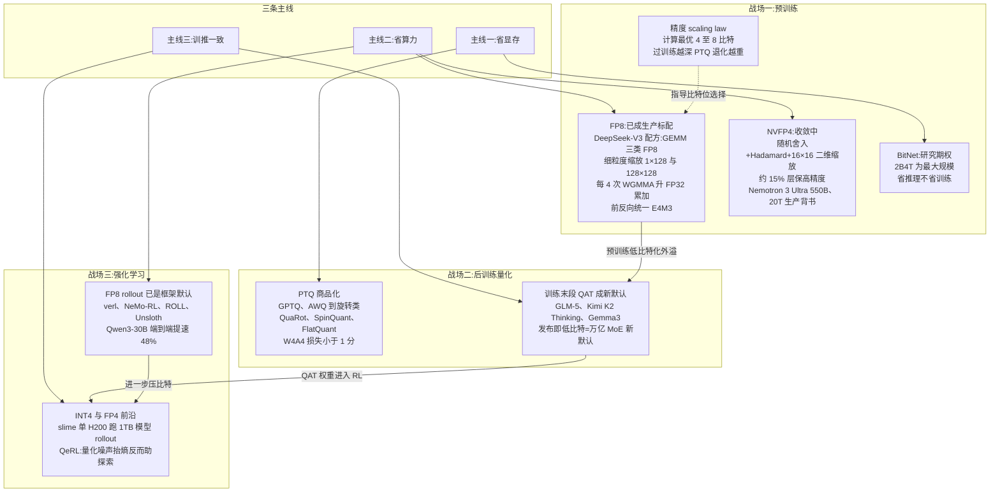
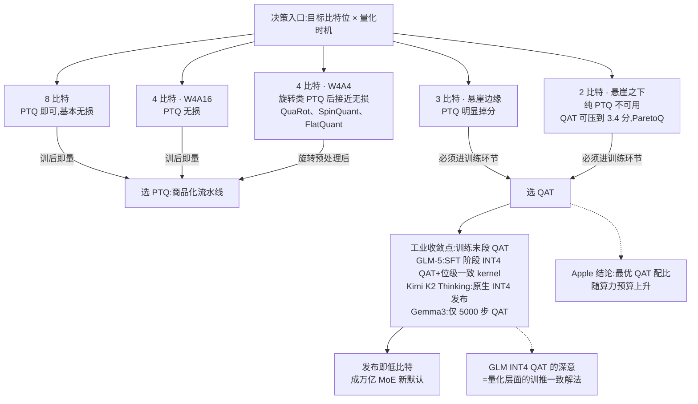
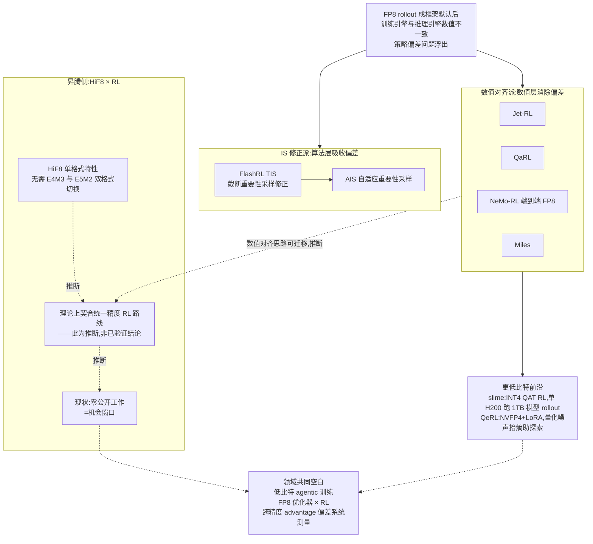
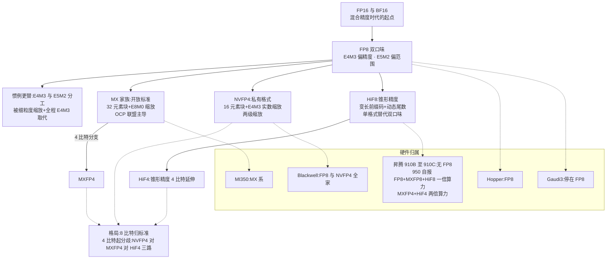
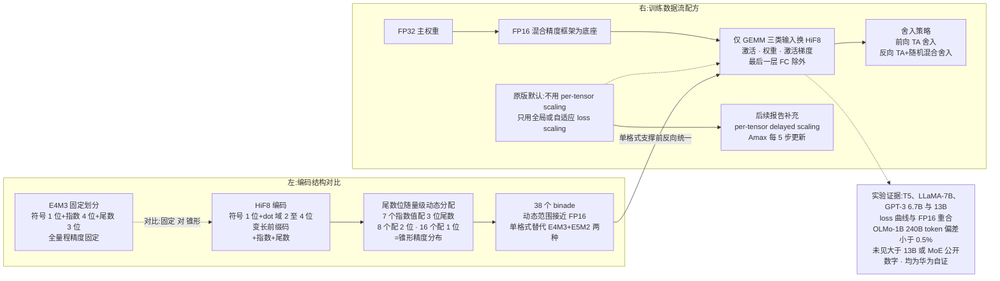

# Dispatch 27 · 低比特训练全景:从 FP8 预训练到 HiF8,昇腾的数值层答案

*2026-07-17 · NPU Frontier Dispatch · low-bit-training / FP8 / HiF8 / quantization / RL-on-NPU*

> **TL;DR** — 低比特训练三大战场现状:预训练 FP8 已生产标配(DeepSeek-V3 配方成骨架)、NVFP4 收敛中(550B/20T 生产背书);后训练"训练末段 QAT"成万亿 MoE 新默认("发布即低比特");RL 侧 FP8 rollout 已是框架默认,训推一致裂成 IS 修正与数值对齐两派。datatype 格局:**8-bit 归标准、4-bit 起分歧**(NVFP4/MXFP4/HiF4 三路)。核心问题 HiF8:锥形精度 + 38 binade 换"单格式 + 极简缩放"的训练配方,证据链止于 13B 且全为华为自证,DeepSeek V4 在 950 上弃 HiF8 选 MX 是刺眼信号;但 HiF8×RL 零先例恰是机会窗口。另含一条看板自我修正:D13 的 0.05 nats 阈值无文献依据。

本篇性质:深度调研篇(五路并行扫描,全部来源带 URL/arXiv 号),承接 D02(FP8 rollout)、D09(Miles 统一 FP8)、D23(训推一致三层)、D26(数值层与 FP4 代差)的数值层线索,并回答一个悬置已久的问题:昇腾自己的数值格式 HiF8 到底怎么训练。

---

## 1 · 为什么现在盘点低比特训练

Dispatch 26 给出过一个不太舒服的裁定:在训练侧的精度代差里,**FP4 一代对国产算力栈最不利**——NVIDIA 已经把 NVFP4 做进 Blackwell 的 tensor core 并拿出旗舰级预训练背书,而国产芯片连 FP8 这一代都尚未普遍补齐。但 D26 当时是从硬件矩阵往下看的粗粒度判断,没有回答一个更根本的问题:**昇腾在数值层自己的答案是什么?** 答案其实存在,就是 HiF8/HiF4 这条自研格式路线([arXiv:2409.16626](https://arxiv.org/abs/2409.16626)、[arXiv:2604.08826](https://arxiv.org/abs/2604.08826)),只是它长期游离在英文社区的讨论半径之外。本篇的任务就是把这条线放回低比特训练的全景里称一称重量。

盘点之前先立坐标系。低比特训练的动机可以拆成三条主线,它们经常被混为一谈但收益结构完全不同:

1. **省显存**:权重、优化器状态、KV cache、激活的存储位宽下降。Kimi K2 只用 FP8 做存储而不做计算([HF 讨论区官方确认](https://huggingface.co/moonshotai/Kimi-K2-Instruct/discussions/30)),就是纯粹这一条。
2. **省算力**:GEMM 用低位宽 tensor core 跑,FP8 相对 BF16 理论 2×、GB200 上 FP4 GEMM 相对 FP8 又约 2×([arXiv:2509.25149](https://arxiv.org/abs/2509.25149))。但端到端往往打折——FP8 预训练实测加速只有约 1.2–1.4×,因为 attention、通信、优化器还没打通。
3. **训推一致**:这是本看板的主场。RL 训练里 rollout 引擎与训练引擎的数值分歧会直接毒化 on-policy 假设(D02、综述§8),低比特让分歧更大,也逼出了更系统的对齐方法。

### 图 A · 低比特训练全景地图:三大战场与三条主线

本篇路线图:第 2–3 节盘预训练与 QAT/PTQ 的"时机之争",第 4 节回到低比特 RL 主场并做一次看板自我修正,第 5 节梳理 datatype 动物园与硬件矩阵,第 6 节深挖 HiF8 的编码机理与训练配方(核心节),第 7 节给出昇腾数值层的攻防综合判断与可做题目。

## 2 · 低比特预训练:FP8 已生产,FP4 在路上

### FP8:从论文到生产标配

分水岭是 DeepSeek-V3([arXiv:2412.19437](https://arxiv.org/abs/2412.19437),硬件反思见 [2505.09343](https://arxiv.org/abs/2505.09343)):**首个 671B 参数、14.8T token 的 FP8 预训练**。它的配方值得逐项拆,因为后来者基本都是在这个骨架上做变体:

- **只动 GEMM 三类**:前向(Fprop)、权重梯度(Wgrad)、激活梯度(Dgrad)三种矩阵乘用 FP8;embedding、输出 head、MoE 门控、归一化、attention 全部保 BF16–FP32。也就是说"FP8 训练"实际是"FP8 GEMM 训练",数值敏感路径一个都没碰。
- **细粒度缩放**:激活按 1×128 tile、权重按 128×128 block 各自缩放,并且每累加 4 次 WGMMA 就升到 FP32 累加器——对付 Hopper FP8 累加精度不足的工程补丁。
- **前反向统一 E4M3**:放弃了经典的"前向 E4M3、反向 E5M2"分工(详见第 5 节),用细粒度缩放吃掉动态范围压力。
- 主权重 FP32、优化器一阶/二阶矩 BF16。

这套配方之后被快速跟进:蚂蚁 Ling 2.0 全程 FP8 训练并开源方案([arXiv:2510.22115](https://arxiv.org/abs/2510.22115)、[FP8 训练方案](https://huggingface.co/blog/im0qianqian/ling-mini-2-fp8-mixed-precision-training-solution));MiniMax-M2 以 FP8 权重发布([HF](https://huggingface.co/MiniMaxAI/MiniMax-M2),是否全程 FP8 预训练未见官方说明);NVIDIA 的 MXFP8 配方([arXiv:2506.08027](https://arxiv.org/abs/2506.08027))支撑了 Nemotron Nano 2 的 20T token 预训练([arXiv:2508.14444](https://arxiv.org/abs/2508.14444));学术侧有 InfiR2([2509.22536](https://arxiv.org/abs/2509.22536))、FP8-Flow-MoE([2511.02302](https://arxiv.org/abs/2511.02302))继续补细节。可以说 FP8 预训练在 2025 年完成了"论文→生产标配"的转身。但要重复一遍代价表:**端到端加速约 1.2–1.4×,离 GEMM 理论 2× 有明显距离**,attention、通信、优化器状态三块尚未低比特化。

### NVFP4:收敛中,已有 550B 级背书

NVIDIA 的 NVFP4 预训练论文([arXiv:2509.25149](https://arxiv.org/abs/2509.25149))在 12B 模型、10T token 上验证了"四件套"配方:

1. 随机 Hadamard 变换,**仅用于 Wgrad**,16×16 块;
2. 权重 16×16 二维缩放;
3. 梯度用随机舍入消偏;
4. 约 15% 的敏感层保留 BF16/MXFP8。

结果 MMLU-Pro 62.58 vs FP8 基线 62.62,几乎无损。更重的背书是 **Nemotron 3 Ultra:550B-A55B、20T token 用 NVFP4 完成预训练并开源**([NVIDIA Research](https://research.nvidia.com/labs/nemotron/Nemotron-3-Ultra/),2026-06)。配合 GB200 上 FP4 GEMM 约 2× FP8 的硬件吞吐,FP4 预训练从"能不能"进入"何时普及"阶段。同期还有 MXFP4 训练([2502.20586](https://arxiv.org/abs/2502.20586))、微软 FP4([2501.17116](https://arxiv.org/abs/2501.17116))、Quartet([2505.14669](https://arxiv.org/abs/2505.14669))与 Quartet II([2601.22813](https://arxiv.org/abs/2601.22813))、TetraJet-v2([2510.27527](https://arxiv.org/abs/2510.27527))等平行探索。

### BitNet:研究期权,不是生产路线

BitNet b1.58([2402.17764](https://arxiv.org/abs/2402.17764))靠影子权重 + STE 训 1.58-bit 权重,最大公开模型是 2B4T([2504.12285](https://arxiv.org/abs/2504.12285)),后续有 a4.8([2411.04965](https://arxiv.org/abs/2411.04965))、v2([2504.18415](https://arxiv.org/abs/2504.18415))和蒸馏路线([2510.13998](https://arxiv.org/abs/2510.13998))。定位要说清:**无任何旗舰模型采用,且它省的是推理不省训练**(训练时影子权重仍是高精度)。当作期权持有即可。

### 精度 scaling law:理论上限在哪

Kumar 等《Scaling Laws for Precision》([2411.04330](https://arxiv.org/abs/2411.04330),ICLR 2025)给出两个关键结论:计算最优精度约 **7–8 bit**;且**过训练(token/参数比越高)越深,训后 PTQ 退化越重**——这条会在第 3 节回收。腾讯的浮点量化训练律([2501.02423](https://arxiv.org/abs/2501.02423))给出最优区间 4–8 bit,QAT 也有了自己的 scaling law([2505.14302](https://arxiv.org/abs/2505.14302))。三者共同暗示:8-bit 训练接近"免费",4-bit 是需要配方对冲的边界区,再往下是理论上就不合算的区域。

## 3 · QAT 与 PTQ:量化时机的选择边界

### PTQ 谱系与"悬崖"

PTQ 一侧已高度商品化:GPTQ([2210.17323](https://arxiv.org/abs/2210.17323))、AWQ([2306.00978](https://arxiv.org/abs/2306.00978))、SmoothQuant([2211.10438](https://arxiv.org/abs/2211.10438))构成基础设施,**W4A16 基本默认无损**。旋转类方法把激活量化也拉了进来:QuaRot([2404.00456](https://arxiv.org/abs/2404.00456))→ SpinQuant([2405.16406](https://arxiv.org/abs/2405.16406))→ FlatQuant([2410.09426](https://arxiv.org/abs/2410.09426),W4A4 损失 <1 分、prefill 2.3×)→ OSTQuant([2501.13987](https://arxiv.org/abs/2501.13987))/ReSpinQuant([2604.11080](https://arxiv.org/abs/2604.11080))。极低比特有 QuIP#([2402.04396](https://arxiv.org/abs/2402.04396))、AQLM([2401.06118](https://arxiv.org/abs/2401.06118))、SignRoundV2([2512.04746](https://arxiv.org/abs/2512.04746));KV cache 有 KIVI([2402.02750](https://arxiv.org/abs/2402.02750))、KVQuant([2401.18079](https://arxiv.org/abs/2401.18079))、RotateKV([2501.16383](https://arxiv.org/abs/2501.16383))。

但悬崖清晰:**W3 陡降,W2 纯 PTQ 不可用**([2404.14047](https://arxiv.org/abs/2404.14047))。QAT 能把 W2 的损失压到 3.4 分(ParetoQ,[2502.02631](https://arxiv.org/abs/2502.02631))——这是两条路线分界最直观的证据。

### 图 D · QAT 对 PTQ 决策图:比特悬崖与工业收敛点

### 末段 QAT 的工业收敛

QAT 从 LLM-QAT([2305.17888](https://arxiv.org/abs/2305.17888),开山之作且已含 KV 量化)走到 2026 年,收敛出一个统一模式——**不是全程 QAT,而是训练末段插入短 QAT**:

- **Gemma 3 QAT**:仅约 5000 步([Google 官方博客](https://developers.googleblog.com/en/gemma-3-quantized-aware-trained-state-of-the-art-ai-to-consumer-gpus/)),[Unsloth 实测](https://unsloth.ai/docs/blog/quantization-aware-training-qat)可挽回最高约 70% 的量化损失;
- **Kimi K2 Thinking**:[原生 INT4 QAT 发布](https://huggingface.co/moonshotai/Kimi-K2-Thinking),约 2× 生成加速、近无损;
- **GLM-5**([2602.15763](https://arxiv.org/abs/2602.15763)):SFT 阶段做 INT4 QAT,并配**训推位级一致的 kernel**——这正是综述§8 所说训推一致三层(算子级/量化级/路由级)中"量化级"的工业级样本:与其在 RL 阶段修 mismatch,不如让模型从 SFT 起就生活在推理将使用的数值世界里;
- **EfficientQAT**([2407.11062](https://arxiv.org/abs/2407.11062)):2-bit 70B 单 A100 41 小时,把 QAT 成本打到可接受;
- **Apple Compute-Optimal QAT**([2509.22935](https://arxiv.org/abs/2509.22935)):QAT 算力最优配比随总算力上升,配错最多浪费约 50%——QAT 也有了自己的配比科学。

### 边界与天平

当前的选择边界:PTQ 赢在**第三方拿 checkpoint + W4A16 + 分钟级出货**;QAT 赢在**模型方发版 + sub-4bit + 激活和 KV 也要压**的场景。而两个趋势在推天平向 QAT 倾斜:一是过训练模型 PTQ 更难([2411.17691](https://arxiv.org/abs/2411.17691),与 Kumar 律互证)——旗舰模型的 token/参数比只会越来越高;二是 **"发布即低比特"正在成为万亿 MoE 的新默认**(Kimi INT4、GLM INT4、gpt-oss MXFP4,亦见 D21 的 LongCat 多精度发布)。微调侧的 QLoRA([2305.14314](https://arxiv.org/abs/2305.14314))→ LoftQ([2310.08659](https://arxiv.org/abs/2310.08659))/QA-LoRA([2309.14717](https://arxiv.org/abs/2309.14717))谱系则占据"第三方也想省"的中间地带。

## 4 · 低比特 RL 与 agentic 训练:看板主场

### FP8 rollout 成框架默认

D02 记录过 FP8 量化 rollout 三个工作带来 +20–80% 加速、rollout 占 wall-clock 70%+ 的背景。到 2026 年这已是框架默认能力:NeMo-RL 端到端 FP8([NVIDIA 技术博客](https://developer.nvidia.com/blog/run-high-throughput-reinforcement-learning-training-with-end-to-end-fp8-precision/),Qwen3-30B 约 +48%,[github.com/nvidia-nemo/rl](https://github.com/nvidia-nemo/rl));[verl 官方 FP8 文档](https://verl.readthedocs.io/en/latest/low_precision/fp8.html)提供"FP8 rollout-only + TIS"和全 FP8 两档;阿里 [ROLL](https://github.com/alibaba/ROLL)、[Unsloth](https://unsloth.ai/docs/get-started/reinforcement-learning-rl-guide/fp8-reinforcement-learning) 亦有支持。

### 两派分化:IS 修正 vs 数值对齐

训推一致问题上,方法论清晰地裂成两派:

- **IS 修正派**:承认 rollout 策略与训练策略数值不一致,用重要性采样修正。FlashRL([github.com/yaof20/Flash-RL](https://github.com/yaof20/Flash-RL),INT8/FP8 + 截断 IS)、AIS([2605.13907](https://arxiv.org/abs/2605.13907),用三个诊断量自适应混合修正策略,1.5–2.76× 加速保精度)。
- **数值对齐派**:直接消灭分歧。Jet-RL([2601.14243](https://arxiv.org/abs/2601.14243),统一 FP8 精度流,训练侧 +41%、端到端 +16%);QaRL([2604.07853](https://arxiv.org/abs/2604.07853),ACL 2026,训练前向用与 rollout 对齐的低比特 GEMM 算 logprob,配 TBPO 信任带);NeMo-RL;以及 D09 记录过的 Miles([github.com/radixark/miles](https://github.com/radixark/miles),首个端到端 FP8 采样+训练统一管线,并扩展至 INT4 QAT/W4A16)。

**两派至今无头对头比较**——这本身是个待填的坑。

### INT4/FP4 RL 与一个反直觉发现

slime/LMSYS 的《INT4 QAT RL End-to-End Practice》([lmsys.org 博客](https://www.lmsys.org/blog/2026-01-26-int4-qat/))是 sub-8bit RL 的第一个完整落地:训练侧 fake quant、推理侧 W4A16,1TB 级 MoE 的 rollout 塞进单张 H200,稳定性对齐 BF16 全精度 RL。更有趣的是 QeRL(NVIDIA,[2510.11696](https://arxiv.org/abs/2510.11696)):NVFP4 + LoRA,rollout 1.5×+,单 H100 训 32B,并发现**量化噪声会抬高策略熵、反而有助探索**,据此设计了 AQN 自适应噪声调度——量化从"要被修正的误差"变成"可利用的正则"。另有 FP8-RL([2601.18150](https://arxiv.org/abs/2601.18150))在 veRL 生态做到 rollout +44%。

### mismatch 测量谱系与看板自我修正

系统测量线:Feng Yao 等(NeurIPS 2025[《On the Rollout-Training Mismatch》](https://openreview.net/pdf/325f91538e61ba160793adc5029888c00d06fa7a.pdf))测 logprob 差与 top-1 翻转并提出 TIS;VeXact([2605.14220](https://arxiv.org/abs/2605.14220))造了零失配诊断环境,证明**微小数值分歧可以独立导致训练崩溃**;Sea AI Lab 主张用 FP16 治失配([2510.26788](https://arxiv.org/abs/2510.26788));Beyond Precision([2602.01826](https://arxiv.org/abs/2602.01826))则认为失配本质是优化问题而非数值问题。

**看板自我修正**:D13 的 align-probe 曾使用"logprob MAE ~0.05 nats 为绿区"的阈值。本次调研确认**该阈值在公开文献中无直接依据**——通用指标是 token 级 KL、log-ppl gap、top-1 翻转率,且 AIS 表明安全阈值随策略尖锐化动态变化,静态标量阈值在方法上就站不住。D13 应改为动态 KL 类指标,详见第 7 节更新清单。

### 图 E · 低比特 RL 训推一致两派分化与 HiF8 空白窗口

### 三大空白

截至 2026-07:①**FP8 优化器状态 × RL** 无公开工作(预训练侧有 FP8-LM [2310.18313](https://arxiv.org/abs/2310.18313) 可迁移);②**低比特 agentic 训练**(长轨迹、工具调用)未见任何工作——且社区 infra 侧观察指出 agentic 场景的小 batch 下 FP8 反而可能更慢;③**跨精度 advantage 偏差**的方法无关系统测量缺失(没人回答"同一条轨迹在 FP8/FP4 下算出的 advantage 偏多少、偏差怎么随训练演化")。

## 5 · datatype 动物园:8-bit 归标准,4-bit 起分歧

### 分工惯例之死

FP8 的经典设定是前向 E4M3(精度)、反向 E5M2(范围),出自 NVIDIA/Arm/Intel 的 FP8 论文([2209.05433](https://arxiv.org/abs/2209.05433))。这个惯例已被"细粒度缩放 + 全程 E4M3"取代:DeepSeek-V3 如此,NVIDIA 的 MXFP8 配方([2506.08027](https://arxiv.org/abs/2506.08027))更明确发现**块缩放之下全程 E4M3 优于分工方案**——当缩放粒度细到 32/128 元素,动态范围压力被缩放因子吸收,元素格式就应该把位数全花在尾数上。这个教训对理解 HiF8 的设计哲学很重要(第 6 节)。

### 图 B · datatype 谱系树:8 比特归标准、4 比特起分歧

### 三条 4-bit 路线

- **OCP MX v1.0**(AMD/Arm/Intel/Meta/微软/NVIDIA/高通共同定义,[规范](https://www.opencompute.org/documents/ocp-microscaling-formats-mx-v1-0-spec-final-pdf)):32 元素块 + E8M0(纯 2 的幂)缩放,元素可为 FP8/FP6/FP4/INT8。开放标准,[gpt-oss 已以 MXFP4 原生权重发布](https://openai.com/index/introducing-gpt-oss/)。
- **NVFP4**:16 元素块 + E4M3 实数缩放 + 张量级 FP32 的两级缩放,精度系统性优于朴素 MXFP4——不过软件补救可把差距压到 <1%([2509.23202](https://arxiv.org/abs/2509.23202)、[2603.08713](https://arxiv.org/abs/2603.08713))。私有格式,绑 Blackwell。
- **HiF 系**:华为闭环,HiF8([2409.16626](https://arxiv.org/abs/2409.16626))+ HiF4([2604.08826](https://arxiv.org/abs/2604.08826))。

顺带处理两个边角:FP6 处在"精度不如 FP8、吞吐不如 FP4"的尴尬带([2401.14112](https://arxiv.org/abs/2401.14112));posit([标准 v2](https://posithub.org/docs/posit_standard-2.pdf))无商业采用,其锥形精度思想事实上被 MX/HiF 收编。学界已有中立参照系:84 种格式的系统目录([2606.09686](https://arxiv.org/abs/2606.09686))。

### 硬件矩阵

| 硬件 | FP8 | MX 系 | 4-bit | 备注 |
|---|---|---|---|---|
| NVIDIA Hopper | 原生 | 无 | 无 | |
| NVIDIA Blackwell | 原生 | MXFP8/6/4 | NVFP4 | |
| AMD MI350 | 原生 | MX 三格式原生 | MXFP4 | |
| Intel Gaudi3 | 支持 | — | — | |
| 昇腾 910B/910C | **无** | 无 | 无 | [CloudMatrix384 论文](https://arxiv.org/abs/2506.12708)明确 |
| 昇腾 950 | FP8+MXFP8+HiF8 各 1 PFLOPS(自报) | MXFP8/MXFP4 | MXFP4+HiF4 各 2 PFLOPS(自报) | [华为 HC2025](https://www.huawei.com/en/news/2025/9/hc-xu-keynote-speech),全部厂商口径无第三方,provisional |
| 寒武纪 | 信息最不透明 | — | — | 未见可靠公开信息 |

要着重说的一行:**910B/910C 不支持任何 FP8**。这意味着当前一代昇腾集群上,上文全部 FP8 训练配方都不可用,这是 D03(950 FP8 自报)和 D26(FP4 代差)判断的硬件底座。

### UE8M0 的地缘信号

DeepSeek V3.1 采用 UE8M0 缩放因子(即 MX 的 E8M0 缩放,官方称"针对即将发布的下一代国产芯片设计",[HF 模型卡](https://huggingface.co/deepseek-ai/DeepSeek-V3.1)、[CNBC](https://www.cnbc.com/2025/08/22/deepseek-hints-latest-model-supported-by-chinas-next-generation-homegrown-ai-chips.html)),被普遍解读为**向 MX 标准靠拢、同时给国产芯片留后门**——纯 2 的幂缩放对没有实数缩放硬件路径的芯片最友好。格局一句话:**8-bit 归标准(E4M3 + 块缩放),4-bit 起分歧(NVFP4 私有 / MXFP4 开放 / HiF4 华为闭环)**。

## 6 · HiF8 深挖:锥形精度怎么训练

### 编码机理:dot 域与锥形精度

HiFloat8 的正式出处是华为[《Ascend HiFloat8 Format for Deep Learning》](https://arxiv.org/abs/2409.16626)。它不是"另一个 ExMy",而是**变长编码**:1 bit 符号 + 2–4 bit 的"dot 域"变长前缀码 + 无偏置符号-幅值表示的指数 + 尾数。dot 域编码 5 个 D 值外加 denormal 标志,其作用是动态划分剩余位在指数与尾数之间的分配,由此得到**锥形精度(tapered precision)**:

- 量级最接近 1 的 **7 个指数值配 3 bit 尾数**;
- 次一档的 **8 个指数值配 2 bit 尾数**;
- 更远的 **16 个指数值配 1 bit 尾数**;
- denormal 机制再向外扩 7 个二进制幂。

总动态范围达 **38 个 binade**——对比 FP16 的 40 和 E4M3 的约 18。设计直觉是:训练张量(尤其归一化后的激活和梯度)量级集中在 1 附近呈重尾分布,把尾数位堆在分布中心、用长尾指数覆盖离群值,单一格式就能同时满足 E4M3 的精度需求和 E5M2 的范围需求。**这与 posit 的锥形思想同源,与"E4M3/E5M2 分工"是两条对立的解法**:NVIDIA 系用细粒度缩放在格式外解决范围问题(第 5 节),HiF8 把范围问题解决在格式内部。

### 图 C · HiF8 机理与训练配方:锥形编码 × 数据流

### 训练配方:极简主张与后来的补丁

原论文配方(逐项):

1. FP16 混合精度框架下,**仅 GEMM 三类输入**(激活、权重、激活梯度)换 HiF8,最后一层 FC 除外;非线性与归一化保 FP16——骨架与 DeepSeek-V3 同构,只动 GEMM;
2. **默认不用 per-tensor scaling**,只保留全局/自适应反向 loss scaling(BLS/ALS)——理由是 38 binade 的动态范围已接近 FP16,不需要精细缩放;不过论文自己也承认少数场景需补 per-tensor scaling 以改善精度并降低调参难度。这仍是 HiF8 最激进的差异化主张:NVIDIA 系 FP8 的工程复杂度大半在缩放管理(tile/block 缩放、Amax 历史、缩放因子同步),HiF8 声称格式本身消掉了这层;
3. 舍入:前向 round-half-away(TA),反向 TA 或 TA + 随机舍入混合;
4. FP32 主权重、高精度累加。

但要如实记录:后续官方报告(2025–2026,经 [CSDN](https://blog.csdn.net/m0_71340392/article/details/159926846)/[共熵中心](https://www.comentropy.org/en/2025/post/26067)转载)在实际落地中**补回了 per-tensor delayed scaling**(Amax 每 5 步更新 + 异常自动检测),在 OLMo-1B/240B token 上相对 BF16 loss 偏差 <0.5%、下游掉点 <1%、6 万步仅 1 次异常。这些均为厂商自报(provisional),且它说明一件事:**"纯格式、零缩放"的极简主张在更大规模上并不够用**,HiF8 最终也走回了"好格式 + 轻缩放"的中间路线——只是它的缩放确实比 NVIDIA 系粗(per-tensor vs per-tile/block)。

### 实验证据链及其上限

论文报告:T5、LLaMA-7B、GPT-3 6.7B–13B 的 loss 曲线与 FP16 在 run-to-run 波动内重合;ResNet/ViT 等传统模型同;PTQ 推理 top-1 掉点 ≤0.5%。证据链的上限同样清楚:**未见 >13B 或任何 MoE 规模的公开数字**;所有系统评测均为华为自证——包括推理侧对比([2602.12635](https://arxiv.org/abs/2602.12635),作者全部来自华为:HiF8 在高方差激活/KV 上占优,W8A8+KV8 比静态 log-FP8 高 0.3–0.5%,但加 scaling 后与 MXFP8 相当);**无独立第三方复现**。姊妹篇 HiF4 预训练([2604.08826](https://arxiv.org/abs/2604.08826))主张 HiF4 比 MXFP4 需要的补救(Hadamard/随机舍入等)更少——逻辑自洽(锥形格式在 4-bit 下范围优势更放大),但同样只有华为口径。

### 落地时间线与一个刺眼的信号

- 910B/910C:不支持任何 FP8,HiF8 无硬件可跑;
- **950 首次原生支持 HiF8**:950PR 已于 2026 年一季度随 Atlas 350 上市([TrendForce](https://www.trendforce.com/news/2026/04/07/news-decoding-deepseek-v4-how-huaweis-ascend-950-pr-is-powering-chinas-push-to-break-cuda-dependence/)),偏 prefill;950DT(训练 + decode 向)提前至 2026-08 云上部署([TrendForce](https://www.trendforce.com/news/2026/06/08/news-huawei-brings-forward-ascend-950dt-deployment-to-august-deepseek-v4-2-seen-as-potential-early-adopter/));
- 软件:CANN 宣布将开源 HiF8 转换算子与训推 recipe(2026-03 [官方直播](https://cann.csdn.net/69bd582a54b52172bc62f5f0.html)),AMCT 已支持 HiF8 PTQ;
- 第三方生态几乎为零:GitHub 上只有个人项目 [Windere/HiFP8](https://github.com/Windere/HiFP8)(CUDA 伪量化 + vLLM 插件)。

最刺眼的信号:**DeepSeek V4 部署在 950PR 上,却选择 UE8M0/MX 式 FP8 而非 HiF8**([TrendForce](https://www.trendforce.com/news/2026/04/07/news-decoding-deepseek-v4-how-huaweis-ascend-950-pr-is-powering-chinas-push-to-break-cuda-dependence/))。最有能力给 HiF8 做第三方背书的头部用户,在同一块芯片上用脚投了 MX 标准的票。可能的解释包括跨平台可移植性、已有 FP8 工具链沉淀、以及对私有格式锁定的顾虑——具体原因未见公开信息,但无论哪种,对 HiF8 的生态前景都不是好消息。

## 7 · 综合判断:昇腾数值层的攻防

### HiF8/HiF4 对 NVFP4 代差的对冲(细化 D26)

D26 的结论"FP4 代差对国产栈最不利"需要细化为三层(以下为分析推断):

- **格式层:有了。** HiF8/HiF4 在设计上是认真的答案,锥形精度 + 38 binade 对"少缩放"的主张有真实数值依据,HiF4 "需要更少补救"的论点方向上可信。
- **硬件层:自报有了。** 950 自报 HiF8/FP8/MXFP8 各 1 PFLOPS、HiF4/MXFP4 各 2 PFLOPS(provisional),纸面上与 Blackwell 的格式覆盖对齐。
- **缺的三样:第三方验证、软件生态、外部采用。** 无独立复现、无 >13B/MoE 公开数字、CANN recipe 尚在"宣布将开源"阶段、最重要的潜在客户 DeepSeek 选了 MX。对冲 NVFP4 代差的瓶颈已不在格式设计,而在生态飞轮——NVFP4 有 Nemotron 3 Ultra 550B/20T 的开源背书,HiF 系还没有等价物。950 同时铺 MX 和 HiF 双轨,本身也可读作对 HiF 独立成势没有十足把握的保险动作。

### HiF8×RL:零先例的机会窗口

调研确认:HiF8 与 RL 的交叉**零公开讨论**。而叙事契合度其实很高——第 4 节的"数值对齐派"追求训推同一精度流,HiF8 "单格式统一前反向、几乎不需缩放管理"恰好是这个叙事的极端形态:缩放因子是训推数值分歧的重要来源(不同引擎的 Amax 历史、粒度、更新时机不一致),缩放越少,位级一致越容易做(此为推断)。零先例 = 风险,也 = 可发表窗口,尤其在 950DT 2026-08 云上可用之后。

### 给 RL-on-NPU 研究者的三个题目

1. **950DT 上 HiF8 GRPO 复现 + 对齐测量**:小模型 GRPO,rollout 与训练全 HiF8,用 token 级 KL/top-1 翻转率(而非静态 nats 阈值)对照 BF16 与 FP8 基线——同时产出 HiF8 的第一份第三方训练数字,一石二鸟。
2. **HiF8 QAT rollout**:把 GLM/slime 的 INT4 QAT RL 模式移植到 HiF8——SFT 末段 HiF8 fake quant,rollout 原生 HiF8,检验"发布即 HiF8"是否能在昇腾闭环里跑通。
3. **跨精度 advantage 偏差基准**:方法无关地测量同一批轨迹在 BF16/FP8/HiF8/NVFP4 下的 advantage 估计偏差及其随策略尖锐化的漂移——直接填第 4 节第三个空白,且天然覆盖 HiF 格式。

### 看板结论更新清单

- **D13(必须修正)**:align-probe 的"0.05 nats 绿区"阈值无文献依据,改为 token 级 KL/log-ppl gap/top-1 翻转率,且阈值应随策略熵动态调整(依据 AIS [2605.13907](https://arxiv.org/abs/2605.13907))。
- **D26(细化)**:"FP4 代差最不利"维持,但补充:昇腾在格式与自报硬件层已有答案(HiF4/MXFP4 各 2 PFLOPS,provisional),缺口收窄为第三方验证 + 软件生态 + 外部采用三项;DeepSeek V4 弃 HiF8 选 MX 是负向证据。
- **D03(维持并加注)**:950 FP8 仍全为厂商口径,950PR 已上市但独立测试未见公开信息。
- **D02/D09(维持)**:FP8 rollout 框架默认化与 Miles 统一管线的判断被本次调研进一步证实,新增 Jet-RL/QaRL/AIS 为两派谱系代表。
- **新增待办**:两派(IS 修正 vs 数值对齐)头对头比较、FP8 优化器 × RL、低比特 agentic 训练,均为公开空白。

## 下一步看什么

1. **950DT 2026-08 云上部署**:HiF8 训练第一次有硬件可跑,关注首批公开训练数字与 CANN HiF8 recipe 的实际开源。
2. **CANN HiF8 算子开源兑现**:从"宣布将开源"到代码落地的时间差,是判断华为对 HiF8 生态决心的试金石。
3. **两派头对头**:IS 修正(AIS)vs 数值对齐(QaRL/Jet-RL)在同一任务同一预算下的系统比较——谁先做谁定义评测标准。
4. **低比特 agentic 训练第一篇**:长轨迹 + 工具调用 + 量化的交叉零先例,QeRL 的"噪声助探索"在 agent 场景是否成立值得第一个去测。

---

**来源与声明**:本篇基于五路并行文献扫描(2026-07-17),所有点名工作均附 URL/arXiv 号,主要来源见文中链接(DeepSeek-V3 2412.19437、NVFP4 预训练 2509.25149、Nemotron 3 Ultra、ParetoQ 2502.02631、GLM-5 2602.15763、slime INT4 QAT RL、QeRL 2510.11696、AIS 2605.13907、QaRL 2604.07853、OCP MX 规范、HiFloat8 2409.16626、HiF4 2604.08826、CloudMatrix384 2506.12708、华为 HC2025 演讲、TrendForce 等)。昇腾 950 全部算力数字与 HiF8 大规模训练结果(OLMo-1B/240B token)均为厂商自报口径,无第三方验证,provisional;HiF8×RL 的契合性分析与 D26 细化判断为本看板推断,已在文中标注。基准数字随版本与口径变化,引用前请核对原文。
