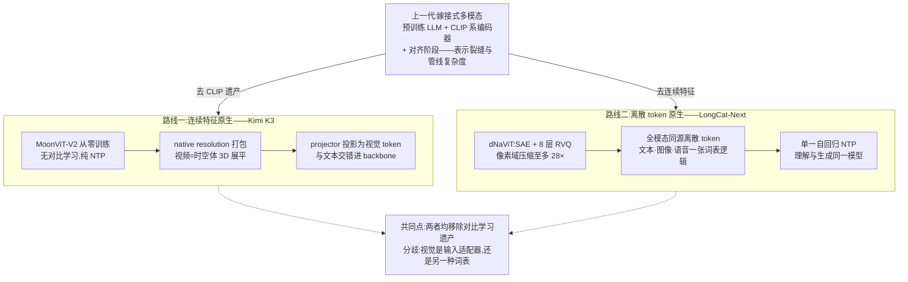
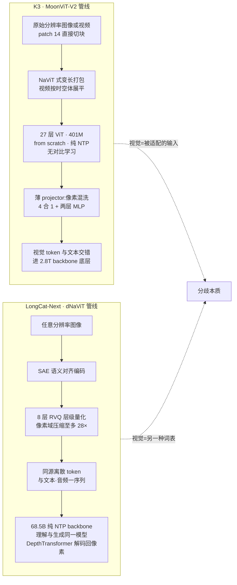
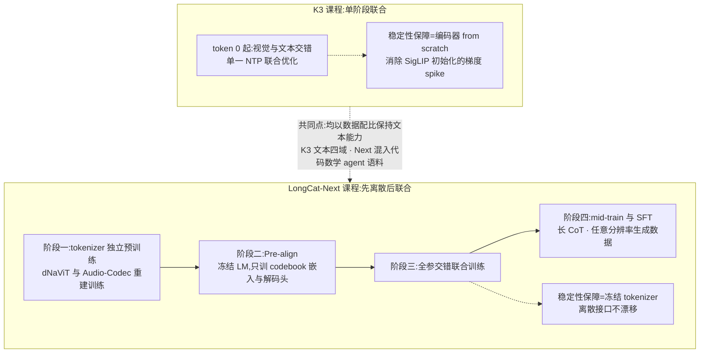

# Dispatch 28 · 原生多模态训练的两条路线:K3 的连续特征与 LongCat-Next 的离散 token

*2026-08-19 · NPU Frontier Dispatch · native-multimodal / Kimi-K3 / LongCat-Next / MoonViT / DiNA*

> **TL;DR** — "原生多模态"在 2026 年分裂成两条可对照的路线:**Kimi K3 的连续特征路线**(MoonViT-V2 完全 from scratch + 纯 next-token 训练、无任何对比学习阶段,native resolution 打包,projector 进 backbone,从第一个 token 起与语言联合优化)与 **LongCat-Next 的离散 token 路线**(DiNA:全模态离散化为同源 token,dNaViT 8 层 RVQ、28× 像素压缩,单一自回归目标同时做理解与生成)。两者在移除对比学习遗产上殊途同归;分歧在于视觉信息以何种形态进入模型——输入适配器,还是另一种词表。两者均未披露数据配比,是复现的最大缺口。对 RL-on-NPU:离散路线将训练系统归约为纯 NTP,异构编码器的负载不均问题消失(推断),对非 NVIDIA 栈尤为有利。

本篇性质:双工作对照调研(K3 技术报告 arXiv 2607.24653 此前已精读 + 两路定向检索补齐),主题限定在**原生多模态的数据、架构、训练**三件事,承接 D24(K3 首发与报告跟进)、D21(LongCat 系),不重复两篇已覆盖的内容。

---

## 1 · "原生"为什么成了关键词

上一代多模态模型的标准做法是**嫁接**:以预训练语言模型为基座,外接 CLIP/SigLIP 系视觉编码器,中间加对齐阶段(对比学习或 caption 预热),再做联合微调。该路线的代价在 2025-2026 年逐渐显现:对齐阶段引入独立的训练目标与数据管线,编码器与 backbone 预训练来源不同,留下持续的表示失配,长上下文与视频场景下该失配被进一步放大。

"原生"(native)的主张是:**视觉自预训练起始即与语言共享同一目标函数**。对"相同"的实现方式,2026 年出现了两条不同路线——即本篇的两个对象:

- **Kimi K3**(2026-07,2.8T/104B 激活,arXiv [2607.24653](https://arxiv.org/abs/2607.24653)):视觉保持**连续特征**,但编码器从零训练、目标函数只有 next-token prediction,与语言 token 交错在同一序列里;
- **LongCat-Next**(美团,2026-03,68.5B/A3B,arXiv [2603.27538](https://arxiv.org/abs/2603.27538)):视觉(与语音)**彻底离散化**为与文本同源的 token,模型是纯粹的自回归 NTP,无 projector、无连续特征注入,理解与生成天然统一。

### 图 A · 两条原生路线总对照

## 2 · 数据:两种数据学

**K3 的数据策略:分域精修、交错输入。** 报告口径:文本四域(Web/Code/Math/Knowledge)之外,视觉语料覆盖 caption、交错图文文档、OCR、perception、视频,以及一类值得注意的 **programmatic multimodal 数据**——代码与其渲染结果(SVG/3D/网页/CAD)成对,使模型直接学习"符号→视觉"的双向映射。各域经规则过滤 + 分类器质量打分 + 去重,采样率由小模型消融确定。**图文/视频的配比与视觉 token 占比未公开**——这是 K3 多模态部分最大的复现缺口。

**LongCat-Next 的数据策略:全部展平为统一序列。** 不走图文对路线,主干是 web 级**交错混排数据**(图/文/音混排网页),展平为统一序列(文本 token 与 `<Image_Start>…<Image_End>` 包裹的视觉 token、音频 token 顺序排列),使模型直接学习跨模态转移概率——官方称这"打破了数据瓶颈":散落互联网的混排数据都能以同一格式喂入。图文清洗是三段式:启发式过滤 → 多个开源 LVLM 重写 caption(合成)→ SigLIP 相似度剔除图文不匹配对(值得注意的细节:**SigLIP 在这条离对比学习最远的路线中,仍以数据过滤器的角色被保留**)。音频 tokenizer 语料约 250 万小时。为防止文本能力退化,配比中混入大量代码/数学/agent 高质量文本。同样,**backbone 多模态预训练的 token 总量与精确配比未披露**。

两者共同的信息缺口需要指出:原生多模态的**数据配比是当前最不透明的环节**——两份报告均披露管线细节而未给出配比数字,这与纯文本时代数据配方保密的行业惯例一致。

## 3 · 架构:MoonViT-V2 对 dNaViT

### K3:MoonViT-V2——从视觉编码器中去除对比学习

401M 参数、27 层、patch 14(架构表口径)。三个设计点:

1. **完全 from scratch + 纯 NTP,无任何对比学习阶段**——这是 V2 相对一代 MoonViT(Kimi-VL 基于 SigLIP-SO400M 初始化)最本质的改变。动机是训练稳定性:报告发现 SigLIP 初始化的编码器与 LLM 联合优化时**梯度范数持续偏高且反复 spike**,from-scratch 版本全程平稳,且视觉评测追平初始化版本。该结果表明:在足够大的联合训练预算下,CLIP 系预训练不再是必要前提,反而构成数值稳定性负担。
2. **native resolution + NaViT 式打包**:图像按原始分辨率直接 patch 化,不 resize 不裁剪不切片,变长序列打包进同一批次;视频帧作为时空体进入——多帧 2D patch 联合展平为单一 1D 序列,同一注意力跨空间+时间运行,3D 网格位置编码(以下 projector 与位置编码细节来自第三方 config 逆向与解读页,待原文复核):可学习 2D 空间嵌入叠加 1D sin-cos 时间嵌入。
3. **projector 保留,但已轻量化**:2×2 pixel shuffle(4 token 合 1)+ 两层 MLP 投影进 LLM 隐空间,视觉特征作为普通 token 与文本交错进 backbone 最底层——视觉在 K3 中仍属于"经适配的输入"。

### LongCat-Next:dNaViT——去除连续特征表示

范式名 **DiNA(Discrete Native Autoregression)**:文本、图像、语音全部映射为同源离散 token,单一 AR 目标,"最小模态特化"。视觉侧自研 **dNaViT**(Discrete Native Any-Resolution ViT):SAE(语义对齐编码器)+ **8 层 RVQ** 层级量化,像素域压缩至多 **28×** 仍保持语义与文字渲染保真度;解码用 DepthTransformer 多层 token 合并 + 解耦双轨生成式解码器。语音侧 LongCat-Audio-Codec(Whisper-large-v3 初始化 encoder,语义/声学双路,8 层 RVQ)。backbone 是 LongCat-Flash-Lite MoE(68.5B/约 A3B,带 N-gram Embedding)。

核心主张:**同一自回归模型同时承担视觉理解与图像生成**(以及语音理解/低延迟对话),官方主张首次让离散路线在理解 benchmark 上追平连续特征专用模型——理解任务的性能损失长期是离散路线的瓶颈。

### 图 B · 架构逐项对照

## 4 · 训练:token-0 联合 vs 原生化课程

**K3:从第一个 token 起联合。** 报告明言 native multimodal training strategy——语言与视觉从训练开始就联合优化,视觉与文本 token 交错在单一 next-token 目标内,不存在"先语言后对齐"的阶段划分。配套的稳定性设计即第 3 节的 from-scratch 选择(消除梯度 spike 来源)。基建侧报告仅有一句话级描述:multimodal encoder optimizations 与 MoonEP、memory-efficient training 并列,"在有界显存内维持利用率";训练期编码器的并行方式与变长图像负载均衡**未见公开细节**(推理侧旁证:vLLM/Dynamo 部署对视觉编码器用 data-parallel sharding)。

**LongCat-Next:分阶段的原生化课程。** 并非纯"从 step 0 交错",而是:① tokenizer 独立预训练(dNaViT 与 Audio-Codec 各自重建训练,音频侧分三步)→ 冻结 tokenizer;② **Pre-align**:冻结语言模型,只训 codebook embedding 与解码头——使离散词表与语言模型的嵌入空间先行对齐;③ 解冻全部参数,以交错数据深度联合训练;④ mid-training 与 SFT(合成长 CoT、任意分辨率生成数据)。冻结 tokenizer 保证离散接口稳定,是该路线独有的稳定性保障。工程口径(自报,provisional):相对连续方案**解码提速约 10×、算力节省约 30%**,支持 1M 上下文。

### 图 C · 训练课程对照

## 5 · 评测与权衡:各占优势区间

自报数字(均厂商口径,且两家规模差 40 倍、不可直接互比):

| 维度 | K3(2.8T/104B) | LongCat-Next(68.5B/A3B) |
|---|---|---|
| MMMU 系 | MMMU-Pro **81.6 / 83.4**(无/带 Python) | MMMU 70.6 |
| 数学视觉 | MathVision **94.3 / 97.8**(带工具追平 GPT-5.6 Sol) | MathVision 64.7、MathVista 83.1 |
| 文档 | OmniDocBench 91.1 | DocVQA 94.2,OmniDocBench 超 Qwen3-Omni |
| 视频 | Video-MME(w/ sub)**90.0**(超 GPT-5.6 Sol 89.5) | — |
| **图像生成** | **不支持** | GenEval **84.44**,长文字渲染强 |
| 语音 | — | MMAU 76.40,AISHELL-1 WER 1.47% |

权衡关系明确:**连续路线以参数规模换取理解上限**(K3 的视觉理解已与闭源旗舰同档),**离散路线以统一建模换取能力覆盖面**(理解+生成+语音一个模型,小激活低成本)。LongCat-Next 主张离散路线理解追平连续——严格说是"追平同量级连续模型",与 K3 这种 2.8T 旗舰仍差一个档位;而 K3 不支持图像生成,统一性缺失。两条路线当前并非替代关系,而是**分工关系**。

## 6 · 对 RL-on-NPU 的含义与开放问题

**① vision-in-the-loop RL 需要哪条路线?** K3 报告的 RL 环境里已有"多模态推理 + vision-in-the-loop 工具使用"(D24 §7):agent 在轨迹中生成代码渲染图表再观察结果。连续路线下,这要求 rollout 引擎集成视觉编码器、KV 与视觉特征一起管理;离散路线下视觉输出就是 token,**rollout 引擎与纯文本 RL 架构同构**——环境返回的图像离散化后直接进序列,不需要在推理引擎里嵌视觉编码器。对 RL 系统复杂度这是实质差异(推断)。

**② 对昇腾/异构硬件的亲和性(推断)。** 连续路线的训练难点在异构负载:变长图像打包造成编码器与 backbone 的算力配比波动,K3 以专门的 encoder optimization 处理(细节未公开);离散路线将全部模态归约为纯 NTP,**训练系统等价于标准 LLM 训练**——没有第二套算子、没有编码器并行、没有模态间负载均衡。对算子生态薄的 NPU 栈,离散路线的工程实现门槛更低(D23"根治层缺位"语境下尤其如此);代价在于性能上限完全由 tokenizer 质量决定,而 RVQ 类 tokenizer 的训练与解码 kernel 在 CANN 上同样是空白。

**③ 开放问题三条。**(a) 数据配比未公开:两者均未披露视觉 token 占比——第三方复现原生多模态的最大障碍;(b) from-scratch ViT 的结论边界:K3 证明 401M 编码器可以纯 NTP 目标从零训练,但这依赖 2.8T backbone 的联合预算,小模型语境是否成立未知;(c) 离散路线的 RL:LongCat-Next 尚无 RL 后训练细节披露,"离散视觉 token × RLVR"(生成图像的可验证奖励)是尚无公开工作的交叉方向——与 D25/D27 圈出的空白同属尚无先例的研究窗口。

## 下一步看什么

1. **LongCat-Next 的 RL 后训练**:离散统一模型怎么做 RLVR(尤其生成侧的可验证奖励),美团是否会在 LongCat-2.0 系上复用 DiNA。
2. **K3 §5.2.3 细节**:multimodal encoder 训练基建若随 CANN/开源生态披露,变长视觉负载均衡的做法值得单独拆。
3. **第三方复测**:两家的视觉跑分目前全部自报;MMMU-Pro/Video-MME 的独立复现是检验"原生>嫁接"叙事的关键。
4. **离散 tokenizer 军备**:dNaViT 之后,8 层 RVQ/28× 压缩这组数字会不会像"3:1 混合比"一样成为下一个被各家消融的超参。

---

**来源与声明**:K3 侧基于技术报告 arXiv [2607.24653](https://arxiv.org/abs/2607.24653)(本看板已精读,见 D24 §7)与官方 [GitHub README](https://github.com/MoonshotAI/Kimi-K3/blob/main/README.md)(视觉跑分为 README 原文);MoonViT-V2 的 projector/位置编码细节来自第三方 config 逆向([kimi-k3-mlx](https://github.com/PipeNetwork/kimi-k3-mlx) 等),已标注待原文复核。LongCat-Next 侧基于 arXiv [2603.27538](https://arxiv.org/abs/2603.27538)、[美团技术博客](https://tech.meituan.com/2026/04/02/longcat-next.html)、[LongCat-Audio-Codec](https://arxiv.org/abs/2510.15227) 与 [HF 模型页](https://huggingface.co/meituan-longcat/LongCat-Next)(MIT 开源)。全部 benchmark 为厂商自报(provisional);"解码 10×/算力省 30%"为 LongCat 官方口径;标注(推断)处为本看板分析。两家的数据配比均未公开,文中如实标注。
