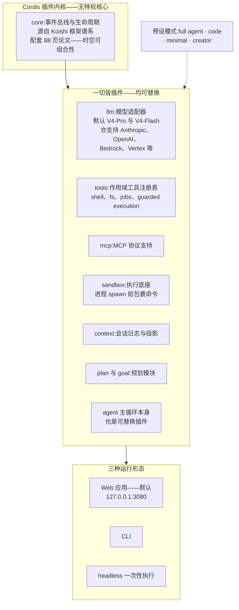
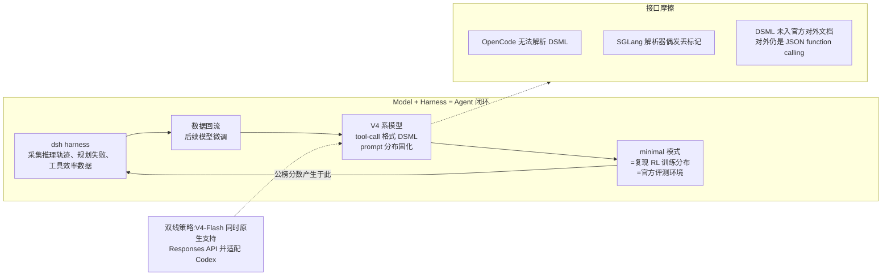
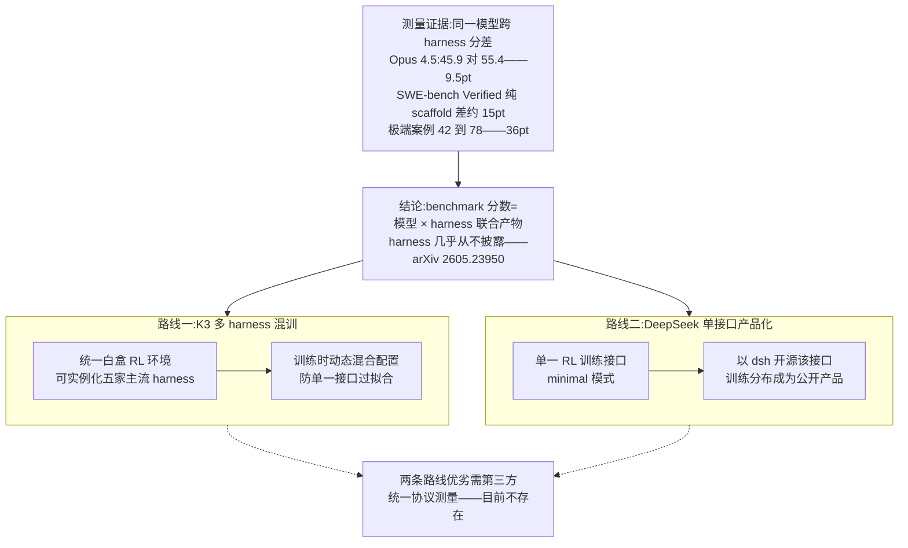

# Dispatch 29 · 详解 DeepSeek Harness:插件内核、透明日志与"模型×harness"联合系统

*2026-08-21 · NPU Frontier Dispatch · DeepSeek-Harness / agent-harness / Cordis / RL-on-NPU*

> **TL;DR** — DeepSeek 于 2026-08-13 随 V4-Pro GA 发布 **DeepSeek Harness(dsh)**:MIT 开源的 agent runtime,四天约 14 万 star、检索时点 177k,为 GitHub 最快增长曲线之一。三个技术支点:**Cordis 插件内核**(模型适配器、工具、沙箱乃至 agent 主循环全部为可替换插件)、**append-only 会话日志**(凡进入模型请求的内容必须可从日志重建,压缩即投影)、**"Model + Harness = Agent" 协同设计**(公榜成绩在自家 minimal 模式下测得,该模式实质复现 RL 训练分布)。分析框架:harness 即分数——同一模型跨 harness 分差可达 5-15pt;K3 以多 harness 白盒混训对冲过拟合,DeepSeek 走相反路线:单一训练接口 + 把训练分布产品化开源。成熟度(文档、体积、任务可靠性)仍处预览版阶段。

本篇性质:详解篇(两路定向调研,全部来源带 URL),回答 D16 的悬置问题("DeepSeek 为何尚无自家 harness"),对照 D24 §7(K3 统一白盒 RL 环境)与月度扫描的 MCP 无状态化、Opus 5 harness 竞争线索。

---

## 1 · D16 之问的答案:发布事实

Dispatch 16(2026-06)分析 DeepSeek-V4 的 agent 开发时记录过一个反常事实:agent 能力已进旗舰主打,却没有自家 harness。两个月后该问题正式关闭——**2026-08-13,DeepSeek Harness(CLI 命令 `dsh`)v0.1 developer preview 与 V4-Pro-0813 GA 同日发布**(7 月为 closed beta)。

- **定位**:开源 agent runtime 框架,编程 agent 是主场景之一但非唯一——提供 full agent / code / minimal / creator 多种预设模式;默认形态是**本地 Web 应用**(`npx @deepseek-ai/dsh web`,监听 127.0.0.1:3080),同时提供 CLI 与 headless 一次性执行形态,与"终端 REPL"为主的 Claude Code/Codex 形态不同。
- **工程形态**:TypeScript monorepo(apps: cli/web;packages: core、llm、mcp、sandbox、context、plan、goal 等),MIT 许可,版本 0.1.0-rc.5,官方明言是会破坏兼容的开发者预览版([repo](https://github.com/deepseek-ai/deepseek-harness))。
- **热度**:发布 90 分钟破 2.2 万 star、两天破 9 万、四天约 13.5-14.1 万(报道口径有出入),检索时点 **177.1k star / 19.3k fork**;发布 4 天社区插件(topic `dsh-plugin`)超 1,200 个;[HN 主帖](https://news.ycombinator.com/item?id=49285244)不足一天 734 分。

与模型发布的同步不是偶然:V4-Flash-0731 与 V4-Pro-0813 的公开 agent 基准(Terminal-Bench 2.1 87.9、CyberGym 83.3、DeepSWE 62.7 等)均声明在 **DeepSeek Harness minimal 模式**下测得——harness 首先是官方评测环境,其次才是产品(第 4-5 节展开该点的含义)。

### 图 A · dsh 总体架构:Cordis 内核与插件环

## 2 · 架构:把 agent 循环本身做成插件

dsh 的核心理念是 **"Everything is a plugin"**,构建在名为 **Cordis** 的插件内核上(谱系源自聊天机器人框架 Koishi;DeepSeek 为其发布了 88 页论文《A Programming Paradigm for Spatiotemporal Composability》)。与主流 harness 的差异在于彻底性:模型适配器、工具注册表、会话日志、沙箱、权限策略、UI 是插件,**agent 主循环本身也是插件**——不存在不可替换的特权核心。

**主循环与事件流**。执行模型为 turn-based:一个 turn 包含多个 step(每 step = 一次模型请求及其工具调用),事件链为 `turn/start → 组装 prompt → agent/pre-step → step 执行 → 工具调用 → agent/turn-stopping → turn/end`,以 waterfall 事件链支持任意环节的可扩展拦截。**subagent 通过 capability seam 实现**:provider 可以是新起的子 agent,也可以是委托给另一产品的 turn,统一接口——与 Claude Code 的"子代理为独立实例、父会话收摘要"设计属同类抽象,但接口更泛化。

**权限与沙箱**。权限模型由四层组成:capability seam 可替换、agent 预设按会话配置能力集、插件监听 `fs/*`、`tools/*` 事件实施策略、`ctx.sandbox` 后端在进程 spawn 前包裹命令。对照 Claude Code 的五档权限模式(2026-08 起分类器批准的 auto 模式成为默认)与 Codex 的沙箱声明式配置,dsh 把权限做成了插件问题而非产品问题——灵活性更高,默认安全性依赖预设质量。

对 Cordis 理论本身,社区评价分歧:插件化工程被普遍认可,88 页论文则被批评"时空可组合性"缺乏实质新意(本质为依赖树自动化 + 注册/卸载管理),effect 可逆性的自动发现、逆操作构造与冲突解决等难题并未解决([评论](https://www.80aj.com/2026/08/19/deepseek-cordis-combining/))。

## 3 · 上下文管理:append-only 日志与投影

dsh 最受社区认可的设计是会话状态管理:

- **append-only SessionEvent 日志为唯一事实源**,原则是 "model-visible means logged"——凡进入模型请求的内容必须可从日志重建;
- **压缩即投影**:`deriveMessages()` 从日志投影出模型消息历史,上下文压缩不是独立算法而是投影函数的参数——历史永不改写;
- **checkpoint/fork**:`ctx.sessions.fork()` 从任意日志位置分叉会话;原始 chunk 事件保留,支持精确回放。

对照本看板追踪过的其余四家(月度扫描与本次调研口径):

| harness | 上下文策略 |
|---|---|
| **dsh** | append-only 日志 + 投影式压缩 + fork/精确回放 |
| Claude Code | 子代理隔离上下文(父会话收摘要)+ 压缩 |
| Codex | 增长式 JSON prompt,推理 trace 经 Responses API 跨轮传递(强依赖服务端连续性) |
| OpenClaw | 主动式管理:分页、索引、剪枝 + Markdown/SQLite 记忆层 |
| Hermes | 压缩产生 lineage 而非改写历史(与 dsh 理念接近) |

透明日志被 [HN 社区](https://news.ycombinator.com/item?id=49285244)视为对闭源 harness 的最大差异点。对本看板的意义在第 6 节:append-only 全透明日志正是 **RL 轨迹采集的理想接口**——rollout 轨迹、工具调用、失败路径全部可重建,这一设计与其说面向用户,不如说面向训练管线。

## 4 · Model + Harness = Agent:协同设计的两面

官方口号 "**Model + Harness = Agent**" 直接声明了协同设计:harness 采集的推理轨迹、规划失败与工具效率数据回流用于后续模型微调;模型的 tool-call 格式与 prompt 分布则固化进 harness。两个具体证据:

**其一,minimal 模式即训练分布。** V4 系公榜成绩均在 minimal 模式下测得,官方同时警告换 harness 结果会不同;第三方审读指出 minimal 模式实质是**复现 RL 训练时的 prompt 与 tool-schema 分布**([讨论](https://x.com/ZhihuFrontier/status/2088872677692076431))。即:公榜分数 = 模型在其训练接口上的表现,harness 是分数的一部分。

**其二,DSML 格式。** V4 系模型底层 token 格式为 DSML(`<｜DSML｜>` 系 XML 式语法,以 string="true|false" 区分字符串与结构化参数,规避 JSON-in-string 的转义失败)。生态摩擦真实存在:OpenCode 无法解析 DSML([issue #24566](https://github.com/anomalyco/opencode/issues/24566))、SGLang 解析器偶发丢标记([issue #14695](https://github.com/sgl-project/sglang/issues/14695));且 DSML 未进入[官方 tool-use 文档](https://api-docs.deepseek.com/guides/tool_calls/)(对外接口仍是 JSON function calling)。tool-call 格式正在成为模型厂的训练层差异化手段。

同时须注意双线策略:V4-Flash-0731 原生支持 **Responses API 并专门适配 Codex**——DeepSeek 在"自家 harness"与"他家 harness 兼容"两条线同时投入,dsh 的 `ctx.llm` adapter 层也不锁定自家模型(内置 Anthropic/OpenAI/Bedrock/Vertex 等 provider)。

### 图 B · 协同设计闭环与接口摩擦

## 5 · harness 即分数:两条防过拟合路线

本次调研确立的分析框架来自一组测量证据:**benchmark 分数是"模型 × harness"的联合产物**。

- 同一 Claude Opus 4.5,SWE-bench Pro 标准化 scaffold 下 45.9%,Claude Code 下 55.4%——**9.5pt 分差**([数据](https://docs.bswen.com/blog/2026-04-20-swe-bench-pro-agent-scaffold/));
- arXiv 论文《Stop Comparing LLM Agents Without Disclosing the Harness》([2605.23950](https://arxiv.org/abs/2605.23950))系统论证该问题:harness 几乎从不披露也不受控,SWE-bench Verified 上纯 scaffold 差异可达约 15pt;
- 极端案例:同一模型仅改 scaffolding 从 42% 到 78%([案例](https://particula.tech/blog/agent-scaffolding-beats-model-upgrades-swe-bench));
- DeepSeek 本身即最新例证:官方只在 minimal 模式下报分并明示换 harness 分数会变。

在此背景下,头部厂商对"harness 过拟合"的应对分裂为两条路线:

| | Kimi K3 | DeepSeek |
|---|---|---|
| 策略 | **多 harness 白盒混训**:统一白盒 RL 环境可实例化 Kimi Code/Claude Code/Codex/OpenClaw/Hermes,训练时动态混合配置(D24 §7) | **单一接口 + 产品化**:单一 RL 训练接口,再把该接口以 dsh 开源,使训练分布成为公开产品 |
| 逻辑 | 训练时见过多种 harness,部署到任意 harness 均稳 | 让全世界使用与训练分布一致的 harness |
| 代价 | 环境工程复杂度高 | 接口敏感性成为公开承认的弱点(第三方 harness 下分数不保证) |

两条路线的优劣需要第三方在统一协议下测量——目前该测量不存在,这本身即 [2605.23950](https://arxiv.org/abs/2605.23950) 指出的领域缺陷。

### 图 C · harness 即分数:证据与两条路线

## 6 · 成熟度评价与对 RL-on-NPU 的含义

**成熟度**。预览版的问题清单:README 文档单薄、构建后体积 1.4-1.5GB、实测任务完成可靠性不稳定([实测](https://www.atlascloud.ai/blog/tips/deepseek-harness-review):三次声明完成仅一次可用)。star 曲线反映的是关注度而非生产可用性,当前阶段的合理定位是"现象级预览版"。

**对本看板的三点含义**:

1. **append-only 日志 × RL 轨迹采集**。dsh 的会话日志设计与 rLLM 的 Model Gateway 捕 logprob(D22)、K3 的 partial rollout 轨迹管理(D24 §7)属同一问题域——agent 轨迹的完整可重建性是 agentic RL 的数据基础。dsh 把它做成了开源 runtime 的默认属性,任何团队可直接以 dsh 采集带完整工具调用链的训练轨迹(推断:这可能正是其设计动机之一)。
2. **可配置 harness 底座**。K3 的统一白盒 RL 环境(可实例化多家 harness)目前未开源;dsh 的"一切皆插件"架构恰好提供了同类能力的开源实现路径——以插件组合实例化不同 harness 配置做多样化 RL 训练,是 dsh 之上可直接开展的工作(推断)。
3. **执行底座对照**。V4 技术报告披露的 DSec 弹性计算(function call/容器/microVM/VM 四种执行底座、3FS 分层镜像、可抢占轨迹重放)与 K3 的 AgentENV(Firecracker microVM,D24 §7)构成 agent 沙箱基建的两个公开参考;dsh 的 sandbox seam 是其产品端接口。昇腾侧沙箱基建(D13 四问题之一)可直接借鉴该三层结构。

## 下一步看什么

1. **v0.1 → 稳定版的演进速度**:文档、体积与可靠性问题的收敛节奏,决定 dsh 是产品还是训练基建的副产品。
2. **DSML 是否进入官方对外文档**:tool-call 格式之争(DSML vs JSON function calling vs Responses)的标准化走向。
3. **第三方统一协议的跨 harness 测量**:K3 混训与 DeepSeek 单接口两条路线的实证对比,谁先做谁定义评测标准。
4. **dsh 插件生态与 RL 工具链的交叉**:社区是否出现基于 dsh 的轨迹采集/RL 环境插件。

## 跟进(2026-09-01):对照 Prime Agent

Prime Intellect 于 08-05 开源的 [Prime Agent](https://github.com/PrimeIntellect-ai/prime-agent)(MIT,arXiv 2608.23552)为本篇的分析框架提供了另一极。两者同为 harness、同以轨迹回流训练栈为商业逻辑,但设计哲学相反:**dsh 以 append-only 日志为状态中心**(压缩=投影、精确回放、minimal 模式复现训练分布),为可审计与训推一致优化;**Prime Agent 以持久 IPython kernel 为状态中心**(RLM:上下文即变量、sub-agent 即 `rlm()` 函数调用),为长任务 token 效率优化,代价是回放困难。第二个分界是自改进:dsh 的插件由开发者替换,Prime Agent 把 prompt/技能/记忆开放给 agent 自身 CRUD——评测口径因此随自改漂移。第三,防过拟合路线相反:dsh 用"收窄"(单接口 + minimal 模式)保证分数可信,Prime Agent 用"增强"证明 harness 是能力放大器(自报搭配 Opus 5 在 ARC-AGI-3 得 95.5%、九项长上下文六胜 Claude Code)。两个结果合起来构成"harness 即分数"的完整论证:harness 既定义分数口径,也改变分数本身。Prime Agent 明确不做沙箱,与 D35 记录的"每 agent 一沙箱"生产共识相悖。

---

**来源与声明**:两路定向调研(2026-08-21),主要来源:[deepseek-harness repo](https://github.com/deepseek-ai/deepseek-harness) 及其架构文档、[V4-Pro GA 公告](https://api-docs.deepseek.com/news/news260813/)、[HN 讨论](https://news.ycombinator.com/item?id=49285244)、[harness 分差论文 2605.23950](https://arxiv.org/abs/2605.23950)、[K3 技术报告 2607.24653](https://arxiv.org/abs/2607.24653)、[Codex agent loop](https://openai.com/index/unrolling-the-codex-agent-loop/)、[Hermes 架构](https://hermes-agent.nousresearch.com/docs/developer-guide/architecture)、[MCP 2026-07-28 规范](https://blog.modelcontextprotocol.io/posts/2026-07-28/)等,文中逐处标注。star 数随时间快速变化,以检索时点为准;DSML 细节来自第三方解析器与社区报告(非官方文档);标注(推断)处为本看板分析。
