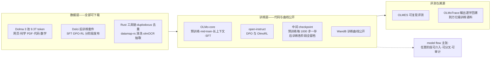
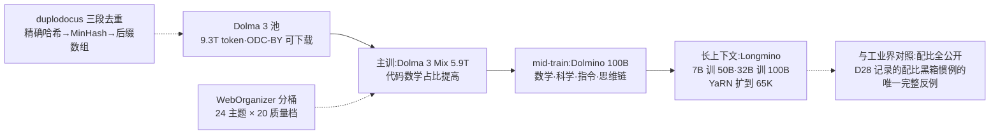
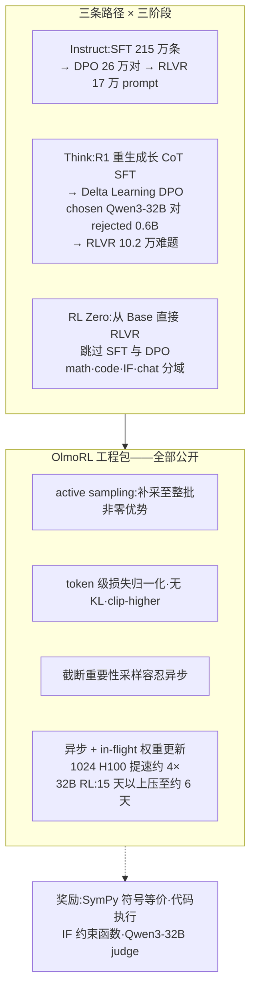
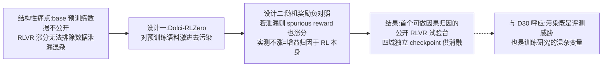

# Dispatch 31 · 详解 OLMo 3 工作体系:model flow 全开放与可复现 RLVR 的天花板

*2026-08-26 · NPU Frontier Dispatch · OLMo-3 / fully-open / RLVR / OlmoRL / model-flow*

> **TL;DR** — AI2 的 OLMo 3(arXiv 2512.13961,2025-11 发布模型)确立了"fully-open"阵营的新上限:不止权重,而是完整 **model flow**——Dolma 3 预训练数据(9.3T token 池可下载)、Dolci 后训练数据、OLMo-core/open-instruct 训练代码、预训练每 1000 步的中间 checkpoint、公开 WandB 曲线、OLMoTrace 输出溯源,链条无缺口。RL 侧是本篇重点:**OlmoRL**(active sampling、token 级损失归一化、无 KL、截断 IS、异步 in-flight 更新,1024 张 H100 提速约 4×)把 RLVR 从 Tülu 3 的"收尾工序"升级为训练主干;**RL Zero** 变体(从 base 直接 RLVR + 激进去污染 + 随机奖励负对照)首次使 RLVR 增益的因果归因成为可能。开放度评级居首(Openness Index 89 分)与采用量悬殊(Ai2 系约 1480 万下载 vs Qwen 9.4 亿+)并存——它是研究基座与透明性公共品,而非生态份额竞争者。

本篇性质:体系详解篇(四路并行调研,全部来源带 URL/arXiv 号),对照 D20(openPangu"参考栈"的开放度上位形态)、D24(注意力谱系,Olmo Hybrid 后续转向 Gated DeltaNet)、D28(数据配比公开的反例)、D30(去污染与负对照=评测方法学的训练侧实践)。

---

## 1 · 定位:model flow 与开放度光谱

OLMo 3 的核心主张不是单点性能,而是 **model flow**:模型完整生命周期的每个阶段、每个 checkpoint、每条数据、每个依赖全部开放,研究者可在任意节点介入或分叉——研究能力涌现、对特定阶段做消融、在 mid-train 换入领域数据、从更早的 checkpoint 分叉后训练。与之对照,多数 open-weights 模型是"带公开接口的黑箱":可用,不可审计,不可复训。

该主张已获第三方评级背书:[Artificial Analysis Openness Index](https://artificialanalysis.ai/articles/announcing-artificial-analysis-openness-index) 中 OLMo 家族以 **89 分居首**(Nemotron Nano 67 分),[欧洲 OSAI Index](https://osai-index.eu/) 亦长期将其列为最开放。放进本看板追踪过的开放度光谱:

| 层级 | 代表 | 开放内容 |
|---|---|---|
| **model flow 全开放** | **OLMo 3**(Apache 2.0) | 权重+数据+训练代码+中间 checkpoint+日志+溯源工具 |
| 权重+部分数据 | Nemotron 系 | 权重+报告+部分数据集 |
| 权重+推理代码+报告 | openPangu 2.0(D20) | 训练代码承诺中、数据未开 |
| 权重+报告 | LongCat-2.0(D21) | 训练代码与数据未开 |
| 仅权重 | K3 / GLM / DeepSeek V4 | MIT/类 MIT 许可,无数据无训练代码 |

D20 曾把 openPangu 定位为"昇腾上的一手参考栈"——OLMo 3 展示了该概念的完整形态:参考栈的价值上限不在权重,在**可复训与可归因**。

### 图 A · model flow 全链路工件

## 2 · 模型家族与架构:保守混合

家族矩阵:7B 与 32B 两档 × Base / Instruct / Think / RL Zero(RL Zero 仅 7B)四条路径;旗舰为 Think 32B;2026-01 的 Olmo 3.1 为 32B Think 追加约 3 周 RL 并补齐 32B Instruct。

架构相对 OLMo 2 的更新克制:保留 post-norm RMSNorm、QK-norm、z-loss 等稳定性组件,新增**滑动窗口注意力混合——每 4 层中 3 层用 4096-token 局部窗口、每第 4 层全注意力**;32B 用 GQA(40 查询头/8 KV 头),7B 保持 MHA;上下文 65K(预训练 8192,YaRN 扩展,且 **YaRN 仅施加于全注意力层**)。放进 D24 的注意力谱系:工业旗舰在稀疏化(DSA/LSA)与线性化(KDA)两条激进路线上竞争,OLMo 3 选择了最保守的 SWA 混合——同为"3:1 局部与全局分工",但不改状态更新方程、不做可学习索引。值得注意的后续:AI2 在 2026 年发布 **Olmo Hybrid**(7B,75% 层 Gated DeltaNet + 25% 标准注意力,[官方博客](https://allenai.org/blog/olmohybrid))——Gated DeltaNet 正是 KDA 的直接前身(D24 §2),全开放阵营也开始验证线性混合路线,且提供与 OLMo 3 7B 的受控对比。

## 3 · 数据体系:三层漏斗与公开配比

Dolma 3 的组织是三层漏斗,**配比全部公开**——对照 D28 记录的"工业界数据配比黑箱惯例",这是唯一的完整反例:

- **主训**:Dolma 3 Mix,5.9T token(从 9.3T 池筛出;代码与数学占比高于前代);
- **mid-train**:Dolmino Mix,100B(从约 2.2T 高质量池采样:数学/科学/代码/指令/思维链);
- **长上下文**:Longmino Mix,7B 训 50B、32B 训 100B(639B 长文档池,34% 长文/66% 短文)。

数据工程为自研 Rust 工具链:duplodocus 三段式去重(精确哈希 38.7B→12.8B 文档、MinHash 模糊、后缀数组子串)、WebOrganizer 24 主题×20 质量档共 480 桶、fastText 质量分类,混合比例经 swarm 式小模型消融确定。算力口径:7B 用 512×H100、32B 用 1024×H100,32B Think 全流程约 56 天、约 $2.75M(二手转述,provisional)。

评测定位(多为二手转述):Think 32B 以**约 1/6 的训练 token 逼近 Qwen 3 32B**(MATH 96.2、AIME'24 80.6),是完全开放阵营首个可与 open-weights 旗舰同档竞争的推理模型;知识型多选(MMLU 系)仍落后数分。"更少 token 打平"的含义:数据配比与后训练配方是主要杠杆。

### 图 B · 三层数据漏斗与训练阶段

## 4 · 后训练与 OlmoRL:RLVR 成为训练主干

后训练统一为 **SFT → DPO → RLVR** 三阶段,配 Dolci 数据套件(按阶段 × Instruct/Think/RL-Zero 路径分别发布)。谱系上,这是 Tülu 3(RLVR 概念的提出者,[2411.15124](https://arxiv.org/abs/2411.15124))管线的大规模翻新:数据全部重刷、RL 从"最后小规模润色"升级为**主要能力阶段**。

三个值得单独记录的设计:

**① Delta Learning DPO。** Think 路径的 DPO 对:chosen 来自 Qwen3-32B(thinking)、rejected 来自 Qwen3-0.6B——**关键是两者的质量差而非绝对质量**。直接在 Qwen3-32B 补全上继续 SFT 反而掉分,delta-pair DPO 则同时提升 pass@1 与 pass@k(扩展推理边界)。

**② OlmoRL 工程包。** GRPO/DAPO 系改进的完整公开实现:零梯度组过滤 + **active sampling**(持续补采样直到凑满整批非零优势)、token 级损失归一化(去长度偏置)、**无 KL 惩罚**、clip-higher、截断重要性采样(容忍异步 off-policy);基建为全异步 RL + continuous batching + **in-flight 权重更新**,最多 1024 张 H100 上提速约 4×,32B Think 的 RL 从超 15 天压缩到约 6 天。奖励设计:数学 SymPy 符号等价、代码测试执行(AWS Lambda、pass-rate 阈值)、精确 IF 约束函数、通用对话用 Qwen3-32B 作 judge。这套组合与看板 D18/D19/D22 记录的工业实践(AIPO/TIS/compact filtering 系)高度同源,差异在于**全部脚本、超参与 WandB 曲线公开**——7B Think RL 的复现开销约 32-72 张 H100 级 GPU,处于高校实验室可及范围。

**③ 每阶段 checkpoint 留档。** SFT/DPO/RL 各阶段模型独立发布(如 Olmo-3-7B-Instruct-SFT),配 WandB 全曲线——后训练从黑箱变成可逐段审计的流水线。

### 图 C · 后训练矩阵与 OlmoRL

## 5 · RL Zero:无泄漏的 RLVR 试验台

RL Zero 是对本看板最有价值的部件:**从 Base 直接做 RLVR、完全跳过 SFT/DPO**,按 math/code/IF/general 四个域独立训练并发布全程 checkpoint。两个设计使它成为可控实验床:

1. **激进去污染**:Dolci-RLZero 数据对预训练与 mid-train 语料做近重复感知去污染;
2. **随机奖励负对照**:若评测题在预训练中泄漏,spurious reward 也会涨分——OLMo 3 用该负对照验证无泄漏增益,直接回应 "Spurious Rewards" 争议。

这解决了社区的结构性痛点:Qwen/Llama 等 base 不公开预训练数据,RLVR 涨分永远无法排除数据泄漏混杂——D30 论证的"污染是评测三威胁之一"在训练研究侧同样成立,RL Zero 是第一个系统性堵住该混杂的公开基座。第三方已在使用:推理链控制研究([2603.05706](https://arxiv.org/abs/2603.05706))、OlmoLogic(TU Darmstadt,在官方 RLVR 配方上接入 Prolog 符号验证器,[博客](https://huggingface.co/blog/LukasHug/olmo-logic))、预训练动态与 probing 研究直接取用其中间 checkpoint。

### 图 D · RL Zero 负对照逻辑

## 6 · 生态位:评级天花板与采用量现实

两组数字并置即是 OLMo 3 的生态位:开放度评级居首(89 分),而采用量悬殊——[ATOM Report](https://arxiv.org/abs/2604.07190) 口径 Ai2 系累计约 **1480 万**下载,对照 Qwen 累计 9.4 亿+(2026-08 已 20 亿+,衍生模型 15 万个)。OLMo 的影响集中在科研而非部署。

批评集中三条:规模上限 32B dense(与中国第一梯队差一个数量级,不参与前沿能力竞争)、明确英文中心、定位是"研究仪器"而非日常可用模型。在中美开源叙事中,它被引用为美国方面"真开源"的旗帜(AI2 的 ATOM 叙事),但份额层面中国阵营优势持续扩大(HF 口径中国开源模型占全球下载 41%)。

后续演进延续"科研深耕"路线:Olmo 3.1(RL 加训)、Olmo Hybrid(线性混合架构受控实验)——未见更大尺寸计划,AI2 自述 32B 是"科研+可部署"的平衡点。

## 7 · 对 RL-on-NPU 的含义

1. **最小可行系统的基座升级(接 D25)。** D25 的四步路线图建议以 Qwen2.5-1.5B + verl 起步;OLMo 3 提供了更干净的替代:7B RL 复现 32-72 卡可及,且**数据可审计**——效率感知 RL 的消融结论不再受"基座见没见过测试分布"的混杂。RL Zero 四域 checkpoint 直接支持"从 base 起 RL"的对照设计。
2. **OlmoRL 工程包的移植价值(接 D13/D23)。** active sampling、token 级损失归一化、截断 IS、in-flight 更新——这组已验证的稳定化组件有完整公开实现,是 MindSpeed-RL 语境下最可直接借鉴的参考代码;open-instruct/OLMo-core 的昇腾移植目前是空白。
3. **model flow 是 openPangu 的应然形态(接 D20)。** openPangu 承诺的"七大组件"迄今训练代码与数据未兑现;OLMo 3 证明全链路开放在工程上完全可行且与竞争力兼容(1/6 token 逼近 Qwen 3 32B)。昇腾生态若要建立可复现的 RL-on-NPU 研究底座,OLMo 3 的工件清单就是对标清单。
4. **负对照方法的推广。** 随机奖励负对照不依赖 OLMo 本身,任何 RLVR 研究(含昇腾上的复现)都应加入该对照——成本一次训练,换来增益归因的可信度,与 D13 的 align-probe、D30 的判分独立性同属"测量诚实性"工具箱。

## 下一步看什么

1. **Olmo Hybrid 的受控结论**:Gated DeltaNet 混合在全开放对照下与标准注意力的差距量化——为 D24 的 KDA 路线提供独立证据。
2. **OLMo 3 checkpoint 上的 RL 研究产出**:RL Zero 试验台的论文流,尤其"预训练数据如何影响 RL 可塑性"方向。
3. **open-instruct/OLMo-core 的非 NVIDIA 移植**:是否出现昇腾/AMD 端口——全开放代码 × 国产硬件是尚无公开工作的组合。
4. **openPangu 训练代码兑现后的对照**:两个"参考栈"的开放粒度与可复现性直接对比。

---

**来源与声明**:四路并行调研(2026-08-26),主要来源:[技术报告 arXiv 2512.13961](https://arxiv.org/abs/2512.13961)、[Ai2 官方博客](https://allenai.org/blog/olmo3)、[OLMo-core 官方脚本](https://github.com/allenai/OLMo-core/tree/main/src/scripts/official/OLMo3)、[open-instruct olmo3 脚本](https://github.com/allenai/open-instruct/tree/main/scripts/train/olmo3)、[dolma3 仓库](https://github.com/allenai/dolma3)、[Tülu 3](https://arxiv.org/abs/2411.15124)、[OLMoTrace](https://arxiv.org/abs/2504.07096)、[Openness Index](https://artificialanalysis.ai/articles/announcing-artificial-analysis-openness-index)、[ATOM Report](https://arxiv.org/abs/2604.07190)、[Interconnects](https://www.interconnects.ai/p/olmo-3-americas-truly-open-reasoning) 等,文中逐处标注。arXiv 直接抓取受本环境代理限制,论文细节经官方脚本/博客与多家二手来源交叉;评测数字多为二手转述(provisional);$2.75M 成本与部分脚本级超参来自第三方整理,以技术报告原文为准。
