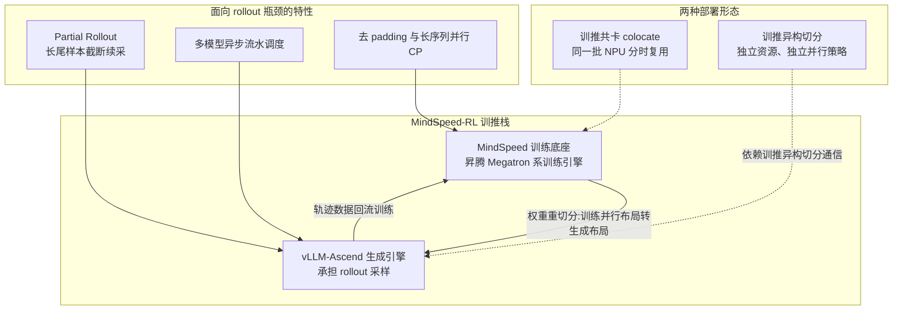
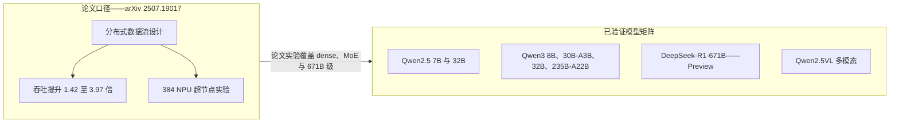
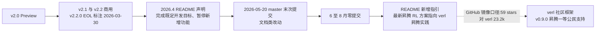
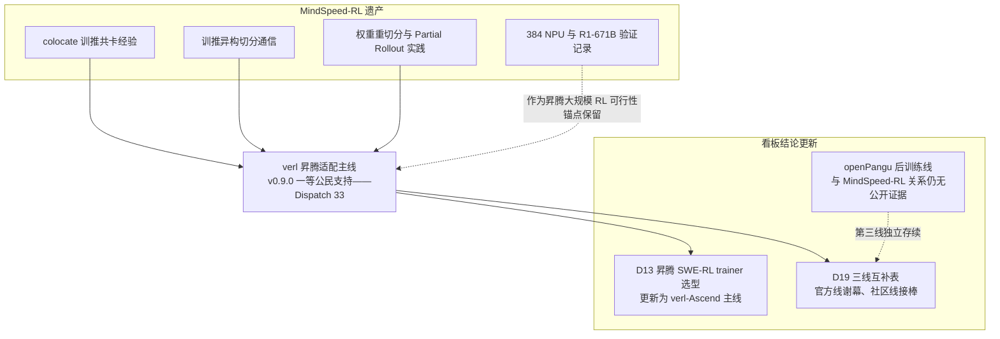

# Dispatch 32 · 详解 MindSpeed-RL:昇腾官方 RL 框架的成绩单与谢幕

*2026-08-27 · NPU Frontier Dispatch · MindSpeed-RL / Ascend / RL-frameworks / RL-on-NPU*

> **TL;DR** — MindSpeed-RL 是昇腾生态的官方 RL 加速框架(华为,MIT 许可,贡献方含华为多部门与工商银行 AI Lab),以 MindSpeed 为训练底座、vLLM-Ascend 为生成引擎,提供训推共卡 colocate 与训推异构两种形态,配套权重重切分、Partial Rollout、多模型异步流水调度等特性。论文口径(arXiv 2507.19017)在 Qwen2.5-7B/32B、Qwen3-MoE-30B、DeepSeek-R1-671B 上取得 1.42~3.97× 吞吐提升,并完成 384 NPU 超节点实验——这是昇腾能跑大规模 RL 的最正式官方证据。但项目已谢幕:2026.4 README 声明暂停新增功能,2026-05-20 后零提交,且 README 亲自将用户导流至 verl。本文是其成绩单,也是讣告。

本篇承接 Dispatch 02(rollout 瓶颈)、13(昇腾 SWE-RL 的四个问题)、19(slime / MindSpeed-RL / openPangu 三线互补表)、23(昇腾"根治层缺位"),并与同期成文的 Dispatch 33(verl 昇腾一等公民支持)构成一对:一篇写官方线的谢幕,一篇写社区线的接棒。

---

## 1 · 为何此篇欠了很久

MindSpeed-RL 是本看板被引用最多、却始终没有专篇的昇腾 RL 框架。Dispatch 02 引它作为"昇腾在 910B/384-NPU 上跑通 R1-671B"的证据;Dispatch 13 的昇腾 SWE-RL 方案曾选它为 trainer;Dispatch 19 把它列为三线互补表中的"昇腾官方线";Dispatch 23 讨论昇腾软件栈"根治层缺位"时,它是官方投入的主要反例。四次引用,零次详解——欠账明确。

补写的时机有其反讽之处:等到本篇成文,MindSpeed-RL 已经谢幕。2026-08-27 核验,仓库 master 最后提交停在 2026-05-20(文档类改动),6、7、8 月零提交;README 在 2026.4 声明"已完成既定开发目标,将暂停新增功能",并新增指引将用户导向 verl 的昇腾实践。于是本篇的写法随之改变:不是一份选型评测,而是一份结算——它做成了什么、留下了什么、看板既有结论需要如何更新。这也是本篇与 Dispatch 33(verl 篇)成对的原因:官方线的终点,恰是社区线的起点。

## 2 · 架构:MindSpeed 训练 + vLLM-Ascend 生成

MindSpeed-RL 自述为"端到端的 RL 训推解决方案",结构上是两个引擎的组合(本看板 D02 口径):训练侧是 **MindSpeed**——昇腾的 Megatron 系训练引擎;生成侧是 **vLLM-Ascend**。算法覆盖 GRPO、DAPO、PPO、DPO,按 Released/Preview 分级。部署形态有两种:**训推共卡 colocate**(训练与生成分时复用同一批 NPU)与**训推异构切分**(训练与生成各占独立资源、各选并行策略,依赖专门的训推异构切分通信)。

特性清单不是并列的功能点,每一项对应一个具体问题,且大多能对回本看板既有的两组观察:

- **权重重切分**:训练与生成的最优并行布局不同(训练要 TP/PP/EP 组合,生成要低延迟的推理切分),每步权重同步时需在两种布局间转换。这是所有"训练 Megatron 系 + 推理 vLLM 系"框架的共同必修课,MindSpeed-RL 把它做在 HCCL 语义之上。
- **Partial Rollout**:直接回应 Dispatch 02 的核心量化——rollout 占 RL 单步 70% 以上 wall-clock,且长尾样本决定整批等待时间。截断长尾、跨步续采,以有限的 off-policy 代价换整批吞吐。
- **多模型异步流水调度**:RL 单步涉及 actor、reference、reward 等多个模型的计算,异步流水将其重叠,减少串行空转。
- **训推共卡 colocate**:对应 Dispatch 13 昇腾四问题中的第一条——vLLM-Ascend 彼时无 sleep-mode,训推共卡时显存争用无法优雅切换。colocate 形态正是官方在这个约束下给出的工程答案;而 D13 的另外三个问题(train-infer logprob 一致性、长 rollout、沙箱成本)分别落在权重重切分的数值一致性、Partial Rollout 与 CP、以及框架边界之外。
- **数据调度与去 padding**:变长序列不补齐,长序列走 CP 并行——长 CoT 时代的吞吐基本功。

整体判断:这套特性组合与 slime(Dispatch 19)、verl 等 NVIDIA 栈框架的设计议程高度同构,差异在于全部落在昇腾原生栈(MindSpeed + vLLM-Ascend + HCCL)上。它证明的不是设计新颖性,而是昇腾栈承载这套设计的完整性。

## 3 · 成绩单:昇腾大规模 RL 的最正式官方证据

MindSpeed-RL 的核心价值在其公开验证记录。论文(arXiv 2507.19017)给出分布式数据流设计,并报告在 Qwen2.5-7B/32B、Qwen3-MoE-30B、DeepSeek-R1-671B 上 **1.42~3.97× 的吞吐提升**(论文口径),实验规模到 **384 NPU 超节点**。仓库口径的已验证模型:

| 模型 | 规格 | 状态 |
|---|---|---|
| Qwen2.5 | 7B / 32B | 已验证 |
| Qwen3 | 8B / 30B-A3B / 32B / 235B-A22B | 已验证 |
| DeepSeek-R1 | 671B | Preview |
| Qwen2.5VL | 多模态 | 已验证 |

三点解读:

**第一,这是昇腾能跑大规模 RL 的最正式官方证据。** 社区适配、第三方实践都存在,但由硬件厂商官方框架给出、有论文背书、覆盖 dense/MoE/多模态、上探 671B 的验证矩阵,昇腾生态中仅此一份。Dispatch 02 引用"910B/384-NPU 跑过 R1-671B"作为昇腾大规模 RL 可行性的锚点,锚的就是这份记录。

**第二,数字须按口径读。** 1.42~3.97× 是论文口径的吞吐提升,基线与配置由论文定义,不可直接横向对比其他框架的加速比;R1-671B 标注 Preview,与 Released 级的 Qwen 系列成熟度不同级。

**第三,验证矩阵与商用分级(v2.1/v2.2)说明它达到过生产可用状态**,贡献方名单里的工商银行 AI Lab 是框架有外部行业用户的直接证据——尽管生态伙伴名单自始至终也只有这一家,这个事实在第 5 节的解读中会再次出现。

## 4 · 谢幕时间线

时间线各节点(2026-08-27 核验):

1. **v2.0 Preview → v2.1/v2.2 商用**:框架走完了从预览到商用的正常生命周期,v2.2.0 的 EOL 标注为 2026-03-30。
2. **2026.4**:README 声明"已完成既定开发目标,将暂停新增功能"。措辞是"完成目标后的暂停",不是废弃。
3. **2026-05-20**:master 最后一次提交,内容为文档类;此后 6、7、8 月零提交。暂停坐实。
4. **README 导流**:新增指引"最新的昇腾强化学习方案,可以访问 verl 昇腾实践",链接直指 github.com/verl-project/verl。官方亲自把用户导向社区框架——这是整条时间线中信息量最大的一步。
5. **社区规模对照**:GitHub 镜像口径 59 stars / 5 forks,对 verl 的 23.2k。须注明:主仓可能在 Gitee,GitHub 数字可能显著低估其真实使用面;但即便如此,量级差距的方向不受影响。

另一个核验结论:openPangu 后训练管线(快慢融合 SFT + 多域 RL + 在线渐进蒸馏,Dispatch 20)与 MindSpeed-RL 的关系无公开证据——华为自家旗舰模型的 RL 是否构建其上,始终未被官方确认。这个悬置本身参与第 5 节的解读。

## 5 · 谢幕的三种解读

以下三种解读均为推断,证据强度不同,且彼此不互斥。

**解读一:完成阶段目标,转入维护态。** 官方措辞的字面含义:框架立项时的目标(在昇腾上端到端跑通大规模 RL、验证到 671B 级、达到商用分级)已经达成,继续堆特性的边际价值低,转维护是正常的项目管理决策。支持证据是措辞本身与商用版本的存在;弱点是它无法解释 README 为何要主动导流到第三方框架——纯维护态项目通常不这样做。(推断)

**解读二:资源转向支持社区框架。** README 导流 verl 是这一解读的直接证据:官方推荐的"最新昇腾 RL 方案"已经是 verl 的昇腾实践,而 verl v0.9.0 对昇腾提供一等公民支持(Dispatch 33)。合理的推演是:与其维护一个自有框架追赶社区功能迭代,不如把昇腾适配做进社区主流框架——插件与后端的投入产出优于整框架自研。这与昇腾在推理侧押注 vLLM-Ascend 而非自研 serving 框架的模式一致。(推断,导流为直接证据,资源流向未公开)

**解读三:官方框架未赢得社区。** 生态伙伴自始至终仅工商银行 AI Lab 一家;GitHub 镜像口径 59 stars(即便低估,也未见任何社区热度的反证);openPangu 后训练与其关系无公开证据——连自家旗舰是否使用都不可确认。一个官方框架若有强劲的内外部采用,通常不会在完成 v2.2 后即刻暂停。此解读与前两种兼容:正因为社区聚集在 verl 一侧,转向支持社区框架才是理性选择。(推断)

三种解读对看板的含义一致:**昇腾 RL 的主线已从官方自研框架切换到社区框架的昇腾后端**。分歧只在这次切换是主动规划还是被动接受,而这个分歧不影响后续选型结论。

## 6 · 遗产与对看板结论的更新

谢幕不等于清零。MindSpeed-RL 留下的资产按流向整理:

**工程遗产流向 verl 昇腾适配。** colocate 共卡的显存管理经验、训推异构切分通信在 HCCL 上的实现、权重重切分的布局转换——这些是任何框架在昇腾上做 RL 都绕不开的问题,MindSpeed-RL 给出过完整答案。verl 的昇腾后端无论是否直接复用其代码,这些问题的解法路径已被验证存在(工程经验的流向为推断,代码级复用未核验)。384 NPU / R1-671B 的验证记录则作为"昇腾能跑大规模 RL"的可行性锚点继续有效——框架谢幕不使实验作废。

**看板既有结论的三处更新:**

1. **Dispatch 13**:昇腾 SWE-RL 方案的 trainer 选型当时落在 MindSpeed-RL,现更新为 verl-Ascend 主线。当年的四个昇腾问题需在 verl 语境下重新盘点:sleep-mode 与显存争用看 vLLM-Ascend 的演进,logprob 一致性与长 rollout 看 verl 昇腾后端的实现,沙箱成本与框架无关、原样保留。
2. **Dispatch 19**:三线互补表(slime——NVIDIA 栈、MindSpeed-RL——昇腾官方、openPangu——代码线)更新为"官方线谢幕、社区线接棒":昇腾一格的填充项由 MindSpeed-RL 改为 verl-Ascend,openPangu 线独立存续、与官方框架的关系维持"无公开证据"的原判。
3. **Dispatch 23**:昇腾"根治层缺位"的论断需加一条注脚——官方在 RL 框架层的回答从"自研根治"变为"借社区框架根治"。这条路线能否走通,取决于 verl 昇腾后端的持续质量,该问题移交 Dispatch 33 跟踪。

## 下一步看什么

- **verl 昇腾后端的功能对齐度**:MindSpeed-RL 已验证的能力(colocate、训推异构、Partial Rollout、671B 级 MoE)在 verl-Ascend 上逐项对照,缺口清单是昇腾 RL 现状的最准确刻画——与 Dispatch 33 联动跟踪。
- **仓库的最终状态**:v2.2.0 EOL(2026-03-30 标注)之后是否出现存档、迁移公告或 Gitee 主仓的不同动向;若 Gitee 侧仍有活跃,本篇"谢幕"结论需修正。
- **openPangu 后训练基建的披露**:华为自家旗舰的 RL 基建若有任何公开信息,可回答第 5 节悬置的问题——官方框架谢幕时,自家模型的 RL 跑在什么上面。

---

**来源与 provisional 声明**:本文事实基于 GitHub Ascend/MindSpeed-RL 仓库 README 与版本说明(MIT 许可,文档 CC-BY 4.0)、论文 arXiv 2507.19017,以及本看板 Dispatch 02/13/19/20/23/33 的既有事实;仓库状态(末次提交、提交空窗、README 导流、59 stars / 5 forks)为 2026-08-27 GitHub 镜像口径核验——主仓或在 Gitee,星数与活跃度可能被低估,须以官方渠道为准。1.42~3.97× 吞吐提升为论文口径,不可跨框架直接对比。第 5 节三种解读与第 6 节工程经验流向均为推断,已逐项标注。openPangu 后训练与 MindSpeed-RL 的关系无公开证据,本文不作断言。所有规格标记 provisional,以官方最新文档为准。
