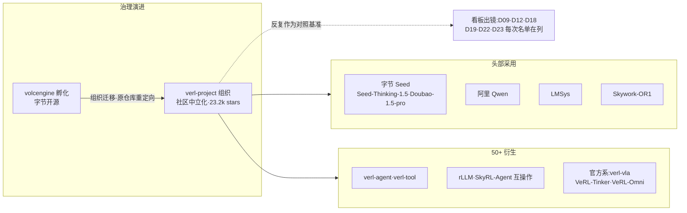
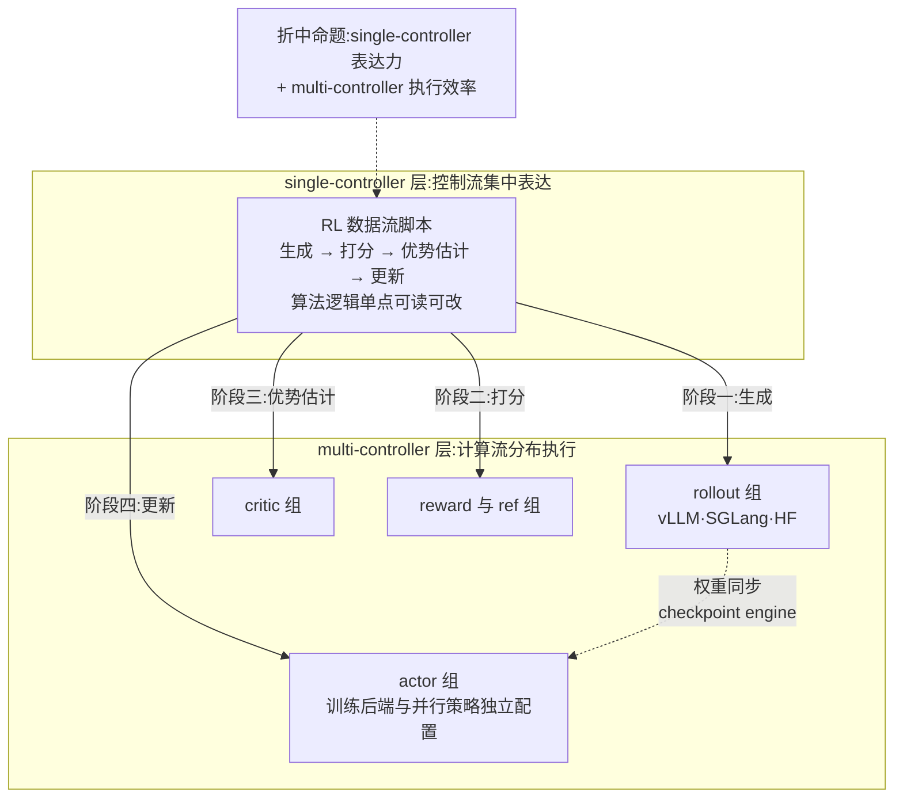
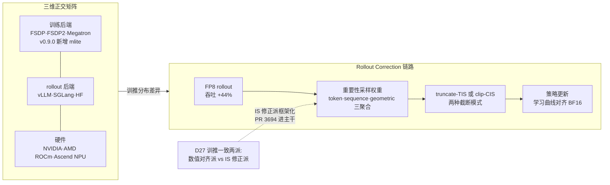
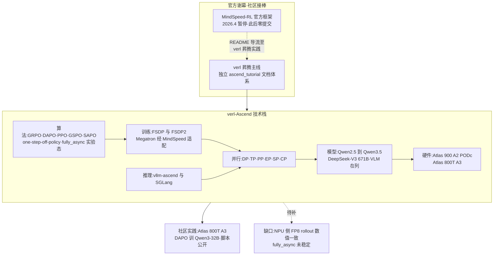

# Dispatch 33 · 详解 verl:RL 后训练事实标准与昇腾的社区路线

*2026-08-27 · NPU Frontier Dispatch · verl / HybridFlow / RL-frameworks / RL-on-NPU*

> **TL;DR** — verl(字节 volcengine 开源,现迁移至 verl-project 组织实现社区中立化治理,Apache-2.0,23.2k stars)是 HybridFlow 论文(arXiv 2409.19256)的开源实现,已成为 RL 后训练的事实标准:训练后端 FSDP/FSDP2/Megatron × rollout vLLM/SGLang/HF × 硬件 NVIDIA/AMD/昇腾的三维矩阵,算法覆盖 PPO/GRPO/DAPO/GSPO 等,50+ 社区衍生,Seed/Qwen/LMSys 头部采用。v0.9.0(2026-08-14)落地 DeepSeek-V4 GRPO 端到端、delta sharded checkpoint engine(较全量 NCCL broadcast 提速 2.4×)与 V1 PPO trainer;TIS 进主干把 D27 的 IS 修正派框架化。昇腾侧:独立文档体系、模型支持到 DeepSeek-V3 671B、六种并行齐备——在 MindSpeed-RL 谢幕(D32)后,verl-Ascend 成为昇腾 RL 的社区主线。

本篇性质:框架详解篇,与 D32 成对——D32 记录官方谢幕(MindSpeed-RL 2026.4 暂停维护),本篇记录社区接棒(verl 昇腾支持的成熟度盘点)。MindSpeed-RL 的 README 亲自导流至 verl 昇腾实践,官方与社区完成了一次罕见的显式交接。

---

## 1 · 事实标准的形成

verl 的"事实标准"地位由四组事实支撑,任何一组单独看都不充分,合在一起构成完整证据链:

**规模与治理**。23.2k stars,Apache-2.0;更关键的是 2026 年从 volcengine 迁移至独立的 **verl-project** 组织(volcengine/verl 重定向),治理层面完成社区中立化——这与 vLLM/PyTorch 等基础设施项目的路径一致:单厂商孵化、中立组织托管,是"事实标准"从社区认知固化为治理结构的标志。

**头部采用**。字节 Seed、阿里 Qwen、LMSys 均为直接用户;训出的模型包括 Seed-Thinking-1.5、Doubao-1.5-pro、Skywork-OR1——采用方横跨大厂旗舰与开源推理模型。

**衍生生态**。50+ 社区衍生项目:rLLM(D22,可插拔后端含 verl)、SkyRL-Agent(D18,与 verl 互操作)、verl-agent 的 GiGPO、verl-tool(D12)等;官方系新增 verl-vla v0.1.0(VLA 后训练)、VeRL-Tinker、VeRL-Omni v0.2.0。

**看板出镜率**。本看板从 D09 到 D23 的每一次框架名单,verl 都在:D09"只有 Megatron 系能正确做 EP"名单在列;D12 衍生生态;D18 互操作对象;D19 slime 生态位表中 verl 被标注为"最广用、引擎中立";D22 rLLM 后端;D23 玩家矩阵中横跨多问题域。一个框架反复以"被对照的基准"身份出现,这本身即是事实标准的操作性定义。

### 图 A · verl 生态位:从单厂商项目到中立治理平台

## 2 · HybridFlow 编程模型

verl 区别于脚本式 RL 框架的根本,在于它对问题的定义:RL 后训练不是"一个训练循环",而是 **actor/critic/reward/ref 多模型的复杂数据流**。PPO 一步涉及四个模型的生成、打分、优势估计与更新,各模型的并行策略、显存占用、计算特征互不相同;把这套数据流写死在一份脚本里,意味着每换一次算法或并行配置都要重写调度逻辑。

HybridFlow(arXiv 2409.19256)给出的答案是 **hybrid-controller 编程模型**,它是两种既有范式的折中:

- **single-controller**:控制流集中在单点表达,数据流写起来像单机代码,表达力强——但把所有分发决策集中到一个控制器,大规模下调度开销不可接受;
- **multi-controller**:每个 worker 自带控制逻辑,执行效率高——但多模型数据流的全局逻辑被打散到各处,算法迭代成本高。

hybrid-controller 的拆分是:**控制流集中表达、计算流分布执行**。算法作者在单控制器视角下描述"generate → reward → advantage → update"的数据流,框架把每个阶段编译为分布式 worker group 上的多控制器执行;并行策略(每个模型各自的 TP/PP/DP 配置)、模型放置(colocate 或分离)成为配置项而非代码结构。这解释了 verl 的两个表征:算法覆盖可以快速扩张(PPO/GRPO/DAPO/GSPO/ReMax/RLOO/PRIME/DrGRPO 等,新算法只需改控制流),后端矩阵可以正交扩张(训练与 rollout 后端独立替换,不触碰算法层)。

### 图 B · hybrid-controller:控制流与计算流的拆分

## 3 · 后端矩阵与算法覆盖

verl 的能力面是一个三维矩阵:

| 维度 | 覆盖 |
|---|---|
| 训练后端 | FSDP / FSDP2 / Megatron;v0.9.0 新增 **Megatron Lite(mlite)**,支持 DeepSeek-V4/GLM-5/Kimi,附 256 卡 GRPO launcher |
| rollout 后端 | vLLM / SGLang / HF |
| 硬件 | NVIDIA + AMD ROCm + Ascend NPU |

算法层:PPO、GRPO、DAPO、GSPO、ReMax、RLOO、PRIME、DrGRPO 等;工程特性含 async rollout、多轮 agentic + tool calling、LoRA、Ulysses SP、EP 扩展到 671B、VLM 支持。

**v0.9.0(2026-08-14)** 的四个亮点:

1. **DeepSeek-V4 GRPO 端到端**:Megatron-Bridge + vLLM rollout + FP8/MXFP4 权重传输,把 D05 记录的旗舰 MoE 纳入开源 RL 可训练范围;
2. **delta sharded checkpoint engine**:训推权重同步只传增量分片,Qwen2.5-7B 上较全量 NCCL broadcast 提速 2.4×——权重同步是 D02 rollout 瓶颈分析中的固定开销项,此处直接削减;
3. **V1 PPO trainer 转默认**:统一 sync / colocate_async / separate_async 三种执行模式于同一 trainer 抽象;
4. Muon 优化器与 vLLM rollout 全确定性复现。

**TIS 进主干是本节最值得展开的一条**。D27 曾把训推一致性问题划为两派:数值对齐派(让 rollout 与训练的数值严格一致)与 IS 修正派(承认分布差异、用 importance sampling 加权修正)。PR #3694 把后者框架化:rollout importance sampling 提供 **token / sequence / geometric 三种聚合 × truncate-TIS / clip-CIS 两种模式**的组合空间,并配专门文档页 Rollout Correction。生产验证已经就位:FP8 rollout + token 级 TIS 是 Qwen3 级 GRPO 的生产实践——rollout 吞吐 +44%,学习曲线与 BF16 对齐。结论:IS 修正派从论文技巧变成了框架内建能力,低精度 rollout 的收益可以在不牺牲收敛的前提下兑现。

### 图 C · 三维后端矩阵与 TIS 修正链路

## 4 · 生态平台:衍生层比核心更能说明平台地位

判断一个框架是"工具"还是"平台",标准不在其自身功能,而在多少项目选择在它之上构建。verl 的衍生层给出的答案:

| 层 | 项目 | 说明 |
|---|---|---|
| 社区衍生 | verl-agent(GiGPO)、verl-tool | D12 记录的 agentic 衍生,补 agent 训练与工具调用 |
| 互操作 | SkyRL-Agent、rLLM | D18/D22:两个独立框架都把 verl 列为可插拔或可互操作后端 |
| 官方扩展 | verl-vla v0.1.0、VeRL-Tinker、VeRL-Omni v0.2.0 | VLA 后训练、轻量微调、全模态,官方以子项目而非主干膨胀的方式扩张 |

三层结构各有含义。社区衍生说明核心抽象可扩展——verl-agent/verl-tool 没有 fork 重写,而是在 hybrid-controller 之上加层。互操作说明中立性被同行承认——D19 slime 生态位表将 verl 标注为"最广用、引擎中立",竞争框架把它当作事实接口而非对手。官方扩展说明主干纪律——VLA、全模态这类边界扩张放在子项目里,核心保持 LLM RL 后训练的聚焦。50+ 衍生的总量意味着:即使 verl 主干停止演进,其接口约定也已经成为社区资产。这是脚本式框架(无论多快)结构上无法达到的位置。

## 5 · verl-on-Ascend:昇腾支持成熟度盘点

本节是全篇核心,与 D32 直接成对。逐项盘点:

**文档体系**。独立的 docs/ascend_tutorial 目录:get_start / model_support / feature_support / dev_guide / faq 五件套,含**精度对齐与性能调优专章**。判断依据:文档结构是支持成熟度的先行指标——精度对齐专章的存在说明维护者面对过 NPU 数值差异的真实问题,而非仅跑通 demo。

**算法**。GRPO / DAPO / PPO / GSPO / SAPO + one-step-off-policy + fully_async(实验态)。主流算法全覆盖,前沿执行模式已进入但未稳定。

**模型**。Qwen2.5(7B/32B)、Qwen2.5-VL、Qwen3(1.7B-235B)、Qwen3-VL、Qwen3-Next-80B、Qwen3.5(27B/35B/122B)、**DeepSeek-V3 671B**。覆盖从 1.7B 到 671B,含 VLM 与新架构(Qwen3-Next 的混合注意力)。

**后端与并行**。训练 FSDP/FSDP2 + Megatron(经 MindSpeed 适配);推理 vLLM(vllm-ascend)+ SGLang;并行 DP/TP/PP/EP/SP/CP 六种齐备——对照 D09 的"只有 Megatron 系能正确做 EP",EP 在昇腾侧同样经 MindSpeed-Megatron 路径可用。

**硬件与社区实践**。Atlas 900 A2 PODc 与 800T A3;社区侧已有开发者在 Atlas 800T A3 用 verl + DAPO 完成 Qwen3-32B RL 并公开脚本——非官方、可复现的第三方实践,是支持成熟度的最强证据。

**与 D32 的接棒关系**。MindSpeed-RL(昇腾官方 RL 框架)2026 年 4 月暂停、05-20 后零提交,README 亲自导流至 verl 昇腾实践。注意 MindSpeed 本体并未退场:verl 的昇腾 Megatron 路径正是经 MindSpeed 适配——官方从"自建 RL 框架"退到"为社区框架供适配层",这是比谢幕本身更准确的描述。

**仍缺什么**。其一,FP8 rollout + TIS 的生产实践目前是 GPU 侧结论,NPU 上的 FP8 rollout 数值一致性未见对应验证;其二,fully_async 仍标注实验态;其三,一等公民支持的持续性依赖 vllm-ascend 与 MindSpeed 两条外部适配链的维护节奏。

### 图 D · verl-Ascend 技术栈与 MindSpeed-RL 交接

## 6 · 选型与对看板结论的更新

**选型三分法**:

- **要生态与算法覆盖**:选 verl——三维后端矩阵、最全算法面、50+ 衍生兜底,任何非标需求大概率已有衍生项目;
- **要 SGLang 原生的生产验证路径**:选 slime(D19)——生态位是 SGLang 深度绑定的生产框架,与 verl 的引擎中立定位互补而非竞争;
- **要学术全开放可复现**:选 open-instruct——D31 记录 OlmoRL 用 open-instruct 而非 verl 完成 1024 卡 RLVR,学术侧存在独立于 verl 的完整选择。

**对看板既有结论的更新**:

1. **D13 昇腾 SWE-RL 方案的 trainer 选型正式更新**:主线为 verl-Ascend——文档体系、671B 模型覆盖、六并行、第三方公开实践四项证据均已到位,MindSpeed-RL 路线随 D32 关闭;
2. **D27 训推一致性两派的裁决推进一步**:IS 修正派获得框架主干地位(TIS 进 verl 主干 + FP8 rollout 生产实践),数值对齐派仍是必要基础(verl 同时提供 vLLM rollout 全确定性复现),两派在同一框架内共存而非互斥;
3. **D19 生态位表维持有效**:verl"最广用、引擎中立"的标注在组织中立化与 v0.9.0 之后进一步强化。

## 下一步看什么

1. **NPU 侧 FP8 rollout + TIS 的首个公开复现**:谁先在 Atlas 硬件上给出学习曲线对齐 BF16 的证据,昇腾 RL 的性价比论证即告闭环;
2. **fully_async 在昇腾从实验态转正的时点**:异步执行模式对 rollout 长尾(D02)的收益在 NPU 上能否复现;
3. **verl-project 中立治理下的多厂商提交比例**:昇腾/AMD 路径的 commit 是否由硬件厂商工程师持续供给,决定"一等公民"承诺的可持续性。

---

**来源**:verl 仓库(verl-project 组织)与 docs/ascend_tutorial 目录、HybridFlow 论文 arXiv 2409.19256、v0.9.0 release notes(2026-08-14)、PR #3694 与 Rollout Correction 文档页、MindSpeed-RL README、本看板 D09/D12/D13/D18/D19/D22/D23/D27/D31/D32。

*Provisional 声明:本篇数字(stars、提速倍数、吞吐增益、模型支持列表)以写作当日仓库与 release notes 为准,快速演进中随时可能过时;昇腾社区实践为第三方公开脚本,未经本看板独立复跑;fully_async 等实验态特性的结论不构成生产建议。*
