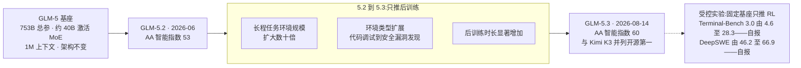
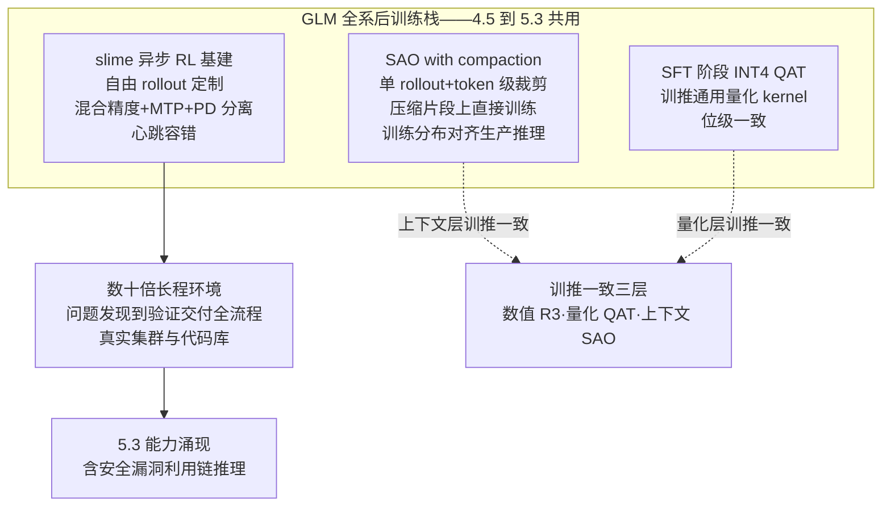
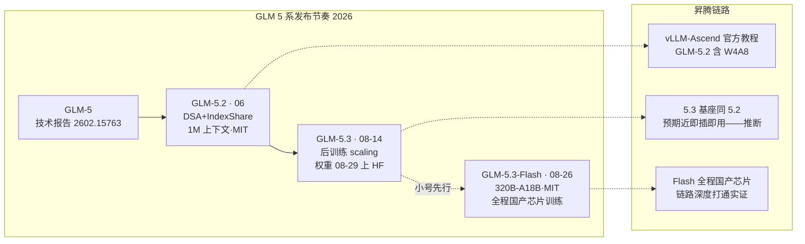

# Dispatch 34 · GLM-5.2 到 5.3:同一基座上的后训练 scaling 范本

*2026-08-28 · NPU Frontier Dispatch · GLM-5.3 / GLM-5.2 / post-training-scaling / slime / RL-on-NPU*

> **TL;DR** — GLM-5.3(智谱/Z.ai,2026-08-14)是"后训练 scaling"叙事目前最干净的样本:**基座与 GLM-5.2 一字不动**(753B 总参 / 约 40B 激活 MoE,1M 上下文),全部能力提升来自 RL——长程任务环境规模扩大数十倍、环境类型从代码调试扩到安全漏洞发现、后训练时长显著增加。第三方 Artificial Analysis 智能指数由 5.2 的 53 升至 **60,与 Kimi K3 并列开源第一**(独立评分)。训练栈是 GLM 全系共用的 slime(异步 RL)+ SAO with compaction(在压缩片段上直接训练,使训练分布对齐生产推理分布)+ IndexShare(每 4 层稀疏注意力共享 indexer,1M 下 per-token FLOPs 降 2.9×)+ SFT 阶段 INT4 QAT 位级一致 kernel。网络安全为差异化主打(自报 2436 漏洞账本,仅约 2% 公开、累计口径)。**权重已落地 HF**([zai-org/GLM-5.3](https://huggingface.co/zai-org/GLM-5.3),见文末跟进);先行开源的 GLM-5.3-Flash(320B-A18B,MIT)自称全程在国产芯片训练。

本篇性质:两代对照详解(D06 已深挖 GLM-5.2 的 DSA+IndexShare+effort level,本篇重点是 5.2→5.3 演进与后训练 scaling 方法),承接 D19(slime)、D22(SAO 单 rollout)、D27(INT4 QAT 训推一致)、D30(自报分待第三方复现)、D33(verl 对照)。

---

## 1 · 一个反常规的发布:基座不动

工业旗舰的迭代通常伴随基座重训——更大参数、新架构、更多预训练 token。GLM-5.3 的反常之处在于:**它与 6 月发布的 GLM-5.2 共用同一基座**(GLM-5 系技术报告《From Vibe Coding to Agentic Engineering》,[arXiv:2602.15763](https://arxiv.org/abs/2602.15763);家族 744B 总参 / 约 40B 激活,5.2 已把上下文由 200K 扩到 1,048,576)。官方文档明确表述:5.3 相对 5.2 的**全部能力提升来自后训练 scaling**,基座架构无变化。

这使 GLM-5.3 成为一次难得的受控实验:固定基座、只推 RL,能提升多少?厂商自报的答案是——Terminal-Bench 3.0 由 4.6 跃至 **28.3**、DeepSWE v1.1 由 46.2 升至 **66.9**、SWE-Marathon v1.1 由 19.4 升至 **42.5**;第三方 Artificial Analysis 智能指数由 5.2 的 53 独立评为 **60**,与 Kimi K3 并列开源第一(Claude Opus 5 以 63 领跑)。

这个叙事与本看板 D25 的判断直接相关:D25 论证 SFT+在线 RLVR 主干已成熟,增量在后训练配方与基建。GLM-5.3 是该判断的旗舰级实证——**在能力竞争已从基座规模转向后训练的阶段,同一基座的后训练 scaling 可以把一款模型从中游推到开源第一梯队**。

### 图 A · 后训练 scaling:固定基座的受控提升

## 2 · 训练栈:slime 全系共用与 SAO

GLM 的后训练能力建立在一套自研且开源的 RL 栈上,GLM-4.5 至 5.3 全系共用([slime](https://github.com/THUDM/slime),D19 已深挖其 SGLang 原生架构)。5.3 沿用为 5.2 建立的三件套:

**① slime——异步 RL 基建。** 自由形式 rollout 定制 + server-based 执行模型广化任务覆盖;混合精度训练/rollout + MTP + Prefill-Decode 分离显著提升多轮 RL 吞吐;心跳驱动的 rollout 容错 + router 级服务生命周期管理提升鲁棒性。slime 提供的灵活 rollout 接口(多轮交互循环、工具调用、环境反馈、verifier 引导分支)正是"数十倍长程环境"得以工程化的底座。

**② SAO with compaction——上下文层的训推一致。** SAO(单 rollout 采样 + token 级裁剪,D22 记录过其"单 rollout + value model"设计)解决异步 RL 的 off-policy 稳定性;compaction 的关键在于**直接在压缩后的片段上训练**——长程 agent 轨迹在多小时会话中会出现上下文退化与重复推理循环,compaction 防止状态爆炸,更重要的是**使 critic 的价值地形与真实 serving 约束对齐,让训练分布贴近生产推理分布**。这是"训推一致"在上下文管理层的体现:与 D27 讨论的数值层训推一致(R3 路由回放、位级一致 kernel)是同一原则在不同层的应用。

**③ INT4 QAT 位级一致 kernel。** SFT 阶段引入 INT4 QAT,配套训练与离线量化通用的量化 kernel,保证训推 bitwise 一致(D27 记录过这是"量化层训推一致"的工业级样本)。5.3 延续该路线。

### 图 B · GLM 后训练三件套

## 3 · 环境工程:从编程题到"数天工作量"

后训练 scaling 的实质是环境工程。5.3 的训练任务从孤立编程题扩展为**完整工程流程**——问题发现 → 方案分析 → 实现 → 验证 → 交付,部分任务相当于资深工程师数天工作量,要求模型使用真实计算集群、存储系统、内部文档与代码库(厂商自报)。环境合成管线:研究型 agent 从真实工程工作中收集模式,生成可运行的多步带隐藏状态环境;judge agent 先行试解以确认可解性——这与 D23 圈定的"环境与奖励工程"问题域、D30 讨论的"可验证性"直接相关:环境的可解性预筛正是防止不可验证任务污染 RL 信号的工程手段。

**effort level 的演进。** D06 记录过 GLM-5.2 的 effort level 模型内路由;5.3 的变化是**强制开启 thinking**(不再允许 disabled),提供 low/high/max 三档、默认 max、编程推荐 max。这个产品化决定与 D29/D30 的"harness 即分数"呼应:官方评测在 max effort 下测得,effort 档位本身是分数口径的一部分。

## 4 · 网络安全:差异化主打与"能力即风险"

5.3 的差异化主张是网络安全能力:自报 CyberGym 由 5.2 的 77.2% 升至 **84.5%**(超 Claude Mythos 5 83.8%、GPT-5.6 Sol 83.6%)。官方公开一份漏洞账本(cvd.z.ai):累计发现 **2,436 个真实漏洞、覆盖 269 个开源项目**,其中 1,097 个中高危,最老漏洞 1981 年引入、平均潜伏 26.6 年。第三方核查([kingy.ai](https://kingy.ai/blog/glm-5-3-open-weight-cybersecurity-vulnerability-claim/))抽样与 MITRE 对得上(FreeBSD/红帽 CVE 有署名),但需要三点保留:**仅约 53 条(2%)已公开、计数是自 5.2 起累计、CyberGym 数字为自跑未独立复现**。

官方叙事称漏洞利用链推理是规模化后训练的**涌现**而非定向目标——这与两周的安全评估延期(权重延后放出)互为表里,构成一次少见的"能力即风险"公开演练。对本看板的意义在于:D30 讨论的"评测即测量诚实性"在安全能力上尤其尖锐——一个自报数字既是能力证明也是风险声明,第三方复现的缺位使其无法定级。

## 5 · 昇腾适配与国产芯片信号

GLM 系在昇腾的适配已成体系(D06 语境中"GLM 适配昇腾曾是高成本人工适配",现已大幅前进):

- **GLM-5.2 有官方 vLLM-Ascend 教程**([GLM5.2 部署页](https://docs.vllm.ai/projects/ascend/zh-cn/main/tutorials/models/GLM5.2.html)),含 W4A8 量化版(GLM-5.2-w4a8c8);GLM-5/5.1 教程与已知问题(EP+FULL graph 冲突、W4A8 MC2 精度)也已文档化。
- **GLM-5.3 权重已放出**(见文末跟进),vLLM-Ascend 尚无 5.3 专门条目;因基座与 5.2 完全相同,预期近乎即插即用(合理推断,官方未明说)。
- **最强信号来自 GLM-5.3-Flash**:320B-A18B、原生多模态、1M 上下文(此前匿名跑分的 "Ox Alpha"),已于 08-26 以 **MIT 许可**先行开源,官方强调其**完全在国产 AI 芯片上训练与运行**。这是智谱-昇腾链路深度打通的公开实证——与 D21(LongCat 全国产训练)、D31(OLMo 的 open-instruct 昇腾移植空白)对照,GLM-5.3-Flash 是"国产芯片全流程训练 + MIT 开源"的又一样本。

### 图 C · GLM 系发布节奏与昇腾链路

## 6 · 综合判断与对看板结论的更新

**GLM-5.3 是后训练 scaling 的旗舰级实证。** 固定基座、只推 RL,把 AA 智能指数拉升 7 分至开源并列第一——这为 D25"主干成熟、增量在后训练配方与基建"提供了最有力的单点证据。方法的可复用性由 slime 全系共用 + 开源保证,与 D31 的 OlmoRL 构成"工业异步 RL 栈(slime)"与"学术全开放 RL 栈(open-instruct)"的两个公开参考。

对看板结论的三点更新:

1. **D06 更新**:GLM-5.2 专篇可补 5.3 的"同基座后训练"续章;IndexShare/INT4 QAT 在 5.3 延续,SAO with compaction 补入"上下文层训推一致",与 D27 的数值/量化两层合成完整的三层训推一致图景。
2. **D27/D33 印证**:INT4 QAT 位级一致(量化层)、SAO(上下文层)、R3 路由回放(数值层)——GLM 系是训推一致三层解法在单一厂商栈内全部落地的样本;而 verl(D33)在框架层把 TIS 做成 IS 修正派的通用件,两者是"专用栈内建"与"通用框架件"的对照。
3. **D30 印证**:5.3 的自报跑分(Terminal-Bench 3.0 跳变、CyberGym 84.5)与网络安全账本均待第三方统一 harness 复跑——正是 ideas.json"国产模型自报分第三方复跑"卡的新增对象;权重已落地,复现窗口开启。

诚实边界:除 AA 智能指数 60 为独立评分外,本篇 GLM-5.3 的能力数字均为厂商自报;昇腾即插即用为推断。

## 下一步看什么

1. **第三方复现**:权重已上 HF(见跟进),Terminal-Bench 3.0/DeepSWE 的跳变幅度与 CyberGym 84.5 能否被独立 harness 复现——后训练 scaling 叙事的真伪检验点。
2. **SAO with compaction 的论文级披露**:上下文层训推一致的机理若有独立论文,值得与 D27 数值层、D22 单 rollout 合并深挖。
3. **GLM-5.3-Flash 的国产芯片训练细节**:320B 全程国产训练若有系统披露,是继 LongCat(D21)后的又一全国产训练样本。
4. **effort level 强制 thinking 的评测口径影响**:默认 max 对成本-能力帕累托(D30 成本轴)的影响。

## 跟进(2026-08-31)

**权重已落地。** [zai-org/GLM-5.3](https://huggingface.co/zai-org/GLM-5.3) 与 [zai-org/GLM-5.3-Flash](https://huggingface.co/zai-org/GLM-5.3-Flash) 均已上线 HF,官方兑现"安全评估后开源"承诺。两点更新:其一,本篇"权重延期"相关表述已随之修订,第三方复现窗口正式开启——Terminal-Bench 3.0 跳变、CyberGym 84.5、漏洞账本三项自报数字进入可复跑状态;其二,Flash 模型卡确认为 GLM-5 系**首个原生多模态**成员(320B-A18B,MIT),官方表述其编程与 agentic 能力接近 Claude Opus 4.8——该对标为自报口径,同样待独立 harness 校验。昇腾侧 vLLM-Ascend 的 5.3 专门适配条目仍待观察。

---

**来源与声明**:主循环调研 + 定向补充(2026-08-28)。主要来源:[GLM-5 技术报告 arXiv 2602.15763](https://arxiv.org/abs/2602.15763)、[Z.ai GLM-5.3 文档](https://docs.z.ai/guides/llm/glm-5.3)、[slime](https://github.com/THUDM/slime)、[Artificial Analysis GLM-5.3](https://artificialanalysis.ai/models/glm-5-3)、[Unite.AI 智能指数报道](https://www.unite.ai/glm-5-3-scores-60-on-artificial-analysis-intelligence-index-matching-kimi-k3/)、[vLLM-Ascend GLM5.2 教程](https://docs.vllm.ai/projects/ascend/zh-cn/main/tutorials/models/GLM5.2.html)、[LMSYS INT4 QAT 实践](https://www.lmsys.org/blog/2026-01-26-int4-qat/)、[kingy.ai 漏洞账本核查](https://kingy.ai/blog/glm-5-3-open-weight-cybersecurity-vulnerability-claim/) 等,文中逐处标注。除 AA 智能指数 60 为第三方独立评分外,GLM-5.3 的 benchmark 与漏洞账本均为厂商自报(provisional);权重已于 08-29 前后上线 HF(跟进段);昇腾即插即用与两代对照的部分归因为本看板推断。
