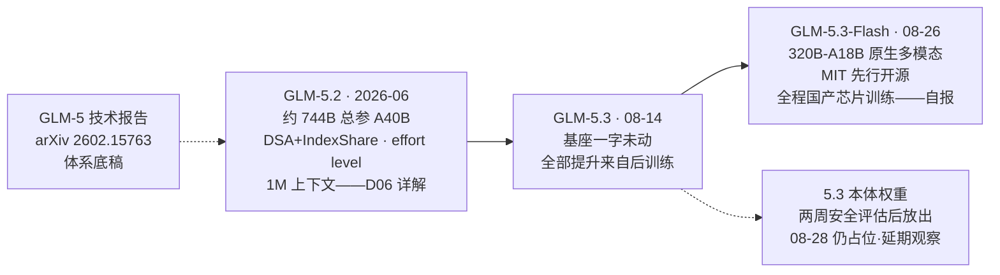

# Dispatch 34 · 详解 GLM-5.2 与 5.3:同一基座上的后训练 scaling

*2026-08-28 · NPU Frontier Dispatch · GLM-5.3 / GLM-5.2 / post-training-scaling / slime / RL-on-NPU*

> **TL;DR** — GLM-5.3(2026-08-14)是"后训练 scaling"迄今最干净的样本:基座与 5.2 完全相同(约 744B/A40B,GLM-5 报告 arXiv 2602.15763),全部提升来自 RL——长程环境规模扩大数十倍、类型从代码调试扩展到漏洞发现与系统工程,Terminal-Bench 3.0 由 4.6 升至 28.3、DeepSWE 46.2→66.9(自报);Artificial Analysis 独立评分 60,较 5.2 的 53 升 7 分,与 Kimi K3 并列开源第一。训练系统三件套:slime 异步基建、SAO 单 rollout 优化 + compaction(在压缩片段上训练使训练分布对齐生产推理分布——上下文层面的训推一致)、INT4 QAT 位级一致 kernel。网络安全为差异化主打(自报累计发现 2,436 个真实漏洞);权重延期至约 08-29,而 GLM-5.3-Flash(320B-A18B 原生多模态)已于 08-26 以 MIT 先行开源并声明全程在国产 AI 芯片上训练运行。

本篇性质:两代深度调研(1 路 sub-agent + 主循环多轮检索),承接 D06(GLM-5.2 首发详解:DSA+IndexShare/effort level)、D19(slime)、D23(训推一致三层)、D25(效率视角)、D29/D30(自报分纪律),并与月度扫描的 DeepSeek V4-Flash-0731 构成"后训练 scaling"趋势的对照样本。

---

## 1 · 版本线与事实清单

| 时点 | 事件 |
|---|---|
| 2026-06 | GLM-5.2 发布(D06 详解):DSA+IndexShare、effort level、1M 上下文 |
| 2026-02(报告) | GLM-5 技术报告[《From Vibe Coding to Agentic Engineering》](https://arxiv.org/abs/2602.15763):家族约 744B 总参/约 40B 激活,上下文 200K→1,048,576 |
| 2026-08-14 | **GLM-5.3 发布**:基座与 5.2 相同,纯后训练升级;API 计量 08-18 起 |
| 2026-08-26 | **GLM-5.3-Flash 先行开源**(MIT):320B-A18B、原生多模态、1M 上下文,即此前匿名跑分的 "Ox Alpha";官方声明**全程在国产 AI 芯片上训练与运行** |
| 2026-08-28 | 5.3 本体权重仍为 HF 占位页(原承诺两周安全评估后放出);官方称次日发布——延期观察中 |

版本命名澄清:7 月社区流传的"GLM-5.5 超 1T 参数"传闻未兑现,实际落地为同基座的 5.3;规模未变。

### 图 A · 两代版本线与发布状态

## 2 · 基座冻结的后训练 scaling

GLM-5.3 的实验设计价值在于变量唯一:**基座、架构、规模全部冻结,唯一变量是后训练**。官方口径的三个放大方向:

1. **规模**:长程任务环境扩大数十倍,覆盖时间跨度更长的真实工程任务;
2. **类型**:从孤立