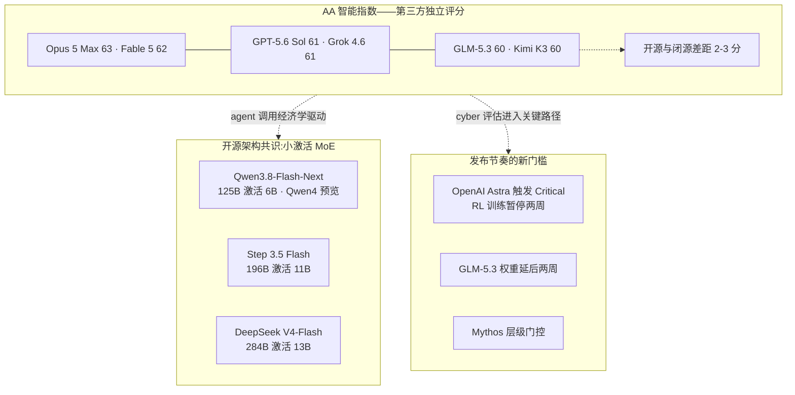
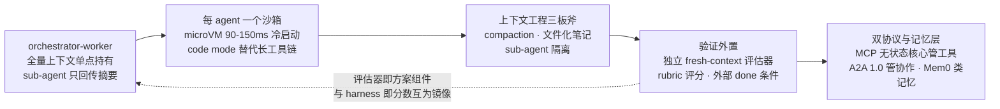
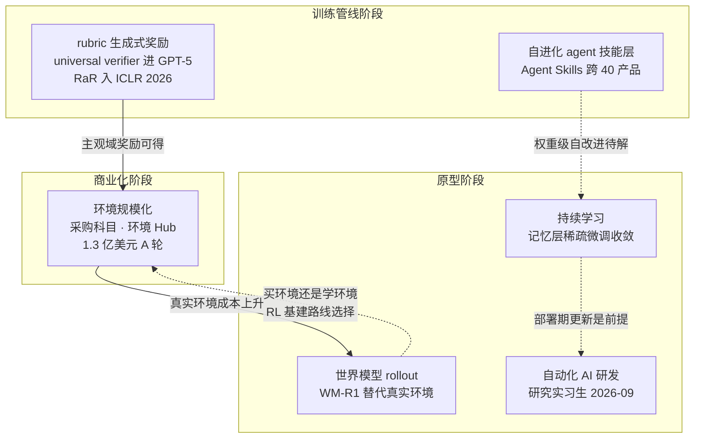

# Dispatch 35 · 前沿全景扫描:模型分数收敛、Agent 方案定型与六个提前布局方向

*2026-09-01 · NPU Frontier Dispatch · frontier-models / agent-stack / research-directions / RL-environments*

> **TL;DR** — 三条主线。**其一,旗舰智能分数收敛**:Artificial Analysis 指数(第三方)上,Claude Opus 5 Max 63、Claude Fable 5 62、GPT-5.6 Sol 61、Grok 4.6 61、GLM-5.3 与 Kimi K3 各 60——闭源与开源权重的差距压缩到 2-3 分;开源侧的架构共识转向**小激活 MoE**(Qwen3.8-Flash-Next 125B 仅激活 6B、Step 3.5 Flash 196B/11B、DeepSeek V4-Flash 284B/13B),网络安全能力成为发布节奏的决定因素(OpenAI Astra 首次触发 Critical 分级并暂停 RL 训练两周)。**其二,生产级 agent 方案定型**:orchestrator-worker 编排(连提出"不要做多 agent"的 Cognition 也转向)、每 agent 一个 microVM 沙箱、上下文工程三板斧(compaction/文件化笔记/sub-agent 隔离)、验证外置(独立 fresh-context 评估 agent)、MCP 无状态核心(2026-07-28 版)+ A2A 1.0 双协议。**其三,提前布局方向按证据密度排名**:RL 环境规模化(已是采购科目,Prime Intellect A 轮 1.3 亿美元)> 自进化 agent > rubric/生成式奖励 RL(已进 GPT-5 训练管线)> 世界模型×agent(WM-R1 用世界模型替代真实环境做 rollout)> 持续学习 > 自动化 AI 研发(OpenAI 官方时间表:2026-09 前"研究实习生")。

本篇性质:横向全景扫描(多 agent 并行调研汇总),为看板换季校准坐标——承接 D23(难题地图)、D25(效率感知 RL 定位)、D26(推理效率大颗粒)、D30(评测方法学)、D34(后训练 scaling)。

---

## 1 · 模型侧:分数收敛与三个结构性信号

**旗舰梯队(AA 智能指数,第三方独立评分)**:Claude Opus 5 Max 63 > Claude Fable 5 62 > GPT-5.6 Sol / Grok 4.6 各 61 > GLM-5.3 / Kimi K3 各 60 > Gemini 3.7 Flash 56。开源权重与闭源旗舰的指数差已收窄到 2-3 分——一年前这个差距普遍在 10 分以上。三个结构性信号:

**信号一:小激活 MoE 成为开源架构共识。** [Qwen3.8-Flash-Next](https://www.ithome.com/0/994/735.htm)(08-26)125B 总参每 token 仅激活 6B(另 51B n-gram 嵌入),官方定位 **Qwen4 架构预览**,自报训练成本约前代 1/9;此前 [Step 3.5 Flash](https://github.com/stepfun-ai/Step-3.5-Flash)(196B/11B,3:1 滑窗:全注意力 + MTP-3)、DeepSeek V4-Flash(284B/13B)已验证同一配方。总参上探 2-3T(K3 2.8T、Qwen3.8-Max 2.4T)与激活压到 6-13B 同时发生——**"总参做大、激活做小"是 agent 高频调用经济学的直接产物**,与 D26 推理效率主线同源。

**信号二:网络安全能力决定发布节奏。** OpenAI [Astra](https://openai.com/index/responding-next-frontier-critical-cyber-capabilities/)(下一代旗舰,未发布)被官方声明"无法排除已达 Preparedness Framework 的 Critical cyber 阈值"——首例——并为此暂停 RL 训练两周;Anthropic 以 Mythos 层级 + Glasswing 联盟对高危能力做门控;Z.ai 因 cyber 能力超预期把 GLM-5.3 权重延后两周(D34)。**cyber 评估已从合规脚注变成发布关键路径**,这与 D34"能力即风险"的判断在三家实验室同时得到印证。

**信号三:开放光谱碎片化与 Meta 回归。** MIT(DeepSeek)与 Apache 2.0(Meta [Muse Glimmer](https://www.infoq.com/news/2026/08/meta-muse-glimmer/),30B 稠密多模态端侧模型——Llama 线搁置后 Meta 重返开源)之外,收入/MAU 门槛型自定义许可扩散(Kimi K3 License、Qwen Community、MiniMax Community)。Meta 的姿态标注了新位置:**旗舰闭源(Muse Spark)+ 端侧开源(Glimmer)的分层开放**,与 D31 记录的 OLMo 全开放构成光谱两端。

### 图 A · 2026 秋旗舰格局:分数收敛与架构分层

## 2 · Agent 方案:生产配方已定型

一年的分歧在 2026 年中收敛为一套可复述的配方,五个要件:

**① 编排定型为 orchestrator-worker。** 单一 orchestrator 持有全量上下文,派生**隔离、短生命周期的 sub-agent,只回传压缩摘要**。标志性事件是共识翻转:2025-06 发表《Don't Build Multi-Agents》的 Cognition,2026 年自己上线了 ["Devin 管理 Devin"](https://agentmarketcap.ai/blog/2026/04/10/devin-parallel-sessions-multi-agent-concurrency)(协调者派生至多 10 个隔离 VM 子会话)——其理由(上下文隔离)恰是当年反对多 agent 的理由。peer-to-peer 群聊式协作在生产中被放弃;fan-out 仅用于可并行、可验证的任务。

**② 每 agent 一个沙箱。** Firecracker microVM(E2B 约 150ms 冷启动)/gVisor(Daytona 约 90ms)成为默认前提;OpenAI 把沙箱与 **code mode**(agent 写代码调工具,替代长工具链)直接内置进 [Agents SDK](https://openai.com/index/the-next-evolution-of-the-agents-sdk/)。

**③ 上下文工程三板斧。** compaction、文件化笔记(progress files)、sub-agent 隔离([Anthropic 上下文工程指南](https://www.anthropic.com/engineering/effective-context-engineering-for-ai-agents));天级任务需**结构化 handoff 文件 + 全量上下文重置**,而非纯摘要压缩——这与 D34 记录的 SAO with compaction(在压缩片段上直接训练)构成推理侧与训练侧的同一原则。

**④ 验证外置。** 自评能力在长会话中退化,生产方案改用**独立 fresh-context 评估 agent**:Anthropic Managed Agents 的 Outcomes(rubric 评分器,自报困难任务 +10pp)、外部 done-condition、测试与 lint hook 作为回路。这与 D30"harness 即分数"互为镜像——**评估器也成为方案的一部分**。

**⑤ 双协议 + 独立记忆层。** [MCP 2026-07-28 版](https://blog.modelcontextprotocol.io/posts/2026-07-28/)完成最大改版:无状态核心(去掉会话握手,服务器可水平扩展)、Tasks 扩展、OAuth 硬化;[A2A 1.0](https://www.linuxfoundation.org/press/a2a-protocol-surpasses-150-organizations-lands-in-major-cloud-platforms-and-sees-enterprise-production-use-in-first-year)(Linux 基金会,150+ 组织)管跨 agent 协作,AP2 扩展做支付。记忆成为带独立基准的组件层(Mem0/Letta/Zep 或厂商内置)。

**长程能力刻度**:METR [Time Horizon 1.1](https://metr.org/blog/2026-1-29-time-horizon-1-1/)(228 任务)测得能力时限倍增周期约 89-105 天;早期 Claude Mythos Preview 的 50% 成功率时限已达 **16 小时以上**(95% CI 8.5-55h)——但套件中 16h+ 任务仅 5/228,**评测本身成为瓶颈**(与 D30 的评测方法学缺口直接相接)。

### 图 B · 生产级 agent 配方五要件

## 3 · 提前布局的六个方向(按证据密度排名)

这是本篇核心:各实验室在产品之外**提前投入**的方向,按 2026 年证据密度(论文/融资/官方时间表)排序。

**#1 RL 环境规模化——新的数据轴,已是采购科目。** [Prime Intellect A 轮 1.3 亿美元](https://www.pymnts.com/news/investment-tracker/2026/prime-intellect-raises-130-million-to-help-companies-train-ai-agents/)(ARR 超 1 亿,Environments Hub 定位"RL 环境的 Hugging Face");Anthropic 被报道讨论年投入 10 亿美元级采购 RL 环境;赛道约 50 家公司,数据标注厂商整体转型环境供应。**环境正在替代语料成为竞争性数据轴**——这直接验证 D23 圈定的"环境与奖励工程"问题域,且解释了 GLM-5.3"数十倍长程环境"(D34)的投入逻辑。

**#2 自进化 agent——技能层已产品化,权重层仍在论文。** 综述锚点 [arXiv:2607.13104](https://arxiv.org/abs/2607.13104) 把自改进形式化为对"模型参数或脚手架组件"的自诱导更新;技能自进化子赛道(SkillOS/SkillOpt/MetaSkill-Evolve)与基准 EvoAgentBench 密集出现;产业侧 Anthropic Agent Skills 成为跨产品标准(约 40 个产品互通)——Voyager 技能库思想的产品化。分界清晰:**prompt/技能/记忆级自进化已工程化,改写自身权重或源码仍是论文阶段**。

**#3 Rubric/生成式奖励 RL——已进入旗舰训练管线。** OpenAI 的 "universal verifier"(LLM 评审 LLM 的自动质检)被报道用于 GPT-5 训练,覆盖商业决策/创意写作等主观域;[Rubrics as Rewards](https://openreview.net/forum?id=c1bTcrDmt4)(RaR)入选 ICLR 2026 成为锚点,2026 年 6+ 篇直接跟进(QUBRIC、EvoRubric、Open Rubric System)。**这是 RLVR 之后最确定的路线**:把可验证域的成功范式外推到主观域;reward hacking 未解,"universal"一词含营销成分。与 D08 的 RLVR 谱系、D30 的评测有效性直接相接。

**#4 世界模型×agent——用世界模型 rollout 替代真实环境。** 资本密度最高:World Labs 新一轮 10 亿美元融资,Genie 3 进入 Waymo 生产仿真链路。对本看板最相关的是方法论转折:[WM-R1](https://arxiv.org/abs/2608.27508) 用世界模型**完全替代真实 Android 环境**做 GUI agent 的 RL rollout——若可泛化,这直接改写 D02 的 rollout 成本结构(环境交互从真实沙箱迁移到神经模拟器),也与 #1 形成替代关系:**买环境还是学环境,将成为 RL 基建的路线选择**。反向证据同样存在(agent 尚不能把世界模型当预见工具用,arXiv:2601.03905)。

**#5 持续学习/部署后更新——记忆式已产品化,权重式在收敛。** Google Nested Learning(Hope 架构,多时间尺度嵌套优化)、Meta 记忆层稀疏微调系列(遗忘率从 89% 降到 11%,arXiv:2510.15103 及两篇 2026 跟进)、JitRL(ICLR 2026,无梯度部署期适应)。前沿权重更新仍离线(评估/安全/回滚成本),但**记忆层 + 稀疏微调是最清晰的技术收敛点**;产品侧 ChatGPT/Claude 记忆与 Anthropic "dreaming"(跨会话记忆整理)已落地。

**#6 自动化 AI 研发——战略权重最高、度量刚起步。** OpenAI 官方时间表:2026-09 前交付"自主 AI 研究实习生",2028 年全自动研究员;Anthropic RSP 把"一年压缩两年进展"设为 AI R&D 阈值;1224 名前沿实验室员工联署警告自动化 AI 研究风险。证据密度低于前五,但它是各实验室公开承认的终局竞赛。

### 图 C · 六方向:成熟度阶梯与相互关系

## 4 · 对本看板的坐标校准

1. **rollout 瓶颈(D02)获得新解法轴**:除算法/调度/数值三层(D26)外,"世界模型替代真实环境"成为第四条路径;昇腾语境下,神经模拟器 rollout 把环境交互变成纯推理负载——恰是 NPU 强项,值得列入 ideas 观察。
2. **环境规模化验证 D23/D34 的投入逻辑**:环境即数据轴的商业化,意味着"长程环境工程能力"本身成为竞争壁垒;国产阵营(GLM 数十倍环境、K3 五千万 microVM 沙箱)已在同一赛道。
3. **评测瓶颈升级(D30)**:METR 套件 16h+ 任务仅 5/228,旗舰能力已顶到测量上限——"造更长的尺"(超长程评测)是比刷分更稀缺的贡献,与 D30 的时间跨度轴结论一致。
4. **训推一致原则外延**:生产 agent 的 compaction/handoff 实践与 SAO with compaction(D34)在推理侧与训练侧呼应——**上下文管理策略正在同时成为 serving 方案与训练分布的一部分**。
5. **小激活 MoE 对 NPU 的含义**:6-13B 激活的旗舰使单机 rollout 可行域大幅扩展,昇腾适配优先级应向该形态倾斜(对照 D27 低比特路线,两者叠加是推理成本的乘法)。

诚实边界:本篇为多 agent 并行调研汇总(2026-09-01),厂商能力数字除 AA 指数外均为自报;Astra 能力、Anthropic 环境采购金额、"dreaming" 增益等来自媒体报道未经独立确认;传闻类条目(GPT-5.7、DeepSeek V4.2、K3.1、MiniMax M3 Pro)均无公开证据,本篇不采信。

## 下一步看什么

1. **OpenAI "研究实习生"(2026-09 前)**:官方时间表的第一个到期节点,兑现与否直接校准自动化 AI 研发方向的置信度。
2. **Qwen4 正式版**:若沿用 Flash-Next 的小激活架构,开源旗舰的 rollout 成本画像将系统性改变。
3. **WM-R1 路线的泛化**:世界模型 rollout 从 Android GUI 扩到终端/浏览器环境的第一个复现。
4. **环境市场的整合**:约 50 家环境厂商的第一轮洗牌与头部 Hub 的标准化格式。
5. **Gemini 3.5 Pro 与 Astra 的发布方式**:两个被延期的旗舰如何处理 cyber 门槛,将定义"能力即风险"的行业默认流程。

---

**来源与声明**:三路并行 agent 调研汇总(2026-09-01):前沿模型扫描、agent 方案扫描、提前探索方向扫描;主要来源含 [Artificial Analysis](https://artificialanalysis.ai/)、[METR Time Horizon 1.1](https://metr.org/blog/2026-1-29-time-horizon-1-1/)、[MCP 改版公告](https://blog.modelcontextprotocol.io/posts/2026-07-28/)、[Linux 基金会 A2A](https://www.linuxfoundation.org/press/a2a-protocol-surpasses-150-organizations-lands-in-major-cloud-platforms-and-sees-enterprise-production-use-in-first-year)、[OpenAI Astra cyber 声明](https://openai.com/index/responding-next-frontier-critical-cyber-capabilities/)、[Prime Intellect 融资](https://www.pymnts.com/news/investment-tracker/2026/prime-intellect-raises-130-million-to-help-companies-train-ai-agents/)、[WM-R1](https://arxiv.org/abs/2608.27508)、[自改进综述](https://arxiv.org/abs/2607.13104)、[RaR](https://openreview.net/forum?id=c1bTcrDmt4)、[Anthropic 上下文工程](https://www.anthropic.com/engineering/effective-context-engineering-for-ai-agents) 等,文中逐处标注。厂商数字均为自报口径;二级媒体转述的金额与增益(环境采购、Outcomes +10pp)标注为报道而非事实。
