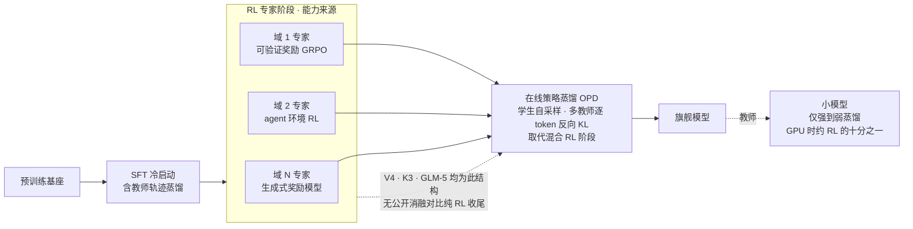
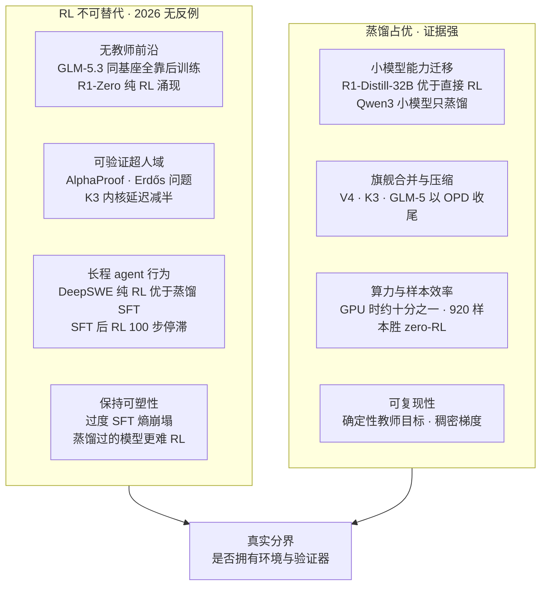
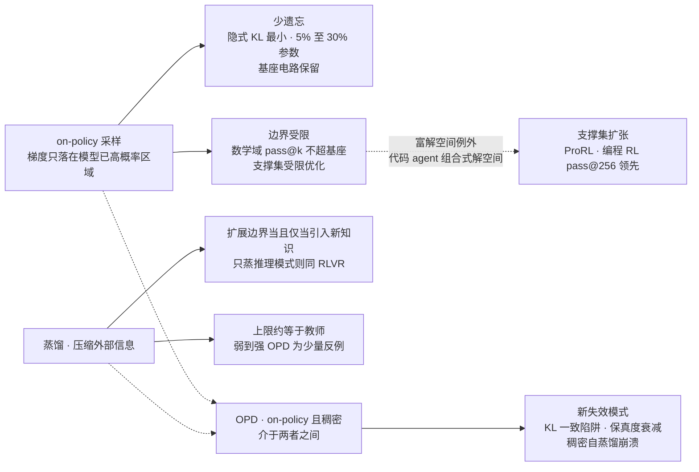

# Dispatch 38 · 蒸馏能否取代 RL:分工重组、不可替代的四个维度与真实分界

*2026-09-02 · NPU Frontier Dispatch · distillation / on-policy-distillation / RLVR / post-training-recipe / RL-on-NPU*

> **TL;DR** — 问题需要先切分:"蒸馏"在 2026 年指三件事(离线 SFT 蒸馏、在线策略蒸馏 OPD、自蒸馏),"RL"也指三件事(可验证奖励 RLVR、偏好 RLHF、离线的 DPO)。切分后答案清楚。**① 蒸馏已经取代了两种 RL**:作为旗舰最终整合阶段的混合 RL(DeepSeek-V4 用 10+ 专家教师的全词表反向 KL OPD 完全替代 V3.2 的混合 RL 阶段;K3 以 MOPD 合并 9 个 RL 专家;GLM-5 以跨阶段蒸馏收尾),以及小模型上的 RL(Qwen3 全系小模型只做强到弱蒸馏,GPU 时约为 RL 的 1/10;R1-Distill-32B 优于对同一基座直接 RL)。**② 但蒸馏没有取代作为能力来源的 RL,且 2026 年无反例**:所有前沿管线的专家阶段均为 RL;GLM-5.3 同基座全部增益来自后训练规模化;R1-Zero 纯 RL 涌现自我验证;可验证超人域(AlphaProof、Erdős 问题、K3 内核延迟减半)全部靠 RL 或搜索。**③ RL 不可替代的四个维度**:无教师前沿、可验证超人域、长程 agent 行为(DeepSWE 纯 RL 优于蒸馏 SFT,且 SFT 后 RL 100 步即停滞)、保持可塑性(过度 SFT 导致熵崩塌、"蒸馏过的模型更难 RL")。**④ 理论上是同一枚硬币**:RL 少遗忘的机制(隐式 KL 最小、仅更新 5-30% 参数)正是其能力边界受限的机制(pass@k 不超基座支撑集);蒸馏扩展能力边界当且仅当引入新知识,上限是教师(2026 年弱到强 OPD 给出少量反例)。**⑤ 真实分界不是算法而是"是否拥有环境与验证器"**——这也是蒸馏攻击争议(Anthropic 指 DeepSeek/Moonshot/MiniMax/Qwen 关联方数千万次交互)的经济本质:蒸馏可以低成本逼近,领先需要 RL 加环境。前沿配方已把两者制度化为"RL 造能力、OPD 传能力"的流水线。

本篇性质:专题调研(两路定向调研汇总),承接 D37 §4 权重回路、D34(GLM-5.3 后训练 scaling)、D24(K3 MOPD)、D31(OLMo RLVR 主干)、D36 §1(环境轴)。

---

## 1 · 先切分问题:三种蒸馏与三种 RL

"蒸馏能否取代 RL"在 2026 年不是一个问题而是九个。按对象切分:

| | 离线 SFT 蒸馏(教师轨迹→学生 SFT) | 在线策略蒸馏 OPD(学生自采样,教师逐 token 打分) | 自蒸馏(带上下文/示例的自己作教师) |
|---|---|---|---|
| **RLVR**(可验证奖励) | 小模型上蒸馏更优;旗舰上 RLVR 造能力 | OPD 取代"合并阶段"的 RL,不取代"专家阶段"的 RL | SDFT 可做持续学习,但稠密自蒸馏崩溃 |
| **RLHF**(偏好) | DPO 起点使 RLVR 所需 KL 更小(Tülu 3) | 尚无系统对比 | — |
| **DPO**(离线偏好) | 本身更像 SFT 而非 RL | — | — |

OPD 的位置需要单独说明:它是 2025-10 由 Thinking Machines 系统化([博客](https://thinkingmachines.ai/blog/on-policy-distillation/))、2026 年成为旗舰后训练收官阶段的方法——学生自己采样(on-policy,与 RL 同),教师对每个 token 给出稠密监督(与 SFT 同)。中文社区把它定位为"SFT、RL 之后的第三代后训练"。**OPD 是本篇大部分"蒸馏取代 RL"证据的主角,而它本身既不是纯蒸馏也不是纯 RL**。

## 2 · 头对头证据

**遗忘与泛化(证据强,多篇独立,多在 32B 以下)**:RL's Razor(NeurIPS 2025,[arXiv 2509.04259](https://arxiv.org/abs/2509.04259))——同等新任务性能下 on-policy RL 遗忘显著少于 SFT,遗忘量由新任务上相对基座的 KL 预测,RL 隐式偏向 KL 最小解;RL 仅更新 5-30% 参数且跨种子高度重叠,稀疏性来自近策略数据而非正则([arXiv 2505.11711](https://arxiv.org/abs/2505.11711));"SFT 记忆、RL 泛化"([arXiv 2501.17161](https://arxiv.org/abs/2501.17161))——但 SFT 是 RL 的必要前置。蒸馏侧的反面证据:稠密自蒸馏 SDPO 在持续后训练中比 GRPO 遗忘更多甚至崩溃([arXiv 2607.01763](https://arxiv.org/abs/2607.01763));带示例的在线自蒸馏提升 pass@1 但 pass@k 曲线变平、多样性下降([arXiv 2606.26091](https://arxiv.org/abs/2606.26091))。关键变量是 **on-policy**——OPD 也是 on-policy,其遗忘表现介于两者之间且依赖教师稠密度。

**能力边界(RL 受限证据强,RL 扩张证据中)**:Yue et al.(NeurIPS 2025,[arXiv 2504.13837](https://arxiv.org/abs/2504.13837))——RLVR 提升 pass@1 但 pass@256 低于基座,RL 模型的正确路径已在基座分布中,**蒸馏能注入新推理模式、扩展边界**(Qwen2.5 7B-32B);Invisible Leash 把 RLVR 形式化为"支撑集受限优化"。Kim et al.([arXiv 2505.14216](https://arxiv.org/abs/2505.14216))给出最清晰的界:**蒸馏扩展能力当且仅当引入新知识,只蒸推理模式则与 RLVR 一样**。反证:ProRL(1.5B,2k+ 步 RL + 参考策略重置)在基座全采样也失败的任务上得到解,但作者承认数学域 pass@128 常下降;竞赛编程上 RL 在 pass@256 仍领先,解释为组合式解空间 + 执行奖励提供更强探索信号([arXiv 2604.01302](https://arxiv.org/abs/2604.01302))。

**样本与算力效率(证据强,前提是已有教师)**:DeepSeek-R1 论文——R1-Distill-Qwen-32B(AIME24 72.6)优于对 Qwen2.5-32B 直接大规模 RL 的 R1-Zero-Qwen-32B,"小模型靠 RL 算力巨大且可能不及蒸馏";仅 920 条蒸馏样本即胜过 SOTA zero-RL([arXiv 2505.21067](https://arxiv.org/pdf/2505.21067));Qwen3 报告——0.6B 至 30B-A3B 全部强到弱蒸馏,8B 学生"性能优于 RL 且 GPU 时约 1/10";Thinking Machines——Qwen3-32B→8B 从 SFT 检查点 150 步 OPD 把 AIME24 由 60% 推到 70%,相对 RL 约 10×、相对外推 SFT 省 9-30× 算力(**注意:流传的"50-100×"并非原文数字**)。Apple 的蒸馏 scaling law([arXiv 2502.08606](https://arxiv.org/abs/2502.08606))在预训练层面给出边界:已有教师或多学生时蒸馏优于监督训练,只训一个学生且教师也要训时监督学习更优——**总账必须含教师训练成本,而教师通常由 RL 训得**。

**OPD 的新失效模式(2026)**:KL 一致陷阱——学生进入错误前缀后教师条件分布与学生趋同、监督信号消失,KAT 终止规则 avg@k +2.66、rollout 长度 -59.7%([arXiv 2606.09471](https://arxiv.org/abs/2606.09471));监督保真度衰减——学生前缀越长教师监督质量单调下降([arXiv 2605.30833](https://arxiv.org/abs/2605.30833));Rethinking OPD([arXiv 2604.13016](https://arxiv.org/abs/2604.13016))——成功需师生思维模式兼容且教师提供学生未见的新能力,同族弱教师"分布上不可区分"。**OPD 不是免费的 RL 替代**。

## 3 · 前沿管线的分工重组

| 模型 | RL 的位置 | 蒸馏的位置 |
|---|---|---|
| DeepSeek-V4([arXiv 2606.19348](https://arxiv.org/pdf/2606.19348)) | 每域专家:SFT→GRPO(可验证任务规则奖励,开放任务 GRM);**RL 仍是能力来源** | 10+ 专家教师全词表反向 KL 多教师 OPD,**完全取代** V3.2 的混合 RL 阶段;缓存教师末层隐状态、TileLang kernel |
| Kimi K3(2.8T,[arXiv 2607.24653](https://arxiv.org/abs/2607.24653)) | 9 个专家 = 域 × 推理努力档,各自 RL | MOPD 合并为统一模型;裁剪的师生 log-ratio 作稠密 token 奖励 |
| GLM-5(744B,[arXiv 2602.15763](https://arxiv.org/html/2602.15763v1)) | 顺序 RL:推理→agent→通用(主干) | 跨阶段 OPD 作最后一步:以前各阶段 checkpoint 为教师,修复顺序 RL 的累积退化 |
| GLM-5.3(D34) | 同基座,全部增益来自后训练规模化(环境 10×) | — |
| Qwen3 小模型(≤14B、30B-A3B) | 仅旗舰(235B-A22B、32B)走四阶段含 RL | 小模型全部强到弱蒸馏(离线→在线),不做 RL |
| OLMo 3 / 3.1 Think(D31) | RLVR 是最终主干(SFT→DPO→RLVR) | 蒸馏藏在 SFT 阶段:约 230 万条 CoT 轨迹来自 QwQ-32B 与 R1 |
| DeepSeek-R1-Distill(1.5B-70B) | 仅教师 R1 走大规模 RL | 纯 SFT 蒸馏 80 万样本,"未对蒸馏模型加 RL 阶段" |
| Nemotron 3 Ultra(550B-A55B) | — | 多教师 OPD;AA 指数 38,落后 GLM-5.2(51)/K3(57)——蒸馏有"恢复上限"(Labonne 分析) |

抽象出的模式(Interconnects 2026-06 配方综述与 HF《Distillation in 2026》一致):**RL 造专家(窄域、可验证奖励、长训练)→ OPD 合并/压缩(学生 rollout 上的反向 KL 成为共同核心)→ 小模型只接受蒸馏**。RL 从"最终阶段"退到"上游能力工厂",蒸馏从"小模型专用"升为"旗舰合并器"。需要保留的一点:前沿 MoE(V4、K3)**没有公开消融**比较"纯 RL 最终阶段"与"OPD 合并",其选择理由是工程(多专家可并行、避免顺序 RL 退化)而非能力上限。

### 图 A · 2026 前沿后训练配方:RL 造能力,OPD 传能力

## 4 · RL 不可替代的四个维度

**① 无教师前沿。** 前沿模型没有更强的教师可蒸馏,2025-2026 的前沿能力增量几乎全部来自 RL 后训练规模化:GLM-5.3 与 5.2 共用基座、参数未改,Terminal-Bench 3.0 4.6→28.3、DeepSWE v1.1 46.2→66.9,全部来自"更多环境、更多任务、更多算力"的后训练(D34);K3 的能力来源是 RL 专家,蒸馏只是合并;R1-Zero 纯 RL 无 SFT 自发出现自我验证与推理长度增长;OpenAI 2025 IMO 金牌由"通用 RL + 测试时算力扩展"达成。**在无教师前沿,蒸馏在定义上不可用**。

**② 可验证超人域。** AlphaProof(Nature 2025-11)RL agent + Lean 环境达 IMO 银牌级;2026 年 Erdős 问题的多项进展(OpenAI 内部模型解决 1946 年 unit distance 猜想、DeepMind Aletheia 自主解决 #1051);K3 在内核优化环境中把自家 AttnRes kernel 延迟减半。需区分:**AlphaEvolve 是演化搜索而非 RL**(LLM 引导的代码变异 + 自动评估,不更新权重),它是"推理时搜索"的竞争路线,RL 是"训练时把搜索结果内化"。

**③ 长程 agent 行为。** 理论上离线模仿有 exposure bias 与复合误差(DAgger 论证),多轮场景中局部误差跨轮放大。经验证据:DeepSWE(Qwen3-32B 纯 RL、无 agent SFT 冷启动)SWE-bench Verified 42.2%,超过使用更多数据、蒸馏自更强闭源教师的 SFT 方案;关键发现——**在 Claude Sonnet 思维轨迹 SFT 过的模型上继续 RL,100 步后不再提升**([Together AI](https://www.together.ai/blog/deepswe));OEC(ICML 2026)以 DAgger 式"学生开头、专家接手"混合轨迹在 7B/32B 上相对纯模仿 +14%/+13%——说明混合式可缩小但不消除差距;Agent RL Scaling Law([arXiv 2505.07773](https://arxiv.org/abs/2505.07773)):无任何工具使用 SFT 示例,RL 步数增加使代码执行频率、响应长度、准确率单调上升;K3 报告"工具调用步数随 RL FLOPs 扩展一致上升"(D24 图 1)。2026 开源 SWE SOTA(GLM-5.3 66.9、SWE-Master 61.4)均为 RL 主导。

**④ 保持可塑性。** 蒸馏能传递"行为"(s1 以 1k 样本 SFT 复现测试时扩展行为),但压缩熵、削弱"继续 RL 的可塑性":Llama 4 报告"过度 SFT 会限制后续 RL",SFT 超过 2 epoch 即损害 RL 结果([arXiv 2510.01624](https://arxiv.org/abs/2510.01624));SFT 过训练导致熵崩塌、RLVR 下排名反转;KL 模仿使学生过快贴合教师分布导致过早收敛([arXiv 2607.17247](https://arxiv.org/abs/2607.17247));DeepSWE 的 100 步停滞是最直接的实证。**这解释了前沿配方为何统一为"RL 先、蒸馏后"而非反向**。

### 图 B · RL 不可替代的四个维度与蒸馏占优的四个维度

## 5 · 蒸馏优于 RL 的四个维度

**小模型能力迁移**(证据强):R1-Distill 系列、Qwen3 全系小模型、"Scale or Reason?"([arXiv 2509.22193](https://arxiv.org/pdf/2509.22193))——小/中模型 RL 效率与性能均不及蒸馏,瓶颈是探索而非表征。**旗舰合并与压缩**:多教师 OPD 胜过 Mix-RL、级联 RL、离线微调与参数合并,"几乎完整继承每个教师"(小米 MOPD 论文,[arXiv 2606.30406](https://arxiv.org/abs/2606.30406));GLM-5 用跨阶段蒸馏修复顺序 RL 的累积退化。**算力与样本效率**:见 §2。**可复现性**:确定性教师目标与稠密梯度,对比 RL 的奖励设计、长程不稳定与 KL/熵调参敏感(ProRL 需参考策略重置)——但 OPD 有自己的失效模式(§2)。

## 6 · 理论框架:同一枚硬币

三个命题把上述证据串起来:

1. **RL 是预训练先验上的稀疏、近策略更新**。RL's Razor 的 KL 论证与 5-30% 子网稀疏性给出统一图景:on-policy 采样使梯度只落在模型已高概率的区域。所以**少遗忘的机制正是能力边界受限的机制**——RL 在数学域不超基座支撑集(pass@k 下降),只在富解空间(代码/agent,组合式解空间 + 执行奖励)偶尔扩张。
2. **蒸馏是压缩,上限是教师;扩展边界当且仅当引入新知识**(Kim et al.)。2026 年的反例是弱到强 OPD([arXiv 2607.26246](https://arxiv.org/abs/2607.26246)):用两弱模型 logits 差作"能力方向"叠加到强基座上构造代理教师,学生超过域教师、所有监督源均弱于学生时仍能提升——但它仍是把外部信息(多个教师的差分)经代理投影进来。自蒸馏(SDFT/SDPO)依赖"带示例/验证器的自己"作教师,本质是把外部信息经教师投影,**并未突破"无新信息则无新能力"**。
3. **"RL 只是过滤 + SFT"部分成立**。RAFT/ReST/expert iteration 与拒绝采样 SFT 的等价性早有讨论;"RL in Name Only?"([arXiv 2505.13697](https://arxiv.org/pdf/2505.13697))指出 GRPO 依赖退化 MDP 与均匀 token 奖励等结构假设,实际退化为迭代过滤 SFT。反驳在两点:过滤 SFT 丢弃了**负样本梯度**(RIFT 复用负样本)与 **on-policy 状态分布**([arXiv 2605.22731](https://arxiv.org/abs/2605.22731) 把 SFT/RL/OPD 差异归结为"监督施加在哪些状态上"),而正是 on-policy 决定遗忘表现。所以该等价性在损失形式上近似成立,在状态分布与负信号上不成立。

### 图 C · 同一枚硬币:on-policy 的两面

## 7 · 战略与经济维度:真实分界

**成本不对称**是"蒸馏取代 RL"叙事的动力:蒸馏约为 RL 的 1/10 GPU 时(Qwen3、Thinking Machines);情景分析称前沿训练成本 2026 年约 15 亿美元、2030 年 180-380 亿美元,而"次前沿复制"降至个位数百万美元([arXiv 2607.07207](https://arxiv.org/pdf/2607.07207),第三方口径)。

**蒸馏攻击争议**把这个不对称变成了政治问题:Anthropic 2026-02-23 报告称 DeepSeek、Moonshot、MiniMax 以约 24,000 个欺诈账号、1,600 万+ 次交互进行"工业级蒸馏攻击"([官方](https://anthropic.com/news/detecting-and-preventing-distillation-attacks));06-10 致参院信指 Qwen 关联方 2,880 万次交互针对 SWE/agentic 能力(阿里否认);7 月 Amodei 国会听证称 K3 可能蒸馏了 Anthropic 未发布内部模型(Moonshot 否认);白宫 OSTP《对抗性蒸馏》备忘录、"Deterring American AI Model Theft Act"跟进。中方反叙事强调 V4 与 K3 技术报告展示的自研 GRPO + OPD 全流程。

**Lambert(Interconnects)的判断值得记录**:随着训练重心转向 RL,用闭源 API 当数百万 rollout 的评分器成本过高,"蒸馏影响越来越小";开源模型的永久追赶部分源于蒸馏最强闭源 API,这一方向随 RL 兴起变得不那么相关([原文](https://www.interconnects.ai/p/the-distillation-panic))。两边叙事各对一半:**蒸馏可以低成本逼近,领先需要 RL 加环境**。

由此得到本篇的核心判断:**"RL 与蒸馏"的真实分界不是算法,而是是否拥有环境与验证器**。拥有可验证环境的一方可以用 RL 制造他人没有的能力;没有环境的一方只能蒸馏已存在的能力。这与 D36 记录的"环境成为采购科目"是同一件事的两面。

## 8 · 回答两个问题,与对 RL-on-NPU 的含义

**蒸馏能否取代 RL?** 能取代两种:作为旗舰最终整合阶段的混合 RL(已被 OPD 取代,是 2026 前沿默认)与小模型上的 RL(蒸馏更优且便宜 10×)。不能取代作为能力来源的 RL——2026 年无反例。

**RL 不可替代吗?** 在四个维度不可替代:无教师前沿、可验证超人域、长程 agent 行为、保持可塑性。在四个维度被蒸馏超越:小模型迁移、旗舰合并压缩、算力样本效率、可复现性。两者已被制度化为流水线,"RL 造能力、OPD 传能力"。

**对 RL-on-NPU 的含义**:
1. **RL 专家阶段是 NPU 的核心负载,不会被蒸馏替代**。看板 D13/D32/D33 的 RL 基建投入方向正确;需要补的是 OPD 阶段——教师 logits 缓存(V4 缓存教师末层隐状态)与全词表反向 KL 的 kernel,这是推理与训练混合的负载,昇腾上尚无公开实现。
2. **小模型路线应全面转向蒸馏**。国产小模型若仍在做直接 RL,证据表明是低效的;Qwen3 的强到弱蒸馏配方是现成模板,在昇腾上的成本是 RL 的约 1/10。
3. **"环境与验证器"是国产栈的真实竞争变量**。蒸馏攻击争议的经济本质说明:没有自有环境就只能追赶。D36 记录的环境规格(verifiers)、可 hack 性审计与信息屏障验证器,应视为与算力同级的资产。
4. **训推一致原则延伸到 OPD**:学生 rollout 与教师打分若在不同数值精度/引擎下进行,会引入 D27 讨论的训推失配;OPD 比 RL 更依赖逐 token 概率的精确性(反向 KL),昇腾上的低比特 rollout 需先验证对 OPD 的影响。

诚实边界:多数"RL 对蒸馏"头对头实验在 32B 以下、数学域;前沿 MoE 无公开消融比较纯 RL 收尾与 OPD 合并;Thinking Machines 的算力倍数以原文 9-30×(对 SFT)与约 10×(对 RL)为准;蒸馏攻击各方数字均为指控方口径,被指方均否认;弱到强 OPD 超越教师为单篇 2026 结果,待复现。

## 下一步看什么

1. **前沿 MoE 的 OPD 对纯 RL 收尾消融**:V4/K3 若公开,可直接回答"合并阶段的 RL 是否真的可替代"。
2. **弱到强 OPD 的复现**:蒸馏上限是否真能超过教师,决定"无教师前沿"是否仍是 RL 的独占区。
3. **DeepSWE 式"SFT 后 RL 停滞"的系统研究**:可塑性损失能否用参考策略重置、熵正则等手段恢复(2026 已有"Rejuvenating Model Plasticity"方向)。
4. **昇腾上的 OPD kernel 与训推一致验证**:全词表反向 KL 在低比特 rollout 下的偏差测量。
5. **蒸馏攻击的技术裁定**:水印与抗蒸馏指纹能否给出可验证的证据,而非账号统计。

---

**来源与声明**:两路定向调研汇总(2026-09-02):RL 对蒸馏的证据与前沿实践、RL 不可替代的场景与战略经济面;主要来源含 [Thinking Machines OPD](https://thinkingmachines.ai/blog/on-policy-distillation/)、[RL's Razor](https://arxiv.org/abs/2509.04259)、[Yue et al. 2504.13837](https://arxiv.org/abs/2504.13837)、[Kim et al. 2505.14216](https://arxiv.org/abs/2505.14216)、[DeepSeek-R1](https://arxiv.org/pdf/2501.12948)、[Qwen3 报告](https://arxiv.org/pdf/2505.09388)、[DeepSeek-V4 2606.19348](https://arxiv.org/pdf/2606.19348)、[K3 2607.24653](https://arxiv.org/abs/2607.24653)、[GLM-5 2602.15763](https://arxiv.org/html/2602.15763v1)、[MOPD 2606.30406](https://arxiv.org/abs/2606.30406)、[DeepSWE](https://www.together.ai/blog/deepswe)、[Agent RL Scaling Law 2505.07773](https://arxiv.org/abs/2505.07773)、[Distillation Scaling Laws 2502.08606](https://arxiv.org/abs/2502.08606)、[弱到强 OPD 2607.26246](https://arxiv.org/abs/2607.26246)、[Anthropic 蒸馏攻击报告](https://anthropic.com/news/detecting-and-preventing-distillation-attacks)、[Interconnects 蒸馏恐慌](https://www.interconnects.ai/p/the-distillation-panic)、[HF Distillation in 2026](https://huggingface.co/blog/sergiopaniego/distillation-2026) 等,文中逐处标注。厂商数字均为自报口径;指控类数字为指控方口径。
