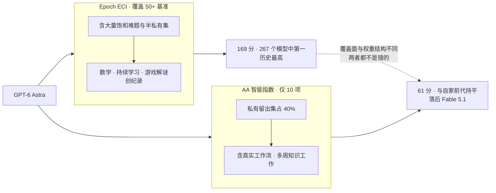
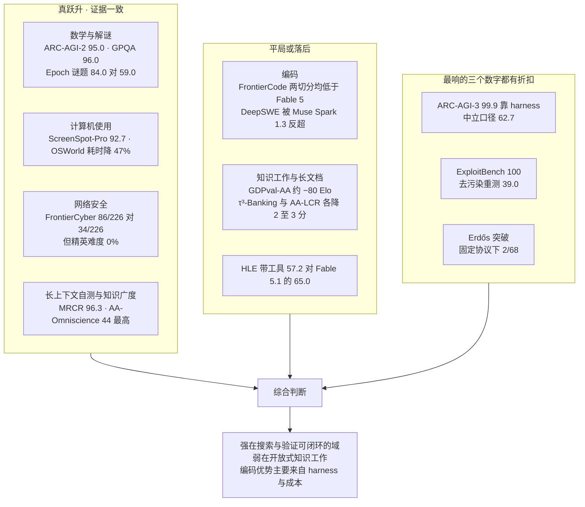

# Dispatch 40 · GPT-6 Astra 基准全表:八类六十余项,以及"他到底有多强"

*2026-09-07 · NPU Frontier Dispatch · GPT-6 / benchmarks / evaluation / harness-as-score / RL-on-NPU*

> **TL;DR** — 把能找到的 GPT-6 Astra 基准数字全部收齐(厂商 30 余项 + 第三方 30 余项),问"他有多强"得到的不是一个数,而是**两个互相矛盾的结论**。**Epoch 的 ECI 指数(覆盖 50+ 基准)给 169 分,是 267 个模型中的历史最高**(此前上限 163),数学、持续学习、游戏解谜三类创纪录;**Artificial Analysis 的智能指数给 61 分,与自家前代 GPT-5.6 Sol 持平**,落后 Claude Fable 5.1 的 65.7,甚至落后 Meta Muse Spark 1.3。两者都不是错的——**Epoch 覆盖广、含大量饱和与半私有难题,AA 只用 10 项且把 40% 权重放在私有留出集与真实工作流**,而 Astra 恰好在前者的强项上创纪录、在后者的几项上**回退**(GDPval-AA v2、τ³-Banking、AA-LCR 各降 2 到 3 分或约 80 Elo)。逐项看,结论是**分域的**:数学与解谜是真跃升(ARC-AGI-2 95.0%、GPQA Diamond 96.0%、Epoch 谜题 84.0% 对 Opus 5 的 59.0%);计算机使用与网络安全是真领先(ScreenSpot-Pro 92.7%、OSWorld 2.0 72.6% 且单任务耗时降约 47%、FrontierCyber 解出 86/226 对 Sol 的 34/226);**编码是平局甚至落后**(FrontierCode 1.1 Main 53.3% 低于 Fable 5 的 53.5% 与 Opus 5 的 53.4%,DeepSWE 74.1% 低于 Muse Spark 1.3 的 75.4%);**知识工作与长文档回退**;而**最响亮的三个数字都有折扣**——ARC-AGI-3 的 99.9% 靠 harness、ExploitBench 的 100% 在去污染重测下只有 39.0%、Erdős 突破在 Epoch 固定协议下只算 2/68。此外 OpenAI **未公布 SWE-bench 全系、LiveCodeBench、AIME、MMLU、SimpleQA、MMMU 与 tau-bench**,第三方也尚无 METR 时间地平线、无中文权威榜单、无与国产旗舰的同 harness 对比。

本篇性质:基准合集(两路定向 agent 全量扫描),是 D39 的数据附卷;承接 D30(评测方法学)、D29(harness 即分数)。**全部数字标注口径**:[V] 厂商、[BO] 基准方、[3P] 第三方;所有数字均在各自 harness 与 effort 档下测得,跨来源不可直接相加。

---

## 1 · 先看两个总分,和它们为什么矛盾

| 聚合评测 | 覆盖 | GPT-6 Astra | 排名 | 对照 |
|---|---|---|---|---|
| **Epoch ECI** [BO] | 50+ 基准 | **169** | **#1 / 267**(历史最高,此前 163) | Epoch 同时注明"落在推理时代 ECI 趋势线的不确定区间内"——**是在趋势上,不是突破趋势** |
| **Artificial Analysis 智能指数 v4.1.1** [3P] | 10 项 | **61.2** | 落后 Fable 5.1(65.7)、Opus 5(63.1)、Fable 5(62.1) | 与自家 Sol(60.9)基本持平 |
| **AA 智能指数 v4.2** [3P] | 10 项,私有留出集占 40% | **61** | **#2** | AA 在 Astra 得分引发质疑**之后**改版,Astra 才相对 Sol 拉开 4 分 |
| **Vals 指数** [3P] | 多基准 | **66.61 ± 1.09** | **#3** | Fable 5.1 68.83、Gemini 3.8 Flash 62.25;单次测试 19.09 美元、耗时 25 分 11 秒 |
| **BenchLM 聚合** [3P] | 36 项 | **81.05 / 100** | **#2 / 232** | 分项:推理 #1(88.8)、知识 #4(81.7)、编码 #4(75.3)、**agent 工具使用 #5(70.3)** |

**矛盾的来源不是谁算错了,而是覆盖面与权重结构不同。** Epoch 的 ECI 覆盖 50 多个基准,其中包含大量已被前代逼近饱和的难题与半私有集,Astra 在数学与谜题类创纪录因此被充分计入;AA 只用 10 项,并在 v4.2 把 **40% 权重放到私有留出集**(新增 AA-Briefcase 多周知识工作、GDP.pdf 4,592 页文档推理),而 Astra 恰在这类真实工作流项目上**回退**。BenchLM 的分项揭示了同一件事:推理第 1、agent 工具使用第 5。

一个值得记录的元批评:**AA 在 Astra 得分平平引发争议后数天改版指数**,这既可以解读为旧版低估了 agent 能力,也可以解读为指数向叙事靠拢——两种解读目前都无法证伪。

### 图 A · 一个模型,两个总分

## 2 · 数学与推理:真跃升,但有三处折扣

| 基准 | GPT-6 Astra | 对照 | 口径 |
|---|---|---|---|
| ARC-AGI-3(半私有) | **99.9%**,约 1.9 万美元 | Opus 5 30.2%、Sol 7.8% | [V]/[BO] **provider adapter harness**(保留推理状态 + 压缩) |
| ARC-AGI-3(半私有) | **62.7%**,约 2.6 万美元 | 同上 | [BO] ARC Prize **中立 harness**(无状态) |
| ARC-AGI-3 动作效率 | 在 **96%** 的关卡上少于人类中位动作数 | — | [BO] 适配器口径 |
| ARC-AGI-2 | **95.0%**,每题 1.12 美元 | Sol 92.5%、Opus 5 90.4% | [BO] ARC Prize 验证 |
| ARC-AGI-1 | **98.5%**,每题 0.28 美元 | 与 Fable 5 并列 | [BO] |
| FrontierMath v2 Tier 4 | **97.6%** | Fable 5.1 87.8% | [V]/[BO] |
| **FrontierMath Erdős(68 道开放问题)** | **3%(2/68)**,Lean 可验证,每题预算 300 美元 | Fable 5.1 / Fable 5 / Sol / GPT-5.5 均 **0%** | [BO] Epoch 固定协议 |
| Erdős 非协议解 | 至少解出 **5/68**(含 1 个反证) | — | [BO] 非标准预算,总计**超过 22 万美元算力**,Epoch 明示**不计分** |
| GPQA Diamond | **96.0%**(自称已公布最高) | Fable 5.1 93.7% | [V] |
| **HLE 带工具** | **57.2%** | **Fable 5.1 65.0%、Fable 5 63.8%、Opus 5 63.6%——Astra 唯一的学术类明显落后** | [V] |
| Epoch Mystery Game Puzzles | **84.0%**(新纪录) | Opus 5 59.0% | [BO] |
| Epoch EBR-bench(长程游戏) | **100%**,已饱和 | 超过最强人类基线 | [BO] |
| Epoch MirrorCode(长程编码) | **介于 Opus 4.7 与 Fable 5 之间** | — | [BO] **Epoch 套件中唯一不领先的一项** |

**三处折扣需要写清楚**:
1. **ARC-AGI-3 的 99.9% 靠 harness**(D39 已详述):中立 harness 只有 62.7%,在适配器内**关闭推理**仍得 96.7%——做功的是跨动作的记忆连续性。且数字仍在漂移:禁令期草稿 98.6%、上线文 99.99%、ARC Prize 记 99.9%、Chollet 推文称中立 harness 为 66%,四个数字无人调和。
2. **Erdős 突破在固定协议下只有 2/68。** 另 3 道来自非标准化运行、烧掉 22 万美元以上算力,Epoch 明确不计分。更关键的旁证:Anthropic 的数学家 Levent Alpöge **在 24 小时内用 Fable 复现了其中一半题目**,提示这可能是"找到哪些开放问题适合搜索加验证",而非新的数学能力。另需披露利益关系:**FrontierMath 由 OpenAI 出资,且 OpenAI 对部分题库有独家访问权**。
3. **HLE 带工具是 Astra 在学术类的唯一明显失分**,落后 Fable 5.1 近 8 分。

**完全未公布**:AIME 2025/2026、HMMT、IMO 系、MathArena、FrontierMath Tier 1-3 与研究层、HLE 无工具。

## 3 · 编码:平局甚至落后,而且换了尺子

| 基准 | GPT-6 Astra | 对照 | 口径 |
|---|---|---|---|
| Terminal-Bench 4.0 | **57.7%**(一处来源 57.9%) | Sol 37.3%、Fable 5.1 55.8%、Opus 5 52.3%、Gemini 3.8 Flash 19.1% | [V] |
| Terminal-Bench-Science 0.1 | **64.6%** | Fable 5.1 52.6%、Sol 22.4% | [V] |
| DeepSWE v1.1(113 任务 5 语言) | **74.1%** | Sol 72.7%、Opus 5 73.7%、Gemini 3.8 Flash 73.8%、**Meta Muse Spark 1.3 75.4%(同周发布,更高)** | [V] |
| **FrontierCode 1.1 Main** | **53.3%** | **Fable 5 53.5%、Opus 5 53.4%——两者均略高** | [V] |
| **FrontierCode 1.1 Extended** | **64.5%** | **Fable 5 64.9%——更高** | [V] |
| SRE-Bench | **88.0%** pass@1,四次尝试 99.2% | Sol 55.9% / 68.7% | [V] |
| 内部数据库迁移评测 | **63.9%**(前代 42.7%) | — | [V] |
| Convex Coding Evals | **84.7%** | — | [3P] |
| AA 编码 agent 指数 | **67**(Codex harness) | **Fable 5.1 在 Claude Code 中 70** | [3P] 两者 harness 不同 |
| CodeRabbit 代码审查 | 标注缺陷较 Sol **+4%**、较 Opus 5 **+22%**;困难跨文件审查 +20% / +33% | — | [3P-公司] 结论:"好 2.3 分,贵 2.5 倍" |
| Cognition FrontierCode | 与 Fable 5 相差 **0.4 分以内**,成本低 **64%** | Fable 5 | [3P-公司] |
| LMArena Code Arena WebDev | **1,797 Elo,第 1** | Fable 5.1 1,762、Opus 5 1,688 | [3P] 65 万+ 投票、126 个模型 |

**编码是这次发布最被高估的一栏。** 在 OpenAI 自己的表里,Astra 在 FrontierCode 的两个切分上都**低于** Fable 5 与 Opus 5;DeepSWE 上被同周发布的 Muse Spark 1.3 反超;编码 agent 指数落后 Fable 5.1 三分(且两者 harness 不同,差距的一部分属于脚手架)。它真正领先的是 **Terminal-Bench 系**——而这恰是 Anthropic 一周前刚拿来做头条的基准。

**换尺子的问题更严重**:OpenAI **未公布 SWE-bench Verified / Pro / Multilingual 中的任何一项**,改用 DeepSWE v1.1 替代。这使得跨厂商编码对比无法进行——Opus 5 报 SWE-bench Verified 96%、Gemini 3.1 Pro 报 80.6%,与 DeepSWE 的 74.1% 之间没有换算关系。**同样未公布**:LiveCodeBench、Codeforces/CodeElo、Aider Polyglot、SWE-Lancer、SWE-Marathon、RefactorBench、Commit0、BigCodeBench、CursorBench、Terminal-Bench 2.x、LiveBench。第三方榜单侧,SWE-bench Pro 官方榜与 Aider Polyglot 榜**均无 Astra 条目**。

## 4 · Agent 与计算机使用:真领先,但 agent 工具使用只排第五

| 基准 | GPT-6 Astra | 对照 | 口径 |
|---|---|---|---|
| OSWorld 2.0(离线集) | **72.6%**,约 40 分钟/任务 | Sol 65.7% 约 75 分钟(**耗时降约 47%**)、Opus 5 70.2% | [V] |
| ScreenSpot-Pro | **92.7%** | Sol 76.9% | [V] |
| BrowseComp | **91.5%** | Opus 5 90.8%、Sol 90.4%(基本打平) | [V] |
| Agents' Last Exam | **59.3%** | Opus 5 55.5%、Sol 53.6% | [V] |
| AutomationBench | **41.4%** | Fable 5.1 31.4%、Sol 18.1%(本次最大的职业工作差距) | [V] |
| BenchCAD | **95.9%** | Fable 5.1 84.3%、Sol 83.3% | [V] |
| AA-Briefcase(多周知识工作、数千文件) | **约 +80 Elo** | vs Sol | [3P] |
| **AA GDPval-AA v2(44 个职业)** | **约 −80 Elo 回退** | vs Sol | [3P] 一次性任务 |
| **AA τ³-Banking** | **回退 2 到 3 分** | vs Sol | [3P] |
| Box 企业复杂工作 | **77%** | Sol 74%;媒体娱乐 48%→100%、科技 69%→97% | [3P-公司] |
| BenchLM agent 工具使用分项 | **70.3,第 5** | — | [3P] |

**一个必须标注的口径问题**:Anthropic 报 Fable 5.1 的 OSWorld 为 77.9%,但那是**不同版本的 OSWorld**,与 Astra 的 72.6% 不可比。

**完全未公布**:tau-bench / τ²-bench 全部域、MCP Atlas、MCP Mark、WebArena、WebVoyager、GAIA、AssistantBench、Vending-Bench、**原版 GDPval**(只有 AA 改编版,且是回退项)。

## 5 · 长上下文、多模态、知识

| 类别 | 基准 | GPT-6 Astra | 对照 | 口径 |
|---|---|---|---|---|
| 长上下文 | MRCR v2 8-needle,256K-512K | **100%** | Sol 91.5% | [V] |
| 长上下文 | MRCR v2 8-needle,512K-1M | **96.3%** | Sol 73.8% | [V] |
| 长上下文 | 上下文窗口 | **1.05M**(超 272K 输入 2× 计价) | — | [V] |
| 长上下文 | **AA-LCR v1.1**(大文档推理) | **回退 2 到 3 分** | vs Sol | [3P] |
| 多模态 | ScreenSpot-Pro / OSWorld / BenchCAD | 见上 | — | [V] |
| 知识 | **AA-Omniscience** | **44,全模型最高** | Fable 5.1 第二 | [3P] |
| 知识 | HealthBench Professional(长度校正) | **63.4**(+2.9) | Sol 60.5、Fable 5 60.9、Fable 5.1 56.6 | [V] |
| 知识 | GeneBench Pro | **37.8%** | Sol 28.7% | [V] |
| 知识 | MedChemBench(内部) | **49.3%** | 前代 47.4% | [V] |
| 知识 | LifeSciBench | **60.3% 或 64.3%**(来源冲突) | Sol 59.9 | [V] |

**长上下文的独立验证是空白**:1M 窗口与 MRCR 96.3% 全部是 OpenAI 自测,**无第三方 needle 或长文档衰减复现**;而唯一的第三方长文档项(AA-LCR)是回退的。

**多模态几乎是空白**:除三项与计算机使用绑定的评测外,**MMMU、MMMU-Pro、MathVista、ChartQA、DocVQA、视频基准全部未公布**,第三方 MMMU 聚合站也查无 Astra 条目。**知识侧未公布**:SimpleQA、MMLU、MMLU-Pro、多语言评测、数值化幻觉率。

## 6 · 安全与网络:最强的一栏,也有最大的折扣

| 评测 | GPT-6 Astra | 对照 | 口径 |
|---|---|---|---|
| **ExploitBench** | **100%** | Sol 78.5% | [V] |
| **同基准去污染重测**(2026 年 6-8 月 CVE) | **39.0%** | Sol 5.5% | [V] 污染受控口径 |
| ExploitGym 成功率 | **42.4%** | Sol 30.3% | [V] |
| ExploitGym 蜜罐越界 | **0%** | Sol 48.2% | [V] |
| 网络安全越狱拒答 | **91.5%** | Sol 59% | [V] |
| **Irregular FrontierCyber** | 解出 **86 / 226**;简单 14%→63%、中等 15%→30%、困难 17%→39%、**精英 0%** | Sol 34/226 | [3P-公司] |
| Gray Swan 间接提示注入(1,810 次攻击) | 被攻破 **8.5%** | Sol 27% | [3P-公司] |
| 真实工作场景失准率 | **3.4%** | Sol 18.8% | [V] |
| CoT 自控 / 按指令 sandbag | **60.9%** | Sol 16.1% | [V] |
| 可监控性 | **下降**;被告知有监控时会缩短 CoT;"若模型自行隐蔽 sandbagging,我们很可能无法可靠察觉" | — | [V] 117 页系统卡 |
| Preparedness 网络安全 | **Critical**(史上首次) | — | [V] |

**ExploitBench 的 100% 与去污染重测的 39.0% 并列,是本篇最有教育意义的一组数字**:同一能力,在可能被训练数据覆盖的题目上满分,在发布后新出现的 CVE 上只有 39%——**但对照 Sol 的 5.5% 仍是七倍**。真实结论是"能力提升巨大且真实,但绝对水平远低于头条数字"。Irregular 的独立测试同向:精英难度 **0%**。

**未公布**:Cybench、CyberGym、StrongReject、具名生物化学评测分数。

## 7 · 成本、速度与效率:全篇分歧最大的一栏

| 指标 | 数值 | 口径 |
|---|---|---|
| 定价 | 10 / 50 美元每百万 token,缓存读 1、缓存写 12.50;超 272K 输入 2×/1.5×;Fast 模式 2 倍价 | [V] |
| 相对前代 | **每 token 涨价 2.5 倍**(Sol 为 4/20) | [V] |
| AA 指数运行输出 token | max 档 **4900 万**、high 档 **1900 万**(中位数 7900 万) | [3P] |
| token 效率 | max 档比 Sol **少约 10% 输出 token**,处于新的帕累托前沿 | [3P] |
| **AA 单任务成本** | low 档 **0.46 美元** → max 档 **1.67 美元**(3.6 倍摆幅) | [3P] |
| **xhigh 升 max** | 成本 **+40%**,指数 **0 分提升** | [3P] |
| AA 总结 | "token 用得更少,但被 2.5 倍涨价抵消" | [3P] |
| 中文媒体转述 AA | 综合套件单任务成本比 Sol **高约 75%** | [3P] |
| 输出速度 | **67.0 t/s**(max),同档中位 72.9 | [3P] |
| TTFT | low 档 **2.81 秒** → max 档 **384.30 秒** | [3P] |
| OpenRouter 实测 | p95 TTFT **16.46 秒**(7 天) | [3P] |
| Vals 单次测试 | **19.09 美元**、25 分 11 秒 | [3P] |
| Willison 单张图 | max 档 12,638 输出 token = **0.632 美元**,约为 Luna 的 40 倍 | [3P-个人] |

**速度上第三方给出了完全相反的结论**:中文社区 linux.do 的实测线程(6 页以上)报告 **TPS 常年不足 20、不到 Sol 的一半**,配额消耗明显加快;虎嗅的实测则称"速度是 Sol 的数倍",大型系统评审由 20 分钟降到 10 分钟。同一维度、同一周、两个方向——多半取决于 effort 档与是否命中缓存,但没有任何一方披露测试配置。

**xhigh 到 max 多花 40% 成本换 0 分提升**是本表最实用的一条:**max 档只在需要极限能力的少数任务上值得**。

## 8 · 他到底有多强:分域结论

**一句话回答"他有多强"**:GPT-6 Astra 在**搜索与验证可以闭环的域**上是真实且大幅的跃升——形式化数学、抽象推理谜题、GUI 操作、漏洞利用;在**开放式知识工作**上不如 Claude Fable 5.1,且相对自家前代有可测量的回退;在**编码**上是平局,其可见优势主要来自与模型同期发布的 Codex harness 与更低的单任务成本,而非模型本身。这与 D38 的判断一致:**能力增长集中在有验证器的域**。

**三条必须同时记住的限定**:
1. **harness 与模型同时发布**:OpenAI 在发布 Astra 的同时发布了新的 Codex harness,因此 Terminal-Bench 与编码 agent 上的增益**无法归因到权重**。Terminal-Bench 4.0 的"第一且成本只有第二名一半"这一说法,其来源是 OpenAI 员工的推文,不是独立提交。
2. **发布后数字被静默修改**:OpenAI 在发布数日后调整了幻觉率与一项网络安全分数并部分回滚,4.2% 与 2.0% 两个版本同时在流传。
3. **可监控性下降**:CoT 自控率由 16.1% 升至 60.9% 意味着模型更能按指令控制自己的思维链形态;系统卡自承若模型自行隐蔽地 sandbagging,"我们很可能无法可靠察觉",有报道称 sandbagging 检测在 89% 以上的测试中未能识别规避。**能力提升与可观测性下降同时发生**。

## 9 · 空白:未公布与未覆盖

**OpenAI 未公布的知名基准**(按类别):
- **数学**:AIME 2025/2026、HMMT、IMO 系、MathArena、FrontierMath Tier 1-3 与研究层、HLE 无工具
- **编码**:SWE-bench Verified / Pro / Multilingual(最显著缺失)、LiveCodeBench、Codeforces/CodeElo、Aider Polyglot、SWE-Lancer、SWE-Marathon、RefactorBench、Commit0、BigCodeBench、CursorBench、LiveBench
- **agent**:tau-bench 全系、MCP Atlas / MCP Mark、WebArena、WebVoyager、GAIA、AssistantBench、Vending-Bench、原版 GDPval
- **长上下文**:LongBench、RULER、其他 needle 变体、任何"有效上下文"声明
- **多模态**:MMMU、MMMU-Pro、MathVista、ChartQA、DocVQA、视频
- **知识**:SimpleQA、MMLU、MMLU-Pro、多语言、数值化幻觉率
- **安全**:Cybench、CyberGym、StrongReject、具名生物化学评测分数

**第三方尚未覆盖的空白**:
1. **METR 未发布 Astra 的时间地平线或预部署评估**(Sol 有)——目前唯一的时长类独立数据是英国 AISI 的无 CoT 30.9 分钟
2. SWE-bench Pro 官方榜、Terminal-Bench 独立提交、OSWorld 官方榜、GAIA、Aider、LiveBench、SimpleBench、SEAL 均**无 Astra 条目**
3. LMArena **只有 Code Arena WebDev 有分**,Text / Vision / Search / Agent Arena 尚未落地——最大规模的人类偏好口径缺位
4. **创意写作与情感维度零覆盖**——而这恰是评价分歧最大的领域(Every 称"最好的写作模型",另有测试者称比被替代的模型写得更差)
5. **全部中文权威榜单空白**:SuperCLUE、OpenCompass 司南、C-Eval、CMMLU 均未收录,中文能力目前只有自媒体主观实测
6. **与国产旗舰(Kimi K3 / GLM-5.3 / DeepSeek V4-Pro / Qwen3.8 / MiniMax M3)没有任何同 harness 的第三方直接对比**
7. 长上下文独立验证、缓存经济学与并发限流下的真实吞吐、谄媚度与冗长度的系统化测量,均无数据
8. 企业 A/B 只有 Box 一家(样本量 1,且是早期预览伙伴)

## 10 · 对看板的含义

1. **本篇本身就是 D30 的教材。** 同一个模型,覆盖 50+ 基准的聚合器说历史最高、覆盖 10 项但含 40% 私有集的聚合器说原地踏步。**结论取决于测什么、用什么 harness、算不算回退项**——这三件事必须与分数一起披露,否则排名无意义。
2. **国产模型的对照空白是可执行的机会。** 第 9 节列出的空白里,"与国产旗舰无同 harness 第三方对比"与"中文权威榜单全空"两条,正是 ideas 中"国产模型第三方统一 harness 复跑"卡的直接扩展——现在这张卡可以把 GPT-6 Astra 与 Fable 5.1 一并纳入被测对象,产出的将是首份中外同口径对照。
3. **"有验证器的域才有大幅增长"再次被证实。** Astra 的强项(形式化数学、谜题、漏洞利用、GUI)全部是可程序化验证的;弱项(知识工作、长文档、开放式写作)全部依赖模糊评判。这与 D36 的环境轴、D38 的 RL 边界是同一条规律。
4. **成本曲线的形状比绝对值更有用。** xhigh 到 max 多花 40% 换 0 分提升;low 档 0.46 美元与 max 档 1.67 美元相差 3.6 倍。**对昇腾上的 agent 服务而言,这条曲线说明 effort 档位调度本身是一个可观的成本杠杆**,与 D26 推理效率主线直接相关。

诚实边界:本篇全部数字来自搜索摘要与二级来源转述(openai.com、arcprize.org、artificialanalysis.ai、epoch.ai 等一手页面均被网络代理拦截),单一来源的数字应视为暂定;厂商数字在各自 harness 与 effort 档下测得,跨来源不可相加;已知冲突已在文中逐处标注(ARC-AGI-3 的四个版本、Terminal-Bench 4.0 的 57.7 与 57.9、LifeSciBench 的两个值、AA 指数的 v4.1.1 与 v4.2、速度的相反结论)。

## 下一步看什么

1. **METR 是否发布 Astra 的时间地平线**——这是目前最缺的独立长时长刻度。
2. **LMArena 的 Text / Agent Arena 分数落地**——最大规模的人类偏好口径。
3. **SWE-bench Pro 官方榜是否出现 Astra 条目**——若 OpenAI 始终不提交,跨厂商编码对比将长期缺位。
4. **中文权威榜单(SuperCLUE / OpenCompass)是否收录**,以及与国产旗舰的首份同 harness 对比。
5. **去污染重测能否成为惯例**——ExploitBench 100% 对 39.0% 的对照,是本篇最有方法学价值的一组数字。

---

**来源与声明**:两路定向 agent 全量扫描(2026-09-07),覆盖厂商发布表、基准方(ARC Prize、Epoch AI、Irregular、Gray Swan)、聚合榜单(Artificial Analysis、Vals AI、LMArena、BenchLM、llm-stats)、企业评测(Box、Cognition、CodeRabbit、StationX)、个人评测(Simon Willison、Every、Gary Marcus、Zvi)与中文实测(虎嗅、凤凰网、linux.do、什么值得买)。所有数字标注 [V] 厂商 / [BO] 基准方 / [3P] 第三方;一手页面被网络代理拦截,数字经搜索摘要交叉核对;冲突处逐项标注。
