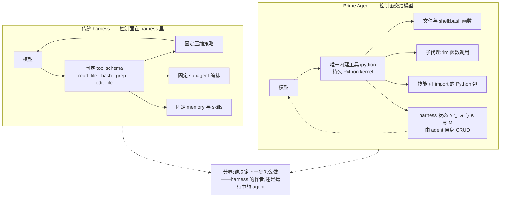
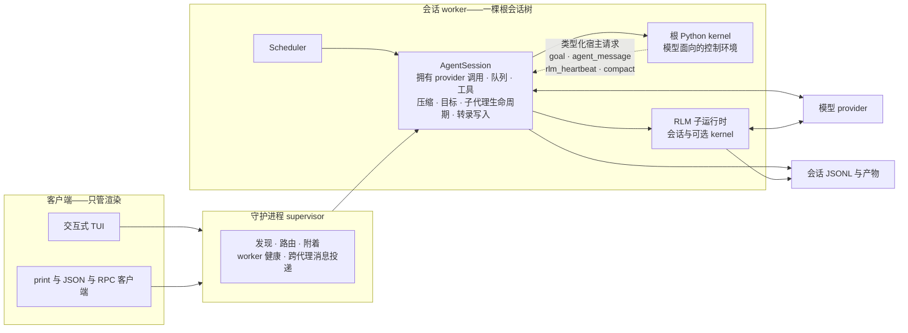
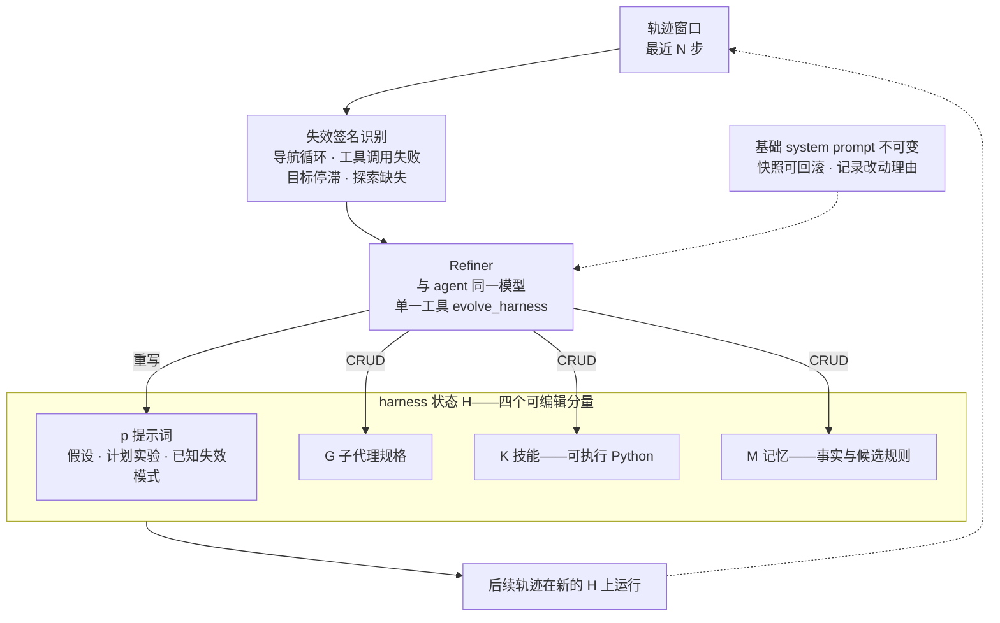
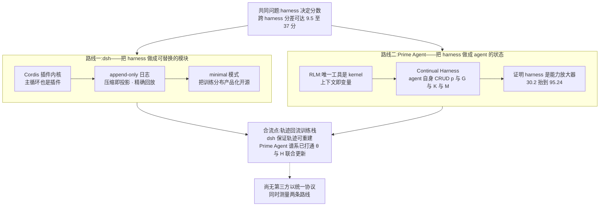

# Dispatch 41 · 详解 Prime Agent:REPL 即控制面、subagent 即函数调用,与 DeepSeek Harness 的两条演进路线

*2026-09-08 · NPU Frontier Dispatch · Prime-Agent / RLM / Continual-Harness / agent-harness*

> **TL;DR** — Prime Agent 的贡献不是新的 RL 算法,而是两个 harness 抽象:**RLM**(持久 IPython kernel 是模型**唯一的内建工具**,上下文即变量、subagent 即 `rlm()` 函数调用)与 **Continual Harness**(harness 状态 `H=(p,G,K,M)` 即提示词、子代理、技能、记忆,由 agent 自身 CRUD)。最硬的证据在 ARC-AGI-3:**同一个 Opus 5,官方中立 harness 记 30.2%,换上 Prime Agent 得 95.24%(三次运行中位)**,人类专家基线是 95.4%——模型参数一个没动。但四处需要修正广泛流传的说法:**① 技术报告已经存在**(arXiv 2608.23552,Karten 等),不是"仍在计划中";**② 95.5% 是三次里最好的一次,官方自报的口径是中位数 95.24%**,而 183/183 全关卡来自 RHAE 最低的那次运行(94.99%),三者不可混着引用;**③ `await rlm(...)` 返回的是准入句柄而非子代理的答案**,结果只经 `agent_message` 或文件回流;**④ Continual Harness 的谱系是具身智能体而非编码**——原论文(arXiv 2605.09998)在宝可梦 Red/Emerald 上做 reset-free 在线 in-context 学习,且**已经做过 θ 与 H 的联合训练**(online DAgger + 过程奖励模型),"模型与 harness 协同学习"不是未来工作,只是尚未在 Prime Agent 这条编码线上做。成本侧本站算了一笔账:Prime Agent 每张 ARC-AGI-3 记分卡 944 至 1,288 美元,而 OpenAI 用自家 provider adapter 把 Astra 抬到 99.9% 约需 1.9 万美元——**开源 harness 的每分成本约为厂商适配层的十八分之一**(不同模型、不同协议,为量级观察而非受控对比)。与 dsh 的分界有四条:状态中心(append-only 日志 对 持久 kernel)、谁能改 harness(开发者 对 agent 自身)、防过拟合方向(收窄 对 放大)、安全模型(四层权限插件 对 官方明示"不是沙箱")。

本篇性质:详解篇 + 对照篇。承接 D29(DeepSeek Harness 详解)结尾的"跟进:对照 Prime Agent",把当时一段话的对照展开为完整拆解;并为 D30/D35/D39/D40 反复出现的"harness 即分数"提供**除厂商适配层之外的第二个极端样本**。

---

## 1 · 问题陈述:harness 是提前写死的,模型却一直在变

主流 coding agent 的形状是固定的:固定 system prompt → 固定 tool schema → tool call → observation → 固定压缩策略 → 回到模型。harness 决定有哪些工具、工具签名长什么样、上下文满了怎么压、子代理怎么调、记忆怎么存、技能是什么。

这些决定**在模型能力冻结的假设下**是合理的。Prime Intellect 的出发点是这个假设不成立:模型每几个月强一档,却始终被迫适配几个月前定下的 tool schema 与压缩策略。于是问题变成——**能不能让 agent 自己编排、乃至自己修改 harness 的使用方式?**

给出的答案分两层,恰好是 repo 首页列出的两个核心抽象:

- **RLM(Recursive Language Model)**:把上下文当变量(*prompt-as-a-variable*)、把工具与递归子代理当函数调用(*programmatic tool / sub-agent calling*),全部放进一个持久 REPL。
- **Continual Harness**:把补充提示词、记忆、技能描述与可复用子代理规格存成**持久状态**,由 agent 通过"小的、有证据支撑的更新"自行改写,**默认作用域限于当前会话**。

### 图 A · 控制面的位置:传统 harness 与 Prime Agent



## 2 · 第一刀:唯一的内建工具是 IPython

官方文档的措辞很硬:**"The default RLM runtime exposes one built-in model tool: `ipython`."** 读写文件、跑项目命令、变换结果、调用技能、委派工作,全部从这个持久 kernel 出发,而不是各自一个内建工具([RLM 文档](https://github.com/PrimeIntellect-ai/prime-agent/blob/main/packages/coding-agent/docs/rlm.md))。

这带来的第一个实际收益是 **token 效率**。传统形态下模型要 `read_file("huge.log")`,50K token 全部进上下文,再由模型在里面找 ERROR。Prime Agent 里模型可以写:

```python
text = open("huge.log").read()
errors = [x for x in text.splitlines() if "ERROR" in x]
print(errors[-20:])
```

进入上下文的只有 20 行。一句话概括这个设计的价值判断:**不要让模型用 token 去搬运数据,让模型写程序处理数据**。这也是官方声称在长上下文任务上 token 效率占优的机制来源。

三个容易被忽略的运行时细节:

- **Python 状态跨工具调用与压缩存活**。变量、import、函数、解析结果、任务句柄在后续 turn 仍可用——压缩清掉的是消息,不是 kernel。
- **`bash()` 每次调用是独立进程**,但 `os.chdir(...)` 与 `os.environ[...]` 的修改留在 kernel 里,并对之后的 `bash()` 生效。
- **长命令不必阻塞**:保留句柄让 turn 结束即可;进程组结束时 Prime Agent 会发一条带 PID 与前台退出码的 Shell 消息,忙碌的 agent 在下一个安全的 turn 边界收到它作为引导,空闲的 agent 直接恢复处理。

## 3 · RLM:上下文即变量,子代理即函数调用

`rlm` 是预加载在 kernel 里的可调用对象:

```python
handle = await rlm("Review the authentication flow for security issues", name="auth-reviewer")
print(handle.rlm_child_id, handle.name, handle.session_dir, handle.model)
```

**这里有一处必须澄清的语义**,也是流传版本里最容易错的一点。官方原文是:**"The call returns immediately after task admission with a child handle; it never waits for or returns the child's answer."** `await rlm(...)` 等到的是**准入**,不是答案;返回的句柄只含 `rlm_child_id`、`name`、`session_dir`、`model` 四个字段。结果**只经两条通道回流**——显式的 `agent_message` 回复,或文件:

```python
await agent_message.send(message, receiver_role="parent")
```

父代理事后仍可对保留下来的子代理追加指令:

```python
await agent_message.send(
    "Check the newly added regression test.",
    receiver_role="child",
    receiver_name=api_review.name,
)
```

所以 subagent 在这里更接近**持久 worker** 而不是一次性的函数补全:成功完成的 daemon 支撑子代理在父会话开着的期间**一直可寻址**,父作用域的子代理注册表**跨压缩、跨 kernel 重启、跨父会话恢复存活**(`await rlm.list_subagents()`),不再需要时才显式 `delete_subagent`。子代理默认继承父代理的模型、provider 配置、技能、工具、重试策略与资源加载器,除非调用点指定另一个已配置模型;其用量计入父会话,但在上下文树报告里仍可区分。默认递归深度只允许根代理创建子代理,调高配置后子孙可继续递归。

**技能是 Python 包,不是提示词片段。** Prime Agent 支持 Agent Skills 的 markdown 格式,并用 Python 后端扩展它:两者都用 `SKILL.md` 做发现与路由,Python 后端技能额外带一个安装进 kernel 环境、按 import 名暴露的包,于是模型可以直接 `report = await release_audit(repository=".", target_version="0.4.0")`。**启动提示词里只放技能元数据**,任务匹配时才加载完整 `SKILL.md`——这是把技能目录的 token 成本从 O(全部技能) 降到 O(元数据) 的做法。技能自身也可以调用 `rlm(...)` 递归委派。

## 4 · 宿主分层:TypeScript 主机 + Python kernel

一个被普遍略过、但对 RL 与可审计性最关键的事实:**Prime Agent 不是一个 Python 程序**。官方架构文档写明:**"Provider calls, session persistence, child lifecycles, scheduling, and safety policy remain in the TypeScript host; the Python REPL is the model-facing programming surface."**

也就是说,凭据、模型执行、转录写入、worker 路由与调度**都不在 Python 里**。需要动这些权威状态的能力(`goal`、`agent_message`、`rlm_heartbeat`、`compact`)走一条**类型化的宿主请求**通道 `rlm.host_request(...)`,由 TypeScript 会话校验并拥有状态转移。

### 图 B · 一个 turn 的执行链与状态归属



**另一个结构性事实**:从会话队列往后,无论提示词来自附着的用户、心跳、cron 日程、目标续跑、自治模式,还是另一个 agent,**走的是同一条执行与持久化路径**。这意味着"用户"在架构上只是提示词来源之一——长程自治不是外挂脚本,而是一等公民。

**安全模型上,官方的表态是否定式的**。README 与文档两处都写了:worker 与 kernel 分进程是为了生命周期隔离与故障恢复,**"they are not a security sandbox"**,通常以与客户端相同的操作系统权限运行;跑不受信任的代码或指令要自己套外部沙箱。这与 D35 记录的"每 agent 一沙箱"生产共识、以及 dsh 的四层权限模型(capability seam 可替换 + 预设能力集 + 插件监听 `fs/*` 与 `tools/*` + `ctx.sandbox` 在 spawn 前包裹命令)是明确相反的取舍。

## 5 · 为长程运行准备的五件东西

RLM 编程模型的前提是"有用的工作可能跨很多 turn,甚至在终端关掉后继续"。官方为此列了五项机制:

| 机制 | 作用 |
|---|---|
| 自动压缩 | 摘要较旧上下文,保留近期消息与 **kernel 状态** |
| daemon 支撑的 worker | 客户端断开后活跃会话继续跑,可 `prime-agent attach` 重新附着 |
| 子代理注册表与会话产物 | 子代理可恢复 |
| 心跳与日程 | `/heartbeat`、`rlm_heartbeat`、`prime-agent schedule` 定期或定时重新进入会话 |
| 持久目标与有界自治 | `/goal` 让目标跨 turn 存活;`/autonomous` 在配置的 turn、token、时间预算内续跑,可挂用户定义的质量闸门 |

官方对自治模式给了一句克制的限定,值得原样保留:**"A passed gate checks only what that gate verifies; reaching a limit does not imply task success."**——闸门通过只说明该闸门验证的部分通过,跑到预算上限不等于任务成功。

**与"管理上下文窗口"的路线区别在这里**。D34 讨论的压缩类方案优化的是窗口内该留什么、丢什么;Prime Agent 的做法更激进:**把大量状态搬到窗口之外**(kernel 变量、文件、子代理会话、append-only 的会话 JSONL),让窗口只保留当前工作集,需要旧信息时**程序化取回**。用一个式子表述这个立场:

**工作上下文 ≠ 代理的全部记忆。**

## 6 · Continual Harness:H=(p, G, K, M) 与 Refiner 的四遍 CRUD

第二个抽象才是"self-improving"这个词的来源。Continual Harness 把 harness 状态形式化为四个可编辑分量:

- **p** — system prompt:编码当前策略的文本状态,含活跃假设、计划中的实验、最优工具用法、已知失效模式
- **G** — sub-agents:可复用子代理规格
- **K** — skills:可复用的 Python 例程,针对当前观测运行,或发出动作,或返回结构化结果
- **M** — memory:持久事实与候选规则

外加一个自动化的 **Refiner**,从轨迹分析出发**就地重写**这些分量。

参考实现里 Refiner 的行为是明确的:每 `--optimization-window-length` 步,读取最近的轨迹窗口,识别**失效签名**(导航循环、工具调用失败、目标停滞、探索缺失),然后跑四遍:

```
1. 依观测到的失效重写 system prompt p
2. 对 sub-agents G 做 CRUD——为重复出现的多步模式建条目、改进失效项、删除未用项
3. 对 skills K 做 CRUD——把成功序列固化为代码、修复抛异常的可执行代码
4. 对 memory M 做 CRUD——补缺口、刷新过期项、降级已经走过的区域
```

整个精炼过程**对 agent 暴露为单一工具 `evolve_harness`**,且 **Refiner 角色使用与 agent 相同的模型**。

Prime Agent 侧对应的入口是 `/refine`。三条约束值得记住:**它从不重写不可变的基础 system prompt**(改的是其外层的补充 harness 状态)、**记录的快照支持回滚**、并且官方明说 `/refine` **不替代**打包与评审新的可执行技能。

### 图 C · Continual Harness 的回路



**这不是 RL。** 区分要说清楚:传统自进化是轨迹 → 奖励 → 梯度 → 更新权重,即 θ_t → θ_{t+1};Continual Harness 是轨迹 → 反思 → 修改 harness → 下一次更好,即 **H_t → H_{t+1}**,模型参数 θ 一个没动。把策略写成 **π(a | s; θ, H)**,Prime Agent 当前优化的是 H 这一半。这是**权重固定的自我改进**。

## 7 · 谱系更正:Continual Harness 来自宝可梦,而且已经做过 θ+H 联合训练

流传版本普遍把 Continual Harness 当作 Prime Agent 的一部分、并把"模型与 harness 协同学习"列为未来工作。**两点都需要更正。**

**其一,谱系。** Continual Harness 是先于 Prime Agent 的独立工作(Karten 等,[arXiv 2605.09998](https://arxiv.org/abs/2605.09998),《Continual Harness: Online Adaptation for Self-Improving Foundation Agents》),定位是**面向具身智能体的 reset-free 框架**,通过在线 in-context 学习自动化 harness 精炼,**评测环境是宝可梦 Red 与 Emerald**,不是编码。参考实现([sethkarten/continual-harness](https://github.com/sethkarten/continual-harness))里的对照组设置也很清楚:`H_min`(最小接口:画面帧、ASCII 文本地图、按键输入)加 Refiner 是主结果的产物,手工工程化的 `H_expert`(带子代理、A\* 寻路、属性克制表、伤害计算器、精选目标)是**上界基线**。同一仓库还含 Gemini Plays Pokémon 基准 harness,完成了宝可梦 Blue、Yellow Legacy 困难模式与 Crystal——自称首个通关多部宝可梦 RPG 的 AI 系统。

Prime Agent 做的是**把这套具身场景的抽象搬进编码 harness**。这个搬运本身是论点:如果 harness 精炼在"帧 + 按键"这种极窄接口上有效,那么它不依赖编码领域的特殊结构。

**其二,也是更重要的一点**:参考实现的 README 有一句话直接推翻"协同学习是未来工作"的说法——

> **"The same loop extends to joint training of an open-source model's weights via an online DAgger + process-reward-model pipeline."**

同一个回路已经被扩展到**开源模型权重的联合训练**,路径是在线 DAgger 加过程奖励模型。也就是说 (θ_t, H_t) → (θ_{t+1}, H_{t+1}) 在这条谱系上**已经跑过**,只是尚未在 Prime Agent 这条编码 harness 线上做。准确的表述应当是:**Prime Agent 当前没有为它专门训练过的模型,不等于这套方法没做过模型侧训练。**

这一条对本看板的意义是直接的:**Continual Harness 提供了一个已经打通的"harness 自改进 → 轨迹 → 权重更新"的完整回路**,而它需要的训练侧组件(在线 DAgger、过程奖励模型)恰好是 D18/D19/D33 记录的几套 RL 框架都已具备的能力。

## 8 · 证据:ARC-AGI-3 的 30.2 → 95.24,以及一笔成本账

论文摘要的口径是:**"Prime Agent raises ARC-AGI-3 RHAE Best@1 from 30% to 95.5% and matches or exceeds native and popular harnesses across long-context coding, GPU-kernel generation, emulator construction, and autonomous nanoGPT speedruns."**

但**要引用的是复现仓库里的三次运行表**([arc-agi-3-prime-agent](https://github.com/PrimeIntellect-ai/arc-agi-3-prime-agent),含[公开记分卡](https://arcprize.org/scorecards/2af780b4-f2a1-43e9-a794-b23da3cd3f9f)),它比任何二级转述都精确:

| 运行 | RHAE | 关卡 | 通关游戏 | 估算成本 |
|---|---|---|---|---|
| run-1 **(中位,即官方报告口径)** | **95.24%** | 178/183 | 24/25 | $1,059 |
| run-2 | 94.99% | **183/183** | 25/25 | $1,288 |
| run-3 | **95.5%** | 179/183 | 24/25 | $944 |

**三处常见的混引在这张表里一目了然**:95.5% 是三次里最好的一次(run-3),不是官方报告口径;官方报告的是**中位数 95.24%**;而 183/183 全关卡出自 **RHAE 最低**的 run-2。三个数字分属三次不同运行,不能拼成一句话。Best@3 的 99.97% 是跨三次的合并指标,又是另一个口径。

配置与协议全部公开:`prime-agent v0.3.3` · `anthropic/claude-opus-5` · thinking **xhigh**;每局 500 个动作、每次 agent 调用至多 20 个动作、每局独立运行、game-over 消耗一次计数的 `RESET`。**agent 只能通过本地 broker socket 触达游戏,从不 import ARC SDK,也从不看到 provider 凭据**;`AGENTS.md` 是游戏无关的,禁止查看引擎源码、其他游戏或先前运行,并要求**程序化分析画面帧而非用眼睛转录**——最后这条正是第 2 节 PTC 论点在评测里的落地。

**Prime Intellect 自己把功劳给了 harness**,原话:**"The agent is unmodified Prime Agent. What makes the run is the prompt plus the protocol."**


*图 D · 同一基准、换 harness 的分差。横轴是 RHAE Best@1,一根哑铃的两端是同一个模型的两套 harness。三条线的模型与动作协议均不同,成本为估算档,属量级观察而非受控对比。最值得看的是中段:Opus 5 的 +65.0 分是三者中最大的一跳,而它用的是唯一一套开源 harness,成本也低一个数量级。*

**本站计算的一笔账。** 把中立口径当基线,Prime Agent 用约 1,059 美元把 Opus 5 抬高约 65 个百分点;OpenAI 的 provider adapter 用约 1.9 万美元把 Astra 抬高约 37 个百分点(62.7 → 99.9)。更值得注意的是:**中立 harness 跑 Astra 的约 2.6 万美元,买到的 62.7% 低于 Prime Agent 用约 1,059 美元买到的 95.24%。** 必须挂三条限定——模型不同(Opus 5 对 Astra)、动作协议不同、成本均为估算——所以这是量级观察而非受控对比。但方向是清楚的:**在这个基准上,harness 设计对分数的杠杆大于模型选择,且开源 harness 的性价比远高于厂商适配层。**

**长上下文一侧的对照**(自报口径):Prime Agent 搭配**开放权重的 GLM-5.2**,在九项长上下文评测里 8 项胜 Pi-mono、6 项胜 Claude Code + Opus 5、6 项胜 Codex + GPT-5.6 Sol。这条比 ARC-AGI-3 更接近日常工程负载,也更值得第三方复现——**一个开放权重模型靠 harness 追平闭源旗舰的原生 harness**,如果成立,对国产模型的落地路径有直接含义。

## 9 · 与 DeepSeek Harness 的对照:两条演进路线

D29 详解过 dsh 的三个技术支点:Cordis 插件内核(连 agent 主循环本身都是可替换插件)、append-only 会话日志(凡进入模型请求的内容必须可从日志重建,压缩即投影)、"Model + Harness = Agent"协同设计(公榜成绩在自家 minimal 模式下测得,该模式实质复现 RL 训练分布)。

两者同为 harness、同以轨迹回流训练栈为商业逻辑,但设计哲学在四条轴上相反:

| 维度 | DeepSeek Harness (dsh) | Prime Agent |
|---|---|---|
| 核心命题 | 一切皆插件 | 一切皆可编程状态 |
| 状态中心 | append-only 会话日志,压缩即投影 | 持久 IPython kernel + 会话 JSONL |
| 谁能改 harness | 开发者与配置,替换插件 | **agent 自身**,`/refine` CRUD `p·G·K·M` |
| 工具形态 | 插件与服务,工具注册表 | Python 函数与可 import 的包 |
| 子代理 | capability seam,provider 可为子 agent 或委托另一产品的 turn | `rlm()` 函数调用,返回准入句柄,持久可寻址 |
| 上下文策略 | 窗口内投影,可精确回放 | 状态搬出窗口,程序化取回,回放困难 |
| 防过拟合方向 | **收窄**——单一训练接口 + minimal 模式,保证分数口径可信 | **放大**——证明 harness 是能力放大器 |
| 安全模型 | 四层权限:capability seam · 预设能力集 · `fs/*` 与 `tools/*` 事件策略 · `ctx.sandbox` 包裹 | 官方明示进程隔离**不是安全沙箱**,需自套外部沙箱 |
| 宿主语言 | TypeScript monorepo | TypeScript 主机 + Python kernel |
| 自我改进 | 架构支持但非核心机制 | **Continual Harness 是核心机制** |
| 与 RL 的关系 | minimal 模式复现训练分布,白盒 harness | 谱系侧已有 online DAgger + PRM 的 θ+H 联合训练 |
| 许可 | MIT | MIT |

### 图 E · 两条路线的分叉与合流点



**一句话的分工**:dsh 在解决"harness 如何完全模块化、可观测、可替换";Prime Agent 走的是下一步——"harness 模块能不能由 agent 自己在线重写"。**两者合起来才构成"harness 即分数"的完整论证:harness 既定义分数的口径(dsh 的立场),也改变分数本身(Prime Agent 的证明)。**

## 10 · 官方没给的东西

- **Continual Harness 在编码任务上的受控消融缺失。** ARC-AGI-3 的 95.24% 证明的是**整套 harness**有效,没有把 RLM 与 Continual Harness 的贡献拆开。参考实现里有 *bootstrap frozen* 对 *bootstrap updating* 的消融开关,但那是宝可梦环境的设置。
- **`/refine` 的漂移代价没有量化。** 允许 agent 改自己的提示词、技能与记忆,意味着**评测口径随自改而漂移**——两次运行的 agent 严格来说不是同一个 agent。官方给了快照与回滚,没给"改动前后跨任务分布的性能差"。
- **ARC-AGI-3 的三次运行之外无独立复现。** 复现仓库、记分卡、逐局结果与 verbatim 的 `AGENTS.md` 都已公开(这比 2026-08 初评论时的状态好很多),但仍缺**第三方按同一协议的重跑**。
- **成本只有估算档。** 944 至 1,288 美元是仓库标注的 est. cost,未给 token 明细。
- **长上下文九项对照为自报**,未见第三方按同协议复算。
- **"nuclear family"式的通信范围**在公开文档里表现为 `receiver_role` 取 `parent`/`child` 加 `receiver_name` 的 API 形状,官方未给出关于兄弟节点可达性的规范性说明。
- **无中文/国产模型的同 harness 对照**——与 D40 的同一处空白重合。

## 11 · 对 RL-on-NPU 的含义

1. **"harness 是最大的单一方差来源"这条结论现在有了两侧样本。** 厂商侧(Astra 的 99.9 对 62.7)与开源侧(Opus 5 的 95.24 对 30.2)都指向同一结论,且开源侧的杠杆更大、成本低一个数量级。**任何 agent 能力评测,harness 与协议必须与分数同时披露**——这从 D30 的建议升级为可执行的复现标准:Prime Agent 的做法(公开 `AGENTS.md`、broker、动作预算、模型与 thinking 档)是目前最完整的披露模板,值得昇腾侧的 agent 评测直接照抄。
2. **`rlm()` 的准入-回流语义是 agentic RL 的一个现成轨迹结构。** 父代理的用量计入父会话但在上下文树里可区分、子代理注册表跨压缩与 kernel 重启存活、结果只经 `agent_message` 或文件回流——这恰好是**带完整父子归属的多代理轨迹**,与 D22 的 Model Gateway 捕 logprob、D24 §7 的 partial rollout 属同一问题域。
3. **Continual Harness 的 θ+H 联合回路是可以直接接昇腾训练栈的。** 在线 DAgger 加过程奖励模型是 D18/D19/D33 三套框架都具备的能力;缺的不是算法而是**环境与 harness 侧的工程**。把 `evolve_harness` 这类"harness 编辑"动作纳入动作空间,是一个在国产栈上可独立开展、且尚无人占位的方向(推断)。
4. **安全模型是引入 Prime Agent 的硬约束。** 官方明示不是沙箱、以用户权限执行模型生成的 Python。若要在昇腾集群上作为 RL 环境使用,**必须自建 microVM 或容器隔离层**——D29 记录的 DSec 四种执行底座与 K3 的 AgentENV(Firecracker microVM)是两个可直接借鉴的参考结构。

## 下一步看什么

1. **Prime Agent 的 Continual Harness 受控消融**:开/关 `/refine` 在同一编码基准上的差值,是这套方法从"可用"到"有效"的分水岭证据。
2. **第三方按公开协议重跑 ARC-AGI-3**:仓库已具备复现条件,谁先跑出独立数字,谁就定义了这类 harness 声明的验证标准。
3. **长上下文九项的开放权重复现**:GLM-5.2 + Prime Agent 追平闭源原生 harness 若成立,是国产模型落地路径上的一条捷径。
4. **是否出现为 Prime Agent 训练的模型**:一旦有,π(a|s; θ, H) 的两半就同时在动,评测方法学要重写。
5. **dsh 与 Prime Agent 的同协议对比**:D29 的"下一步看什么"第 3 条至今为空,两条路线的实证优劣仍无人测量。

---

**来源与声明**:定向调研(2026-09-08)。主要来源为官方一手材料:[prime-agent repo](https://github.com/PrimeIntellect-ai/prime-agent)(MIT)及其 [RLM 编程模型](https://github.com/PrimeIntellect-ai/prime-agent/blob/main/packages/coding-agent/docs/rlm.md)、[架构总览](https://github.com/PrimeIntellect-ai/prime-agent/blob/main/packages/coding-agent/docs/architecture.md)文档、[arc-agi-3-prime-agent 复现仓库](https://github.com/PrimeIntellect-ai/arc-agi-3-prime-agent)与其[公开记分卡](https://arcprize.org/scorecards/2af780b4-f2a1-43e9-a794-b23da3cd3f9f)、[Continual Harness 参考实现](https://github.com/sethkarten/continual-harness);论文为 [Prime Agent, arXiv 2608.23552](https://arxiv.org/abs/2608.23552)(Karten, Zhang, Thomas, Müller, Bakouch, Auras, Senghaas, Obeid, Dunas, Hagemann, Jaghouar)与 [Continual Harness, arXiv 2605.09998](https://arxiv.org/abs/2605.09998);Prime Agent 的 TUI 基于 [`pi`](https://github.com/earendil-works/pi)。**代理网络限制**:arXiv、Hugging Face、primeintellect.ai 与多数厂商站点在本环境不可达,论文正文未能直接阅读——所有标注"论文摘要"或"自报"的数字来自摘要与二级来源,与官方 repo 及文档交叉核对后保留;**ARC-AGI-3 三次运行表、协议与配置来自官方复现仓库,为一手**。长上下文九项对照、Best@3 99.97%、人类专家基线 95.4% 为自报或二级来源,未经独立复现。dsh 侧事实见 D29。标注(推断)与"本站计算"处为本看板分析,成本对比涉及不同模型与不同协议,为量级观察而非受控实验。
