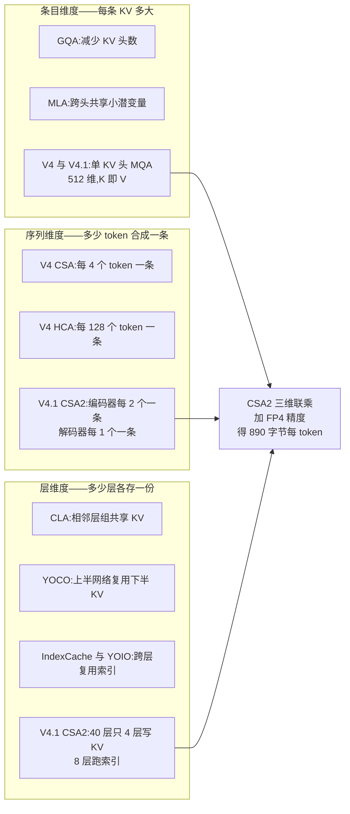
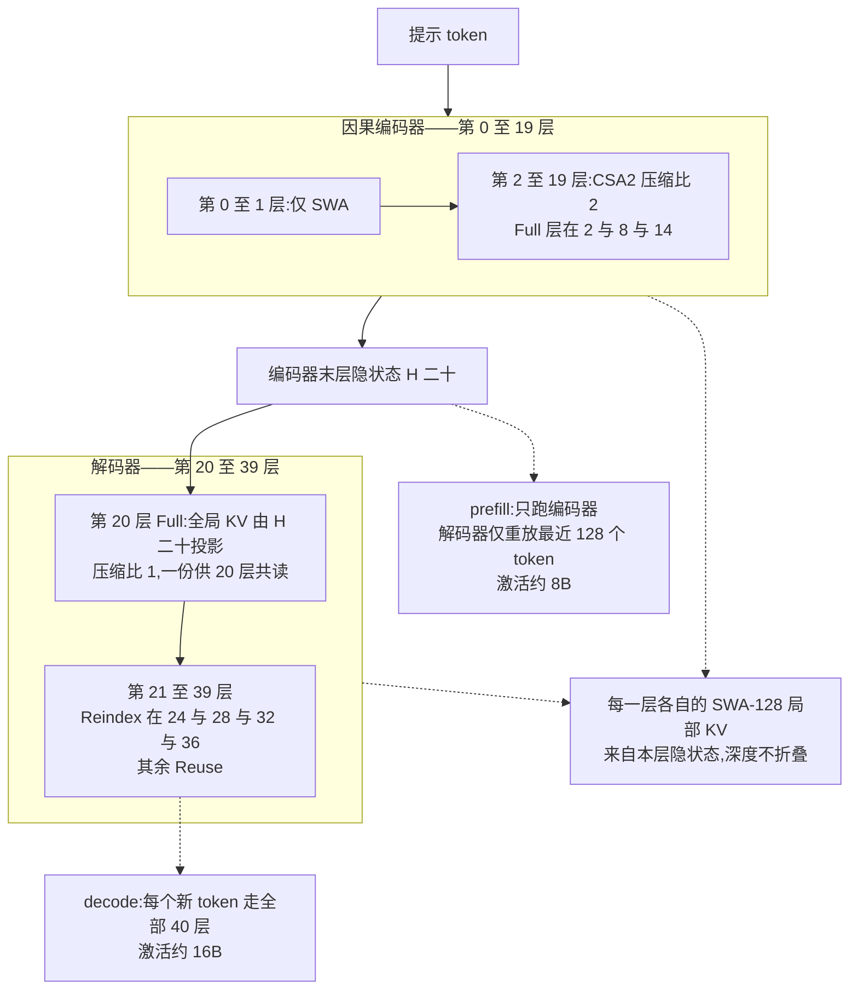
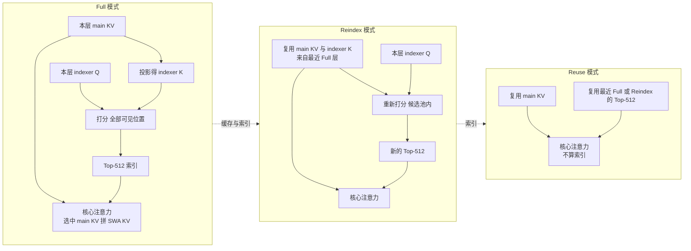
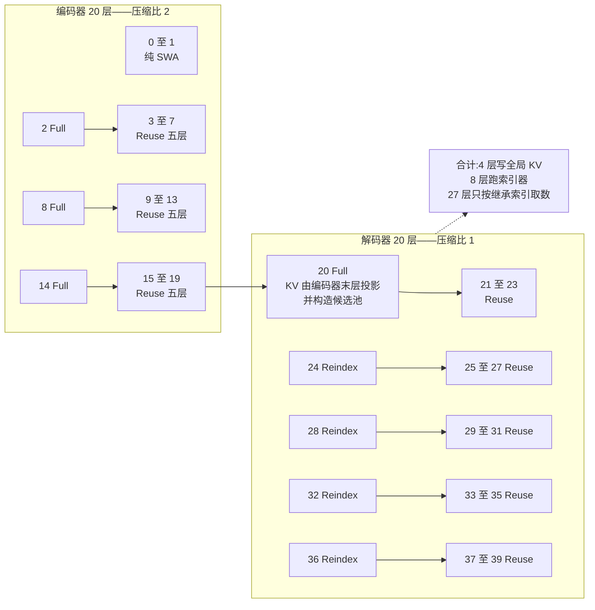
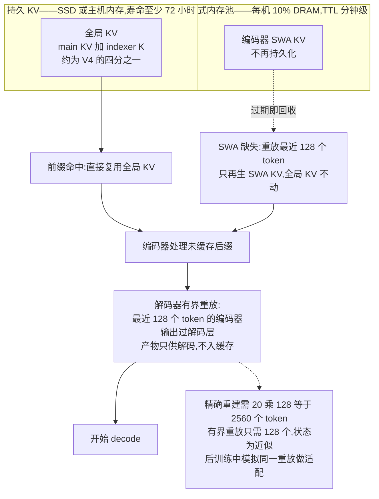

# Dispatch 42 · 详解 DeepSeek-V4.1-Flash:因果编码器-解码器、CSA2 跨层复用与 FP4 KV——890 字节的账怎么算

*2026-09-14 · NPU Frontier Dispatch · DeepSeek-V4.1-Flash / CED / CSA2 / FP4-KV / KV-cache / agent-harness*

> **TL;DR** — DeepSeek-V4.1-Flash(2026-09-10,MIT)的技术报告标题就是全部论点:《Pushing the Limits of KV Cache Compression》。它不是更强的模型,是把 **KV cache 从"算力问题"改写成"存储与通信问题"**后给出的一整套解。三刀叠加:**① CED(因果编码器-解码器)**——40 层拆成 20 层因果编码器 + 20 层解码器,**解码器的全局 KV 由编码器末层隐状态投影而来**(`C_l = H_{L/2} W_l^KV`),于是 prefill 只需跑下半个网络,**每 token 激活 8B(prefill)对 16B(decode)**;**② CSA2**——每个注意力层静态指派 Full / Reindex / Reuse 三模式之一,**40 层里只有 4 层写全局 KV**(第 2、8、14、20 层),8 层跑索引器,27 层只按继承的索引取数;解码器再加一个**层级稀疏索引器**,把后续索引限制在首个 Full 层构造的 16,384 位置候选池内,索引成本与上下文长度解耦;**③ FP4 main KV**——E2M1 + 每 16 通道一个 E4M3 scale(NVFP4 布局去掉全局 scale),每条 288 字节,配 68 字节的 MXFP4 indexer K。三者相乘得到官方的 **890 字节/token**:**(288 + 68) × (3 × 1/2 + 1) = 534 + 356 = 890**——三个编码器 Full 层压缩比 2、一个解码器 Full 层压缩比 1,本站按 FlashMLA 与 SGLang 的字节布局逐项复核,**精确吻合**。对照 V4-Flash 的约 3,514 字节(约 1/4)与 DeepSeek-V1 的 389,120 字节(1/437),叠加 **SWA Bounded Replay**(只重放最近 128 个 token 而非精确所需的 20 × 128 = 2,560 个)后**持久 KV 再降到 1/8**。代价写在论文自己的局限一节里:CSA2 的选择错误与 SWA 状态的近似重建"可能在未测试的边界情形导致能力退化",且"分数接近 Fable-5 与 GPT-6 Astra 不代表在最难任务上达到前沿"。评测侧最有价值的不是那张 20 行 × 7 列的厂商表,而是 **DeepSeek 自己给出的 8 种 scaffold 对照**:同一个模型,DeepSWE 在 Codex 下 65.6、在 mini-SWE 下 74.2,**harness 即分数**这一命题首次由厂商自证。第三方口径则相反:Artificial Analysis 指数 **40(v4.3 口径)**,比自家 V4-Pro 高 4 分,但**低于 GLM-5.3-Flash 的 42、离前沿 13 分**,且跑指数的成本更高(476.89 对 280.28 美元,因为多生成 39% 的 token);**Vals.ai 用中立 harness 重跑 Terminal-Bench 2.1 只得 74.53,比厂商的 90.6 低 16 分**——harness 分差同时由厂商与第三方两侧证实。三处更正流传说法:**V4-Pro 退役已于 09-11 被 DeepSeek 撤回**;**SWE-bench Verified 79.0 与 LiveCodeBench 91.6 是 V4-Flash 的数字**,V4.1 未报告;**总参数是 552B 主干 + 196B Engram**。

本篇性质:详解篇(一路官方 repo 与文档 + 一路 SGLang/vLLM/FlashMLA 源码 + 五路机制级定向调研,全部来源带 URL)。承接 D05(V4 的 CSA + HCA 混合注意力)、D16(V4 的 agent 后训练)、D29(DeepSeek Harness)与 D41(Prime Agent 的 harness 论证)。

---

## 1 · 问题陈述:agent 负载下,KV cache 是存储与通信瓶颈

技术报告开篇的判断值得逐字保留:先前的稀疏注意力工作(V3.2 的 DSA、V4 的 CSA/HCA)"显著降低了长序列处理的计算成本,**使持久存储与数据搬运成为日益突出的瓶颈**"。具体到部署,V4 的 KV 分两类:**全局 KV**(main KV + indexer K)随序列长度增长,受 HBM 容量约束;**持久 KV**(为前缀复用而落盘的部分)受 SSD 与主机内存约束;I/O 与互连带宽再限制缓存的迁移与加载。窗口固定的 SWA KV 不随长度增长,所以序列足够长时**全局 KV 主导运行时开销**。

V4.1-Flash 的目标因此被定义为"**更激进的 KV cache 压缩**",手段是架构、缓存精度、部署策略的联合优化。这个定义决定了它的一切取舍:它宁可接受近似重建与选择错误的风险,也要把每 token 的字节数压到三位数。

### 图 A · 三个乘法维度:CSA2 同时覆盖



## 2 · 先看 V4 基座:V4.1 改的是什么

V4.1 的全部增量都建立在 V4 的一套不寻常设计上,SGLang 主线的 `deepseek_v4.py` 与其配置类给出了最可靠的读法([模型文件](https://raw.githubusercontent.com/sgl-project/sglang/main/python/sglang/srt/models/deepseek_v4.py)、[配置](https://raw.githubusercontent.com/sgl-project/sglang/main/python/sglang/srt/configs/deepseek_v4.py)):

| V4 组件 | 机制 | 与 V3 系的差异 |
|---|---|---|
| **单 KV 头 MQA** | `num_key_value_heads = 1`,`head_dim = 512`(448 无位置 + 64 RoPE),64 个 query 头共读**同一个 512 维向量,既当 K 也当 V** | 取代 MLA:无独立 V,每 token 512 而非 576 字节;代价是 V 带了 RoPE,故在注意力输出上再乘**共轭 RoPE**(FlashMLA 称 "O-RoPE (conjugate)")抵消绝对位置泄漏 |
| **低秩 Q 与分组低秩 O** | `q_lora_rank 1024`;输出拆 `o_groups = 8` 组各投到 `o_lora_rank 1024`,再合成 | 避免 32,768 × 4,096 的稠密输出投影 |
| **CSA / HCA 混合** | 逐层 `compress_ratio ∈ {0, 4, 128}`:0 = 纯 SWA-128;4 = 压 4× + C4Indexer 选 top-512;128 = 压 128× 后稠密全看 | D05 已详解;压缩是**带可学习门控与块内位置偏置的 softmax 加权池化**,压 4× 的块有重叠(8 个 token、步长 4) |
| **每层 SWA-128 + 注意力 sink** | 每层保留 128 token 的滑窗分支,每头一个可学习的 sink logit | 让头在长稀疏上下文里"无处可看"时有出口 |
| **mHC 超连接** | 残差流拓宽为 `hc_mult = 4` 条,每个子层前用 20 步 Sinkhorn 得到双随机混合矩阵 | ByteDance Hyper-Connections 的流形约束版(DeepSeek,2025-12) |
| **哈希路由层** | 前 `n_hash_layers = 3` 个 MoE 层按 token id 查表选专家(`HashTopK`),门控只给权重 | 取代 V3 的稠密引导 FFN,天然负载均衡 |
| **路由** | `sqrtsoftplus` 亲和度 + `noaux_tc` 无辅助损失偏置,`routed_scaling 1.5`,256 路由 + 1 共享,选 6 | 取消 V3 的节点限制路由 |
| **KV 字节** | SGLang 内存池断言 **584 字节/条**:448 FP8 + 64 × 2 BF16 RoPE + 8 字节 scale | V3.2 稀疏解码为 656 字节 |

**V4 → V4.1 的增量清单**(配置文件镜像 + 技术报告 §2、§4.2.1):

- 深度与宽度:43 层 → **40 层 = 20 编码 + 20 解码**;hidden 4,096 → **5,120**;专家中间维 2,048 → **2,304**;路由专家 256 → **384**;`q_lora_rank` 1,024 → **1,280**;索引器头 64 → **32**。
- 注意力:CSA/HCA(比 4/128)→ **纯 CSA2(编码器比 2、解码器比 1)**,去掉块重叠与块内绝对位置嵌入,**indexer K 改由 main KV 投影**而非从隐状态单独压一路;三模式静态分配;层级稀疏索引器。
- 精度:main KV FP8 → **FP4**;SWA KV 保持 FP8。
- 移除:每头 Q-norm、哈希路由层(vLLM 的 V4.1 配置 `num_hash_layers = 0`)、预训练期 MTP。
- 新增:**Engram 条件记忆 196B**(第 1、14 层)、**DSpark** 半自回归投机解码(后训练阶段单独训练)、**Single-Pass mHC**(Mega-mHC 融合核)、head-wise Muon、Sinkhorn 均衡的嵌入更新。
- 多模态:**DeepSeek-ViT**(32 层、hidden 1,024、patch 14、3 × 3 pixel-unshuffle、最多 1,024 个图像 token),从语言模型预训练一开始就联合处理。

## 3 · 第一刀 CED:解码器的全局 KV 从编码器投影

### 机制

报告 §2.2 写明动机:agent 工作流中频繁的工具调用产生大量 prefill 请求,KV 未命中时计算开销严重;设计**受 YOCO(Sun 等,2024)启发**——YOCO 让上半网络直接共享下半网络生成的 KV。CED 在此之上"引入一系列结构改进以增强 KV 容量与 KV 生成的计算深度"。

核心是一条公式。把 40 层的下半(l ≤ 20)当作因果编码器;对上半(解码器,l > 20),**全局注意力的 KV 不由本层隐状态 H_l 推出,而是用逐层的投影矩阵直接从第 20 层隐状态 H_{L/2} 投影**:

```
C_l = H_{L/2} · W_l^KV ,   Z_l = H_{L/2} · W_l^Z ,   l > L/2         (Eq. 1)
```

C 是 KV 条目,Z 是对应的压缩权重。结论直接:**prefill 阶段只需计算前一半的层**,上半层的全局 KV 以极小代价投影获得。

但 **SWA 保持逐层计算**:任意层 l 的局部 K/V 仍来自本层的 H_l。报告说这"有效增加了局部 KV 生成的计算深度"——也就是说 CED 只把**全局分支**折叠到编码器,**局部分支保留完整的 40 层深度**。这是它与 YOCO 的第一处区别。

### 三个必须说清的细节

**① 与 CSA2 叠加后,"逐层投影"实际只剩一层。** Eq. (1) 形式上允许每个解码层各有一组 W_l。但 CSA2 的模式分配让只有 Full 层拥有压缩器,而解码器里**只有第 20 层是 Full**(`kv_source_layer_ids = [2, 8, 14, 20]`)。所以生产模型里"投影"就是第 20 层的压缩器:5,120 → 512 线性、RMSNorm、64 维 RoPE、量化为 FP4 写入一次;同一潜变量再经 wk(512 → 128)+ norm 成为共享的 indexer K。**20 个解码层共读这一份全局 KV**;每层仍各自持有 query 路径、注意力 sink、输出投影、SWA K/V 与 MoE。

**② 8B 与 16B 是怎么来的。** 每层激活参数约 16B / 40 ≈ 0.4B(6 + 1 个专家 × 3 × 5,120 × 2,304 加注意力)。**8B 恰是 20 层**——prefill 时提示 token 只过编码器。但解码器的 SWA KV 在解码前几步是需要的:精确重建要把 20 个解码层跑过最近 **L/2 × n_win = 20 × 128 = 2,560** 个提示 token。**Decoder SWA Bounded Replay** 改为只把最近 **128** 个提示 token 的编码器输出送过解码层、SWA 在重放边界截断,结果**只用于解码、不用于前缀缓存**。报告承认这"**在数学上不等价于**完整的解码器前向",但"对响应质量的影响可忽略",并在后训练中**模拟同一重放过程**做训练侧适配。复杂度由 O(NL) 降到 **O(NL/2 + n_win × L/2) ≈ O(NL/2)**。

**③ 为什么必须是因果编码器。** 编码器隐状态、乃至投影出的解码器 KV,对第 i 个 token 只依赖 ≤ i 的 token。所以前缀缓存"只依赖全局 KV",追加后缀时缓存的全局 KV"**无需重算或覆写**";分块 prefill、流式输入、多轮追加都成立;整个网络照常按下一 token 预测训练。T5 式的双向编码器会在每次追加时让全部缓存作废。唯一的双向例外是视觉变体里的图像片段,作为 prefix-LM 块整体 prefill。

### 图 B · CED 的两条 KV 通路



### 谱系

YOCO(2024-05,"You Only Cache Once":自解码器 + 交叉解码器,prefill 提前退出)是报告明示的灵感;Cross-Layer Attention(Brandon 等,2024)给出相邻层共享 KV 的模式;Block Transformer(2024)与 GoldFinch(2024)是"全局粗粒度 + 局部细粒度"分工的两个近亲;Wu 与 Tu(2025)的跨层 KV 共享系统研究把这些归为一个分类,CED 属于"下半 KV 供上半共享"这一格。DeepSeek 内部谱系是 MLA → DSA/lightning indexer(V3.2)→ CSA + HCA(V4)→ CSA2 + CED(V4.1);V4 报告里的 "Zero SWA Caching"(精确重放 L × n_win)是 V4.1 有界重放的直接前身。

## 4 · 第二刀 CSA2:三模式、四个 KV 源层、一个候选池

### 为什么要在层维度上动手

报告 §2.3 把成本拆成**三个乘法维度**:条目大小(GQA、MLA)、序列(V4 的 CSA/HCA 每 m 个 token 合一条)、层(某些层复用其他层的缓存与选择)。已有工作各占一维:IndexCache 跨层复用 top-k 索引以省索引计算,YOIO 全网只算一次稀疏路由,HySparse 让稀疏层复用稠密层的 KV。但"**仅复用索引省不了 main KV 存储,全网共享路由限制性能,混合设计仍保留全注意力层;更重要的是,没有一种方法覆盖全部三个维度**"。CSA2 的立场是同时做三件事,且**缓存共享与索引复用解耦**。

### 三个模式

每个 CSA2 层被**静态**指派一种模式;三种模式下每层都算自己的 query 与 SWA KV,区别只在如何获得 main KV、indexer K 与 Top-K 索引:

| 模式 | main KV | indexer K | Top-K 索引 | 计算 |
|---|---|---|---|---|
| **Full** | 自算 | 由本层 main KV 投影 | 自己的 indexer Q 打分,选新的 Top-512 | 完整 CSA2 路径,职责等同 V4 的一个 CSA 层 |
| **Reindex** | 复用最近 Full 层的 | 复用最近 Full 层的 | 用**自己的** indexer Q 重新打分,选新 Top-512 | 缓存共享不变,选择可逐层变化 |
| **Reuse** | 复用最近 Full 层的 | 不需要 | 复用最近 Full 或 Reindex 层的 | 不算 indexer Q、不评分,直接稀疏注意力 |

**当 CSA2 与 CED 叠加,解码器中被指派 Full 的那一层用第 20 层(编码器末层)的隐状态算自己的全局 KV;Reindex 与 Reuse 不变。**

### 图 C · CSA2 三模式的数据流



### 生产模型的层拓扑

配置文件镜像([hub config](https://raw.githubusercontent.com/PipeNetwork/deepseek-v41-mlx/main/docs/reference/hub_config.json))把分配写死了:

```
compress_ratios      = [0, 0] + [2] × 18 + [1] × 20   (+ [0, 0, 0] 给 3 个 DSpark 层)
kv_source_layer_ids  = [2, 8, 14, 20]                  ← 只有 4 层写全局 KV
index_source_layers  = [2, 8, 14, 20, 24, 28, 32, 36]  ← 8 层跑索引器
candidate_source     = 20;  2048 blocks × 8 = 16,384 个候选位置
index_topk = 512;  sliding_window = 128;  indexer 32 heads × 128 dims
```

即:**编码器** 18 个 CSA2 层分 3 组 × 6(1 Full + 5 Reuse),压缩比 2;**解码器** 20 层分 5 组 × 4(第一组 Full + 3 Reuse,后四组 Reindex + 3 Reuse),压缩比 1。40 层里 **4 层写 KV、8 层跑索引、27 层只取数**,另 2 层纯 SWA。vLLM 主线的 `deepseek_v4_1/attention.py` 的注释与之一致:"compress_ratios has one entry per layer … 0 = pure sliding window, 1 = full-length compressed cache … only on `kv_source_layer_ids`; indexers only on `index_source_layer_ids`. Consumers reuse the most recently …"。

### 图 D · 40 层的模式分配



### 层级稀疏索引器

跨层索引复用减少了索引器**次数**,但剩下的索引器仍要对全部因果可见上下文打分,超长上下文下仍是主要瓶颈。报告的观察是:**在解码器里,浅层索引器的信息可以天然地约束深层索引器的候选集,不需要任何额外状态**。做法:解码器第一个 Full 层(第 20 层)选出自己的 Top-512 后,以**块的最大索引分**选出 2,048 个 8-位置的块,构成 16,384 位置的**共享候选池**;后续 Reindex 层只在池内打分。候选池固定大小时,深层索引器的每 query 成本**由随上下文线性变为常数**。只用于 CED 的解码器,目的是减少 decode 期的重复打分。代价是明确的:**Reindex 层的召回上限被第 20 层的选择封顶**。

### 简化项

相对 V4 的 CSA,CSA2 做了三处简化,报告的理由是"简化实现并提高训练效率":压缩比 m 的每条 main KV 不再由 2m 个重叠的源条目生成(去重叠);去掉编码 2m 个源位置的绝对位置嵌入;indexer K 改为**投影 main KV 条目**,取代 CSA 从隐状态单独压一路。vLLM 的 V4.1 压缩器把最后一点做成了断言:压缩比 1 时"checkpoint 不带门控"(`has_gate = compress_ratio > 1`),压缩比 2 时才有 softmax 门控池化。

## 5 · 第三刀 FP4 main KV:存储用低精度,计算不用

报告 §2.4.4 的框架先说清一件事:V4 已经用 QAT 把**索引器**的 Q/K 做成 FP4,那是为了**加速索引计算**;V4.1 把 QAT 扩展到 **main KV**,这里 FP4 **"减少存储而不是加速矩阵乘"**——缓存值在注意力前先反量化,所以可以选更准的格式,而**不要求硬件原生支持该格式的矩阵乘**,"保持跨硬件平台的兼容性"。这一句对昇腾侧是关键(见 §12)。

**格式选择。** 在评估过的约四比特格式中选 **E2M1 + 每 16 通道一个 E4M3 scale**,"遵循 NVFP4 但**省略其第二级全局 scale**以平衡精度与简洁"。省略的理由是量化上界的算术:该格式可表示的最大幅值为 448 × 6 = **2,688**;而 V4.1 训练出的最大 RMSNorm 权重约为 1,RMS 归一化后 512 维 KV 潜变量的 L2 范数至多约 √512 ≈ **22.6**,RoPE 保范,所以旋转后任一通道的最大绝对值也以约 22.6 为界;训练中观测到的最大幅值约为 **10**。上界比需求高两个数量级,"省略全局 scale 不造成可测的精度下降"。

**三个工程决定。** ① QAT 在**后训练**阶段引入;② 非 RoPE 与 RoPE 分量用同一量化格式,且**在 RoPE 之后量化**——RoPE 之前量化"只带来边际精度改善,却会在解码时引入额外开销";③ **SWA KV 保留 FP8**,"因其对量化敏感"。

**与 V4 索引器的 FP4 是两种布局。** 一处几乎没有报道指出的区别:V4(与 V4.1)的 **indexer K 用 OCP 标准 MXFP4**(E2M1 + 每 32 个值一个 UE8M0 scale;128 维 → 64 + 4 = **68 字节**),报告说选它是"为了支持尽可能多的硬件平台,尽管我们实验中其他格式更准";而 **main KV 用的是 NVFP4 微块布局**(E4M3 scale、每 16 个值;512 维 → 256 + 32 = **288 字节**)。前者要参与索引器的低精度点积,所以选硬件通用格式;后者只是存储、用前反量化,所以可以选更准的格式。SGLang 与 vLLM 的代码都实现了这两套字节数(`get_dsv4_indexer_bytes_per_token`、`_indexer_k_cache_head_dim`)。

**谱系。** 条目缩减来自 GQA → MLA;块缩放四比特格式来自 OCP MX(2023)与 NVIDIA NVFP4(2025);训练期容忍来自 QAT(Jacob 等,2018);KV 专属的亚 8 比特缓存来自 KVQuant / KIVI(2024,训练后、逐通道或逐 token),V4.1 用 QAT + 硬件标准微块取代之;稀疏解码的 FP8 KV 来自 V3.2 / FlashMLA(2025)。

## 6 · 890 字节的账

官方只给了结论——"全局 KV cache 占用(始终在 HBM)降到 **890 字节/token**,约为 V4-Flash 的 1/4"。本站按 FlashMLA README 的 V4.1 字节布局与 §4 的层拓扑逐项复核:

```
每条全局 KV(Full 层)     = 288 (FP4 main KV) + 68 (MXFP4 indexer K) = 356 字节
编码器 3 个 Full 层,压缩比 2:   3 × 356 / 2 = 534 字节 / 原始 token
解码器 1 个 Full 层,压缩比 1:   1 × 356 / 1 = 356 字节 / 原始 token
合计                                        = 890 字节 / 原始 token   ✓
```

**精确吻合。** SGLang 团队的优化实录给出同一恒等式 (288 + 68) × (3/2 + 1) = 890。这也说明了 CED 与 CSA2 的分工:**解码器 19 层对全局 KV 的贡献为零**,整个解码器的全局视野是**每 token 一条 512 维 FP4 潜变量**——这是一个很强的容量瓶颈,由 Reindex 模式(每组重选 Top-K)与层级索引器部分补偿。

**两个基线的复核。**
- **V4-Flash ≈ 3,514 字节**(SGLang 表):43 层 = 2 层纯 SWA + CSA(比 4、带索引器)与 HCA(比 128、无索引器)交替;按 V4 的 584 字节主行与 68 字节 indexer K:21 × (584 + 68) / 4 + 20 × 584 / 128 = **3,514.25**,比值 **3.95×**。
- **DeepSeek-V1 = 389,120 字节**:DeepSeek LLM 67B,95 层、GQA 8 个 KV 头、head dim 128、BF16:2 × 95 × 8 × 128 × 2 = 389,120;389,120 / 890 = **437.2**,与图 1(b) 的"437 倍"吻合。

**什么不在 890 里。** SWA KV(FP8,528 字节/行,但每层只保留 128 个位置,不随长度增长)、压缩比 2 层的待配对状态、页对齐填充(FlashMLA 按 512 字节倍数分页、SGLang 的 V4 池按 576 字节)、引擎特定布局。SGLang 团队明确提醒 890 是**逻辑大小**,实际 HBM 用量有别。

**一个必须挂上的前提:890 假设的是 FP4 存储。** FlashMLA 的 V4.1 稀疏解码核**只支持 SM100**,FP4 格式也只对 `extra_k_cache`(压缩注意力缓存)合法。若部署退回 FP8 主行(528 字节)与 FP8 indexer K(132 字节),同一套层拓扑给出 (528 + 132) × 2.5 ≈ **1,650 字节/token**——第三方口径一个运行中的 SGLang FP8 部署实测 **1,670.75 字节/token**,与该算术吻合。换言之 **890 与 1,670 之间差的不是架构而是部署精度**,而 SGLang 与 vLLM 都验证了 8 × H200(Hopper,非 SM100)的配置。DeepSeek 自家机队实际有多大比例跑在 FP4 上,无公开信息。

**跨代对照**(每 token 每层的主行字节,FlashMLA 口径):V2/V3 的 MLA BF16 约 576 × 2 = 1,152 字节 × 60 至 61 层 ≈ 69 至 70 KB/token;V3.2 FP8 稀疏解码 656 字节 × 61 层 ≈ 40 KB;V4 584 字节;V4.1 FP8 528 字节;V4.1 FP4 288 字节。


*图 F · 五代模型每 token 的 KV 字节数(对数轴)。V1 至 V3.2 为本站按公开维度重建的全层 KV;V4-Flash 与 V4.1-Flash 为"全局 KV"口径(不含有界的 SWA KV)。两个口径不完全同质,故只看量级:每一代都在一个数量级上下切,V4.1 把三位数做成了现实。*

## 7 · 部署:持久 KV 降到 1/8 的机制

### SWA Bounded Replay

V4 的部署里 **SWA KV 占了持久 KV 容量的近一半**。它被持久化的原因是多轮会话与重生成需要在提示末尾与输出末尾两个点恢复状态。但它的访问模式与持久缓存的长保留策略不匹配:全局 KV 有长尾复用,SWA KV 只在活跃会话内分钟级的窄窗口里被复用,会话结束或下一轮开始即死。V4 报告提出过 **Zero SWA Caching**(不存、缺了重算),但精确恢复需要对 **L × n_win** 个 token 做完整前向,"在生产部署中成本过高"。

V4.1 的答案:**只重放最近 n_win = 128 个 token,并把 SWA 截断在重放段内**,接受近似状态——位置 s 起重放时,位置 i 的 query 只看 [max(s, i − W + 1), i] 内的 SWA 键。两个应用面:

- **Encoder SWA Bounded Replay**:让前缀缓存**只依赖全局 KV**。编码器 SWA KV 缺失时,重放缓存前缀的最后 128 个 token 并与未缓存的后缀一起处理;重放的 token 只再生 SWA KV,全局 KV 直接复用不重算不覆写。后缀的全局 KV 与 SWA KV 因此**依赖缓存命中位置、跨位置不逐位相同**,官方称"实验证据确认几乎不损害响应质量"。
- **Decoder SWA Bounded Replay**:见 §3。让 prefill 在编码器处结束,"几乎把 prefill 总计算减半"。

由此持久 KV 的两个乘法因子:**不再存 SWA KV(约减半)× 全局 KV 压到 1/4 = 1/8**。SWA KV 改存在每台机器 **10% 主机 DRAM** 构成的分布式内存池里,TTL 只有分钟级、过期即回收;全局 KV 留在持久缓存,**保证至少 72 小时**寿命。

### 图 E · 两种重放与持久缓存的分层



### 引擎侧的落地

- **EPD 分离**:视觉编码、prefill、decode 三者独立扩缩并重叠执行;Reuse 模式的层 **prefill 只 15 个 kernel、decode 11 个**。
- **SGLang(`dsv4.1` 分支,day-0)**:`late_layer_start = max(kv_source_layer_ids) + 1 = 21`——每个 prefill 块,第 0 至 20 层跑全部 token,第 21 至 39 层只跑每个请求**最后 128 个 token**;prefill 吞吐 **1.56×(8 × H200)、1.37×(4 × GB300)**,AIME 2026 pass@1 开关重放均为 453/480。注意 SGLang 让第 20 层完整跑过全部 token(它必须产出共享 KV),提示侧实际是 21/40 层;**vLLM 主线目前对 prefill 仍跑全部 40 层**,CED 的收益只剩 KV 共享。
- **DSpark**:SGLang 在 4 × GB300 上 BS = 1 解码 **229.89 → 761.71 tok/s**(模拟接受长度 5.5);Engram 表卸载到主机后 KV 容量 **+36%**,Engram 落盘 **189 GiB**。
- **FlashMLA(2026-09-10)**:V4.1 的 prefill 与 decode 核,FP8 或 FP4 KV;解码核按每 token 字节数(584 / 528 / 288)自动识别格式;**288 字节的 FP4 格式只接受 `extra_k_cache`(压缩注意力缓存),`k_cache`(SWA)保持 528 字节 FP8**——与论文的精度分工逐字对应;**V4.1 的稀疏解码仅支持 SM100**,融合 norm-RoPE-attn-RoPE-cast 核仅 sm100/sm103;B200 上融合核 1,430 TFLOPS prefill / 670 decode。
- **DeepGEMM(2026-09-10)**:Sparse Indexer、Mega Gate、Mega mHC 与 DeepJIT;**TileKernels**:FP8/FP4/E5M6 量化算子。

## 8 · 其余组件:Engram、DSpark、Single-Pass mHC 与优化器

- **Engram 条件记忆(196B)**:两个模块在第 1 与第 14 层,按 token 的 n-gram(阶 2 至 4)哈希查表,8 个哈希头 × 256 维,每张表约 3.84 亿条、压缩词表 99,092,FP8 存储。谱系是 Cheng 等(2026-01,PKU + DeepSeek)的 "Engram: Conditional Memory via Scalable Lookup"。这是"552B 主干 + 196B Engram"两个数字的来源——**总参数约 748B,激活参数不计 Engram 查表**。
- **DSpark 投机解码**:3 个 Transformer 块的草稿器(SWA-128),一次前向并行给出 **5 个草稿位置**的基础 logits,轻量 **Markov 头**(秩 256)建模草稿 token 间依赖,**置信度头**预测各位置的条件接受概率以估计前缀存活概率,调度器结合引擎吞吐曲线为每个请求**动态选择验证长度**。与 V3 的 MTP 不同,DSpark **在预训练后单独阶段训练、主干冻结**;后训练期继续与主干一起训但**不把 DSpark 的梯度传回主干**,使其始终对齐当前策略,同时加速在线服务与 RL/OPD 的 rollout。草稿 MoE 为 128 路由专家选 3。
- **Single-Pass mHC**:把输入混合系数后移一个块(用 A_{l−1}),使残差更新、系数预测与混合能融合进一个分块 kernel(Mega-mHC),激活流量由原四核实现的 (4n + 4)d 降到 **(2n + 2)d**,"减半"。
- **优化器**:**head-wise Muon**——Query 权重按头拆分后再做 Muon 更新,"为不同的头提供不同的预条件子",报告称该优势在 GLM 5 与 Kimi-K3 中亦得到验证;Engram 表、token 嵌入与预测头改用动量法并以 Sinkhorn 均衡更新,避免 Adam 状态的显存开销。

## 9 · 训练:45T token,稀疏注意力从头训

- 预训练 **45T 多模态 token**,"无不稳定";批大小固定 **100.6M token**;学习率 2.6e-4 保持到 28T,余弦降至 2.6e-5 于 40T,再平稳到 45T。**稀疏注意力从头在 64K 序列上训练,不经任何稠密注意力预热阶段**;**34T 处扩展到 1M**。
- 基座对照:V4.1-Flash-Base 以 **1/3 总参数与 1/4 激活参数**取得与 V4-Pro-Base 相当的知识、推理与编码能力,held-out 评测提升 5% 至 10%。逐项看有得有失:MMLU-Pro **74.1**(V4-Pro 73.5)、HumanEval **79.4**(76.8)、GSM8K **93.0**(92.6)领先;SimpleQA-Verified **42.3 对 55.2**、MultiLoKo 45.5 对 50.9、**LongBench-V2 45.2 对 51.5** 落后——最后一项是长上下文检索,恰是 CSA2 与 FP4 最可能伤及的维度,与结论一节承诺重点压测"长上下文稀疏检索"相呼应。
- 后训练:报告自述"**不引入算法创新**",SFT → RL → OPD 沿用 V4 做法;所有实质变化在数据管线——大规模自动化的 agent 任务与环境合成,渐进扩大 RL 的数据、任务与 rollout 规模。DSec 沙箱基建负责大规模跑 agent。
- **可连续控制的推理努力(1 至 100)**:训练中以指数 token 惩罚实现;API 的 low / high / max 对应 **50 / 75 / 100**。25 → 100 时八项推理平均 **67.1 → 76.3**,DeepSWE **66.0 → 74.2**,TB 2.1 **82.4 → 90.6**,输出 token 约 **2.5×**;AIME 2026 在 100 档达 100%(token 4.6k → 11.4k),MathArena Apex 25.3 → 65.6(29.1k → 86.1k)。**所有头条数字都是 max 档的数字。**

## 10 · 评测:厂商表、scaffold 对照与第三方

### 厂商表(技术报告表 3 = 模型卡"与前沿模型对比",全部 Max 推理努力)

| 基准 | Opus-5.0 | GPT-5.6 Sol | K3 | GLM-5.3 | V4-Pro | V4-Flash | **V4.1-Flash** |
|---|---|---|---|---|---|---|---|
| GPQA Diamond | 93.4 | **94.1** | 92.9 | 88.1 | 92.4 | 89.9 | 90.9 |
| HLE | **56.3** | 44.5 | 43.5 | 42.0† | 42.7† | 37.8† | 36.8(39.1†) |
| Codeforces(内部评级) | — | — | — | — | 3348 | 3289 | **3471** |
| MathArena Apex | — | — | **65.6** | — | 65.3 | 58.6 | **65.6** |
| Terminal Bench 2.1 | 89.1 | 88.8 | 88.3 | 88.2 | 87.9 | 82.7 | **90.6** |
| Terminal Bench 3.0 | **43.3** | 34.4 | 17.7 | 28.3 | 11.8 | 7.6 | 30.0 |
| Terminal Bench 4.0 | **51.8** | 39.9 | 12.6 | 37.9 | 12.4 | 7.0 | 31.2 |
| DeepSWE v1.1 | 74.0 | 73.0 | 67.5 | 66.9 | 62.7 | 54.4 | **74.2** |
| ProgramBench(Almost@1) | **37.0** | 23.0 | 17.5 | 19.0 | 15.5 | — | 20.3 |
| NL2Repo-Bench | **75.3** | 56.8 | 58.0 | 58.0 | 61.5 | 54.2 | 64.0 / 65.4 |
| CyberGym | — | 84.5 | 80.0 | 84.5 | 83.3 | 76.7 | **88.1** |
| SEC-Bench Pro | — | **74.3** | — | — | 56.4 | 30.9 | 62.8 |
| ExploitGym | 22.1 | **33.7** | — | 15.0 | 5.4 | 1.8 | 15.3 |
| HLE w/ tools | 63.6 | — | 59.8 | 62.5 | 60.0 | 51.5 | **63.9** |
| AutomationBench | 50.3 | 45.8 | 46.7 | 48.8 | 43.2 | 37.7 | **54.8** |
| Agents' Last Exam | 28.6 | 26.7 | 27.6 | 28.5 | 25.7 | 25.2 | **31.8** |
| Chartography w/ tools | **84.0** | 79.9 | 68.1 | — | — | — | 78.9 |
| BabyVision w/ tools | **94.1** | 88.9 | 85.7 | — | — | — | 89.6 |
| ZeroBench-main w/ tools(Pass@5) | 52.0 | **53.0** | 41.0 | — | — | — | 49.0 |

† 为 HLE 纯文本子集。**设置**:`reasoning_effort = 100`,`temperature = 1.0`,`top_p = 0.95`;代码 agent 基准(TB 2.1/3.0/4.0、DeepSWE、NL2Repo、ProgramBench)在 **DeepSeek Harness Minimal 模式 + 1M 上下文**下测,DeepSWE 头条数字改用 **mini-SWE** 以对齐官方口径;视觉 agent 基准用 **Claude Code + 512K**;ALE 与 AutomationBench 用各自官方 scaffold。

**读表的四条纪律。** ① 表里**没有** AIME、LiveCodeBench、SWE-bench Verified/Pro、tau-bench、MMLU-Pro、SimpleQA、MMMU 等——报告的解释是"后训练评测聚焦推理与 agent,知识型能力主要由预训练决定、见基座表"。**流传的 SWE-bench Verified 79.0 与 LiveCodeBench 91.6 是 V4-Flash 的数字**,HMMT 2026 的 94.8 也是 V4-Flash Think Max 的。② **HLE 一行不同质**:V4.1 报全集 36.8 与文本子集 39.1,GLM-5.3 与两个 V4 只有文本子集,Opus-5 与 Sol 未标注。③ **NL2Repo 一格两值**:模型卡印 64.0,技术报告与 API 变更日志印 65.4,官方未调和。④ V4-Flash 列即 07-31 变更日志的数字,V4-Pro 列即 08-13 的数字——**AutomationBench 例外**,被上调(V4-Pro 31.8 → 43.2、V4-Flash 25.1 → 37.7),疑为基准版本升级。

**分域结论**与 09-11 的判断一致且更清晰:**编码与 agent 执行类打平或小胜闭源前沿**(TB 2.1、DeepSWE、CyberGym、AutomationBench、ALE、HLE 带工具),**难推理与专家知识类差距显著**(TB 3.0 落后 Opus-5 13.3、TB 4.0 落后 20.6、ProgramBench 落后 16.7、NL2Repo 落后 11.3、HLE 落后 19.5)。报告自己的表述是:"科学导向、需要专家级领域知识的 agent 任务(如 Terminal-Bench 4.0)与巨型模型仍有差距"。


*图 G · 与 Opus-5 逐项的分差。右侧(蓝)为 V4.1 领先,左侧(红)为落后。领先项全部在 +0.2 至 +4.5 之间,落后项最深到 −20.6——**赢得少、输得多,但赢在使用频率最高的那几项**。厂商口径,Max 档,harness 见上表说明。*

### scaffold 对照:harness 即分数的厂商自证

技术报告表 4 是本篇最值得带走的一张表。**同一个 V4.1-Flash、同一组设置**(Max 档、N = 8 / N = 3、Linux 容器、1M 上下文、max_steps = 500):

| 基准 | Claude Code | Codex | OpenCode | Pi | mini-SWE | DSH Minimal | DSH Standard | DSH PTC |
|---|---|---|---|---|---|---|---|---|
| DeepSWE v1.1 | 69.8 | 65.6 | 65.5 | 66.2 | **74.2** | 72.6 | 70.5 | 67.6 |
| Terminal Bench 2.1 | 88.0 | 84.1 | 85.0 | 86.1 | 90.3 | **90.6** | 85.8 | 85.8 |

DeepSWE 跨 scaffold **8.7 分**,TB 2.1 **6.5 分**——与 D29 记录的"同一模型跨 harness 分差 5 至 15 分"、D30 的 9.5 至 36 分区间同一量级。且**DSH 自家三档相差 5 分**:Minimal(单一 bash 工具)最高,加了工具与 PTC 的 Standard/PTC 反而更低——印证 D29 的判断:Minimal 是训练分布的复现,分数在这里产生。表 5 还给了 **Claude Code 四个版本**(v2.1.105 至 259)的敏感性:DeepSWE 68.4 至 69.8、TB 2.1 87.3 至 88.4——**同一 harness 换版本即漂移约 1.5 分**。

D41 记录 Prime Agent 用开源 harness 把 Opus 5 的 ARC-AGI-3 从 30.2 抬到 95.24,D39/D40 记录 OpenAI 用自家适配层把 Astra 从 62.7 抬到 99.9;**本篇是第三个样本,且第一次由厂商在自己的技术报告里把八种 harness 并排印出来**。结论一节把"model–harness co-design"列为未来方向——与 D29 的 "Model + Harness = Agent" 一脉相承。


*图 H · 八种 scaffold 下的两项分数。横轴分数,纵轴 scaffold;蓝点 DeepSWE v1.1,橙点 TB 2.1。DSH Minimal 与 mini-SWE 分居两项之首,Codex 与 OpenCode 居末;DSH 自家三档相差 5 分。全部为厂商自报、同一设置。*

### 多智能体与努力档

- **DSH Agent Team 模式**(初步):ProgramBench golden-172 上多智能体 13.59%(1 小时)→ **30.04%(8 小时)**,单智能体 12.79% → 20.39%;FrontierSWE v2(无 GPU)多智能体 13.50% → **32.90%(20 小时)**,单智能体 10.50% → 28.20%。挂钟预算是这里的自变量。
- 报告称 V4.1-Flash"能完成超过 95% 的真实任务",同时在结论中限定:"基准分差虽窄,**不意味着在复杂高难推理与边界情形上匹敌前沿闭源系统**"。

### 第三方口径

**先说标度。** Artificial Analysis 在 09-04 发 v4.2 之后,约 **09-06 又发了 v4.3**(Terminal-Bench 2.1 换 4.0、τ³-Banking 换 AutomationBench-AA)。**三套标度并行流通**:Fable 5.1 在 v4.1 / v4.2 / v4.3 上分别是 66 / 57 / 53;Flash 档模型跨版本掉得更多——GLM-5.3-Flash 57 → 42、Gemini 3.8 Flash 59 → 41、DeepSeek V4-Flash 50 → 35(15 至 18 分)。V4.1-Flash 是 v4.3 上线后才被评的,**它的 40 是 v4.3 数字**,只能与 v4.3 同伴比较——这解决了 09-11 留下的"标度待核"。

| AA 指数 v4.3(Max 档) | 分 |
|---|---|
| Claude Fable 5.1 / GPT-6 Astra | 53 / 53 |
| Claude Opus 5 / Fable 5 | 51 / 50 |
| GLM-5.3 / Kimi K3 | 45 / 44 |
| GLM-5.3-Flash | 42 |
| Gemini 3.8 Flash(high) | 41 |
| **DeepSeek V4.1-Flash** | **40** |
| Qwen3.8 2.4T-A95B / Qwen3.8-Flash-Next | 40 / 40 |
| DeepSeek V4-Pro 0813 / V4-Flash 0731 | 36 / 35 |

四条读法:① **同标度下它确实高于自家 V4-Pro(+4)与 V4-Flash(+5)**——"小模型胜旗舰"在第三方指数上成立;② 但**低于 GLM-5.3-Flash 与 Gemini 3.8 Flash,与两款 Qwen3.8 同分,离开放权重头部 4 分、离前沿 13 分**;③ **成本**:跑完指数生成 **250M token**(GLM-5.3-Flash 180M、Qwen3.8-Flash-Next 240M,中位 130M),成本 **476.89 美元对 280.28 与 362.72**——AA 的评语是 "notably fast, however very verbose";AA 混合价 $0.18/百万 token 用的是**高峰**表价,非高峰会减半;④ **速度**:首方 API 约 **218.7 tok/s**(Baseten 283.9),GLM-5.3-Flash 103.5、Qwen3.8-Flash-Next 50.4;但**首个 token 1.17 秒、首个答案 token 10.36 秒**——推理链吃掉了大部分延迟预算,与冗长的发现一致。

**Vals.ai 是目前唯一一家在中立 harness 下重跑了头条基准的第三方**:Terminal-Bench 2.1 三次完整运行 **74.53%**,对厂商 DSH Minimal 下的 **90.6**——**16 分**。同一家的 Vals Index 把它排在 57.86%(56 个模型中第 15、开放权重第 1,险胜 Kimi K3 的 57.81%),每测试 **0.30 美元对 K3 的 6.47**,是前 15 名里最便宜的。两条结论并不矛盾:**在它自己的训练分布(DSH Minimal)上它是前沿水平,在中立 scaffold 上它是"好的开放权重模型";它的性价比优势在第三方口径下依然成立**。

其余第三方:虎嗅/凤凰 09-09 beta 工作流测试(14 组任务、约 3 亿 token)测得解码约 284 tok/s(约为 V4-Flash 的 3 倍),但模型**自发起了 37 个子代理**、子任务耗掉 1 亿多 token,**同价下总成本比 V4-Flash 高 36%**;OpenDesign Arena 设计任务 81.2 对 Astra 82.7,每设计 0.023 对 1.61 美元;SuperCLUE 7 月补充评测 71.81(未给排名);多家上手测试报告空间与物理类任务失败(魔方"求解"只是逆序打乱、SVG 差于 Astra 与 Gemini 3.8 Flash)与过度思考。**截至 09-14 无 LMArena 文本或代码排名(Agent Arena 显示 "scores coming soon")、无 Epoch ECI、无 swebench.com 官方条目、无 Terminal-Bench 官方榜、无 LiveBench V4.1 行**。OpenRouter 上线 24 小时 1T token,约 90% 为缓存读。

## 11 · 产品与定价:退役、撤回与模型名

- **模型名**:API 改用 `deepseek-flash` 调用最新 V4.1-Flash;**V4 Flash 与 V4 Flash Vision Exp 退役**,`deepseek-v4-flash` / `deepseek-v4-flash-vision-exp` 临时路由到 V4.1 Flash。并发上限 `deepseek-flash` 2,500、`deepseek-v4-pro` 500(按 user_id)。
- **V4-Pro 退役被撤回。** 09-10 公告的原规则是:2026-09-14 12:00(北京时间,即 04:00 UTC)起、直至 V4.1-Pro 发布,所有 `deepseek-v4-pro` 请求路由到 V4.1-Flash 并按 Flash 单价计费,理由是"多方测试显示 V4.1-Flash 在性能、成本、速度与总用时上均优于 V4-Pro"——**"速度"与"总用时"没有公布任何数字**。**09-11 DeepSeek 撤回**:"应用户需求,我们决定在 2026 年 9 月 14 日之后继续为 DeepSeek V4 Pro 提供 API 服务,计费方式不变"。路由规则因此处于搁置状态;V4.1-Pro 无日期。09-11 本站转述的"09-14 起路由"来自初始公告,**以此更正**。HN 首日讨论(409 分、214 评论)聚焦的正是"把付费 V4-Pro 流量静默路由到 Flash"。
- **定价**(官方定价页第三方抓取,观测 09-11;非高峰):`deepseek-flash` 缓存命中 **$0.003**、未命中 **$0.15**、输出 **$0.60**/百万 token(人民币 0.02 / 1 / 4 元);高峰**恰为 2 倍**($0.006 / $0.30 / $1.20)。对照 V4-Flash-0731 的人民币表价:**缓存命中 0.05 → 0.02(−60%)、未命中 1.5 → 1(−33%)、输出 4.5 → 4(−11%)**——**降幅最大的一行是缓存命中**,与 DeepSeek 发布推文的表述对应:"缓存命中费用往往占 agent 成本的大头,压缩缓存即显著降低这部分成本"。新价 09-10 04:00 UTC 生效。V4-Pro 为 $0.022 / $0.66 / $1.98,不变。缓存命中比未命中便宜 **50×**。
- **高峰时段**:工作日 **UTC 01:00 至 04:00 与 06:00 至 10:00**,即**北京时间 09 至 12 时与 14 至 18 时**(IT之家以北京时间报道,两说一致);周末全天非高峰。该机制沿用自 2026-08 的 V4 调价,本质是按中国工作时间做需求整形。
- **权重与部署门槛**:checkpoint 约 **511 GB**(476 GiB):MXFP4 专家 259.5 GiB(含 DSpark,557.2B 项)、FP8 Engram 表 183.1 GiB(196.6B)、注意力与稠密层 6.9 GiB(7.4B)、嵌入与头 3.9 GiB(2.0B)、块 scale 21.9 GiB——**"552B 主干"不含 Engram,含 Engram 的总参数约 763B**。vLLM 最低显存 614 GB:TP4 GB200 NVL4 单托、8 × H200 单机、4 × MI350X;SGLang 验证 4 × B200/B300/GB300、8 × H200、4 × MI350X;NVIDIA Dynamo 有 8 × GB200 的 day-0 配方(明言未做基准)。社区在 4 × DGX Spark(GB10)上发布 7 小时后跑通(单流 24 至 74 tok/s)。
- **接口细节**:推理努力档在 API 为 low / high / max = 50 / 75 / 100,开源服务端为 low / high / xhigh / max = 25 / 50 / 75 / 100 并接受任意 1 至 100 整数;SGLang 默认**关闭**思考;工具调用线格式为带前导空格的 DSML 标签块,与 V4 不同——D29 记录的 DSML 生态摩擦在 V4.1 上要重新适配一次。
- 官方定位:"新架构家族中**最小**的模型……为更高的能力上限、更快推理、更高吞吐与**扩展到更大模型**而设计";vLLM 配方称之为"与 V4 分叉的兄弟",transformers 以新模型类型 `deepseek_v41` 注册——**是新架构线,不是 V4 的微调**。

## 12 · 对 RL-on-NPU 的含义

1. **FP4 main KV 是存储格式,不是计算格式——这对昇腾是好消息。** 报告明说缓存值"在注意力前反量化",因此"**不要求硬件原生支持该格式的矩阵乘,保持跨硬件平台兼容**"。昇腾侧只需 E2M1 → BF16/FP8 的反量化核与 288 字节的页布局,不依赖 FP4 tensor core;indexer K 的 MXFP4 则要参与低精度点积,报告选它正是"为支持尽可能多的硬件平台"。
2. **CED 与 CSA2 改变的是 KV 的生命周期与归属,不是算子。** "解码器 KV 由第 20 层投影、19 层零全局 KV"意味着推理引擎的 KV 分配要按 `kv_source_layer_ids` 而非按层;有界重放要求 prefill 调度支持"部分层只跑尾部 128 token"。SGLang 主线的 V4 实现已有 `_is_npu` 路径(`Dsv4NpuRoPE`、`npu_hc_pre`、`SGLANG_NPU_USE_MULTI_STREAM`、"NPU arch35" 的 MXFP8 `wo_a` 路径),D05 记录 V4 已在 vLLM-Ascend(910B)上运行;**V4.1 已有昇腾 day-0 部署文档**:vLLM-Ascend 给出 **W8A8** 共置部署,**2 × Atlas 800 A3(8 NPU × 128 GB)或 4 × Atlas 800 A2(8 × 64 GB)**,全局 DP4 / TP8 / EP32,Engram 表 INT8,DSpark 开启,W8A8 权重由 Eco-Tech 在 ModelScope 发布(含 DSpark 草稿参数与 INT8 Engram 表),验证配置为 `--quantization ascend`、`--max-model-len 1048576`、`FULL_DECODE_ONLY` ACL Graph、DSpark 5 个草稿 token 以 eager 模式运行、自动前缀缓存开启;PD 分离与 Engram 主机卸载不在该教程范围;教程明言**"未发布任务级精度结果"与"未发布生产性能基线"**。**但要看清它落在哪一格。** vLLM-Ascend 的支持矩阵里,**V4.1-Flash 只出现在 A2/A3 表**(备注"W8A8;2 节点 A3 或 4 节点 A2 共置部署"),而 V4-Flash 与 V4-Pro 各有一行 **Ascend 950 Products**,备注"**Native mixed MXFP8/MXFP4 weights**"——**上一代已经吃上 950 的原生 MXFP4 权重,这一代还没有**。三条本站直接从源码核实的结论:

1. **昇腾侧目前没有任何 FP4 KV 路径。** SGLang 的 Ascend 原生 DSV4 后端 [`ascend_dsv4_backend.py`](https://raw.githubusercontent.com/sgl-project/sglang/main/python/sglang/srt/hardware_backend/npu/attention/ascend_dsv4_backend.py)(约 95 KB)对 `fp4` 的引用数为 **0**;其 lightning indexer 的 KV 在新一代上是 FP8、更早的是 INT8,从不是 FP4。
2. **两种 FP4 布局不兼容。** DeepSeek 的 main KV 是 **E4M3 scale / 每 16 通道**、且 RoPE 维一并量化;昇腾现有的 V4 KV 量化核**按 64 宽分组量化 nope、把 64 维 RoPE 保持不量化**(`kv_quant_mode = 1, tile_size = 64, rope_head_dim = 64`);而昇腾 950 的 MXFP4 走的是 **E8M0 / 每 32** 的 OCP 布局。(推断) 直接消费 DeepSeek 的 FP4 潜变量需要专用反量化核,否则只能像现在这样转进厂商自己的 INT8/FP8 缓存——**把 890 字节的收益交回去一部分**。
3. **新一代的门已经开了一条缝。** SGLang 用 `is_npu_arch35()`(`acl.rt.get_device_info(0, 601) == (3510, 0)`)探测新一代 NPU,源码注释称其为 **"A5"**,并为它单独走 MXFP8 的 `wo_a` absorb GEMM 与一族 KV 量化稀疏注意力核——**950 代的原生微缩放格式在 V4 上已被用起来**,缺的是把 V4.1 的 CED/CSA2/FP4 接上去。

(推断) 结论:**V4.1 在昇腾上"能跑"与"跑出 890 字节"是两件事**。要补的三项按优先级是:E2M1 / E4M3-per-16 的反量化核与 288 字节页布局、按 `kv_source_layer_ids` 而非按层的 KV 分配、"部分层只跑尾部 128 token"的 prefill 调度。另外该教程把 `enable_npugraph_ex` 与 `enable_static_kernel` 都设为 `false`,**CSA2 静态模式最适合的整图融合这条收益目前完全未取**。
3. **静态模式是编译期已知信息。** Full / Reindex / Reuse 的分配写在配置里,Reuse 层"prefill 15 个 kernel、decode 11 个"——这类可静态调度的结构对图编译友好,比 V4 的 CSA/HCA 交替更易在 NPU 上做整图优化(推断)。
4. **对 RL 训练的影响。** 有界重放使 prompt token 的 logprob 与隐状态不可精确复现(SGLang 已声明 prompt logprobs 不可用),**on-policy RL 的训推一致性需要在训练侧模拟同一重放**——报告正是这么做的("train-aware adaptation")。这是 D24 §7 partial rollout 与 D34 压缩问题域的新实例:**推理侧的近似必须被训练侧看见**。
5. **每 token 890 字节的直接后果**是同样的 HBM 装下约四倍并发上下文——在单卡显存受限的国产卡上,这比提升算力更接近瓶颈。

## 13 · 官方没给的

- **CED 的独立消融缺失。** 报告称 CED"保持与基线相当的性能",但没有在 CSA2、FP4 与数据固定的情况下单独消融 CED;有界重放的质量证据是 AIME(453/480 两侧相同)与"负面影响可忽略"的定性表述,缺长输出 agent 任务与超短后缀多轮场景的量化。
- **FP4 对 FP8 main KV 的量化消融缺失。** 只有"边际退化"与"无可测下降";图 6 的 BPB 对比是整模型口径。
- **Reuse 对 Reindex 的质量差、候选池召回率**未量化;IndexCache 报告的相邻 DSA 层 top-k 重叠 70% 至 100% 是这一设计可行的旁证,非本模型数据。
- **V4-Flash 的 3,514 字节基线**来自 SGLang 团队而非报告正文(图 1(b) 是图片);本站重建假设 21 个 CSA 层 + 20 个 HCA 层。
- **总参数口径**:vLLM recipes 印 522B,模型卡与报告印 552B 主干 + 196B Engram,疑为笔误;含 DSpark 草稿器的 checkpoint 明细为 557.2B 专家项 + 196.6B Engram + 7.4B 注意力与稠密 + 2.0B 嵌入 + 23.6B scale。
- **技术报告不在 arXiv 上**:它是 HF 模型库里的 `DeepSeek_V41_Tech_Report.pdf`,本站经多个 GitHub 镜像的文本转写读取并交叉核对(六个独立镜像的架构段落逐字一致)。
- **基座有一处未解释的回退**:MGSM 80.2 对 V4-Flash-Base 的 85.7,多语言数学是唯一一项低于两个前代的基准,报告未讨论。
- **视觉侧只有基座数字**:MMMU-Pro 56.5、CVBench 77.9、DocVQA 95.6、RefCOCO 86.0 为基座表;instruct 模型没有 MMMU、MathVista、OCRBench、ChartQA、ScreenSpot 的独立数字,只有三项带工具的视觉 agent 任务。
- **配置里 `rms_norm_eps = 1e-20`** 异常(V4 为 1e-6),镜像值未与官方文件核对。
- **第三方复现只有一处**:Vals.ai 的 Terminal-Bench 2.1 中立重跑(74.53 对 90.6);其余 agent 分数均为 DSH Minimal 下自报,DSH 完整版仍未发布;无 LMArena 文本/代码榜、Epoch ECI、swebench.com、Terminal-Bench 官方榜数据;SuperCLUE 只有分数无排名。AA 的 250M token 冗长与虎嗅测试的 +36% 成本提示:**按 token 计价的便宜需要按任务重新核算**。
- **Hopper 部署路径未说明**:V4.1 稀疏解码核仅 SM100,H100/H200 上 FP4 压缩缓存如何回退无官方文字(SGLang 与 vLLM 均验证了 8 × H200,推断走 FP8 528 字节回退)。
- **"速度"与"总用时"优于 V4-Pro 的说法无官方数字**;第三方只有 AA 的输出速度(V4.1 约 219 对 V4-Flash 约 108 tok/s)与一例反证(虎嗅:总成本 +36%)。
- **默认档就是最费 token 的档**:报告称努力档 60 至 80 能以不到一半的 token 取回大部分 max 档精度,但所有公布数字用的是 100;vLLM 未设置时默认 thinking 开、努力 50,小 `max_tokens` 下会出现 `content` 为空而 `finish_reason = length` 的失败模式。
- **昇腾侧无精度与吞吐数据**:vLLM-Ascend 教程明言未发布任务级精度结果与生产性能基线;V4.1 不在任何 vLLM-Ascend 正式发布中,只在 main / nightly 与专用验证镜像里。
- **代理网络限制**:arXiv、Hugging Face、deepseek.com 与 api-docs.deepseek.com 不可达;技术报告、模型卡、配置与变更日志均经 GitHub 镜像读取并多源交叉核对,定价来自第三方抓取器。

## 下一步看什么

1. **长上下文稀疏检索的第三方压测**:LongBench-V2 基座回退 6.3 分是唯一一处公开的负面信号,报告承诺重点关注"长上下文稀疏检索与缓存恢复边界的 SWA 状态重建"——谁先做出 1M 级的 needle/MRCR 独立复测,谁定义这套压缩的可信边界。
2. **V4.1-Pro**:"设计为扩展到更大模型"的家族第二款何时出现,以及 CED 在更深网络上的 L/2 切分是否保持。
3. **vLLM 主线的尾部重放**:目前 prefill 跑全 40 层,CED 的 prefill 收益只在 SGLang 分支兑现。
4. **昇腾移植**:CED 的 KV 归属、有界重放的调度、E2M1 反量化核——三件可独立开展的工作。
5. **DSH 完整版发布**:Minimal 已被表 4 证明是分数最高的 scaffold,完整版发布后第三方才能按同一协议复现。
6. **LMArena / Epoch / swebench.com 的正式条目**:补齐第三方口径;以及 Vals.ai 之外是否有第二家在中立 harness 下重跑头条基准。

---

**来源与声明**:定向调研(2026-09-11 至 09-14)。一手来源:技术报告《DeepSeek-V4.1-Flash: Pushing the Limits of KV Cache Compression》正文(经 GitHub 镜像 [OCR 全文](https://raw.githubusercontent.com/SthMax/ms-intern/main/knowledge-base/models/deepseek-v4.1-flash/technical-report/original.md) 与 [LaTeX 版](https://raw.githubusercontent.com/hibetterheyj/pdf-ocr-translate/master/example/deepseek_v4_1_flash_report/ocr_latex/DeepSeek_V41_ocr_latex_v2.tex))、[模型卡镜像](https://raw.githubusercontent.com/wendadawen/dojo/main/wiki/deepseek-v4-1/research/official/README.md)、[配置文件镜像](https://raw.githubusercontent.com/PipeNetwork/deepseek-v41-mlx/main/docs/reference/hub_config.json)、[API 变更日志镜像](https://raw.githubusercontent.com/uwuclxdy/ai-pricelog/master/state/announce/deepseek/updates.md)、[FlashMLA README](https://raw.githubusercontent.com/deepseek-ai/FlashMLA/main/README.md)(2026-09-10)、[DeepGEMM](https://raw.githubusercontent.com/deepseek-ai/DeepGEMM/main/README.md)、[TileKernels](https://raw.githubusercontent.com/deepseek-ai/TileKernels/main/README.md)、SGLang 主线 [deepseek_v4.py](https://raw.githubusercontent.com/sgl-project/sglang/main/python/sglang/srt/models/deepseek_v4.py) / [配置](https://raw.githubusercontent.com/sgl-project/sglang/main/python/sglang/srt/configs/deepseek_v4.py) / [KV 内存池](https://raw.githubusercontent.com/sgl-project/sglang/main/python/sglang/srt/mem_cache/deepseek_v4_memory_pool.py) / [压缩器](https://raw.githubusercontent.com/sgl-project/sglang/main/python/sglang/srt/layers/attention/dsv4/compressor.py) / [索引器](https://raw.githubusercontent.com/sgl-project/sglang/main/python/sglang/srt/layers/attention/dsv4/indexer.py)、vLLM 主线 [deepseek_v4_1](https://raw.githubusercontent.com/vllm-project/vllm/main/vllm/models/deepseek_v4_1/attention.py) 包、[vLLM-Ascend 的 V4.1-Flash 部署教程](https://raw.githubusercontent.com/vllm-project/vllm-ascend/main/docs/source/tutorials/models/DeepSeek-V4.1-Flash.md)、[LMSYS day-0 博客](https://www.lmsys.org/blog/2026-09-10-deepseek-v41)、[SGLang 优化实录](https://github.com/BBuf/how-to-optim-algorithm-in-cuda/tree/master/large-language-model/sglang)。第三方:[Artificial Analysis 对比页](https://artificialanalysis.ai/models/comparisons/deepseek-v4-1-flash-vs-glm-5-3-flash)、[ai-pricelog 定价索引](https://github.com/uwuclxdy/ai-pricelog)。谱系文献:YOCO(arXiv 2405.05254)、CLA(2405.12981)、IndexCache(2603.12201)、YOIO(2606.06467)、HySparse(2602.03560)、NVFP4(2509.25149)、OCP MX(2310.10537)、Engram(2601.07372)、DSpark(2607.05147)、mHC(2512.24880)、DeepSeek-V4(2606.19348)。**所有 agent 基准分数为厂商在 DSH Minimal 或指定 scaffold 下的自报数字**;标注"本站复核"与"推断"处为本看板分析;890 字节的分解为本站按公开字节布局重建,与 SGLang 团队的恒等式一致但非官方分项。
